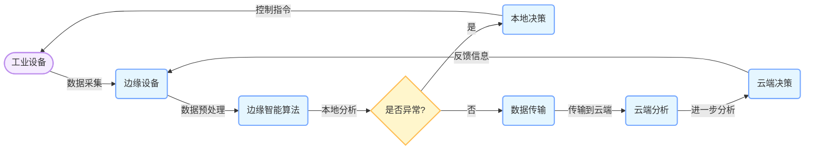

# 边缘智能在工业物联网实时监控中的关键作用

> 关键词：边缘智能、工业物联网、实时监控、数据分析、工业自动化

> 摘要：本文深入探讨了边缘智能在工业物联网实时监控中的关键作用。首先介绍了边缘智能和工业物联网实时监控的背景知识，包括目的、预期读者和文档结构。接着阐述了核心概念及其联系，通过示意图和流程图展示。详细讲解了核心算法原理和具体操作步骤，并结合Python代码进行说明。分析了相关的数学模型和公式，给出实际例子。通过项目实战展示代码实现和解读。探讨了边缘智能在工业物联网实时监控中的实际应用场景。推荐了学习资源、开发工具框架和相关论文著作。最后总结了未来发展趋势与挑战，并提供常见问题解答和扩展阅读参考资料，旨在为读者全面了解边缘智能在工业物联网实时监控中的作用提供深入的技术指导。

## 1. 背景介绍 
### 1.1 目的和范围
工业物联网（IIoT）的发展使得大量的设备和传感器连接在一起，产生了海量的数据。实时监控这些数据对于工业生产的高效运行、故障预警和质量控制至关重要。边缘智能作为一种新兴技术，将计算和数据处理能力靠近数据源，能够在本地快速处理数据，减少数据传输延迟，提高系统的响应速度和可靠性。本文的目的是详细探讨边缘智能在工业物联网实时监控中的关键作用，包括其核心概念、算法原理、实际应用场景等方面。范围涵盖了从边缘智能的基本原理到具体的代码实现和实际项目案例，旨在为读者提供全面深入的技术知识和实践指导。

### 1.2 预期读者
本文预期读者包括工业物联网领域的工程师、技术专家、研究人员以及对边缘智能和工业自动化感兴趣的技术爱好者。对于从事工业监控系统开发、数据分析和人工智能应用的专业人士，本文将提供有价值的技术参考和实践经验。对于初学者，本文的详细讲解和案例分析将有助于他们快速理解边缘智能在工业物联网实时监控中的应用。

### 1.3 文档结构概述
本文将按照以下结构进行组织：首先介绍边缘智能和工业物联网实时监控的相关背景知识，包括术语定义和概念解释。接着阐述核心概念及其联系，通过文本示意图和Mermaid流程图展示。详细讲解核心算法原理和具体操作步骤，并结合Python代码进行说明。分析相关的数学模型和公式，给出实际例子。通过项目实战展示代码实现和解读。探讨边缘智能在工业物联网实时监控中的实际应用场景。推荐学习资源、开发工具框架和相关论文著作。最后总结未来发展趋势与挑战，提供常见问题解答和扩展阅读参考资料。

### 1.4 术语表
#### 1.4.1 核心术语定义
- **边缘智能（Edge Intelligence）**：将人工智能算法和技术部署在边缘设备上，使边缘设备能够在本地进行数据处理、分析和决策，减少对云端的依赖。
- **工业物联网（Industrial Internet of Things, IIoT）**：将工业设备、传感器、机器和人员通过网络连接起来，实现数据的采集、传输和分析，以提高工业生产的效率和质量。
- **实时监控（Real-time Monitoring）**：对工业生产过程中的各种参数和状态进行实时采集、分析和展示，以便及时发现异常情况并采取相应的措施。
- **边缘设备（Edge Device）**：位于网络边缘的设备，如传感器、网关、工业计算机等，能够采集数据并进行本地处理。
- **云端（Cloud）**：提供大规模计算和存储资源的远程数据中心，用于处理和存储大量的数据。

#### 1.4.2 相关概念解释
- **雾计算（Fog Computing）**：与边缘计算类似，雾计算强调在网络边缘进行数据处理和分析，但更侧重于提供分布式的计算和存储资源，以支持大规模的物联网应用。
- **人工智能（Artificial Intelligence, AI）**：使计算机系统能够模拟人类智能的技术，包括机器学习、深度学习、自然语言处理等。
- **机器学习（Machine Learning, ML）**：一种人工智能技术，通过让计算机系统从数据中学习模式和规律，从而实现预测和决策。
- **深度学习（Deep Learning, DL）**：一种基于神经网络的机器学习技术，能够自动从大量数据中学习复杂的模式和特征。

#### 1.4.3 缩略词列表
- IIoT：Industrial Internet of Things
- AI：Artificial Intelligence
- ML：Machine Learning
- DL：Deep Learning

## 2. 核心概念与联系 

### 核心概念原理
边缘智能在工业物联网实时监控中的核心原理是将数据处理和分析能力从云端下移到边缘设备。传统的工业物联网架构中，传感器采集的数据需要传输到云端进行处理和分析，这会导致数据传输延迟和网络带宽压力。而边缘智能通过在边缘设备上部署机器学习和深度学习算法，能够在本地对数据进行实时处理和分析，减少数据传输量，提高系统的响应速度和可靠性。

边缘设备可以对采集到的数据进行预处理，如数据清洗、特征提取等，然后将处理后的数据传输到云端进行进一步的分析和存储。同时，边缘设备还可以根据本地的分析结果进行实时决策，如设备故障预警、生产过程控制等。这种分布式的处理架构能够充分利用边缘设备的计算资源，提高系统的整体性能。

### 架构的文本示意图
```plaintext
+-------------------+
|      云端         |
| （数据分析、存储） |
+-------------------+
        |
        | 数据传输
        |
+-------------------+
|    边缘网关        |
| （数据预处理、     |
|  部分分析、决策）  |
+-------------------+
        |
        | 数据采集
        |
+-------------------+
|    工业设备        |
| （传感器、执行器） |
+-------------------+
```

### Mermaid 流程图


## 3. 核心算法原理 & 具体操作步骤 

### 核心算法原理
在边缘智能中，常用的算法包括机器学习和深度学习算法，如决策树、支持向量机、神经网络等。这些算法可以用于数据分类、异常检测、预测分析等任务。

以异常检测为例，我们可以使用基于密度的聚类算法，如DBSCAN（Density-Based Spatial Clustering of Applications with Noise）。DBSCAN算法的核心思想是通过计算数据点之间的密度，将密度相连的数据点划分为一个簇，而密度较低的数据点则被视为噪声点。在工业物联网实时监控中，我们可以将正常数据点划分为一个或多个簇，当出现新的数据点时，如果该数据点不属于任何一个簇，则认为该数据点是异常点。

### 具体操作步骤
1. **数据采集**：从工业设备的传感器中采集数据，如温度、压力、振动等。
2. **数据预处理**：对采集到的数据进行清洗、归一化等处理，以提高数据的质量和可用性。
3. **模型训练**：使用历史数据对DBSCAN算法进行训练，确定簇的数量和密度阈值。
4. **实时监测**：将实时采集到的数据输入到训练好的模型中，判断数据点是否属于正常簇。
5. **异常报警**：如果检测到异常数据点，及时发出报警信息，并采取相应的措施。

### Python源代码详细阐述
```python
import numpy as np
from sklearn.cluster import DBSCAN
from sklearn.preprocessing import StandardScaler

# 模拟数据采集
def generate_data():
    # 生成正常数据
    normal_data = np.random.randn(100, 2)
    # 生成异常数据
    abnormal_data = np.random.randn(10, 2) + 5
    data = np.vstack((normal_data, abnormal_data))
    return data

# 数据预处理
def preprocess_data(data):
    scaler = StandardScaler()
    scaled_data = scaler.fit_transform(data)
    return scaled_data

# 模型训练
def train_model(data):
    dbscan = DBSCAN(eps=0.3, min_samples=5)
    dbscan.fit(data)
    return dbscan

# 实时监测
def real_time_monitoring(model, new_data):
    labels = model.fit_predict(new_data)
    abnormal_indices = np.where(labels == -1)[0]
    return abnormal_indices

# 主函数
def main():
    # 数据采集
    data = generate_data()
    # 数据预处理
    scaled_data = preprocess_data(data)
    # 模型训练
    model = train_model(scaled_data)
    # 模拟实时监测
    new_data = np.random.randn(10, 2)
    new_scaled_data = preprocess_data(new_data)
    abnormal_indices = real_time_monitoring(model, new_scaled_data)
    if len(abnormal_indices) > 0:
        print("检测到异常数据点：", abnormal_indices)
    else:
        print("未检测到异常数据点。")

if __name__ == "__main__":
    main()
```

## 4. 数学模型和公式 & 详细讲解 & 举例说明 

### DBSCAN算法的数学模型和公式
DBSCAN算法基于两个核心概念：邻域和密度。

#### 邻域
给定一个数据点 $p$ 和一个半径 $\epsilon$，$p$ 的 $\epsilon$-邻域定义为：
$$N_{\epsilon}(p) = \{q \in D | d(p, q) \leq \epsilon\}$$
其中，$D$ 是数据集，$d(p, q)$ 是数据点 $p$ 和 $q$ 之间的距离，通常使用欧几里得距离。

#### 密度
一个数据点 $p$ 的密度定义为其 $\epsilon$-邻域内的数据点数量：
$$\text{密度}(p) = |N_{\epsilon}(p)|$$

#### 核心点、边界点和噪声点
- **核心点（Core Point）**：如果一个数据点 $p$ 的 $\epsilon$-邻域内至少包含 $MinPts$ 个数据点，则称 $p$ 为核心点。
- **边界点（Border Point）**：如果一个数据点 $p$ 不是核心点，但它属于某个核心点的 $\epsilon$-邻域，则称 $p$ 为边界点。
- **噪声点（Noise Point）**：既不是核心点也不是边界点的数据点称为噪声点。

#### 簇的定义
一个簇是由一个核心点及其密度可达的数据点组成的集合。如果数据点 $p$ 和 $q$ 都在某个核心点的 $\epsilon$-邻域内，则称 $p$ 和 $q$ 是密度相连的，它们属于同一个簇。

### 详细讲解
DBSCAN算法的主要步骤如下：
1. 随机选择一个未被访问过的数据点 $p$。
2. 计算 $p$ 的 $\epsilon$-邻域内的数据点数量。
    - 如果数据点数量大于等于 $MinPts$，则 $p$ 是核心点，创建一个新的簇，并将 $p$ 及其 $\epsilon$-邻域内的数据点加入该簇。
    - 如果数据点数量小于 $MinPts$，则 $p$ 是噪声点，标记为未分类。
3. 递归地访问核心点的 $\epsilon$-邻域内的数据点，将它们加入到同一个簇中。
4. 重复步骤1-3，直到所有数据点都被访问过。

### 举例说明
假设我们有一个二维数据集 $D = \{(1, 1), (1.2, 1.2), (2, 2), (5, 5), (5.1, 5.1)\}$，我们选择 $\epsilon = 0.3$ 和 $MinPts = 2$。

- 对于数据点 $(1, 1)$，其 $\epsilon$-邻域内包含 $(1, 1)$ 和 $(1.2, 1.2)$，数据点数量为 2，因此 $(1, 1)$ 是核心点。
- 对于数据点 $(2, 2)$，其 $\epsilon$-邻域内只有 $(2, 2)$ 一个数据点，数据点数量为 1，因此 $(2, 2)$ 是噪声点。
- 对于数据点 $(5, 5)$，其 $\epsilon$-邻域内包含 $(5, 5)$ 和 $(5.1, 5.1)$，数据点数量为 2，因此 $(5, 5)$ 是核心点。

最终，数据集被划分为两个簇：$\{(1, 1), (1.2, 1.2)\}$ 和 $\{(5, 5), (5.1, 5.1)\}$，$(2, 2)$ 被标记为噪声点。

## 5. 项目实战：代码实际案例和详细解释说明 

### 5.1  开发环境搭建
#### 硬件环境
- 边缘设备：可以选择 Raspberry Pi、NVIDIA Jetson Nano 等单板计算机作为边缘设备。
- 传感器：根据实际需求选择合适的传感器，如温度传感器、压力传感器、振动传感器等。
- 网络设备：确保边缘设备能够连接到网络，如 Wi-Fi、以太网等。

#### 软件环境
- 操作系统：在边缘设备上安装 Linux 操作系统，如 Raspbian、Ubuntu 等。
- Python 环境：安装 Python 3.x 版本，并安装相关的库，如 NumPy、SciPy、Scikit-learn 等。
```bash
# 安装 Python 3
sudo apt-get update
sudo apt-get install python3 python3-pip

# 安装相关库
pip3 install numpy scipy scikit-learn
```

### 5.2  源代码详细实现和代码解读
以下是一个基于 Raspberry Pi 和温度传感器的工业物联网实时监控项目的代码实现：

```python
import time
import RPi.GPIO as GPIO
import numpy as np
from sklearn.cluster import DBSCAN
from sklearn.preprocessing import StandardScaler

# 模拟温度传感器读取数据
def read_temperature():
    # 这里使用随机数模拟传感器读取的数据
    temperature = np.random.uniform(20, 30)
    return temperature

# 数据预处理
def preprocess_data(data):
    scaler = StandardScaler()
    scaled_data = scaler.fit_transform(np.array(data).reshape(-1, 1))
    return scaled_data

# 模型训练
def train_model(data):
    dbscan = DBSCAN(eps=0.3, min_samples=5)
    dbscan.fit(data)
    return dbscan

# 实时监测
def real_time_monitoring(model, new_data):
    new_scaled_data = preprocess_data([new_data])
    labels = model.fit_predict(new_scaled_data)
    if labels[0] == -1:
        return True
    else:
        return False

# 主函数
def main():
    # 初始化数据列表
    temperature_data = []
    # 采集历史数据进行模型训练
    for i in range(100):
        temperature = read_temperature()
        temperature_data.append(temperature)
    # 数据预处理
    scaled_data = preprocess_data(temperature_data)
    # 模型训练
    model = train_model(scaled_data)
    # 实时监测
    while True:
        temperature = read_temperature()
        is_abnormal = real_time_monitoring(model, temperature)
        if is_abnormal:
            print("检测到异常温度：", temperature)
        else:
            print("温度正常：", temperature)
        time.sleep(1)

if __name__ == "__main__":
    try:
        main()
    except KeyboardInterrupt:
        GPIO.cleanup()
```

### 5.3  代码解读与分析
1. **数据采集**：`read_temperature` 函数模拟温度传感器读取数据，实际应用中需要根据传感器的接口协议进行数据读取。
2. **数据预处理**：`preprocess_data` 函数使用 `StandardScaler` 对数据进行归一化处理，将数据转换为均值为 0，标准差为 1 的标准正态分布。
3. **模型训练**：`train_model` 函数使用 DBSCAN 算法对历史数据进行训练，确定正常数据的簇。
4. **实时监测**：`real_time_monitoring` 函数将实时采集到的温度数据输入到训练好的模型中，判断是否为异常数据。
5. **主函数**：`main` 函数首先采集历史数据进行模型训练，然后进入实时监测循环，每隔 1 秒采集一次温度数据，并进行异常检测。

## 6. 实际应用场景 
### 设备故障预警
在工业生产中，设备故障会导致生产中断和经济损失。通过在边缘设备上部署边缘智能算法，可以实时监测设备的运行状态，如温度、振动、电流等参数。当检测到异常数据时，及时发出预警信息，通知维修人员进行检修，避免设备故障的发生。

### 生产过程控制
边缘智能可以实时分析生产过程中的数据，如生产速度、质量指标等，根据分析结果自动调整生产参数，实现生产过程的优化和控制。例如，在自动化生产线上，根据产品的质量检测结果，实时调整生产速度和工艺参数，提高产品的质量和生产效率。

### 能源管理
工业生产过程中消耗大量的能源，通过边缘智能可以实时监测能源的使用情况，如电力、水、气等。分析能源消耗的规律和趋势，提出节能建议和措施，实现能源的合理利用和节约。

### 质量控制
在工业生产中，产品质量是企业的生命线。边缘智能可以实时监测生产过程中的质量数据，如尺寸、形状、表面缺陷等。通过对质量数据的分析和比对，及时发现产品质量问题，并采取相应的措施进行调整和改进，提高产品的质量和合格率。

## 7. 工具和资源推荐
### 7.1 学习资源推荐
#### 7.1.1 书籍推荐
- 《工业物联网：技术与应用》：全面介绍了工业物联网的技术架构、应用场景和发展趋势。
- 《Python 机器学习实战》：详细讲解了 Python 在机器学习领域的应用，包括数据预处理、模型训练和评估等。
- 《深度学习》：深度学习领域的经典教材，介绍了深度学习的基本原理和算法。

#### 7.1.2 在线课程
- Coursera 上的 “工业物联网基础” 课程：由知名高校和企业的专家授课，系统介绍了工业物联网的技术和应用。
- edX 上的 “机器学习” 课程：由斯坦福大学的教授授课，深入讲解了机器学习的算法和原理。
- 阿里云开发者社区的 “边缘计算实战营”：提供了边缘计算的实践案例和开发教程。

#### 7.1.3 技术博客和网站
- IEEE Internet of Things Journal：发表工业物联网领域的最新研究成果和技术文章。
- Edge Computing Journal：专注于边缘计算领域的技术和应用，提供最新的行业动态和技术文章。
- 开源中国：国内知名的开源技术社区，提供了丰富的开源项目和技术文章。

### 7.2 开发工具框架推荐
#### 7.2.1 IDE和编辑器
- PyCharm：专业的 Python 集成开发环境，提供了代码编辑、调试、版本控制等功能。
- Visual Studio Code：轻量级的代码编辑器，支持多种编程语言，具有丰富的插件生态系统。
- Jupyter Notebook：交互式的编程环境，适合进行数据分析和模型训练。

#### 7.2.2 调试和性能分析工具
- TensorBoard：TensorFlow 提供的可视化工具，用于监控模型训练过程和分析模型性能。
- Py-Spy：Python 性能分析工具，用于分析 Python 代码的性能瓶颈。
- GDB：通用的调试器，支持多种编程语言，可用于调试边缘设备上的程序。

#### 7.2.3 相关框架和库
- TensorFlow：开源的深度学习框架，提供了丰富的深度学习模型和工具。
- PyTorch：另一个流行的深度学习框架，具有动态图和易于使用的特点。
- Scikit-learn：Python 中的机器学习库，提供了各种机器学习算法和工具。

### 7.3 相关论文著作推荐
#### 7.3.1 经典论文
- “A Survey on Edge Computing: Vision, Challenges, and Opportunities”：对边缘计算的概念、技术和应用进行了全面的综述。
- “Industrial Internet of Things (IIoT): Challenges, Opportunities, and Directions”：探讨了工业物联网面临的挑战和机遇，提出了未来的发展方向。
- “Deep Learning in Industrial Internet of Things: A Survey”：介绍了深度学习在工业物联网中的应用现状和发展趋势。

#### 7.3.2 最新研究成果
- 关注 IEEE International Conference on Industrial Internet、ACM/IEEE Symposium on Edge Computing 等会议，获取边缘智能和工业物联网领域的最新研究成果。
- 查阅顶级学术期刊，如 IEEE Transactions on Industrial Informatics、ACM Transactions on Sensor Networks 等，了解最新的研究动态。

#### 7.3.3 应用案例分析
- 参考工业界的实际应用案例，如西门子、ABB 等公司的工业物联网解决方案，了解边缘智能在实际生产中的应用效果和经验教训。

## 8. 总结：未来发展趋势与挑战
### 未来发展趋势
- **智能化程度不断提高**：随着人工智能技术的不断发展，边缘智能将具备更强的自主学习和决策能力，能够自动适应不同的工业场景和需求。
- **与 5G 技术深度融合**：5G 技术的高速率、低延迟和大容量特点将为边缘智能提供更强大的网络支持，加速边缘智能在工业物联网中的应用。
- **边缘智能与云计算协同发展**：边缘智能和云计算将相互补充，形成更加高效的计算架构。边缘设备负责实时数据处理和决策，云端负责大数据分析和长期存储。
- **行业应用不断拓展**：边缘智能将在更多的工业领域得到应用，如智能制造、智能物流、智能能源等，推动工业数字化转型。

### 挑战
- **数据安全和隐私问题**：边缘设备直接处理和存储大量的工业数据，数据安全和隐私保护面临着严峻的挑战。需要采取有效的加密和访问控制措施，确保数据的安全性。
- **计算资源有限**：边缘设备的计算资源相对有限，如何在有限的资源下实现高效的边缘智能算法是一个挑战。需要优化算法结构和模型参数，降低计算复杂度。
- **标准和规范缺乏**：目前边缘智能和工业物联网领域缺乏统一的标准和规范，不同厂商的设备和系统之间存在兼容性问题。需要加强标准制定和行业合作，推动技术的标准化和规范化。
- **人才短缺**：边缘智能和工业物联网是新兴领域，相关的专业人才短缺。需要加强人才培养和教育，提高从业人员的技术水平和创新能力。

## 9. 附录：常见问题与解答
### 问题 1：边缘智能和云计算有什么区别？
边缘智能将计算和数据处理能力靠近数据源，在本地进行实时数据处理和决策，减少数据传输延迟。而云计算将数据集中存储和处理在云端数据中心，适合处理大规模的数据和复杂的计算任务。边缘智能和云计算可以相互补充，形成更加高效的计算架构。

### 问题 2：边缘智能在工业物联网实时监控中的优势是什么？
边缘智能在工业物联网实时监控中的优势包括：
- 减少数据传输延迟，提高系统的响应速度。
- 降低网络带宽压力，减少数据传输成本。
- 提高数据安全性和隐私保护，避免数据在传输过程中被泄露。
- 支持离线运行，在网络故障或不稳定的情况下仍能正常工作。

### 问题 3：如何选择适合的边缘设备？
选择适合的边缘设备需要考虑以下因素：
- 计算能力：根据实际应用的需求，选择具有足够计算能力的边缘设备。
- 存储容量：确保边缘设备具有足够的存储容量，以存储采集到的数据和运行的模型。
- 通信接口：根据传感器和网络的要求，选择具有合适通信接口的边缘设备。
- 功耗和成本：考虑边缘设备的功耗和成本，选择性价比高的设备。

### 问题 4：边缘智能算法的训练数据从哪里获取？
边缘智能算法的训练数据可以从以下几个方面获取：
- 历史数据：从工业设备的日志记录和监控系统中获取历史数据。
- 模拟数据：通过模拟工业生产过程，生成模拟数据。
- 实时数据：在实际应用中，实时采集数据并进行标注，用于模型的更新和优化。

## 10. 扩展阅读 & 参考资料
- 《工业 4.0：正在发生的未来》
- 《物联网导论》
- IEEE 官方网站：https://www.ieee.org/
- ACM 官方网站：https://www.acm.org/
- 边缘计算产业联盟官方网站：https://www.edgecomputing.org.cn/

作者：AI天才研究院/AI Genius Institute & 禅与计算机程序设计艺术 /Zen And The Art of Computer Programming