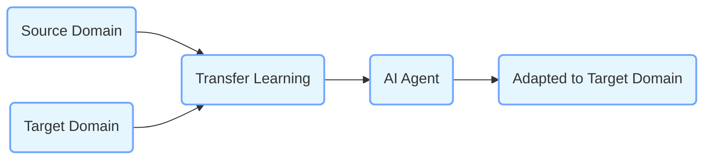

# 迁移学习在AI Agent领域适应中的应用

> 关键词：迁移学习、AI Agent、领域适应、机器学习、知识迁移

> 摘要：本文聚焦于迁移学习在AI Agent领域适应中的应用。首先介绍了相关背景，包括目的范围、预期读者等内容。接着阐述迁移学习与AI Agent的核心概念及联系，通过文本示意图和Mermaid流程图进行直观展示。详细讲解了核心算法原理和具体操作步骤，并给出Python源代码。分析了相关的数学模型和公式，辅以举例说明。通过项目实战，展示了代码实际案例并进行详细解释。探讨了迁移学习在AI Agent领域适应中的实际应用场景，推荐了学习资源、开发工具框架以及相关论文著作。最后总结了未来发展趋势与挑战，解答常见问题，并提供扩展阅读和参考资料，旨在为研究者和开发者在该领域的深入探索提供全面且深入的指导。

## 1. 背景介绍 
### 1.1 目的和范围
迁移学习在AI Agent领域适应中的应用研究目的在于解决AI Agent在不同领域环境下快速适应并有效工作的问题。传统的机器学习模型通常是针对特定领域进行训练的，当面临新的领域时，需要大量的标注数据重新训练，这不仅耗时耗力，而且在某些情况下数据获取困难。迁移学习可以将在一个或多个源领域中学习到的知识迁移到目标领域，从而减少目标领域所需的标注数据量，提高AI Agent在新领域的学习效率和性能。

本文章的范围涵盖迁移学习和AI Agent的基本概念、核心算法原理、数学模型、项目实战案例、实际应用场景，以及相关的工具和资源推荐等方面，旨在为读者提供一个全面且深入的关于迁移学习在AI Agent领域适应中应用的知识体系。

### 1.2 预期读者
本文的预期读者包括但不限于人工智能领域的研究者、机器学习工程师、数据科学家、相关专业的学生以及对迁移学习和AI Agent感兴趣的技术爱好者。对于有一定机器学习基础的读者，本文可以帮助他们深入理解迁移学习在AI Agent领域适应中的具体应用和技术细节；对于初学者，本文也会从基础概念开始讲解，引导他们逐步了解该领域的知识。

### 1.3 文档结构概述
本文将按照以下结构进行组织：
1. **背景介绍**：阐述文章的目的和范围、预期读者、文档结构概述以及相关术语表。
2. **核心概念与联系**：介绍迁移学习和AI Agent的核心概念，展示它们之间的联系，并通过文本示意图和Mermaid流程图进行直观呈现。
3. **核心算法原理 & 具体操作步骤**：详细讲解迁移学习在AI Agent领域适应中常用的核心算法原理，并给出具体的操作步骤和Python源代码示例。
4. **数学模型和公式 & 详细讲解 & 举例说明**：分析迁移学习和AI Agent相关的数学模型和公式，进行详细讲解并通过实际例子进行说明。
5. **项目实战：代码实际案例和详细解释说明**：通过一个具体的项目实战案例，展示如何在实际中应用迁移学习来帮助AI Agent适应新领域，包括开发环境搭建、源代码实现和代码解读。
6. **实际应用场景**：探讨迁移学习在AI Agent领域适应中的实际应用场景，如智能客服、自动驾驶、医疗诊断等。
7. **工具和资源推荐**：推荐学习迁移学习和AI Agent相关的书籍、在线课程、技术博客和网站，以及开发工具框架和相关论文著作。
8. **总结：未来发展趋势与挑战**：总结迁移学习在AI Agent领域适应中的应用现状，分析未来的发展趋势和面临的挑战。
9. **附录：常见问题与解答**：解答读者在学习和应用过程中可能遇到的常见问题。
10. **扩展阅读 & 参考资料**：提供相关的扩展阅读资料和参考书目，方便读者进一步深入学习。

### 1.4 术语表
#### 1.4.1 核心术语定义
- **迁移学习（Transfer Learning）**：是一种机器学习技术，它将在一个或多个源领域中学习到的知识迁移到目标领域，以提高目标领域的学习效率和性能。
- **AI Agent（人工智能代理）**：是一种能够感知环境、做出决策并采取行动以实现特定目标的人工智能实体。
- **领域适应（Domain Adaptation）**：是迁移学习的一个重要子领域，旨在解决源领域和目标领域之间存在差异的问题，使模型能够在目标领域中有效工作。
- **源领域（Source Domain）**：是指已经有大量标注数据且模型已经在该领域进行训练的领域。
- **目标领域（Target Domain）**：是指需要将源领域的知识迁移过来，以提高模型在该领域性能的领域。

#### 1.4.2 相关概念解释
- **特征表示学习**：是迁移学习中的一个重要概念，它的目的是学习一种通用的特征表示，使得源领域和目标领域的数据在该特征空间中具有相似的分布，从而便于知识的迁移。
- **模型微调**：是迁移学习中常用的一种方法，它通过在源领域预训练的模型基础上，使用目标领域的数据对模型的部分参数进行微调，以适应目标领域的任务。

#### 1.4.3 缩略词列表
- **ML（Machine Learning）**：机器学习
- **DL（Deep Learning）**：深度学习
- **CNN（Convolutional Neural Network）**：卷积神经网络
- **RNN（Recurrent Neural Network）**：循环神经网络
- **GAN（Generative Adversarial Network）**：生成对抗网络

## 2. 核心概念与联系 

### 2.1 迁移学习的核心概念
迁移学习的核心思想是利用源领域和目标领域之间的相关性，将源领域中学习到的知识迁移到目标领域，从而减少目标领域所需的标注数据量，提高模型在目标领域的学习效率和性能。迁移学习可以分为以下几种类型：
- **归纳式迁移学习（Inductive Transfer Learning）**：源领域和目标领域的任务不同，但有一些共享的特征或知识。例如，在图像分类任务中，源领域是动物图像分类，目标领域是植物图像分类，虽然任务不同，但可以共享一些图像特征提取的知识。
- **直推式迁移学习（Transductive Transfer Learning）**：源领域和目标领域的任务相同，但数据分布不同。例如，在情感分析任务中，源领域是电影评论的情感分析，目标领域是产品评论的情感分析，任务都是判断文本的情感倾向，但数据来源不同。
- **无监督迁移学习（Unsupervised Transfer Learning）**：目标领域没有标注数据，需要利用源领域的标注数据和目标领域的无标注数据进行知识迁移。

### 2.2 AI Agent的核心概念
AI Agent是一种能够感知环境、做出决策并采取行动以实现特定目标的人工智能实体。它通常由以下几个部分组成：
- **感知模块（Perception Module）**：用于感知环境中的信息，如传感器数据、图像、文本等。
- **决策模块（Decision-making Module）**：根据感知到的信息和预设的目标，做出决策。
- **行动模块（Action Module）**：根据决策结果采取相应的行动，如控制机器人的运动、发送消息等。

### 2.3 迁移学习与AI Agent的联系
迁移学习可以帮助AI Agent在不同领域环境下快速适应并有效工作。当AI Agent面临一个新的领域时，它可以利用迁移学习将在其他领域学习到的知识迁移过来，减少在新领域的学习时间和数据需求。例如，一个用于自动驾驶的AI Agent可以将在模拟环境中学习到的驾驶知识迁移到实际道路环境中，从而更快地适应实际驾驶任务。

### 2.4 文本示意图
```plaintext
+-----------------+          +-----------------+
|   Source Domain |          |   Target Domain |
| (Trained Model) |          | (New Environment)|
+-----------------+          +-----------------+
       |                            |
       |  Knowledge Transfer        |
       |                            |
+-----------------+          +-----------------+
|    Transfer      |          |    AI Agent     |
|    Learning      |          | (Adapted Model) |
+-----------------+          +-----------------+
```

### 2.5 Mermaid流程图


## 3. 核心算法原理 & 具体操作步骤 

### 3.1 基于特征表示学习的迁移学习算法原理
基于特征表示学习的迁移学习算法的核心思想是学习一种通用的特征表示，使得源领域和目标领域的数据在该特征空间中具有相似的分布。常用的方法有深度神经网络中的领域对抗训练（Domain Adversarial Training）。

#### 3.1.1 领域对抗训练原理
领域对抗训练通过引入一个领域分类器来区分数据是来自源领域还是目标领域，同时训练一个特征提取器来生成能够混淆领域分类器的特征表示。具体来说，特征提取器的目标是生成特征，使得领域分类器无法准确区分数据的来源；而领域分类器的目标是准确区分数据是来自源领域还是目标领域。通过这种对抗训练的方式，特征提取器可以学习到一种通用的特征表示，使得源领域和目标领域的数据在该特征空间中具有相似的分布。

#### 3.1.2 具体操作步骤
1. **数据准备**：收集源领域和目标领域的数据，将其分为训练集和测试集。
2. **模型构建**：构建一个特征提取器 $F$、一个领域分类器 $D$ 和一个任务分类器 $C$。特征提取器用于提取数据的特征表示，领域分类器用于区分数据的来源，任务分类器用于完成目标领域的任务。
3. **训练过程**：
    - 固定特征提取器 $F$ 和任务分类器 $C$，训练领域分类器 $D$，使其能够准确区分数据是来自源领域还是目标领域。
    - 固定领域分类器 $D$，训练特征提取器 $F$ 和任务分类器 $C$，使得特征提取器生成的特征能够混淆领域分类器，同时任务分类器在源领域数据上的性能得到优化。
    - 重复上述两个步骤，直到模型收敛。

#### 3.1.3 Python源代码示例
```python
import torch
import torch.nn as nn
import torch.optim as optim
from torch.utils.data import DataLoader, TensorDataset

# 定义特征提取器
class FeatureExtractor(nn.Module):
    def __init__(self):
        super(FeatureExtractor, self).__init__()
        self.fc1 = nn.Linear(10, 20)
        self.relu = nn.ReLU()
        self.fc2 = nn.Linear(20, 10)

    def forward(self, x):
        x = self.fc1(x)
        x = self.relu(x)
        x = self.fc2(x)
        return x

# 定义领域分类器
class DomainClassifier(nn.Module):
    def __init__(self):
        super(DomainClassifier, self).__init__()
        self.fc = nn.Linear(10, 1)
        self.sigmoid = nn.Sigmoid()

    def forward(self, x):
        x = self.fc(x)
        x = self.sigmoid(x)
        return x

# 定义任务分类器
class TaskClassifier(nn.Module):
    def __init__(self):
        super(TaskClassifier, self).__init__()
        self.fc = nn.Linear(10, 2)
        self.softmax = nn.Softmax(dim=1)

    def forward(self, x):
        x = self.fc(x)
        x = self.softmax(x)
        return x

# 生成模拟数据
source_data = torch.randn(100, 10)
source_labels = torch.randint(0, 2, (100,))
target_data = torch.randn(100, 10)

# 创建数据集和数据加载器
source_dataset = TensorDataset(source_data, source_labels)
source_loader = DataLoader(source_dataset, batch_size=10, shuffle=True)
target_loader = DataLoader(TensorDataset(target_data), batch_size=10, shuffle=True)

# 初始化模型
feature_extractor = FeatureExtractor()
domain_classifier = DomainClassifier()
task_classifier = TaskClassifier()

# 定义损失函数和优化器
domain_criterion = nn.BCELoss()
task_criterion = nn.CrossEntropyLoss()
optimizer = optim.Adam(list(feature_extractor.parameters()) + list(domain_classifier.parameters()) + list(task_classifier.parameters()), lr=0.001)

# 训练模型
num_epochs = 10
for epoch in range(num_epochs):
    for i, ((source_x, source_y), target_x) in enumerate(zip(source_loader, target_loader)):
        # 训练领域分类器
        optimizer.zero_grad()
        source_features = feature_extractor(source_x)
        target_features = feature_extractor(target_x)
        source_domain_labels = torch.ones(source_x.size(0), 1)
        target_domain_labels = torch.zeros(target_x.size(0), 1)
        domain_labels = torch.cat((source_domain_labels, target_domain_labels), dim=0)
        all_features = torch.cat((source_features, target_features), dim=0)
        domain_outputs = domain_classifier(all_features)
        domain_loss = domain_criterion(domain_outputs, domain_labels)
        domain_loss.backward(retain_graph=True)

        # 训练特征提取器和任务分类器
        task_outputs = task_classifier(source_features)
        task_loss = task_criterion(task_outputs, source_y)
        total_loss = task_loss - domain_loss
        total_loss.backward()
        optimizer.step()

    print(f'Epoch {epoch + 1}/{num_epochs}, Total Loss: {total_loss.item()}')
```

### 3.2 基于模型微调的迁移学习算法原理
基于模型微调的迁移学习算法的核心思想是在源领域预训练的模型基础上，使用目标领域的数据对模型的部分参数进行微调，以适应目标领域的任务。这种方法通常适用于源领域和目标领域的任务具有一定的相似性的情况。

#### 3.2.1 模型微调原理
首先，在源领域上使用大量的数据对模型进行预训练，得到一个预训练模型。然后，将预训练模型的部分或全部参数作为初始化参数，在目标领域上使用少量的标注数据对模型进行微调。在微调过程中，可以选择固定模型的部分层，只对部分层的参数进行更新，以减少过拟合的风险。

#### 3.2.2 具体操作步骤
1. **预训练模型选择**：选择一个在源领域上预训练好的模型，如在ImageNet上预训练的ResNet模型。
2. **模型修改**：根据目标领域的任务，对预训练模型的最后一层进行修改，使其输出维度与目标领域的任务相匹配。
3. **数据准备**：收集目标领域的标注数据，将其分为训练集和测试集。
4. **微调过程**：
    - 固定模型的部分层，只对部分层的参数进行更新。可以通过设置`requires_grad`属性来控制哪些层的参数需要更新。
    - 使用目标领域的训练数据对模型进行微调，选择合适的损失函数和优化器进行训练。
    - 在训练过程中，可以根据验证集的性能调整模型的参数，避免过拟合。

#### 3.2.3 Python源代码示例
```python
import torch
import torch.nn as nn
import torch.optim as optim
from torchvision import models, datasets, transforms

# 数据预处理
transform = transforms.Compose([
    transforms.Resize(224),
    transforms.ToTensor(),
    transforms.Normalize(mean=[0.485, 0.456, 0.406], std=[0.229, 0.224, 0.225])
])

# 加载目标领域数据集
train_dataset = datasets.CIFAR10(root='./data', train=True, download=True, transform=transform)
train_loader = torch.utils.data.DataLoader(train_dataset, batch_size=32, shuffle=True)

# 加载预训练模型
model = models.resnet18(pretrained=True)

# 修改模型的最后一层
num_ftrs = model.fc.in_features
model.fc = nn.Linear(num_ftrs, 10)

# 固定模型的部分层
for param in model.parameters():
    param.requires_grad = False
for param in model.fc.parameters():
    param.requires_grad = True

# 定义损失函数和优化器
criterion = nn.CrossEntropyLoss()
optimizer = optim.SGD(model.fc.parameters(), lr=0.001, momentum=0.9)

# 训练模型
num_epochs = 10
device = torch.device("cuda:0" if torch.cuda.is_available() else "cpu")
model.to(device)

for epoch in range(num_epochs):
    running_loss = 0.0
    for i, (images, labels) in enumerate(train_loader):
        images, labels = images.to(device), labels.to(device)

        optimizer.zero_grad()
        outputs = model(images)
        loss = criterion(outputs, labels)
        loss.backward()
        optimizer.step()

        running_loss += loss.item()

    print(f'Epoch {epoch + 1}/{num_epochs}, Loss: {running_loss / len(train_loader)}')
```

## 4. 数学模型和公式 & 详细讲解 & 举例说明 

### 4.1 领域对抗训练的数学模型和公式
#### 4.1.1 数学模型
在领域对抗训练中，我们有一个特征提取器 $F$、一个领域分类器 $D$ 和一个任务分类器 $C$。设源领域的数据为 $X_s$，标签为 $Y_s$，目标领域的数据为 $X_t$。特征提取器将输入数据 $x$ 映射到特征空间 $z = F(x)$，领域分类器根据特征 $z$ 输出数据来自源领域的概率 $D(z)$，任务分类器根据特征 $z$ 输出任务的预测结果 $C(z)$。

#### 4.1.2 损失函数
- **领域分类器的损失函数**：领域分类器的目标是准确区分数据是来自源领域还是目标领域，因此使用二元交叉熵损失函数。
$$L_D = -\frac{1}{n_s + n_t} \left( \sum_{i=1}^{n_s} \log D(F(x_s^i)) + \sum_{j=1}^{n_t} \log (1 - D(F(x_t^j))) \right)$$
其中，$n_s$ 和 $n_t$ 分别是源领域和目标领域的数据数量，$x_s^i$ 和 $x_t^j$ 分别是源领域和目标领域的第 $i$ 个和第 $j$ 个数据。

- **任务分类器的损失函数**：任务分类器的目标是在源领域数据上进行准确的分类，因此使用交叉熵损失函数。
$$L_C = -\frac{1}{n_s} \sum_{i=1}^{n_s} \sum_{k=1}^{K} y_s^{i,k} \log C(F(x_s^i))_k$$
其中，$K$ 是任务的类别数，$y_s^{i,k}$ 是源领域第 $i$ 个数据的第 $k$ 个类别的真实标签（one-hot编码）。

- **特征提取器的损失函数**：特征提取器的目标是生成能够混淆领域分类器的特征表示，同时在源领域数据上使任务分类器的性能得到优化，因此其损失函数为：
$$L_F = L_C - \lambda L_D$$
其中，$\lambda$ 是一个超参数，用于平衡任务分类器的损失和领域分类器的损失。

#### 4.1.3 举例说明
假设我们有一个源领域数据集包含100个图像，分为猫和狗两类，目标领域数据集包含50个图像。特征提取器将图像映射到一个10维的特征空间，领域分类器输出数据来自源领域的概率，任务分类器输出图像是猫还是狗的概率。在训练过程中，领域分类器会尝试区分源领域和目标领域的图像，而特征提取器会尝试生成特征，使得领域分类器无法准确区分。通过不断迭代，特征提取器可以学习到一种通用的特征表示，使得源领域和目标领域的图像在该特征空间中具有相似的分布。

### 4.2 模型微调的数学模型和公式
#### 4.2.1 数学模型
在模型微调中，我们有一个预训练模型 $M$，其参数为 $\theta$。在源领域上预训练得到的参数为 $\theta_0$，在目标领域上微调时，我们使用目标领域的数据对部分参数进行更新。设目标领域的损失函数为 $L(\theta; X_t, Y_t)$，其中 $X_t$ 和 $Y_t$ 分别是目标领域的数据和标签。

#### 4.2.2 优化目标
模型微调的优化目标是在目标领域上最小化损失函数，即：
$$\theta^* = \arg \min_{\theta} L(\theta; X_t, Y_t)$$
在微调过程中，我们通常使用随机梯度下降（SGD）或其变种（如Adam）来更新参数。参数更新的公式为：
$$\theta_{t+1} = \theta_t - \alpha \nabla_{\theta} L(\theta_t; X_t, Y_t)$$
其中，$\alpha$ 是学习率，$\nabla_{\theta} L(\theta_t; X_t, Y_t)$ 是损失函数关于参数 $\theta$ 在第 $t$ 步的梯度。

#### 4.2.3 举例说明
假设我们使用在ImageNet上预训练的ResNet模型进行目标领域的图像分类任务。预训练模型的参数已经在大规模的图像数据上进行了优化。在目标领域上，我们有一个包含1000个图像的数据集，分为10个类别。我们固定模型的前几层参数，只对最后一层的参数进行更新。在每一轮训练中，我们计算目标领域数据上的损失函数，然后使用随机梯度下降算法更新最后一层的参数，直到模型在目标领域上的性能达到满意的程度。

## 5. 项目实战：代码实际案例和详细解释说明 

### 5.1  开发环境搭建
#### 5.1.1 操作系统
推荐使用Linux系统，如Ubuntu 18.04或更高版本，因为Linux系统在机器学习和深度学习开发中具有良好的兼容性和性能。

#### 5.1.2 Python环境
安装Python 3.7或更高版本，可以使用Anaconda来管理Python环境。Anaconda是一个流行的Python发行版，它包含了许多常用的科学计算和机器学习库。

#### 5.1.3 深度学习框架
使用PyTorch作为深度学习框架，它是一个开源的深度学习框架，具有动态图的特性，易于使用和调试。可以使用以下命令安装PyTorch：
```bash
pip install torch torchvision
```

#### 5.1.4 其他依赖库
安装其他必要的依赖库，如NumPy、Pandas、Matplotlib等：
```bash
pip install numpy pandas matplotlib
```

### 5.2  源代码详细实现和代码解读
#### 5.2.1 项目背景
我们将实现一个基于迁移学习的图像分类项目，使用在ImageNet上预训练的ResNet模型对CIFAR-10数据集进行分类。CIFAR-10数据集包含10个类别的60000张彩色图像，每个类别有6000张图像，分为50000张训练图像和10000张测试图像。

#### 5.2.2 源代码实现
```python
import torch
import torch.nn as nn
import torch.optim as optim
from torchvision import models, datasets, transforms
import matplotlib.pyplot as plt

# 数据预处理
transform = transforms.Compose([
    transforms.Resize(224),
    transforms.ToTensor(),
    transforms.Normalize(mean=[0.485, 0.456, 0.406], std=[0.229, 0.224, 0.225])
])

# 加载CIFAR-10数据集
train_dataset = datasets.CIFAR10(root='./data', train=True, download=True, transform=transform)
test_dataset = datasets.CIFAR10(root='./data', train=False, download=True, transform=transform)

train_loader = torch.utils.data.DataLoader(train_dataset, batch_size=32, shuffle=True)
test_loader = torch.utils.data.DataLoader(test_dataset, batch_size=32, shuffle=False)

# 加载预训练模型
model = models.resnet18(pretrained=True)

# 修改模型的最后一层
num_ftrs = model.fc.in_features
model.fc = nn.Linear(num_ftrs, 10)

# 固定模型的部分层
for param in model.parameters():
    param.requires_grad = False
for param in model.fc.parameters():
    param.requires_grad = True

# 定义损失函数和优化器
criterion = nn.CrossEntropyLoss()
optimizer = optim.SGD(model.fc.parameters(), lr=0.001, momentum=0.9)

# 训练模型
num_epochs = 10
device = torch.device("cuda:0" if torch.cuda.is_available() else "cpu")
model.to(device)

train_losses = []
for epoch in range(num_epochs):
    running_loss = 0.0
    for i, (images, labels) in enumerate(train_loader):
        images, labels = images.to(device), labels.to(device)

        optimizer.zero_grad()
        outputs = model(images)
        loss = criterion(outputs, labels)
        loss.backward()
        optimizer.step()

        running_loss += loss.item()

    epoch_loss = running_loss / len(train_loader)
    train_losses.append(epoch_loss)
    print(f'Epoch {epoch + 1}/{num_epochs}, Loss: {epoch_loss}')

# 绘制训练损失曲线
plt.plot(train_losses)
plt.xlabel('Epoch')
plt.ylabel('Loss')
plt.title('Training Loss')
plt.show()

# 测试模型
model.eval()
correct = 0
total = 0
with torch.no_grad():
    for images, labels in test_loader:
        images, labels = images.to(device), labels.to(device)
        outputs = model(images)
        _, predicted = torch.max(outputs.data, 1)
        total += labels.size(0)
        correct += (predicted == labels).sum().item()

print(f'Test Accuracy: {100 * correct / total}%')
```

#### 5.2.3 代码解读
1. **数据预处理**：使用`transforms.Compose`函数定义了一系列的数据预处理操作，包括将图像调整为224x224的大小、将图像转换为张量、对图像进行归一化处理。
2. **数据集加载**：使用`torchvision.datasets.CIFAR10`加载CIFAR-10数据集，并使用`torch.utils.data.DataLoader`创建数据加载器。
3. **模型加载和修改**：使用`models.resnet18(pretrained=True)`加载在ImageNet上预训练的ResNet-18模型，并将模型的最后一层修改为一个全连接层，输出维度为10，以适应CIFAR-10数据集的10个类别。
4. **固定部分层**：通过设置`param.requires_grad = False`固定模型的部分层，只对最后一层的参数进行更新，减少计算量和过拟合的风险。
5. **损失函数和优化器**：使用交叉熵损失函数`nn.CrossEntropyLoss`和随机梯度下降优化器`optim.SGD`进行模型训练。
6. **训练过程**：在每个epoch中，遍历训练数据加载器，计算损失并进行反向传播和参数更新。记录每个epoch的训练损失，并在训练结束后绘制训练损失曲线。
7. **测试过程**：在测试阶段，将模型设置为评估模式，遍历测试数据加载器，计算模型的准确率。

### 5.3  代码解读与分析
#### 5.3.1 迁移学习的优势
通过使用在ImageNet上预训练的ResNet模型，我们可以利用在大规模数据集上学习到的特征表示，减少在CIFAR-10数据集上的训练时间和数据需求。预训练模型已经学习到了一些通用的图像特征，如边缘、纹理等，这些特征可以在不同的图像分类任务中复用。

#### 5.3.2 固定部分层的作用
固定模型的部分层可以减少过拟合的风险。在微调过程中，由于目标领域的数据量通常较少，如果对整个模型的参数进行更新，模型可能会过度拟合目标领域的数据。通过固定部分层，只对最后一层的参数进行更新，可以让模型在保留预训练模型的通用特征的同时，适应目标领域的特定任务。

#### 5.3.3 训练损失曲线分析
训练损失曲线可以反映模型的训练过程。如果损失曲线在训练过程中逐渐下降并趋于稳定，说明模型在不断学习和优化；如果损失曲线波动较大或出现上升趋势，可能是学习率设置过大或模型出现过拟合。通过观察训练损失曲线，我们可以调整模型的参数和训练策略，以提高模型的性能。

## 6. 实际应用场景 

### 6.1 智能客服
在智能客服领域，AI Agent需要处理各种不同领域的用户问题，如电商、金融、医疗等。不同领域的问题具有不同的语言表达方式和语义理解要求。使用迁移学习，AI Agent可以将在一个领域（如电商领域）学习到的语言理解和问题解答知识迁移到其他领域（如金融领域），减少在新领域的训练时间和数据需求，提高智能客服的响应速度和准确率。

### 6.2 自动驾驶
在自动驾驶领域，AI Agent需要在不同的道路环境和驾驶场景中进行决策和控制。不同地区的道路规则、交通标志和驾驶习惯可能存在差异。通过迁移学习，AI Agent可以将在一个地区（如城市道路）学习到的驾驶知识迁移到其他地区（如乡村道路），或者将在模拟环境中学习到的驾驶知识迁移到实际道路环境中，提高自动驾驶系统的适应性和安全性。

### 6.3 医疗诊断
在医疗诊断领域，AI Agent需要对不同类型的疾病进行诊断和分析。不同疾病的症状、图像特征和诊断方法可能存在差异。使用迁移学习，AI Agent可以将在一种疾病（如肺癌）的诊断中学习到的特征提取和分类知识迁移到其他疾病（如乳腺癌）的诊断中，减少在新疾病诊断中的数据标注工作量，提高医疗诊断的效率和准确性。

### 6.4 游戏AI
在游戏AI领域，AI Agent需要在不同的游戏环境和游戏规则中进行决策和行动。不同类型的游戏（如策略游戏、射击游戏）具有不同的玩法和挑战。通过迁移学习，AI Agent可以将在一个游戏（如围棋）中学习到的策略规划和决策方法迁移到其他游戏（如象棋）中，提高游戏AI的学习能力和适应性。

## 7. 工具和资源推荐
### 7.1 学习资源推荐
#### 7.1.1 书籍推荐
- 《机器学习》（周志华著）：这本书是机器学习领域的经典教材，系统地介绍了机器学习的基本概念、算法和应用。
- 《深度学习》（Ian Goodfellow、Yoshua Bengio和Aaron Courville著）：这本书是深度学习领域的权威著作，深入讲解了深度学习的理论和实践。
- 《迁移学习》（Qiang Yang和Sinno Jialin Pan著）：这本书专门介绍了迁移学习的基本概念、算法和应用，是学习迁移学习的重要参考书籍。

#### 7.1.2 在线课程
- Coursera上的“机器学习”课程（Andrew Ng教授）：这是一门非常经典的机器学习入门课程，讲解了机器学习的基本概念和算法。
- edX上的“深度学习”课程（由MIT等高校的教授授课）：该课程深入介绍了深度学习的理论和实践，包括神经网络、卷积神经网络、循环神经网络等。
- 网易云课堂上的“迁移学习实战”课程：该课程结合实际案例，讲解了迁移学习的算法和应用。

#### 7.1.3 技术博客和网站
- Medium：这是一个技术博客平台，上面有很多关于机器学习、深度学习和迁移学习的优秀文章。
- arXiv：这是一个预印本论文平台，上面可以找到最新的机器学习和迁移学习的研究成果。
- Kaggle：这是一个数据科学竞赛平台，上面有很多关于机器学习和迁移学习的开源代码和数据集。

### 7.2 开发工具框架推荐
#### 7.2.1 IDE和编辑器
- PyCharm：这是一个专业的Python集成开发环境，具有代码编辑、调试、版本控制等功能，非常适合机器学习和深度学习开发。
- Jupyter Notebook：这是一个交互式的开发环境，可以方便地进行代码编写、运行和可视化展示，常用于数据分析和机器学习实验。

#### 7.2.2 调试和性能分析工具
- TensorBoard：这是TensorFlow提供的一个可视化工具，可以用于可视化模型的训练过程、损失曲线、准确率等指标。
- PyTorch Profiler：这是PyTorch提供的一个性能分析工具，可以帮助开发者分析模型的性能瓶颈，优化代码。

#### 7.2.3 相关框架和库
- PyTorch：这是一个开源的深度学习框架，具有动态图的特性，易于使用和调试。
- TensorFlow：这是一个广泛使用的深度学习框架，具有强大的分布式训练和部署能力。
- Scikit-learn：这是一个常用的机器学习库，提供了各种机器学习算法和工具，如分类、回归、聚类等。

### 7.3 相关论文著作推荐
#### 7.3.1 经典论文
- “Domain Adaptation via Transfer Component Analysis”（Sinno Jialin Pan等）：这篇论文提出了一种基于迁移成分分析的领域适应方法，是领域适应领域的经典论文。
- “Unsupervised Domain Adaptation by Backpropagation”（Yaroslav Ganin和Victor Lempitsky）：这篇论文提出了领域对抗训练的方法，为迁移学习提供了一种新的思路。

#### 7.3.2 最新研究成果
- 可以关注arXiv上关于迁移学习和AI Agent的最新研究论文，了解该领域的最新发展动态。

#### 7.3.3 应用案例分析
- 可以在Kaggle上找到很多关于迁移学习在不同领域应用的案例分析，学习他人的实践经验。

## 8. 总结：未来发展趋势与挑战

### 8.1 未来发展趋势
#### 8.1.1 多领域迁移学习
未来，迁移学习将不仅仅局限于两个领域之间的知识迁移，而是会涉及多个领域的知识融合和迁移。例如，在一个复杂的智能系统中，AI Agent可能需要同时从图像、文本、语音等多个领域迁移知识，以更好地适应不同的任务和环境。

#### 8.1.2 自适应迁移学习
随着环境和任务的不断变化，AI Agent需要具备自适应迁移学习的能力。即能够自动识别源领域和目标领域之间的差异，动态调整迁移学习的策略和方法，以实现更高效的知识迁移。

#### 8.1.3 与其他技术的融合
迁移学习将与其他人工智能技术，如强化学习、元学习等进行更深入的融合。例如，将迁移学习与强化学习相结合，可以让AI Agent在不同的环境中更快地学习到最优策略；将迁移学习与元学习相结合，可以让模型在多个任务之间快速适应和泛化。

### 8.2 挑战
#### 8.2.1 领域差异问题
源领域和目标领域之间可能存在较大的差异，如数据分布差异、任务差异等。如何有效地处理这些差异，是迁移学习面临的一个重要挑战。目前的方法虽然在一定程度上可以缓解领域差异问题，但仍然存在局限性。

#### 8.2.2 数据隐私和安全问题
在迁移学习中，可能需要使用来自不同领域的数据。这些数据可能包含敏感信息，如个人隐私、商业机密等。如何在保证数据隐私和安全的前提下进行知识迁移，是一个需要解决的问题。

#### 8.2.3 模型可解释性问题
迁移学习模型通常是复杂的深度学习模型，其决策过程和知识迁移机制往往难以解释。在一些对模型可解释性要求较高的领域，如医疗诊断、金融风险评估等，如何提高迁移学习模型的可解释性是一个亟待解决的问题。

## 9. 附录：常见问题与解答

### 9.1 迁移学习一定能提高模型在目标领域的性能吗？
不一定。迁移学习的效果取决于源领域和目标领域之间的相关性、数据的质量和数量等因素。如果源领域和目标领域之间的相关性较低，或者源领域的数据存在偏差，迁移学习可能无法提高模型在目标领域的性能，甚至可能会降低性能。

### 9.2 如何选择合适的迁移学习方法？
选择合适的迁移学习方法需要考虑以下几个因素：
- 源领域和目标领域的任务和数据分布情况。如果任务相似但数据分布不同，可以选择基于领域适应的迁移学习方法；如果任务不同但有一些共享的特征，可以选择基于特征表示学习的迁移学习方法。
- 目标领域的数据量。如果目标领域的数据量较少，可以选择基于模型微调的迁移学习方法；如果目标领域没有标注数据，可以选择无监督迁移学习方法。
- 计算资源和时间限制。不同的迁移学习方法计算复杂度不同，需要根据实际情况选择合适的方法。

### 9.3 迁移学习中如何处理源领域和目标领域的数据差异？
可以采用以下方法处理源领域和目标领域的数据差异：
- 特征变换：通过特征变换将源领域和目标领域的数据映射到一个共同的特征空间，使得它们在该特征空间中具有相似的分布。
- 领域对抗训练：引入一个领域分类器来区分数据是来自源领域还是目标领域，同时训练一个特征提取器来生成能够混淆领域分类器的特征表示。
- 加权学习：对源领域和目标领域的数据进行加权，使得模型更加关注与目标领域相似的数据。

## 10. 扩展阅读 & 参考资料
### 10.1 扩展阅读
- “Transfer Learning for Deep Learning: A Survey”：这篇综述文章全面介绍了深度学习中的迁移学习方法和应用。
- “Meta-Learning: A Survey”：元学习是与迁移学习密切相关的一个领域，这篇综述文章介绍了元学习的基本概念、算法和应用。

### 10.2 参考资料
- Goodfellow, I., Bengio, Y., & Courville, A. (2016). Deep Learning. MIT Press.
- Zhou, Z. H. (2016). Machine Learning. Tsinghua University Press.
- Yang, Q., & Pan, S. J. (2010). A survey on transfer learning. IEEE Transactions on Knowledge and Data Engineering, 22(10), 1345-1359.

作者：AI天才研究院/AI Genius Institute & 禅与计算机程序设计艺术 /Zen And The Art of Computer Programming