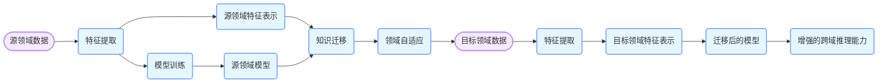

# 迁移学习在跨域推理能力增强中的创新方法

> 关键词：迁移学习、跨域推理能力、创新方法、知识迁移、领域自适应

> 摘要：本文聚焦于迁移学习在跨域推理能力增强方面的创新方法。首先介绍了迁移学习和跨域推理的背景知识，明确文章的目的、范围、预期读者和文档结构。接着阐述核心概念与联系，通过文本示意图和Mermaid流程图展示其原理和架构。详细讲解核心算法原理，用Python代码实现关键步骤。引入数学模型和公式，结合实例进行说明。通过项目实战展示代码实现和解读。探讨实际应用场景，推荐相关工具和资源。最后总结未来发展趋势与挑战，解答常见问题并提供扩展阅读和参考资料，旨在为提升跨域推理能力提供新的思路和方法。

## 1. 背景介绍 
### 1.1 目的和范围
迁移学习旨在将一个或多个源领域的知识迁移到目标领域，以提升目标领域的学习性能。在实际应用中，不同领域的数据往往具有不同的分布和特征，传统的机器学习方法在处理跨域问题时面临诸多挑战。本文的目的是探讨迁移学习在增强跨域推理能力方面的创新方法，涵盖从理论原理到实际应用的多个方面，包括核心概念、算法原理、数学模型、项目实战等内容。

### 1.2 预期读者
本文适合对机器学习、迁移学习和跨域推理感兴趣的研究人员、工程师和学生阅读。对于希望深入了解迁移学习技术在跨域问题中应用的专业人士，本文提供了系统的知识体系和创新方法的介绍；对于初学者，本文从基础概念出发，逐步引导读者理解复杂的技术原理和实际应用。

### 1.3 文档结构概述
本文将按照以下结构进行组织：首先介绍迁移学习和跨域推理的核心概念与联系，通过示意图和流程图直观展示其原理；接着详细讲解核心算法原理，并给出Python代码实现；引入数学模型和公式，结合具体例子进行说明；通过项目实战展示代码的实际应用和详细解读；探讨迁移学习在不同领域的实际应用场景；推荐相关的学习资源、开发工具和论文著作；最后总结未来发展趋势与挑战，解答常见问题并提供扩展阅读和参考资料。

### 1.4 术语表
#### 1.4.1 核心术语定义
- **迁移学习（Transfer Learning）**：是一种机器学习技术，它将从一个或多个源领域学到的知识迁移到目标领域，以改善目标领域的学习效果。
- **跨域推理（Cross - Domain Reasoning）**：指在不同领域的数据和任务之间进行推理和决策的能力，克服领域差异带来的挑战。
- **领域自适应（Domain Adaptation）**：是迁移学习的一种具体方法，旨在减少源领域和目标领域之间的分布差异，使模型能够在目标领域中更好地工作。
- **知识迁移（Knowledge Transfer）**：将源领域的知识、模式或特征信息传递到目标领域的过程。

#### 1.4.2 相关概念解释
- **源领域（Source Domain）**：是指已经有大量标注数据和知识的领域，是知识的提供者。
- **目标领域（Target Domain）**：是指需要应用迁移学习来提升性能的领域，通常数据较少或标注成本较高。
- **特征表示（Feature Representation）**：将原始数据转换为适合机器学习模型处理的特征向量的过程，良好的特征表示有助于迁移学习的效果。

#### 1.4.3 缩略词列表
- **ML（Machine Learning）**：机器学习
- **DL（Deep Learning）**：深度学习
- **DA（Domain Adaptation）**：领域自适应
- **TL（Transfer Learning）**：迁移学习

## 2. 核心概念与联系 
### 核心概念原理
迁移学习的核心思想是利用源领域和目标领域之间的相似性，将源领域的知识迁移到目标领域。在跨域推理中，由于不同领域的数据分布和特征不同，直接将源领域的模型应用到目标领域往往效果不佳。因此，需要通过迁移学习的方法来调整模型，使其能够适应目标领域的特点。

领域自适应是迁移学习中常用的方法之一，它通过减少源领域和目标领域之间的分布差异，使得模型在目标领域中能够更好地进行推理。具体来说，领域自适应可以通过特征变换、对抗训练等方法来实现。

知识迁移是迁移学习的关键过程，它可以分为不同的层次，如特征级迁移、模型级迁移和实例级迁移。特征级迁移是指将源领域的特征表示迁移到目标领域，模型级迁移是指将源领域的模型结构和参数迁移到目标领域，实例级迁移是指将源领域的部分实例迁移到目标领域。

### 架构的文本示意图
```plaintext
源领域数据
|
|-- 特征提取
|   |-- 源领域特征表示
|
|-- 模型训练
|   |-- 源领域模型
|
|-- 知识迁移
|   |-- 特征级迁移
|   |-- 模型级迁移
|   |-- 实例级迁移
|
|-- 领域自适应
|   |-- 特征变换
|   |-- 对抗训练
|
目标领域数据
|
|-- 特征提取
|   |-- 目标领域特征表示
|
|-- 迁移后的模型
|   |-- 增强的跨域推理能力
```

### Mermaid流程图


## 3. 核心算法原理 & 具体操作步骤 
### 核心算法原理
这里我们介绍一种基于对抗训练的领域自适应算法，其核心思想是通过一个判别器来区分源领域和目标领域的数据，同时让生成器（即特征提取器）生成的特征能够迷惑判别器，从而减少源领域和目标领域之间的分布差异。

### 具体操作步骤
1. **数据准备**：收集源领域和目标领域的数据，并进行预处理，如归一化、特征提取等。
2. **模型构建**：构建特征提取器、分类器和判别器。特征提取器用于提取数据的特征，分类器用于对目标领域的数据进行分类，判别器用于区分源领域和目标领域的数据。
3. **训练过程**：
    - 固定特征提取器和分类器，训练判别器，使其能够准确区分源领域和目标领域的数据。
    - 固定判别器，训练特征提取器和分类器，使其生成的特征能够迷惑判别器，同时提高分类器在目标领域的分类性能。
4. **迭代训练**：重复步骤3，直到模型收敛。

### Python源代码实现
```python
import torch
import torch.nn as nn
import torch.optim as optim
from torch.utils.data import DataLoader, TensorDataset

# 定义特征提取器
class FeatureExtractor(nn.Module):
    def __init__(self):
        super(FeatureExtractor, self).__init__()
        self.fc1 = nn.Linear(10, 20)
        self.relu = nn.ReLU()

    def forward(self, x):
        x = self.fc1(x)
        x = self.relu(x)
        return x

# 定义分类器
class Classifier(nn.Module):
    def __init__(self):
        super(Classifier, self).__init__()
        self.fc2 = nn.Linear(20, 2)

    def forward(self, x):
        x = self.fc2(x)
        return x

# 定义判别器
class Discriminator(nn.Module):
    def __init__(self):
        super(Discriminator, self).__init__()
        self.fc3 = nn.Linear(20, 1)
        self.sigmoid = nn.Sigmoid()

    def forward(self, x):
        x = self.fc3(x)
        x = self.sigmoid(x)
        return x

# 生成示例数据
source_data = torch.randn(100, 10)
source_labels = torch.randint(0, 2, (100,))
target_data = torch.randn(100, 10)

# 创建数据集和数据加载器
source_dataset = TensorDataset(source_data, source_labels)
source_loader = DataLoader(source_dataset, batch_size=10, shuffle=True)
target_loader = DataLoader(target_data, batch_size=10, shuffle=True)

# 初始化模型
feature_extractor = FeatureExtractor()
classifier = Classifier()
discriminator = Discriminator()

# 定义损失函数和优化器
class_criterion = nn.CrossEntropyLoss()
domain_criterion = nn.BCELoss()
feature_optimizer = optim.Adam(feature_extractor.parameters(), lr=0.001)
classifier_optimizer = optim.Adam(classifier.parameters(), lr=0.001)
discriminator_optimizer = optim.Adam(discriminator.parameters(), lr=0.001)

# 训练过程
num_epochs = 10
for epoch in range(num_epochs):
    for i, (source_batch, source_labels_batch) in enumerate(source_loader):
        # 训练判别器
        discriminator_optimizer.zero_grad()
        source_features = feature_extractor(source_batch)
        source_domain_labels = torch.ones(source_features.size(0), 1)
        source_domain_output = discriminator(source_features.detach())
        source_domain_loss = domain_criterion(source_domain_output, source_domain_labels)

        target_batch = next(iter(target_loader))
        target_features = feature_extractor(target_batch)
        target_domain_labels = torch.zeros(target_features.size(0), 1)
        target_domain_output = discriminator(target_features.detach())
        target_domain_loss = domain_criterion(target_domain_output, target_domain_labels)

        domain_loss = source_domain_loss + target_domain_loss
        domain_loss.backward()
        discriminator_optimizer.step()

        # 训练特征提取器和分类器
        feature_optimizer.zero_grad()
        classifier_optimizer.zero_grad()
        source_features = feature_extractor(source_batch)
        source_class_output = classifier(source_features)
        source_class_loss = class_criterion(source_class_output, source_labels_batch)

        target_features = feature_extractor(target_batch)
        target_domain_labels = torch.ones(target_features.size(0), 1)
        target_domain_output = discriminator(target_features)
        target_domain_loss = domain_criterion(target_domain_output, target_domain_labels)

        total_loss = source_class_loss + target_domain_loss
        total_loss.backward()
        feature_optimizer.step()
        classifier_optimizer.step()

    print(f'Epoch {epoch+1}/{num_epochs}, Total Loss: {total_loss.item()}')
```

## 4. 数学模型和公式 & 详细讲解 & 举例说明 
### 数学模型和公式
#### 损失函数
在上述基于对抗训练的领域自适应算法中，主要有两个损失函数：分类损失和领域判别损失。

分类损失使用交叉熵损失函数，用于衡量分类器的预测结果与真实标签之间的差异。对于源领域的数据 $(x_i, y_i)$，分类损失的计算公式为：

$$L_{class} = -\frac{1}{N_s}\sum_{i=1}^{N_s} \sum_{j=1}^{C} y_{ij} \log(p_{ij})$$

其中，$N_s$ 是源领域数据的数量，$C$ 是类别数，$y_{ij}$ 是第 $i$ 个样本的真实标签的第 $j$ 个分量，$p_{ij}$ 是分类器对第 $i$ 个样本预测为第 $j$ 类的概率。

领域判别损失使用二元交叉熵损失函数，用于衡量判别器对源领域和目标领域数据的区分能力。对于源领域数据的特征 $f_s$ 和目标领域数据的特征 $f_t$，领域判别损失的计算公式为：

$$L_{domain} = -\frac{1}{N_s}\sum_{i=1}^{N_s} \log(D(f_{s_i})) - \frac{1}{N_t}\sum_{i=1}^{N_t} \log(1 - D(f_{t_i}))$$

其中，$N_s$ 和 $N_t$ 分别是源领域和目标领域数据的数量，$D(f)$ 是判别器对特征 $f$ 的输出，表示该特征属于源领域的概率。

#### 总损失
总损失是分类损失和领域判别损失的加权和，计算公式为：

$$L_{total} = L_{class} + \lambda L_{domain}$$

其中，$\lambda$ 是领域判别损失的权重系数，用于控制领域自适应的强度。

### 详细讲解
分类损失的目的是让分类器能够准确地对源领域的数据进行分类，通过最小化分类损失，分类器可以学习到数据的类别特征。领域判别损失的目的是让判别器能够准确地区分源领域和目标领域的数据，同时让特征提取器生成的特征能够迷惑判别器，从而减少源领域和目标领域之间的分布差异。总损失则综合考虑了分类性能和领域自适应的效果，通过调整 $\lambda$ 的值，可以平衡两者之间的关系。

### 举例说明
假设我们有一个源领域数据集，包含100个样本，分为2类，目标领域数据集包含100个样本。在训练过程中，我们首先固定特征提取器和分类器，训练判别器。判别器的目标是尽可能准确地区分源领域和目标领域的数据，因此它会学习到源领域和目标领域特征的分布差异。然后，我们固定判别器，训练特征提取器和分类器。特征提取器的目标是生成能够迷惑判别器的特征，同时分类器的目标是提高在源领域数据上的分类性能。通过不断迭代训练，模型可以逐渐适应目标领域的数据分布，提高跨域推理能力。

## 5. 项目实战：代码实际案例和详细解释说明 
### 5.1  开发环境搭建
#### 操作系统
建议使用 Linux 或 macOS 操作系统，这些操作系统对 Python 和深度学习框架的支持较好。

#### Python 环境
安装 Python 3.7 或以上版本，可以使用 Anaconda 来管理 Python 环境。

#### 深度学习框架
安装 PyTorch 深度学习框架，可以根据自己的显卡情况选择合适的版本。可以使用以下命令安装：
```sh
pip install torch torchvision
```

#### 其他依赖库
安装 numpy、matplotlib 等常用的 Python 库：
```sh
pip install numpy matplotlib
```

### 5.2  源代码详细实现和代码解读
以下是一个完整的基于对抗训练的领域自适应项目实战代码：
```python
import torch
import torch.nn as nn
import torch.optim as optim
from torch.utils.data import DataLoader, TensorDataset
import numpy as np
import matplotlib.pyplot as plt

# 定义特征提取器
class FeatureExtractor(nn.Module):
    def __init__(self):
        super(FeatureExtractor, self).__init__()
        self.fc1 = nn.Linear(10, 20)
        self.relu = nn.ReLU()

    def forward(self, x):
        x = self.fc1(x)
        x = self.relu(x)
        return x

# 定义分类器
class Classifier(nn.Module):
    def __init__(self):
        super(Classifier, self).__init__()
        self.fc2 = nn.Linear(20, 2)

    def forward(self, x):
        x = self.fc2(x)
        return x

# 定义判别器
class Discriminator(nn.Module):
    def __init__(self):
        super(Discriminator, self).__init__()
        self.fc3 = nn.Linear(20, 1)
        self.sigmoid = nn.Sigmoid()

    def forward(self, x):
        x = self.fc3(x)
        x = self.sigmoid(x)
        return x

# 生成示例数据
np.random.seed(42)
source_data = torch.tensor(np.random.randn(100, 10).astype(np.float32))
source_labels = torch.tensor(np.random.randint(0, 2, 100))
target_data = torch.tensor(np.random.randn(100, 10).astype(np.float32))

# 创建数据集和数据加载器
source_dataset = TensorDataset(source_data, source_labels)
source_loader = DataLoader(source_dataset, batch_size=10, shuffle=True)
target_loader = DataLoader(target_data, batch_size=10, shuffle=True)

# 初始化模型
feature_extractor = FeatureExtractor()
classifier = Classifier()
discriminator = Discriminator()

# 定义损失函数和优化器
class_criterion = nn.CrossEntropyLoss()
domain_criterion = nn.BCELoss()
feature_optimizer = optim.Adam(feature_extractor.parameters(), lr=0.001)
classifier_optimizer = optim.Adam(classifier.parameters(), lr=0.001)
discriminator_optimizer = optim.Adam(discriminator.parameters(), lr=0.001)

# 训练过程
num_epochs = 20
total_losses = []
for epoch in range(num_epochs):
    total_loss = 0
    for i, (source_batch, source_labels_batch) in enumerate(source_loader):
        # 训练判别器
        discriminator_optimizer.zero_grad()
        source_features = feature_extractor(source_batch)
        source_domain_labels = torch.ones(source_features.size(0), 1)
        source_domain_output = discriminator(source_features.detach())
        source_domain_loss = domain_criterion(source_domain_output, source_domain_labels)

        target_batch = next(iter(target_loader))
        target_features = feature_extractor(target_batch)
        target_domain_labels = torch.zeros(target_features.size(0), 1)
        target_domain_output = discriminator(target_features.detach())
        target_domain_loss = domain_criterion(target_domain_output, target_domain_labels)

        domain_loss = source_domain_loss + target_domain_loss
        domain_loss.backward()
        discriminator_optimizer.step()

        # 训练特征提取器和分类器
        feature_optimizer.zero_grad()
        classifier_optimizer.zero_grad()
        source_features = feature_extractor(source_batch)
        source_class_output = classifier(source_features)
        source_class_loss = class_criterion(source_class_output, source_labels_batch)

        target_features = feature_extractor(target_batch)
        target_domain_labels = torch.ones(target_features.size(0), 1)
        target_domain_output = discriminator(target_features)
        target_domain_loss = domain_criterion(target_domain_output, target_domain_labels)

        total_loss_batch = source_class_loss + target_domain_loss
        total_loss_batch.backward()
        feature_optimizer.step()
        classifier_optimizer.step()

        total_loss += total_loss_batch.item()

    total_losses.append(total_loss)
    print(f'Epoch {epoch+1}/{num_epochs}, Total Loss: {total_loss}')

# 绘制损失曲线
plt.plot(total_losses)
plt.xlabel('Epoch')
plt.ylabel('Total Loss')
plt.title('Training Loss Curve')
plt.show()
```

### 代码解读与分析
#### 数据生成
使用 `numpy` 生成示例数据，包括源领域数据和目标领域数据。源领域数据带有标签，目标领域数据没有标签。

#### 模型定义
- **FeatureExtractor**：特征提取器，将输入的10维数据映射到20维的特征空间。
- **Classifier**：分类器，将特征提取器输出的20维特征映射到2维的类别空间。
- **Discriminator**：判别器，判断输入的特征是来自源领域还是目标领域。

#### 训练过程
- **训练判别器**：固定特征提取器和分类器，通过最小化领域判别损失来训练判别器，使其能够准确区分源领域和目标领域的数据。
- **训练特征提取器和分类器**：固定判别器，通过最小化分类损失和领域判别损失来训练特征提取器和分类器，使其能够生成迷惑判别器的特征，同时提高分类性能。

#### 损失曲线绘制
使用 `matplotlib` 绘制训练过程中的总损失曲线，直观地展示模型的训练过程。

## 6. 实际应用场景 
### 图像识别
在图像识别领域，不同的数据集可能具有不同的图像风格、光照条件和拍摄角度等。通过迁移学习，可以将在大规模图像数据集（如 ImageNet）上训练好的模型迁移到特定的图像识别任务中，如医学图像识别、安防监控图像识别等，从而增强模型在不同领域图像上的跨域推理能力。

### 自然语言处理
在自然语言处理中，不同的文本领域（如新闻、社交媒体、学术论文等）具有不同的语言风格和词汇分布。迁移学习可以将在大规模文本语料库上训练好的语言模型（如 BERT、GPT 等）迁移到特定的自然语言处理任务中，如情感分析、文本分类、机器翻译等，提高模型在不同领域文本上的处理能力。

### 医疗诊断
在医疗诊断中，不同医院的医疗数据可能具有不同的采集设备、数据格式和诊断标准。通过迁移学习，可以将在一家医院积累的诊断经验和模型迁移到其他医院，帮助医生更准确地进行疾病诊断，提高医疗诊断的效率和准确性。

### 金融风险评估
在金融领域，不同的金融市场和业务场景具有不同的风险特征和数据分布。迁移学习可以将在一个金融市场或业务场景中训练好的风险评估模型迁移到其他市场或场景中，帮助金融机构更好地评估风险，制定合理的风险管理策略。

## 7. 工具和资源推荐
### 7.1 学习资源推荐
#### 7.1.1 书籍推荐
- 《深度学习》（Deep Learning）：由 Ian Goodfellow、Yoshua Bengio 和 Aaron Courville 所著，是深度学习领域的经典教材，涵盖了深度学习的基本概念、算法和应用。
- 《迁移学习》（Transfer Learning）：由 Sinno Jialin Pan 和 Qiang Yang 所著，系统地介绍了迁移学习的理论、方法和应用。
- 《Python 深度学习》（Deep Learning with Python）：由 Francois Chollet 所著，通过 Python 和 Keras 框架介绍深度学习的实践方法。

#### 7.1.2 在线课程
- Coursera 上的“深度学习专项课程”（Deep Learning Specialization）：由 Andrew Ng 教授授课，包括深度学习基础、卷积神经网络、循环神经网络等内容。
- edX 上的“迁移学习”（Transfer Learning）课程：介绍迁移学习的基本概念、算法和应用。
- Udemy 上的“Python 深度学习实战”（Python Deep Learning Projects）：通过实际项目介绍深度学习的应用。

#### 7.1.3 技术博客和网站
- arXiv.org：是一个开放获取的预印本服务器，提供了大量的机器学习和人工智能领域的研究论文。
- Medium 上的 Towards Data Science：是一个数据科学和机器学习领域的技术博客，发布了许多高质量的技术文章和教程。
- Kaggle：是一个数据科学竞赛平台，提供了大量的数据集和竞赛项目，可以通过参与竞赛来学习和实践迁移学习技术。

### 7.2 开发工具框架推荐
#### 7.2.1 IDE和编辑器
- PyCharm：是一款专门为 Python 开发设计的集成开发环境，提供了丰富的代码编辑、调试和项目管理功能。
- Jupyter Notebook：是一个交互式的笔记本环境，适合进行数据分析、模型训练和实验验证。
- Visual Studio Code：是一款轻量级的代码编辑器，支持多种编程语言和插件扩展，适合快速开发和调试。

#### 7.2.2 调试和性能分析工具
- PyTorch Profiler：是 PyTorch 提供的性能分析工具，可以帮助开发者分析模型的训练和推理性能，找出性能瓶颈。
- TensorBoard：是 TensorFlow 提供的可视化工具，也可以用于 PyTorch 模型的可视化，帮助开发者监控模型的训练过程和性能指标。
- cProfile：是 Python 标准库中的性能分析工具，可以分析 Python 代码的执行时间和调用关系。

#### 7.2.3 相关框架和库
- PyTorch：是一个开源的深度学习框架，提供了丰富的神经网络层和优化算法，支持 GPU 加速，适合进行迁移学习的研究和开发。
- TensorFlow：是另一个流行的深度学习框架，具有广泛的应用和丰富的工具生态系统。
- Scikit-learn：是一个用于机器学习的 Python 库，提供了许多常用的机器学习算法和工具，如数据预处理、模型选择和评估等。

### 7.3 相关论文著作推荐
#### 7.3.1 经典论文
- “Domain Adaptation via Transfer Component Analysis”：提出了一种基于迁移成分分析的领域自适应方法，通过将源领域和目标领域的数据映射到一个共同的特征空间，减少领域之间的分布差异。
- “Unsupervised Domain Adaptation by Backpropagation”：提出了一种基于对抗训练的无监督领域自适应方法，通过训练一个判别器来区分源领域和目标领域的数据，同时让特征提取器生成的特征能够迷惑判别器。
- “Deep Domain Confusion: Maximizing for Domain Invariance”：提出了一种基于深度域混淆的领域自适应方法，通过最小化源领域和目标领域之间的域混淆损失，提高模型在目标领域的泛化能力。

#### 7.3.2 最新研究成果
- 在迁移学习的可解释性方面，有研究提出了一些方法来解释迁移学习模型的决策过程，帮助用户更好地理解模型的行为。
- 在多源迁移学习方面，研究人员探索了如何从多个源领域中选择和整合有用的知识，提高目标领域的学习性能。
- 在强化学习中的迁移学习方面，有研究提出了一些方法来解决不同任务之间的状态和动作空间差异，实现强化学习模型的迁移。

#### 7.3.3 应用案例分析
- 在医疗图像识别领域，有研究将迁移学习应用于肺部疾病的诊断，通过将在大规模自然图像数据集上训练好的模型迁移到肺部 CT 图像上，提高了疾病诊断的准确性。
- 在自动驾驶领域，迁移学习被用于将在模拟环境中训练好的自动驾驶模型迁移到真实环境中，减少了模型在真实环境中的训练时间和成本。
- 在金融领域，迁移学习被用于信用风险评估和股票价格预测等任务，通过将在一个金融市场中训练好的模型迁移到其他市场中，提高了模型的预测性能。

## 8. 总结：未来发展趋势与挑战
### 未来发展趋势
#### 多模态迁移学习
随着人工智能技术的发展，多模态数据（如图像、文本、音频等）的应用越来越广泛。未来，迁移学习将朝着多模态迁移学习的方向发展，如何有效地将不同模态的数据知识进行迁移和融合，是一个重要的研究方向。

#### 元迁移学习
元迁移学习旨在学习如何进行迁移学习，通过在多个迁移学习任务上进行训练，让模型能够自动选择合适的迁移策略和参数。这种方法可以提高迁移学习的效率和泛化能力，是未来迁移学习的一个重要发展趋势。

#### 迁移学习与其他技术的融合
迁移学习将与其他人工智能技术（如强化学习、生成对抗网络等）进行更深入的融合，创造出更强大的模型和应用。例如，将迁移学习与强化学习结合，可以解决强化学习中的样本效率问题，提高模型的学习速度和性能。

### 挑战
#### 领域差异的度量和处理
如何准确地度量源领域和目标领域之间的差异，并有效地处理这些差异，是迁移学习面临的一个重要挑战。不同领域的数据可能具有不同的分布、特征和语义，如何找到一种通用的方法来处理这些差异，是需要进一步研究的问题。

#### 可解释性问题
迁移学习模型的可解释性是一个重要的问题，尤其是在一些对解释性要求较高的领域（如医疗、金融等）。如何解释迁移学习模型的决策过程和结果，让用户能够理解模型的行为，是需要解决的一个挑战。

#### 数据隐私和安全问题
在迁移学习中，需要使用源领域和目标领域的数据，这些数据可能包含敏感信息。如何保护数据的隐私和安全，避免数据泄露和滥用，是迁移学习面临的一个重要挑战。

## 9. 附录：常见问题与解答
### 问题1：迁移学习和传统机器学习有什么区别？
传统机器学习通常假设训练数据和测试数据来自相同的分布，而迁移学习则允许训练数据和测试数据来自不同的分布。迁移学习通过将源领域的知识迁移到目标领域，来提高目标领域的学习性能，而传统机器学习则是在单一领域的数据上进行训练和测试。

### 问题2：迁移学习一定能提高目标领域的性能吗？
不一定。迁移学习的效果取决于源领域和目标领域之间的相似性、迁移方法的选择和数据的质量等因素。如果源领域和目标领域之间的差异过大，或者迁移方法不适合，迁移学习可能无法提高目标领域的性能，甚至会导致性能下降。

### 问题3：如何选择合适的迁移学习方法？
选择合适的迁移学习方法需要考虑源领域和目标领域之间的差异、数据的可用性和任务的性质等因素。一般来说，如果源领域和目标领域之间的特征分布差异较小，可以选择基于特征变换的迁移学习方法；如果差异较大，可以选择基于对抗训练或生成对抗网络的迁移学习方法。此外，还可以根据数据的标注情况选择有监督、半监督或无监督的迁移学习方法。

### 问题4：迁移学习需要多少源领域和目标领域的数据？
迁移学习所需的数据量取决于具体的任务和迁移方法。一般来说，源领域的数据量越大，模型学习到的知识就越丰富，迁移的效果可能就越好。目标领域的数据量也会影响迁移学习的效果，如果目标领域的数据量过少，模型可能无法充分适应目标领域的特点。在实际应用中，需要根据具体情况进行调整。

## 10. 扩展阅读 & 参考资料
### 扩展阅读
- “Deep Learning for Vision Systems”：深入介绍了深度学习在计算机视觉领域的应用，包括图像分类、目标检测、语义分割等任务，其中也涉及到了迁移学习在计算机视觉中的应用。
- “Natural Language Processing with Python”：介绍了自然语言处理的基本概念、算法和应用，包括文本分类、情感分析、机器翻译等任务，以及迁移学习在自然语言处理中的应用。
- “Reinforcement Learning: An Introduction”：是强化学习领域的经典教材，介绍了强化学习的基本概念、算法和应用，以及迁移学习在强化学习中的应用。

### 参考资料
- Pan, S. J., & Yang, Q. (2010). A survey on transfer learning. IEEE Transactions on Knowledge and Data Engineering, 22(10), 1345-1359.
- Ganin, Y., & Lempitsky, V. (2015). Unsupervised domain adaptation by backpropagation. arXiv preprint arXiv:1505.07818.
- Tzeng, E., Hoffman, J., Saenko, K., & Darrell, T. (2014). Deep domain confusion: Maximizing for domain invariance. arXiv preprint arXiv:1412.3474.

作者：AI天才研究院/AI Genius Institute & 禅与计算机程序设计艺术 /Zen And The Art of Computer Programming