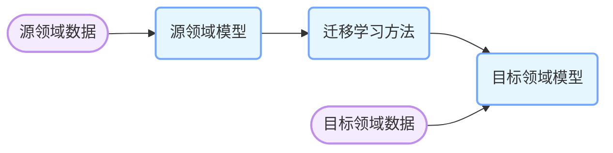

# 迁移学习在跨领域推理任务中的应用

> 关键词：迁移学习、跨领域推理、机器学习、模型泛化、知识迁移

> 摘要：本文聚焦于迁移学习在跨领域推理任务中的应用。首先介绍了迁移学习和跨领域推理的背景知识，包括其目的、适用读者群体和文档结构等。接着详细阐述了迁移学习和跨领域推理的核心概念、联系以及架构原理，并通过 Mermaid 流程图进行直观展示。深入分析了核心算法原理，结合 Python 源代码进行具体操作步骤的说明。探讨了相关的数学模型和公式，并举例进行详细讲解。通过项目实战，展示了在跨领域推理任务中迁移学习的代码实现和详细解读。介绍了迁移学习在跨领域推理中的实际应用场景，推荐了学习资源、开发工具框架以及相关论文著作。最后总结了未来发展趋势与挑战，还提供了常见问题解答和扩展阅读参考资料，旨在为读者全面深入地了解迁移学习在跨领域推理任务中的应用提供指导。

## 1. 背景介绍 
### 1.1 目的和范围
迁移学习旨在解决传统机器学习中数据稀缺和模型泛化能力不足的问题。在实际应用中，不同领域的数据分布往往存在差异，而跨领域推理任务需要模型能够在不同领域之间进行有效的知识迁移和推理。本文的目的是深入探讨迁移学习在跨领域推理任务中的应用原理、方法和实践案例，范围涵盖迁移学习的基本概念、核心算法、数学模型、实际应用场景以及相关的工具和资源。

### 1.2 预期读者
本文预期读者包括机器学习、人工智能领域的研究人员、开发者，以及对迁移学习和跨领域推理感兴趣的学生和专业人士。读者需要具备一定的机器学习基础知识，如神经网络、分类和回归算法等。

### 1.3 文档结构概述
本文将按照以下结构进行组织：首先介绍迁移学习和跨领域推理的核心概念与联系，包括原理和架构的文本示意图以及 Mermaid 流程图；接着详细阐述核心算法原理，并通过 Python 源代码展示具体操作步骤；然后介绍相关的数学模型和公式，并举例说明；通过项目实战展示迁移学习在跨领域推理任务中的代码实现和详细解读；介绍实际应用场景；推荐学习资源、开发工具框架和相关论文著作；最后总结未来发展趋势与挑战，提供常见问题解答和扩展阅读参考资料。

### 1.4 术语表
#### 1.4.1 核心术语定义
- **迁移学习（Transfer Learning）**：是一种机器学习技术，旨在将从一个或多个源领域学到的知识迁移到目标领域，以提高目标领域的学习性能。
- **跨领域推理（Cross - Domain Reasoning）**：指在不同领域之间进行推理和决策的过程，需要模型能够理解和处理不同领域的数据和知识。
- **源领域（Source Domain）**：是知识的来源领域，通常具有丰富的数据和已训练好的模型。
- **目标领域（Target Domain）**：是需要应用迁移学习的领域，数据可能相对稀缺或与源领域的数据分布不同。

#### 1.4.2 相关概念解释
- **领域自适应（Domain Adaptation）**：是迁移学习的一种常见方法，通过调整模型参数或数据分布，使模型能够在不同领域之间进行自适应。
- **知识表示（Knowledge Representation）**：是将知识以计算机可处理的形式进行表示的过程，在迁移学习中，有效的知识表示有助于知识的迁移和共享。

#### 1.4.3 缩略词列表
- **ML（Machine Learning）**：机器学习
- **DL（Deep Learning）**：深度学习
- **SVM（Support Vector Machine）**：支持向量机
- **CNN（Convolutional Neural Network）**：卷积神经网络
- **RNN（Recurrent Neural Network）**：循环神经网络

## 2. 核心概念与联系 

### 迁移学习的核心概念
迁移学习的核心思想是利用源领域的知识来帮助目标领域的学习。在传统机器学习中，每个任务通常需要大量的标注数据来训练模型，而在实际应用中，获取大量标注数据往往是困难且昂贵的。迁移学习通过将源领域的知识迁移到目标领域，可以减少目标领域所需的标注数据量，提高模型的训练效率和性能。

迁移学习可以分为基于实例的迁移、基于特征的迁移、基于模型的迁移和基于关系的迁移等不同类型。基于实例的迁移是指直接将源领域的部分实例迁移到目标领域；基于特征的迁移是通过提取源领域和目标领域的共同特征来进行知识迁移；基于模型的迁移是将源领域训练好的模型参数迁移到目标领域；基于关系的迁移是利用源领域和目标领域之间的关系来进行知识迁移。

### 跨领域推理的核心概念
跨领域推理是指在不同领域之间进行推理和决策的过程。在实际应用中，许多任务需要模型能够处理不同领域的数据和知识，例如医疗诊断中需要结合临床数据和基因数据进行推理，金融风险评估中需要考虑市场数据和企业财务数据等。跨领域推理的关键在于如何有效地整合不同领域的信息，以及如何处理不同领域之间的数据分布差异。

### 迁移学习与跨领域推理的联系
迁移学习为跨领域推理提供了一种有效的方法。通过迁移学习，模型可以从源领域学到的知识中提取有用的信息，并将其应用到目标领域的推理任务中。例如，在图像识别领域，已经训练好的图像分类模型可以作为源领域的知识，迁移到目标领域的医学图像识别任务中，帮助提高医学图像识别的准确率。

### 核心概念原理和架构的文本示意图
```plaintext
+------------------+      +------------------+
|    源领域数据    | ---> |    源领域模型    |
+------------------+      +------------------+
                      |
                      v
+------------------+      +------------------+
|  迁移学习方法   | ---> |  目标领域模型    |
+------------------+      +------------------+
                      |
                      v
+------------------+
|  目标领域数据    |
+------------------+
```

### Mermaid 流程图


## 3. 核心算法原理 & 具体操作步骤 

### 基于特征的迁移学习算法原理
基于特征的迁移学习算法的核心思想是提取源领域和目标领域的共同特征，然后在这些共同特征上进行模型训练。常见的基于特征的迁移学习方法包括主成分分析（PCA）、独立成分分析（ICA）和核主成分分析（KPCA）等。

以主成分分析（PCA）为例，其基本原理是通过线性变换将原始数据投影到一组新的正交特征上，使得投影后的数据具有最大的方差。在迁移学习中，我们可以使用 PCA 提取源领域和目标领域的共同主成分，然后在这些主成分上进行模型训练。

### Python 代码实现
```python
import numpy as np
from sklearn.decomposition import PCA
from sklearn.linear_model import LogisticRegression

# 生成源领域和目标领域的数据
np.random.seed(0)
# 源领域数据，100 个样本，每个样本 10 个特征
X_source = np.random.randn(100, 10)
# 源领域标签
y_source = np.random.randint(0, 2, 100)
# 目标领域数据，50 个样本，每个样本 10 个特征
X_target = np.random.randn(50, 10)
# 目标领域标签
y_target = np.random.randint(0, 2, 50)

# 使用 PCA 提取共同特征
pca = PCA(n_components=5)
# 对源领域和目标领域的数据进行 PCA 降维
X_source_pca = pca.fit_transform(X_source)
X_target_pca = pca.transform(X_target)

# 在共同特征上训练模型
model = LogisticRegression()
# 使用源领域的降维后数据和标签进行模型训练
model.fit(X_source_pca, y_source)

# 在目标领域上进行预测
y_pred = model.predict(X_target_pca)
print("预测结果:", y_pred)
```

### 具体操作步骤
1. **数据准备**：收集源领域和目标领域的数据，并进行预处理，如归一化、标准化等。
2. **特征提取**：使用 PCA 等方法提取源领域和目标领域的共同特征。
3. **模型训练**：在提取的共同特征上训练一个分类或回归模型。
4. **模型预测**：使用训练好的模型对目标领域的数据进行预测。

## 4. 数学模型和公式 & 详细讲解 & 举例说明 

### 主成分分析（PCA）的数学模型和公式
主成分分析的目标是找到一组正交的投影方向，使得数据在这些方向上的投影具有最大的方差。设原始数据矩阵为 $X \in \mathbb{R}^{n \times d}$，其中 $n$ 是样本数量，$d$ 是特征维度。PCA 的数学模型可以表示为：

$$\max_{w} \quad w^T \Sigma w$$
$$\text{s.t.} \quad w^T w = 1$$

其中，$\Sigma = \frac{1}{n} X^T X$ 是数据的协方差矩阵，$w$ 是投影方向。

通过求解上述优化问题，可以得到协方差矩阵 $\Sigma$ 的特征向量和特征值。特征向量对应着投影方向，特征值对应着投影后的方差。选择前 $k$ 个最大特征值对应的特征向量，将原始数据投影到这些特征向量上，即可得到降维后的数据。

### 详细讲解
- **协方差矩阵**：协方差矩阵 $\Sigma$ 描述了数据各个特征之间的相关性。通过计算协方差矩阵，我们可以了解数据的分布情况。
- **特征向量和特征值**：特征向量是协方差矩阵的一组特殊向量，特征值表示数据在对应特征向量方向上的方差。选择最大特征值对应的特征向量，可以保留数据的主要信息。
- **投影**：将原始数据投影到特征向量上，可以得到降维后的数据。降维后的数据在保留主要信息的同时，减少了数据的维度，提高了模型的训练效率。

### 举例说明
假设我们有一个二维数据集 $X = \begin{bmatrix} 1 & 2 \\ 2 & 4 \\ 3 & 6 \\ 4 & 8 \end{bmatrix}$，其协方差矩阵为：

$$\Sigma = \frac{1}{4} X^T X = \frac{1}{4} \begin{bmatrix} 1 & 2 & 3 & 4 \\ 2 & 4 & 6 & 8 \end{bmatrix} \begin{bmatrix} 1 & 2 \\ 2 & 4 \\ 3 & 6 \\ 4 & 8 \end{bmatrix} = \begin{bmatrix} 7.5 & 15 \\ 15 & 30 \end{bmatrix}$$

求解协方差矩阵的特征值和特征向量：

特征方程为 $\det(\Sigma - \lambda I) = 0$，即：

$$\begin{vmatrix} 7.5 - \lambda & 15 \\ 15 & 30 - \lambda \end{vmatrix} = (7.5 - \lambda)(30 - \lambda) - 15 \times 15 = 0$$

解得特征值 $\lambda_1 = 37.5$，$\lambda_2 = 0$。

对应的特征向量分别为 $w_1 = \begin{bmatrix} 0.4472 \\ 0.8944 \end{bmatrix}$，$w_2 = \begin{bmatrix} -0.8944 \\ 0.4472 \end{bmatrix}$。

选择最大特征值 $\lambda_1$ 对应的特征向量 $w_1$，将原始数据投影到 $w_1$ 上，得到降维后的数据。

## 5. 项目实战：代码实际案例和详细解释说明 

### 5.1 开发环境搭建
- **操作系统**：可以选择 Windows、Linux 或 macOS。
- **Python 版本**：建议使用 Python 3.7 及以上版本。
- **开发工具**：可以使用 Jupyter Notebook、PyCharm 等开发工具。
- **依赖库**：需要安装 numpy、pandas、scikit - learn 等库。可以使用以下命令进行安装：
```sh
pip install numpy pandas scikit-learn
```

### 5.2 源代码详细实现和代码解读
以下是一个基于迁移学习的图像分类项目实战案例，使用预训练的 ResNet 模型进行迁移学习。

```python
import torch
import torch.nn as nn
import torch.optim as optim
from torchvision import datasets, transforms, models
from torch.utils.data import DataLoader

# 数据预处理
transform = transforms.Compose([
    transforms.Resize((224, 224)),
    transforms.ToTensor(),
    transforms.Normalize(mean=[0.485, 0.456, 0.406], std=[0.229, 0.224, 0.225])
])

# 加载源领域数据集（这里以 CIFAR - 10 为例）
source_dataset = datasets.CIFAR10(root='./data', train=True,
                                  download=True, transform=transform)
source_dataloader = DataLoader(source_dataset, batch_size=32, shuffle=True)

# 加载目标领域数据集（这里假设是一个自定义的图像分类数据集）
target_dataset = datasets.ImageFolder(root='./target_data', transform=transform)
target_dataloader = DataLoader(target_dataset, batch_size=32, shuffle=True)

# 加载预训练的 ResNet 模型
model = models.resnet18(pretrained=True)

# 冻结模型的所有参数
for param in model.parameters():
    param.requires_grad = False

# 修改最后一层全连接层，以适应目标领域的分类任务
num_ftrs = model.fc.in_features
model.fc = nn.Linear(num_ftrs, len(target_dataset.classes))

# 定义损失函数和优化器
criterion = nn.CrossEntropyLoss()
optimizer = optim.SGD(model.fc.parameters(), lr=0.001, momentum=0.9)

# 训练模型
device = torch.device("cuda:0" if torch.cuda.is_available() else "cpu")
model.to(device)

num_epochs = 10
for epoch in range(num_epochs):
    running_loss = 0.0
    for i, (inputs, labels) in enumerate(target_dataloader):
        inputs, labels = inputs.to(device), labels.to(device)

        optimizer.zero_grad()

        outputs = model(inputs)
        loss = criterion(outputs, labels)
        loss.backward()
        optimizer.step()

        running_loss += loss.item()

    print(f'Epoch {epoch + 1}, Loss: {running_loss / len(target_dataloader)}')

print('Finished Training')
```

### 代码解读与分析
1. **数据预处理**：使用 `transforms.Compose` 定义了一系列的数据预处理操作，包括图像缩放、转换为张量和归一化。
2. **数据集加载**：使用 `torchvision.datasets` 加载源领域和目标领域的数据集，并使用 `DataLoader` 进行数据加载。
3. **模型加载**：使用 `models.resnet18(pretrained=True)` 加载预训练的 ResNet 模型，并冻结模型的所有参数，只训练最后一层全连接层。
4. **模型修改**：修改最后一层全连接层的输出维度，以适应目标领域的分类任务。
5. **损失函数和优化器**：使用交叉熵损失函数和随机梯度下降优化器。
6. **模型训练**：将模型移动到 GPU 上进行训练，使用 `for` 循环进行多个 epoch 的训练。

## 6. 实际应用场景 
### 医疗领域
在医疗领域，不同医院或不同地区的医疗数据可能存在差异。迁移学习可以将在一个医院或地区训练好的疾病诊断模型迁移到其他医院或地区，提高模型的泛化能力。例如，将在大型综合医院训练好的肺癌诊断模型迁移到基层医院，帮助基层医生进行肺癌的早期诊断。

### 金融领域
在金融领域，不同市场或不同时间段的金融数据也存在差异。迁移学习可以将在一个市场或时间段训练好的风险评估模型迁移到其他市场或时间段，提高风险评估的准确性。例如，将在股票市场训练好的风险评估模型迁移到期货市场，帮助投资者进行期货投资的风险评估。

### 自然语言处理领域
在自然语言处理领域，不同领域的文本数据具有不同的语言风格和语义。迁移学习可以将在一个领域训练好的语言模型迁移到其他领域，提高模型在目标领域的性能。例如，将在新闻领域训练好的文本分类模型迁移到社交媒体领域，帮助进行社交媒体文本的分类。

### 计算机视觉领域
在计算机视觉领域，不同的图像数据集可能具有不同的图像风格和特征。迁移学习可以将在一个图像数据集训练好的图像识别模型迁移到其他图像数据集，提高模型的泛化能力。例如，将在 ImageNet 数据集训练好的图像分类模型迁移到医学图像数据集，帮助进行医学图像的分类和诊断。

## 7. 工具和资源推荐
### 7.1 学习资源推荐
#### 7.1.1 书籍推荐
- 《机器学习》（周志华）：全面介绍了机器学习的基本概念、算法和应用，是机器学习领域的经典教材。
- 《深度学习》（Ian Goodfellow、Yoshua Bengio 和 Aaron Courville）：详细介绍了深度学习的基本原理、模型和算法，是深度学习领域的权威著作。
- 《迁移学习》（Qiang Yang 和 Sinno Jialin Pan）：系统介绍了迁移学习的理论、方法和应用，是迁移学习领域的专业书籍。

#### 7.1.2 在线课程
- Coursera 上的“机器学习”课程（Andrew Ng 教授）：是一门经典的机器学习入门课程，介绍了机器学习的基本概念和算法。
- edX 上的“深度学习”课程（由 MIT 等高校提供）：深入介绍了深度学习的理论和实践。
- 网易云课堂上的“迁移学习实战”课程：结合实际案例，介绍了迁移学习的应用和实践。

#### 7.1.3 技术博客和网站
- Medium 上的 Towards Data Science：是一个专注于数据科学和机器学习的技术博客，经常发布关于迁移学习的最新研究成果和实践经验。
- 博客园：是国内知名的技术博客平台，有许多机器学习和人工智能领域的博主分享迁移学习的相关知识和经验。
- arXiv.org：是一个预印本论文平台，提供了大量关于迁移学习的最新研究论文。

### 7.2 开发工具框架推荐
#### 7.2.1 IDE和编辑器
- PyCharm：是一款专业的 Python 集成开发环境，提供了丰富的代码编辑、调试和项目管理功能。
- Jupyter Notebook：是一个交互式的开发环境，适合进行数据分析和模型训练的实验和演示。
- Visual Studio Code：是一款轻量级的代码编辑器，支持多种编程语言和插件，具有良好的扩展性。

#### 7.2.2 调试和性能分析工具
- TensorBoard：是 TensorFlow 提供的一个可视化工具，可以用于可视化模型的训练过程、损失函数曲线和模型结构等。
- PyTorch Profiler：是 PyTorch 提供的一个性能分析工具，可以用于分析模型的运行时间、内存使用情况等。
- cProfile：是 Python 内置的性能分析工具，可以用于分析 Python 代码的运行时间和函数调用情况。

#### 7.2.3 相关框架和库
- TensorFlow：是 Google 开发的一个开源深度学习框架，提供了丰富的深度学习模型和工具。
- PyTorch：是 Facebook 开发的一个开源深度学习框架，具有动态图和易于使用的特点。
- scikit - learn：是一个开源的机器学习库，提供了多种机器学习算法和工具，包括迁移学习的一些方法。

### 7.3 相关论文著作推荐
#### 7.3.1 经典论文
- “A Survey on Transfer Learning”（Qiang Yang 和 Sinno Jialin Pan）：是迁移学习领域的经典综述论文，系统介绍了迁移学习的理论、方法和应用。
- “Domain Adaptation via Transfer Component Analysis”（Sinno Jialin Pan 等）：提出了一种基于迁移成分分析的领域自适应方法。
- “Fine - Tuning Convolutional Neural Networks for Biomedical Image Analysis: Actively and Incrementally”（Guotai Wang 等）：介绍了如何使用迁移学习对卷积神经网络进行微调，以应用于生物医学图像分析。

#### 7.3.2 最新研究成果
- 每年的国际机器学习会议（ICML）、神经信息处理系统大会（NeurIPS）和计算机视觉与模式识别会议（CVPR）等顶级学术会议上都会有关于迁移学习的最新研究成果发表。
- arXiv.org 上也会及时更新关于迁移学习的最新预印本论文。

#### 7.3.3 应用案例分析
- 一些知名企业和研究机构会发布关于迁移学习在实际应用中的案例分析报告，例如 Google 在图像识别、语音识别等领域的应用案例，以及 IBM 在医疗、金融等领域的应用案例。

## 8. 总结：未来发展趋势与挑战
### 未来发展趋势
- **多领域融合**：未来迁移学习将更多地应用于多领域融合的场景，例如医疗、金融、交通等领域的融合。通过迁移学习，可以整合不同领域的数据和知识，提高模型的综合性能。
- **强化迁移学习**：将迁移学习与强化学习相结合，实现更智能的决策和控制。例如，在机器人领域，通过迁移学习可以将在一个环境中学习到的策略迁移到其他环境中，提高机器人的适应性和灵活性。
- **无监督迁移学习**：目前的迁移学习方法大多需要一定的标注数据，未来无监督迁移学习将成为一个重要的研究方向。无监督迁移学习可以在没有标注数据的情况下进行知识迁移，降低数据标注的成本。

### 挑战
- **领域差异处理**：不同领域之间的数据分布和特征差异可能很大，如何有效地处理这些差异是迁移学习面临的一个重要挑战。
- **知识表示和迁移**：如何将源领域的知识有效地表示和迁移到目标领域，是迁移学习的核心问题之一。目前的知识表示方法还存在一定的局限性，需要进一步研究和改进。
- **模型可解释性**：随着迁移学习模型的复杂度不断增加，模型的可解释性成为一个重要的问题。如何让模型的决策过程更加透明和可解释，是未来需要解决的挑战之一。

## 9. 附录：常见问题与解答
### 问题 1：迁移学习一定能提高目标领域的模型性能吗？
不一定。迁移学习的效果取决于源领域和目标领域之间的相关性、数据质量和模型选择等因素。如果源领域和目标领域之间的相关性较低，或者数据质量较差，迁移学习可能无法提高目标领域的模型性能，甚至可能会降低模型性能。

### 问题 2：如何选择合适的迁移学习方法？
选择合适的迁移学习方法需要考虑源领域和目标领域的特点、数据分布和任务类型等因素。如果源领域和目标领域的数据分布差异较小，可以选择基于模型的迁移学习方法；如果数据分布差异较大，可以选择基于特征的迁移学习方法或领域自适应方法。

### 问题 3：迁移学习需要多少目标领域的标注数据？
迁移学习可以减少目标领域所需的标注数据量，但具体需要多少标注数据取决于迁移学习方法和目标领域的复杂程度。一般来说，使用迁移学习可以在较少的标注数据下达到较好的模型性能，但仍然需要一定数量的标注数据来微调模型。

### 问题 4：如何评估迁移学习模型的性能？
可以使用目标领域的测试数据集来评估迁移学习模型的性能。常用的评估指标包括准确率、召回率、F1 值、均方误差等。同时，还可以与不使用迁移学习的模型进行对比，评估迁移学习的效果。

## 10. 扩展阅读 & 参考资料
- 周志华. 机器学习. 清华大学出版社, 2016.
- Ian Goodfellow, Yoshua Bengio, Aaron Courville. 深度学习. 人民邮电出版社, 2017.
- Qiang Yang, Sinno Jialin Pan. 迁移学习. 机械工业出版社, 2019.
- Qiang Yang, Sinno Jialin Pan. A Survey on Transfer Learning. IEEE Transactions on Knowledge and Data Engineering, 2010.
- Sinno Jialin Pan, et al. Domain Adaptation via Transfer Component Analysis. IEEE Transactions on Neural Networks, 2011.
- Guotai Wang, et al. Fine - Tuning Convolutional Neural Networks for Biomedical Image Analysis: Actively and Incrementally. IEEE Transactions on Medical Imaging, 2016.

作者：AI天才研究院/AI Genius Institute & 禅与计算机程序设计艺术 /Zen And The Art of Computer Programming