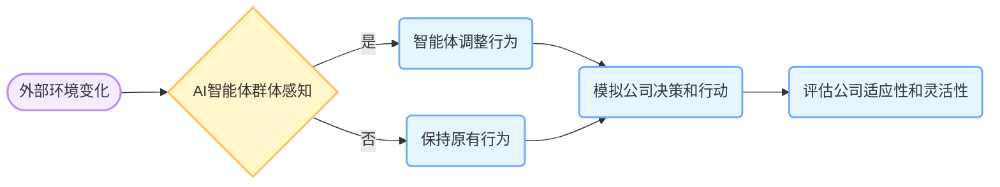

# 运用AI智能体群体评估公司适应性和灵活性

> 关键词：AI智能体群体、公司评估、适应性、灵活性、群体智能

> 摘要：本文围绕运用AI智能体群体评估公司适应性和灵活性展开深入探讨。首先介绍了相关背景知识，包括目的、预期读者、文档结构等内容。接着详细阐述了AI智能体群体、公司适应性和灵活性的核心概念及它们之间的联系，并通过Mermaid流程图进行直观展示。深入讲解了核心算法原理，结合Python源代码说明具体操作步骤，同时给出相关数学模型和公式，并举例说明。通过项目实战，从开发环境搭建、源代码实现与解读等方面进行详细分析。探讨了该评估方法在实际中的应用场景，推荐了学习、开发相关的工具和资源，最后总结了未来发展趋势与挑战，还提供了常见问题解答和扩展阅读参考资料，旨在为相关领域的研究和实践提供全面且深入的指导。

## 1. 背景介绍 
### 1.1 目的和范围
在当今快速变化的商业环境中，公司的适应性和灵活性对于其生存和发展至关重要。传统的评估方法往往难以全面、准确地衡量公司在复杂多变环境下的应对能力。运用AI智能体群体进行评估，可以模拟公司在不同场景下的行为和反应，从多个维度分析公司的适应性和灵活性。

本文章的范围涵盖了AI智能体群体的基本概念、核心算法原理、数学模型、实际应用案例以及相关工具和资源推荐等方面。旨在为读者提供一个系统的、全面的运用AI智能体群体评估公司适应性和灵活性的知识体系。

### 1.2 预期读者
本文预期读者包括企业管理人员、战略规划师、数据分析师、人工智能研究者以及对公司评估和人工智能应用感兴趣的相关人士。企业管理人员可以通过本文了解如何运用新的技术手段评估公司的竞争力，战略规划师可以借助AI智能体群体的评估结果制定更具前瞻性的战略，数据分析师可以学习到相关的算法和模型，人工智能研究者可以在此基础上进行更深入的研究。

### 1.3 文档结构概述
本文共分为十个部分。第一部分为背景介绍，阐述了文章的目的、预期读者和文档结构等内容。第二部分介绍核心概念与联系，包括AI智能体群体、公司适应性和灵活性的定义以及它们之间的关系，并通过流程图展示。第三部分详细讲解核心算法原理和具体操作步骤，结合Python代码进行说明。第四部分给出数学模型和公式，并进行详细讲解和举例。第五部分是项目实战，包括开发环境搭建、源代码实现和代码解读。第六部分探讨实际应用场景。第七部分推荐相关的工具和资源。第八部分总结未来发展趋势与挑战。第九部分是附录，解答常见问题。第十部分提供扩展阅读和参考资料。

### 1.4 术语表
#### 1.4.1 核心术语定义
- **AI智能体群体**：由多个具有一定智能和自主决策能力的AI智能体组成的集合，这些智能体可以通过相互协作、通信和交互来完成特定的任务。
- **公司适应性**：指公司在面对外部环境变化时，能够及时调整自身的战略、组织结构、业务流程等，以保持竞争优势和生存能力的能力。
- **公司灵活性**：公司在资源配置、生产运营、市场响应等方面具有的快速调整和变化的能力，体现了公司应对不确定性的能力。

#### 1.4.2 相关概念解释
- **群体智能**：是指由多个简单个体组成的群体通过相互作用而表现出的智能行为。在AI智能体群体中，群体智能可以使智能体们共同完成复杂的任务，并且能够自适应环境的变化。
- **多智能体系统**：由多个智能体组成的系统，这些智能体可以在一定的环境中自主地进行感知、决策和行动，并且可以与其他智能体进行交互和协作。

#### 1.4.3 缩略词列表
- **AI**：Artificial Intelligence，人工智能
- **MAS**：Multi - Agent System，多智能体系统

## 2. 核心概念与联系 
### 核心概念原理
#### AI智能体群体
AI智能体群体是由多个AI智能体组成的集合。每个AI智能体可以看作是一个具有一定智能和自主决策能力的个体，它可以感知周围环境的信息，并根据自身的目标和规则进行决策和行动。例如，在模拟公司运营的场景中，每个AI智能体可以代表公司的一个部门、一个业务单元或者一个员工。这些智能体之间可以通过通信和交互来协调行动，共同完成公司的目标。

#### 公司适应性
公司适应性强调公司对外部环境变化的响应能力。当市场需求、政策法规、技术创新等外部因素发生变化时，公司需要能够及时调整自身的战略、产品、服务等方面，以适应新的环境。例如，当出现新的竞争对手时，公司可以通过推出新的产品、降低成本、提高服务质量等方式来保持竞争力。

#### 公司灵活性
公司灵活性关注公司内部资源的配置和运营的弹性。它体现在公司能够快速调整生产规模、改变业务流程、重新分配资源等方面。例如，当市场需求突然增加时，公司可以迅速增加生产设备、招聘员工，以满足市场需求；当市场需求下降时，公司可以灵活地减少生产规模，降低成本。

### 架构的文本示意图
AI智能体群体与公司适应性和灵活性之间存在着密切的联系。AI智能体群体可以模拟公司的运营过程，通过对智能体之间的交互和行为的分析，可以评估公司的适应性和灵活性。具体来说，AI智能体群体可以根据不同的外部环境条件，模拟公司的决策和行动，观察公司在不同场景下的表现，从而评估公司的适应能力和灵活程度。

### Mermaid流程图

该流程图展示了外部环境变化时，AI智能体群体的响应过程。首先，AI智能体群体感知外部环境变化，如果感知到变化，智能体调整自身行为，然后模拟公司的决策和行动，最终评估公司的适应性和灵活性；如果没有感知到变化，则保持原有行为，继续进行模拟和评估。

## 3. 核心算法原理 & 具体操作步骤 
### 核心算法原理
我们可以使用基于强化学习的算法来实现AI智能体群体对公司适应性和灵活性的评估。强化学习是一种机器学习方法，智能体通过与环境进行交互，根据环境反馈的奖励信号来学习最优的行为策略。

在本场景中，每个AI智能体代表公司的一个部分，智能体的状态可以表示为公司当前的业务指标、资源配置等信息，智能体的动作可以表示为公司的决策，如调整生产规模、推出新产品等。环境会根据智能体的动作给予相应的奖励，奖励的大小反映了该动作对公司适应性和灵活性的影响。

### 具体操作步骤及Python源代码
以下是一个简单的Python代码示例，演示了如何使用强化学习算法（以Q - learning为例）来实现AI智能体群体的模拟和评估。

```python
import numpy as np

# 定义环境类
class CompanyEnvironment:
    def __init__(self):
        # 初始化状态空间和动作空间
        self.state_space = 10
        self.action_space = 5
        # 初始化当前状态
        self.state = np.random.randint(0, self.state_space)

    def step(self, action):
        # 根据动作更新状态
        new_state = (self.state + action) % self.state_space
        # 计算奖励
        if new_state % 2 == 0:
            reward = 1
        else:
            reward = -1
        # 判断是否结束
        done = False
        # 更新当前状态
        self.state = new_state
        return new_state, reward, done

# 定义Q - learning智能体类
class QLearningAgent:
    def __init__(self, state_space, action_space, learning_rate=0.1, discount_factor=0.9):
        # 初始化Q表
        self.q_table = np.zeros((state_space, action_space))
        self.state_space = state_space
        self.action_space = action_space
        self.learning_rate = learning_rate
        self.discount_factor = discount_factor

    def choose_action(self, state):
        # 以一定的概率进行随机探索
        if np.random.uniform(0, 1) < 0.1:
            action = np.random.randint(0, self.action_space)
        else:
            action = np.argmax(self.q_table[state, :])
        return action

    def learn(self, state, action, reward, next_state):
        # 更新Q表
        q_target = reward + self.discount_factor * np.max(self.q_table[next_state, :])
        q_predict = self.q_table[state, action]
        self.q_table[state, action] += self.learning_rate * (q_target - q_predict)

# 主函数
if __name__ == "__main__":
    env = CompanyEnvironment()
    agent = QLearningAgent(env.state_space, env.action_space)
    num_episodes = 1000
    for episode in range(num_episodes):
        state = env.state
        done = False
        while not done:
            action = agent.choose_action(state)
            next_state, reward, done = env.step(action)
            agent.learn(state, action, reward, next_state)
            state = next_state
    # 评估公司适应性和灵活性
    # 这里简单地以Q表中所有值的总和作为评估指标
    evaluation_score = np.sum(agent.q_table)
    print(f"公司适应性和灵活性评估得分: {evaluation_score}")
```

### 代码解释
1. **CompanyEnvironment类**：定义了公司的环境，包括状态空间、动作空间和状态转移规则。`step`方法根据智能体的动作更新状态，并返回新的状态、奖励和是否结束的标志。
2. **QLearningAgent类**：实现了Q - learning算法的智能体。`choose_action`方法根据当前状态选择动作，`learn`方法根据环境反馈的奖励更新Q表。
3. **主函数**：初始化环境和智能体，进行多次训练，最后以Q表中所有值的总和作为公司适应性和灵活性的评估得分。

## 4. 数学模型和公式 & 详细讲解 & 举例说明 
### 数学模型
在强化学习中，Q - learning算法的核心是Q表的更新。Q表存储了在每个状态下采取每个动作的价值估计。Q - learning算法的目标是通过不断地与环境交互，学习到最优的Q表，从而得到最优的行为策略。

### 数学公式
Q - learning算法的更新公式为：

$$Q(s_t, a_t) \leftarrow Q(s_t, a_t) + \alpha [r_{t + 1}+\gamma \max_{a}Q(s_{t + 1}, a)-Q(s_t, a_t)]$$

其中：
- $Q(s_t, a_t)$ 表示在时刻 $t$，状态 $s_t$ 下采取动作 $a_t$ 的Q值。
- $\alpha$ 是学习率，控制每次更新的步长。
- $r_{t + 1}$ 是在时刻 $t + 1$ 获得的奖励。
- $\gamma$ 是折扣因子，反映了未来奖励的重要程度。
- $\max_{a}Q(s_{t + 1}, a)$ 表示在时刻 $t + 1$，状态 $s_{t + 1}$ 下所有可能动作的最大Q值。

### 详细讲解
学习率 $\alpha$ 决定了新的经验对Q表更新的影响程度。如果 $\alpha$ 较大，新的经验会对Q表产生较大的影响；如果 $\alpha$ 较小，Q表的更新会比较缓慢，更依赖于之前的经验。

折扣因子 $\gamma$ 用于平衡当前奖励和未来奖励的重要性。当 $\gamma$ 接近1时，智能体更注重未来的奖励；当 $\gamma$ 接近0时，智能体更关注当前的奖励。

### 举例说明
假设在某一时刻 $t$，智能体处于状态 $s_t = 2$，采取动作 $a_t = 1$，获得奖励 $r_{t + 1}=3$，进入新的状态 $s_{t + 1}=4$。已知学习率 $\alpha = 0.1$，折扣因子 $\gamma = 0.9$，当前 $Q(2, 1)=2$，$\max_{a}Q(4, a)=5$。

根据Q - learning更新公式：

$$
\begin{align*}
Q(2, 1) &\leftarrow Q(2, 1)+\alpha [r_{t + 1}+\gamma \max_{a}Q(4, a)-Q(2, 1)]\\
&= 2+0.1\times[3 + 0.9\times5 - 2]\\
&= 2+0.1\times(3 + 4.5 - 2)\\
&= 2+0.1\times5.5\\
&= 2 + 0.55\\
&= 2.55
\end{align*}
$$

更新后，$Q(2, 1)$ 的值变为2.55。

## 5. 项目实战：代码实际案例和详细解释说明 
### 5.1  开发环境搭建
#### 安装Python
首先，确保你已经安装了Python。可以从Python官方网站（https://www.python.org/downloads/）下载适合你操作系统的Python版本。建议使用Python 3.6及以上版本。

#### 安装必要的库
在命令行中使用以下命令安装必要的库：
```sh
pip install numpy
```
`numpy` 是一个用于科学计算的Python库，在本项目中用于处理数组和矩阵运算。

### 5.2  源代码详细实现和代码解读
以下是一个更完整的项目代码示例，用于模拟AI智能体群体评估公司适应性和灵活性：

```python
import numpy as np
import random

# 定义公司环境类
class CompanyEnv:
    def __init__(self, num_states=10, num_actions=5):
        self.num_states = num_states
        self.num_actions = num_actions
        self.state = random.randint(0, num_states - 1)
        # 定义状态转移矩阵
        self.transition_matrix = np.random.rand(num_states, num_actions, num_states)
        self.transition_matrix = self.transition_matrix / np.sum(self.transition_matrix, axis=2, keepdims=True)
        # 定义奖励矩阵
        self.reward_matrix = np.random.randint(-10, 10, (num_states, num_actions))

    def step(self, action):
        next_state = np.random.choice(self.num_states, p=self.transition_matrix[self.state, action, :])
        reward = self.reward_matrix[self.state, action]
        done = False
        self.state = next_state
        return next_state, reward, done

    def reset(self):
        self.state = random.randint(0, self.num_states - 1)
        return self.state

# 定义Q - learning智能体类
class QLearningAgent:
    def __init__(self, num_states, num_actions, learning_rate=0.1, discount_factor=0.9, exploration_rate=0.1):
        self.num_states = num_states
        self.num_actions = num_actions
        self.learning_rate = learning_rate
        self.discount_factor = discount_factor
        self.exploration_rate = exploration_rate
        self.q_table = np.zeros((num_states, num_actions))

    def choose_action(self, state):
        if random.uniform(0, 1) < self.exploration_rate:
            action = random.randint(0, self.num_actions - 1)
        else:
            action = np.argmax(self.q_table[state, :])
        return action

    def learn(self, state, action, reward, next_state):
        q_target = reward + self.discount_factor * np.max(self.q_table[next_state, :])
        q_predict = self.q_table[state, action]
        self.q_table[state, action] += self.learning_rate * (q_target - q_predict)

# 主函数
def main():
    env = CompanyEnv()
    agent = QLearningAgent(env.num_states, env.num_actions)
    num_episodes = 1000
    for episode in range(num_episodes):
        state = env.reset()
        done = False
        total_reward = 0
        while not done:
            action = agent.choose_action(state)
            next_state, reward, done = env.step(action)
            agent.learn(state, action, reward, next_state)
            state = next_state
            total_reward += reward
        print(f"Episode {episode + 1}: Total Reward = {total_reward}")
    # 评估公司适应性和灵活性
    evaluation_score = np.mean(np.max(agent.q_table, axis=1))
    print(f"公司适应性和灵活性评估得分: {evaluation_score}")

if __name__ == "__main__":
    main()
```

### 代码解读
#### CompanyEnv类
- `__init__` 方法：初始化公司环境，包括状态数量、动作数量、当前状态、状态转移矩阵和奖励矩阵。
- `step` 方法：根据智能体的动作，按照状态转移矩阵选择下一个状态，并返回奖励和是否结束的标志。
- `reset` 方法：重置环境，随机选择一个初始状态。

#### QLearningAgent类
- `__init__` 方法：初始化Q表、学习率、折扣因子和探索率。
- `choose_action` 方法：根据当前状态选择动作，以一定的概率进行随机探索。
- `learn` 方法：根据环境反馈的奖励更新Q表。

#### 主函数
- 初始化环境和智能体，进行多次训练，记录每次训练的总奖励。
- 最后，以Q表中每行的最大值的平均值作为公司适应性和灵活性的评估得分。

### 5.3  代码解读与分析
#### 状态转移矩阵
状态转移矩阵 `transition_matrix` 描述了在每个状态下采取每个动作后转移到其他状态的概率。通过随机生成并归一化的方式得到该矩阵，模拟了公司在不同决策下的状态变化的不确定性。

#### 奖励矩阵
奖励矩阵 `reward_matrix` 表示在每个状态下采取每个动作所获得的奖励。随机生成的奖励矩阵模拟了不同决策对公司的影响。

#### 评估得分
评估得分采用Q表中每行的最大值的平均值，反映了公司在不同状态下能够获得的最大期望奖励，从而衡量公司的适应性和灵活性。得分越高，说明公司在不同情况下的应对能力越强。

## 6. 实际应用场景 
### 战略规划
企业在制定战略规划时，可以运用AI智能体群体模拟不同的市场环境和竞争态势，评估公司在各种情况下的适应性和灵活性。例如，模拟新的竞争对手进入市场、技术创新带来的行业变革等场景，通过AI智能体群体的决策和行动，分析公司的战略调整能力和资源配置效率，从而制定出更具前瞻性和适应性的战略规划。

### 风险管理
在风险管理方面，AI智能体群体可以模拟各种风险事件对公司的影响，评估公司的风险应对能力。例如，模拟自然灾害、政策法规变化、供应链中断等风险事件，观察公司在这些情况下的决策和行动，分析公司的灵活性和恢复能力。根据评估结果，企业可以制定相应的风险应对策略，降低风险对公司的影响。

### 资源配置优化
企业可以利用AI智能体群体评估不同资源配置方案下公司的适应性和灵活性。通过模拟不同的资源分配方式，观察公司在不同场景下的运营表现，找到最优的资源配置方案。例如，在人力资源、资金、设备等方面进行合理分配，提高公司的运营效率和应对变化的能力。

### 市场进入决策
当企业考虑进入新的市场时，可以运用AI智能体群体模拟新市场的环境和竞争情况，评估公司在新市场的适应性和灵活性。通过模拟不同的市场策略和运营模式，分析公司在新市场的生存和发展能力，为市场进入决策提供依据。

## 7. 工具和资源推荐
### 7.1 学习资源推荐
#### 7.1.1 书籍推荐
- 《强化学习：原理与Python实现》：这本书详细介绍了强化学习的基本原理、算法和应用，通过Python代码示例帮助读者理解和实践强化学习算法。
- 《多智能体系统：算法、博弈论及应用》：涵盖了多智能体系统的理论、算法和实际应用，对于理解AI智能体群体的协作和交互有很大帮助。
- 《人工智能：一种现代的方法》：经典的人工智能教材，全面介绍了人工智能的各个领域，包括智能体、机器学习、强化学习等内容。

#### 7.1.2 在线课程
- Coursera上的“强化学习专项课程”：由知名教授授课，系统地介绍了强化学习的理论和实践，包括Q - learning、深度强化学习等内容。
- edX上的“多智能体系统”：讲解了多智能体系统的基本概念、算法和应用，通过案例分析和编程作业帮助学生掌握相关知识。
- 网易云课堂上的“人工智能基础课程”：适合初学者入门，介绍了人工智能的基本概念、算法和应用，为进一步学习AI智能体群体相关知识打下基础。

#### 7.1.3 技术博客和网站
- OpenAI博客：提供了最新的人工智能研究成果和应用案例，包括强化学习、多智能体系统等方面的内容。
- Medium上的人工智能相关博客：有很多人工智能领域的专家和爱好者分享的技术文章和经验，对于了解行业动态和最新技术有很大帮助。
- 机器之心：专注于人工智能领域的资讯和技术解读，提供了丰富的人工智能相关的文章和报告。

### 7.2 开发工具框架推荐
#### 7.2.1 IDE和编辑器
- PyCharm：功能强大的Python集成开发环境，提供了代码编辑、调试、版本控制等功能，适合开发Python项目。
- Jupyter Notebook：交互式的开发环境，方便进行代码编写、实验和数据分析，特别适合机器学习和深度学习项目的开发。
- Visual Studio Code：轻量级的代码编辑器，支持多种编程语言，有丰富的插件扩展，可用于Python项目的开发。

#### 7.2.2 调试和性能分析工具
- PySnooper：简单易用的Python调试工具，可以自动记录函数的执行过程和变量的值，方便调试代码。
- cProfile：Python内置的性能分析工具，可以分析代码的运行时间和函数调用次数，帮助优化代码性能。
- TensorBoard：用于可视化深度学习模型的训练过程和性能指标，也可以用于分析强化学习算法的训练情况。

#### 7.2.3 相关框架和库
- OpenAI Gym：提供了一系列的强化学习环境，方便开发者进行强化学习算法的测试和验证。
- Stable - Baselines3：基于PyTorch的强化学习库，实现了多种强化学习算法，提供了简单易用的API，方便开发者快速上手。
- Mesa：用于构建基于智能体的模型的Python库，支持多智能体系统的开发和模拟。

### 7.3 相关论文著作推荐
#### 7.3.1 经典论文
- “Reinforcement Learning: An Introduction”：由Richard S. Sutton和Andrew G. Barto撰写，是强化学习领域的经典著作，系统地介绍了强化学习的基本概念、算法和理论。
- “Multi - Agent Systems: A Modern Approach to Distributed Artificial Intelligence”：全面介绍了多智能体系统的理论、算法和应用，是多智能体系统领域的重要参考文献。
- “Q - learning”：由Christopher J. C. H. Watkins和Peter Dayan发表的论文，首次提出了Q - learning算法，是强化学习领域的经典论文之一。

#### 7.3.2 最新研究成果
- 关注顶级人工智能会议（如NeurIPS、ICML、AAAI等）上的相关论文，了解AI智能体群体和强化学习领域的最新研究进展。
- 阅读知名学术期刊（如Journal of Artificial Intelligence Research、Artificial Intelligence等）上的文章，获取最新的研究成果和技术动态。

#### 7.3.3 应用案例分析
- 查阅企业管理、战略规划等领域的学术期刊和商业杂志，了解AI智能体群体在实际企业中的应用案例和效果评估。
- 关注科技公司的技术博客和报告，了解他们在运用AI智能体群体进行公司评估和决策方面的实践经验。

## 8. 总结：未来发展趋势与挑战
### 未来发展趋势
#### 与深度学习的融合
未来，AI智能体群体将与深度学习技术更紧密地结合。深度学习可以帮助智能体更好地处理复杂的环境信息，提高智能体的感知和决策能力。例如，使用卷积神经网络（CNN）处理图像数据，使用循环神经网络（RNN）处理序列数据，使智能体能够在更复杂的环境中进行决策和行动。

#### 群体智能的进一步发展
群体智能将不断发展和完善，智能体之间的协作和交互将更加高效和智能。例如，通过引入博弈论、分布式优化等理论，提高智能体群体的协同决策能力，使群体能够更好地应对复杂的任务和环境变化。

#### 应用领域的拓展
AI智能体群体评估公司适应性和灵活性的应用领域将不断拓展。除了战略规划、风险管理等领域，还将应用于供应链管理、市场营销、医疗保健等更多领域，为不同行业的企业提供更全面的评估和决策支持。

### 挑战
#### 数据获取和质量
准确评估公司的适应性和灵活性需要大量的高质量数据。然而，在实际应用中，数据的获取可能存在困难，数据的质量也可能参差不齐。例如，公司的一些内部数据可能由于保密原因无法获取，数据中可能存在噪声和缺失值，影响评估的准确性。

#### 模型可解释性
深度学习和强化学习模型通常具有较高的复杂性，其决策过程难以解释。在评估公司适应性和灵活性时，企业需要了解模型的决策依据，以便做出合理的决策。因此，提高模型的可解释性是一个亟待解决的问题。

#### 计算资源需求
AI智能体群体的模拟和训练需要大量的计算资源。特别是当智能体数量较多、环境复杂度较高时，计算资源的需求会急剧增加。如何在有限的计算资源下提高算法的效率，是一个需要解决的挑战。

## 9. 附录：常见问题与解答
### 问题1：AI智能体群体评估的结果是否准确可靠？
解答：AI智能体群体评估的结果受到多种因素的影响，包括数据质量、模型选择、参数设置等。如果数据准确、模型合适、参数设置合理，评估结果可以提供有价值的参考。但由于实际情况的复杂性，评估结果不可能完全准确地反映公司的真实情况，需要结合其他方法和经验进行综合判断。

### 问题2：如何选择合适的AI智能体群体模型？
解答：选择合适的AI智能体群体模型需要考虑多个因素，如问题的复杂度、数据的特点、计算资源等。对于简单的问题，可以选择基于规则的模型；对于复杂的问题，可以考虑使用强化学习、深度学习等模型。同时，可以通过实验和比较不同模型的性能，选择最适合的模型。

### 问题3：如何提高AI智能体群体的学习效率？
解答：可以通过以下方法提高AI智能体群体的学习效率：
- 优化算法参数：如调整学习率、折扣因子等参数，使算法更快地收敛。
- 增加训练数据：提供更多的训练数据可以帮助智能体学习到更全面的知识和经验。
- 采用并行计算：利用多核处理器或分布式计算平台，并行训练多个智能体，提高训练速度。

### 问题4：AI智能体群体评估方法是否适用于所有类型的公司？
解答：AI智能体群体评估方法适用于大多数类型的公司，但对于一些特殊行业或具有独特业务模式的公司，可能需要进行适当的调整和改进。例如，对于一些传统行业，可能需要考虑更多的行业特点和历史数据；对于一些创新型企业，可能需要关注技术创新和市场变化的因素。

## 10. 扩展阅读 & 参考资料
### 扩展阅读
- 《复杂适应系统：社会生活计算模型导论》：介绍了复杂适应系统的基本概念和建模方法，对于理解AI智能体群体的行为和交互有一定的帮助。
- 《人工智能时代的企业转型》：探讨了人工智能技术在企业转型中的应用和挑战，提供了一些企业运用人工智能进行评估和决策的案例。

### 参考资料
- Sutton, R. S., & Barto, A. G. (2018). Reinforcement Learning: An Introduction. MIT press.
- Weiss, G. (Ed.). (2013). Multi - Agent Systems: A Modern Approach to Distributed Artificial Intelligence. MIT Press.
- Watkins, C. J. C. H., & Dayan, P. (1992). Q - learning. Machine learning, 8(3 - 4), 279 - 292.

作者：AI天才研究院/AI Genius Institute & 禅与计算机程序设计艺术 /Zen And The Art of Computer Programming