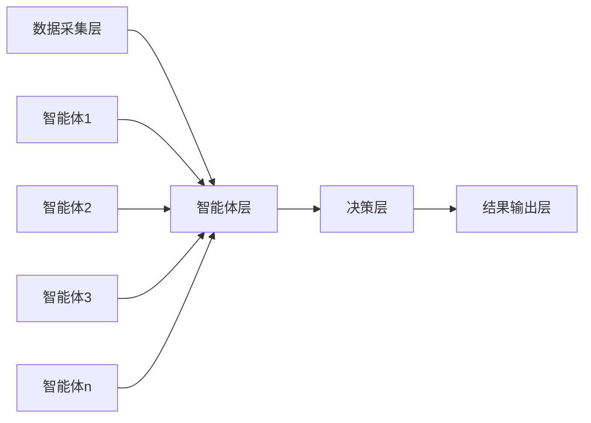

# 运用AI智能体群体识别巴菲特式的行业领导者

> 关键词：AI智能体群体、巴菲特式、行业领导者、识别算法、数据挖掘

> 摘要：本文聚焦于运用AI智能体群体来识别巴菲特式的行业领导者这一前沿话题。首先介绍了相关背景知识，包括研究目的、预期读者、文档结构和术语定义。接着阐述了核心概念及其联系，给出了原理和架构的文本示意图与Mermaid流程图。详细讲解了核心算法原理，并使用Python源代码进行说明。分析了相关的数学模型和公式，还给出了具体例子。通过项目实战，展示了开发环境搭建、源代码实现与解读。探讨了该技术的实际应用场景，推荐了学习资源、开发工具框架和相关论文著作。最后总结了未来发展趋势与挑战，提供了常见问题解答和扩展阅读参考资料。旨在为读者全面深入地呈现如何利用AI智能体群体有效识别巴菲特式的行业领导者。

## 1. 背景介绍 
### 1.1 目的和范围
在当今复杂多变的商业环境中，准确识别出像巴菲特那样具有卓越领导能力和战略眼光的行业领导者至关重要。巴菲特以其独特的投资理念和精准的商业洞察力，长期在投资领域取得巨大成功。通过运用AI智能体群体进行识别，能够从海量的数据中挖掘出潜在的行业领导者特征，为投资者、企业和研究机构提供有价值的参考。本研究的范围涵盖了多个行业，包括金融、科技、制造业等，旨在建立一个通用的识别模型。

### 1.2 预期读者
本文预期读者包括金融投资者，他们希望借助该技术发现有潜力的投资目标；企业管理者，可通过识别行业领导者来学习借鉴其成功经验；数据科学家和AI研究人员，对相关算法和技术实现感兴趣；以及学术研究人员，用于深入探讨行业领导者的特征和形成机制。

### 1.3 文档结构概述
本文将首先介绍相关的核心概念和它们之间的联系，通过文本示意图和Mermaid流程图进行直观展示。接着详细讲解核心算法原理，并给出Python代码实现。分析涉及的数学模型和公式，通过具体例子加深理解。进行项目实战，包括开发环境搭建、源代码实现与解读。探讨实际应用场景，推荐学习资源、开发工具框架和相关论文著作。最后总结未来发展趋势与挑战，提供常见问题解答和扩展阅读参考资料。

### 1.4 术语表
#### 1.4.1 核心术语定义
- **AI智能体群体**：由多个具有自主学习和决策能力的AI智能体组成的集合，它们可以相互协作和交流，共同完成特定任务。
- **巴菲特式的行业领导者**：指那些具有长期投资眼光、卓越的战略决策能力、对行业发展趋势有深刻洞察力，能够带领企业持续创造价值的行业领袖。
- **识别算法**：用于从大量数据中筛选出符合巴菲特式行业领导者特征的算法。

#### 1.4.2 相关概念解释
- **数据挖掘**：从海量数据中发现有价值信息和知识的过程，在本研究中用于提取与行业领导者相关的数据特征。
- **机器学习**：让计算机通过数据学习模式和规律，从而进行预测和决策的技术，是识别算法的重要基础。

#### 1.4.3 缩略词列表
- **AI**：Artificial Intelligence，人工智能
- **ML**：Machine Learning，机器学习
- **DM**：Data Mining，数据挖掘

## 2. 核心概念与联系 

### 核心概念原理
AI智能体群体识别巴菲特式的行业领导者的核心原理是基于多智能体系统和机器学习技术。每个AI智能体可以看作是一个独立的智能单元，它们具有不同的专长和能力。通过对大量行业数据的学习和分析，智能体可以提取出与行业领导者相关的特征，如企业业绩、市场份额、创新能力等。多个智能体之间相互协作，交换信息和意见，最终形成一个综合的判断，识别出符合巴菲特式特征的行业领导者。

### 架构的文本示意图
整个识别系统主要由数据采集层、智能体层、决策层和结果输出层组成。数据采集层负责收集行业相关的数据，包括企业财务报表、市场动态、新闻资讯等。智能体层包含多个AI智能体，每个智能体对采集到的数据进行处理和分析，提取特征并进行初步判断。决策层将各个智能体的判断结果进行整合和综合分析，最终做出识别决策。结果输出层将识别结果展示给用户。

### Mermaid流程图


## 3. 核心算法原理 & 具体操作步骤 

### 核心算法原理
本研究采用的核心算法是基于集成学习的方法，将多个不同类型的机器学习模型进行组合，以提高识别的准确性和可靠性。具体来说，使用了决策树、支持向量机和神经网络三种模型。决策树模型可以快速地对数据进行分类和决策，支持向量机能够处理高维数据和非线性问题，神经网络则具有强大的学习和表达能力。

### 具体操作步骤
1. **数据预处理**：对采集到的原始数据进行清洗、转换和归一化处理，去除噪声和异常值，将数据转换为适合机器学习模型处理的格式。
2. **特征提取**：从预处理后的数据中提取与行业领导者相关的特征，如企业的盈利能力、成长能力、市场竞争力等。
3. **模型训练**：使用训练数据集对决策树、支持向量机和神经网络模型进行训练，调整模型的参数，使其达到最佳性能。
4. **模型集成**：将训练好的三个模型进行集成，通过投票或加权平均的方式综合各个模型的预测结果。
5. **识别预测**：使用集成模型对新的数据进行识别预测，判断是否为巴菲特式的行业领导者。

### Python源代码实现
```python
import pandas as pd
from sklearn.model_selection import train_test_split
from sklearn.tree import DecisionTreeClassifier
from sklearn.svm import SVC
from sklearn.neural_network import MLPClassifier
from sklearn.ensemble import VotingClassifier
from sklearn.preprocessing import StandardScaler

# 读取数据
data = pd.read_csv('industry_data.csv')

# 分离特征和标签
X = data.drop('leader_label', axis=1)
y = data['leader_label']

# 数据预处理
scaler = StandardScaler()
X = scaler.fit_transform(X)

# 划分训练集和测试集
X_train, X_test, y_train, y_test = train_test_split(X, y, test_size=0.2, random_state=42)

# 定义三个基模型
dt = DecisionTreeClassifier()
svm = SVC()
nn = MLPClassifier()

# 集成模型
ensemble_model = VotingClassifier(estimators=[('dt', dt), ('svm', svm), ('nn', nn)])

# 模型训练
ensemble_model.fit(X_train, y_train)

# 模型评估
accuracy = ensemble_model.score(X_test, y_test)
print(f"模型准确率: {accuracy}")
```

## 4. 数学模型和公式 & 详细讲解 & 举例说明 

### 决策树模型
决策树是一种基于树结构进行决策的模型，其基本思想是通过对数据的特征进行划分，构建一棵决策树。每个内部节点表示一个特征上的测试，每个分支表示一个测试输出，每个叶节点表示一个类别。决策树的构建过程通常使用信息增益或基尼指数等指标来选择最优的划分特征。

信息增益的计算公式为：
$$IG(D, A) = H(D) - H(D|A)$$
其中，$IG(D, A)$ 表示特征 $A$ 对数据集 $D$ 的信息增益，$H(D)$ 表示数据集 $D$ 的熵，$H(D|A)$ 表示在特征 $A$ 给定的条件下数据集 $D$ 的条件熵。

熵的计算公式为：
$$H(D) = -\sum_{k=1}^{|Y|}p_k\log_2p_k$$
其中，$p_k$ 表示数据集 $D$ 中第 $k$ 类样本所占的比例，$|Y|$ 表示类别数。

条件熵的计算公式为：
$$H(D|A) = \sum_{i=1}^{|A|}\frac{|D_i|}{|D|}H(D_i)$$
其中，$|D_i|$ 表示特征 $A$ 取值为第 $i$ 个值的样本子集的大小，$H(D_i)$ 表示该子集的熵。

举例说明：假设有一个数据集 $D$ 包含 10 个样本，分为两类，其中一类有 6 个样本，另一类有 4 个样本。则数据集 $D$ 的熵为：
$$H(D) = -\frac{6}{10}\log_2\frac{6}{10} - \frac{4}{10}\log_2\frac{4}{10} \approx 0.97$$

假设存在一个特征 $A$，将数据集 $D$ 划分为两个子集 $D_1$ 和 $D_2$，$D_1$ 包含 4 个样本，其中一类有 3 个样本，另一类有 1 个样本；$D_2$ 包含 6 个样本，其中一类有 3 个样本，另一类有 3 个样本。则特征 $A$ 对数据集 $D$ 的信息增益为：
$$H(D_1) = -\frac{3}{4}\log_2\frac{3}{4} - \frac{1}{4}\log_2\frac{1}{4} \approx 0.81$$
$$H(D_2) = -\frac{3}{6}\log_2\frac{3}{6} - \frac{3}{6}\log_2\frac{3}{6} = 1$$
$$H(D|A) = \frac{4}{10}H(D_1) + \frac{6}{10}H(D_2) = \frac{4}{10} \times 0.81 + \frac{6}{10} \times 1 \approx 0.92$$
$$IG(D, A) = H(D) - H(D|A) = 0.97 - 0.92 = 0.05$$

### 支持向量机模型
支持向量机的目标是找到一个最优的超平面，将不同类别的样本分开，同时使超平面到最近样本点的距离（即间隔）最大。对于线性可分的数据集，支持向量机的优化问题可以表示为：
$$\min_{\mathbf{w}, b} \frac{1}{2}\|\mathbf{w}\|^2$$
$$\text{s.t. } y_i(\mathbf{w}^T\mathbf{x}_i + b) \geq 1, i = 1, 2, \cdots, n$$
其中，$\mathbf{w}$ 是超平面的法向量，$b$ 是偏置项，$\mathbf{x}_i$ 是第 $i$ 个样本的特征向量，$y_i$ 是第 $i$ 个样本的标签（取值为 $\pm 1$），$n$ 是样本数量。

对于线性不可分的数据集，引入松弛变量 $\xi_i$，优化问题变为：
$$\min_{\mathbf{w}, b, \xi} \frac{1}{2}\|\mathbf{w}\|^2 + C\sum_{i=1}^{n}\xi_i$$
$$\text{s.t. } y_i(\mathbf{w}^T\mathbf{x}_i + b) \geq 1 - \xi_i, \xi_i \geq 0, i = 1, 2, \cdots, n$$
其中，$C$ 是惩罚参数，用于平衡间隔和分类误差。

举例说明：假设有一个二维数据集，包含两类样本，通过支持向量机可以找到一个最优的直线（二维空间中的超平面）将两类样本分开。当数据集线性不可分时，通过引入松弛变量可以允许一些样本点落在间隔内或错误分类，但会受到惩罚参数 $C$ 的限制。

### 神经网络模型
神经网络是一种模仿人类神经系统的计算模型，由多个神经元组成。每个神经元接收输入信号，经过加权求和和非线性激活函数处理后输出结果。一个简单的多层感知机（MLP）神经网络可以表示为：
$$\mathbf{h}^{(l)} = f(\mathbf{W}^{(l)}\mathbf{h}^{(l-1)} + \mathbf{b}^{(l)})$$
其中，$\mathbf{h}^{(l)}$ 是第 $l$ 层的神经元输出向量，$\mathbf{W}^{(l)}$ 是第 $l$ 层的权重矩阵，$\mathbf{b}^{(l)}$ 是第 $l$ 层的偏置向量，$f$ 是激活函数。

常见的激活函数有 sigmoid 函数、ReLU 函数等。sigmoid 函数的计算公式为：
$$f(x) = \frac{1}{1 + e^{-x}}$$

举例说明：假设有一个三层的 MLP 神经网络，输入层有 3 个神经元，隐藏层有 4 个神经元，输出层有 1 个神经元。输入向量 $\mathbf{x}$ 经过第一层的权重矩阵 $\mathbf{W}^{(1)}$ 和偏置向量 $\mathbf{b}^{(1)}$ 处理后，通过 sigmoid 激活函数得到隐藏层的输出向量 $\mathbf{h}^{(1)}$。然后 $\mathbf{h}^{(1)}$ 再经过第二层的权重矩阵 $\mathbf{W}^{(2)}$ 和偏置向量 $\mathbf{b}^{(2)}$ 处理，通过 sigmoid 激活函数得到输出层的输出。

## 5. 项目实战：代码实际案例和详细解释说明 

### 5.1  开发环境搭建
- **操作系统**：建议使用 Linux 或 Windows 操作系统。
- **Python 版本**：Python 3.7 及以上版本。
- **开发工具**：可以使用 PyCharm 或 Jupyter Notebook 进行开发。
- **安装依赖库**：使用以下命令安装所需的库：
```sh
pip install pandas scikit-learn
```

### 5.2  源代码详细实现和代码解读
```python
import pandas as pd
from sklearn.model_selection import train_test_split
from sklearn.tree import DecisionTreeClassifier
from sklearn.svm import SVC
from sklearn.neural_network import MLPClassifier
from sklearn.ensemble import VotingClassifier
from sklearn.preprocessing import StandardScaler

# 读取数据
data = pd.read_csv('industry_data.csv')

# 代码解读：使用 pandas 库的 read_csv 函数读取存储行业数据的 CSV 文件，并将其存储在 DataFrame 对象 data 中。

# 分离特征和标签
X = data.drop('leader_label', axis=1)
y = data['leader_label']

# 代码解读：将数据集中的特征列（除了 'leader_label' 列）提取出来存储在 X 中，将 'leader_label' 列作为标签存储在 y 中。

# 数据预处理
scaler = StandardScaler()
X = scaler.fit_transform(X)

# 代码解读：使用 StandardScaler 对特征数据 X 进行标准化处理，使得每个特征的均值为 0，标准差为 1，以提高模型的训练效果。

# 划分训练集和测试集
X_train, X_test, y_train, y_test = train_test_split(X, y, test_size=0.2, random_state=42)

# 代码解读：使用 train_test_split 函数将数据集划分为训练集和测试集，测试集占总数据集的 20%，random_state 参数用于保证结果的可重复性。

# 定义三个基模型
dt = DecisionTreeClassifier()
svm = SVC()
nn = MLPClassifier()

# 代码解读：分别创建决策树分类器、支持向量机分类器和多层感知机分类器作为基模型。

# 集成模型
ensemble_model = VotingClassifier(estimators=[('dt', dt), ('svm', svm), ('nn', nn)])

# 代码解读：使用 VotingClassifier 对三个基模型进行集成，通过投票的方式综合各个模型的预测结果。

# 模型训练
ensemble_model.fit(X_train, y_train)

# 代码解读：使用训练集数据对集成模型进行训练。

# 模型评估
accuracy = ensemble_model.score(X_test, y_test)
print(f"模型准确率: {accuracy}")

# 代码解读：使用测试集数据对训练好的集成模型进行评估，计算模型的准确率并输出。
```

### 5.3  代码解读与分析
通过上述代码，我们实现了一个基于集成学习的行业领导者识别模型。首先，我们读取了存储行业数据的 CSV 文件，并对数据进行了预处理和划分。然后，定义了三个不同类型的基模型，并使用 VotingClassifier 进行集成。最后，对集成模型进行训练和评估。

从代码中可以看出，集成学习的方法可以充分利用不同模型的优势，提高识别的准确性。决策树模型简单易懂，能够快速做出决策；支持向量机在处理高维数据和非线性问题方面表现出色；神经网络具有强大的学习和表达能力。通过将它们集成在一起，可以得到一个更加稳健和准确的识别模型。

## 6. 实际应用场景 
### 金融投资领域
在金融投资领域，投资者可以利用该技术识别出具有巴菲特式投资眼光和领导能力的行业领导者所管理的企业。这些企业通常具有较高的盈利能力和成长潜力，投资于这些企业可以获得较高的回报。例如，投资者可以通过分析企业的财务报表、市场表现等数据，使用 AI 智能体群体识别出潜在的优质投资目标。

### 企业战略规划
企业管理者可以借助该技术识别出行业内的领导者，学习他们的成功经验和战略决策方法。通过分析领导者企业的市场定位、产品创新、运营管理等方面的特点，企业可以制定出更加合理和有效的战略规划，提升自身的竞争力。例如，一家新兴企业可以研究行业领导者的市场拓展策略，从而更好地规划自己的市场布局。

### 学术研究领域
学术研究人员可以利用该技术对行业领导者的特征和形成机制进行深入研究。通过对大量数据的分析和挖掘，可以揭示出影响行业领导者产生的因素，为管理学、经济学等学科的研究提供新的视角和方法。例如，研究人员可以分析不同行业中领导者企业的创新能力与市场份额之间的关系。

## 7. 工具和资源推荐
### 7.1 学习资源推荐
#### 7.1.1 书籍推荐
- 《机器学习》（周志华著）：全面介绍了机器学习的基本概念、算法和应用，是学习机器学习的经典教材。
- 《深度学习》（Ian Goodfellow 等著）：深入讲解了深度学习的原理和技术，适合有一定机器学习基础的读者。
- 《Python 数据分析实战》（Sebastian Raschka 著）：通过实际案例介绍了如何使用 Python 进行数据分析和挖掘。

#### 7.1.2 在线课程
- Coursera 上的“机器学习”课程（Andrew Ng 教授主讲）：全球知名的机器学习课程，内容丰富，讲解详细。
- edX 上的“深度学习”课程：由知名高校的教授授课，涵盖了深度学习的前沿技术和应用。
- 阿里云天池的“数据挖掘实战”课程：通过实际项目案例，介绍了数据挖掘的流程和方法。

#### 7.1.3 技术博客和网站
- Medium：有很多数据科学和机器学习领域的优秀博客文章，涵盖了最新的技术和研究成果。
- Kaggle：全球最大的数据科学竞赛平台，上面有很多优秀的数据科学家分享他们的经验和代码。
- 博客园：国内知名的技术博客网站，有很多关于人工智能和机器学习的技术文章。

### 7.2 开发工具框架推荐
#### 7.2.1 IDE和编辑器
- PyCharm：功能强大的 Python 集成开发环境，提供了代码编辑、调试、版本控制等一系列功能。
- Jupyter Notebook：交互式的编程环境，适合进行数据探索和模型实验，方便展示代码和结果。
- Visual Studio Code：轻量级的代码编辑器，支持多种编程语言，有丰富的插件扩展。

#### 7.2.2 调试和性能分析工具
- Py-Spy：用于分析 Python 程序的性能瓶颈，找出耗时较长的代码段。
- cProfile：Python 内置的性能分析工具，可以统计函数的调用次数和执行时间。
- TensorBoard：用于可视化深度学习模型的训练过程和性能指标，方便调试和优化模型。

#### 7.2.3 相关框架和库
- Scikit-learn：简单易用的机器学习库，提供了丰富的机器学习算法和工具，适合初学者使用。
- TensorFlow：Google 开发的深度学习框架，具有高效的计算能力和广泛的应用场景。
- PyTorch：Facebook 开发的深度学习框架，以其动态图机制和易用性受到广泛关注。

### 7.3 相关论文著作推荐
#### 7.3.1 经典论文
- “A Decision-Theoretic Generalization of On-Line Learning and an Application to Boosting”（Yoav Freund 和 Robert E. Schapire 著）：介绍了 AdaBoost 算法的原理和应用，是集成学习领域的经典论文。
- “Support-Vector Networks”（Corinna Cortes 和 Vladimir Vapnik 著）：提出了支持向量机的基本理论和算法，对机器学习领域产生了深远影响。
- “Gradient-Based Learning Applied to Document Recognition”（Yann LeCun 等著）：介绍了卷积神经网络（CNN）在手写数字识别中的应用，开创了深度学习的先河。

#### 7.3.2 最新研究成果
- 在 arXiv 上搜索“AI agent group for industry leader identification”等相关关键词，可以找到最新的研究论文和技术报告。
- 关注顶级学术会议如 NeurIPS、ICML、CVPR 等的会议论文，了解该领域的前沿研究动态。

#### 7.3.3 应用案例分析
- 《人工智能在金融领域的应用案例集》：收集了人工智能在金融投资、风险管理等方面的实际应用案例，具有很高的参考价值。
- 《科技企业创新管理案例研究》：分析了科技行业中优秀企业的创新管理模式和领导策略，可供企业管理者学习借鉴。

## 8. 总结：未来发展趋势与挑战
### 未来发展趋势
- **多模态数据融合**：未来的识别模型将不仅仅依赖于结构化的企业数据，还会融合文本、图像、视频等多模态数据，以更全面地刻画行业领导者的特征。例如，通过分析领导者的演讲视频、社交媒体上的文本信息等，挖掘其领导风格和战略眼光。
- **强化学习的应用**：引入强化学习算法，使 AI 智能体能够在动态变化的环境中不断学习和优化识别策略。智能体可以根据实时的市场反馈调整自己的判断标准，提高识别的准确性和及时性。
- **跨行业融合**：随着经济全球化和产业融合的发展，行业之间的界限越来越模糊。未来的识别模型将能够处理跨行业的数据，识别出在多个行业具有影响力的领导者。

### 挑战
- **数据质量和隐私问题**：数据的质量直接影响识别模型的性能。在收集和使用大量行业数据时，需要确保数据的准确性、完整性和一致性。同时，要遵守相关的法律法规，保护数据的隐私和安全。
- **模型解释性**：深度学习等复杂模型虽然具有很高的识别准确率，但往往缺乏解释性。在实际应用中，用户需要了解模型做出决策的依据。因此，如何提高模型的解释性是一个亟待解决的问题。
- **智能体协作机制**：AI 智能体群体的协作机制还不够完善。在多个智能体进行信息交流和决策融合时，可能会出现冲突和不一致的情况。需要进一步研究和优化智能体的协作算法，提高群体的协同效率。

## 9. 附录：常见问题与解答
### 问题 1：如何选择合适的特征用于识别行业领导者？
解答：选择特征时需要考虑与行业领导者相关的因素，如企业的财务指标（盈利能力、成长能力等）、市场竞争力（市场份额、品牌影响力等）、创新能力（专利数量、研发投入等）。可以通过领域知识和数据挖掘技术进行特征筛选和提取。

### 问题 2：集成学习中如何确定各个基模型的权重？
解答：可以采用多种方法确定基模型的权重，如简单投票（每个模型权重相等）、加权投票（根据模型的性能表现赋予不同的权重）、基于优化算法（如遗传算法）自动搜索最优权重。

### 问题 3：如何评估识别模型的性能？
解答：常用的评估指标包括准确率、召回率、F1 值、ROC 曲线等。可以使用交叉验证的方法，将数据集划分为多个子集，分别进行训练和测试，以得到更可靠的评估结果。

### 问题 4：AI 智能体群体的规模对识别效果有什么影响？
解答：一般来说，适当增加智能体的规模可以提高识别效果，因为不同的智能体可以从不同的角度对数据进行分析和处理。但当智能体数量过多时，可能会增加通信成本和计算复杂度，导致效率下降。需要根据具体情况选择合适的智能体规模。

## 10. 扩展阅读 & 参考资料
### 扩展阅读
- 《人工智能：现代方法》：全面介绍了人工智能的各个领域和技术，包括知识表示、推理、机器学习、自然语言处理等。
- 《数据驱动的企业决策》：阐述了如何利用数据分析和挖掘技术为企业决策提供支持，与本文的应用场景密切相关。

### 参考资料
- 相关的学术期刊和会议论文，如《Journal of Artificial Intelligence Research》、《ACM SIGKDD Conference on Knowledge Discovery and Data Mining》等。
- 行业报告和统计数据，如各大咨询公司发布的行业研究报告、政府部门公布的统计数据等。

作者：AI天才研究院/AI Genius Institute & 禅与计算机程序设计艺术 /Zen And The Art of Computer Programming