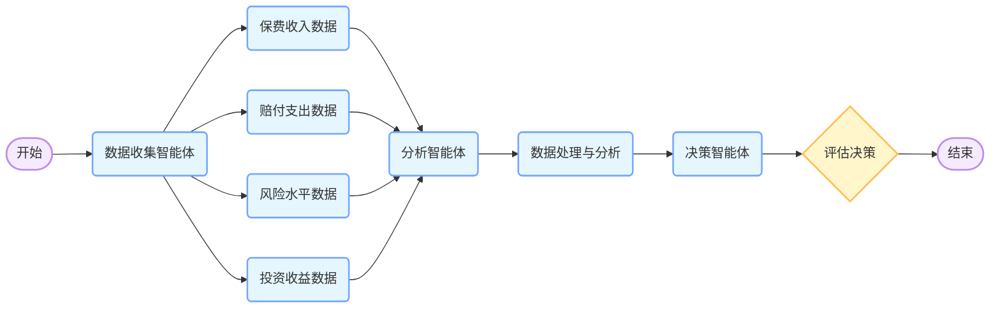

# 运用多智能体AI优化巴菲特的保险业务价值评估

> 关键词：多智能体AI、巴菲特、保险业务、价值评估、优化策略

> 摘要：本文聚焦于运用多智能体AI技术来优化巴菲特所涉及的保险业务价值评估。首先介绍了研究的背景、目的、预期读者等信息，详细阐述了多智能体AI与保险业务价值评估的核心概念及联系。接着深入探讨了核心算法原理，给出Python源代码示例，同时分析了相关的数学模型和公式。通过项目实战展示了如何在实际中运用多智能体AI进行保险业务价值评估，并分析了其实际应用场景。最后推荐了相关的学习资源、开发工具框架和论文著作，总结了未来发展趋势与挑战，还提供了常见问题解答及扩展阅读参考资料，旨在为保险业务价值评估领域提供创新且有效的技术手段和思路。

## 1. 背景介绍 
### 1.1 目的和范围
保险业务价值评估一直是金融领域的重要课题，对于投资者如巴菲特而言，准确评估保险业务价值有助于做出明智的投资决策。传统的保险业务价值评估方法存在一定的局限性，如难以全面考虑复杂多变的市场环境、风险因素等。本文的目的在于探讨如何运用多智能体AI技术来优化保险业务价值评估，提高评估的准确性和效率。范围涵盖多智能体AI的基本原理、保险业务价值评估的关键要素，以及如何将二者结合进行实际应用。

### 1.2 预期读者
本文预期读者包括金融领域的专业人士，如保险分析师、投资经理等，他们可以从本文中获取新的评估思路和技术手段；计算机科学领域的研究者和开发者，特别是对多智能体系统和AI应用感兴趣的人员，能从中了解到AI在金融领域的具体应用场景；同时也适合对保险业务和AI技术有一定了解，希望深入学习相关知识的爱好者。

### 1.3 文档结构概述
本文首先介绍背景信息，让读者了解研究的目的和相关范围。接着阐述多智能体AI与保险业务价值评估的核心概念及联系，包括原理和架构。然后详细讲解核心算法原理和具体操作步骤，给出Python源代码示例。随后分析相关的数学模型和公式，并举例说明。通过项目实战展示代码实现和解读。之后探讨实际应用场景，推荐相关的工具和资源。最后总结未来发展趋势与挑战，提供常见问题解答及扩展阅读参考资料。

### 1.4 术语表
#### 1.4.1 核心术语定义
- **多智能体AI**：由多个智能体组成的系统，每个智能体具有一定的自主性、交互性和适应性，能够通过相互协作完成复杂任务。
- **保险业务价值评估**：对保险业务的经济价值进行评估，考虑多个因素，如保费收入、赔付支出、风险水平等，以确定保险业务的盈利能力和市场价值。
- **智能体**：在多智能体系统中，具有感知、决策和行动能力的实体。

#### 1.4.2 相关概念解释
- **自主性**：智能体能够独立地感知环境并做出决策，无需外部的直接控制。
- **交互性**：智能体之间能够进行信息交流和协作，共同完成任务。
- **适应性**：智能体能够根据环境的变化调整自己的行为和策略。

#### 1.4.3 缩略词列表
- **AI**：Artificial Intelligence（人工智能）
- **MAS**：Multi - Agent System（多智能体系统）

## 2. 核心概念与联系 
### 2.1 多智能体AI的原理
多智能体AI的核心在于多个智能体之间的协作和交互。每个智能体都有自己的目标、知识和能力，通过与其他智能体的通信和合作，共同完成复杂的任务。智能体可以是软件程序、机器人等。智能体的行为通常基于其内部的决策模型，该模型根据感知到的环境信息和自身的目标来选择合适的行动。

### 2.2 保险业务价值评估的要素
保险业务价值评估需要考虑多个要素，包括：
- **保费收入**：保险公司通过销售保险产品获得的收入，是保险业务的主要收入来源。
- **赔付支出**：保险公司在保险事故发生时向被保险人支付的赔偿金额，是保险业务的主要成本之一。
- **风险水平**：包括保险标的的风险程度、市场风险等，风险水平越高，保险业务的价值可能越低。
- **投资收益**：保险公司将保费收入进行投资所获得的收益，对保险业务的价值有重要影响。

### 2.3 多智能体AI与保险业务价值评估的联系
多智能体AI可以用于优化保险业务价值评估的多个方面。例如，不同的智能体可以分别负责收集保费收入、赔付支出等数据，通过智能体之间的协作和信息共享，可以更全面、准确地分析这些数据。智能体还可以根据市场环境的变化动态调整评估模型，提高评估的适应性和准确性。

### 2.4 文本示意图
多智能体AI与保险业务价值评估的联系可以用以下文本描述：多智能体AI系统中的多个智能体分别与保险业务价值评估的各个要素相对应。数据收集智能体负责收集保费收入、赔付支出等数据，分析智能体对这些数据进行处理和分析，决策智能体根据分析结果做出评估决策。智能体之间通过通信机制进行信息交流和协作，以实现对保险业务价值的准确评估。

### 2.5 Mermaid流程图


## 3. 核心算法原理 & 具体操作步骤 
### 3.1 核心算法原理
多智能体AI在保险业务价值评估中可以采用基于强化学习的算法。强化学习是一种通过智能体与环境的交互来学习最优策略的方法。在保险业务价值评估中，智能体的目标是最大化保险业务的价值评估准确性。智能体根据当前的环境状态（如保费收入、赔付支出等数据）选择行动（如调整评估模型的参数），并根据环境反馈的奖励（如评估误差的减小）来更新自己的策略。

### 3.2 Python源代码示例
```python
import numpy as np

# 定义智能体类
class Agent:
    def __init__(self, state_size, action_size):
        self.state_size = state_size
        self.action_size = action_size
        self.q_table = np.zeros((state_size, action_size))
        self.learning_rate = 0.1
        self.discount_factor = 0.9

    def act(self, state):
        # 选择行动
        if np.random.uniform(0, 1) < 0.1:
            return np.random.choice(self.action_size)
        else:
            return np.argmax(self.q_table[state, :])

    def update(self, state, action, reward, next_state):
        # 更新Q表
        q_value = self.q_table[state, action]
        max_q_next = np.max(self.q_table[next_state, :])
        new_q_value = q_value + self.learning_rate * (reward + self.discount_factor * max_q_next - q_value)
        self.q_table[state, action] = new_q_value

# 模拟保险业务数据
state_size = 10
action_size = 5
agent = Agent(state_size, action_size)

# 模拟训练过程
for episode in range(100):
    state = np.random.randint(0, state_size)
    for step in range(20):
        action = agent.act(state)
        # 模拟奖励
        reward = np.random.randint(-10, 10)
        next_state = np.random.randint(0, state_size)
        agent.update(state, action, reward, next_state)
        state = next_state
```

### 3.3 具体操作步骤
1. **数据收集**：使用数据收集智能体收集保费收入、赔付支出、风险水平、投资收益等数据。
2. **状态表示**：将收集到的数据进行处理，转换为智能体可以理解的状态表示。例如，可以将数据进行归一化处理，然后将其组合成一个向量作为状态。
3. **智能体初始化**：初始化强化学习智能体，包括定义状态空间、动作空间、Q表等。
4. **训练智能体**：智能体根据当前状态选择行动，与环境进行交互，获取奖励，并根据奖励更新自己的策略。重复这个过程，直到智能体收敛到最优策略。
5. **评估决策**：使用训练好的智能体对保险业务的价值进行评估，根据智能体的决策输出评估结果。

## 4. 数学模型和公式 & 详细讲解 & 举例说明 
### 4.1 强化学习的数学模型
强化学习的核心是马尔可夫决策过程（MDP），其由一个四元组 $(S, A, P, R)$ 表示，其中：
- $S$ 是状态空间，包含所有可能的状态。
- $A$ 是动作空间，包含所有可能的动作。
- $P$ 是状态转移概率，$P(s'|s, a)$ 表示在状态 $s$ 下采取动作 $a$ 转移到状态 $s'$ 的概率。
- $R$ 是奖励函数，$R(s, a)$ 表示在状态 $s$ 下采取动作 $a$ 所获得的奖励。

### 4.2 Q - learning算法公式
Q - learning是一种常用的强化学习算法，其更新公式为：
$$Q(s, a) \leftarrow Q(s, a) + \alpha [R(s, a) + \gamma \max_{a'} Q(s', a') - Q(s, a)]$$
其中：
- $Q(s, a)$ 是状态 $s$ 下采取动作 $a$ 的Q值。
- $\alpha$ 是学习率，控制每次更新的步长。
- $\gamma$ 是折扣因子，用于平衡即时奖励和未来奖励。
- $R(s, a)$ 是在状态 $s$ 下采取动作 $a$ 所获得的奖励。
- $s'$ 是采取动作 $a$ 后转移到的下一个状态。

### 4.3 详细讲解
Q - learning算法的核心思想是通过不断更新Q值来逼近最优策略。智能体在每个时间步根据当前状态选择动作，与环境进行交互，获取奖励和下一个状态。然后根据上述公式更新Q值，使得Q值逐渐收敛到最优值。学习率 $\alpha$ 决定了每次更新的幅度，折扣因子 $\gamma$ 决定了未来奖励的重要性。

### 4.4 举例说明
假设保险业务的状态空间 $S = \{s_1, s_2, s_3\}$，动作空间 $A = \{a_1, a_2\}$。初始时，Q表 $Q$ 中的所有值都为0。智能体在状态 $s_1$ 下选择动作 $a_1$，获得奖励 $R(s_1, a_1) = 5$，转移到状态 $s_2$。假设学习率 $\alpha = 0.1$，折扣因子 $\gamma = 0.9$，则根据Q - learning公式更新Q值：
$$Q(s_1, a_1) \leftarrow Q(s_1, a_1) + 0.1 [5 + 0.9 \max_{a'} Q(s_2, a') - Q(s_1, a_1)]$$
由于初始时 $Q(s_2, a') = 0$，则：
$$Q(s_1, a_1) \leftarrow 0 + 0.1 [5 + 0.9 \times 0 - 0] = 0.5$$

## 5. 项目实战：代码实际案例和详细解释说明 
### 5.1 开发环境搭建
- **Python环境**：建议使用Python 3.7及以上版本，可以通过Anaconda或Python官方网站进行安装。
- **相关库**：需要安装 `numpy` 库，用于数值计算。可以使用以下命令进行安装：
```sh
pip install numpy
```

### 5.2 源代码详细实现和代码解读
```python
import numpy as np

# 定义智能体类
class Agent:
    def __init__(self, state_size, action_size):
        # 初始化状态空间大小
        self.state_size = state_size
        # 初始化动作空间大小
        self.action_size = action_size
        # 初始化Q表，初始值都为0
        self.q_table = np.zeros((state_size, action_size))
        # 学习率，控制每次更新的步长
        self.learning_rate = 0.1
        # 折扣因子，平衡即时奖励和未来奖励
        self.discount_factor = 0.9

    def act(self, state):
        # 以一定的概率随机选择动作（探索）
        if np.random.uniform(0, 1) < 0.1:
            return np.random.choice(self.action_size)
        else:
            # 选择Q值最大的动作（利用）
            return np.argmax(self.q_table[state, :])

    def update(self, state, action, reward, next_state):
        # 获取当前状态和动作的Q值
        q_value = self.q_table[state, action]
        # 获取下一个状态的最大Q值
        max_q_next = np.max(self.q_table[next_state, :])
        # 根据Q - learning公式更新Q值
        new_q_value = q_value + self.learning_rate * (reward + self.discount_factor * max_q_next - q_value)
        self.q_table[state, action] = new_q_value

# 模拟保险业务数据
state_size = 10
action_size = 5
agent = Agent(state_size, action_size)

# 模拟训练过程
for episode in range(100):
    # 随机初始化状态
    state = np.random.randint(0, state_size)
    for step in range(20):
        # 智能体选择动作
        action = agent.act(state)
        # 模拟奖励
        reward = np.random.randint(-10, 10)
        # 模拟下一个状态
        next_state = np.random.randint(0, state_size)
        # 更新智能体的Q表
        agent.update(state, action, reward, next_state)
        # 更新当前状态
        state = next_state
```
### 5.3 代码解读与分析
- **智能体类 `Agent`**：
  - `__init__` 方法：初始化智能体的状态空间大小、动作空间大小、Q表、学习率和折扣因子。
  - `act` 方法：智能体根据当前状态选择动作，以一定的概率进行探索（随机选择动作），否则选择Q值最大的动作。
  - `update` 方法：根据Q - learning公式更新Q表。
- **训练过程**：
  - 通过循环模拟多个回合的训练，每个回合中智能体在不同的状态下选择动作，与环境进行交互，获取奖励和下一个状态，并更新Q表。

## 6. 实际应用场景 
### 6.1 保险投资决策
投资者可以使用多智能体AI优化的保险业务价值评估方法来评估不同保险公司的业务价值，从而做出更明智的投资决策。例如，通过分析保费收入、赔付支出、风险水平等因素，评估保险公司的盈利能力和市场价值，选择具有投资潜力的保险公司进行投资。

### 6.2 保险产品定价
保险公司可以利用多智能体AI优化的评估方法来确定保险产品的价格。通过准确评估保险业务的成本和风险，制定合理的保费价格，既能保证公司的盈利，又能提高产品的市场竞争力。

### 6.3 风险管理
多智能体AI可以帮助保险公司更好地管理风险。通过实时监测保险业务的各项指标，如保费收入、赔付支出等，及时发现潜在的风险，并采取相应的措施进行风险控制。例如，当赔付支出过高时，智能体可以建议调整保险产品的条款或提高保费价格。

## 7. 工具和资源推荐
### 7.1 学习资源推荐
#### 7.1.1 书籍推荐
- 《强化学习：原理与Python实现》：详细介绍了强化学习的基本原理和算法，并给出了Python实现代码，有助于读者深入理解强化学习在多智能体AI中的应用。
- 《保险学原理》：系统介绍了保险业务的基本原理、运作机制和价值评估方法，为保险业务价值评估提供了理论基础。

#### 7.1.2 在线课程
- Coursera上的“Reinforcement Learning Specialization”：由知名教授授课，全面介绍了强化学习的理论和实践，包括多智能体强化学习的相关内容。
- edX上的“Introduction to Insurance”：提供了保险业务的入门知识，包括保险产品、风险管理等方面的内容。

#### 7.1.3 技术博客和网站
- Medium：上面有很多关于多智能体AI和保险业务