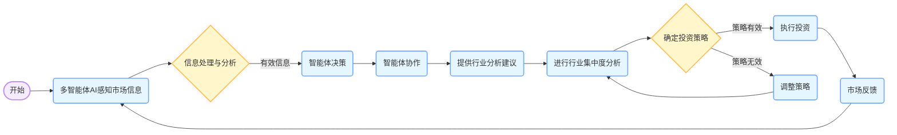

# 运用多智能体AI优化巴菲特的行业集中度分析

> 关键词：多智能体AI、巴菲特、行业集中度分析、投资策略、优化

> 摘要：本文旨在探讨如何运用多智能体AI技术来优化巴菲特的行业集中度分析。首先介绍了研究的背景，包括目的、预期读者、文档结构等。接着阐述了多智能体AI和行业集中度分析的核心概念及联系，并给出相应的原理和架构示意图与流程图。详细讲解了核心算法原理，用Python代码进行了具体实现。通过数学模型和公式深入剖析行业集中度分析的本质，并举例说明。以项目实战的方式展示了如何搭建开发环境、实现源代码并进行解读分析。探讨了该方法的实际应用场景，推荐了相关的学习资源、开发工具框架和论文著作。最后总结了未来发展趋势与挑战，解答了常见问题，并提供了扩展阅读和参考资料。

## 1. 背景介绍 
### 1.1 目的和范围
巴菲特的投资理念一直备受全球投资者的关注，其中行业集中度分析是其投资决策的重要组成部分。通过合理的行业集中度配置，巴菲特能够在降低风险的同时获取可观的收益。然而，传统的行业集中度分析方法可能存在一定的局限性，如难以处理复杂多变的市场信息、不能及时适应市场动态等。本研究的目的是运用多智能体AI技术对巴菲特的行业集中度分析进行优化，提高分析的准确性和及时性，为投资者提供更科学的投资决策依据。

本研究的范围主要涵盖多智能体AI技术的原理和应用、巴菲特的行业集中度分析方法、如何将两者结合进行优化以及相关的实证研究和案例分析。

### 1.2 预期读者
本文预期读者包括对投资领域感兴趣的专业投资者、金融分析师、研究多智能体AI技术的科研人员、相关专业的学生以及对智能投资决策有探索欲望的人士。

### 1.3 文档结构概述
本文将按照以下结构展开：首先介绍背景信息，包括研究目的、预期读者和文档结构概述等；接着阐述多智能体AI和行业集中度分析的核心概念及联系，给出原理和架构示意图与流程图；详细讲解核心算法原理，用Python代码实现；通过数学模型和公式深入分析行业集中度；进行项目实战，展示开发环境搭建、源代码实现和解读；探讨实际应用场景；推荐相关的学习资源、开发工具框架和论文著作；总结未来发展趋势与挑战；解答常见问题；提供扩展阅读和参考资料。

### 1.4 术语表
#### 1.4.1 核心术语定义
- **多智能体AI**：由多个智能体组成的人工智能系统，每个智能体具有一定的自主决策能力和交互能力，能够通过协作完成复杂的任务。
- **行业集中度**：指某一行业内少数几家最大企业所占市场份额的总和，反映了行业的竞争程度和市场结构。
- **投资组合**：投资者将资金分散投资于不同的资产或行业，以达到降低风险和获取收益的目的。

#### 1.4.2 相关概念解释
- **智能体**：具有感知、决策和行动能力的实体，能够根据环境变化自主调整行为。
- **市场信息**：包括股票价格、成交量、宏观经济数据、行业动态等与市场相关的各种信息。
- **投资决策**：投资者根据自身的投资目标、风险承受能力和市场情况等因素，选择合适的投资资产和投资策略的过程。

#### 1.4.3 缩略词列表
- **AI**：Artificial Intelligence，人工智能
- **MAB**：Multi - Agent Based，基于多智能体的

## 2. 核心概念与联系 
### 2.1 多智能体AI原理
多智能体AI系统由多个智能体组成，每个智能体具有一定的知识和能力，能够感知环境并做出决策。智能体之间通过通信和协作来完成共同的任务。其基本原理可以概括为以下几个方面：
- **感知**：智能体通过传感器等设备获取环境信息，包括市场数据、其他智能体的状态等。
- **决策**：根据感知到的信息，智能体运用自身的知识和算法进行推理和决策，选择合适的行动方案。
- **行动**：智能体将决策结果转化为实际行动，对环境产生影响。
- **协作**：多个智能体之间通过通信和协调，相互配合，共同完成复杂的任务。

### 2.2 巴菲特的行业集中度分析原理
巴菲特认为，通过集中投资于少数几个具有竞争优势的行业，可以降低投资风险并获取长期稳定的收益。他注重对行业的深入研究，选择那些具有可持续竞争优势、管理优秀、财务状况良好的行业进行投资。行业集中度分析的关键在于确定合适的行业投资比例，避免过度分散或过度集中投资。

### 2.3 两者的联系
多智能体AI技术可以为巴菲特的行业集中度分析提供更强大的支持。多智能体系统可以实时感知市场信息，快速处理和分析大量的数据，为行业集中度分析提供更准确的依据。智能体之间的协作可以模拟不同投资者的决策过程，考虑多种因素的影响，从而优化行业集中度的配置。同时，多智能体AI可以根据市场变化及时调整投资策略，提高投资决策的灵活性和适应性。

### 2.4 核心概念原理和架构的文本示意图
```plaintext
多智能体AI系统
|-- 智能体1
|   |-- 感知模块
|   |-- 决策模块
|   |-- 行动模块
|-- 智能体2
|   |-- 感知模块
|   |-- 决策模块
|   |-- 行动模块
|-- ...
|-- 通信模块（智能体之间通信）

行业集中度分析
|-- 行业研究
|   |-- 竞争优势分析
|   |-- 财务状况分析
|   |-- 管理团队分析
|-- 投资比例确定
|   |-- 风险评估
|   |-- 收益预期

多智能体AI与行业集中度分析结合
|-- 多智能体AI提供市场信息和决策支持
|-- 行业集中度分析确定投资策略
|-- 相互反馈和优化
```

### 2.5 Mermaid流程图


## 3. 核心算法原理 & 具体操作步骤 
### 3.1 核心算法原理
本研究采用的核心算法是基于多智能体强化学习的算法。每个智能体可以看作是一个独立的学习者，通过与环境的交互不断优化自己的策略。智能体的目标是最大化自己的累积奖励，奖励函数可以根据投资收益、风险等因素来设计。

具体来说，智能体在每个时间步 $t$ 感知环境状态 $s_t$，根据当前策略 $\pi$ 选择行动 $a_t$，执行行动后环境会转移到新的状态 $s_{t + 1}$，并给予智能体一个奖励 $r_t$。智能体通过不断地尝试和学习，调整自己的策略 $\pi$，使得累积奖励 $\sum_{t = 0}^{T} \gamma^t r_t$ 最大化，其中 $\gamma$ 是折扣因子，表示未来奖励的重要性。

### 3.2 具体操作步骤
1. **智能体初始化**：定义智能体的数量、状态空间、行动空间和初始策略。
2. **环境初始化**：设置市场环境的初始状态，包括行业数据、宏观经济数据等。
3. **循环迭代**：
    - 每个智能体感知当前环境状态 $s_t$。
    - 智能体根据当前策略 $\pi$ 选择行动 $a_t$。
    - 执行行动 $a_t$，环境转移到新的状态 $s_{t + 1}$，并给予智能体奖励 $r_t$。
    - 智能体根据奖励 $r_t$ 和新的状态 $s_{t + 1}$ 更新自己的策略 $\pi$。
4. **终止条件判断**：当达到预设的迭代次数或满足其他终止条件时，停止迭代。

### 3.3 Python源代码实现
```python
import numpy as np

# 定义智能体类
class Agent:
    def __init__(self, state_space, action_space, learning_rate=0.1, discount_factor=0.9):
        self.state_space = state_space
        self.action_space = action_space
        self.learning_rate = learning_rate
        self.discount_factor = discount_factor
        # 初始化Q表
        self.q_table = np.zeros((state_space, action_space))

    def choose_action(self, state):
        # 基于Q表选择行动
        if np.random.uniform(0, 1) < 0.1:  # 探索概率
            action = np.random.choice(self.action_space)
        else:
            action = np.argmax(self.q_table[state, :])
        return action

    def update_q_table(self, state, action, reward, next_state):
        # 更新Q表
        max_q_next = np.max(self.q_table[next_state, :])
        self.q_table[state, action] += self.learning_rate * (reward + self.discount_factor * max_q_next - self.q_table[state, action])

# 定义环境类
class Environment:
    def __init__(self, num_states, num_actions):
        self.num_states = num_states
        self.num_actions = num_actions
        self.current_state = np.random.randint(0, num_states)

    def step(self, action):
        # 执行行动，返回新状态和奖励
        next_state = np.random.randint(0, self.num_states)
        reward = np.random.randint(-1, 2)  # 随机奖励
        return next_state, reward

# 主函数
def main():
    num_states = 10
    num_actions = 5
    agent = Agent(num_states, num_actions)
    env = Environment(num_states, num_actions)
    num_episodes = 1000

    for episode in range(num_episodes):
        state = env.current_state
        total_reward = 0
        done = False
        while not done:
            action = agent.choose_action(state)
            next_state, reward = env.step(action)
            agent.update_q_table(state, action, reward, next_state)
            state = next_state
            total_reward += reward
            if np.random.uniform(0, 1) < 0.1:  # 随机终止条件
                done = True
        print(f"Episode {episode}: Total Reward = {total_reward}")

if __name__ == "__main__":
    main()
```

## 4. 数学模型和公式 & 详细讲解 & 举例说明 
### 4.1 行业集中度数学模型
常用的行业集中度指标有 $CR_n$ 指数和赫芬达尔 - 赫希曼指数（HHI）。

#### 4.1.1 $CR_n$ 指数
$CR_n$ 指数是指行业内前 $n$ 家最大企业的市场份额之和，计算公式为：
$$CR_n=\sum_{i = 1}^{n}S_i$$
其中，$S_i$ 表示第 $i$ 家企业的市场份额。

例如，某行业有 5 家企业，市场份额分别为 30%、25%、20%、15%、10%。若计算 $CR_3$ 指数，则：
$$CR_3=30\% + 25\%+20\% = 75\%$$

#### 4.1.2 赫芬达尔 - 赫希曼指数（HHI）
HHI 指数是指行业内所有企业市场份额的平方和，计算公式为：
$$HHI=\sum_{i = 1}^{N}S_i^2$$
其中，$N$ 表示行业内企业的总数，$S_i$ 表示第 $i$ 家企业的市场份额。

例如，上述行业的 HHI 指数为：
$$HHI=(0.3)^2+(0.25)^2+(0.2)^2+(0.15)^2+(0.1)^2 = 0.225$$

### 4.2 多智能体强化学习数学模型
多智能体强化学习的目标是让每个智能体最大化自己的累积奖励。对于单个智能体，其价值函数 $V^{\pi}(s)$ 表示在策略 $\pi$ 下从状态 $s$ 开始的期望累积奖励，计算公式为：
$$V^{\pi}(s)=E_{\pi}\left[\sum_{t = 0}^{\infty}\gamma^t r_t|s_0 = s\right]$$
其中，$E_{\pi}$ 表示在策略 $\pi$ 下的期望，$\gamma$ 是折扣因子，$r_t$ 是时间步 $t$ 的奖励。

动作价值函数 $Q^{\pi}(s, a)$ 表示在策略 $\pi$ 下从状态 $s$ 采取行动 $a$ 后的期望累积奖励，计算公式为：
$$Q^{\pi}(s, a)=E_{\pi}\left[\sum_{t = 0}^{\infty}\gamma^t r_t|s_0 = s, a_0 = a\right]$$

智能体通过不断更新 $Q$ 表来优化自己的策略，$Q$ 学习的更新公式为：
$$Q(s, a)\leftarrow Q(s, a)+\alpha\left[r+\gamma\max_{a'}Q(s', a') - Q(s, a)\right]$$
其中，$\alpha$ 是学习率，$r$ 是奖励，$s'$ 是下一个状态。

### 4.3 结合多智能体AI和行业集中度的数学模型
在结合多智能体AI和行业集中度分析时，可以将行业集中度指标作为智能体的状态信息的一部分，奖励函数可以根据投资收益和行业集中度的合理性来设计。例如，奖励函数可以表示为：
$$r = \beta_1R+\beta_2(1 - |HHI - HHI_{target}|)$$
其中，$R$ 是投资收益，$HHI$ 是当前行业集中度的 HHI 指数，$HHI_{target}$ 是目标 HHI 指数，$\beta_1$ 和 $\beta_2$ 是权重系数。

## 5. 项目实战：代码实际案例和详细解释说明 
### 5.1  开发环境搭建
#### 5.1.1 安装Python
首先需要安装Python，建议使用Python 3.7及以上版本。可以从Python官方网站（https://www.python.org/downloads/）下载安装包，按照安装向导进行安装。

#### 5.1.2 安装必要的库
本项目需要使用一些Python库，如 `numpy`、`pandas` 等。可以使用 `pip` 命令进行安装：
```sh
pip install numpy pandas
```

### 5.2  源代码详细实现和代码解读
```python
import numpy as np
import pandas as pd

# 定义智能体类
class Agent:
    def __init__(self, state_space, action_space, learning_rate=0.1, discount_factor=0.9):
        self.state_space = state_space
        self.action_space = action_space
        self.learning_rate = learning_rate
        self.discount_factor = discount_factor
        # 初始化Q表
        self.q_table = np.zeros((state_space, action_space))

    def choose_action(self, state):
        # 基于Q表选择行动
        if np.random.uniform(0, 1) < 0.1:  # 探索概率
            action = np.random.choice(self.action_space)
        else:
            action = np.argmax(self.q_table[state, :])
        return action

    def update_q_table(self, state, action, reward, next_state):
        # 更新Q表
        max_q_next = np.max(self.q_table[next_state, :])
        self.q_table[state, action] += self.learning_rate * (reward + self.discount_factor * max_q_next - self.q_table[state, action])

# 定义环境类
class Environment:
    def __init__(self, num_states, num_actions, industry_data):
        self.num_states = num_states
        self.num_actions = num_actions
        self.industry_data = industry_data
        self.current_state = np.random.randint(0, num_states)

    def step(self, action):
        # 执行行动，返回新状态和奖励
        next_state = np.random.randint(0, self.num_states)
        # 计算投资收益和行业集中度
        investment_return = self.calculate_investment_return(action)
        hhi = self.calculate_hhi()
        # 定义奖励函数
        target_hhi = 0.2
        reward = 0.7 * investment_return + 0.3 * (1 - abs(hhi - target_hhi))
        return next_state, reward

    def calculate_investment_return(self, action):
        # 简单模拟投资收益
        return np.random.randint(-1, 2)

    def calculate_hhi(self):
        # 计算赫芬达尔 - 赫希曼指数
        market_shares = self.industry_data['market_share']
        hhi = np.sum(market_shares ** 2)
        return hhi

# 主函数
def main():
    num_states = 10
    num_actions = 5
    # 模拟行业数据
    industry_data = pd.DataFrame({
        'market_share': np.random.rand(5)
    })
    industry_data['market_share'] = industry_data['market_share'] / industry_data['market_share'].sum()  # 归一化
    agent = Agent(num_states, num_actions)
    env = Environment(num_states, num_actions, industry_data)
    num_episodes = 1000

    for episode in range(num_episodes):
        state = env.current_state
        total_reward = 0
        done = False
        while not done:
            action = agent.choose_action(state)
            next_state, reward = env.step(action)
            agent.update_q_table(state, action, reward, next_state)
            state = next_state
            total_reward += reward
            if np.random.uniform(0, 1) < 0.1:  # 随机终止条件
                done = True
        print(f"Episode {episode}: Total Reward = {total_reward}")

if __name__ == "__main__":
    main()
```

### 5.3  代码解读与分析
#### 5.3.1 智能体类（`Agent`）
- `__init__` 方法：初始化智能体的状态空间、行动空间、学习率、折扣因子和 Q 表。
- `choose_action` 方法：根据当前状态选择行动，以一定的概率进行探索，否则选择 Q 表中值最大的行动。
- `update_q_table` 方法：根据奖励和下一个状态更新 Q 表。

#### 5.3.2 环境类（`Environment`）
- `__init__` 方法：初始化环境的状态空间、行动空间和行业数据。
- `step` 方法：执行行动，返回新状态和奖励。奖励函数结合了投资收益和行业集中度的合理性。
- `calculate_investment_return` 方法：简单模拟投资收益。
- `calculate_hhi` 方法：计算赫芬达尔 - 赫希曼指数。

#### 5.3.3 主函数（`main`）
- 初始化智能体和环境。
- 模拟行业数据。
- 进行多次迭代，每个迭代中智能体与环境交互，更新 Q 表并计算总奖励。

## 6. 实际应用场景 
### 6.1 投资决策辅助
对于专业投资者和投资机构，运用多智能体AI优化的行业集中度分析可以为投资决策提供更科学的依据。通过实时分析市场信息和行业动态，智能体可以帮助投资者确定合理的行业投资比例，优化投资组合，降低风险并提高收益。

### 6.2 风险管理
在金融风险管理中，行业集中度分析是评估风险的重要手段。多智能体AI可以实时监测行业集中度的变化，及时发现潜在的风险点，并提供相应的风险应对策略。例如，当某个行业的集中度过高时，智能体可以提醒投资者进行分散投资，降低行业风险。

### 6.3 行业研究
对于行业研究人员来说，多智能体AI可以帮助他们更深入地了解行业结构和竞争态势。通过分析行业集中度的变化趋势，研究人员可以预测行业的发展方向，为企业的战略决策提供参考。

## 7. 工具和资源推荐
### 7.1 学习资源推荐
#### 7.1.1 书籍推荐
- 《人工智能：一种现代的方法》：全面介绍了人工智能的基本概念、算法和应用，是学习人工智能的经典教材。
- 《强化学习：原理与Python实现》：详细讲解了强化学习的原理和算法，并通过Python代码进行实现，对于理解多智能体强化学习有很大帮助。
- 《聪明的投资者》：巴菲特的老师格雷厄姆的经典著作，介绍了价值投资的理念和方法，对于理解巴菲特的投资思想有重要意义。

#### 7.1.2 在线课程
- Coursera上的“Artificial Intelligence”课程：由斯坦福大学教授授课，系统地介绍了人工智能的各个领域。
- edX上的“Reinforcement Learning”课程：深入讲解了强化学习的理论和实践。
- 中国大学MOOC上的“投资学原理”课程：介绍了投资学的基本原理和方法，包括行业分析和投资组合管理。

#### 7.1.3 技术博客和网站
- Medium：有很多关于人工智能和投资领域的优秀博客文章，可以及时了解最新的技术动态和研究成果。
- arXiv：一个预印本平台，提供了大量关于人工智能和金融领域的研究论文。
- 雪球网：一个投资交流社区，有很多投资者分享的投资经验和行业分析报告。

### 7.2 开发工具框架推荐
#### 7.2.1 IDE和编辑器
- PyCharm：一款专业的Python集成开发环境，提供了丰富的代码编辑、调试和分析功能。
- Visual Studio Code：一款轻量级的代码编辑器，支持多种编程语言，有大量的插件可以扩展功能。

#### 7.2.2 调试和性能分析工具
- `pdb`：Python自带的调试工具，可以帮助开发者定位代码中的问题。
- `cProfile`：Python的性能分析工具，可以分析代码的执行时间和资源消耗情况。

#### 7.2.3 相关框架和库
- `OpenAI Gym`：一个用于开发和比较强化学习算法的工具包，提供了丰富的环境和示例代码。
- `TensorFlow`：一个开源的机器学习框架，支持深度学习和强化学习算法的开发和训练。
- `PyTorch`：另一个流行的深度学习框架，具有简洁的API和高效的计算性能。

### 7.3 相关论文著作推荐
#### 7.3.1 经典论文
- “Reinforcement Learning: An Introduction”：Richard S. Sutton和Andrew G. Barto的经典著作，是强化学习领域的权威文献。
- “The Efficient Market Hypothesis and Its Critics”：Eugene F. Fama关于有效市场假说的经典论文，对于理解金融市场的运行机制有重要意义。

#### 7.3.2 最新研究成果
- 关注顶级学术会议如NeurIPS、ICML、IJCAI等上关于多智能体AI和金融领域的最新研究成果。
- 查阅《Journal of Financial Economics》、《The Review of Financial Studies》等金融领域的顶级期刊上的相关论文。

#### 7.3.3 应用案例分析
- 一些知名投资机构的研究报告和案例分析，如桥水基金、贝莱德等，这些案例可以帮助我们了解多智能体AI在实际投资中的应用。

## 8. 总结：未来发展趋势与挑战
### 8.1 未来发展趋势
- **更强大的智能体协作**：未来多智能体AI系统将实现更高效、更复杂的智能体协作，能够处理更庞大和复杂的市场信息，为行业集中度分析提供更精准的决策支持。
- **与其他技术的融合**：多智能体AI将与区块链、物联网等技术深度融合，实现数据的更安全、更高效共享，进一步提升行业集中度分析的准确性和及时性。
- **个性化投资策略**：根据投资者的不同风险偏好、投资目标和资金规模，多智能体AI可以提供个性化的行业集中度分析和投资策略，满足不同投资者的需求。

### 8.2 挑战
- **数据质量和隐私问题**：多智能体AI需要大量的市场数据来进行分析和决策，数据的质量和隐私保护是一个重要的挑战。不准确或不完整的数据可能导致错误的决策，而数据隐私问题也可能引发用户的担忧。
- **算法复杂度和计算资源需求**：多智能体强化学习等算法的复杂度较高，需要大量的计算资源来进行训练和优化。如何在有限的计算资源下提高算法的效率是一个亟待解决的问题。
- **市场不确定性**：金融市场具有高度的不确定性和复杂性，多智能体AI可能难以准确预测市场的变化。如何提高智能体的适应性和鲁棒性，以应对市场的不确定性，是未来研究的重点。

## 9. 附录：常见问题与解答
### 9.1 多智能体AI和传统AI有什么区别？
多智能体AI由多个智能体组成，每个智能体具有一定的自主决策能力和交互能力，能够通过协作完成复杂的任务。而传统AI通常是单个智能体系统，主要依靠预先设定的规则和算法进行决策。多智能体AI更强调智能体之间的协作和交互，能够更好地处理复杂多变的环境。

### 9.2 如何确定行业集中度的合理范围？
行业集中度的合理范围没有固定的标准，它受到行业特点、市场竞争程度、经济环境等多种因素的影响。一般来说，可以通过分析行业的历史数据、与同行业其他企业的比较以及对行业未来发展趋势的预测来确定一个相对合理的范围。

### 9.3 多智能体AI优化的行业集中度分析一定能提高投资收益吗？
多智能体AI优化的行业集中度分析可以为投资决策提供更科学的依据，但并不能保证一定能提高投资收益。金融市场具有高度的不确定性，投资收益还受到多种因素的影响，如宏观经济环境、政策变化、企业自身的经营状况等。多智能体AI只是帮助投资者降低风险、提高决策的准确性，但不能消除投资风险。

## 10. 扩展阅读 & 参考资料
- 《人工智能时代的投资决策》
- 《多智能体系统原理与应用》
- https://www.investopedia.com/
- https://www.researchgate.net/

作者：AI天才研究院/AI Genius Institute & 禅与计算机程序设计艺术 /Zen And The Art of Computer Programming