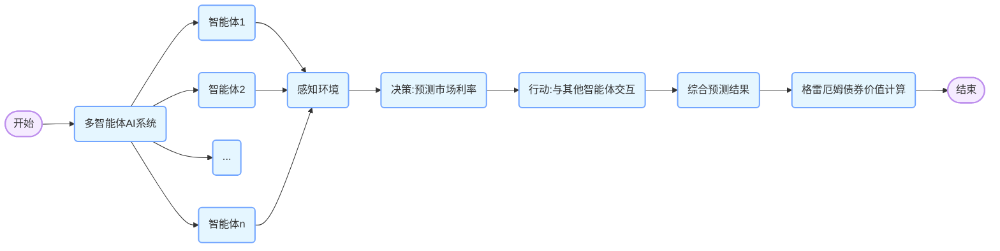

# 运用多智能体AI优化格雷厄姆的债券价值计算

> 关键词：多智能体AI、格雷厄姆债券价值计算、金融优化、人工智能应用、债券评估

> 摘要：本文聚焦于如何运用多智能体AI技术对格雷厄姆的债券价值计算方法进行优化。首先介绍了相关背景知识，包括研究目的、预期读者和文档结构等。接着阐述了多智能体AI和格雷厄姆债券价值计算的核心概念及两者之间的联系，并给出了相应的示意图和流程图。详细讲解了核心算法原理，通过Python代码进行了具体实现。还介绍了涉及的数学模型和公式，并举例说明。通过项目实战展示了如何搭建开发环境、实现源代码以及对代码进行解读分析。探讨了该优化方法的实际应用场景，推荐了相关的学习资源、开发工具框架和论文著作。最后总结了未来发展趋势与挑战，并提供了常见问题的解答和扩展阅读参考资料。

## 1. 背景介绍 
### 1.1 目的和范围
在金融领域，债券价值的准确计算对于投资者做出合理的投资决策至关重要。格雷厄姆的债券价值计算方法是一种经典的评估方式，但它存在一定的局限性，例如对市场动态变化的适应性不足等。本研究的目的是运用多智能体AI技术对格雷厄姆的债券价值计算方法进行优化，以提高债券价值评估的准确性和及时性。

本研究的范围主要涵盖多智能体AI技术的原理和应用、格雷厄姆债券价值计算方法的深入分析、两者的结合方式以及在实际金融市场中的应用验证。

### 1.2 预期读者
本文预期读者包括金融领域的投资者、金融分析师、从事金融科技研究的科研人员以及对人工智能在金融领域应用感兴趣的程序员和技术爱好者。对于投资者来说，了解多智能体AI优化的债券价值计算方法可以帮助他们做出更明智的投资决策；金融分析师可以将该方法应用到实际的债券评估工作中；科研人员可以在此基础上进行更深入的研究；程序员和技术爱好者则可以学习如何将多智能体AI技术应用到金融计算中。

### 1.3 文档结构概述
本文将按照以下结构进行组织：
- 核心概念与联系：介绍多智能体AI和格雷厄姆债券价值计算的核心概念，并分析它们之间的联系。
- 核心算法原理 & 具体操作步骤：详细阐述多智能体AI优化格雷厄姆债券价值计算的核心算法原理，并给出具体的操作步骤，同时使用Python代码进行实现。
- 数学模型和公式 & 详细讲解 & 举例说明：介绍涉及的数学模型和公式，并通过具体例子进行详细说明。
- 项目实战：代码实际案例和详细解释说明：通过一个实际项目展示如何搭建开发环境、实现源代码以及对代码进行解读分析。
- 实际应用场景：探讨多智能体AI优化格雷厄姆债券价值计算方法在实际金融市场中的应用场景。
- 工具和资源推荐：推荐相关的学习资源、开发工具框架和论文著作。
- 总结：未来发展趋势与挑战：总结多智能体AI优化格雷厄姆债券价值计算方法的未来发展趋势和面临的挑战。
- 附录：常见问题与解答：提供常见问题的解答。
- 扩展阅读 & 参考资料：提供扩展阅读的内容和参考资料。

### 1.4 术语表
#### 1.4.1 核心术语定义
- **多智能体AI（Multi - Agent AI）**：由多个智能体组成的人工智能系统，每个智能体具有一定的自主性和智能，能够通过与其他智能体和环境进行交互来完成特定的任务。
- **格雷厄姆的债券价值计算**：由本杰明·格雷厄姆提出的一种计算债券价值的方法，主要考虑债券的票面利率、到期时间、市场利率等因素。
- **智能体（Agent）**：在多智能体系统中，具有感知环境、决策和行动能力的实体。

#### 1.4.2 相关概念解释
- **自主性**：智能体能够独立地感知环境并做出决策，不需要外部的直接控制。
- **交互性**：智能体可以与其他智能体和环境进行信息交换和合作。
- **适应性**：智能体能够根据环境的变化调整自己的行为和策略。

#### 1.4.3 缩略词列表
- **AI**：人工智能（Artificial Intelligence）
- **MDP**：马尔可夫决策过程（Markov Decision Process）

## 2. 核心概念与联系 

### 多智能体AI核心概念
多智能体AI是一种分布式人工智能系统，它由多个智能体组成。每个智能体可以看作是一个独立的个体，具有自己的目标、知识和能力。智能体通过感知环境获取信息，根据自身的决策规则进行决策，并采取相应的行动。智能体之间可以通过通信进行信息交换和合作，以实现共同的目标。

例如，在一个金融市场模拟的多智能体系统中，每个智能体可以代表一个投资者，它们可以根据市场信息（如股票价格、债券利率等）决定是否买入或卖出资产。智能体之间可以交流投资策略和市场看法，从而影响整个市场的走势。

### 格雷厄姆的债券价值计算核心概念
格雷厄姆的债券价值计算方法基于债券的基本特征和市场利率。债券的价值可以看作是未来现金流的现值之和。具体来说，债券的现金流包括定期支付的利息和到期时偿还的本金。计算债券价值时，需要将未来的现金流按照市场利率进行折现。

假设债券的票面利率为 $C$，面值为 $F$，到期时间为 $n$ 年，市场利率为 $r$。每年支付一次利息，则债券的价值 $V$ 可以通过以下公式计算：

$$V = C \times \sum_{i = 1}^{n} \frac{1}{(1 + r)^i} + \frac{F}{(1 + r)^n}$$

### 两者之间的联系
多智能体AI可以为格雷厄姆的债券价值计算带来优化。在传统的格雷厄姆债券价值计算中，市场利率通常被看作是一个固定的值。然而，在实际金融市场中，市场利率是不断变化的，受到多种因素的影响。多智能体AI可以通过模拟多个投资者的行为和决策，动态地预测市场利率的变化。每个智能体可以根据自己的知识和经验对市场利率进行预测，并通过与其他智能体的交互来更新自己的预测。这样，在计算债券价值时，可以使用更准确的市场利率预测值，从而提高债券价值计算的准确性。

### 文本示意图
```plaintext
多智能体AI系统
|-- 智能体1
|   |-- 感知环境（市场信息）
|   |-- 决策（预测市场利率）
|   |-- 行动（与其他智能体交互）
|-- 智能体2
|   |-- 感知环境（市场信息）
|   |-- 决策（预测市场利率）
|   |-- 行动（与其他智能体交互）
|...
|-- 智能体n
|   |-- 感知环境（市场信息）
|   |-- 决策（预测市场利率）
|   |-- 行动（与其他智能体交互）
|
|-- 综合预测结果
|
|-- 格雷厄姆债券价值计算
    |-- 使用综合预测的市场利率
    |-- 计算债券价值
```

### Mermaid流程图


## 3. 核心算法原理 & 具体操作步骤 

### 核心算法原理
多智能体AI优化格雷厄姆债券价值计算的核心算法基于智能体的决策和交互机制。每个智能体根据自己的感知信息和内部模型对市场利率进行预测。智能体之间通过通信交换预测信息，并根据一定的规则更新自己的预测。最终，将所有智能体的预测结果进行综合，得到一个更准确的市场利率预测值，用于格雷厄姆债券价值的计算。

在本算法中，我们使用马尔可夫决策过程（MDP）来描述智能体的决策过程。MDP是一种用于描述在不确定环境中进行决策的数学模型，它由状态、动作、转移概率和奖励函数组成。

### 具体操作步骤
1. **初始化智能体**：为每个智能体设置初始的知识和参数，包括初始的市场利率预测值、内部模型的参数等。
2. **感知环境**：每个智能体通过感知环境获取市场信息，如历史市场利率、宏观经济数据等。
3. **决策**：每个智能体根据自己的感知信息和内部模型对市场利率进行预测。
4. **交互**：智能体之间通过通信交换预测信息，并根据一定的规则更新自己的预测。例如，可以采用加权平均的方法，根据其他智能体的可信度对预测结果进行加权平均。
5. **综合预测结果**：将所有智能体的预测结果进行综合，得到一个最终的市场利率预测值。
6. **计算债券价值**：使用综合预测的市场利率值，根据格雷厄姆的债券价值计算公式计算债券的价值。
7. **更新智能体状态**：根据计算结果和市场的实际变化，更新智能体的知识和参数，为下一次计算做准备。

### Python源代码实现
```python
import numpy as np

# 定义智能体类
class Agent:
    def __init__(self, initial_prediction, credibility):
        self.prediction = initial_prediction
        self.credibility = credibility

    def perceive_environment(self, market_info):
        # 这里简单模拟感知环境，实际应用中需要根据具体情况实现
        pass

    def make_decision(self):
        # 这里简单保持预测值不变，实际应用中需要根据内部模型进行预测
        return self.prediction

    def interact(self, other_agents):
        weighted_sum = 0
        total_credibility = 0
        for agent in other_agents:
            weighted_sum += agent.prediction * agent.credibility
            total_credibility += agent.credibility
        # 更新自己的预测值
        self.prediction = weighted_sum / total_credibility

# 定义多智能体系统类
class MultiAgentSystem:
    def __init__(self, num_agents, initial_predictions, credibilities):
        self.agents = []
        for i in range(num_agents):
            agent = Agent(initial_predictions[i], credibilities[i])
            self.agents.append(agent)

    def run(self):
        # 感知环境
        for agent in self.agents:
            agent.perceive_environment(None)
        # 决策
        predictions = []
        for agent in self.agents:
            prediction = agent.make_decision()
            predictions.append(prediction)
        # 交互
        for agent in self.agents:
            other_agents = [a for a in self.agents if a!= agent]
            agent.interact(other_agents)
        # 综合预测结果
        final_prediction = np.mean([agent.prediction for agent in self.agents])
        return final_prediction

# 定义格雷厄姆债券价值计算函数
def graham_bond_value(coupon_rate, face_value, years_to_maturity, market_rate):
    coupon_payment = coupon_rate * face_value
    present_value_coupons = 0
    for i in range(1, years_to_maturity + 1):
        present_value_coupons += coupon_payment / ((1 + market_rate) ** i)
    present_value_face = face_value / ((1 + market_rate) ** years_to_maturity)
    bond_value = present_value_coupons + present_value_face
    return bond_value

# 示例参数
num_agents = 5
initial_predictions = [0.03, 0.032, 0.028, 0.031, 0.029]
credibilities = [0.2, 0.25, 0.15, 0.2, 0.2]
coupon_rate = 0.04
face_value = 1000
years_to_maturity = 10

# 创建多智能体系统
mas = MultiAgentSystem(num_agents, initial_predictions, credibilities)
# 运行多智能体系统得到市场利率预测值
predicted_market_rate = mas.run()
# 计算债券价值
bond_value = graham_bond_value(coupon_rate, face_value, years_to_maturity, predicted_market_rate)

print(f"预测的市场利率: {predicted_market_rate}")
print(f"债券价值: {bond_value}")
```

### 代码解释
1. **Agent类**：表示一个智能体，包含预测值和可信度属性。`perceive_environment` 方法用于感知环境，`make_decision` 方法用于进行决策，`interact` 方法用于与其他智能体进行交互并更新自己的预测值。
2. **MultiAgentSystem类**：表示多智能体系统，包含多个智能体。`run` 方法用于运行多智能体系统，包括感知环境、决策、交互和综合预测结果等步骤。
3. **graham_bond_value函数**：用于根据格雷厄姆的债券价值计算公式计算债券的价值。
4. **主程序**：创建多智能体系统，运行系统得到市场利率预测值，然后使用预测的市场利率计算债券价值。

## 4. 数学模型和公式 & 详细讲解 & 举例说明 

### 马尔可夫决策过程（MDP）模型
在多智能体AI优化格雷厄姆债券价值计算中，我们使用马尔可夫决策过程（MDP）来描述智能体的决策过程。MDP可以用一个五元组 $(S, A, P, R, \gamma)$ 表示，其中：
- $S$ 是状态空间，表示智能体所处的所有可能状态。在我们的场景中，状态可以包括历史市场利率、宏观经济数据等。
- $A$ 是动作空间，表示智能体可以采取的所有可能动作。在我们的场景中，动作可以是预测市场利率的某个值。
- $P(s'|s, a)$ 是状态转移概率，表示在状态 $s$ 下采取动作 $a$ 后转移到状态 $s'$ 的概率。
- $R(s, a)$ 是奖励函数，表示在状态 $s$ 下采取动作 $a$ 所获得的奖励。在我们的场景中，奖励可以根据预测的市场利率与实际市场利率的接近程度来定义。
- $\gamma$ 是折扣因子，用于权衡当前奖励和未来奖励的重要性，取值范围为 $[0, 1]$。

智能体的目标是找到一个最优策略 $\pi: S \to A$，使得在每个状态下采取的动作能够最大化长期累积奖励。

### 多智能体交互的加权平均公式
在智能体交互阶段，我们使用加权平均的方法来更新智能体的预测值。假设智能体 $i$ 与其他 $n$ 个智能体进行交互，其他智能体的预测值分别为 $p_1, p_2, \cdots, p_n$，可信度分别为 $c_1, c_2, \cdots, c_n$，则智能体 $i$ 更新后的预测值 $p_i'$ 可以通过以下公式计算：

$$p_i' = \frac{\sum_{j = 1}^{n} p_j c_j}{\sum_{j = 1}^{n} c_j}$$

### 格雷厄姆债券价值计算公式
如前文所述，假设债券的票面利率为 $C$，面值为 $F$，到期时间为 $n$ 年，市场利率为 $r$。每年支付一次利息，则债券的价值 $V$ 可以通过以下公式计算：

$$V = C \times \sum_{i = 1}^{n} \frac{1}{(1 + r)^i} + \frac{F}{(1 + r)^n}$$

### 举例说明
假设我们有一个债券，票面利率 $C = 0.05$，面值 $F = 1000$，到期时间 $n = 5$ 年。通过多智能体AI系统预测得到的市场利率 $r = 0.04$。

首先，计算每年的利息支付：$C \times F = 0.05 \times 1000 = 50$

然后，计算利息的现值之和：

$$\sum_{i = 1}^{5} \frac{50}{(1 + 0.04)^i} = 50 \times \left(\frac{1}{1.04} + \frac{1}{1.04^2} + \frac{1}{1.04^3} + \frac{1}{1.04^4} + \frac{1}{1.04^5}\right) \approx 222.59$$

最后，计算本金的现值：

$$\frac{1000}{(1 + 0.04)^5} \approx 821.93$$

债券的价值 $V$ 为：

$$V = 222.59 + 821.93 = 1044.52$$

因此，该债券的价值约为 1044.52 元。

## 5. 项目实战：代码实际案例和详细解释说明 

### 5.1  开发环境搭建
#### 安装Python
首先，需要安装Python编程语言。可以从Python官方网站（https://www.python.org/downloads/）下载适合自己操作系统的Python版本，并按照安装向导进行安装。建议安装Python 3.6及以上版本。

#### 安装必要的库
本项目需要使用 `numpy` 库进行数值计算。可以使用以下命令来安装 `numpy` 库：

```sh
pip install numpy
```

### 5.2  源代码详细实现和代码解读
以下是完整的源代码，我们将对其进行详细解读：

```python
import numpy as np

# 定义智能体类
class Agent:
    def __init__(self, initial_prediction, credibility):
        # 初始化智能体的预测值和可信度
        self.prediction = initial_prediction
        self.credibility = credibility

    def perceive_environment(self, market_info):
        # 这里简单模拟感知环境，实际应用中需要根据具体情况实现
        # 例如，可以从数据库或API获取市场信息
        pass

    def make_decision(self):
        # 这里简单保持预测值不变，实际应用中需要根据内部模型进行预测
        # 例如，可以使用机器学习模型进行预测
        return self.prediction

    def interact(self, other_agents):
        # 计算加权和
        weighted_sum = 0
        total_credibility = 0
        for agent in other_agents:
            weighted_sum += agent.prediction * agent.credibility
            total_credibility += agent.credibility
        # 更新自己的预测值
        self.prediction = weighted_sum / total_credibility

# 定义多智能体系统类
class MultiAgentSystem:
    def __init__(self, num_agents, initial_predictions, credibilities):
        # 初始化多智能体系统，创建多个智能体
        self.agents = []
        for i in range(num_agents):
            agent = Agent(initial_predictions[i], credibilities[i])
            self.agents.append(agent)

    def run(self):
        # 感知环境
        for agent in self.agents:
            agent.perceive_environment(None)
        # 决策
        predictions = []
        for agent in self.agents:
            prediction = agent.make_decision()
            predictions.append(prediction)
        # 交互
        for agent in self.agents:
            other_agents = [a for a in self.agents if a!= agent]
            agent.interact(other_agents)
        # 综合预测结果
        final_prediction = np.mean([agent.prediction for agent in self.agents])
        return final_prediction

# 定义格雷厄姆债券价值计算函数
def graham_bond_value(coupon_rate, face_value, years_to_maturity, market_rate):
    # 计算每年的利息支付
    coupon_payment = coupon_rate * face_value
    present_value_coupons = 0
    # 计算利息的现值之和
    for i in range(1, years_to_maturity + 1):
        present_value_coupons += coupon_payment / ((1 + market_rate) ** i)
    # 计算本金的现值
    present_value_face = face_value / ((1 + market_rate) ** years_to_maturity)
    # 计算债券的价值
    bond_value = present_value_coupons + present_value_face
    return bond_value

# 示例参数
num_agents = 5
initial_predictions = [0.03, 0.032, 0.028, 0.031, 0.029]
credibilities = [0.2, 0.25, 0.15, 0.2, 0.2]
coupon_rate = 0.04
face_value = 1000
years_to_maturity = 10

# 创建多智能体系统
mas = MultiAgentSystem(num_agents, initial_predictions, credibilities)
# 运行多智能体系统得到市场利率预测值
predicted_market_rate = mas.run()
# 计算债券价值
bond_value = graham_bond_value(coupon_rate, face_value, years_to_maturity, predicted_market_rate)

print(f"预测的市场利率: {predicted_market_rate}")
print(f"债券价值: {bond_value}")
```

### 代码解读与分析
1. **Agent类**：
    - `__init__` 方法：初始化智能体的预测值和可信度。
    - `perceive_environment` 方法：模拟感知环境的过程，实际应用中需要根据具体情况实现，例如从数据库或API获取市场信息。
    - `make_decision` 方法：简单保持预测值不变，实际应用中可以使用机器学习模型进行预测。
    - `interact` 方法：与其他智能体进行交互，根据加权平均的方法更新自己的预测值。

2. **MultiAgentSystem类**：
    - `__init__` 方法：初始化多智能体系统，创建多个智能体。
    - `run` 方法：运行多智能体系统，包括感知环境、决策、交互和综合预测结果等步骤。

3. **graham_bond_value函数**：根据格雷厄姆的债券价值计算公式计算债券的价值。

4. **主程序**：
    - 定义示例参数，包括智能体数量、初始预测值、可信度、债券票面利率、面值和到期时间等。
    - 创建多智能体系统，运行系统得到市场利率预测值。
    - 使用预测的市场利率计算债券价值，并输出结果。

### 分析
通过这个项目实战，我们可以看到如何将多智能体AI技术应用到格雷厄姆的债券价值计算中。多智能体系统通过智能体的交互和协作，能够动态地预测市场利率，从而提高债券价值计算的准确性。在实际应用中，可以进一步优化智能体的感知环境和决策方法，例如使用更复杂的机器学习模型进行市场利率预测。

## 6. 实际应用场景 
### 投资者决策
对于个人投资者和机构投资者来说，准确评估债券价值是做出投资决策的关键。运用多智能体AI优化的格雷厄姆债券价值计算方法可以为投资者提供更准确的债券价值评估结果。投资者可以根据计算得到的债券价值与市场价格进行比较，判断债券是否被低估或高估，从而决定是否买入或卖出债券。

例如，当计算得到的债券价值高于市场价格时，说明债券可能被低估，投资者可以考虑买入；反之，当计算得到的债券价值低于市场价格时，说明债券可能被高估，投资者可以考虑卖出。

### 金融机构风险管理
金融机构如银行、证券公司等持有大量的债券资产，需要对债券的价值进行准确评估，以进行风险管理。多智能体AI优化的债券价值计算方法可以帮助金融机构更准确地评估债券的风险和收益。金融机构可以根据债券价值的变化情况，调整投资组合，降低风险。

例如，当市场利率发生变化时，金融机构可以使用该方法及时计算债券价值的变化，从而采取相应的措施，如调整债券的持有比例、进行套期保值等。

### 债券发行定价
在债券发行过程中，发行方需要确定合理的发行价格。运用多智能体AI优化的格雷厄姆债券价值计算方法可以为发行方提供参考，帮助其确定合适的票面利率和发行价格。发行方可以根据市场情况和投资者需求，使用该方法计算不同票面利率下债券的价值，从而找到一个既能吸引投资者又能满足自身融资需求的发行方案。

例如，发行方可以通过调整票面利率，使得计算得到的债券价值接近市场预期的价格，从而提高债券的发行成功率。

### 宏观经济分析
债券市场是宏观经济的重要组成部分，债券价值的变化反映了宏观经济的运行情况。多智能体AI优化的债券价值计算方法可以用于宏观经济分析，帮助政策制定者和研究人员了解市场对宏观经济的预期。通过分析债券价值的变化趋势，可以预测市场利率的走势、通货膨胀率的变化等宏观经济指标。

例如，当债券价值普遍下降时，可能预示着市场利率上升或通货膨胀预期增加，政策制定者可以根据这些信息调整货币政策和财政政策。

## 7. 工具和资源推荐
### 7.1 学习资源推荐
#### 7.1.1 书籍推荐
- 《人工智能：一种现代的方法》（Artificial Intelligence: A Modern Approach）：这本书是人工智能领域的经典教材，全面介绍了人工智能的基本概念、算法和应用，包括多智能体系统的相关内容。
- 《金融数学》（Mathematics of Finance）：该书详细介绍了金融领域的数学模型和方法，包括债券定价的相关知识，对于理解格雷厄姆的债券价值计算方法非常有帮助。
- 《Python机器学习实战》（Python Machine Learning）：本书介绍了如何使用Python进行机器学习，对于在多智能体AI中使用机器学习模型进行市场利率预测等任务有很好的指导作用。

#### 7.1.2 在线课程
- Coursera上的“人工智能基础”（Foundations of Artificial Intelligence）课程：该课程由知名教授授课，系统地介绍了人工智能的基础知识，包括多智能体系统的原理和应用。
- edX上的“金融工程与风险管理”（Financial Engineering and Risk Management）课程：课程涵盖了金融工程的基本概念和方法，包括债券定价和风险管理等内容。
- 网易云课堂上的“Python数据分析与机器学习实战”课程：该课程结合实际案例，介绍了如何使用Python进行数据分析和机器学习，对于实现多智能体AI优化的债券价值计算有很大的帮助。

#### 7.1.3 技术博客和网站
- Medium：这是一个技术博客平台，上面有很多关于人工智能、金融科技等领域的优质文章，可以从中获取最新的技术动态和研究成果。
- Towards Data Science：专注于数据科学和机器学习领域的博客网站，有很多关于多智能体系统和金融数据分析的文章。
- 金融界网站：提供丰富的金融市场信息和分析报告，对于了解债券市场的实际情况非常有帮助。

### 7.2 开发工具框架推荐
#### 7.2.1 IDE和编辑器
- PyCharm：一款专业的Python集成开发环境（IDE），提供了丰富的代码编辑、调试和项目管理功能，适合开发Python项目。
- Jupyter Notebook：一种交互式的开发环境，支持Python代码的实时运行和可视化展示，非常适合进行数据分析和模型实验。
- Visual Studio Code：一款轻量级的代码编辑器，支持多种编程语言，有丰富的插件可以扩展功能，适合快速开发和调试代码。

#### 7.2.2 调试和性能分析工具
- PDB：Python自带的调试器，可以帮助开发者在代码中设置断点、查看变量值等，进行代码调试。
- cProfile：Python的性能分析工具，可以分析代码的运行时间和函数调用情况，帮助开发者找出代码中的性能瓶颈。
- TensorBoard：用于可视化深度学习模型训练过程的工具，可以查看模型的损失函数、准确率等指标的变化情况，对于优化模型性能有很大的帮助。

#### 7.2.3 相关框架和库
- NumPy：Python的数值计算库，提供了高效的数组操作和数学函数，是进行金融计算和机器学习的基础库。
- Pandas：用于数据处理和分析的Python库，提供了数据结构和数据操作方法，方便对金融数据进行清洗、整理和分析。
- Scikit - learn：Python的机器学习库，提供了丰富的机器学习算法和工具，可用于市场利率预测等任务。
- Mesa：一个用于构建多智能体系统的Python框架，提供了智能体和环境的基本抽象，方便开发者快速搭建多智能体系统。

### 7.3 相关论文著作推荐
#### 7.3.1 经典论文
- “Multiagent Systems: A Modern Approach to Distributed Artificial Intelligence”：该论文系统地介绍了多智能体系统的基本概念、理论和方法，是多智能体系统领域的经典论文。
- “The Intelligent Investor” by Benjamin Graham：本杰明·格雷厄姆的经典著作，详细阐述了价值投资的理念和方法，包括债券投资的相关内容。
- “A Markov Decision Process Approach to Portfolio Optimization”：该论文介绍了如何使用马尔可夫决策过程进行投资组合优化，对于在多智能体AI中应用MDP进行决策有一定的参考价值。

#### 7.3.2 最新研究成果
- 可以通过IEEE Xplore、ACM Digital Library等学术数据库搜索关于多智能体AI在金融领域应用的最新研究论文，了解该领域的前沿技术和发展趋势。
- 关注知名学术会议如AAAI（Association for the Advancement of Artificial Intelligence）、IJCAI（International Joint Conference on Artificial Intelligence）等会议上的相关研究成果。

#### 7.3.3 应用案例分析
- 一些金融科技公司和研究机构会发布关于多智能体AI在金融领域应用的案例分析报告，可以通过他们的官方网站或相关行业媒体获取这些报告，了解实际应用中的经验和教训。

## 8. 总结：未来发展趋势与挑战
### 未来发展趋势
#### 与其他技术的融合
多智能体AI优化格雷厄姆债券价值计算方法未来可能会与其他技术如区块链、物联网等进行融合。区块链技术可以提供更安全、透明的金融交易环境，物联网技术可以提供更多的市场信息和数据，这些技术的融合将进一步提高债券价值计算的准确性和效率。

例如，通过区块链技术可以实现债券交易的实时结算和信息共享，物联网设备可以实时监测宏观经济数据和市场动态，为多智能体AI系统提供更准确的输入信息。

#### 应用场景的拓展
除了现有的投资者决策、金融机构风险管理、债券发行定价和宏观经济分析等应用场景，该方法未来可能会拓展到更多的金融领域。例如，在资产证券化、金融衍生品定价等领域，多智能体AI优化的债券价值计算方法可以提供更准确的估值模型，帮助投资者和金融机构更好地评估风险和收益。

#### 智能化和自动化程度的提高
随着人工智能技术的不断发展，多智能体AI系统的智能化和自动化程度将不断提高。智能体可以自动学习和适应市场变化，自主调整决策策略，减少人工干预。同时，系统可以实现自动化的债券价值计算和投资决策，提高金融业务的处理效率。

### 面临的挑战
#### 数据质量和隐私问题
多智能体AI系统需要大量的市场数据和宏观经济数据来进行决策和预测。然而，数据质量可能存在问题，如数据缺失、数据错误等，这会影响系统的准确性和可靠性。此外，数据隐私也是一个重要问题，金融数据往往包含敏感信息，如何在保证数据安全和隐私的前提下使用数据是一个挑战。

#### 模型的复杂性和可解释性
多智能体AI模型通常比较复杂，包含多个智能体和复杂的交互机制。这使得模型的训练和优化难度较大，同时也影响了模型的可解释性。在金融领域，模型的可解释性非常重要，投资者和监管机构需要了解模型的决策过程和依据。如何在保证模型准确性的前提下提高模型的可解释性是一个亟待解决的问题。

#### 市场的不确定性和复杂性
金融市场具有高度的不确定性和复杂性，受到多种因素的影响，如宏观经济政策、国际政治形势、市场情绪等。多智能体AI系统虽然可以模拟市场行为，但很难完全准确地预测市场变化。如何提高系统对市场不确定性和复杂性的适应能力是一个挑战。

## 9. 附录：常见问题与解答
### 问题1：多智能体AI优化的格雷厄姆债券价值计算方法与传统方法有什么区别？
传统的格雷厄姆债券价值计算方法通常假设市场利率是固定的，而多智能体AI优化的方法可以动态地预测市场利率的变化。通过模拟多个投资者的行为和决策，多智能体AI系统可以更准确地反映市场的实际情况，从而提高债券价值计算的准确性。

### 问题2：如何确定智能体的可信度？
智能体的可信度可以根据多个因素来确定，例如智能体的历史预测准确性、智能体所拥有的信息质量等。在实际应用中，可以根据经验或统计分析来设定智能体的初始可信度，并在系统运行过程中根据智能体的表现动态调整可信度。

### 问题3：多智能体AI系统的计算复杂度高吗？
多智能体AI系统的计算复杂度与智能体的数量、交互规则等因素有关。一般来说，随着智能体数量的增加，计算复杂度会相应提高。但可以通过优化算法和使用并行计算等技术来降低计算复杂度，提高系统的运行效率。

### 问题4：该方法在实际金融市场中的应用效果如何？
该方法在实际金融市场中的应用效果受到多种因素的影响，如数据质量、模型参数设置等。在一些实验和实际案例中，多智能体AI优化的格雷厄姆债券价值计算方法表现出了较好的准确性和适应性，但还需要进一步的实践验证和优化。

## 10. 扩展阅读 & 参考资料
### 扩展阅读
- 《智能金融：科技如何重塑金融行业》：本书介绍了人工智能、区块链等新兴技术在金融领域的应用，对于了解金融科技的发展趋势有很大的帮助。
- 《复杂金融系统建模与分析》：该书介绍了如何使用复杂系统理论和方法对金融系统进行建模和分析，对于理解多智能体AI在金融市场中的应用有一定的启发。

### 参考资料
- 本杰明·格雷厄姆. 《聪明的投资者》. 人民邮电出版社.
- Stuart Russell, Peter Norvig. 《人工智能：一种现代的方法》. 清华大学出版社.
- Jake VanderPlas. 《Python数据科学手册》. 人民邮电出版社.

作者：AI天才研究院/AI Genius Institute & 禅与计算机程序设计艺术 /Zen And The Art of Computer Programming