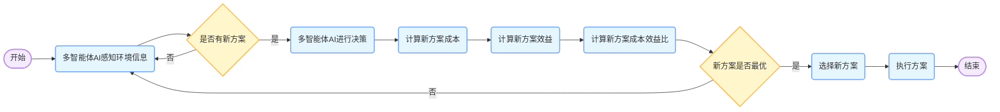

# 运用多智能体AI优化约翰·伯格的成本效益分析

> 关键词：多智能体AI、约翰·伯格成本效益分析、优化算法、决策支持、资源分配

> 摘要：本文聚焦于运用多智能体AI对约翰·伯格的成本效益分析进行优化。首先介绍了相关背景知识，包括目的范围、预期读者等内容。接着阐述了多智能体AI与约翰·伯格成本效益分析的核心概念及联系，给出了原理和架构的文本示意图与Mermaid流程图。详细讲解了核心算法原理，并使用Python代码进行说明，同时给出了相关的数学模型和公式。通过项目实战，展示了如何搭建开发环境、实现源代码并进行解读分析。探讨了实际应用场景，推荐了学习资源、开发工具框架以及相关论文著作。最后总结了未来发展趋势与挑战，提供了常见问题解答和扩展阅读参考资料，旨在为相关领域的研究者和从业者提供全面深入的技术指导。

## 1. 背景介绍 
### 1.1 目的和范围
成本效益分析是决策过程中至关重要的工具，约翰·伯格的成本效益分析方法在诸多领域得到了广泛应用。然而，传统的成本效益分析方法在处理复杂、动态的决策环境时存在一定的局限性。多智能体AI作为一种新兴的技术手段，具有分布式、自主性和协作性等特点，能够更好地应对复杂环境中的决策问题。本文的目的在于研究如何运用多智能体AI对约翰·伯格的成本效益分析进行优化，以提高决策的准确性和效率。

本文的范围涵盖了多智能体AI和约翰·伯格成本效益分析的核心概念、算法原理、数学模型、项目实战以及实际应用场景等方面。通过理论分析和实践案例，深入探讨了运用多智能体AI优化成本效益分析的可行性和有效性。

### 1.2 预期读者
本文预期读者包括从事决策科学、人工智能、运筹学等领域的研究人员和学者，以及在企业管理、项目规划、资源分配等实际工作中需要进行成本效益分析的从业者。对于对多智能体AI和成本效益分析感兴趣的技术爱好者和学生，本文也具有一定的参考价值。

### 1.3 文档结构概述
本文共分为十个部分。第一部分为背景介绍，阐述了文章的目的、范围、预期读者和文档结构。第二部分介绍了多智能体AI与约翰·伯格成本效益分析的核心概念及联系，给出了原理和架构的示意图和流程图。第三部分详细讲解了核心算法原理，并使用Python代码进行说明。第四部分给出了相关的数学模型和公式，并进行详细讲解和举例说明。第五部分通过项目实战，展示了如何搭建开发环境、实现源代码并进行解读分析。第六部分探讨了实际应用场景。第七部分推荐了学习资源、开发工具框架以及相关论文著作。第八部分总结了未来发展趋势与挑战。第九部分提供了常见问题解答。第十部分给出了扩展阅读和参考资料。

### 1.4 术语表
#### 1.4.1 核心术语定义
- **多智能体AI**：由多个智能体组成的人工智能系统，每个智能体具有一定的自主性和决策能力，能够通过协作完成复杂的任务。
- **约翰·伯格成本效益分析**：一种基于成本和效益的决策分析方法，通过比较不同方案的成本和效益来选择最优方案。
- **智能体**：具有感知、决策和行动能力的实体，能够在环境中自主地进行交互和协作。
- **成本效益比**：指方案的效益与成本之比，用于衡量方案的经济性和可行性。

#### 1.4.2 相关概念解释
- **分布式系统**：由多个独立的组件组成的系统，这些组件通过网络进行通信和协作，共同完成系统的任务。多智能体AI是一种典型的分布式系统。
- **协作机制**：多智能体之间通过某种规则和策略进行交互和合作的方式，以实现共同的目标。
- **决策优化**：在多个可行方案中选择最优方案的过程，通过考虑各种因素和约束条件，使决策结果达到最优。

#### 1.4.3 缩略词列表
- **AI**：Artificial Intelligence，人工智能
- **MAS**：Multi - Agent System，多智能体系统

## 2. 核心概念与联系 
### 核心概念原理
#### 多智能体AI原理
多智能体AI由多个智能体组成，每个智能体可以看作是一个独立的决策单元。智能体具有感知能力，能够获取环境信息；具有决策能力，能够根据感知到的信息和自身的目标做出决策；具有行动能力，能够执行决策并对环境产生影响。智能体之间通过通信机制进行信息交换和协作，以实现共同的目标。

#### 约翰·伯格成本效益分析原理
约翰·伯格成本效益分析的基本原理是对每个决策方案的成本和效益进行量化评估，然后计算成本效益比。成本包括直接成本和间接成本，效益包括经济效益和社会效益等。通过比较不同方案的成本效益比，选择成本效益比最高的方案作为最优方案。

### 架构的文本示意图
```plaintext
多智能体AI系统
|-- 智能体1
|   |-- 感知模块
|   |-- 决策模块
|   |-- 行动模块
|-- 智能体2
|   |-- 感知模块
|   |-- 决策模块
|   |-- 行动模块
|--...
|-- 通信模块
|   |-- 信息交换
|   |-- 协作策略

约翰·伯格成本效益分析系统
|-- 成本评估模块
|   |-- 直接成本计算
|   |-- 间接成本计算
|-- 效益评估模块
|   |-- 经济效益计算
|   |-- 社会效益计算
|-- 成本效益比计算模块
|   |-- 方案1成本效益比
|   |-- 方案2成本效益比
|   |--...

优化系统
|-- 多智能体AI与成本效益分析接口
|-- 优化策略制定
|-- 方案选择与推荐
```

### Mermaid流程图


## 3. 核心算法原理 & 具体操作步骤 
### 核心算法原理
在运用多智能体AI优化约翰·伯格的成本效益分析中，核心算法主要包括智能体的决策算法和多智能体的协作算法。

#### 智能体决策算法
智能体的决策算法可以采用强化学习算法，如Q - learning算法。Q - learning算法通过不断地尝试不同的动作，并根据环境反馈的奖励来更新动作价值函数Q(s, a)，从而找到最优的动作策略。

#### 多智能体协作算法
多智能体的协作算法可以采用合同网协议。合同网协议是一种基于招标 - 投标 - 中标机制的协作算法，通过智能体之间的信息交换和协商，实现任务的分配和协作。

### 具体操作步骤
1. **初始化**：初始化多智能体系统和成本效益分析系统，包括智能体的初始状态、环境信息、成本和效益的评估参数等。
2. **感知环境**：每个智能体通过感知模块获取环境信息，包括当前的决策方案、成本和效益等。
3. **决策制定**：智能体根据感知到的信息，使用Q - learning算法进行决策，选择最优的动作。
4. **任务分配**：多智能体之间使用合同网协议进行任务分配和协作，共同完成决策方案的评估和优化。
5. **成本效益评估**：对新的决策方案进行成本和效益的评估，计算成本效益比。
6. **方案选择**：比较不同方案的成本效益比，选择成本效益比最高的方案作为最优方案。
7. **执行方案**：执行最优方案，并更新环境信息。
8. **重复步骤2 - 7**：直到满足终止条件，如达到最大迭代次数或找到满意的方案。

### Python源代码实现
```python
import numpy as np

# 定义Q - learning算法类
class QLearningAgent:
    def __init__(self, state_size, action_size, learning_rate=0.1, discount_factor=0.9):
        self.state_size = state_size
        self.action_size = action_size
        self.learning_rate = learning_rate
        self.discount_factor = discount_factor
        self.q_table = np.zeros((state_size, action_size))

    def choose_action(self, state):
        if np.random.uniform(0, 1) < 0.1:
            return np.random.choice(self.action_size)
        else:
            return np.argmax(self.q_table[state, :])

    def update_q_table(self, state, action, reward, next_state):
        predict = self.q_table[state, action]
        target = reward + self.discount_factor * np.max(self.q_table[next_state, :])
        self.q_table[state, action] = (1 - self.learning_rate) * predict + self.learning_rate * target

# 定义成本效益评估函数
def cost_benefit_analysis(cost, benefit):
    return benefit / cost

# 模拟多智能体优化过程
def multi_agent_optimization():
    state_size = 10
    action_size = 5
    agent = QLearningAgent(state_size, action_size)
    max_iterations = 100
    best_cost_benefit_ratio = 0
    best_action = None

    for iteration in range(max_iterations):
        state = np.random.randint(0, state_size)
        action = agent.choose_action(state)
        # 模拟成本和效益的计算
        cost = np.random.uniform(1, 10)
        benefit = np.random.uniform(1, 20)
        cost_benefit_ratio = cost_benefit_analysis(cost, benefit)

        reward = cost_benefit_ratio

        next_state = np.random.randint(0, state_size)
        agent.update_q_table(state, action, reward, next_state)

        if cost_benefit_ratio > best_cost_benefit_ratio:
            best_cost_benefit_ratio = cost_benefit_ratio
            best_action = action

    print(f"最优成本效益比: {best_cost_benefit_ratio}")
    print(f"最优动作: {best_action}")

if __name__ == "__main__":
    multi_agent_optimization()
```

## 4. 数学模型和公式 & 详细讲解 & 举例说明 
### Q - learning算法的数学模型和公式
Q - learning算法的核心是更新动作价值函数Q(s, a)，其更新公式为：

$$Q(s_t, a_t) \leftarrow (1 - \alpha)Q(s_t, a_t) + \alpha [r_{t + 1} + \gamma \max_{a} Q(s_{t + 1}, a)]$$

其中：
- $s_t$ 表示在时间步 $t$ 的状态。
- $a_t$ 表示在时间步 $t$ 采取的动作。
- $\alpha$ 是学习率，控制新信息对旧信息的更新程度，取值范围为 $[0, 1]$。
- $r_{t + 1}$ 是在时间步 $t + 1$ 获得的奖励。
- $\gamma$ 是折扣因子，用于权衡当前奖励和未来奖励的重要性，取值范围为 $[0, 1]$。
- $s_{t + 1}$ 表示在时间步 $t + 1$ 的状态。

### 详细讲解
Q - learning算法的目标是通过不断地尝试不同的动作，找到最优的动作策略，使得长期累积奖励最大化。在每次迭代中，智能体根据当前的状态 $s_t$ 选择一个动作 $a_t$，执行该动作后获得奖励 $r_{t + 1}$ 并转移到下一个状态 $s_{t + 1}$。然后，根据上述更新公式更新动作价值函数Q(s, a)。学习率 $\alpha$ 越大，新信息对旧信息的更新程度越大；折扣因子 $\gamma$ 越大，未来奖励的重要性越高。

### 举例说明
假设一个简单的决策问题，有两个状态 $s_1$ 和 $s_2$，两个动作 $a_1$ 和 $a_2$。初始时，Q - table 如下：

| 状态 | $a_1$ | $a_2$ |
|------|-------|-------|
| $s_1$ | 0 | 0 |
| $s_2$ | 0 | 0 |

学习率 $\alpha = 0.1$，折扣因子 $\gamma = 0.9$。在某一时刻，智能体处于状态 $s_1$，选择动作 $a_1$，执行该动作后获得奖励 $r = 1$，并转移到状态 $s_2$。

根据Q - learning更新公式：

$$Q(s_1, a_1) \leftarrow (1 - 0.1) \times 0 + 0.1 \times [1 + 0.9 \times \max(0, 0)] = 0.1$$

更新后的Q - table如下：

| 状态 | $a_1$ | $a_2$ |
|------|-------|-------|
| $s_1$ | 0.1 | 0 |
| $s_2$ | 0 | 0 |

### 成本效益比的数学模型和公式
成本效益比的计算公式为：

$$CBR = \frac{B}{C}$$

其中：
- $CBR$ 表示成本效益比。
- $B$ 表示方案的效益。
- $C$ 表示方案的成本。

### 详细讲解
成本效益比用于衡量方案的经济性和可行性。成本效益比越高，说明方案在相同成本下获得的效益越高，方案越优。在成本效益分析中，通过比较不同方案的成本效益比来选择最优方案。

### 举例说明
假设有两个方案A和B，方案A的成本 $C_A = 100$，效益 $B_A = 200$；方案B的成本 $C_B = 150$，效益 $B_B = 300$。

方案A的成本效益比为：

$$CBR_A = \frac{B_A}{C_A} = \frac{200}{100} = 2$$

方案B的成本效益比为：

$$CBR_B = \frac{B_B}{C_B} = \frac{300}{150} = 2$$

由于 $CBR_A = CBR_B$，在仅考虑成本效益比的情况下，方案A和方案B具有相同的经济性和可行性。

## 5. 项目实战：代码实际案例和详细解释说明 
### 5.1  开发环境搭建
#### 安装Python
首先，需要安装Python开发环境。可以从Python官方网站（https://www.python.org/downloads/）下载适合自己操作系统的Python版本，并按照安装向导进行安装。

#### 安装必要的库
在本项目中，主要使用了NumPy库进行数值计算。可以使用以下命令安装NumPy库：

```sh
pip install numpy
```

### 5.2  源代码详细实现和代码解读
```python
import numpy as np

# 定义Q - learning算法类
class QLearningAgent:
    def __init__(self, state_size, action_size, learning_rate=0.1, discount_factor=0.9):
        self.state_size = state_size
        self.action_size = action_size
        self.learning_rate = learning_rate
        self.discount_factor = discount_factor
        # 初始化Q - table
        self.q_table = np.zeros((state_size, action_size))

    def choose_action(self, state):
        # 以一定的概率随机选择动作
        if np.random.uniform(0, 1) < 0.1:
            return np.random.choice(self.action_size)
        else:
            # 选择Q值最大的动作
            return np.argmax(self.q_table[state, :])

    def update_q_table(self, state, action, reward, next_state):
        # 计算预测值
        predict = self.q_table[state, action]
        # 计算目标值
        target = reward + self.discount_factor * np.max(self.q_table[next_state, :])
        # 更新Q - table
        self.q_table[state, action] = (1 - self.learning_rate) * predict + self.learning_rate * target

# 定义成本效益评估函数
def cost_benefit_analysis(cost, benefit):
    return benefit / cost

# 模拟多智能体优化过程
def multi_agent_optimization():
    # 定义状态数量和动作数量
    state_size = 10
    action_size = 5
    # 创建Q - learning智能体
    agent = QLearningAgent(state_size, action_size)
    # 定义最大迭代次数
    max_iterations = 100
    best_cost_benefit_ratio = 0
    best_action = None

    for iteration in range(max_iterations):
        # 随机选择一个初始状态
        state = np.random.randint(0, state_size)
        # 智能体选择动作
        action = agent.choose_action(state)
        # 模拟成本和效益的计算
        cost = np.random.uniform(1, 10)
        benefit = np.random.uniform(1, 20)
        # 计算成本效益比
        cost_benefit_ratio = cost_benefit_analysis(cost, benefit)

        # 将成本效益比作为奖励
        reward = cost_benefit_ratio

        # 随机选择下一个状态
        next_state = np.random.randint(0, state_size)
        # 更新Q - table
        agent.update_q_table(state, action, reward, next_state)

        # 记录最优成本效益比和最优动作
        if cost_benefit_ratio > best_cost_benefit_ratio:
            best_cost_benefit_ratio = cost_benefit_ratio
            best_action = action

    print(f"最优成本效益比: {best_cost_benefit_ratio}")
    print(f"最优动作: {best_action}")

if __name__ == "__main__":
    multi_agent_optimization()
```

### 代码解读与分析
#### QLearningAgent类
- `__init__` 方法：初始化Q - learning智能体的状态数量、动作数量、学习率、折扣因子和Q - table。
- `choose_action` 方法：根据当前状态选择动作。以一定的概率随机选择动作，以保证智能体能够探索新的动作；否则，选择Q值最大的动作。
- `update_q_table` 方法：根据Q - learning更新公式更新Q - table。

#### cost_benefit_analysis函数
该函数用于计算成本效益比，输入为成本和效益，输出为成本效益比。

#### multi_agent_optimization函数
- 初始化状态数量、动作数量、Q - learning智能体和最大迭代次数。
- 在每次迭代中，随机选择一个初始状态，智能体选择动作，模拟成本和效益的计算，计算成本效益比并将其作为奖励。
- 更新Q - table，并记录最优成本效益比和最优动作。
- 最后输出最优成本效益比和最优动作。

通过这个项目实战，我们可以看到如何使用多智能体AI（这里简化为一个智能体）对成本效益分析进行优化。在实际应用中，可以扩展为多个智能体，并使用更复杂的协作算法来提高优化效果。

## 6. 实际应用场景 
### 项目投资决策
在项目投资决策中，需要对不同的投资项目进行成本效益分析。传统的方法可能无法充分考虑到项目之间的相互影响和市场环境的动态变化。运用多智能体AI优化约翰·伯格的成本效益分析，可以让每个智能体负责评估一个项目，智能体之间通过协作和信息交换，考虑项目之间的协同效应和市场环境的变化，从而更准确地评估项目的成本和效益，做出更优的投资决策。

### 资源分配
在企业或组织中，经常需要进行资源分配，如人力资源、物资资源等。不同的资源分配方案会产生不同的成本和效益。多智能体AI可以模拟不同部门或业务单元的需求和决策行为，通过协作优化资源分配方案，使得资源在各个部门之间得到合理配置，提高整体的成本效益。

### 供应链管理
在供应链管理中，涉及到供应商选择、库存管理、运输规划等多个环节。每个环节都有其成本和效益。运用多智能体AI优化成本效益分析，可以让不同的智能体分别负责不同的环节，通过协作和信息共享，优化整个供应链的成本和效益。例如，智能体可以根据市场需求和供应情况，动态调整库存水平和运输路线，降低成本，提高客户满意度。

### 城市规划
在城市规划中，需要考虑土地利用、基础设施建设、公共服务设施布局等多个方面的成本和效益。多智能体AI可以模拟不同的利益相关者（如居民、企业、政府等）的决策行为，通过协作和协商，优化城市规划方案，提高城市的整体成本效益和可持续发展能力。

## 7. 工具和资源推荐
### 7.1 学习资源推荐
#### 7.1.1 书籍推荐
- 《人工智能：一种现代的方法》：这是一本经典的人工智能教材，涵盖了人工智能的各个领域，包括多智能体系统。书中详细介绍了多智能体系统的基本概念、算法和应用。
- 《强化学习：原理与Python实现》：该书专注于强化学习的理论和实践，对于理解Q - learning等强化学习算法非常有帮助。
- 《决策分析：原理与应用》：这本书介绍了决策分析的基本原理和方法，包括成本效益分析，对于深入理解约翰·伯格的成本效益分析方法很有价值。

#### 7.1.2 在线课程
- Coursera上的“Artificial Intelligence”课程：由斯坦福大学教授授课，全面介绍了人工智能的基础知识和前沿技术，包括多智能体系统。
- edX上的“Reinforcement Learning”课程：由加州大学伯克利分校教授授课，深入讲解了强化学习的理论和算法。
- 中国大学MOOC上的“决策理论与方法”课程：该课程系统介绍了决策分析的各种方法，包括成本效益分析。

#### 7.1.3 技术博客和网站
- Medium：上面有很多关于人工智能和多智能体系统的技术文章和研究成果分享。
- arXiv：一个预印本平台，提供了大量关于人工智能和决策科学的最新研究论文。
- 知乎：有很多人工智能和决策分析领域的专家和爱好者，在上面可以找到很多有价值的讨论和经验分享。

### 7.2 开发工具框架推荐
#### 7.2.1 IDE和编辑器
- PyCharm：一款专业的Python集成开发环境，提供了丰富的代码编辑、调试和测试功能，适合开发Python项目。
- Jupyter Notebook：一种交互式的开发环境，适合进行数据分析和算法验证，方便展示代码和结果。
- Visual Studio Code：一款轻量级的代码编辑器，支持多种编程语言，有丰富的插件可以扩展功能。

#### 7.2.2 调试和性能分析工具
- pdb：Python自带的调试工具，可以帮助开发者定位代码中的问题。
- cProfile：Python的性能分析工具，可以分析代码的运行时间和函数调用情况，帮助优化代码性能。
- TensorBoard：用于可视化深度学习模型的训练过程和性能指标，对于强化学习模型的调试和优化也有一定的帮助。

#### 7.2.3 相关框架和库
- NumPy：用于数值计算的Python库，提供了高效的数组操作和数学函数。
- OpenAI Gym：一个用于开发和比较强化学习算法的工具包，提供了多种模拟环境。
- Mesa：一个用于开发多智能体系统的Python框架，提供了简单易用的API和可视化工具。

### 7.3 相关论文著作推荐
#### 7.3.1 经典论文
- “Multiagent Systems: A Modern Approach to Distributed Artificial Intelligence”：该论文全面介绍了多智能体系统的基本概念、理论和应用，是多智能体系统领域的经典之作。
- “Q - learning”：这篇论文首次提出了Q - learning算法，是强化学习领域的重要文献。
- “Cost - Benefit Analysis: Concepts and Practice”：该论文详细介绍了成本效益分析的基本概念、方法和应用，对于理解约翰·伯格的成本效益分析方法有重要的参考价值。

#### 7.3.2 最新研究成果
- 在arXiv和ACM Digital Library等平台上，可以找到很多关于多智能体AI优化成本效益分析的最新研究论文。这些论文涵盖了新的算法、模型和应用案例，反映了该领域的最新研究动态。

#### 7.3.3 应用案例分析
- 一些商业杂志和学术期刊会发表关于多智能体AI在实际应用中的案例分析，如《哈佛商业评论》《管理科学学报》等。这些案例分析可以帮助读者了解多智能体AI优化成本效益分析在实际场景中的应用效果和挑战。

## 8. 总结：未来发展趋势与挑战
### 未来发展趋势
#### 更复杂的协作机制
未来的多智能体AI系统将发展出更复杂的协作机制，能够处理更复杂的任务和环境。例如，智能体之间可以进行更深入的协商和合作，共同解决复杂的决策问题。

#### 与其他技术的融合
多智能体AI将与其他技术，如区块链、物联网、大数据等进行融合。例如，结合区块链技术可以实现智能体之间的可信协作和数据共享；结合物联网技术可以获取更丰富的环境信息，提高决策的准确性。

#### 应用领域的拓展
多智能体AI优化成本效益分析的应用领域将不断拓展，除了现有的项目投资决策、资源分配、供应链管理等领域，还将应用于医疗保健、能源管理、金融服务等更多领域。

### 挑战
#### 智能体的自主性和协作性平衡
在多智能体AI系统中，需要平衡智能体的自主性和协作性。智能体过于自主可能导致协作困难，而过于强调协作可能会限制智能体的创新能力。如何找到两者之间的平衡点是一个挑战。

#### 计算资源和时间开销
多智能体AI系统通常需要大量的计算资源和时间来进行训练和决策。在实际应用中，如何降低计算资源和时间开销，提高系统的效率是一个需要解决的问题。

#### 伦理和法律问题
随着多智能体AI系统的广泛应用，伦理和法律问题也日益凸显。例如，智能体的决策责任如何界定，如何保证智能体的决策符合伦理和法律要求等。

## 9. 附录：常见问题与解答
### 多智能体AI与传统AI有什么区别？
传统AI通常是集中式的，由一个中央控制器进行决策和控制。而多智能体AI是分布式的，由多个智能体组成，每个智能体具有一定的自主性和决策能力，通过协作完成复杂的任务。

### Q - learning算法的收敛性如何保证？
Q - learning算法在一定条件下是收敛的。为了保证收敛性，需要满足以下条件：学习率 $\alpha$ 随着时间逐渐减小，折扣因子 $\gamma$ 取值在 $[0, 1)$ 之间，并且智能体能够充分探索所有的状态和动作。

### 如何选择合适的学习率和折扣因子？
学习率和折扣因子的选择需要根据具体的问题和实验进行调整。一般来说，学习率 $\alpha$ 可以初始设置为一个较小的值，如0.1，然后随着时间逐渐减小。折扣因子 $\gamma$ 可以根据问题的特点选择，对于短期决策问题，可以选择较小的 $\gamma$ 值；对于长期决策问题，可以选择较大的 $\gamma$ 值。

### 多智能体AI优化成本效益分析的应用有哪些局限性？
多智能体AI优化成本效益分析的应用存在一些局限性。例如，智能体的建模和参数设置可能比较困难，需要大量的领域知识和实验调优；系统的复杂性较高，可能导致计算资源和时间开销较大；在某些情况下，智能体的决策可能不符合人类的直觉和伦理要求。

## 10. 扩展阅读 & 参考资料
### 扩展阅读
- 《群体智能算法及其应用》：介绍了群体智能算法的基本原理和应用，与多智能体AI有一定的关联。
- 《数据驱动的决策分析》：探讨了如何利用数据进行决策分析，对于理解成本效益分析的实际应用有帮助。
- 《人工智能哲学》：从哲学的角度探讨了人工智能的本质、伦理和社会影响，有助于深入思考多智能体AI的发展。

### 参考资料
- 罗素, 诺维格. 人工智能：一种现代的方法. 清华大学出版社, 2013.
- Sutton, R. S., & Barto, A. G. Reinforcement Learning: An Introduction. MIT Press, 2018.
- Boardman, A. E., Greenberg, D. H., Vining, A. R., & Weimer, D. L. Cost - Benefit Analysis: Concepts and Practice. Pearson, 2017.

作者：AI天才研究院/AI Genius Institute & 禅与计算机程序设计艺术 /Zen And The Art of Computer Programming