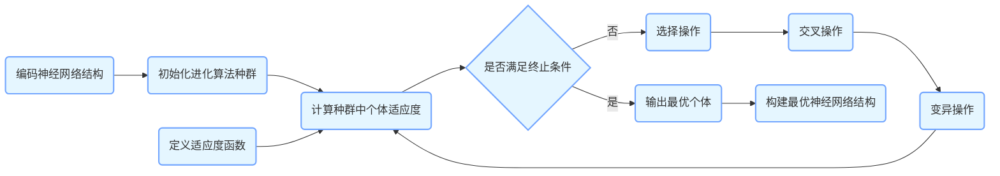

# 进化算法在神经网络结构优化中的应用

> 关键词：进化算法、神经网络结构优化、遗传算法、粒子群算法、深度学习

> 摘要：本文深入探讨了进化算法在神经网络结构优化中的应用。首先介绍了相关背景知识，包括目的、预期读者等内容。接着阐述了进化算法和神经网络的核心概念及它们之间的联系，并给出了相应的文本示意图和 Mermaid 流程图。详细讲解了核心算法原理，使用 Python 代码进行说明，同时给出了数学模型和公式并举例。通过项目实战展示了如何运用进化算法优化神经网络结构，包括开发环境搭建、源代码实现和解读。分析了进化算法在神经网络结构优化中的实际应用场景，推荐了学习资源、开发工具框架以及相关论文著作。最后总结了未来发展趋势与挑战，并提供了常见问题解答和扩展阅读参考资料。

## 1. 背景介绍 
### 1.1 目的和范围
在深度学习领域，神经网络的性能在很大程度上依赖于其结构设计。传统的神经网络结构设计往往依赖于人工经验和大量的试错，这不仅效率低下，而且难以找到最优的结构。进化算法作为一种模拟生物进化过程的优化算法，具有全局搜索能力和自适应特性，能够在复杂的搜索空间中找到较优的解决方案。本文的目的是详细介绍进化算法在神经网络结构优化中的应用，包括核心概念、算法原理、实际案例等，旨在为研究人员和开发者提供全面的指导。范围涵盖了常见的进化算法如遗传算法、粒子群算法等在不同类型神经网络（如卷积神经网络、循环神经网络）结构优化中的应用。

### 1.2 预期读者
本文预期读者包括对深度学习、神经网络结构优化感兴趣的研究人员、高校学生以及从事相关领域开发的工程师。对于有一定编程基础和机器学习知识的读者，本文将帮助他们深入理解进化算法在神经网络结构优化中的应用原理和实践方法；对于初学者，通过本文的逐步讲解，也能够对该领域有一个较为系统的认识。

### 1.3 文档结构概述
本文将按照以下结构进行组织：首先介绍相关背景知识，包括目的、预期读者和文档结构概述等内容。接着阐述进化算法和神经网络的核心概念及它们之间的联系，并给出相应的文本示意图和 Mermaid 流程图。然后详细讲解核心算法原理，使用 Python 代码进行说明，同时给出数学模型和公式并举例。通过项目实战展示如何运用进化算法优化神经网络结构，包括开发环境搭建、源代码实现和解读。分析进化算法在神经网络结构优化中的实际应用场景，推荐学习资源、开发工具框架以及相关论文著作。最后总结未来发展趋势与挑战，并提供常见问题解答和扩展阅读参考资料。

### 1.4 术语表
#### 1.4.1 核心术语定义
- **进化算法**：一类模拟生物进化过程的优化算法，通过模拟自然选择、遗传变异等机制，在解空间中搜索最优解。常见的进化算法包括遗传算法、粒子群算法、蚁群算法等。
- **神经网络结构优化**：指通过调整神经网络的层数、神经元数量、连接方式等结构参数，以提高神经网络在特定任务上的性能，如分类准确率、回归误差等。
- **遗传算法**：一种基于自然选择和遗传机制的进化算法，通过编码表示问题的解，使用选择、交叉和变异等操作生成新的解，并逐步优化种群，直到找到最优解。
- **粒子群算法**：一种模拟鸟群或鱼群觅食行为的进化算法，每个粒子代表一个解，通过跟踪个体最优解和全局最优解，不断更新自己的位置，以找到最优解。

#### 1.4.2 相关概念解释
- **适应度函数**：在进化算法中，用于评估每个解的优劣程度的函数。适应度值越高，表示解越优。在神经网络结构优化中，适应度函数通常可以是神经网络在验证集上的准确率、损失函数值等。
- **编码**：将问题的解表示为一种适合进化算法操作的形式。在神经网络结构优化中，常见的编码方式包括二进制编码、实数编码等。
- **种群**：在进化算法中，一组解的集合称为种群。每个解称为一个个体，种群中的个体通过进化操作不断更新和优化。

#### 1.4.3 缩略词列表
- **GA**：Genetic Algorithm，遗传算法
- **PSO**：Particle Swarm Optimization，粒子群算法
- **CNN**：Convolutional Neural Network，卷积神经网络
- **RNN**：Recurrent Neural Network，循环神经网络

## 2. 核心概念与联系 

### 进化算法核心概念
进化算法是一类受生物进化过程启发的优化算法，其基本思想是通过模拟生物的遗传、变异和自然选择等过程，在解空间中搜索最优解。以遗传算法为例，其主要步骤包括编码、初始化种群、计算适应度、选择、交叉和变异。

- **编码**：将问题的解表示为一种适合进化算法操作的形式，如二进制编码、实数编码等。在神经网络结构优化中，可以将神经网络的层数、神经元数量等结构参数编码为一个染色体。
- **初始化种群**：随机生成一组初始解，构成初始种群。
- **计算适应度**：使用适应度函数评估每个个体的优劣程度。
- **选择**：根据个体的适应度值，选择一部分个体作为父代，用于产生下一代个体。
- **交叉**：对选中的父代个体进行交叉操作，生成新的个体。
- **变异**：对新生成的个体进行变异操作，引入新的基因，增加种群的多样性。

### 神经网络核心概念
神经网络是一种模仿人类神经系统的计算模型，由大量的神经元组成。神经元之间通过连接传递信息，每个连接都有一个权重。神经网络的结构包括输入层、隐藏层和输出层，不同的结构适用于不同的任务。例如，卷积神经网络（CNN）适用于图像识别任务，循环神经网络（RNN）适用于序列数据处理任务。

### 进化算法与神经网络的联系
进化算法可以用于优化神经网络的结构，通过搜索不同的网络结构，找到最优的结构配置。具体来说，进化算法可以帮助确定神经网络的层数、神经元数量、连接方式等结构参数，从而提高神经网络的性能。

### 文本示意图
```plaintext
进化算法
|-- 编码
|-- 初始化种群
|-- 计算适应度
|-- 选择
|-- 交叉
|-- 变异

神经网络
|-- 输入层
|-- 隐藏层
|-- 输出层

进化算法优化神经网络结构
|-- 进化算法搜索结构空间
|   |-- 生成不同结构的神经网络
|-- 评估神经网络性能
|   |-- 使用适应度函数
|-- 选择最优结构
```

### Mermaid 流程图


## 3. 核心算法原理 & 具体操作步骤 

### 遗传算法原理及 Python 实现

#### 原理
遗传算法通过模拟生物的遗传和进化过程，在解空间中搜索最优解。其基本步骤包括编码、初始化种群、计算适应度、选择、交叉和变异。

#### 具体操作步骤
1. **编码**：将神经网络的结构参数编码为二进制字符串或实数向量。例如，假设我们要优化一个简单的全连接神经网络的隐藏层神经元数量，可以将神经元数量编码为一个整数，再将整数转换为二进制字符串。
2. **初始化种群**：随机生成一组初始解，构成初始种群。每个解对应一个神经网络结构。
3. **计算适应度**：使用适应度函数评估每个个体的优劣程度。在神经网络结构优化中，适应度函数可以是神经网络在验证集上的准确率。
4. **选择**：根据个体的适应度值，选择一部分个体作为父代，用于产生下一代个体。常见的选择方法包括轮盘赌选择、锦标赛选择等。
5. **交叉**：对选中的父代个体进行交叉操作，生成新的个体。交叉操作可以是单点交叉、多点交叉等。
6. **变异**：对新生成的个体进行变异操作，引入新的基因，增加种群的多样性。变异操作可以是位变异、实值变异等。

#### Python 代码实现
```python
import numpy as np
import random

# 定义适应度函数（示例）
def fitness_function(individual):
    # 这里简单假设适应度是个体的和
    return np.sum(individual)

# 初始化种群
def initialize_population(pop_size, individual_size):
    population = []
    for _ in range(pop_size):
        individual = np.random.randint(0, 2, individual_size)
        population.append(individual)
    return population

# 选择操作（轮盘赌选择）
def selection(population, fitness_values):
    total_fitness = np.sum(fitness_values)
    probabilities = fitness_values / total_fitness
    selected_indices = np.random.choice(len(population), size=len(population), p=probabilities)
    selected_population = [population[i] for i in selected_indices]
    return selected_population

# 交叉操作（单点交叉）
def crossover(parent1, parent2):
    crossover_point = random.randint(1, len(parent1) - 1)
    child1 = np.concatenate((parent1[:crossover_point], parent2[crossover_point:]))
    child2 = np.concatenate((parent2[:crossover_point], parent1[crossover_point:]))
    return child1, child2

# 变异操作（位变异）
def mutation(individual, mutation_rate):
    for i in range(len(individual)):
        if random.random() < mutation_rate:
            individual[i] = 1 - individual[i]
    return individual

# 遗传算法主函数
def genetic_algorithm(pop_size, individual_size, generations, mutation_rate):
    population = initialize_population(pop_size, individual_size)
    for _ in range(generations):
        fitness_values = [fitness_function(individual) for individual in population]
        selected_population = selection(population, fitness_values)
        new_population = []
        for i in range(0, pop_size, 2):
            parent1 = selected_population[i]
            parent2 = selected_population[i + 1]
            child1, child2 = crossover(parent1, parent2)
            child1 = mutation(child1, mutation_rate)
            child2 = mutation(child2, mutation_rate)
            new_population.extend([child1, child2])
        population = new_population
    final_fitness_values = [fitness_function(individual) for individual in population]
    best_index = np.argmax(final_fitness_values)
    best_individual = population[best_index]
    return best_individual

# 运行遗传算法
pop_size = 50
individual_size = 10
generations = 100
mutation_rate = 0.01
best_individual = genetic_algorithm(pop_size, individual_size, generations, mutation_rate)
print("Best individual:", best_individual)
```

### 粒子群算法原理及 Python 实现

#### 原理
粒子群算法通过模拟鸟群或鱼群的觅食行为，在解空间中搜索最优解。每个粒子代表一个解，粒子通过跟踪个体最优解和全局最优解，不断更新自己的位置。

#### 具体操作步骤
1. **初始化粒子群**：随机初始化每个粒子的位置和速度。
2. **计算适应度**：使用适应度函数评估每个粒子的优劣程度。
3. **更新个体最优解和全局最优解**：比较每个粒子的当前适应度值和个体最优解的适应度值，如果当前适应度值更优，则更新个体最优解。同时，比较所有粒子的个体最优解，找到全局最优解。
4. **更新粒子的速度和位置**：根据个体最优解和全局最优解，更新粒子的速度和位置。
5. **重复步骤 2 - 4**：直到满足终止条件。

#### Python 代码实现
```python
import numpy as np

# 定义适应度函数（示例）
def fitness_function(x):
    return np.sum(x**2)

# 粒子群算法主函数
def particle_swarm_optimization(num_particles, dimensions, max_iter, w, c1, c2):
    # 初始化粒子位置和速度
    particles_position = np.random.uniform(-5, 5, (num_particles, dimensions))
    particles_velocity = np.random.uniform(-1, 1, (num_particles, dimensions))
    # 初始化个体最优位置和全局最优位置
    particles_best_position = particles_position.copy()
    particles_best_fitness = np.array([fitness_function(p) for p in particles_position])
    global_best_index = np.argmin(particles_best_fitness)
    global_best_position = particles_best_position[global_best_index]
    global_best_fitness = particles_best_fitness[global_best_index]

    for _ in range(max_iter):
        for i in range(num_particles):
            # 更新粒子速度
            r1, r2 = np.random.rand(2)
            particles_velocity[i] = (w * particles_velocity[i] +
                                     c1 * r1 * (particles_best_position[i] - particles_position[i]) +
                                     c2 * r2 * (global_best_position - particles_position[i]))
            # 更新粒子位置
            particles_position[i] += particles_velocity[i]
            # 计算新的适应度值
            fitness = fitness_function(particles_position[i])
            # 更新个体最优位置
            if fitness < particles_best_fitness[i]:
                particles_best_fitness[i] = fitness
                particles_best_position[i] = particles_position[i]
                # 更新全局最优位置
                if fitness < global_best_fitness:
                    global_best_fitness = fitness
                    global_best_position = particles_position[i]

    return global_best_position, global_best_fitness

# 运行粒子群算法
num_particles = 30
dimensions = 2
max_iter = 100
w = 0.7
c1 = 1.4
c2 = 1.4
best_position, best_fitness = particle_swarm_optimization(num_particles, dimensions, max_iter, w, c1, c2)
print("Best position:", best_position)
print("Best fitness:", best_fitness)
```

## 4. 数学模型和公式 & 详细讲解 & 举例说明 

### 遗传算法数学模型和公式

#### 适应度函数
适应度函数用于评估每个个体的优劣程度。在神经网络结构优化中，适应度函数可以是神经网络在验证集上的准确率、损失函数值等。假设我们使用准确率作为适应度函数，对于一个神经网络结构 $x$，其适应度值 $f(x)$ 可以表示为：
$$f(x) = \text{Accuracy}(x)$$
其中 $\text{Accuracy}(x)$ 表示神经网络结构 $x$ 在验证集上的分类准确率。

#### 选择操作（轮盘赌选择）
轮盘赌选择根据个体的适应度值来确定每个个体被选中的概率。假设种群中有 $N$ 个个体，第 $i$ 个个体的适应度值为 $f_i$，则第 $i$ 个个体被选中的概率 $p_i$ 为：
$$p_i = \frac{f_i}{\sum_{j=1}^{N}f_j}$$

#### 交叉操作（单点交叉）
单点交叉是在两个父代个体中随机选择一个交叉点，然后交换交叉点之后的部分，生成两个子代个体。假设父代个体 $A$ 和 $B$ 分别为：
$$A = [a_1, a_2, \cdots, a_n]$$
$$B = [b_1, b_2, \cdots, b_n]$$
选择交叉点 $k$，则子代个体 $C$ 和 $D$ 分别为：
$$C = [a_1, a_2, \cdots, a_k, b_{k+1}, b_{k+2}, \cdots, b_n]$$
$$D = [b_1, b_2, \cdots, b_k, a_{k+1}, a_{k+2}, \cdots, a_n]$$

#### 变异操作（位变异）
位变异是对个体中的每个基因以一定的概率进行取反操作。假设个体 $x$ 为一个二进制字符串，第 $i$ 个基因 $x_i$ 以变异概率 $p_m$ 进行变异，变异后的基因 $x_i'$ 为：
$$x_i' = \begin{cases}
1 - x_i, & \text{if } \text{random}(0, 1) < p_m \\
x_i, & \text{otherwise}
\end{cases}$$

### 粒子群算法数学模型和公式

#### 粒子速度更新公式
粒子群算法中，粒子的速度更新公式为：
$$v_{i}(t+1) = w \cdot v_{i}(t) + c_1 \cdot r_1 \cdot (p_{best_i} - x_{i}(t)) + c_2 \cdot r_2 \cdot (g_{best} - x_{i}(t))$$
其中 $v_{i}(t)$ 表示第 $i$ 个粒子在第 $t$ 代的速度，$x_{i}(t)$ 表示第 $i$ 个粒子在第 $t$ 代的位置，$p_{best_i}$ 表示第 $i$ 个粒子的个体最优位置，$g_{best}$ 表示全局最优位置，$w$ 是惯性权重，$c_1$ 和 $c_2$ 是学习因子，$r_1$ 和 $r_2$ 是 $[0, 1]$ 之间的随机数。

#### 粒子位置更新公式
粒子的位置更新公式为：
$$x_{i}(t+1) = x_{i}(t) + v_{i}(t+1)$$

### 举例说明
假设我们使用遗传算法优化一个简单的全连接神经网络的隐藏层神经元数量。我们将神经元数量编码为一个二进制字符串，例如，一个 4 位的二进制字符串可以表示 $0 - 15$ 个神经元。初始种群中包含 10 个个体，每个个体是一个 4 位的二进制字符串。适应度函数是神经网络在验证集上的准确率。

在选择操作中，根据每个个体的适应度值计算其被选中的概率，然后使用轮盘赌选择方法选择父代个体。在交叉操作中，随机选择一个交叉点，交换两个父代个体的部分基因，生成子代个体。在变异操作中，以一定的概率对每个基因进行取反操作。

经过多代进化，最终找到适应度值最高的个体，该个体对应的神经元数量即为优化后的隐藏层神经元数量。

## 5. 项目实战：代码实际案例和详细解释说明 

### 5.1  开发环境搭建
为了实现进化算法在神经网络结构优化中的应用，我们需要搭建相应的开发环境。以下是具体步骤：

#### 安装 Python
首先，确保你已经安装了 Python 3.x 版本。可以从 Python 官方网站（https://www.python.org/downloads/）下载并安装适合你操作系统的版本。

#### 安装必要的库
我们需要安装一些常用的 Python 库，包括 `numpy`、`tensorflow` 或 `pytorch` 用于构建和训练神经网络，`deap` 用于实现进化算法。可以使用以下命令进行安装：
```bash
pip install numpy tensorflow deap
```
如果你选择使用 `pytorch`，可以根据你的 CUDA 版本和操作系统，从 `pytorch` 官方网站（https://pytorch.org/get-started/locally/）选择合适的安装命令进行安装。

### 5.2  源代码详细实现和代码解读

#### 问题描述
我们将使用遗传算法优化一个简单的全连接神经网络的隐藏层神经元数量，以提高在 MNIST 手写数字数据集上的分类准确率。

#### 代码实现
```python
import numpy as np
import tensorflow as tf
from deap import base, creator, tools, algorithms
from tensorflow.keras.datasets import mnist
from tensorflow.keras.utils import to_categorical

# 加载 MNIST 数据集
(x_train, y_train), (x_test, y_test) = mnist.load_data()
x_train = x_train.reshape(-1, 28 * 28).astype('float32') / 255.0
x_test = x_test.reshape(-1, 28 * 28).astype('float32') / 255.0
y_train = to_categorical(y_train)
y_test = to_categorical(y_test)

# 定义适应度函数
def fitness_function(individual):
    # 将个体编码转换为隐藏层神经元数量
    hidden_units = individual[0]
    # 构建神经网络模型
    model = tf.keras.Sequential([
        tf.keras.layers.Dense(hidden_units, activation='relu', input_shape=(28 * 28,)),
        tf.keras.layers.Dense(10, activation='softmax')
    ])
    # 编译模型
    model.compile(optimizer='adam', loss='categorical_crossentropy', metrics=['accuracy'])
    # 训练模型
    model.fit(x_train, y_train, epochs=3, batch_size=64, verbose=0)
    # 评估模型
    _, accuracy = model.evaluate(x_test, y_test, verbose=0)
    return accuracy,

# 定义遗传算法相关参数
creator.create("FitnessMax", base.Fitness, weights=(1.0,))
creator.create("Individual", list, fitness=creator.FitnessMax)

toolbox = base.Toolbox()
toolbox.register("attr_int", np.random.randint, 10, 100)
toolbox.register("individual", tools.initRepeat, creator.Individual, toolbox.attr_int, n=1)
toolbox.register("population", tools.initRepeat, list, toolbox.individual)

toolbox.register("evaluate", fitness_function)
toolbox.register("mate", tools.cxTwoPoint)
toolbox.register("mutate", tools.mutUniformInt, low=10, up=100, indpb=0.2)
toolbox.register("select", tools.selTournament, tournsize=3)

# 运行遗传算法
pop = toolbox.population(n=20)
NGEN = 10
for gen in range(NGEN):
    offspring = algorithms.varAnd(pop, toolbox, cxpb=0.5, mutpb=0.2)
    fits = toolbox.map(toolbox.evaluate, offspring)
    for fit, ind in zip(fits, offspring):
        ind.fitness.values = fit
    pop = toolbox.select(offspring, k=len(pop))

# 找到最优个体
best_ind = tools.selBest(pop, k=1)[0]
best_hidden_units = best_ind[0]
print("Best hidden units:", best_hidden_units)
```

#### 代码解读
1. **数据加载和预处理**：使用 `tensorflow.keras` 加载 MNIST 数据集，并对数据进行预处理，包括将图像数据展平、归一化和将标签进行 one-hot 编码。
2. **定义适应度函数**：`fitness_function` 函数接受一个个体作为输入，将个体编码转换为隐藏层神经元数量，构建并训练一个简单的全连接神经网络，最后返回模型在测试集上的准确率作为适应度值。
3. **定义遗传算法相关参数**：使用 `deap` 库定义适应度类、个体类和工具箱。注册各种遗传算法操作，如选择、交叉和变异。
4. **运行遗传算法**：初始化种群，进行多代进化，每一代中进行交叉、变异操作，评估新个体的适应度值，选择优秀个体进入下一代。
5. **找到最优个体**：最后找到适应度值最高的个体，该个体对应的隐藏层神经元数量即为优化后的结果。

### 5.3  代码解读与分析
#### 优点
- **自动化优化**：通过遗传算法自动搜索最优的神经网络结构，减少了人工试错的工作量。
- **全局搜索能力**：遗传算法具有全局搜索能力，能够在较大的搜索空间中找到较优的解决方案。

#### 缺点
- **计算开销大**：每次评估个体的适应度值都需要训练一个神经网络，计算开销较大，特别是在搜索空间较大时。
- **收敛速度慢**：遗传算法的收敛速度可能较慢，需要进行多代进化才能找到较优的解。

#### 改进方向
- **并行计算**：可以使用并行计算技术，同时评估多个个体的适应度值，提高计算效率。
- **结合启发式算法**：可以结合一些启发式算法，如模拟退火算法，加快收敛速度。

## 6. 实际应用场景 
### 图像识别
在图像识别任务中，如人脸识别、物体检测等，神经网络的结构对识别准确率有很大影响。进化算法可以帮助优化卷积神经网络（CNN）的结构，包括卷积层的数量、卷积核的大小和数量、池化层的类型等。通过搜索不同的网络结构，找到最优的配置，从而提高图像识别的准确率。

### 自然语言处理
在自然语言处理任务中，如文本分类、机器翻译等，循环神经网络（RNN）及其变体（如 LSTM、GRU）被广泛应用。进化算法可以用于优化 RNN 的结构，如隐藏层的数量、神经元的数量、时间步长等。通过优化网络结构，提高模型在自然语言处理任务上的性能。

### 机器人控制
在机器人控制领域，神经网络可以用于实现机器人的决策和控制。进化算法可以帮助优化神经网络的结构，使机器人能够更好地适应不同的环境和任务。例如，在机器人路径规划任务中，通过进化算法优化神经网络的结构，使机器人能够更快地找到最优路径。

### 金融预测
在金融预测领域，如股票价格预测、风险评估等，神经网络可以用于分析和预测金融数据。进化算法可以用于优化神经网络的结构，提高模型在金融预测任务上的准确性和稳定性。例如，通过优化神经网络的输入特征、隐藏层结构等，提高股票价格预测的准确率。

## 7. 工具和资源推荐
### 7.1 学习资源推荐
#### 7.1.1 书籍推荐
- 《深度学习》（Deep Learning）：由 Ian Goodfellow、Yoshua Bengio 和 Aaron Courville 撰写，是深度学习领域的经典教材，详细介绍了深度学习的基本概念、算法和应用。
- 《人工智能：一种现代的方法》（Artificial Intelligence: A Modern Approach）：由 Stuart Russell 和 Peter Norvig 撰写，全面介绍了人工智能的各个领域，包括进化算法和神经网络。
- 《Python 机器学习》（Python Machine Learning）：由 Sebastian Raschka 撰写，介绍了如何使用 Python 实现机器学习算法，包括进化算法和神经网络。

#### 7.1.2 在线课程
- Coursera 上的“深度学习专项课程”（Deep Learning Specialization）：由 Andrew Ng 教授授课，系统介绍了深度学习的基础知识和应用，包括卷积神经网络、循环神经网络等。
- edX 上的“人工智能导论”（Introduction to Artificial Intelligence）：由麻省理工学院（MIT）提供，介绍了人工智能的基本概念和算法，包括进化算法和神经网络。
- Udemy 上的“遗传算法和粒子群算法实战”（Genetic Algorithms and Particle Swarm Optimization in Python）：详细介绍了遗传算法和粒子群算法的原理和实现，并通过实际案例进行演示。

#### 7.1.3 技术博客和网站
- Medium 上的“Towards Data Science”：是一个专注于数据科学和机器学习的技术博客，上面有很多关于进化算法和神经网络的文章。
- arXiv.org：是一个预印本服务器，上面有很多关于人工智能和机器学习的最新研究成果，包括进化算法在神经网络结构优化中的应用。
- Kaggle：是一个数据科学竞赛平台，上面有很多关于机器学习和深度学习的项目和代码示例，可以学习到其他开发者的经验和技巧。

### 7.2 开发工具框架推荐
#### 7.2.1 IDE和编辑器
- PyCharm：是一款专门为 Python 开发设计的集成开发环境（IDE），具有代码自动补全、调试、版本控制等功能，非常适合开发机器学习和深度学习项目。
- Jupyter Notebook：是一个基于网页的交互式开发环境，可以方便地编写和运行 Python 代码，同时还可以添加文本说明和可视化结果，非常适合进行数据分析和模型实验。
- Visual Studio Code：是一款轻量级的代码编辑器，支持多种编程语言和插件，具有丰富的扩展功能，可以用于开发机器学习和深度学习项目。

#### 7.2.2 调试和性能分析工具
- TensorBoard：是 TensorFlow 提供的一个可视化工具，可以用于监控模型的训练过程、查看模型的结构和参数、分析模型的性能等。
- PyTorch Profiler：是 PyTorch 提供的一个性能分析工具，可以用于分析模型的运行时间、内存使用情况等，帮助优化模型的性能。
- cProfile：是 Python 内置的一个性能分析工具，可以用于分析 Python 代码的运行时间和函数调用情况，帮助找出代码中的性能瓶颈。

#### 7.2.3 相关框架和库
- TensorFlow：是一个开源的深度学习框架，由 Google 开发，提供了丰富的神经网络层和优化算法，支持分布式训练和模型部署。
- PyTorch：是一个开源的深度学习框架，由 Facebook 开发，具有动态图机制，易于使用和调试，在学术界和工业界都有广泛的应用。
- DEAP：是一个用于实现进化算法的 Python 库，提供了各种进化算法的基本操作和工具，如选择、交叉、变异等，方便开发者快速实现进化算法。

### 7.3 相关论文著作推荐
#### 7.3.1 经典论文
- “Genetic Algorithms in Search, Optimization, and Machine Learning”：由 David E. Goldberg 撰写，是遗传算法领域的经典著作，详细介绍了遗传算法的基本原理和应用。
- “Particle Swarm Optimization”：由 James Kennedy 和 Russell Eberhart 撰写，是粒子群算法的开创性论文，介绍了粒子群算法的基本思想和算法流程。
- “Neural Architecture Search with Reinforcement Learning”：由 Barret Zoph 和 Quoc V. Le 撰写，提出了使用强化学习进行神经网络结构搜索的方法，为神经网络结构优化提供了新的思路。

#### 7.3.2 最新研究成果
- 关注 arXiv.org 上的最新论文，搜索关键词如“Evolutionary algorithms for neural network architecture optimization”，可以了解到进化算法在神经网络结构优化中的最新研究进展。
- 参加相关的学术会议，如 NeurIPS（Neural Information Processing Systems）、ICML（International Conference on Machine Learning）等，听取最新的研究报告和成果分享。

#### 7.3.3 应用案例分析
- 查看 Kaggle 上的相关项目和代码，了解其他开发者如何使用进化算法优化神经网络结构，并应用于实际问题。
- 阅读工业界的技术博客和案例分享，如 Google、Facebook 等公司的技术博客，了解进化算法在实际项目中的应用经验和成果。

## 8. 总结：未来发展趋势与挑战
### 未来发展趋势
#### 多目标优化
未来，进化算法在神经网络结构优化中的应用将不仅仅局限于单一目标的优化，如提高准确率，还将考虑多个目标的优化，如减少模型复杂度、降低计算成本等。多目标优化可以帮助找到更平衡的神经网络结构，满足不同应用场景的需求。

#### 与其他技术的融合
进化算法将与其他技术如强化学习、迁移学习等进行融合，以提高神经网络结构优化的效率和效果。例如，将强化学习用于指导进化算法的搜索过程，或者使用迁移学习的知识来初始化进化算法的种群，加快收敛速度。

#### 自动化机器学习
随着自动化机器学习（AutoML）的发展，进化算法将在其中发挥重要作用。AutoML 旨在自动完成机器学习模型的设计、训练和调优过程，进化算法可以用于自动搜索最优的神经网络结构，减少人工干预，提高机器学习的效率和可扩展性。

### 挑战
#### 计算资源需求
进化算法在神经网络结构优化中通常需要大量的计算资源，特别是在搜索空间较大时。如何在有限的计算资源下提高优化效率，是一个亟待解决的问题。可以采用并行计算、分布式计算等技术来缓解计算压力。

#### 模型可解释性
进化算法优化得到的神经网络结构往往比较复杂，缺乏可解释性。在一些对模型可解释性要求较高的应用场景中，如医疗诊断、金融风险评估等，如何提高模型的可解释性是一个挑战。可以采用一些可解释性技术，如特征重要性分析、决策树规则提取等，来提高模型的可解释性。

#### 搜索空间的表示和探索
神经网络的结构搜索空间非常大，如何有效地表示和探索这个搜索空间是一个挑战。需要设计合适的编码方式和搜索策略，以提高搜索效率和找到更优的解决方案。

## 9. 附录：常见问题与解答
### 1. 进化算法在神经网络结构优化中的收敛速度慢怎么办？
可以采用以下方法来提高收敛速度：
- **并行计算**：使用并行计算技术，同时评估多个个体的适应度值，减少计算时间。
- **结合启发式算法**：结合一些启发式算法，如模拟退火算法，加快收敛速度。
- **调整进化算法参数**：调整进化算法的参数，如种群大小、交叉概率、变异概率等，以提高搜索效率。

### 2. 如何选择合适的适应度函数？
选择合适的适应度函数需要考虑具体的应用场景和优化目标。在神经网络结构优化中，常见的适应度函数包括准确率、损失函数值、模型复杂度等。可以根据实际需求选择一个或多个指标作为适应度函数，也可以将多个指标进行加权组合。

### 3. 进化算法优化得到的神经网络结构一定是最优的吗？
不一定。进化算法是一种启发式搜索算法，它通过不断迭代和优化来寻找较优的解决方案，但不能保证找到全局最优解。搜索结果可能受到初始种群、进化算法参数、适应度函数等因素的影响。在实际应用中，可以多次运行进化算法，取最优结果，或者结合其他优化方法来提高搜索效果。

### 4. 进化算法在神经网络结构优化中的计算开销大，有什么解决办法？
可以采用以下方法来降低计算开销：
- **使用轻量级模型**：在评估个体适应度值时，可以使用轻量级的神经网络模型进行初步评估，筛选出较优的个体，然后再使用更复杂的模型进行精确评估。
- **减少训练轮数**：在训练神经网络时，可以适当减少训练轮数，以降低计算开销。但需要注意的是，减少训练轮数可能会影响模型的性能，需要进行权衡。
- **使用预训练模型**：可以使用预训练的神经网络模型作为初始模型，减少训练时间。

## 10. 扩展阅读 & 参考资料
### 书籍
- 《机器学习》（周志华）
- 《深度学习实战》（Antoine Géron）
- 《智能优化算法及其MATLAB实例》（包子阳）

### 论文
- Zoph, B., & Le, Q. V. (2016). Neural architecture search with reinforcement learning. arXiv preprint arXiv:1611.01578.
- Real, E., Moore, S., Selle, A., Saxena, S., Suematsu, Y. L., Tan, J.,... & Le, Q. V. (2018). Regularized evolution for image classifier architecture search. arXiv preprint arXiv:1802.01548.
- Liu, H., Simonyan, K., & Yang, Y. (2018). Darts: Differentiable architecture search. arXiv preprint arXiv:1806.09055.

### 网站和博客
- 深度学习官方文档：https://www.tensorflow.org/ 、https://pytorch.org/
- 进化算法相关博客：https://www.geeksforgeeks.org/evolutionary-algorithms/

作者：AI天才研究院/AI Genius Institute & 禅与计算机程序设计艺术 /Zen And The Art of Computer Programming