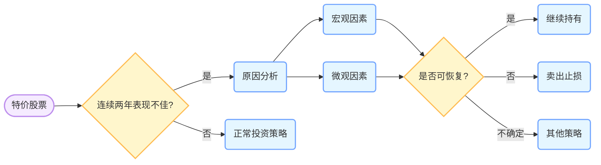

# 连续两年表现不佳的特价股票处理方法

> 关键词：特价股票、连续两年表现不佳、处理方法、股票分析、投资策略

> 摘要：本文旨在深入探讨连续两年表现不佳的特价股票的处理方法。通过对相关核心概念的解析、核心算法原理的阐述、数学模型的构建，结合项目实战案例，详细分析了处理此类股票的具体步骤和策略。同时，介绍了实际应用场景、推荐了相关工具和资源，最后总结了未来发展趋势与挑战，并对常见问题进行了解答，为投资者在面对连续两年表现不佳的特价股票时提供全面、专业的参考。

## 1. 背景介绍 
### 1.1 目的和范围
在股票投资领域，特价股票因其价格相对较低，往往吸引着众多投资者的关注。然而，当这些特价股票连续两年表现不佳时，投资者面临着艰难的决策：是继续持有等待转机，还是果断卖出止损。本文章的目的在于为投资者提供一套系统、科学的处理方法，帮助他们在面对这种情况时做出明智的决策。

文章的范围涵盖了特价股票的定义、表现不佳的原因分析、处理方法的探讨，以及通过实际案例进行验证和说明。同时，还会介绍相关的工具和资源，为投资者进一步研究和实践提供支持。

### 1.2 预期读者
本文的预期读者主要包括以下几类人群：
- 个人投资者：无论是初入股市的新手，还是有一定投资经验的老手，都可能遇到连续两年表现不佳的特价股票的情况，本文将为他们提供实用的处理建议。
- 金融从业者：如股票分析师、投资顾问等，他们需要深入了解特价股票的处理方法，以便为客户提供专业的服务和建议。
- 金融专业学生：对于学习金融、投资等相关专业的学生来说，本文可以作为他们了解股票投资实践的参考资料，帮助他们将理论知识与实际操作相结合。

### 1.3 文档结构概述
本文将按照以下结构进行组织：
- 核心概念与联系：介绍特价股票、股票表现不佳等核心概念，并分析它们之间的联系。
- 核心算法原理 & 具体操作步骤：阐述用于分析和处理连续两年表现不佳的特价股票的核心算法原理，并给出具体的操作步骤。
- 数学模型和公式 & 详细讲解 & 举例说明：构建相关的数学模型和公式，详细讲解其含义和应用，并通过具体例子进行说明。
- 项目实战：代码实际案例和详细解释说明：通过实际的代码案例，展示如何运用前面介绍的方法和原理处理连续两年表现不佳的特价股票，并对代码进行详细解读。
- 实际应用场景：介绍这些处理方法在实际投资中的应用场景。
- 工具和资源推荐：推荐一些学习、开发和研究相关内容的工具和资源。
- 总结：未来发展趋势与挑战：总结处理连续两年表现不佳的特价股票的未来发展趋势和面临的挑战。
- 附录：常见问题与解答：解答一些常见的问题，帮助读者更好地理解和应用本文的内容。
- 扩展阅读 & 参考资料：提供一些扩展阅读的资料和参考文献，方便读者进一步深入研究。

### 1.4 术语表
#### 1.4.1 核心术语定义
- 特价股票：指价格相对较低的股票，通常具有较低的市盈率、市净率等估值指标。
- 股票表现不佳：指股票在一定时期内的价格涨幅低于市场平均水平，或者出现了较大幅度的下跌。
- 连续两年表现不佳：指股票在连续两个完整的会计年度内都表现不佳。

#### 1.4.2 相关概念解释
- 市盈率（P/E）：指股票价格与每股盈利的比率，反映了投资者为获取公司每一元盈利所愿意支付的价格。
- 市净率（P/B）：指股票价格与每股净资产的比率，反映了投资者为获取公司每一元净资产所愿意支付的价格。
- 止损：指在股票投资中，当股票价格下跌到一定程度时，投资者为避免损失进一步扩大而卖出股票的操作。

#### 1.4.3 缩略词列表
- P/E：市盈率（Price-to-Earnings Ratio）
- P/B：市净率（Price-to-Book Ratio）

## 2. 核心概念与联系 

### 核心概念原理
#### 特价股票
特价股票通常是由于市场对公司的短期负面评价、行业周期性低谷或者公司内部的一些暂时问题导致其价格被低估。从价值投资的角度来看，这些股票可能具有一定的投资潜力，因为市场的错误定价可能会在未来得到纠正。

#### 股票表现不佳
股票表现不佳的原因可能是多方面的。从宏观层面来看，宏观经济环境的变化、行业竞争加剧等因素可能会影响整个行业的发展，导致公司的业绩下滑。从微观层面来看，公司自身的经营管理问题、产品竞争力下降等也可能导致股票表现不佳。

#### 连续两年表现不佳
当股票连续两年表现不佳时，情况可能更加复杂。这可能意味着公司面临着深层次的问题，如战略失误、管理层能力不足等。然而，也有可能是市场的过度反应，或者是公司正在进行重大的业务转型，短期内业绩受到影响。

### 架构的文本示意图
```plaintext
特价股票
|
|-- 连续两年表现不佳
|   |
|   |-- 原因分析
|   |   |
|   |   |-- 宏观因素
|   |   |-- 微观因素
|   |
|   |-- 处理方法
|       |
|       |-- 继续持有
|       |-- 卖出止损
|       |-- 其他策略
```

### Mermaid 流程图


## 3. 核心算法原理 & 具体操作步骤 

### 核心算法原理
我们可以使用多因素分析算法来评估连续两年表现不佳的特价股票是否值得继续持有。该算法主要考虑以下几个因素：
- 财务指标：如市盈率、市净率、净利润增长率等。
- 行业趋势：分析行业的发展前景和竞争态势。
- 公司治理：评估公司的管理层能力、战略规划等。

具体来说，我们可以为每个因素分配一个权重，然后根据股票在各个因素上的表现进行打分，最后计算出一个综合得分。如果综合得分高于某个阈值，则认为该股票值得继续持有；否则，建议卖出止损。

### Python源代码实现
```python
import pandas as pd

# 定义因素权重
weights = {
    'P/E': 0.3,
    'P/B': 0.2,
    '净利润增长率': 0.2,
    '行业前景': 0.15,
    '公司治理': 0.15
}

# 定义阈值
threshold = 0.6

def calculate_score(stock_data):
    """
    计算股票的综合得分
    :param stock_data: 包含股票各项指标的字典
    :return: 综合得分
    """
    score = 0
    for factor, weight in weights.items():
        score += stock_data[factor] * weight
    return score

def process_stock(stock_data):
    """
    处理连续两年表现不佳的特价股票
    :param stock_data: 包含股票各项指标的字典
    :return: 处理建议
    """
    score = calculate_score(stock_data)
    if score > threshold:
        return '继续持有'
    else:
        return '卖出止损'

# 示例数据
stock_data = {
    'P/E': 0.8,
    'P/B': 0.7,
    '净利润增长率': -0.1,
    '行业前景': 0.6,
    '公司治理': 0.7
}

# 处理股票
result = process_stock(stock_data)
print(f"处理建议: {result}")
```

### 具体操作步骤
1. **数据收集**：收集连续两年表现不佳的特价股票的相关数据，包括财务报表、行业研究报告、公司公告等。
2. **指标计算**：根据收集到的数据，计算各项评估指标，如市盈率、市净率、净利润增长率等。
3. **打分**：根据股票在各个因素上的表现，为每个因素打分。
4. **综合得分计算**：使用上述算法计算股票的综合得分。
5. **决策**：根据综合得分和阈值，做出继续持有或卖出止损的决策。

## 4. 数学模型和公式 & 详细讲解 & 举例说明 

### 数学模型
我们可以用以下数学模型来表示股票的综合得分：

$$
S = \sum_{i=1}^{n} w_i \times x_i
$$

其中，$S$ 表示股票的综合得分，$w_i$ 表示第 $i$ 个因素的权重，$x_i$ 表示股票在第 $i$ 个因素上的得分，$n$ 表示因素的数量。

### 详细讲解
- 权重 $w_i$：权重反映了每个因素在综合评估中的重要程度。权重的分配需要根据具体情况进行调整，一般来说，财务指标的权重相对较高，因为它们直接反映了公司的经营状况。
- 得分 $x_i$：得分表示股票在某个因素上的表现。得分的取值范围通常为 $[0, 1]$，得分越高表示股票在该因素上的表现越好。
- 综合得分 $S$：综合得分是所有因素得分的加权平均值。综合得分越高，说明股票的整体表现越好，越值得继续持有。

### 举例说明
假设我们有一只连续两年表现不佳的特价股票，其各项指标的得分如下：
| 因素 | 得分 | 权重 |
| ---- | ---- | ---- |
| P/E | 0.8 | 0.3 |
| P/B | 0.7 | 0.2 |
| 净利润增长率 | -0.1 | 0.2 |
| 行业前景 | 0.6 | 0.15 |
| 公司治理 | 0.7 | 0.15 |

根据上述数学模型，我们可以计算出该股票的综合得分：

$$
\begin{align*}
S &= 0.3 \times 0.8 + 0.2 \times 0.7 + 0.2 \times (-0.1) + 0.15 \times 0.6 + 0.15 \times 0.7 \\
&= 0.24 + 0.14 - 0.02 + 0.09 + 0.105 \\
&= 0.555
\end{align*}
$$

由于综合得分 $0.555$ 低于阈值 $0.6$，根据我们的决策规则，建议卖出止损。

## 5. 项目实战：代码实际案例和详细解释说明 

### 5.1  开发环境搭建
- **Python 环境**：建议使用 Python 3.7 及以上版本。可以从 Python 官方网站（https://www.python.org/downloads/）下载并安装。
- **依赖库**：需要安装 `pandas` 库，用于数据处理和分析。可以使用以下命令进行安装：
```sh
pip install pandas
```

### 5.2  源代码详细实现和代码解读
```python
import pandas as pd

# 定义因素权重
weights = {
    'P/E': 0.3,
    'P/B': 0.2,
    '净利润增长率': 0.2,
    '行业前景': 0.15,
    '公司治理': 0.15
}

# 定义阈值
threshold = 0.6

def calculate_score(stock_data):
    """
    计算股票的综合得分
    :param stock_data: 包含股票各项指标的字典
    :return: 综合得分
    """
    score = 0
    for factor, weight in weights.items():
        score += stock_data[factor] * weight
    return score

def process_stock(stock_data):
    """
    处理连续两年表现不佳的特价股票
    :param stock_data: 包含股票各项指标的字典
    :return: 处理建议
    """
    score = calculate_score(stock_data)
    if score > threshold:
        return '继续持有'
    else:
        return '卖出止损'

# 示例数据
stock_data = {
    'P/E': 0.8,
    'P/B': 0.7,
    '净利润增长率': -0.1,
    '行业前景': 0.6,
    '公司治理': 0.7
}

# 处理股票
result = process_stock(stock_data)
print(f"处理建议: {result}")
```

### 代码解读与分析
- **因素权重定义**：`weights` 字典定义了各个因素的权重，这些权重可以根据实际情况进行调整。
- **阈值定义**：`threshold` 变量定义了判断股票是否值得继续持有的阈值。
- **`calculate_score` 函数**：该函数接受一个包含股票各项指标的字典作为输入，根据权重计算股票的综合得分。
- **`process_stock` 函数**：该函数调用 `calculate_score` 函数计算股票的综合得分，并根据阈值做出处理建议。
- **示例数据**：`stock_data` 字典包含了一只股票的各项指标得分，用于测试代码。
- **处理结果输出**：最后，调用 `process_stock` 函数处理股票，并输出处理建议。

## 6. 实际应用场景 
### 个人投资者
个人投资者在进行股票投资时，可能会遇到连续两年表现不佳的特价股票。通过使用本文介绍的处理方法，个人投资者可以更加科学地评估这些股票的投资价值，避免盲目跟风或情绪化决策。例如，一位个人投资者持有一只连续两年表现不佳的特价股票，他可以收集该股票的相关数据，使用上述算法计算综合得分，根据得分决定是否继续持有。

### 投资机构
投资机构通常管理着大量的资金，需要对投资组合进行精细的管理。当投资组合中出现连续两年表现不佳的特价股票时，投资机构可以使用本文介绍的方法进行分析和处理，优化投资组合，降低风险。例如，一家基金公司发现其投资组合中有一只连续两年表现不佳的特价股票，通过分析和计算，决定是否卖出该股票，或者采取其他措施进行调整。

### 金融研究机构
金融研究机构可以使用本文介绍的方法进行股票市场的研究和分析。通过对大量连续两年表现不佳的特价股票进行研究，金融研究机构可以发现市场的规律和趋势，为投资者提供更有价值的研究报告和投资建议。例如，一家金融研究机构可以收集多个行业的连续两年表现不佳的特价股票数据，分析其处理方法和效果，总结出一些通用的投资策略。

## 7. 工具和资源推荐
### 7.1 学习资源推荐
#### 7.1.1 书籍推荐
- 《聪明的投资者》（The Intelligent Investor）：本杰明·格雷厄姆（Benjamin Graham）著，这本书是价值投资的经典之作，介绍了股票投资的基本原理和方法。
- 《金融炼金术》（The Alchemy of Finance）：乔治·索罗斯（George Soros）著，这本书探讨了金融市场的运行规律和投资者的心理行为。
- 《股票大作手回忆录》（Reminiscences of a Stock Operator）：爱德温·勒菲弗（Edwin Lefèvre）著，这本书通过讲述一位股票大作手的故事，介绍了股票投资的实战经验和技巧。

#### 7.1.2 在线课程
- Coursera 上的“投资学原理”（Principles of Investment）课程：由宾夕法尼亚大学沃顿商学院的教授授课，介绍了投资学的基本原理和方法。
- Udemy 上的“股票投资实战课程”（Stock Investing Masterclass）：由专业的投资导师授课，介绍了股票投资的实战技巧和策略。

#### 7.1.3 技术博客和网站
- 雪球网（https://xueqiu.com/）：国内知名的股票投资社区，提供股票行情、分析报告、投资策略等信息。
- 东方财富网（https://www.eastmoney.com/）：国内领先的金融信息服务平台，提供股票、基金、期货等多种金融产品的行情和分析。
- Seeking Alpha（https://seekingalpha.com/）：国外知名的金融投资网站，提供股票分析、投资建议、市场评论等内容。

### 7.2 开发工具框架推荐
#### 7.2.1 IDE和编辑器
- PyCharm：一款专业的 Python 集成开发环境，提供代码编辑、调试、版本控制等功能。
- Jupyter Notebook：一种交互式的编程环境，适合进行数据探索和分析。

#### 7.2.2 调试和性能分析工具
- PDB：Python 自带的调试工具，可以帮助开发者定位和解决代码中的问题。
- cProfile：Python 自带的性能分析工具，可以帮助开发者分析代码的性能瓶颈。

#### 7.2.3 相关框架和库
- Pandas：用于数据处理和分析的 Python 库，提供了丰富的数据结构和数据操作方法。
- NumPy：用于科学计算的 Python 库，提供了高效的数组操作和数学函数。

### 7.3 相关论文著作推荐
#### 7.3.1 经典论文
- Fama, E. F., & French, K. R. (1992). The cross-section of expected stock returns. The Journal of Finance, 47(2), 427-465. 这篇论文提出了著名的 Fama-French 三因子模型，用于解释股票收益率的横截面差异。
- Sharpe, W. F. (1964). Capital asset prices: A theory of market equilibrium under conditions of risk. The Journal of Finance, 19(3), 425-442. 这篇论文提出了资本资产定价模型（CAPM），用于描述资产预期收益率与风险之间的关系。

#### 7.3.2 最新研究成果
- 可以关注《Journal of Financial Economics》、《Review of Financial Studies》等顶级金融学术期刊，了解最新的股票投资研究成果。

#### 7.3.3 应用案例分析
- 可以参考一些知名投资机构的研究报告和案例分析，了解他们在处理连续两年表现不佳的特价股票时的方法和策略。

## 8. 总结：未来发展趋势与挑战
### 未来发展趋势
- **智能化分析**：随着人工智能和机器学习技术的不断发展，未来对连续两年表现不佳的特价股票的分析将更加智能化。可以使用深度学习算法对大量的股票数据进行分析和预测，提高分析的准确性和效率。
- **多因素综合分析**：除了财务指标、行业趋势和公司治理等因素外，未来还将考虑更多的因素，如宏观经济政策、技术创新等，进行多因素综合分析，以更全面地评估股票的投资价值。
- **个性化投资策略**：根据投资者的风险偏好、投资目标等因素，为投资者提供个性化的投资策略。不同的投资者对连续两年表现不佳的特价股票的处理方法可能不同，未来的投资策略将更加注重个性化。

### 挑战
- **数据质量和可靠性**：准确的数据分析依赖于高质量、可靠的数据。然而，股票市场的数据往往存在噪声、缺失值等问题，如何保证数据的质量和可靠性是一个挑战。
- **市场不确定性**：股票市场具有高度的不确定性，未来的市场走势难以准确预测。即使使用了先进的分析方法，也不能完全避免投资风险。
- **投资者情绪影响**：投资者的情绪和心理因素对股票市场的影响很大。在处理连续两年表现不佳的特价股票时，投资者的情绪可能会导致他们做出不理性的决策。

## 9. 附录：常见问题与解答
### 问题1：如何确定因素的权重？
因素的权重可以根据投资者的经验、市场情况和研究结果进行确定。一般来说，财务指标的权重相对较高，因为它们直接反映了公司的经营状况。投资者可以根据自己的投资目标和风险偏好，对权重进行调整。

### 问题2：综合得分的阈值应该如何确定？
综合得分的阈值可以根据历史数据和市场情况进行确定。一般来说，可以通过回测的方法，找到一个能够平衡风险和收益的阈值。投资者也可以根据自己的风险承受能力，对阈值进行调整。

### 问题3：如果股票的某个因素数据缺失，应该如何处理？
如果股票的某个因素数据缺失，可以采用以下方法进行处理：
- 忽略该因素：如果缺失的数据对综合得分的影响较小，可以忽略该因素，只使用其他因素的数据进行计算。
- 插值法：可以使用插值法对缺失的数据进行估计。例如，可以使用线性插值、多项式插值等方法。
- 参考同行业数据：可以参考同行业其他公司的数据，对缺失的数据进行估计。

## 10. 扩展阅读 & 参考资料
### 扩展阅读
- 《量化投资：策略与技术》（ Quantitative Investment: Strategies and Techniques）：这本书介绍了量化投资的基本原理和方法，包括数据处理、模型构建、策略优化等内容。
- 《行为金融学》（Behavioral Finance）：这本书探讨了投资者的心理行为对金融市场的影响，以及如何运用行为金融学的原理进行投资决策。

### 参考资料
- Fama, E. F., & French, K. R. (1992). The cross-section of expected stock returns. The Journal of Finance, 47(2), 427-465.
- Sharpe, W. F. (1964). Capital asset prices: A theory of market equilibrium under conditions of risk. The Journal of Finance, 19(3), 425-442.

作者：AI天才研究院/AI Genius Institute & 禅与计算机程序设计艺术 /Zen And The Art of Computer Programming