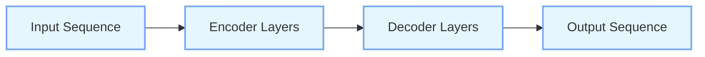

# 选择合适的LLM大模型：对比与评估

> 关键词：LLM大模型、模型对比、模型评估、选择策略、自然语言处理

> 摘要：本文围绕如何选择合适的LLM大模型展开，详细阐述了大模型的核心概念、算法原理、数学模型等内容。通过深入分析不同大模型的特点，结合实际案例展示了大模型在各个领域的应用。同时，提供了丰富的学习资源、开发工具和相关论文推荐，帮助读者全面了解大模型。最后，对大模型的未来发展趋势与挑战进行了总结，并解答了常见问题，为读者在选择和应用LLM大模型时提供全面且深入的指导。

## 1. 背景介绍 
### 1.1 目的和范围
随着人工智能技术的飞速发展，大型语言模型（LLM）在自然语言处理领域展现出了强大的能力。本文章的目的在于帮助开发者、研究人员以及企业决策者等相关人员，深入了解不同LLM大模型的特点、性能和适用场景，从而能够根据自身需求选择合适的大模型。文章将涵盖常见LLM大模型的对比与评估，包括模型的架构、训练方式、应用领域等方面，同时会结合实际案例进行分析。

### 1.2 预期读者
本文预期读者包括但不限于以下几类人群：
- 人工智能开发者：希望通过了解不同大模型的特点，选择合适的模型应用于自己的项目中。
- 研究人员：对LLM大模型的技术原理和发展趋势感兴趣，希望深入研究相关领域。
- 企业决策者：需要根据企业的业务需求，决定是否引入大模型以及选择哪种大模型。
- 自然语言处理爱好者：想要了解大模型的基本概念和应用场景，拓宽自己的知识面。

### 1.3 文档结构概述
本文将按照以下结构进行阐述：
- 核心概念与联系：介绍LLM大模型的基本概念、架构和工作原理，并通过示意图和流程图进行直观展示。
- 核心算法原理 & 具体操作步骤：详细讲解大模型背后的核心算法，如Transformer架构，并使用Python代码进行示例。
- 数学模型和公式 & 详细讲解 & 举例说明：介绍大模型涉及的数学模型和公式，如注意力机制的数学表达，并结合实际例子进行说明。
- 项目实战：代码实际案例和详细解释说明：通过一个具体的项目案例，展示如何使用大模型进行自然语言处理任务，包括开发环境搭建、源代码实现和代码解读。
- 实际应用场景：介绍大模型在不同领域的实际应用，如智能客服、文本生成等。
- 工具和资源推荐：推荐学习大模型的相关书籍、在线课程、技术博客和网站，以及开发工具、框架和相关论文。
- 总结：未来发展趋势与挑战：对大模型的未来发展趋势进行展望，并分析可能面临的挑战。
- 附录：常见问题与解答：解答读者在选择和使用大模型过程中常见的问题。
- 扩展阅读 & 参考资料：提供相关的扩展阅读资源和参考资料，方便读者进一步深入学习。

### 1.4 术语表
#### 1.4.1 核心术语定义
- **LLM（Large Language Model）**：大型语言模型，是一种基于深度学习的人工智能模型，通过在大规模文本数据上进行训练，学习语言的模式和规律，从而能够完成各种自然语言处理任务。
- **Transformer**：一种基于注意力机制的深度学习架构，被广泛应用于LLM大模型中，具有并行计算能力强、能够捕捉长距离依赖关系等优点。
- **预训练**：在大规模无标注文本数据上对模型进行训练，让模型学习语言的通用知识和模式。
- **微调**：在预训练模型的基础上，使用特定任务的标注数据对模型进行进一步训练，以适应具体的任务需求。
- **注意力机制**：一种能够让模型在处理序列数据时，自动关注序列中不同部分的机制，有助于模型捕捉长距离依赖关系。

#### 1.4.2 相关概念解释
- **自然语言处理（NLP）**：研究如何让计算机理解和处理人类语言的技术领域，包括文本分类、情感分析、机器翻译等任务。
- **深度学习**：一种基于人工神经网络的机器学习方法，通过构建多层神经网络来学习数据的特征和模式。
- **模型评估指标**：用于衡量模型性能的指标，如准确率、召回率、F1值等，不同的任务可能使用不同的评估指标。

#### 1.4.3 缩略词列表
- **GPT（Generative Pretrained Transformer）**：生成式预训练Transformer，是OpenAI开发的一系列大模型。
- **BERT（Bidirectional Encoder Representations from Transformers）**：基于Transformer的双向编码器表示，是Google开发的一种预训练语言模型。
- **T5（Text-to-Text Transfer Transformer）**：文本到文本转换Transformer，是Google开发的一种统一框架的大模型。
- **XLNet**：一种基于自回归和自编码的预训练语言模型，由CMU和Google Brain联合开发。

## 2. 核心概念与联系 

### 核心概念原理
LLM大模型的核心是基于深度学习的神经网络架构，其中Transformer架构是目前最主流的选择。Transformer架构通过引入注意力机制，解决了传统循环神经网络（RNN）在处理长序列数据时的梯度消失和难以并行计算的问题。

#### Transformer架构
Transformer架构主要由编码器（Encoder）和解码器（Decoder）两部分组成。编码器负责对输入的文本进行特征提取和编码，解码器则根据编码器的输出生成目标文本。

编码器由多个相同的编码层堆叠而成，每个编码层包含多头注意力机制（Multi-Head Attention）和前馈神经网络（Feed-Forward Network）两部分。多头注意力机制允许模型在不同的表示子空间中并行地关注输入序列的不同部分，从而捕捉更丰富的信息。前馈神经网络则对多头注意力机制的输出进行非线性变换。

解码器同样由多个相同的解码层堆叠而成，每个解码层除了包含多头注意力机制和前馈神经网络外，还包含一个编码器 - 解码器注意力机制（Encoder-Decoder Attention），用于将编码器的输出信息融入到解码器的生成过程中。

#### 预训练和微调
LLM大模型通常采用预训练 - 微调的两阶段训练策略。在预训练阶段，模型在大规模无标注文本数据上进行训练，学习语言的通用知识和模式。常见的预训练任务包括掩码语言模型（Masked Language Model，MLM）和自回归语言模型（Autoregressive Language Model，ARLM）。

在微调阶段，使用特定任务的标注数据对预训练模型进行进一步训练，以适应具体的任务需求。微调过程通常只需要较少的标注数据和较短的训练时间，就可以让模型在特定任务上取得较好的性能。

### 架构的文本示意图
```plaintext
                      +-------------------+
                      |   Input Sequence  |
                      +-------------------+
                              |
                              v
              +-----------------------------+
              |        Encoder Layers       |
              | (Multi-Head Attention + FFN) |
              +-----------------------------+
                              |
                              v
              +-----------------------------+
              |        Decoder Layers       |
              | (Multi-Head Attention + FFN) |
              |  + Encoder-Decoder Attention |
              +-----------------------------+
                              |
                              v
                      +-------------------+
                      |   Output Sequence  |
                      +-------------------+
```

### Mermaid流程图


## 3. 核心算法原理 & 具体操作步骤 

### 核心算法原理：Transformer中的注意力机制
注意力机制是Transformer架构的核心，它允许模型在处理序列数据时，自动关注序列中不同部分的信息。具体来说，注意力机制通过计算查询（Query）、键（Key）和值（Value）之间的相似度，来确定每个位置的重要性，并根据重要性对值进行加权求和。

#### 缩放点积注意力（Scaled Dot-Product Attention）
缩放点积注意力的计算公式如下：
$$
\text{Attention}(Q, K, V) = \text{softmax}\left(\frac{QK^T}{\sqrt{d_k}}\right)V
$$
其中，$Q$ 是查询矩阵，$K$ 是键矩阵，$V$ 是值矩阵，$d_k$ 是键的维度。$\frac{QK^T}{\sqrt{d_k}}$ 计算了查询和键之间的相似度，然后通过softmax函数将相似度转换为概率分布，最后根据概率分布对值进行加权求和。

#### 多头注意力（Multi-Head Attention）
多头注意力机制将查询、键和值分别投影到多个低维子空间中，然后在每个子空间中独立地计算注意力，最后将所有子空间的注意力结果拼接起来并进行线性变换。多头注意力的计算公式如下：
$$
\text{MultiHead}(Q, K, V) = \text{Concat}(\text{head}_1, \ldots, \text{head}_h)W^O
$$
其中，$\text{head}_i = \text{Attention}(QW_i^Q, KW_i^K, VW_i^V)$，$W_i^Q$、$W_i^K$ 和 $W_i^V$ 是投影矩阵，$W^O$ 是输出投影矩阵。

### 具体操作步骤及Python代码实现
以下是一个简单的Python代码示例，展示了如何实现缩放点积注意力和多头注意力：

```python
import torch
import torch.nn as nn
import torch.nn.functional as F

# 缩放点积注意力
def scaled_dot_product_attention(q, k, v, mask=None):
    d_k = q.size(-1)
    scores = torch.matmul(q, k.transpose(-2, -1)) / torch.sqrt(torch.tensor(d_k, dtype=torch.float32))
    if mask is not None:
        scores = scores.masked_fill(mask == 0, -1e9)
    attention_weights = F.softmax(scores, dim=-1)
    output = torch.matmul(attention_weights, v)
    return output, attention_weights

# 多头注意力
class MultiHeadAttention(nn.Module):
    def __init__(self, d_model, num_heads):
        super(MultiHeadAttention, self).__init__()
        assert d_model % num_heads == 0, "d_model must be divisible by num_heads"

        self.d_model = d_model
        self.num_heads = num_heads
        self.d_k = d_model // num_heads

        self.W_q = nn.Linear(d_model, d_model)
        self.W_k = nn.Linear(d_model, d_model)
        self.W_v = nn.Linear(d_model, d_model)
        self.W_o = nn.Linear(d_model, d_model)

    def split_heads(self, x):
        batch_size, seq_length, d_model = x.size()
        return x.view(batch_size, seq_length, self.num_heads, self.d_k).transpose(1, 2)

    def forward(self, q, k, v, mask=None):
        batch_size = q.size(0)

        Q = self.split_heads(self.W_q(q))
        K = self.split_heads(self.W_k(k))
        V = self.split_heads(self.W_v(v))

        if mask is not None:
            mask = mask.unsqueeze(1)

        output, attention_weights = scaled_dot_product_attention(Q, K, V, mask)
        output = output.transpose(1, 2).contiguous().view(batch_size, -1, self.d_model)
        output = self.W_o(output)

        return output, attention_weights

# 示例使用
d_model = 512
num_heads = 8
batch_size = 32
seq_length = 10

q = torch.randn(batch_size, seq_length, d_model)
k = torch.randn(batch_size, seq_length, d_model)
v = torch.randn(batch_size, seq_length, d_model)

multihead_attn = MultiHeadAttention(d_model, num_heads)
output, attention_weights = multihead_attn(q, k, v)

print("Output shape:", output.shape)
print("Attention weights shape:", attention_weights.shape)
```

在上述代码中，`scaled_dot_product_attention` 函数实现了缩放点积注意力，`MultiHeadAttention` 类实现了多头注意力。通过调用 `MultiHeadAttention` 类的 `forward` 方法，可以计算多头注意力的输出和注意力权重。

## 4. 数学模型和公式 & 详细讲解 & 举例说明 

### 注意力机制的数学模型和公式
#### 缩放点积注意力
如前所述，缩放点积注意力的计算公式为：
$$
\text{Attention}(Q, K, V) = \text{softmax}\left(\frac{QK^T}{\sqrt{d_k}}\right)V
$$
其中，$Q \in \mathbb{R}^{n \times d_k}$，$K \in \mathbb{R}^{m \times d_k}$，$V \in \mathbb{R}^{m \times d_v}$，$n$ 是查询序列的长度，$m$ 是键和值序列的长度，$d_k$ 是键的维度，$d_v$ 是值的维度。

$\frac{QK^T}{\sqrt{d_k}}$ 计算了查询和键之间的相似度，除以 $\sqrt{d_k}$ 是为了防止点积的结果过大，导致softmax函数的梯度变得非常小。softmax函数将相似度转换为概率分布，使得每个位置的权重之和为1。最后，将概率分布与值矩阵 $V$ 相乘，得到注意力输出。

#### 多头注意力
多头注意力的计算公式为：
$$
\text{MultiHead}(Q, K, V) = \text{Concat}(\text{head}_1, \ldots, \text{head}_h)W^O
$$
其中，$\text{head}_i = \text{Attention}(QW_i^Q, KW_i^K, VW_i^V)$，$W_i^Q \in \mathbb{R}^{d_{model} \times d_k}$，$W_i^K \in \mathbb{R}^{d_{model} \times d_k}$，$W_i^V \in \mathbb{R}^{d_{model} \times d_v}$，$W^O \in \mathbb{R}^{h \cdot d_v \times d_{model}}$，$h$ 是头的数量，$d_{model}$ 是模型的维度。

多头注意力通过将查询、键和值投影到多个低维子空间中，让模型能够在不同的表示子空间中并行地关注输入序列的不同部分，从而捕捉更丰富的信息。

### 详细讲解
#### 缩放点积注意力的计算过程
假设我们有一个查询向量 $q \in \mathbb{R}^{d_k}$，一个键矩阵 $K \in \mathbb{R}^{m \times d_k}$ 和一个值矩阵 $V \in \mathbb{R}^{m \times d_v}$。首先，计算查询向量与键矩阵中每个键向量的点积，得到相似度分数：
$$
\text{scores}_i = q^T k_i, \quad i = 1, \ldots, m
$$
然后，将相似度分数除以 $\sqrt{d_k}$ 并进行softmax操作，得到每个位置的注意力权重：
$$
\text{weights}_i = \frac{\exp(\text{scores}_i / \sqrt{d_k})}{\sum_{j=1}^{m} \exp(\text{scores}_j / \sqrt{d_k})}, \quad i = 1, \ldots, m
$$
最后，根据注意力权重对值矩阵进行加权求和，得到注意力输出：
$$
\text{output} = \sum_{i=1}^{m} \text{weights}_i v_i
$$

#### 多头注意力的计算过程
多头注意力的计算过程可以分为以下几个步骤：
1. 将查询、键和值分别通过线性变换投影到多个低维子空间中：
$$
Q_i = QW_i^Q, \quad K_i = KW_i^K, \quad V_i = VW_i^V, \quad i = 1, \ldots, h
$$
2. 在每个子空间中独立地计算缩放点积注意力：
$$
\text{head}_i = \text{Attention}(Q_i, K_i, V_i), \quad i = 1, \ldots, h
$$
3. 将所有子空间的注意力结果拼接起来：
$$
\text{concat} = \text{Concat}(\text{head}_1, \ldots, \text{head}_h)
$$
4. 对拼接结果进行线性变换，得到最终的多头注意力输出：
$$
\text{output} = \text{concat}W^O
$$

### 举例说明
假设我们有一个输入序列 $x = [x_1, x_2, x_3]$，其中每个 $x_i \in \mathbb{R}^{d_{model}}$，$d_{model} = 6$。我们使用 $h = 2$ 个头的多头注意力机制，$d_k = d_v = 3$。

首先，将查询、键和值分别通过线性变换投影到两个低维子空间中：
$$
Q_1 = QW_1^Q, \quad K_1 = KW_1^K, \quad V_1 = VW_1^V
$$
$$
Q_2 = QW_2^Q, \quad K_2 = KW_2^K, \quad V_2 = VW_2^V
$$
然后，在每个子空间中独立地计算缩放点积注意力：
$$
\text{head}_1 = \text{Attention}(Q_1, K_1, V_1)
$$
$$
\text{head}_2 = \text{Attention}(Q_2, K_2, V_2)
$$
将两个头的注意力结果拼接起来：
$$
\text{concat} = \text{Concat}(\text{head}_1, \text{head}_2)
$$
最后，对拼接结果进行线性变换，得到最终的多头注意力输出：
$$
\text{output} = \text{concat}W^O
$$

通过这个例子，我们可以看到多头注意力机制如何通过在多个低维子空间中并行地关注输入序列的不同部分，来捕捉更丰富的信息。

## 5. 项目实战：代码实际案例和详细解释说明 

### 5.1  开发环境搭建
在进行项目实战之前，我们需要搭建开发环境。以下是具体的步骤：

#### 安装Python
确保你已经安装了Python 3.7或更高版本。你可以从Python官方网站（https://www.python.org/downloads/）下载并安装Python。

#### 创建虚拟环境
为了避免不同项目之间的依赖冲突，建议使用虚拟环境。可以使用 `venv` 模块创建虚拟环境：
```bash
python -m venv llm_project_env
```
激活虚拟环境：
- 在Windows上：
```bash
llm_project_env\Scripts\activate
```
- 在Linux或Mac上：
```bash
source llm_project_env/bin/activate
```

#### 安装必要的库
在虚拟环境中安装必要的库，包括 `torch`、`transformers` 等：
```bash
pip install torch transformers
```

### 5.2  源代码详细实现和代码解读
我们以文本分类任务为例，展示如何使用预训练的LLM大模型进行项目开发。以下是具体的代码实现：

```python
import torch
from torch.utils.data import Dataset, DataLoader
from transformers import BertTokenizer, BertForSequenceClassification, AdamW
from sklearn.model_selection import train_test_split
import pandas as pd

# 定义数据集类
class TextClassificationDataset(Dataset):
    def __init__(self, texts, labels, tokenizer, max_length):
        self.texts = texts
        self.labels = labels
        self.tokenizer = tokenizer
        self.max_length = max_length

    def __len__(self):
        return len(self.texts)

    def __getitem__(self, idx):
        text = str(self.texts[idx])
        label = self.labels[idx]

        encoding = self.tokenizer.encode_plus(
            text,
            add_special_tokens=True,
            max_length=self.max_length,
            padding='max_length',
            truncation=True,
            return_tensors='pt'
        )

        return {
            'input_ids': encoding['input_ids'].flatten(),
            'attention_mask': encoding['attention_mask'].flatten(),
            'labels': torch.tensor(label, dtype=torch.long)
        }

# 加载数据
data = pd.read_csv('data.csv')
texts = data['text'].tolist()
labels = data['label'].tolist()

# 划分训练集和测试集
train_texts, test_texts, train_labels, test_labels = train_test_split(texts, labels, test_size=0.2, random_state=42)

# 初始化tokenizer和模型
tokenizer = BertTokenizer.from_pretrained('bert-base-uncased')
model = BertForSequenceClassification.from_pretrained('bert-base-uncased', num_labels=len(set(labels)))

# 创建数据集和数据加载器
max_length = 128
train_dataset = TextClassificationDataset(train_texts, train_labels, tokenizer, max_length)
test_dataset = TextClassificationDataset(test_texts, test_labels, tokenizer, max_length)

train_dataloader = DataLoader(train_dataset, batch_size=16, shuffle=True)
test_dataloader = DataLoader(test_dataset, batch_size=16, shuffle=False)

# 定义训练参数
device = torch.device('cuda' if torch.cuda.is_available() else 'cpu')
model.to(device)

optimizer = AdamW(model.parameters(), lr=2e-5)
epochs = 3

# 训练模型
for epoch in range(epochs):
    model.train()
    total_loss = 0

    for batch in train_dataloader:
        input_ids = batch['input_ids'].to(device)
        attention_mask = batch['attention_mask'].to(device)
        labels = batch['labels'].to(device)

        model.zero_grad()

        outputs = model(input_ids, attention_mask=attention_mask, labels=labels)
        loss = outputs.loss

        loss.backward()
        optimizer.step()

        total_loss += loss.item()

    print(f'Epoch {epoch + 1}, Loss: {total_loss / len(train_dataloader)}')

# 评估模型
model.eval()
correct_predictions = 0
total_predictions = 0

with torch.no_grad():
    for batch in test_dataloader:
        input_ids = batch['input_ids'].to(device)
        attention_mask = batch['attention_mask'].to(device)
        labels = batch['labels'].to(device)

        outputs = model(input_ids, attention_mask=attention_mask)
        logits = outputs.logits
        predictions = torch.argmax(logits, dim=1)

        correct_predictions += (predictions == labels).sum().item()
        total_predictions += labels.size(0)

accuracy = correct_predictions / total_predictions
print(f'Test Accuracy: {accuracy}')
```

### 5.3  代码解读与分析
#### 数据集类 `TextClassificationDataset`
这个类继承自 `torch.utils.data.Dataset`，用于封装文本分类数据集。在 `__getitem__` 方法中，使用 `BertTokenizer` 对文本进行编码，将其转换为模型可以接受的输入格式。

#### 数据加载与划分
使用 `pandas` 库加载CSV文件中的数据，并将其划分为训练集和测试集。

#### 初始化tokenizer和模型
使用 `BertTokenizer` 对文本进行分词，使用 `BertForSequenceClassification` 作为分类模型。`num_labels` 参数指定分类的类别数。

#### 创建数据集和数据加载器
将训练集和测试集分别封装为 `TextClassificationDataset` 对象，并使用 `DataLoader` 进行批量加载。

#### 训练模型
使用 `AdamW` 优化器对模型进行训练。在每个epoch中，遍历训练数据加载器，计算损失并进行反向传播和参数更新。

#### 评估模型
在测试集上评估模型的性能，计算准确率。

通过这个项目实战，我们展示了如何使用预训练的LLM大模型进行文本分类任务，包括数据处理、模型训练和评估等步骤。

## 6. 实际应用场景 
LLM大模型在多个领域都有广泛的应用，以下是一些常见的应用场景：

### 智能客服
智能客服系统可以使用LLM大模型来理解用户的问题，并自动生成准确的回答。通过预训练和微调，模型可以学习到各种领域的知识和常见问题的答案，从而为用户提供高效的服务。例如，电商平台的智能客服可以帮助用户查询商品信息、处理订单问题等。

### 文本生成
LLM大模型可以用于生成各种类型的文本，如新闻文章、故事、诗歌等。通过输入一些提示信息，模型可以根据学习到的语言模式和知识，生成连贯、有逻辑的文本。例如，一些写作辅助工具可以使用大模型来帮助用户生成文章的大纲或内容。

### 机器翻译
在机器翻译领域，LLM大模型可以学习到不同语言之间的对应关系，从而实现高质量的翻译。通过在大规模的双语语料上进行训练，模型可以捕捉到语言的语义和语法信息，提高翻译的准确性和流畅性。

### 情感分析
情感分析是指判断文本所表达的情感倾向，如积极、消极或中性。LLM大模型可以通过学习文本中的情感词汇和语境信息，对文本的情感进行准确的分类。例如，企业可以使用情感分析技术来了解用户对产品或服务的评价。

### 信息抽取
信息抽取是指从文本中提取特定的信息，如实体、关系和事件等。LLM大模型可以通过对文本进行语义理解，识别出关键信息，并将其结构化。例如，在金融领域，信息抽取技术可以用于从新闻文章中提取公司的财务数据和市场动态。

### 问答系统
问答系统可以使用LLM大模型来回答用户的问题。与智能客服不同的是，问答系统通常更侧重于提供知识和信息。例如，一些知识图谱问答系统可以使用大模型来理解用户的问题，并从知识图谱中检索相关的答案。

## 7. 工具和资源推荐
### 7.1 学习资源推荐
#### 7.1.1 书籍推荐
- 《深度学习》（Deep Learning）：由Ian Goodfellow、Yoshua Bengio和Aaron Courville所著，是深度学习领域的经典教材，涵盖了神经网络、卷积神经网络、循环神经网络等内容。
- 《自然语言处理入门》（Natural Language Processing with Python）：由Steven Bird、Ewan Klein和Edward Loper所著，介绍了使用Python进行自然语言处理的基本方法和技术。
- 《Attention Is All You Need》：Transformer架构的原始论文，是理解LLM大模型的重要参考文献。

#### 7.1.2 在线课程
- Coursera上的“深度学习专项课程”（Deep Learning Specialization）：由Andrew Ng教授授课，涵盖了深度学习的基础知识和应用。
- edX上的“自然语言处理”（Natural Language Processing）：由华盛顿大学开设，介绍了自然语言处理的各种技术和方法。
- Hugging Face的官方文档和教程：Hugging Face是一个专注于自然语言处理的开源社区，提供了丰富的文档和教程，帮助用户快速上手使用大模型。

#### 7.1.3 技术博客和网站
- arXiv：一个开放的预印本服务器，包含了大量的学术论文，其中有很多关于LLM大模型的最新研究成果。
- Medium：一个技术博客平台，有很多关于人工智能和自然语言处理的优质文章。
- Towards Data Science：专注于数据科学和机器学习的博客网站，提供了很多实用的教程和案例分析。

### 7.2 开发工具框架推荐
#### 7.2.1 IDE和编辑器
- PyCharm：一款功能强大的Python集成开发环境，提供了代码编辑、调试、版本控制等功能。
- Visual Studio Code：一款轻量级的代码编辑器，支持多种编程语言和插件扩展，适合快速开发和调试。

#### 7.2.2 调试和性能分析工具
- PyTorch Profiler：PyTorch官方提供的性能分析工具，可以帮助用户分析模型的训练和推理性能，找出性能瓶颈。
- TensorBoard：一个可视化工具，用于监控模型的训练过程，如损失曲线、准确率等。

#### 7.2.3 相关框架和库
- Hugging Face Transformers：一个流行的自然语言处理库，提供了各种预训练的大模型和工具，方便用户进行模型的加载、微调和解码。
- PyTorch：一个开源的深度学习框架，提供了丰富的神经网络层和优化算法，支持GPU加速。
- TensorFlow：另一个广泛使用的深度学习框架，具有高度的灵活性和可扩展性。

### 7.3 相关论文著作推荐
#### 7.3.1 经典论文
- 《Attention Is All You Need》：介绍了Transformer架构，是LLM大模型的基础。
- 《BERT: Pre-training of Deep Bidirectional Transformers for Language Understanding》：提出了BERT模型，开创了预训练 - 微调的两阶段训练策略。
- 《GPT-3: Language Models are Few-Shot Learners》：介绍了GPT-3模型，展示了大模型在少样本学习方面的强大能力。

#### 7.3.2 最新研究成果
- 《XLNet: Generalized Autoregressive Pretraining for Language Understanding》：提出了XLNet模型，结合了自回归和自编码的优点。
- 《T5: Exploring the Limits of Transfer Learning with a Unified Text-to-Text Transformer》：介绍了T5模型，提出了统一的文本到文本转换框架。

#### 7.3.3 应用案例分析
- 《Using Large Language Models for Question Answering in Healthcare》：探讨了LLM大模型在医疗领域的问答系统中的应用。
- 《Large Language Models for Financial News Analysis》：研究了LLM大模型在金融新闻分析中的应用。

## 8. 总结：未来发展趋势与挑战
### 未来发展趋势
#### 模型规模持续增大
随着计算资源的不断提升和技术的不断进步，LLM大模型的规模可能会继续增大。更大的模型通常能够学习到更丰富的语言知识和模式，从而在各种自然语言处理任务中取得更好的性能。

#### 多模态融合
未来的大模型可能会融合多种模态的信息，如图像、语音和文本等。多模态融合可以让模型更好地理解和处理复杂的现实世界信息，例如在智能客服系统中，用户可以通过语音或图片进行提问。

#### 个性化和定制化
为了满足不同用户的需求，大模型可能会朝着个性化和定制化的方向发展。例如，根据用户的历史行为和偏好，为用户提供个性化的文本生成、推荐等服务。

#### 强化学习与大模型的结合
强化学习可以让模型通过与环境的交互来学习最优策略。将强化学习与大模型相结合，可以使模型在一些需要决策和规划的任务中表现得更好，如智能对话系统中的对话策略优化。

### 挑战
#### 计算资源需求巨大
训练和推理LLM大模型需要大量的计算资源，包括高性能的GPU和大规模的集群。这不仅增加了开发成本，也限制了模型的普及和应用。

#### 数据隐私和安全问题
大模型通常需要在大规模的数据上进行训练，这些数据可能包含用户的敏感信息。因此，如何保护数据的隐私和安全是一个重要的挑战。

#### 可解释性和透明度不足
大模型通常是基于深度学习的黑盒模型，其决策过程和推理机制难以解释。在一些对可解释性要求较高的领域，如医疗和金融，这可能会限制模型的应用。

#### 偏见和公平性问题
大模型的训练数据可能存在偏见，导致模型在某些任务中产生不公平的结果。例如，在文本生成任务中，模型可能会生成带有性别、种族等偏见的内容。

## 9. 附录：常见问题与解答
### 如何选择适合自己任务的LLM大模型？
选择适合自己任务的LLM大模型需要考虑以下几个因素：
- **任务类型**：不同的任务可能需要不同类型的模型。例如，文本分类任务可以选择基于BERT的模型，而文本生成任务可以选择GPT系列的模型。
- **数据规模**：如果数据规模较小，可以选择预训练效果较好的模型，并进行微调；如果数据规模较大，可以考虑在预训练模型的基础上进行进一步的训练。
- **计算资源**：不同的模型对计算资源的需求不同。如果计算资源有限，可以选择相对较小的模型。
- **模型性能**：可以参考模型在相关基准数据集上的性能指标，选择性能较好的模型。

### 如何对预训练的LLM大模型进行微调？
对预训练的LLM大模型进行微调通常需要以下步骤：
1. **准备数据**：将任务的标注数据整理成模型可以接受的格式。
2. **选择合适的模型**：根据任务类型选择合适的预训练模型。
3. **初始化模型**：使用预训练的权重初始化模型。
4. **定义损失函数和优化器**：根据任务的性质定义合适的损失函数和优化器。
5. **训练模型**：在标注数据上对模型进行训练，调整模型的参数。
6. **评估模型**：在测试数据上评估模型的性能，根据评估结果调整训练参数。

### LLM大模型在实际应用中可能会遇到哪些问题？
LLM大模型在实际应用中可能会遇到以下问题：
- **计算资源瓶颈**：训练和推理大模型需要大量的计算资源，可能会导致计算时间过长或无法运行。
- **数据质量问题**：如果训练数据存在噪声、偏差或不完整等问题，可能会影响模型的性能。
- **过拟合问题**：如果训练数据量较小，模型可能会出现过拟合现象，在测试数据上的性能较差。
- **可解释性问题**：大模型通常是黑盒模型，其决策过程和推理机制难以解释，可能会影响用户对模型的信任。
- **安全和隐私问题**：大模型的训练和应用可能会涉及用户的敏感信息，需要注意数据的安全和隐私保护。

### 如何提高LLM大模型的性能？
提高LLM大模型的性能可以从以下几个方面入手：
- **增加训练数据**：使用更多的高质量训练数据可以让模型学习到更丰富的语言知识和模式。
- **调整模型架构**：选择更合适的模型架构或对现有架构进行改进，以提高模型的表达能力。
- **优化训练参数**：调整学习率、批量大小、训练轮数等训练参数，以找到最优的训练配置。
- **使用集成学习**：将多个模型的预测结果进行集成，可以提高模型的稳定性和性能。
- **进行模型融合**：将不同类型的模型进行融合，如将基于Transformer的模型与传统的机器学习模型相结合。

## 10. 扩展阅读 & 参考资料
### 扩展阅读
- 《人工智能：现代方法》（Artificial Intelligence: A Modern Approach）：全面介绍了人工智能的各个领域，包括机器学习、自然语言处理等。
- 《深度学习实战》（Deep Learning in Practice）：通过实际案例介绍了深度学习的应用和开发技巧。
- 《自然语言处理：从理论到实践》（Natural Language Processing: From Theory to Practice）：详细介绍了自然语言处理的各种技术和算法。

### 参考资料
- Attention Is All You Need: https://arxiv.org/abs/1706.03762
- BERT: Pre-training of Deep Bidirectional Transformers for Language Understanding: https://arxiv.org/abs/1810.04805
- GPT-3: Language Models are Few-Shot Learners: https://arxiv.org/abs/2005.14165
- Hugging Face Transformers Documentation: https://huggingface.co/docs/transformers/index
- PyTorch Documentation: https://pytorch.org/docs/stable/index.html

作者：AI天才研究院/AI Genius Institute & 禅与计算机程序设计艺术 /Zen And The Art of Computer Programming