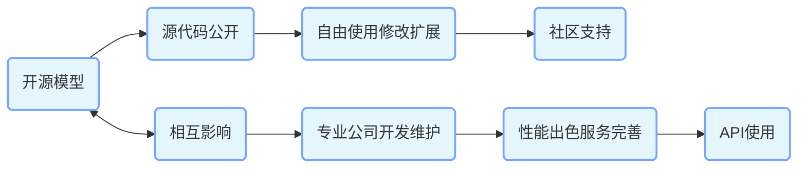

# 选择合适的LLM：开源vs商业模型的对比

> 关键词：大语言模型（LLM）、开源模型、商业模型、模型对比、模型选择

> 摘要：本文旨在深入探讨在选择大语言模型（LLM）时，开源模型与商业模型各自的特点、优势与不足。通过对核心概念、算法原理、数学模型等多方面的分析，结合实际项目案例和应用场景，为读者提供全面的对比信息，帮助其根据自身需求选择合适的LLM。同时，文章还推荐了相关的学习资源、开发工具和研究论文，最后对LLM未来的发展趋势与挑战进行了总结。

## 1. 背景介绍 
### 1.1 目的和范围
随着人工智能技术的飞速发展，大语言模型（LLM）在自然语言处理领域取得了显著的成果，被广泛应用于智能客服、文本生成、机器翻译等众多场景。然而，在选择合适的LLM时，开发者和企业面临着开源模型和商业模型的抉择。本文的目的是全面对比开源模型和商业模型的优缺点，为读者提供选择LLM的决策依据。范围涵盖了模型的核心概念、算法原理、实际应用、开发资源等多个方面。

### 1.2 预期读者
本文预期读者包括人工智能开发者、数据科学家、企业技术决策者、研究人员以及对大语言模型感兴趣的技术爱好者。无论您是正在寻找适合项目的LLM，还是希望深入了解开源和商业模型的差异，本文都将为您提供有价值的信息。

### 1.3 文档结构概述
本文将按照以下结构展开：首先介绍核心概念与联系，阐述开源模型和商业模型的定义、特点及两者之间的关系；接着详细讲解核心算法原理和具体操作步骤，并通过Python代码进行说明；然后介绍数学模型和公式，通过举例加深理解；再通过项目实战展示如何在实际开发中使用开源和商业模型；之后探讨实际应用场景；推荐相关的工具和资源；最后总结未来发展趋势与挑战，并提供常见问题解答和扩展阅读参考资料。

### 1.4 术语表
#### 1.4.1 核心术语定义
- **大语言模型（Large Language Model, LLM）**：基于大量文本数据训练得到的深度学习模型，能够处理和生成自然语言文本。
- **开源模型**：源代码公开，允许用户自由使用、修改和分发的大语言模型。
- **商业模型**：由商业公司开发和维护，通常需要付费使用的大语言模型。

#### 1.4.2 相关概念解释
- **预训练模型**：在大规模无监督数据上进行预训练的模型，学习语言的通用特征，可用于多种下游任务。
- **微调（Fine-tuning）**：在预训练模型的基础上，使用特定任务的有监督数据对模型进行进一步训练，以适应具体任务的需求。

#### 1.4.3 缩略词列表
- **LLM**：Large Language Model（大语言模型）
- **API**：Application Programming Interface（应用程序编程接口）

## 2. 核心概念与联系 

### 开源模型
开源模型的最大特点是源代码公开，这使得开发者可以自由查看、修改和扩展模型。常见的开源模型如GPT - Neo、Llama等。开源模型的优势在于其灵活性和可定制性，开发者可以根据自己的需求对模型进行调整。同时，开源社区的支持也为模型的发展提供了动力，开发者可以共享代码、交流经验。

### 商业模型
商业模型通常由专业的科技公司开发和维护，如OpenAI的GPT系列、Google的PaLM等。商业模型的优势在于其经过了大量的优化和测试，性能通常较为出色。此外，商业公司还提供了完善的技术支持和服务，用户可以通过API方便地使用模型。

### 两者的联系
开源模型和商业模型并不是完全对立的。商业模型的发展可以为开源模型提供思路和借鉴，而开源模型的研究成果也可能被商业公司吸收和应用。例如，一些商业公司会基于开源模型进行改进和优化，开发出更强大的商业模型。

### 文本示意图
```plaintext
开源模型：源代码公开 -> 自由使用、修改、扩展 -> 社区支持
          |
          | 相互影响
          |
商业模型：专业公司开发维护 -> 性能出色、服务完善 -> API使用
```

### Mermaid流程图


## 3. 核心算法原理 & 具体操作步骤 

### 核心算法原理
目前大多数大语言模型都基于Transformer架构。Transformer架构的核心是自注意力机制（Self - Attention），它能够捕捉输入序列中不同位置之间的依赖关系。以下是自注意力机制的Python代码实现：

```python
import torch
import torch.nn as nn

class SelfAttention(nn.Module):
    def __init__(self, input_dim, output_dim):
        super(SelfAttention, self).__init__()
        self.query = nn.Linear(input_dim, output_dim)
        self.key = nn.Linear(input_dim, output_dim)
        self.value = nn.Linear(input_dim, output_dim)
        self.softmax = nn.Softmax(dim=-1)

    def forward(self, x):
        Q = self.query(x)
        K = self.key(x)
        V = self.value(x)
        attn_scores = torch.matmul(Q, K.transpose(-2, -1))
        attn_probs = self.softmax(attn_scores)
        output = torch.matmul(attn_probs, V)
        return output

# 示例使用
input_dim = 128
output_dim = 64
input_tensor = torch.randn(32, 10, input_dim)  # 批次大小32，序列长度10，输入维度128
attention_layer = SelfAttention(input_dim, output_dim)
output = attention_layer(input_tensor)
print(output.shape)  # 输出形状应该是(32, 10, 64)
```

### 具体操作步骤
#### 开源模型操作步骤
1. **选择模型**：根据项目需求和计算资源，选择合适的开源模型，如Hugging Face的Transformers库中提供了丰富的开源模型。
2. **安装依赖**：安装必要的库，如`transformers`、`torch`等。
3. **加载模型**：使用库提供的接口加载预训练模型。
4. **微调模型（可选）**：如果需要适应特定任务，可以使用自己的数据对模型进行微调。
5. **使用模型**：将输入文本传递给模型，得到输出结果。

#### 商业模型操作步骤
1. **注册并获取API密钥**：在商业模型提供商的网站上注册账号，获取API密钥。
2. **安装SDK（可选）**：一些商业模型提供了SDK，方便用户调用API。
3. **调用API**：使用API密钥和SDK或HTTP请求调用商业模型的API，传递输入文本并获取输出结果。

以下是使用Hugging Face的开源模型进行文本生成的示例代码：

```python
from transformers import GPT2LMHeadModel, GPT2Tokenizer

# 加载预训练的模型和分词器
tokenizer = GPT2Tokenizer.from_pretrained('gpt2')
model = GPT2LMHeadModel.from_pretrained('gpt2')

# 输入文本
input_text = "Once upon a time"
input_ids = tokenizer.encode(input_text, return_tensors='pt')

# 生成文本
output = model.generate(input_ids, max_length=50, num_beams=5, no_repeat_ngram_size=2, early_stopping=True)

# 解码输出
generated_text = tokenizer.decode(output[0], skip_special_tokens=True)
print(generated_text)
```

## 4. 数学模型和公式 & 详细讲解 & 举例说明 

### 自注意力机制的数学模型
自注意力机制的核心是计算注意力分数，然后根据分数对值进行加权求和。具体公式如下：

$$Attention(Q, K, V) = softmax(\frac{QK^T}{\sqrt{d_k}})V$$

其中，$Q$ 是查询矩阵，$K$ 是键矩阵，$V$ 是值矩阵，$d_k$ 是键向量的维度。除以 $\sqrt{d_k}$ 是为了防止点积结果过大，导致softmax函数的梯度消失。

### 详细讲解
1. **计算查询、键和值**：对于输入序列 $X = [x_1, x_2,..., x_n]$，通过线性变换得到查询矩阵 $Q$、键矩阵 $K$ 和值矩阵 $V$：
   - $Q = XW_Q$
   - $K = XW_K$
   - $V = XW_V$
   其中，$W_Q$、$W_K$ 和 $W_V$ 是可学习的权重矩阵。
2. **计算注意力分数**：计算查询和键的点积，得到注意力分数矩阵 $S$：
   - $S = QK^T$
3. **缩放和归一化**：为了防止点积结果过大，将 $S$ 除以 $\sqrt{d_k}$，然后通过softmax函数进行归一化，得到注意力概率矩阵 $P$：
   - $P = softmax(\frac{S}{\sqrt{d_k}})$
4. **加权求和**：将注意力概率矩阵 $P$ 与值矩阵 $V$ 相乘，得到最终的输出 $O$：
   - $O = PV$

### 举例说明
假设输入序列 $X$ 是一个长度为3的向量序列，每个向量的维度为4，即 $X \in \mathbb{R}^{3 \times 4}$。查询、键和值的维度都为2，即 $d_k = d_q = d_v = 2$。

```python
import torch

# 输入序列
X = torch.tensor([[1, 2, 3, 4], [5, 6, 7, 8], [9, 10, 11, 12]], dtype=torch.float32)

# 定义权重矩阵
W_Q = torch.tensor([[0.1, 0.2], [0.3, 0.4], [0.5, 0.6], [0.7, 0.8]], dtype=torch.float32)
W_K = torch.tensor([[0.9, 1.0], [1.1, 1.2], [1.3, 1.4], [1.5, 1.6]], dtype=torch.float32)
W_V = torch.tensor([[1.7, 1.8], [1.9, 2.0], [2.1, 2.2], [2.3, 2.4]], dtype=torch.float32)

# 计算查询、键和值
Q = torch.matmul(X, W_Q)
K = torch.matmul(X, W_K)
V = torch.matmul(X, W_V)

# 计算注意力分数
S = torch.matmul(Q, K.transpose(-2, -1))

# 缩放
d_k = 2
S_scaled = S / torch.sqrt(torch.tensor(d_k, dtype=torch.float32))

# 归一化
P = torch.softmax(S_scaled, dim=-1)

# 加权求和
O = torch.matmul(P, V)

print("输出结果:", O)
```

## 5. 项目实战：代码实际案例和详细解释说明 

### 5.1  开发环境搭建
#### 开源模型开发环境
- **安装Python**：建议使用Python 3.7及以上版本。
- **安装必要的库**：使用`pip`安装`transformers`、`torch`等库：
```bash
pip install transformers torch
```

#### 商业模型开发环境
以OpenAI的GPT - 3为例：
- **注册OpenAI账号**：访问OpenAI官方网站，注册账号并获取API密钥。
- **安装OpenAI Python库**：
```bash
pip install openai
```

### 5.2  源代码详细实现和代码解读
#### 开源模型示例：文本分类
```python
from transformers import AutoTokenizer, AutoModelForSequenceClassification
import torch

# 加载预训练的分词器和模型
tokenizer = AutoTokenizer.from_pretrained('distilbert-base-uncased-finetuned-sst-2-english')
model = AutoModelForSequenceClassification.from_pretrained('distilbert-base-uncased-finetuned-sst-2-english')

# 输入文本
text = "This movie is really great!"

# 分词
inputs = tokenizer(text, return_tensors='pt')

# 模型推理
with torch.no_grad():
    outputs = model(**inputs)

# 获取预测结果
logits = outputs.logits
predicted_class_id = logits.argmax().item()
label = model.config.id2label[predicted_class_id]

print("预测标签:", label)
```
**代码解读**：
1. **加载分词器和模型**：使用`AutoTokenizer`和`AutoModelForSequenceClassification`从Hugging Face的模型库中加载预训练的分词器和文本分类模型。
2. **分词**：使用分词器将输入文本转换为模型可以接受的输入格式。
3. **模型推理**：在不计算梯度的情况下，将输入传递给模型，得到输出。
4. **获取预测结果**：从模型的输出中获取logits，然后通过`argmax`函数找到预测的类别ID，最后根据模型的配置将ID转换为标签。

#### 商业模型示例：使用OpenAI GPT - 3进行文本生成
```python
import openai

# 设置API密钥
openai.api_key = "YOUR_API_KEY"

# 输入文本
prompt = "Write a short story about a robot."

# 调用API
response = openai.Completion.create(
    engine="text-davinci-003",
    prompt=prompt,
    max_tokens=100,
    temperature=0.7
)

# 获取生成的文本
generated_text = response.choices[0].text.strip()
print("生成的文本:", generated_text)
```
**代码解读**：
1. **设置API密钥**：将从OpenAI获取的API密钥设置为`openai.api_key`。
2. **输入文本**：定义一个提示文本，用于引导模型生成文本。
3. **调用API**：使用`openai.Completion.create`方法调用GPT - 3的API，设置引擎、提示文本、最大生成的令牌数和温度等参数。
4. **获取生成的文本**：从API的响应中提取生成的文本并去除首尾空格。

### 5.3  代码解读与分析
#### 开源模型
- **优点**：代码灵活性高，开发者可以根据需要对模型进行修改和扩展。同时，开源模型的训练和推理过程完全透明，便于调试和优化。
- **缺点**：需要一定的技术能力和计算资源来进行模型的训练和微调。

#### 商业模型
- **优点**：使用方便，只需调用API即可使用强大的模型，无需关心模型的训练和部署。同时，商业公司提供了完善的技术支持和服务。
- **缺点**：成本较高，尤其是在大规模使用时。此外，商业模型的内部实现不透明，开发者无法对模型进行深度定制。

## 6. 实际应用场景 
### 开源模型应用场景
- **学术研究**：开源模型为研究人员提供了一个开放的平台，便于进行新算法和技术的研究和验证。
- **个性化定制**：开发者可以根据自己的需求对开源模型进行微调，实现个性化的自然语言处理任务，如特定领域的文本分类、情感分析等。
- **教育学习**：开源模型的代码和文档可以作为教学资源，帮助学生学习和理解大语言模型的原理和实现。

### 商业模型应用场景
- **企业级应用**：商业模型的高性能和稳定性使其非常适合企业级应用，如智能客服、智能写作助手等。
- **快速开发**：对于需要快速上线的项目，使用商业模型的API可以大大缩短开发周期。
- **数据安全和合规**：一些商业模型提供商提供了严格的数据安全和合规保障，适合对数据安全要求较高的行业。

## 7. 工具和资源推荐
### 7.1 学习资源推荐
#### 7.1.1 书籍推荐
- 《深度学习》（Deep Learning）：由Ian Goodfellow、Yoshua Bengio和Aaron Courville所著，是深度学习领域的经典教材。
- 《自然语言处理入门》（Natural Language Processing with Python）：介绍了使用Python进行自然语言处理的基础知识和方法。
- 《Attention Is All You Need》论文对应的书籍解读：帮助读者深入理解Transformer架构和自注意力机制。

#### 7.1.2 在线课程
- Coursera上的“Natural Language Processing Specialization”：由顶尖大学的教授授课，系统地介绍了自然语言处理的各个方面。
- edX上的“Deep Learning for Natural Language Processing”：深入讲解了深度学习在自然语言处理中的应用。

#### 7.1.3 技术博客和网站
- Hugging Face博客：提供了关于大语言模型的最新研究成果和应用案例。
- Towards Data Science：有很多关于人工智能和自然语言处理的技术文章。
- OpenAI官方博客：发布了关于其商业模型的最新进展和应用。

### 7.2 开发工具框架推荐
#### 7.2.1 IDE和编辑器
- PyCharm：功能强大的Python集成开发环境，适合开发和调试Python代码。
- Jupyter Notebook：交互式的开发环境，便于进行代码的测试和演示。

#### 7.2.2 调试和性能分析工具
- TensorBoard：用于可视化深度学习模型的训练过程和性能指标。
- PyTorch Profiler：帮助开发者分析PyTorch模型的性能瓶颈。

#### 7.2.3 相关框架和库
- Hugging Face Transformers：提供了丰富的预训练模型和工具，方便开发者进行自然语言处理任务。
- AllenNLP：用于构建和训练自然语言处理模型的深度学习框架。

### 7.3 相关论文著作推荐
#### 7.3.1 经典论文
- “Attention Is All You Need”：提出了Transformer架构，是大语言模型的基础。
- “BERT: Pre-training of Deep Bidirectional Transformers for Language Understanding”：介绍了BERT模型，开启了预训练语言模型的新时代。

#### 7.3.2 最新研究成果
- 关注arXiv.org上关于大语言模型的最新论文，了解行业的前沿研究动态。

#### 7.3.3 应用案例分析
- 一些知名企业和研究机构会发布关于大语言模型应用的案例分析报告，可以从中学习到实际应用中的经验和技巧。

## 8. 总结：未来发展趋势与挑战
### 未来发展趋势
- **模型融合**：开源模型和商业模型可能会相互融合，开发者可以结合两者的优势，实现更强大的自然语言处理系统。
- **多模态融合**：大语言模型将与图像、音频等多模态数据进行融合，实现更丰富的交互和应用。
- **个性化和可解释性**：未来的大语言模型将更加注重个性化服务和可解释性，满足不同用户的需求。

### 挑战
- **计算资源需求**：训练和运行大语言模型需要大量的计算资源，如何降低计算成本是一个挑战。
- **数据隐私和安全**：随着大语言模型的广泛应用，数据隐私和安全问题日益突出，需要加强保护措施。
- **伦理和社会影响**：大语言模型可能会对社会产生一些负面影响，如虚假信息传播、就业结构变化等，需要制定相应的伦理准则和政策。

## 9. 附录：常见问题与解答
### 开源模型和商业模型哪个性能更好？
这取决于具体的应用场景和需求。商业模型通常经过了大量的优化和测试，在通用任务上可能表现更好。但开源模型可以根据特定任务进行微调，在某些特定领域可能会有更好的性能。

### 使用商业模型需要注意什么？
需要注意API的使用规则和费用，确保数据的安全和合规。同时，要了解商业模型的更新和维护情况，以便及时获得更好的服务。

### 如何选择适合自己的开源模型？
可以根据模型的规模、性能、适用任务等因素进行选择。Hugging Face的模型库提供了丰富的模型选择和评估指标，可以作为参考。

## 10. 扩展阅读 & 参考资料
- Hugging Face官方文档：https://huggingface.co/docs
- OpenAI官方文档：https://platform.openai.com/docs
- 《深度学习》书籍：https://www.deeplearningbook.org/

作者：AI天才研究院/AI Genius Institute & 禅与计算机程序设计艺术 /Zen And The Art of Computer Programming