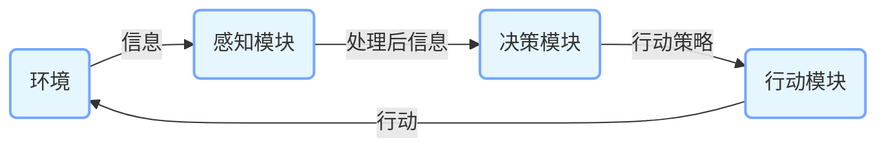

# 选择适合的技术栈：构建高效AI Agent

> 关键词：AI Agent、技术栈、高效构建、算法原理、实际应用

> 摘要：本文聚焦于如何选择适合的技术栈来构建高效的AI Agent。首先介绍了构建AI Agent的背景信息，包括目的、预期读者、文档结构和相关术语。接着深入探讨了AI Agent的核心概念、联系、算法原理以及数学模型。通过实际的项目实战案例，详细解释了代码的实现和解读。分析了AI Agent的实际应用场景，并推荐了相关的学习资源、开发工具框架和论文著作。最后总结了未来发展趋势与挑战，还提供了常见问题解答和扩展阅读参考资料，旨在为开发者在构建高效AI Agent时提供全面的指导。

## 1. 背景介绍 
### 1.1 目的和范围
在当今数字化时代，AI Agent的应用越来越广泛，从智能客服到自主机器人，都离不开高效的AI Agent。本文章的目的是帮助开发者理解如何选择合适的技术栈来构建高效的AI Agent。我们将涵盖从基础概念到实际项目开发的各个方面，包括核心算法原理、数学模型、代码实现以及实际应用场景等。

### 1.2 预期读者
本文预期读者包括AI开发者、软件工程师、数据科学家以及对AI Agent开发感兴趣的技术爱好者。无论你是初学者还是有一定经验的专业人士，都能从本文中获取有价值的信息。

### 1.3 文档结构概述
本文将按照以下结构进行组织：首先介绍相关背景知识，包括术语和核心概念；然后详细讲解核心算法原理和具体操作步骤，并给出数学模型和公式；接着通过项目实战案例展示如何使用所选技术栈构建AI Agent；之后分析实际应用场景；再推荐相关的学习资源、开发工具框架和论文著作；最后总结未来发展趋势与挑战，并提供常见问题解答和扩展阅读参考资料。

### 1.4 术语表
#### 1.4.1 核心术语定义
- **AI Agent**：人工智能代理，是一种能够感知环境、做出决策并采取行动以实现特定目标的软件或硬件实体。
- **技术栈**：指构建软件系统所使用的一系列技术和工具的集合，包括编程语言、框架、库等。
- **强化学习**：一种机器学习方法，通过智能体与环境进行交互，根据环境反馈的奖励信号来学习最优策略。
- **自然语言处理（NLP）**：研究如何让计算机理解和处理人类语言的技术领域。

#### 1.4.2 相关概念解释
- **感知**：AI Agent通过各种传感器（如摄像头、麦克风等）收集环境信息的过程。
- **决策**：根据感知到的信息，AI Agent使用特定的算法和模型来选择最优的行动方案。
- **行动**：AI Agent根据决策结果在环境中执行相应的操作。

#### 1.4.3 缩略词列表
- **NLP**：Natural Language Processing（自然语言处理）
- **RL**：Reinforcement Learning（强化学习）
- **ML**：Machine Learning（机器学习）

## 2. 核心概念与联系 

### 核心概念原理
AI Agent的核心概念基于智能体理论，它由三个主要部分组成：感知模块、决策模块和行动模块。感知模块负责收集环境信息，决策模块根据这些信息制定行动策略，行动模块则将策略转化为实际行动。

例如，在一个智能客服AI Agent中，感知模块可以通过聊天窗口获取用户输入的文本信息；决策模块使用自然语言处理技术理解用户意图，并根据预设的规则或机器学习模型生成回复策略；行动模块将回复信息显示在聊天窗口中。

### 架构的文本示意图
```plaintext
+---------------------+
|     环境 (Environment)     |
+---------------------+
         ^       |
         |       v
+---------------------+
|    感知模块 (Perception)   |
+---------------------+
         |
         v
+---------------------+
|    决策模块 (Decision)    |
+---------------------+
         |
         v
+---------------------+
|    行动模块 (Action)     |
+---------------------+
         |
         v
+---------------------+
|     环境 (Environment)     |
+---------------------+
```

### Mermaid流程图


## 3. 核心算法原理 & 具体操作步骤 

### 核心算法原理
在构建AI Agent时，常用的算法包括强化学习算法（如Q - learning、Deep Q - Network等）和自然语言处理算法（如词嵌入、循环神经网络等）。下面以Q - learning算法为例进行详细讲解。

Q - learning是一种无模型的强化学习算法，它通过学习一个动作价值函数 $Q(s, a)$ 来找到最优策略。其中，$s$ 表示环境状态，$a$ 表示采取的行动。$Q(s, a)$ 表示在状态 $s$ 下采取行动 $a$ 的预期累积奖励。

Q - learning的更新公式为：
$$Q(s_t, a_t) \leftarrow Q(s_t, a_t) + \alpha [r_{t+1} + \gamma \max_{a} Q(s_{t+1}, a) - Q(s_t, a_t)]$$

其中，$\alpha$ 是学习率，控制每次更新的步长；$\gamma$ 是折扣因子，用于权衡当前奖励和未来奖励；$r_{t+1}$ 是在状态 $s_t$ 采取行动 $a_t$ 后获得的即时奖励。

### 具体操作步骤
以下是使用Python实现Q - learning算法的具体步骤：

```python
import numpy as np

# 定义环境参数
num_states = 5
num_actions = 2
alpha = 0.1
gamma = 0.9
epsilon = 0.1
num_episodes = 1000

# 初始化Q表
Q = np.zeros((num_states, num_actions))

# 定义环境转移函数和奖励函数
def get_next_state_and_reward(state, action):
    # 这里简单模拟环境转移和奖励
    if action == 0:
        next_state = (state + 1) % num_states
        reward = 1 if next_state == 3 else 0
    else:
        next_state = (state - 1) % num_states
        reward = 1 if next_state == 3 else 0
    return next_state, reward

# Q - learning算法主循环
for episode in range(num_episodes):
    state = np.random.randint(0, num_states)
    done = False
    while not done:
        # epsilon - greedy策略选择行动
        if np.random.uniform(0, 1) < epsilon:
            action = np.random.randint(0, num_actions)
        else:
            action = np.argmax(Q[state, :])
        
        # 获取下一个状态和奖励
        next_state, reward = get_next_state_and_reward(state, action)
        
        # 更新Q表
        Q[state, action] = Q[state, action] + alpha * (reward + gamma * np.max(Q[next_state, :]) - Q[state, action])
        
        state = next_state
        
        # 简单结束条件
        if state == 3:
            done = True

print("最终的Q表:")
print(Q)
```

### 代码解释
1. **环境参数定义**：定义了状态数量、行动数量、学习率、折扣因子、探索率和训练回合数。
2. **Q表初始化**：使用 `np.zeros` 函数初始化Q表，初始值都为0。
3. **环境转移和奖励函数**：`get_next_state_and_reward` 函数模拟了环境的转移和奖励机制。
4. **Q - learning主循环**：在每个回合中，使用epsilon - greedy策略选择行动，根据环境反馈更新Q表，直到达到结束条件。

## 4. 数学模型和公式 & 详细讲解 & 举例说明 

### Q - learning数学模型
Q - learning的核心是学习动作价值函数 $Q(s, a)$。其目标是找到一个最优策略 $\pi^*$，使得在任意状态 $s$ 下采取的行动 $a$ 能够最大化长期累积奖励。

### 公式详细讲解
- **Q值更新公式**：
  $$Q(s_t, a_t) \leftarrow Q(s_t, a_t) + \alpha [r_{t+1} + \gamma \max_{a} Q(s_{t+1}, a) - Q(s_t, a_t)]$$
  - $Q(s_t, a_t)$：当前状态 $s_t$ 下采取行动 $a_t$ 的Q值。
  - $\alpha$：学习率，取值范围为 $(0, 1]$，控制每次更新的步长。$\alpha$ 越大，更新越快，但可能会导致不稳定；$\alpha$ 越小，更新越慢，但更稳定。
  - $r_{t+1}$：在状态 $s_t$ 采取行动 $a_t$ 后获得的即时奖励。
  - $\gamma$：折扣因子，取值范围为 $[0, 1]$，用于权衡当前奖励和未来奖励。$\gamma$ 越接近1，越看重未来奖励；$\gamma$ 越接近0，越看重当前奖励。
  - $\max_{a} Q(s_{t+1}, a)$：下一个状态 $s_{t+1}$ 下所有可能行动的最大Q值。

### 举例说明
假设我们有一个简单的网格世界环境，智能体可以在网格中上下左右移动。每个网格代表一个状态，智能体的行动是上下左右移动。当智能体移动到目标网格时，获得奖励1，否则获得奖励0。

初始时，Q表中的所有值都为0。假设智能体在状态 $s_1$ 采取行动 $a_1$ 移动到状态 $s_2$，获得即时奖励 $r_2 = 0$。此时，根据Q - learning更新公式，更新 $Q(s_1, a_1)$ 的值。随着训练的进行，Q表中的值会逐渐收敛到最优值，智能体也能学习到最优策略。

## 5. 项目实战：代码实际案例和详细解释说明 

### 5.1  开发环境搭建
#### 操作系统
可以选择Windows、Linux或macOS等主流操作系统。

#### 编程语言
Python是构建AI Agent的首选语言，因为它有丰富的机器学习和深度学习库。

#### 库和框架
- **NumPy**：用于数值计算和数组操作。
- **Pandas**：用于数据处理和分析。
- **Scikit - learn**：提供了多种机器学习算法和工具。
- **TensorFlow** 或 **PyTorch**：用于深度学习模型的开发。

安装命令如下：
```bash
pip install numpy pandas scikit-learn tensorflow
```

### 5.2  源代码详细实现和代码解读
我们以一个简单的智能聊天机器人AI Agent为例进行代码实现。

```python
import numpy as np
from sklearn.feature_extraction.text import TfidfVectorizer
from sklearn.metrics.pairwise import cosine_similarity

# 训练数据
questions = [
    "你好",
    "今天天气怎么样",
    "你会做什么"
]

answers = [
    "你好！有什么可以帮助你的？",
    "我还没办法获取实时天气信息呢。",
    "我可以陪你聊天，回答一些常见问题。"
]

# 文本向量化
vectorizer = TfidfVectorizer()
question_vectors = vectorizer.fit_transform(questions)

def get_response(user_input):
    user_vector = vectorizer.transform([user_input])
    similarities = cosine_similarity(user_vector, question_vectors)
    best_match_index = np.argmax(similarities)
    return answers[best_match_index]

# 测试
user_input = "你好"
response = get_response(user_input)
print("用户输入:", user_input)
print("机器人回复:", response)
```

### 5.3  代码解读与分析
1. **数据准备**：定义了一组问题和对应的答案作为训练数据。
2. **文本向量化**：使用 `TfidfVectorizer` 将文本转换为向量表示。TF - IDF（词频 - 逆文档频率）是一种常用的文本特征提取方法，它可以衡量一个词在文档中的重要性。
3. **相似度计算**：使用 `cosine_similarity` 计算用户输入和训练问题之间的余弦相似度，找到最匹配的问题。
4. **回复生成**：根据最匹配问题的索引，从答案列表中选择对应的回复。

## 6. 实际应用场景 
### 智能客服
AI Agent可以自动回答用户的常见问题，提供24/7的服务，提高客户满意度和服务效率。例如，电商平台的客服机器人可以快速解答用户关于商品信息、订单状态等问题。

### 智能家居控制
AI Agent可以与智能家居设备进行交互，根据用户的语音指令控制灯光、温度、窗帘等设备。例如，用户可以说“打开客厅的灯”，AI Agent会将指令发送给相应的智能设备。

### 自主机器人
在工业、物流等领域，AI Agent可以控制自主机器人完成各种任务，如货物搬运、巡逻等。机器人通过感知环境信息，做出决策并执行相应的行动。

### 金融领域
AI Agent可以用于风险评估、投资建议等。例如，分析市场数据和用户的财务状况，为用户提供个性化的投资方案。

## 7. 工具和资源推荐
### 7.1 学习资源推荐
#### 7.1.1 书籍推荐
- 《人工智能：一种现代的方法》：全面介绍了人工智能的各个领域，包括搜索算法、机器学习、自然语言处理等。
- 《强化学习：原理与Python实现》：详细讲解了强化学习的理论和实践，通过Python代码实现了多种强化学习算法。
- 《Python自然语言处理》：介绍了使用Python进行自然语言处理的技术和方法，包括文本分类、情感分析等。

#### 7.1.2 在线课程
- Coursera上的“机器学习”课程：由Andrew Ng教授授课，是机器学习领域的经典课程。
- edX上的“强化学习基础”课程：系统介绍了强化学习的基本概念和算法。
- Udemy上的“自然语言处理实战”课程：通过实际项目让学员掌握自然语言处理的技能。

#### 7.1.3 技术博客和网站
- Medium：有很多AI领域的优秀博客文章，涵盖了最新的研究成果和实践经验。
- Towards Data Science：专注于数据科学和人工智能领域的技术分享。
- arXiv：提供了大量的学术论文，是了解最新研究动态的重要平台。

### 7.2 开发工具框架推荐
#### 7.2.1 IDE和编辑器
- PyCharm：功能强大的Python集成开发环境，提供了代码编辑、调试、版本控制等功能。
- Jupyter Notebook：交互式的开发环境，适合数据探索和模型开发，支持代码、文本和可视化的混合展示。
- Visual Studio Code：轻量级的代码编辑器，支持多种编程语言和插件扩展。

#### 7.2.2 调试和性能分析工具
- TensorBoard：TensorFlow的可视化工具，可以用于查看模型训练过程中的各种指标，如损失函数、准确率等。
- Py-Spy：用于分析Python程序的性能瓶颈，找出耗时的函数和代码段。
- Memory Profiler：可以分析Python程序的内存使用情况，帮助优化内存性能。

#### 7.2.3 相关框架和库
- OpenAI Gym：提供了各种强化学习环境，方便开发者进行算法测试和验证。
- NLTK：自然语言处理工具包，包含了多种文本处理的工具和数据集。
- SpaCy：高效的自然语言处理库，提供了快速的文本处理和实体识别功能。

### 7.3 相关论文著作推荐
#### 7.3.1 经典论文
- “Q - learning”：由Watkins和Dayan发表，首次提出了Q - learning算法，是强化学习领域的经典论文。
- “Attention Is All You Need”：提出了Transformer架构，在自然语言处理和计算机视觉领域取得了巨大成功。
- “Deep Q - Networks”：将深度学习与Q - learning相结合，提出了深度Q网络（DQN）算法，开启了深度强化学习的时代。

#### 7.3.2 最新研究成果
可以关注arXiv上的最新论文，如关于多智能体强化学习、元学习等领域的研究。

#### 7.3.3 应用案例分析
- 《AI in Business》：介绍了人工智能在商业领域的应用案例和实践经验。
- 《Autonomous Agents and Multi - Agent Systems》：涵盖了自主智能体和多智能体系统的研究和应用案例。

## 8. 总结：未来发展趋势与挑战
### 未来发展趋势
- **多智能体协作**：未来的AI Agent将不再是孤立的个体，而是多个智能体之间进行协作，共同完成复杂的任务。例如，在智能交通系统中，多个自动驾驶车辆之间可以进行信息共享和协作，提高交通效率和安全性。
- **与物联网融合**：AI Agent将与物联网设备深度融合，实现更智能的环境感知和控制。例如，智能家居系统可以根据用户的习惯和环境变化自动调整设备状态。
- **可解释性AI**：随着AI Agent在医疗、金融等关键领域的应用越来越广泛，对其决策过程的可解释性要求也越来越高。未来的研究将致力于开发可解释的AI算法和模型。

### 挑战
- **数据隐私和安全**：AI Agent需要大量的数据进行训练和学习，如何保护数据的隐私和安全是一个重要的挑战。例如，在智能医疗领域，患者的个人健康数据需要得到严格的保护。
- **算法复杂度和计算资源**：一些复杂的AI算法需要大量的计算资源和时间，如何优化算法和提高计算效率是亟待解决的问题。
- **伦理和法律问题**：AI Agent的决策可能会对人类产生影响，如何制定相应的伦理和法律规范是一个重要的课题。例如，自动驾驶汽车在面临道德困境时应该如何决策。

## 9. 附录：常见问题与解答
### 如何选择合适的技术栈？
选择合适的技术栈需要考虑多个因素，如项目的需求、复杂度、开发团队的技术水平等。如果项目涉及到深度学习，建议选择TensorFlow或PyTorch等框架；如果是简单的机器学习任务，可以使用Scikit - learn。

### AI Agent和传统程序有什么区别？
AI Agent具有自主学习和决策的能力，能够根据环境的变化动态调整自己的行为。而传统程序通常是按照预设的规则执行任务，缺乏灵活性和适应性。

### 如何评估AI Agent的性能？
可以使用多种指标来评估AI Agent的性能，如准确率、召回率、F1值、平均奖励等。具体的评估指标需要根据项目的目标和任务来选择。

## 10. 扩展阅读 & 参考资料
- Sutton, R. S., & Barto, A. G. (2018). Reinforcement learning: An introduction. MIT press.
- Jurafsky, D., & Martin, J. H. (2021). Speech and language processing. Pearson.
- Goodfellow, I. J., Bengio, Y., & Courville, A. (2016). Deep learning. MIT press.

作者：AI天才研究院/AI Genius Institute & 禅与计算机程序设计艺术 /Zen And The Art of Computer Programming