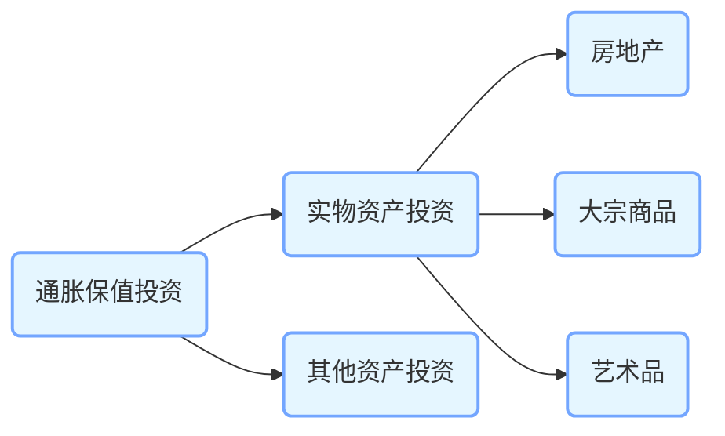

# 通胀保值投资：实物资产在投资组合中的角色

> 关键词：通胀保值投资、实物资产、投资组合、资产配置、通货膨胀

> 摘要：本文深入探讨了通胀保值投资中实物资产在投资组合里所扮演的角色。通过详细介绍相关核心概念、算法原理、数学模型，结合实际案例分析实物资产如何在不同经济环境下发挥作用。同时，为读者提供了丰富的学习资源、开发工具和参考论文，帮助读者全面了解实物资产投资。最后，对实物资产投资的未来发展趋势和挑战进行了总结，并解答了常见问题。

## 1. 背景介绍 
### 1.1 目的和范围
在经济环境中，通货膨胀是一个不可忽视的因素，它会对投资的实际收益产生重大影响。投资者需要寻找有效的方法来保值增值，以应对通货膨胀带来的资产缩水风险。实物资产作为一种重要的投资类别，具有独特的属性，在通胀保值投资中可能发挥关键作用。本文的目的就是深入研究实物资产在投资组合中的角色，分析其对投资组合的影响，以及如何合理配置实物资产以实现通胀保值的目标。

### 1.2 预期读者
本文主要面向对投资领域感兴趣，尤其是关注通胀保值投资的投资者、金融从业者、研究人员以及对资产配置有一定了解并希望深入学习的人群。

### 1.3 文档结构概述
本文首先介绍相关核心概念，明确实物资产和通胀保值投资的内涵以及它们之间的联系；接着阐述核心算法原理和具体操作步骤，通过Python代码详细说明；然后给出数学模型和公式，并结合实际例子进行讲解；之后通过项目实战展示实物资产在投资组合中的具体应用；再探讨实物资产的实际应用场景；为读者推荐相关的学习资源、开发工具和论文著作；最后总结实物资产投资的未来发展趋势和挑战，解答常见问题，并提供扩展阅读和参考资料。

### 1.4 术语表
#### 1.4.1 核心术语定义
- **通胀保值投资**：指投资者为了抵御通货膨胀对资产价值的侵蚀，通过合理的资产配置和投资策略，使投资组合的实际价值在通货膨胀环境下保持稳定或增长的投资方式。
- **实物资产**：是指具有实物形态的资产，如房地产、大宗商品（黄金、石油等）、艺术品等。这些资产通常具有一定的内在价值，其价值可能会随着经济环境和市场供求关系的变化而波动。
- **投资组合**：是由多种不同资产组成的集合，投资者通过将资金分散投资于不同的资产，以降低单一资产带来的风险，并实现预期的投资目标。

#### 1.4.2 相关概念解释
- **通货膨胀**：是指在货币流通条件下，因货币供给大于货币实际需求，也即现实购买力大于产出供给，导致货币贬值，而引起的一段时间内物价持续而普遍地上涨现象。其实质是社会总需求大于社会总供给 。
- **实际收益率**：是指剔除通货膨胀因素后，投资者实际获得的收益率。计算公式为：实际收益率 = （1 + 名义收益率）/（1 + 通货膨胀率） - 1。

#### 1.4.3 缩略词列表
- **CPI**：消费者物价指数（Consumer Price Index），是反映与居民生活有关的消费品及服务价格水平的变动情况的重要宏观经济指标，通常作为衡量通货膨胀水平的重要指标。

## 2. 核心概念与联系 
### 核心概念原理
#### 实物资产的特性
实物资产具有一些独特的特性，使其在通胀保值投资中具有潜在的优势。首先，实物资产通常具有内在价值，例如房地产有居住和使用价值，黄金有工业和装饰用途等。其次，实物资产的供给相对有限，尤其是一些稀缺的资源类实物资产，如土地、稀有金属等。这种有限的供给在一定程度上能够抵御通货膨胀带来的货币贬值影响。

#### 通胀对投资的影响
通货膨胀会导致货币的购买力下降，使得投资者持有的现金和固定收益资产的实际价值降低。例如，在高通货膨胀时期，债券的固定利息收益可能无法跟上物价上涨的速度，从而导致实际收益率为负。因此，投资者需要寻找能够在通货膨胀环境下保持或增值的资产。

#### 实物资产与通胀的关系
实物资产的价格往往与通货膨胀存在一定的正相关关系。当通货膨胀发生时，物价普遍上涨，实物资产的价格也可能随之上升。例如，房地产价格通常会随着通货膨胀而上涨，因为建筑成本、土地成本等都会上升。黄金作为一种传统的避险资产，在通货膨胀时期也往往受到投资者的青睐，其价格可能会上涨以反映货币的贬值。

### 架构的文本示意图
```plaintext
                通胀保值投资
                    |
            +-------+-------+
            |               |
      实物资产投资     其他资产投资
            |
    +-------+-------+
    |       |       |
  房地产  大宗商品  艺术品
```

### Mermaid 流程图


## 3. 核心算法原理 & 具体操作步骤 
### 核心算法原理
在投资组合中配置实物资产时，我们可以使用现代投资组合理论中的均值 - 方差模型来确定最优的资产配置比例。该模型的核心思想是在给定预期收益率的情况下，通过调整资产配置比例，使投资组合的风险（方差）最小化；或者在给定风险水平的情况下，使投资组合的预期收益率最大化。

### Python 代码实现
```python
import numpy as np
import pandas as pd
from scipy.optimize import minimize

# 假设有三种资产：股票、债券和房地产，历史收益率数据
returns = pd.DataFrame({
    '股票': [0.1, 0.15, 0.08, 0.12, 0.11],
    '债券': [0.05, 0.06, 0.04, 0.05, 0.055],
    '房地产': [0.08, 0.09, 0.07, 0.085, 0.08]
})

# 计算每种资产的预期收益率和协方差矩阵
expected_returns = returns.mean()
cov_matrix = returns.cov()

# 定义目标函数：最小化投资组合的方差
def portfolio_variance(weights, cov_matrix):
    return np.dot(weights.T, np.dot(cov_matrix, weights))

# 定义约束条件：权重之和为 1
constraints = ({'type': 'eq', 'fun': lambda x: np.sum(x) - 1})

# 定义权重的取值范围：0 到 1
bounds = [(0, 1) for _ in range(len(expected_returns))]

# 初始权重猜测
initial_weights = np.ones(len(expected_returns)) / len(expected_returns)

# 最小化方差
result = minimize(portfolio_variance, initial_weights, args=(cov_matrix,),
                  method='SLSQP', bounds=bounds, constraints=constraints)

# 最优权重
optimal_weights = result.x

print("最优资产配置权重：")
for i, asset in enumerate(expected_returns.index):
    print(f"{asset}: {optimal_weights[i]:.2%}")
```
### 具体操作步骤
1. **数据收集**：收集不同资产的历史收益率数据，如股票、债券、房地产等。可以从金融数据库、财经网站等获取相关数据。
2. **计算预期收益率和协方差矩阵**：使用历史收益率数据计算每种资产的预期收益率和资产之间的协方差矩阵。预期收益率可以通过简单的算术平均值计算，协方差矩阵反映了资产之间的相关性。
3. **定义目标函数和约束条件**：目标函数是要最小化投资组合的方差，约束条件是资产权重之和为 1，且权重取值范围在 0 到 1 之间。
4. **求解最优权重**：使用优化算法（如 `scipy.optimize.minimize`）求解最优的资产配置权重。
5. **评估和调整**：根据求解得到的最优权重构建投资组合，并进行评估。如果需要，可以根据市场情况和个人投资目标对权重进行调整。

## 4. 数学模型和公式 & 详细讲解 & 举例说明 
### 均值 - 方差模型
#### 数学公式
设投资组合中有 $n$ 种资产，第 $i$ 种资产的权重为 $w_i$，预期收益率为 $r_i$，投资组合的预期收益率为 $R_p$，则：
$$R_p = \sum_{i=1}^{n} w_i r_i$$
投资组合的方差 $\sigma_p^2$ 为：
$$\sigma_p^2 = \sum_{i=1}^{n} \sum_{j=1}^{n} w_i w_j \sigma_{ij}$$
其中，$\sigma_{ij}$ 是资产 $i$ 和资产 $j$ 的协方差。

#### 详细讲解
均值 - 方差模型的目标是在给定预期收益率的情况下，找到一组权重 $w_i$ 使得投资组合的方差最小。这是一个优化问题，可以表示为：
$$\min_{w_1, w_2, \cdots, w_n} \sigma_p^2 = \sum_{i=1}^{n} \sum_{j=1}^{n} w_i w_j \sigma_{ij}$$
约束条件为：
$$\sum_{i=1}^{n} w_i = 1$$
$$0 \leq w_i \leq 1, \quad i = 1, 2, \cdots, n$$

### 举例说明
假设我们有两种资产：股票和房地产。股票的预期收益率为 $r_1 = 0.1$，方差为 $\sigma_1^2 = 0.04$；房地产的预期收益率为 $r_2 = 0.08$，方差为 $\sigma_2^2 = 0.02$；两种资产的协方差为 $\sigma_{12} = 0.01$。

设股票的权重为 $w_1$，则房地产的权重为 $w_2 = 1 - w_1$。投资组合的预期收益率为：
$$R_p = w_1 r_1 + w_2 r_2 = w_1 \times 0.1 + (1 - w_1) \times 0.08 = 0.08 + 0.02 w_1$$
投资组合的方差为：
$$\sigma_p^2 = w_1^2 \sigma_1^2 + w_2^2 \sigma_2^2 + 2 w_1 w_2 \sigma_{12}$$
$$= w_1^2 \times 0.04 + (1 - w_1)^2 \times 0.02 + 2 w_1 (1 - w_1) \times 0.01$$
为了找到最小方差的投资组合，我们对 $\sigma_p^2$ 求关于 $w_1$ 的导数，并令其等于 0：
$$\frac{d\sigma_p^2}{dw_1} = 0.08 w_1 - 0.04 (1 - w_1) + 0.02 - 0.04 w_1 = 0$$
解得 $w_1 = 0.25$，$w_2 = 0.75$。此时投资组合的预期收益率为 $R_p = 0.08 + 0.02 \times 0.25 = 0.085$，方差为 $\sigma_p^2 = 0.25^2 \times 0.04 + 0.75^2 \times 0.02 + 2 \times 0.25 \times 0.75 \times 0.01 = 0.01625$。

## 5. 项目实战：代码实际案例和详细解释说明 
### 5.1  开发环境搭建
#### 安装 Python
首先需要安装 Python 环境，建议使用 Python 3.7 及以上版本。可以从 Python 官方网站（https://www.python.org/downloads/）下载安装包，按照安装向导进行安装。

#### 安装必要的库
使用 `pip` 安装所需的库，主要包括 `numpy`、`pandas` 和 `scipy`。在命令行中执行以下命令：
```sh
pip install numpy pandas scipy
```

### 5.2  源代码详细实现和代码解读
```python
import numpy as np
import pandas as pd
from scipy.optimize import minimize

# 假设有四种资产：股票、债券、房地产和黄金，历史收益率数据
returns = pd.DataFrame({
    '股票': [0.12, 0.15, 0.09, 0.11, 0.13],
    '债券': [0.06, 0.05, 0.04, 0.055, 0.06],
    '房地产': [0.09, 0.08, 0.075, 0.085, 0.09],
    '黄金': [0.07, 0.08, 0.06, 0.075, 0.07]
})

# 计算每种资产的预期收益率和协方差矩阵
expected_returns = returns.mean()
cov_matrix = returns.cov()

# 定义目标函数：最小化投资组合的方差
def portfolio_variance(weights, cov_matrix):
    return np.dot(weights.T, np.dot(cov_matrix, weights))

# 定义约束条件：权重之和为 1
constraints = ({'type': 'eq', 'fun': lambda x: np.sum(x) - 1})

# 定义权重的取值范围：0 到 1
bounds = [(0, 1) for _ in range(len(expected_returns))]

# 初始权重猜测
initial_weights = np.ones(len(expected_returns)) / len(expected_returns)

# 最小化方差
result = minimize(portfolio_variance, initial_weights, args=(cov_matrix,),
                  method='SLSQP', bounds=bounds, constraints=constraints)

# 最优权重
optimal_weights = result.x

print("最优资产配置权重：")
for i, asset in enumerate(expected_returns.index):
    print(f"{asset}: {optimal_weights[i]:.2%}")
```
### 代码解读与分析
1. **数据定义**：使用 `pandas` 定义了四种资产（股票、债券、房地产和黄金）的历史收益率数据。
2. **计算预期收益率和协方差矩阵**：通过 `mean()` 方法计算每种资产的预期收益率，使用 `cov()` 方法计算资产之间的协方差矩阵。
3. **定义目标函数**：`portfolio_variance` 函数用于计算投资组合的方差，使用 `numpy` 的矩阵运算实现。
4. **定义约束条件和权重范围**：约束条件是资产权重之和为 1，权重范围在 0 到 1 之间。
5. **初始权重猜测**：将初始权重设置为每种资产平均分配。
6. **最小化方差**：使用 `scipy.optimize.minimize` 函数求解最优的资产配置权重。
7. **输出结果**：打印出每种资产的最优配置权重。

## 6. 实际应用场景 
### 抵御通货膨胀
在通货膨胀时期，实物资产的价格通常会随着物价上涨而上升，从而能够保持或增加投资的实际价值。例如，房地产作为一种实物资产，其价值可能会随着土地价格、建筑成本等的上升而上涨。投资者通过持有房地产，可以在一定程度上抵御通货膨胀带来的资产缩水风险。

### 分散投资风险
实物资产与其他金融资产（如股票、债券）的相关性通常较低。将实物资产纳入投资组合中，可以降低投资组合的整体风险。当股票市场下跌时，实物资产的价值可能不受影响或甚至上涨，从而平衡投资组合的收益。例如，在金融危机期间，股票市场大幅下跌，但黄金作为一种实物资产，其价格往往会上涨，起到了避险的作用。

### 长期资产增值
一些实物资产具有长期增值的潜力。例如，优质的房地产在长期内通常会随着经济的发展和人口的增长而增值。艺术品等稀缺实物资产也可能因为其独特性和稀缺性而在长期内实现价值增长。投资者可以通过长期持有这些实物资产，实现资产的增值。

### 满足消费需求
部分实物资产不仅具有投资价值，还可以满足投资者的消费需求。例如，房地产可以用于自住或出租，为投资者提供居住或租金收入。投资者可以根据自己的需求和投资目标，合理配置这类实物资产。

## 7. 工具和资源推荐
### 7.1 学习资源推荐
#### 7.1.1 书籍推荐
- 《聪明的投资者》（The Intelligent Investor）：本杰明·格雷厄姆（Benjamin Graham）著，被誉为投资界的圣经，详细介绍了价值投资的理念和方法，对实物资产投资也有一定的涉及。
- 《漫步华尔街》（A Random Walk Down Wall Street）：伯顿·马尔基尔（Burton Malkiel）著，探讨了各种投资策略和资产类别，包括实物资产，帮助读者了解如何构建合理的投资组合。
- 《房地产投资实战手册》：提供了房地产投资的详细知识和实战经验，包括市场分析、投资策略、风险管理等方面。

#### 7.1.2 在线课程
- Coursera 上的“投资学原理”课程：由知名大学教授授课，系统介绍了投资学的基本原理和方法，包括资产配置、风险管理等内容。
- edX 上的“金融市场”课程：涵盖了金融市场的各个方面，包括实物资产市场，有助于学习者深入了解投资领域。

#### 7.1.3 技术博客和网站
- 雪球网：提供了丰富的投资资讯和投资者交流平台，用户可以在上面了解实物资产投资的最新动态和其他投资者的经验分享。
- 华尔街见闻：实时更新全球金融市场的新闻和分析，包括实物资产市场的相关信息，对投资者有很大的参考价值。

### 7.2 开发工具框架推荐
#### 7.2.1 IDE和编辑器
- PyCharm：一款专业的 Python 集成开发环境，提供了丰富的代码编辑、调试和项目管理功能，适合进行投资组合分析和代码开发。
- Jupyter Notebook：一种交互式的开发环境，支持 Python 代码的编写和运行，同时可以方便地展示代码、图表和文档，非常适合进行数据分析和模型验证。

#### 7.2.2 调试和性能分析工具
- PDB：Python 自带的调试器，可以帮助开发者逐行调试代码，找出代码中的错误和问题。
- cProfile：Python 的性能分析工具，可以分析代码的运行时间和函数调用情况，帮助开发者优化代码性能。

#### 7.2.3 相关框架和库
- NumPy：用于进行高效的数值计算和数组操作，在投资组合分析中可以方便地进行矩阵运算。
- Pandas：提供了强大的数据处理和分析功能，适合处理和分析金融数据，如历史收益率数据等。
- Scipy：包含了各种科学计算和优化算法，在求解投资组合的最优权重时可以使用其优化函数。

### 7.3 相关论文著作推荐
#### 7.3.1 经典论文
- Markowitz, H. M. (1952). Portfolio Selection. The Journal of Finance, 7(1), 77 - 91. 该论文提出了现代投资组合理论的均值 - 方差模型，为投资组合分析奠定了基础。
- Fama, E. F., & French, K. R. (1992). The Cross - Section of Expected Stock Returns. The Journal of Finance, 47(2), 427 - 465. 提出了著名的 Fama - French 三因子模型，对资产定价和投资组合分析有重要影响。

#### 7.3.2 最新研究成果
- 关注顶级金融学术期刊，如 The Journal of Financial Economics、The Review of Financial Studies 等，这些期刊会发表关于实物资产投资、通胀保值投资等方面的最新研究成果。

#### 7.3.3 应用案例分析
- 可以参考一些专业的金融研究报告和案例分析，如各大投资银行发布的研究报告，了解实物资产在不同市场环境下的投资案例和策略。

## 8. 总结：未来发展趋势与挑战
### 未来发展趋势
#### 数字化和智能化
随着科技的发展，实物资产投资也将越来越数字化和智能化。例如，房地产投资可能会出现更多的数字化平台，投资者可以通过在线平台进行房产交易和管理。同时，利用人工智能和大数据技术，可以更准确地分析实物资产的市场趋势和投资价值，为投资者提供更精准的投资建议。

#### 多元化和全球化
投资者将更加注重实物资产的多元化配置，不仅会投资于国内的实物资产，还会将目光投向全球市场。例如，投资海外房地产、大宗商品等。这种多元化和全球化的投资趋势可以进一步分散风险，提高投资组合的稳定性。

#### 绿色和可持续投资
在全球关注环境保护和可持续发展的背景下，绿色和可持续的实物资产投资将成为未来的一个重要趋势。例如，投资环保型房地产、可再生能源项目等。这些投资不仅具有经济价值，还符合社会的可持续发展目标。

### 挑战
#### 市场波动和不确定性
实物资产市场也会受到各种因素的影响，如经济周期、政策变化、自然灾害等，导致市场波动和不确定性增加。投资者需要具备较强的风险管理能力，以应对市场的变化。

#### 信息不对称
实物资产市场的信息相对不透明，投资者可能难以获取准确和全面的信息。例如，房地产市场的交易信息、艺术品的真伪和价值评估等都存在一定的难度。这就需要投资者具备专业的知识和经验，或者借助专业的中介机构来获取信息。

#### 流动性风险
部分实物资产的流动性较差，如房地产、艺术品等。在需要变现时，可能需要较长的时间和较高的成本。投资者在进行实物资产投资时，需要考虑资产的流动性问题，合理安排投资组合。

## 9. 附录：常见问题与解答
### 问题 1：实物资产投资一定能抵御通货膨胀吗？
解答：实物资产投资在一定程度上可以抵御通货膨胀，但并不是绝对的。虽然实物资产的价格通常会随着通货膨胀而上涨，但也受到市场供求关系、资产本身的特性等多种因素的影响。例如，在某些特定情况下，房地产市场可能会出现供过于求的情况，导致房价下跌，即使在通货膨胀时期也无法实现保值增值。

### 问题 2：如何选择适合自己的实物资产进行投资？
解答：选择适合自己的实物资产进行投资需要考虑多个因素。首先，要根据自己的投资目标和风险承受能力来确定投资的资产类别。如果追求长期稳定的增值，可以考虑房地产等资产；如果希望在短期内获得较高的收益，可以关注大宗商品市场。其次，要了解资产的市场情况和投资前景，进行充分的市场调研和分析。最后，要结合自己的资金状况和投资经验，合理安排投资比例。

### 问题 3：实物资产投资的成本有哪些？
解答：实物资产投资的成本包括购买成本、持有成本和交易成本。购买成本是指购买实物资产所需支付的价款，如房价、艺术品的购买价格等。持有成本包括资产的维护费用、税费等，例如房地产需要支付物业费、房产税等。交易成本是指在买卖实物资产过程中产生的费用，如房地产交易的中介费、手续费等。

### 问题 4：实物资产投资与金融资产投资有什么区别？
解答：实物资产投资和金融资产投资有以下区别。首先，实物资产具有实物形态，如房地产、大宗商品等；而金融资产是一种虚拟资产，如股票、债券等。其次，实物资产的流动性相对较差，交易过程可能较为复杂；金融资产的流动性较强，可以在证券市场上快速买卖。最后，实物资产的价格波动相对较为稳定，受宏观经济环境和市场供求关系的影响较大；金融资产的价格波动较为频繁，受市场情绪和公司业绩等因素的影响较大。

## 10. 扩展阅读 & 参考资料
### 扩展阅读
- 《金融炼金术》（The Alchemy of Finance）：乔治·索罗斯（George Soros）著，探讨了金融市场的运行规律和投资者的心理因素，对投资决策有一定的启示作用。
- 《黑天鹅：如何应对不可预知的未来》（The Black Swan: The Impact of the Highly Improbable）：纳西姆·尼古拉斯·塔勒布（Nassim Nicholas Taleb）著，提醒投资者关注市场中的不确定性和极端事件，对风险管理有重要意义。

### 参考资料
- 相关金融数据库，如 Wind 数据库、Bloomberg 数据库等，提供了丰富的金融数据和市场信息。
- 政府部门发布的统计数据和政策文件，如国家统计局发布的经济数据、央行发布的货币政策等，对了解宏观经济环境和市场趋势有重要参考价值。

作者：AI天才研究院/AI Genius Institute & 禅与计算机程序设计艺术 /Zen And The Art of Computer Programming