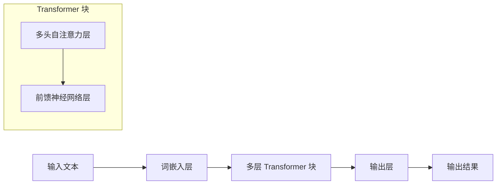

# 通过增加推理时间计算量提升大语言模型能力

> 关键词：大语言模型、推理时间、计算量、模型能力提升、性能优化

> 摘要：本文聚焦于通过增加推理时间计算量来提升大语言模型能力这一主题。首先介绍了相关背景，包括研究目的、预期读者等。接着阐述了大语言模型的核心概念与联系，详细讲解了核心算法原理及操作步骤，借助 Python 代码进行说明。还分析了其中涉及的数学模型和公式，并给出具体例子。通过项目实战展示了如何在实际中运用相关方法，包括开发环境搭建、代码实现与解读。探讨了实际应用场景，推荐了学习资源、开发工具框架以及相关论文著作。最后总结了未来发展趋势与挑战，并提供了常见问题解答和扩展阅读参考资料，旨在为提升大语言模型能力提供全面且深入的技术指导。

## 1. 背景介绍 
### 1.1 目的和范围
随着大语言模型在自然语言处理领域的广泛应用，如智能问答、文本生成、机器翻译等，提升其性能和能力成为了研究的关键方向。本研究的目的在于探索通过增加推理时间计算量这一途径来有效提升大语言模型的能力。范围涵盖了对大语言模型核心概念的理解、相关算法原理的分析、实际项目中的应用，以及对未来发展趋势的展望等多个方面。

### 1.2 预期读者
本文预期读者包括人工智能领域的研究人员、程序员、软件架构师、对大语言模型技术感兴趣的开发者，以及希望深入了解如何提升大语言模型性能的专业人士。

### 1.3 文档结构概述
本文将按照以下结构展开：首先介绍背景信息，让读者了解研究的目的和适用对象。接着阐述大语言模型的核心概念与联系，包括原理和架构。然后详细讲解核心算法原理和具体操作步骤，并用 Python 代码进行说明。随后分析数学模型和公式，并举例说明。通过项目实战展示实际应用，包括开发环境搭建、代码实现与解读。探讨实际应用场景，推荐相关学习资源、开发工具框架和论文著作。最后总结未来发展趋势与挑战，提供常见问题解答和扩展阅读参考资料。

### 1.4 术语表
#### 1.4.1 核心术语定义
- **大语言模型**：基于深度学习技术，通过在大规模文本数据上进行训练，能够处理自然语言任务的模型，如 GPT - 3、BERT 等。
- **推理时间**：模型在接收到输入后，生成输出结果所花费的时间。
- **计算量**：模型在推理过程中所进行的计算操作的数量，通常与模型的参数数量、输入数据的大小等因素有关。
- **模型能力**：模型在各种自然语言处理任务上的表现，如准确性、生成质量、泛化能力等。

#### 1.4.2 相关概念解释
- **Transformer 架构**：一种基于注意力机制的深度学习架构，广泛应用于大语言模型中，它通过多头自注意力机制能够更好地捕捉序列中的长距离依赖关系。
- **注意力机制**：一种能够让模型在处理序列数据时，动态地关注序列中不同部分的机制，使得模型能够根据输入自适应地分配注意力权重。

#### 1.4.3 缩略词列表
- **NLP**：Natural Language Processing，自然语言处理。
- **GPT**：Generative Pretrained Transformer，生成式预训练变换器。
- **BERT**：Bidirectional Encoder Representations from Transformers，基于变换器的双向编码器表示。

## 2. 核心概念与联系 

### 核心概念原理
大语言模型通常基于神经网络架构，如 Transformer 架构。Transformer 架构由编码器和解码器组成（在一些模型中可能只有编码器或解码器），其核心是多头自注意力机制。多头自注意力机制允许模型在不同的表示子空间中并行地关注输入序列的不同部分，从而更好地捕捉序列中的语义信息。

在推理过程中，模型接收输入文本，经过词嵌入层将文本转换为向量表示，然后通过多层的 Transformer 块进行特征提取和信息交互。每个 Transformer 块包含多头自注意力层和前馈神经网络层。多头自注意力层计算输入序列中每个位置与其他位置之间的注意力权重，从而得到每个位置的上下文表示。前馈神经网络层则对这些上下文表示进行非线性变换，进一步提取特征。

增加推理时间计算量的核心思想是通过增加模型的计算步骤或计算复杂度，让模型有更多的时间和资源来处理输入信息，从而提升模型的能力。例如，可以增加 Transformer 块的层数，或者增加注意力头的数量，这样模型能够进行更深入的特征提取和信息交互。

### 架构的文本示意图
```plaintext
输入文本 -> 词嵌入层 -> 多层 Transformer 块（多头自注意力层 + 前馈神经网络层） -> 输出层 -> 输出结果
```

### Mermaid 流程图


## 3. 核心算法原理 & 具体操作步骤 

### 核心算法原理
以 Transformer 架构中的多头自注意力机制为例，其核心算法原理如下：

给定输入序列 $X = [x_1, x_2, \cdots, x_n]$，其中 $x_i$ 是第 $i$ 个位置的输入向量。首先，通过线性变换将输入向量分别投影到查询（Query）、键（Key）和值（Value）空间，得到 $Q = XW^Q$，$K = XW^K$，$V = XW^V$，其中 $W^Q$，$W^K$，$W^V$ 是可学习的权重矩阵。

然后，计算注意力分数：
$$
\text{Attention}(Q, K, V) = \text{softmax}\left(\frac{QK^T}{\sqrt{d_k}}\right)V
$$
其中 $d_k$ 是查询和键向量的维度，$\text{softmax}$ 函数用于将注意力分数归一化到 $[0, 1]$ 之间。

多头自注意力机制将注意力计算在多个子空间中并行进行，然后将结果拼接起来并进行线性变换：
$$
\text{MultiHead}(Q, K, V) = \text{Concat}(\text{head}_1, \cdots, \text{head}_h)W^O
$$
其中 $\text{head}_i = \text{Attention}(QW_i^Q, KW_i^K, VW_i^V)$，$h$ 是注意力头的数量，$W_i^Q$，$W_i^K$，$W_i^V$ 和 $W^O$ 是可学习的权重矩阵。

### 具体操作步骤
以下是使用 Python 和 PyTorch 实现多头自注意力机制的代码示例：
```python
import torch
import torch.nn as nn

class MultiHeadAttention(nn.Module):
    def __init__(self, input_dim, num_heads):
        super(MultiHeadAttention, self).__init__()
        self.input_dim = input_dim
        self.num_heads = num_heads
        self.head_dim = input_dim // num_heads

        assert (
            self.head_dim * num_heads == input_dim
        ), "Input dimension must be divisible by number of heads"

        self.qkv_proj = nn.Linear(input_dim, 3 * input_dim)
        self.out_proj = nn.Linear(input_dim, input_dim)

    def forward(self, x):
        batch_size, seq_length, input_dim = x.size()
        qkv = self.qkv_proj(x)
        q, k, v = qkv.chunk(3, dim=-1)

        q = q.view(batch_size, seq_length, self.num_heads, self.head_dim).transpose(1, 2)
        k = k.view(batch_size, seq_length, self.num_heads, self.head_dim).transpose(1, 2)
        v = v.view(batch_size, seq_length, self.num_heads, self.head_dim).transpose(1, 2)

        attn_scores = torch.matmul(q, k.transpose(-2, -1)) / (self.head_dim ** 0.5)
        attn_probs = torch.softmax(attn_scores, dim=-1)
        output = torch.matmul(attn_probs, v)

        output = output.transpose(1, 2).contiguous().view(batch_size, seq_length, input_dim)
        output = self.out_proj(output)
        return output

# 示例使用
input_dim = 512
num_heads = 8
batch_size = 16
seq_length = 32
x = torch.randn(batch_size, seq_length, input_dim)
attention = MultiHeadAttention(input_dim, num_heads)
output = attention(x)
print(output.shape)
```
### 代码解释
1. **`__init__` 方法**：初始化多头自注意力模块，包括输入维度、注意力头的数量和每个头的维度。同时，定义了一个线性层 `qkv_proj` 用于将输入投影到查询、键和值空间，以及一个线性层 `out_proj` 用于将多头注意力的输出进行线性变换。
2. **`forward` 方法**：
    - 首先，将输入 `x` 通过 `qkv_proj` 线性层得到查询、键和值。
    - 然后，将查询、键和值按照头的数量进行分割，并调整维度以进行多头计算。
    - 计算注意力分数，并通过 `softmax` 函数得到注意力概率。
    - 将注意力概率与值相乘得到输出。
    - 最后，将输出的维度调整回原来的形状，并通过 `out_proj` 线性层进行变换。

## 4. 数学模型和公式 & 详细讲解 & 举例说明 

### 数学模型和公式
#### 词嵌入层
词嵌入层将输入的文本序列中的每个词转换为向量表示。假设词汇表大小为 $V$，词嵌入维度为 $d$，则词嵌入矩阵 $E \in \mathbb{R}^{V \times d}$。对于输入序列中的第 $i$ 个词 $w_i$，其词嵌入向量为 $e_i = E[w_i]$。

#### 多头自注意力机制
如前面所述，多头自注意力机制的公式为：
$$
\text{MultiHead}(Q, K, V) = \text{Concat}(\text{head}_1, \cdots, \text{head}_h)W^O
$$
其中 $\text{head}_i = \text{Attention}(QW_i^Q, KW_i^K, VW_i^V)$，$\text{Attention}(Q, K, V) = \text{softmax}\left(\frac{QK^T}{\sqrt{d_k}}\right)V$。

#### 前馈神经网络层
前馈神经网络层通常由两个线性层和一个非线性激活函数组成，其公式为：
$$
FFN(x) = \text{ReLU}(xW_1 + b_1)W_2 + b_2
$$
其中 $W_1$，$W_2$ 是权重矩阵，$b_1$，$b_2$ 是偏置向量，$\text{ReLU}$ 是激活函数。

### 详细讲解
#### 词嵌入层
词嵌入层的作用是将离散的词转换为连续的向量表示，使得模型能够更好地处理文本数据。通过学习词嵌入矩阵，模型可以捕捉到词与词之间的语义关系，例如相似的词在向量空间中距离较近。

#### 多头自注意力机制
多头自注意力机制通过在多个子空间中并行地计算注意力，能够捕捉到输入序列中不同方面的信息。不同的注意力头可以关注序列中的不同位置和特征，从而提升模型的表达能力。

#### 前馈神经网络层
前馈神经网络层对多头自注意力机制的输出进行非线性变换，进一步提取特征。非线性激活函数 $\text{ReLU}$ 引入了非线性因素，使得模型能够学习到更复杂的模式。

### 举例说明
假设输入序列为 `["I", "love", "natural", "language", "processing"]`，词汇表大小 $V = 10000$，词嵌入维度 $d = 512$。则词嵌入矩阵 $E$ 的形状为 $(10000, 512)$。对于词 `"I"`，假设其在词汇表中的索引为 $10$，则其词嵌入向量 $e_{"I"} = E[10]$，形状为 $(512,)$。

在多头自注意力机制中，假设输入序列的长度为 $n = 5$，输入维度为 $d = 512$，注意力头的数量为 $h = 8$，则每个头的维度为 $d_k = d / h = 64$。查询、键和值矩阵 $Q$，$K$，$V$ 的形状均为 $(5, 512)$。经过多头计算后，每个头的输出形状为 $(5, 64)$，拼接后的输出形状为 $(5, 512)$。

在前馈神经网络层中，假设 $W_1$ 的形状为 $(512, 2048)$，$W_2$ 的形状为 $(2048, 512)$，则输入 $x$ 的形状为 $(5, 512)$，经过 $\text{ReLU}(xW_1 + b_1)$ 后形状为 $(5, 2048)$，最终输出 $FFN(x)$ 的形状为 $(5, 512)$。

## 5. 项目实战：代码实际案例和详细解释说明 

### 5.1  开发环境搭建
#### 操作系统
推荐使用 Linux 系统，如 Ubuntu 18.04 或更高版本，因为 Linux 系统在深度学习开发中具有良好的兼容性和稳定性。

#### Python 环境
安装 Python 3.7 或更高版本，可以使用 Anaconda 来管理 Python 环境。创建一个新的虚拟环境：
```bash
conda create -n llm_env python=3.8
conda activate llm_env
```

#### 深度学习框架
安装 PyTorch，根据自己的 CUDA 版本选择合适的安装命令。例如，如果使用 CUDA 11.3：
```bash
pip install torch torchvision torchaudio --extra-index-url https://download.pytorch.org/whl/cu113
```

#### 其他依赖库
安装必要的依赖库，如 `numpy`，`transformers` 等：
```bash
pip install numpy transformers
```

### 5.2  源代码详细实现和代码解读
以下是一个使用 `transformers` 库实现文本生成任务的代码示例：
```python
from transformers import GPT2LMHeadModel, GPT2Tokenizer

# 加载预训练模型和分词器
model_name = "gpt2"
tokenizer = GPT2Tokenizer.from_pretrained(model_name)
model = GPT2LMHeadModel.from_pretrained(model_name)

# 输入文本
input_text = "Once upon a time"
input_ids = tokenizer.encode(input_text, return_tensors="pt")

# 增加推理时间计算量的方法：增加生成的长度和使用更多的解码策略
output = model.generate(
    input_ids,
    max_length=100,
    num_beams=5,
    no_repeat_ngram_size=2,
    early_stopping=True
)

# 解码输出
output_text = tokenizer.decode(output[0], skip_special_tokens=True)
print(output_text)
```
### 代码解读
1. **加载预训练模型和分词器**：使用 `transformers` 库的 `GPT2LMHeadModel` 和 `GPT2Tokenizer` 加载预训练的 GPT - 2 模型和对应的分词器。
2. **输入文本处理**：将输入文本 `input_text` 编码为模型可以接受的输入 ID 序列。
3. **增加推理时间计算量**：
    - `max_length=100`：设置生成文本的最大长度为 100，这样模型需要进行更多的计算来生成更长的文本。
    - `num_beams=5`：使用束搜索解码策略，束宽度为 5。束搜索会在每一步保留多个可能的候选路径，从而增加计算量，但可以提高生成文本的质量。
    - `no_repeat_ngram_size=2`：避免生成重复的 2 - 元组，增加了模型的约束，需要更多的计算来满足这个条件。
    - `early_stopping=True`：当生成的序列达到最大长度或满足一定条件时停止生成，提高效率。
4. **解码输出**：将模型生成的 ID 序列解码为文本，并打印输出。

### 5.3  代码解读与分析
通过增加生成的长度和使用更复杂的解码策略，我们增加了模型的推理时间计算量。束搜索解码策略通过保留多个候选路径，使得模型能够在更多的可能性中进行选择，从而生成更合理的文本。设置 `no_repeat_ngram_size` 可以避免生成重复的文本，提高生成文本的质量。然而，这些方法也会显著增加计算量和推理时间，需要根据实际情况进行权衡。

## 6. 实际应用场景 
### 智能问答系统
在智能问答系统中，通过增加推理时间计算量，可以让模型更深入地理解问题，从大量的知识源中搜索和整合信息，从而给出更准确、详细的回答。例如，在医疗问答系统中，模型需要对复杂的医学问题进行分析，参考大量的医学文献和病例，增加计算量可以提高回答的质量和可靠性。

### 文本生成任务
对于文本生成任务，如故事创作、诗歌生成等，增加推理时间计算量可以让模型生成更富有创意、逻辑连贯的文本。模型可以进行更多的尝试和探索，生成不同的文本片段，并进行筛选和组合，从而得到更优质的文本作品。

### 机器翻译
在机器翻译中，增加计算量可以让模型更好地理解源语言文本的语义和上下文，同时生成更自然、准确的目标语言翻译。模型可以考虑更多的翻译可能性，进行更精细的调整和优化，提高翻译的质量。

### 信息抽取
在信息抽取任务中，如从新闻文章中抽取关键信息、从合同文本中提取条款等，增加推理时间计算量可以让模型更准确地识别和提取所需的信息。模型可以对文本进行更深入的分析，处理复杂的语言结构和语义关系，提高信息抽取的准确率。

## 7. 工具和资源推荐
### 7.1 学习资源推荐
#### 7.1.1 书籍推荐
- 《深度学习》（Deep Learning）：由 Ian Goodfellow、Yoshua Bengio 和 Aaron Courville 所著，是深度学习领域的经典教材，涵盖了神经网络、卷积神经网络、循环神经网络等基础知识，对于理解大语言模型的原理有很大帮助。
- 《自然语言处理入门》（Natural Language Processing with Python）：介绍了使用 Python 进行自然语言处理的基本方法和技术，包括文本预处理、词法分析、句法分析等内容，适合初学者入门。
- 《Attention Is All You Need》论文解读相关书籍：深入解读了 Transformer 架构的原理和应用，对于理解大语言模型的核心技术有重要意义。

#### 7.1.2 在线课程
- Coursera 上的《深度学习专项课程》（Deep Learning Specialization）：由 Andrew Ng 教授授课，涵盖了深度学习的各个方面，包括神经网络基础、卷积神经网络、循环神经网络等内容，对于提升深度学习的理论和实践能力有很大帮助。
- edX 上的《自然语言处理》（Natural Language Processing）课程：介绍了自然语言处理的基本概念、方法和技术，包括词向量表示、序列模型、注意力机制等内容，适合对自然语言处理感兴趣的学习者。

#### 7.1.3 技术博客和网站
- Hugging Face 博客：提供了关于大语言模型、自然语言处理等领域的最新技术和研究成果，同时也有很多实用的教程和代码示例。
- Medium 上的 AI 相关博客：有很多人工智能领域的专家和研究者分享他们的经验和见解，包括大语言模型的应用、优化等方面的内容。

### 7.2 开发工具框架推荐
#### 7.2.1 IDE和编辑器
- PyCharm：是一款专门为 Python 开发设计的集成开发环境，具有代码编辑、调试、代码分析等功能，适合开发深度学习项目。
- Jupyter Notebook：是一个交互式的开发环境，支持 Python、R 等多种编程语言，非常适合进行数据探索、模型训练和实验。

#### 7.2.2 调试和性能分析工具
- TensorBoard：是 TensorFlow 提供的可视化工具，可以用于监控模型的训练过程、可视化模型的结构和性能指标等。
- PyTorch Profiler：是 PyTorch 提供的性能分析工具，可以帮助开发者分析模型的计算性能、内存使用情况等，找出性能瓶颈。

#### 7.2.3 相关框架和库
- Transformers：是 Hugging Face 开发的一个用于自然语言处理的库，提供了多种预训练的大语言模型，如 GPT - 2、BERT 等，以及方便的模型加载、训练和推理接口。
- PyTorch Lightning：是一个轻量级的 PyTorch 扩展库，简化了模型训练的代码，提高了代码的可读性和可维护性。

### 7.3 相关论文著作推荐
#### 7.3.1 经典论文
- 《Attention Is All You Need》：提出了 Transformer 架构，是大语言模型领域的奠基性论文，介绍了多头自注意力机制和 Transformer 块的结构。
- 《BERT: Pre-training of Deep Bidirectional Transformers for Language Understanding》：介绍了 BERT 模型，通过双向预训练的方式提升了模型在自然语言处理任务上的性能。
- 《Generative Pretrained Transformer 3》：介绍了 GPT - 3 模型，展示了大规模预训练语言模型在各种自然语言处理任务上的强大能力。

#### 7.3.2 最新研究成果
- 关注 arXiv 上关于大语言模型的最新论文，了解该领域的最新研究进展，如模型压缩、高效训练方法、模型可解释性等方面的研究。

#### 7.3.3 应用案例分析
- 阅读一些关于大语言模型在实际应用中的案例分析，如智能客服、智能写作等，了解如何将大语言模型应用到实际业务中，并解决实际问题。

## 8. 总结：未来发展趋势与挑战
### 未来发展趋势
#### 模型规模持续增大
随着计算资源的不断提升和技术的发展，大语言模型的规模可能会继续增大。更大的模型通常具有更强的语言理解和生成能力，能够在更多的自然语言处理任务上取得更好的性能。

#### 多模态融合
未来的大语言模型可能会与图像、音频等其他模态的信息进行融合，实现更强大的跨模态理解和生成能力。例如，模型可以同时处理文本和图像信息，生成更丰富、准确的描述。

#### 个性化和定制化
为了满足不同用户的需求，大语言模型可能会向个性化和定制化方向发展。模型可以根据用户的偏好、历史数据等进行个性化的训练和优化，提供更符合用户需求的服务。

#### 高效计算和推理
为了降低模型的计算成本和推理时间，研究人员将继续探索高效的计算方法和推理策略。例如，模型压缩、量化等技术可以减少模型的参数数量和计算量，提高模型的运行效率。

### 挑战
#### 计算资源需求
大语言模型的训练和推理需要大量的计算资源，如 GPU、TPU 等。这不仅增加了成本，也限制了模型的广泛应用。如何在有限的计算资源下提高模型的性能是一个亟待解决的问题。

#### 数据隐私和安全
大语言模型的训练需要大量的数据，其中可能包含用户的隐私信息。如何保护数据的隐私和安全，防止数据泄露和滥用，是一个重要的挑战。

#### 模型可解释性
大语言模型通常是基于深度学习技术构建的，其决策过程往往是黑盒的，难以解释。在一些关键应用领域，如医疗、金融等，模型的可解释性至关重要。如何提高模型的可解释性是一个需要深入研究的问题。

#### 伦理和社会影响
大语言模型的广泛应用可能会带来一些伦理和社会问题，如虚假信息传播、偏见和歧视等。如何引导模型的正确使用，避免其带来的负面影响，是一个需要关注的问题。

## 9. 附录：常见问题与解答
### 问题 1：增加推理时间计算量一定会提升大语言模型的能力吗？
不一定。增加推理时间计算量可以让模型有更多的时间和资源来处理输入信息，但如果模型本身的架构和训练方法存在问题，增加计算量可能并不会带来明显的提升。此外，增加计算量也会带来计算成本和推理时间的增加，需要在性能和效率之间进行权衡。

### 问题 2：如何衡量大语言模型的能力提升？
可以通过多种指标来衡量大语言模型的能力提升，如准确率、召回率、F1 值、困惑度等。在不同的自然语言处理任务中，使用的指标可能会有所不同。例如，在文本分类任务中，可以使用准确率来衡量模型的性能；在机器翻译任务中，可以使用 BLEU 分数来评估翻译的质量。

### 问题 3：增加推理时间计算量会对模型的部署产生什么影响？
增加推理时间计算量会导致模型的推理时间变长，需要更多的计算资源。这可能会对模型的实时性和部署成本产生影响。在实际部署中，需要根据应用场景的需求，选择合适的计算资源和优化策略，以平衡模型的性能和部署成本。

### 问题 4：如何在增加推理时间计算量的同时保证模型的效率？
可以采用一些优化策略来在增加推理时间计算量的同时保证模型的效率。例如，使用模型压缩技术减少模型的参数数量，使用量化技术降低计算精度，使用并行计算和分布式计算提高计算速度等。此外，还可以根据输入的复杂度动态调整计算量，避免不必要的计算。

## 10. 扩展阅读 & 参考资料
### 扩展阅读
- 《人工智能：现代方法》（Artificial Intelligence: A Modern Approach）：全面介绍了人工智能的各个领域，包括搜索算法、机器学习、自然语言处理等内容，对于深入了解人工智能的理论和方法有很大帮助。
- 《深度学习进阶：自然语言处理》（Deep Learning for Natural Language Processing）：深入介绍了自然语言处理中的深度学习方法，包括词向量、循环神经网络、卷积神经网络等内容，适合有一定深度学习基础的读者。

### 参考资料
- Hugging Face 官方文档：https://huggingface.co/docs
- PyTorch 官方文档：https://pytorch.org/docs/stable/index.html
- arXiv 论文库：https://arxiv.org/

作者：AI天才研究院/AI Genius Institute & 禅与计算机程序设计艺术 /Zen And The Art of Computer Programming