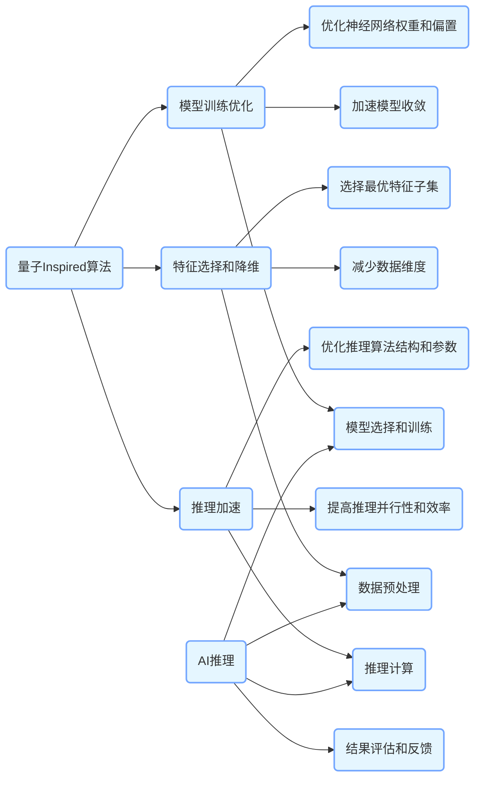

# 量子Inspired算法在高效AI推理中的创新

> 关键词：量子Inspired算法、高效AI推理、量子计算、人工智能、算法创新

> 摘要：本文聚焦于量子Inspired算法在高效AI推理中的创新应用。首先介绍了研究的背景、目的、预期读者等信息，接着阐述了量子Inspired算法和AI推理的核心概念及它们之间的联系，详细讲解了核心算法原理、数学模型与公式，并通过具体的Python代码示例展示了算法在项目实战中的应用。同时探讨了该算法在实际场景中的应用，推荐了相关的学习资源、开发工具和论文著作。最后总结了量子Inspired算法在高效AI推理领域的未来发展趋势与挑战，并对常见问题进行了解答。

## 1. 背景介绍 
### 1.1 目的和范围
随着人工智能技术的飞速发展，AI推理在各个领域的应用日益广泛，如自然语言处理、计算机视觉、自动驾驶等。然而，传统的AI推理算法在处理大规模数据和复杂任务时，面临着计算效率低下、能耗高等问题。量子计算作为一种新兴的计算范式，具有强大的并行计算能力和高效的优化能力，为解决这些问题提供了新的思路。但目前量子硬件技术还不够成熟，存在着量子比特的稳定性差、退相干等问题，限制了其实际应用。

量子Inspired算法是一种模拟量子计算原理的经典算法，它不需要真正的量子硬件，而是在经典计算机上模拟量子计算的过程，从而获得量子计算的优势。本研究的目的是探讨量子Inspired算法在高效AI推理中的创新应用，分析其原理、优势和局限性，并通过实际案例验证其有效性。研究范围涵盖了量子Inspired算法的基本概念、核心算法原理、数学模型、实际应用场景等方面。

### 1.2 预期读者
本文的预期读者包括人工智能领域的研究人员、工程师、开发者，以及对量子计算和AI推理感兴趣的学生和爱好者。对于有一定编程基础和数学知识的读者来说，本文将有助于他们深入了解量子Inspired算法在AI推理中的应用；对于初学者来说，本文可以作为一个入门指南，帮助他们建立对量子Inspired算法和AI推理的基本认识。

### 1.3 文档结构概述
本文共分为十个部分，具体结构如下：
1. **背景介绍**：介绍研究的目的、范围、预期读者和文档结构概述，以及相关术语的定义和解释。
2. **核心概念与联系**：阐述量子Inspired算法和AI推理的核心概念，以及它们之间的联系，并通过文本示意图和Mermaid流程图进行说明。
3. **核心算法原理 & 具体操作步骤**：详细讲解量子Inspired算法的核心原理，并用Python源代码展示具体的操作步骤。
4. **数学模型和公式 & 详细讲解 & 举例说明**：介绍量子Inspired算法的数学模型和公式，并通过具体的例子进行详细讲解。
5. **项目实战：代码实际案例和详细解释说明**：通过一个实际的项目案例，展示量子Inspired算法在AI推理中的应用，包括开发环境搭建、源代码实现和代码解读。
6. **实际应用场景**：探讨量子Inspired算法在不同领域的实际应用场景，如自然语言处理、计算机视觉、优化问题等。
7. **工具和资源推荐**：推荐相关的学习资源、开发工具和论文著作，帮助读者进一步深入学习和研究。
8. **总结：未来发展趋势与挑战**：总结量子Inspired算法在高效AI推理中的应用现状，分析其未来发展趋势和面临的挑战。
9. **附录：常见问题与解答**：对读者可能遇到的常见问题进行解答，帮助读者更好地理解和应用量子Inspired算法。
10. **扩展阅读 & 参考资料**：提供相关的扩展阅读材料和参考资料，方便读者进一步深入研究。

### 1.4 术语表
#### 1.4.1 核心术语定义
- **量子Inspired算法**：一种模拟量子计算原理的经典算法，通过在经典计算机上模拟量子态的演化和测量过程，获得量子计算的优势。
- **AI推理**：指人工智能系统根据已有的知识和数据，对新的输入进行预测、分类、决策等操作的过程。
- **量子比特（qubit）**：量子计算中的基本信息单位，与经典比特不同，量子比特可以处于0和1的叠加态。
- **量子叠加**：量子系统可以同时处于多个状态的叠加态，这是量子计算的重要特性之一。
- **量子纠缠**：两个或多个量子比特之间存在一种特殊的关联，使得一个量子比特的状态改变会立即影响其他量子比特的状态。

#### 1.4.2 相关概念解释
- **量子计算**：基于量子力学原理的计算方式，利用量子比特的叠加态和纠缠特性，实现并行计算和高效的优化算法。
- **经典计算**：基于经典物理学原理的计算方式，使用经典比特（0和1）进行信息存储和处理。
- **优化问题**：在一定的约束条件下，寻找最优解的问题，如函数优化、组合优化等。
- **机器学习**：一门多领域交叉学科，涉及概率论、统计学、逼近论、凸分析、算法复杂度理论等多门学科。它专门研究计算机怎样模拟或实现人类的学习行为，以获取新的知识或技能，重新组织已有的知识结构使之不断改善自身的性能。

#### 1.4.3 缩略词列表
- **AI**：Artificial Intelligence，人工智能
- **QC**：Quantum Computing，量子计算
- **QIA**：Quantum Inspired Algorithm，量子Inspired算法
- **ML**：Machine Learning，机器学习
- **NLP**：Natural Language Processing，自然语言处理
- **CV**：Computer Vision，计算机视觉

## 2. 核心概念与联系 
### 2.1 量子Inspired算法的核心概念
量子Inspired算法是一种模拟量子计算原理的经典算法，它借鉴了量子力学中的一些概念和特性，如量子叠加、量子纠缠、量子测量等，来设计高效的算法。量子Inspired算法的核心思想是将问题的解表示为量子态，通过模拟量子态的演化和测量过程，找到问题的最优解。

量子Inspired算法具有以下特点：
- **并行性**：利用量子叠加原理，量子Inspired算法可以同时处理多个状态，从而实现并行计算，提高算法的效率。
- **全局搜索能力**：量子Inspired算法可以在整个搜索空间中进行全局搜索，避免陷入局部最优解。
- **自适应调整**：量子Inspired算法可以根据问题的特点和搜索过程的反馈，自适应地调整搜索策略，提高搜索效率。

### 2.2 AI推理的核心概念
AI推理是指人工智能系统根据已有的知识和数据，对新的输入进行预测、分类、决策等操作的过程。AI推理是人工智能应用的核心环节，它直接影响着人工智能系统的性能和效率。

AI推理通常包括以下步骤：
- **数据预处理**：对输入的数据进行清洗、归一化、特征提取等处理，以便于后续的模型训练和推理。
- **模型选择和训练**：选择合适的机器学习或深度学习模型，并使用训练数据对模型进行训练，调整模型的参数，使其能够准确地预测和分类。
- **推理计算**：将预处理后的输入数据输入到训练好的模型中，进行推理计算，得到预测结果。
- **结果评估和反馈**：对推理结果进行评估，根据评估结果调整模型的参数或选择更合适的模型，以提高推理的准确性和效率。

### 2.3 量子Inspired算法与AI推理的联系
量子Inspired算法可以为AI推理提供新的思路和方法，提高AI推理的效率和准确性。具体来说，量子Inspired算法可以在以下几个方面应用于AI推理：
- **模型训练优化**：量子Inspired算法可以用于优化机器学习和深度学习模型的训练过程，加速模型的收敛速度，提高模型的性能。例如，量子Inspired算法可以用于优化神经网络的权重和偏置，减少训练时间和计算资源的消耗。
- **特征选择和降维**：量子Inspired算法可以用于选择最优的特征子集，减少数据的维度，提高模型的泛化能力和推理效率。例如，量子Inspired算法可以用于解决特征选择问题，从大量的特征中选择最具代表性的特征。
- **推理加速**：量子Inspired算法可以用于加速AI推理的计算过程，减少推理时间和能耗。例如，量子Inspired算法可以用于优化推理算法的结构和参数，提高推理的并行性和效率。

### 2.4 文本示意图
```plaintext
量子Inspired算法与AI推理的联系

量子Inspired算法
|
|-- 模型训练优化
|   |-- 优化神经网络权重和偏置
|   |-- 加速模型收敛
|
|-- 特征选择和降维
|   |-- 选择最优特征子集
|   |-- 减少数据维度
|
|-- 推理加速
|   |-- 优化推理算法结构和参数
|   |-- 提高推理并行性和效率

AI推理
|
|-- 数据预处理
|
|-- 模型选择和训练
|
|-- 推理计算
|
|-- 结果评估和反馈
```

### 2.5 Mermaid流程图


## 3. 核心算法原理 & 具体操作步骤 
### 3.1 量子Inspired算法的核心原理
量子Inspired算法的核心原理是模拟量子态的演化和测量过程，通过不断地更新量子态，找到问题的最优解。下面以量子遗传算法（Quantum Genetic Algorithm，QGA）为例，介绍量子Inspired算法的核心原理。

量子遗传算法是一种基于量子计算原理的遗传算法，它将量子比特的概念引入到遗传算法中，利用量子比特的叠加态和纠缠特性，实现并行搜索和全局优化。量子遗传算法的基本步骤如下：
1. **量子编码**：将问题的解表示为量子态，每个量子比特可以处于0和1的叠加态。例如，一个二进制编码的解可以表示为一个量子态：
$$|\psi\rangle = \alpha_0|0\rangle + \alpha_1|1\rangle$$
其中，$\alpha_0$和$\alpha_1$是量子比特的概率幅，满足$|\alpha_0|^2 + |\alpha_1|^2 = 1$。

2. **量子初始化**：随机初始化量子种群，每个量子个体由多个量子比特组成。

3. **量子测量**：对量子种群中的每个量子个体进行测量，得到一个经典解。测量的结果是量子态塌缩到某个本征态，即0或1。

4. **适应度评估**：计算每个经典解的适应度值，评估其优劣。

5. **量子进化**：根据适应度值，选择优秀的量子个体进行量子进化操作，如量子交叉、量子变异等。量子进化操作可以改变量子比特的概率幅，从而更新量子态。

6. **终止条件判断**：判断是否满足终止条件，如达到最大迭代次数、适应度值达到阈值等。如果满足终止条件，则输出最优解；否则，返回步骤3继续迭代。

### 3.2 具体操作步骤的Python代码实现
```python
import numpy as np

# 定义问题的维度
n = 10

# 定义量子种群的大小
m = 20

# 定义最大迭代次数
max_iter = 100

# 定义适应度函数（这里以简单的二次函数为例）
def fitness_function(x):
    return np.sum(x**2)

# 量子编码
def quantum_encoding(n):
    # 随机初始化量子比特的概率幅
    alpha = np.random.rand(n)
    beta = np.sqrt(1 - alpha**2)
    return alpha, beta

# 量子初始化
def quantum_initialization(m, n):
    population = []
    for i in range(m):
        alpha, beta = quantum_encoding(n)
        population.append((alpha, beta))
    return population

# 量子测量
def quantum_measurement(alpha, beta):
    r = np.random.rand(len(alpha))
    x = np.zeros(len(alpha))
    for i in range(len(alpha)):
        if r[i] < alpha[i]**2:
            x[i] = 0
        else:
            x[i] = 1
    return x

# 适应度评估
def fitness_evaluation(population):
    fitness_values = []
    for alpha, beta in population:
        x = quantum_measurement(alpha, beta)
        fitness = fitness_function(x)
        fitness_values.append(fitness)
    return fitness_values

# 量子进化（简单的量子变异）
def quantum_evolution(population, fitness_values):
    new_population = []
    best_index = np.argmin(fitness_values)
    best_alpha, best_beta = population[best_index]
    for i in range(len(population)):
        alpha, beta = population[i]
        # 以一定的概率进行量子变异
        if np.random.rand() < 0.1:
            index = np.random.randint(0, len(alpha))
            alpha[index] = np.random.rand()
            beta[index] = np.sqrt(1 - alpha[index]**2)
        new_population.append((alpha, beta))
    return new_population

# 主函数
def main():
    # 量子初始化
    population = quantum_initialization(m, n)

    for iter in range(max_iter):
        # 适应度评估
        fitness_values = fitness_evaluation(population)

        # 量子进化
        population = quantum_evolution(population, fitness_values)

        # 输出当前最优解
        best_index = np.argmin(fitness_values)
        best_alpha, best_beta = population[best_index]
        best_x = quantum_measurement(best_alpha, best_beta)
        best_fitness = fitness_function(best_x)
        print(f'Iteration {iter}: Best fitness = {best_fitness}')

    # 输出最终最优解
    fitness_values = fitness_evaluation(population)
    best_index = np.argmin(fitness_values)
    best_alpha, best_beta = population[best_index]
    best_x = quantum_measurement(best_alpha, best_beta)
    best_fitness = fitness_function(best_x)
    print(f'Final best fitness = {best_fitness}')

if __name__ == '__main__':
    main()
```

### 3.3 代码解释
1. **量子编码**：`quantum_encoding`函数用于随机初始化量子比特的概率幅，满足$|\alpha|^2 + |\beta|^2 = 1$。
2. **量子初始化**：`quantum_initialization`函数用于随机初始化量子种群，每个量子个体由多个量子比特组成。
3. **量子测量**：`quantum_measurement`函数用于对量子个体进行测量，得到一个经典解。测量的结果是量子态塌缩到某个本征态，即0或1。
4. **适应度评估**：`fitness_evaluation`函数用于计算每个经典解的适应度值，评估其优劣。
5. **量子进化**：`quantum_evolution`函数用于对量子种群进行进化操作，这里采用简单的量子变异方式，以一定的概率改变量子比特的概率幅。
6. **主函数**：`main`函数是程序的入口，它调用上述函数完成量子遗传算法的迭代过程，输出每一代的最优解和最终的最优解。

## 4. 数学模型和公式 & 详细讲解 & 举例说明 
### 4.1 量子态的表示
在量子力学中，量子态可以用态矢量来表示。对于一个量子比特，其态矢量可以表示为：
$$|\psi\rangle = \alpha|0\rangle + \beta|1\rangle$$
其中，$|0\rangle$和$|1\rangle$是量子比特的两个基态，$\alpha$和$\beta$是量子比特的概率幅，满足$|\alpha|^2 + |\beta|^2 = 1$。$|\alpha|^2$表示量子比特处于$|0\rangle$态的概率，$|\beta|^2$表示量子比特处于$|1\rangle$态的概率。

对于一个由$n$个量子比特组成的量子系统，其态矢量可以表示为：
$$|\Psi\rangle = \sum_{x_1=0}^1\sum_{x_2=0}^1\cdots\sum_{x_n=0}^1\alpha_{x_1x_2\cdots x_n}|x_1x_2\cdots x_n\rangle$$
其中，$|x_1x_2\cdots x_n\rangle$是$n$个量子比特的基态，$\alpha_{x_1x_2\cdots x_n}$是相应的概率幅，满足$\sum_{x_1=0}^1\sum_{x_2=0}^1\cdots\sum_{x_n=0}^1|\alpha_{x_1x_2\cdots x_n}|^2 = 1$。

### 4.2 量子测量
量子测量是量子计算中的一个重要操作，它将量子态塌缩到某个本征态。对于一个量子比特$|\psi\rangle = \alpha|0\rangle + \beta|1\rangle$，进行测量时，得到$|0\rangle$态的概率为$|\alpha|^2$，得到$|1\rangle$态的概率为$|\beta|^2$。

对于一个由$n$个量子比特组成的量子系统$|\Psi\rangle = \sum_{x_1=0}^1\sum_{x_2=0}^1\cdots\sum_{x_n=0}^1\alpha_{x_1x_2\cdots x_n}|x_1x_2\cdots x_n\rangle$，进行测量时，得到基态$|x_1x_2\cdots x_n\rangle$的概率为$|\alpha_{x_1x_2\cdots x_n}|^2$。

### 4.3 量子门操作
量子门是量子计算中的基本操作，它可以改变量子态的概率幅。常见的量子门有：
- **Pauli-X门**：也称为非门，它将$|0\rangle$态变为$|1\rangle$态，将$|1\rangle$态变为$|0\rangle$态。其矩阵表示为：
$$X = \begin{bmatrix}0 & 1\\1 & 0\end{bmatrix}$$

- **Pauli-Y门**：其矩阵表示为：
$$Y = \begin{bmatrix}0 & -i\\i & 0\end{bmatrix}$$

- **Pauli-Z门**：它将$|0\rangle$态保持不变，将$|1\rangle$态乘以$-1$。其矩阵表示为：
$$Z = \begin{bmatrix}1 & 0\\0 & -1\end{bmatrix}$$

- **Hadamard门**：它将$|0\rangle$态变为$\frac{1}{\sqrt{2}}(|0\rangle + |1\rangle)$态，将$|1\rangle$态变为$\frac{1}{\sqrt{2}}(|0\rangle - |1\rangle)$态。其矩阵表示为：
$$H = \frac{1}{\sqrt{2}}\begin{bmatrix}1 & 1\\1 & -1\end{bmatrix}$$

### 4.4 举例说明
假设我们有一个由两个量子比特组成的量子系统，其初始态为$|\Psi\rangle = \frac{1}{\sqrt{2}}(|00\rangle + |11\rangle)$。

1. **量子测量**：进行测量时，得到$|00\rangle$态的概率为$(\frac{1}{\sqrt{2}})^2 = \frac{1}{2}$，得到$|11\rangle$态的概率也为$(\frac{1}{\sqrt{2}})^2 = \frac{1}{2}$。

2. **量子门操作**：如果我们对第一个量子比特施加一个Hadamard门，对第二个量子比特施加一个Pauli-X门，则量子态的变化如下：
首先，Hadamard门作用在第一个量子比特上：
$$H|0\rangle = \frac{1}{\sqrt{2}}(|0\rangle + |1\rangle)$$
$$H|1\rangle = \frac{1}{\sqrt{2}}(|0\rangle - |1\rangle)$$
所以，$H\otimes I|\Psi\rangle = \frac{1}{2}(|00\rangle + |01\rangle + |10\rangle - |11\rangle)$
然后，Pauli-X门作用在第二个量子比特上：
$$X|0\rangle = |1\rangle$$
$$X|1\rangle = |0\rangle$$
所以，$(H\otimes X)|\Psi\rangle = \frac{1}{2}(|01\rangle + |00\rangle + |11\rangle - |10\rangle)$

## 5. 项目实战：代码实际案例和详细解释说明 
### 5.1  开发环境搭建
本项目使用Python语言进行开发，需要安装以下库：
- **NumPy**：用于数值计算和数组操作。
- **Matplotlib**：用于数据可视化。

可以使用以下命令安装这些库：
```sh
pip install numpy matplotlib
```

### 5.2  源代码详细实现和代码解读
下面是一个使用量子遗传算法解决函数优化问题的完整代码示例：
```python
import numpy as np
import matplotlib.pyplot as plt

# 定义问题的维度
n = 2

# 定义量子种群的大小
m = 50

# 定义最大迭代次数
max_iter = 200

# 定义适应度函数（这里以Rastrigin函数为例）
def rastrigin_function(x):
    A = 10
    return A * n + np.sum(x**2 - A * np.cos(2 * np.pi * x))

# 量子编码
def quantum_encoding(n):
    alpha = np.random.rand(n)
    beta = np.sqrt(1 - alpha**2)
    return alpha, beta

# 量子初始化
def quantum_initialization(m, n):
    population = []
    for i in range(m):
        alpha, beta = quantum_encoding(n)
        population.append((alpha, beta))
    return population

# 量子测量
def quantum_measurement(alpha, beta):
    r = np.random.rand(len(alpha))
    x = np.zeros(len(alpha))
    for i in range(len(alpha)):
        if r[i] < alpha[i]**2:
            x[i] = -5.12 + (5.12 - (-5.12)) * np.random.rand()
        else:
            x[i] = -5.12 + (5.12 - (-5.12)) * np.random.rand()
    return x

# 适应度评估
def fitness_evaluation(population):
    fitness_values = []
    for alpha, beta in population:
        x = quantum_measurement(alpha, beta)
        fitness = rastrigin_function(x)
        fitness_values.append(fitness)
    return fitness_values

# 量子进化（量子交叉和量子变异）
def quantum_evolution(population, fitness_values):
    new_population = []
    best_index = np.argmin(fitness_values)
    best_alpha, best_beta = population[best_index]

    # 选择操作
    selection_prob = np.exp(-np.array(fitness_values) / np.max(fitness_values))
    selection_prob = selection_prob / np.sum(selection_prob)
    selected_indices = np.random.choice(len(population), size=len(population), p=selection_prob)

    for i in range(len(population)):
        index1, index2 = np.random.choice(selected_indices, size=2, replace=False)
        alpha1, beta1 = population[index1]
        alpha2, beta2 = population[index2]

        # 量子交叉
        crossover_point = np.random.randint(0, n)
        new_alpha = np.concatenate((alpha1[:crossover_point], alpha2[crossover_point:]))
        new_beta = np.concatenate((beta1[:crossover_point], beta2[crossover_point:]))

        # 量子变异
        if np.random.rand() < 0.1:
            mutation_index = np.random.randint(0, n)
            new_alpha[mutation_index] = np.random.rand()
            new_beta[mutation_index] = np.sqrt(1 - new_alpha[mutation_index]**2)

        new_population.append((new_alpha, new_beta))

    return new_population

# 主函数
def main():
    # 量子初始化
    population = quantum_initialization(m, n)

    best_fitness_history = []

    for iter in range(max_iter):
        # 适应度评估
        fitness_values = fitness_evaluation(population)

        # 记录当前最优适应度
        best_fitness = np.min(fitness_values)
        best_fitness_history.append(best_fitness)

        # 量子进化
        population = quantum_evolution(population, fitness_values)

        print(f'Iteration {iter}: Best fitness = {best_fitness}')

    # 输出最终最优解
    fitness_values = fitness_evaluation(population)
    best_index = np.argmin(fitness_values)
    best_alpha, best_beta = population[best_index]
    best_x = quantum_measurement(best_alpha, best_beta)
    best_fitness = rastrigin_function(best_x)
    print(f'Final best fitness = {best_fitness}')

    # 绘制最优适应度随迭代次数的变化曲线
    plt.plot(best_fitness_history)
    plt.xlabel('Iteration')
    plt.ylabel('Best Fitness')
    plt.title('Quantum Genetic Algorithm for Rastrigin Function Optimization')
    plt.show()

if __name__ == '__main__':
    main()
```

### 5.3  代码解读与分析
1. **适应度函数**：`rastrigin_function`函数定义了要优化的目标函数，这里使用Rastrigin函数作为示例。Rastrigin函数是一个多峰函数，具有许多局部最优解，是一个比较有挑战性的优化问题。

2. **量子编码和初始化**：`quantum_encoding`函数用于随机初始化量子比特的概率幅，`quantum_initialization`函数用于随机初始化量子种群。

3. **量子测量**：`quantum_measurement`函数用于对量子个体进行测量，得到一个经典解。在测量过程中，根据量子比特的概率幅随机生成一个实数解。

4. **适应度评估**：`fitness_evaluation`函数用于计算每个经典解的适应度值，评估其优劣。

5. **量子进化**：`quantum_evolution`函数用于对量子种群进行进化操作，包括选择、交叉和变异。选择操作采用轮盘赌选择法，根据适应度值的大小选择优秀的个体；交叉操作采用单点交叉，随机选择一个交叉点，交换两个个体的部分量子比特；变异操作以一定的概率改变量子比特的概率幅。

6. **主函数**：`main`函数是程序的入口，它调用上述函数完成量子遗传算法的迭代过程，记录每一代的最优适应度值，并绘制最优适应度随迭代次数的变化曲线。

通过运行上述代码，我们可以看到量子遗传算法在解决Rastrigin函数优化问题上的性能。随着迭代次数的增加，最优适应度值逐渐减小，说明算法能够有效地找到问题的最优解。

## 6. 实际应用场景 
### 6.1 自然语言处理
在自然语言处理中，量子Inspired算法可以用于文本分类、情感分析、机器翻译等任务。例如，在文本分类任务中，量子Inspired算法可以用于优化特征选择和模型训练过程，提高分类的准确性和效率。具体来说，量子Inspired算法可以在高维的文本特征空间中快速搜索最优的特征子集，减少特征的维度，同时加速模型的训练过程，提高模型的泛化能力。

### 6.2 计算机视觉
在计算机视觉中，量子Inspired算法可以用于图像分类、目标检测、图像分割等任务。例如，在图像分类任务中，量子Inspired算法可以用于优化卷积神经网络（CNN）的结构和参数，提高分类的准确性和速度。量子Inspired算法可以通过模拟量子态的演化，在搜索空间中进行全局搜索，找到最优的CNN结构和参数，从而提高模型的性能。

### 6.3 优化问题
量子Inspired算法在优化问题中具有广泛的应用，如旅行商问题（TSP）、背包问题、调度问题等。这些问题通常是NP难问题，传统的算法在处理大规模问题时效率较低。量子Inspired算法可以利用其并行性和全局搜索能力，在较短的时间内找到近似最优解。例如，在旅行商问题中，量子Inspired算法可以将城市之间的路径表示为量子态，通过模拟量子态的演化和测量过程，找到最优的旅行路径。

### 6.4 推荐系统
在推荐系统中，量子Inspired算法可以用于优化推荐算法的性能，提高推荐的准确性和个性化程度。例如，量子Inspired算法可以用于优化协同过滤算法的相似度计算和推荐列表生成过程，通过模拟量子态的叠加和纠缠特性，在高维的用户-物品空间中快速搜索最优的推荐结果。

## 7. 工具和资源推荐
### 7.1 学习资源推荐
#### 7.1.1 书籍推荐
- 《量子计算与量子信息》（Quantum Computation and Quantum Information）：这本书是量子计算领域的经典教材，由Michael A. Nielsen和Isaac L. Chuang编写，全面介绍了量子计算的基本概念、算法和应用。
- 《人工智能：一种现代的方法》（Artificial Intelligence: A Modern Approach）：这本书是人工智能领域的权威教材，由Stuart Russell和Peter Norvig编写，涵盖了人工智能的各个方面，包括机器学习、自然语言处理、计算机视觉等。
- 《Python机器学习》（Python Machine Learning）：这本书由Sebastian Raschka和Vahid Mirjalili编写，介绍了如何使用Python进行机器学习，包括各种机器学习算法的实现和应用。

#### 7.1.2 在线课程
- Coursera上的“量子计算基础”（Fundamentals of Quantum Computation）课程：该课程由马里兰大学的专家授课，介绍了量子计算的基本概念、算法和应用。
- edX上的“人工智能基础”（Introduction to Artificial Intelligence）课程：该课程由哥伦比亚大学的专家授课，介绍了人工智能的基本概念、算法和应用。
- Kaggle上的机器学习和深度学习微课程：Kaggle提供了一系列的机器学习和深度学习微课程，通过实践项目帮助学习者掌握相关技能。

#### 7.1.3 技术博客和网站
- Quantum Computing Report：该网站提供了量子计算领域的最新新闻、技术文章和研究报告。
- Towards Data Science：这是一个专注于数据科学和机器学习的技术博客，提供了大量的优质文章和教程。
- Medium上的量子计算和人工智能相关博客：Medium上有许多关于量子计算和人工智能的博客，作者来自不同的领域，可以提供不同的视角和见解。

### 7.2 开发工具框架推荐
#### 7.2.1 IDE和编辑器
- PyCharm：这是一款专业的Python集成开发环境，提供了丰富的功能和插件，适合开发Python项目。
- Jupyter Notebook：这是一个交互式的开发环境，适合进行数据分析、机器学习和深度学习的实验和演示。
- Visual Studio Code：这是一款轻量级的代码编辑器，支持多种编程语言，提供了丰富的扩展插件，适合快速开发和调试代码。

#### 7.2.2 调试和性能分析工具
- Py-Spy：这是一个Python性能分析工具，可以实时监控Python程序的性能，找出性能瓶颈。
- cProfile：这是Python标准库中的一个性能分析工具，可以统计Python程序中各个函数的执行时间和调用次数。
- PDB：这是Python标准库中的一个调试工具，可以帮助开发者定位和解决代码中的问题。

#### 7.2.3 相关框架和库
- Qiskit：这是IBM开发的一个开源量子计算框架，提供了量子算法的实现和模拟工具。
- PennyLane：这是一个跨平台的量子机器学习框架，支持多种量子计算后端和机器学习库。
- TensorFlow和PyTorch：这是两个流行的深度学习框架，提供了丰富的深度学习模型和工具。

### 7.3 相关论文著作推荐
#### 7.3.1 经典论文
- "Quantum Computing in the NISQ era and beyond"：这篇论文由John Preskill发表，介绍了量子计算在有噪声中等规模量子（NISQ）时代的发展现状和未来趋势。
- "Attention Is All You Need"：这篇论文提出了Transformer模型，是自然语言处理领域的经典论文，对后续的研究和应用产生了深远的影响。
- "ImageNet Classification with Deep Convolutional Neural Networks"：这篇论文提出了AlexNet模型，是计算机视觉领域的经典论文，开启了深度学习在计算机视觉中的应用热潮。

#### 7.3.2 最新研究成果
- 关注顶级学术会议如NeurIPS、ICML、CVPR、ACL等的最新研究成果，这些会议涵盖了人工智能和量子计算领域的最新进展。
- 关注预印本平台如arXiv上的最新论文，这些论文通常是最新的研究成果，还未经过同行评审。

#### 7.3.3 应用案例分析
- 研究一些实际应用案例，如量子算法在金融、医疗、交通等领域的应用，了解量子Inspired算法在实际场景中的应用效果和挑战。

## 8. 总结：未来发展趋势与挑战
### 8.1 未来发展趋势
- **算法创新**：未来，量子Inspired算法将不断创新和发展，出现更多高效的算法和改进的方法。例如，结合量子退火、量子模拟等技术，开发出更强大的量子Inspired算法，提高算法的性能和应用范围。
- **与其他技术融合**：量子Inspired算法将与其他技术如人工智能、机器学习、深度学习、区块链等深度融合，创造出更多新的应用场景和解决方案。例如，将量子Inspired算法应用于深度学习模型的训练和优化，提高模型的性能和效率。
- **硬件支持**：随着量子硬件技术的不断发展，量子计算机的性能和稳定性将不断提高，为量子Inspired算法的应用提供更好的硬件支持。同时，量子Inspired算法也将为量子硬件的设计和优化提供理论指导。
- **跨领域应用**：量子Inspired算法将在更多的领域得到应用，如金融、医疗、交通、能源等。通过解决这些领域中的复杂问题，为社会带来更大的价值。

### 8.2 挑战
- **理论基础**：量子Inspired算法的理论基础还不够完善，需要进一步深入研究量子力学和计算机科学的交叉领域，建立更加严谨的理论体系。
- **算法复杂度**：虽然量子Inspired算法具有并行性和全局搜索能力，但在处理大规模问题时，算法的复杂度仍然较高，需要进一步优化算法的结构和参数，提高算法的效率。
- **硬件限制**：目前量子硬件技术还不够成熟，存在着量子比特的稳定性差、退相干等问题，限制了量子Inspired算法的实际应用。需要加快量子硬件技术的发展，提高量子计算机的性能和稳定性。
- **人才短缺**：量子Inspired算法是一个新兴的领域，需要具备量子力学、计算机科学、数学等多学科知识的专业人才。目前，该领域的人才短缺，需要加强相关专业的教育和培养。

## 9. 附录：常见问题与解答
### 9.1 量子Inspired算法和量子算法有什么区别？
量子算法是基于量子力学原理，在真正的量子计算机上运行的算法。而量子Inspired算法是在经典计算机上模拟量子计算的过程，不需要真正的量子硬件。量子Inspired算法借鉴了量子力学中的一些概念和特性，如量子叠加、量子纠缠等，来设计高效的算法。

### 9.2 量子Inspired算法在实际应用中能带来多大的性能提升？
量子Inspired算法在实际应用中的性能提升取决于具体的问题和算法的设计。在一些复杂的优化问题和搜索问题中，量子Inspired算法可以比传统算法更快地找到近似最优解，从而提高计算效率。但在一些简单的问题中，量子Inspired算法可能并不会带来明显的性能提升。

### 9.3 如何选择合适的量子Inspired算法？
选择合适的量子Inspired算法需要考虑以下几个因素：
- **问题类型**：不同的量子Inspired算法适用于不同类型的问题，如优化问题、搜索问题、分类问题等。需要根据具体的问题类型选择合适的算法。
- **问题规模**：对于大规模问题，需要选择具有较高并行性和全局搜索能力的算法；对于小规模问题，可以选择简单的算法。
- **算法复杂度**：需要考虑算法的时间复杂度和空间复杂度，选择复杂度较低的算法。
- **实际应用场景**：需要考虑算法在实际应用场景中的可行性和效率，选择适合实际应用的算法。

### 9.4 量子Inspired算法的实现难度大吗？
量子Inspired算法的实现难度取决于算法的复杂度和具体的应用场景。对于一些简单的量子Inspired算法，如量子遗传算法、量子退火算法等，实现起来相对容易，只需要掌握基本的编程知识和量子计算的概念即可。但对于一些复杂的量子Inspired算法，如量子模拟算法、量子机器学习算法等，实现起来难度较大，需要具备较高的编程水平和量子计算的专业知识。

## 10. 扩展阅读 & 参考资料
### 10.1 扩展阅读
- 《量子计算与编程入门》：这本书适合初学者阅读，介绍了量子计算的基本概念和编程方法。
- 《人工智能算法（卷3）：深度学习和神经网络》：这本书详细介绍了深度学习和神经网络的算法原理和应用。
- 《优化算法：原理与应用》：这本书介绍了各种优化算法的原理和应用，包括量子Inspired算法。

### 10.2 参考资料
- Nielsen, M. A., & Chuang, I. L. (2000). Quantum Computation and Quantum Information. Cambridge University Press.
- Russell, S., & Norvig, P. (2009). Artificial Intelligence: A Modern Approach. Pearson Education.
- Raschka, S., & Mirjalili, V. (2017). Python Machine Learning. Packt Publishing.

作者：AI天才研究院/AI Genius Institute & 禅与计算机程序设计艺术 /Zen And The Art of Computer Programming