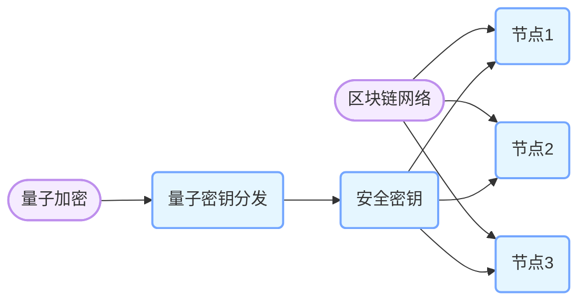

# 量子加密在区块链安全中的潜在应用

> 关键词：量子加密、区块链安全、量子计算、密码学、量子密钥分发、后量子密码学、分布式账本

> 摘要：本文深入探讨了量子加密在区块链安全中的潜在应用。首先介绍了量子加密和区块链的背景知识，包括其目的、预期读者和相关术语。接着阐述了量子加密和区块链的核心概念及联系，详细讲解了核心算法原理与具体操作步骤，结合数学模型和公式进行了深入分析。通过项目实战展示了量子加密在区块链安全中的代码实现和解读。探讨了其实际应用场景，推荐了相关的学习资源、开发工具框架和论文著作。最后总结了未来发展趋势与挑战，并提供了常见问题解答和参考资料。旨在全面剖析量子加密为区块链安全带来的新机遇和挑战，为相关领域的研究和实践提供有价值的参考。

## 1. 背景介绍 
### 1.1 目的和范围
随着信息技术的飞速发展，区块链技术作为一种分布式账本技术，在金融、供应链、物联网等多个领域得到了广泛应用。然而，区块链的安全问题一直是其发展的关键挑战之一。传统的加密算法在面对量子计算的潜在威胁时，可能会变得脆弱。量子加密作为一种基于量子力学原理的加密技术，具有无条件安全性的特点，为区块链安全提供了新的解决方案。本文的目的是深入探讨量子加密在区块链安全中的潜在应用，分析其原理、优势和面临的挑战，为相关领域的研究和实践提供参考。

本文的范围涵盖了量子加密和区块链的基本概念、核心算法原理、数学模型、项目实战、实际应用场景以及未来发展趋势等方面。通过对这些内容的详细阐述，全面展示量子加密在区块链安全中的应用潜力。

### 1.2 预期读者
本文预期读者包括对量子计算、密码学、区块链技术感兴趣的科研人员、工程师、学生以及相关领域的从业者。对于希望深入了解量子加密在区块链安全中应用的人士，本文提供了系统的知识和技术讲解；对于从事相关技术研发的人员，本文的项目实战和代码实现部分可以作为参考和借鉴。

### 1.3 文档结构概述
本文共分为十个部分。第一部分为背景介绍，包括目的和范围、预期读者、文档结构概述和术语表。第二部分阐述量子加密和区块链的核心概念与联系，通过文本示意图和 Mermaid 流程图进行展示。第三部分详细讲解核心算法原理和具体操作步骤，并使用 Python 源代码进行阐述。第四部分介绍数学模型和公式，并进行详细讲解和举例说明。第五部分通过项目实战展示量子加密在区块链安全中的代码实现和详细解释说明。第六部分探讨量子加密在区块链安全中的实际应用场景。第七部分推荐相关的学习资源、开发工具框架和论文著作。第八部分总结未来发展趋势与挑战。第九部分为附录，提供常见问题与解答。第十部分提供扩展阅读和参考资料。

### 1.4 术语表
#### 1.4.1 核心术语定义
- **量子加密（Quantum Encryption）**：基于量子力学原理的加密技术，利用量子态的特性来实现信息的安全传输和加密。
- **区块链（Blockchain）**：一种分布式账本技术，由多个区块组成，每个区块包含一定数量的交易信息，通过密码学方法链接在一起，形成一个不可篡改的链式结构。
- **量子计算（Quantum Computing）**：利用量子比特的量子特性进行计算的新型计算模式，具有强大的计算能力，可能对传统密码学构成威胁。
- **量子密钥分发（Quantum Key Distribution, QKD）**：一种基于量子力学原理的密钥分发方法，能够实现无条件安全的密钥传输。
- **后量子密码学（Post - Quantum Cryptography）**：研究在量子计算时代能够抵抗量子攻击的密码学算法和技术。

#### 1.4.2 相关概念解释
- **量子态（Quantum State）**：量子系统的状态，用波函数来描述。量子态具有叠加性和纠缠性等特性，是量子加密的基础。
- **分布式账本（Distributed Ledger）**：一种去中心化的账本，多个节点共同维护和存储账本数据，通过共识机制保证数据的一致性和安全性。
- **哈希函数（Hash Function）**：一种将任意长度的输入数据映射为固定长度输出的函数，具有单向性和抗碰撞性等特点，在区块链中用于保证数据的完整性。

#### 1.4.3 缩略词列表
- **QKD**：Quantum Key Distribution（量子密钥分发）
- **PQC**：Post - Quantum Cryptography（后量子密码学）
- **ECC**：Elliptic Curve Cryptography（椭圆曲线密码学）
- **RSA**：Rivest - Shamir - Adleman（一种非对称加密算法）

## 2. 核心概念与联系 

### 2.1 量子加密的核心概念
量子加密基于量子力学的基本原理，主要利用量子态的叠加性、纠缠性和不可克隆定理等特性。量子态的叠加性意味着一个量子比特可以同时处于多个状态的叠加态，而量子纠缠则是指两个或多个量子比特之间存在一种特殊的关联，无论它们之间的距离有多远。不可克隆定理表明，不可能精确地复制一个未知的量子态。

量子加密的主要应用是量子密钥分发（QKD）。QKD 允许两个通信方（通常称为 Alice 和 Bob）通过量子信道安全地共享一个密钥。在 QKD 过程中，Alice 发送一系列量子比特（例如光子）给 Bob，Bob 对这些量子比特进行测量。由于量子态的特性，如果有第三方（Eve）试图窃听，会不可避免地干扰量子态，从而被 Alice 和 Bob 发现。

### 2.2 区块链的核心概念
区块链是一种分布式账本技术，其核心思想是去中心化和不可篡改。区块链由一系列区块组成，每个区块包含一定数量的交易信息、前一个区块的哈希值和当前区块的哈希值。哈希值是通过哈希函数计算得到的，用于保证数据的完整性。

区块链的共识机制是保证多个节点之间数据一致性的关键。常见的共识机制包括工作量证明（Proof of Work, PoW）、权益证明（Proof of Stake, PoS）等。在区块链网络中，节点通过共识机制达成一致，确保新的区块能够被正确添加到区块链中。

### 2.3 量子加密与区块链的联系
量子加密和区块链都关注信息的安全性和完整性。量子加密的无条件安全性可以为区块链的密钥管理和通信安全提供更高级别的保障。例如，在区块链的节点之间通信时，可以使用 QKD 来安全地分发密钥，从而防止密钥被窃取或篡改。

此外，量子计算的发展对区块链的安全构成了潜在威胁。传统的加密算法（如 RSA 和 ECC）在面对量子计算的攻击时可能会变得脆弱。量子加密和后量子密码学的研究可以为区块链提供抗量子攻击的解决方案，确保区块链在量子计算时代的安全性。

### 2.4 文本示意图和 Mermaid 流程图
#### 2.4.1 文本示意图
量子加密与区块链的关系可以用以下示意图表示：

```plaintext
          量子加密
            |
            | 提供安全密钥分发
            |
      区块链网络
      /   |   \
节点1  节点2  节点3
```

#### 2.4.2 Mermaid 流程图


## 3. 核心算法原理 & 具体操作步骤 

### 3.1 量子密钥分发（QKD）算法原理
量子密钥分发的经典算法是 BB84 协议，下面详细介绍其原理。

#### 3.1.1 BB84 协议原理
BB84 协议基于量子态的两个非正交基：水平 - 垂直基（记为 $|0\rangle$ 和 $|1\rangle$）和对角基（记为 $|+\rangle$ 和 $|-\rangle$）。其中，$|+\rangle=\frac{1}{\sqrt{2}}(|0\rangle + |1\rangle)$，$|-\rangle=\frac{1}{\sqrt{2}}(|0\rangle - |1\rangle)$。

协议步骤如下：
1. **准备阶段**：Alice 随机选择一系列比特（0 或 1）作为原始密钥，同时随机选择一系列基（水平 - 垂直基或对角基）。对于每个比特，Alice 根据所选的基制备相应的量子态。例如，如果比特为 0 且基为水平 - 垂直基，则制备量子态 $|0\rangle$；如果比特为 1 且基为对角基，则制备量子态 $|-\rangle$。
2. **传输阶段**：Alice 通过量子信道将制备好的量子态发送给 Bob。
3. **测量阶段**：Bob 随机选择一系列基（水平 - 垂直基或对角基）对接收到的量子态进行测量。如果 Bob 选择的基与 Alice 制备量子态时的基相同，则测量结果与 Alice 原始的比特相同；如果基不同，则测量结果是随机的。
4. **基比对阶段**：Bob 通过经典信道告诉 Alice 他选择的基，Alice 则告诉 Bob 哪些基是正确的。双方只保留基相同的测量结果，这些结果构成了原始密钥。
5. **纠错和隐私放大阶段**：双方通过经典信道进行纠错和隐私放大操作，去除可能存在的错误比特，并进一步压缩密钥长度，得到最终的安全密钥。

### 3.2 Python 代码实现 BB84 协议
```python
import random

# 定义量子态
def prepare_quantum_state(bit, basis):
    if basis == 0:  # 水平 - 垂直基
        if bit == 0:
            return '|0>'
        else:
            return '|1>'
    else:  # 对角基
        if bit == 0:
            return '|+>'
        else:
            return '|->'

# 测量量子态
def measure_quantum_state(state, basis):
    if basis == 0:  # 水平 - 垂直基
        if state == '|0>':
            return 0
        elif state == '|1>':
            return 1
        else:  # 随机结果
            return random.randint(0, 1)
    else:  # 对角基
        if state == '|+>':
            return 0
        elif state == '|->':
            return 1
        else:  # 随机结果
            return random.randint(0, 1)

# BB84 协议实现
def bb84_protocol(key_length):
    # Alice 生成原始密钥和基
    alice_bits = [random.randint(0, 1) for _ in range(key_length)]
    alice_bases = [random.randint(0, 1) for _ in range(key_length)]

    # 制备量子态并发送给 Bob
    quantum_states = [prepare_quantum_state(alice_bits[i], alice_bases[i]) for i in range(key_length)]

    # Bob 选择基并测量量子态
    bob_bases = [random.randint(0, 1) for _ in range(key_length)]
    bob_bits = [measure_quantum_state(quantum_states[i], bob_bases[i]) for i in range(key_length)]

    # 基比对
    agreed_bits = []
    for i in range(key_length):
        if alice_bases[i] == bob_bases[i]:
            agreed_bits.append(alice_bits[i])

    return agreed_bits

# 示例运行
key_length = 100
shared_key = bb84_protocol(key_length)
print("Shared Key:", shared_key)
```

### 3.3 代码解释
- `prepare_quantum_state` 函数根据输入的比特和基制备相应的量子态。
- `measure_quantum_state` 函数根据输入的量子态和基进行测量，返回测量结果。
- `bb84_protocol` 函数实现了 BB84 协议的完整流程，包括 Alice 生成原始密钥和基、制备量子态、Bob 选择基并测量量子态、基比对等步骤。
- 最后，通过调用 `bb84_protocol` 函数并指定密钥长度，得到共享密钥。

## 4. 数学模型和公式 & 详细讲解 & 举例说明 

### 4.1 量子态的数学表示
量子态可以用向量空间中的向量来表示。在二维希尔伯特空间中，量子比特的基态可以表示为：
$$
|0\rangle=\begin{pmatrix}1\\0\end{pmatrix} \quad |1\rangle=\begin{pmatrix}0\\1\end{pmatrix}
$$
对角基的量子态可以表示为：
$$
|+\rangle=\frac{1}{\sqrt{2}}\begin{pmatrix}1\\1\end{pmatrix} \quad |-\rangle=\frac{1}{\sqrt{2}}\begin{pmatrix}1\\ - 1\end{pmatrix}
$$

### 4.2 BB84 协议的数学分析
在 BB84 协议中，假设 Alice 发送的量子态为 $|\psi\rangle$，Bob 选择的测量基为 $\{|\phi_0\rangle, |\phi_1\rangle\}$。测量结果为 $i$ 的概率可以用 Born 规则计算：
$$
P(i)=|\langle\phi_i|\psi\rangle|^2
$$

例如，如果 Alice 发送的量子态为 $|0\rangle$，Bob 选择的测量基为水平 - 垂直基 $\{|0\rangle, |1\rangle\}$，则测量结果为 0 的概率为：
$$
P(0)=|\langle0|0\rangle|^2 = 1
$$
测量结果为 1 的概率为：
$$
P(1)=|\langle1|0\rangle|^2 = 0
$$

如果 Bob 选择的测量基为对角基 $\{|+\rangle, |-\rangle\}$，则测量结果为 0 的概率为：
$$
P(0)=|\langle + |0\rangle|^2=\left|\frac{1}{\sqrt{2}}\begin{pmatrix}1 & 1\end{pmatrix}\begin{pmatrix}1\\0\end{pmatrix}\right|^2=\frac{1}{2}
$$
测量结果为 1 的概率为：
$$
P(1)=|\langle - |0\rangle|^2=\left|\frac{1}{\sqrt{2}}\begin{pmatrix}1 & - 1\end{pmatrix}\begin{pmatrix}1\\0\end{pmatrix}\right|^2=\frac{1}{2}
$$

### 4.3 举例说明
假设 Alice 生成的原始比特为 0，选择的基为水平 - 垂直基，因此制备的量子态为 $|0\rangle$。Bob 随机选择对角基进行测量。根据上述数学公式，Bob 测量结果为 0 或 1 的概率均为 $\frac{1}{2}$。如果 Bob 测量结果为 0，由于基不同，这个结果与 Alice 的原始比特没有确定的关系。

如果 Bob 选择的基与 Alice 相同（例如都是水平 - 垂直基），则 Bob 测量结果一定为 0，与 Alice 的原始比特相同。

## 5. 项目实战：代码实际案例和详细解释说明 

### 5.1  开发环境搭建
#### 5.1.1 安装 Python
首先，需要安装 Python 开发环境。可以从 Python 官方网站（https://www.python.org/downloads/） 下载适合自己操作系统的 Python 安装包，并按照安装向导进行安装。

#### 5.1.2 安装必要的库
在本项目中，只需要 Python 内置的 `random` 库，无需额外安装其他库。

### 5.2  源代码详细实现和代码解读
#### 5.2.1 完整代码
```python
import random

# 定义量子态
def prepare_quantum_state(bit, basis):
    if basis == 0:  # 水平 - 垂直基
        if bit == 0:
            return '|0>'
        else:
            return '|1>'
    else:  # 对角基
        if bit == 0:
            return '|+>'
        else:
            return '|->'

# 测量量子态
def measure_quantum_state(state, basis):
    if basis == 0:  # 水平 - 垂直基
        if state == '|0>':
            return 0
        elif state == '|1>':
            return 1
        else:  # 随机结果
            return random.randint(0, 1)
    else:  # 对角基
        if state == '|+>':
            return 0
        elif state == '|->':
            return 1
        else:  # 随机结果
            return random.randint(0, 1)

# BB84 协议实现
def bb84_protocol(key_length):
    # Alice 生成原始密钥和基
    alice_bits = [random.randint(0, 1) for _ in range(key_length)]
    alice_bases = [random.randint(0, 1) for _ in range(key_length)]

    # 制备量子态并发送给 Bob
    quantum_states = [prepare_quantum_state