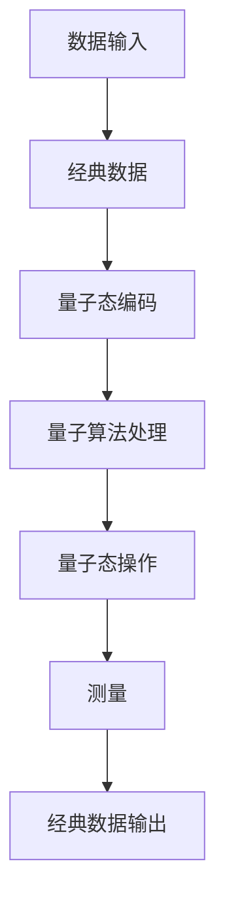

# 量子机器学习:探索量子计算在AI中的潜力

> 关键词：量子机器学习、量子计算、人工智能、算法原理、实际应用

> 摘要：本文深入探讨了量子机器学习这一前沿领域，旨在揭示量子计算在人工智能中的巨大潜力。首先介绍了量子机器学习的背景知识，包括目的、预期读者、文档结构和相关术语。接着阐述了核心概念与联系，通过文本示意图和Mermaid流程图进行直观展示。详细讲解了核心算法原理，并使用Python代码进行具体说明，同时给出了数学模型和公式，辅以实际例子加深理解。在项目实战部分，从开发环境搭建到源代码实现与解读，进行了全面分析。还探讨了量子机器学习的实际应用场景，推荐了学习资源、开发工具框架和相关论文著作。最后总结了未来发展趋势与挑战，并提供常见问题解答和扩展阅读参考资料。

## 1. 背景介绍 
### 1.1 目的和范围
量子机器学习作为量子计算与人工智能的交叉领域，其目的在于利用量子力学原理来提升机器学习算法的性能和效率。传统的机器学习算法在处理大规模数据和复杂问题时，往往面临计算资源和时间的瓶颈。量子计算的独特特性，如量子叠加、量子纠缠等，为解决这些问题提供了新的途径。

本文的范围涵盖了量子机器学习的基本概念、核心算法、数学模型、实际应用等方面。旨在为读者提供一个全面的了解，使读者能够深入认识量子机器学习的原理和潜力，并为进一步的研究和实践提供指导。

### 1.2 预期读者
本文的预期读者包括计算机科学、物理学、数学等领域的专业人士，以及对量子计算和人工智能感兴趣的科研人员、学生和爱好者。对于已经具备一定机器学习和量子力学基础知识的读者，本文将帮助他们深入理解量子机器学习的核心内容；对于初学者，本文也会在必要的地方进行基础知识的补充，使其能够逐步跟上文章的节奏。

### 1.3 文档结构概述
本文共分为十个部分。第一部分是背景介绍，为读者提供量子机器学习的基本背景信息。第二部分阐述核心概念与联系，通过文本示意图和流程图直观展示相关概念。第三部分详细讲解核心算法原理，并使用Python代码进行具体说明。第四部分介绍数学模型和公式，并通过举例加深理解。第五部分是项目实战，包括开发环境搭建、源代码实现与解读。第六部分探讨实际应用场景。第七部分推荐学习资源、开发工具框架和相关论文著作。第八部分总结未来发展趋势与挑战。第九部分是附录，提供常见问题解答。第十部分为扩展阅读和参考资料。

### 1.4 术语表
#### 1.4.1 核心术语定义
- **量子比特（Qubit）**：量子比特是量子计算中的基本信息单位，类似于经典计算机中的比特。与经典比特只能处于0或1的状态不同，量子比特可以处于0和1的叠加态，即同时处于0和1的状态。
- **量子叠加（Quantum Superposition）**：量子叠加是量子力学的一个重要特性，指量子系统可以同时处于多个不同的状态。在量子计算中，量子比特可以处于多个状态的叠加，从而使量子计算机能够同时处理多个计算任务。
- **量子纠缠（Quantum Entanglement）**：量子纠缠是指两个或多个量子比特之间存在一种特殊的关联，使得它们的状态不能独立描述。当一个量子比特的状态发生改变时，另一个与之纠缠的量子比特的状态也会立即发生相应的改变，无论它们之间的距离有多远。
- **量子门（Quantum Gate）**：量子门是量子计算中的基本操作单元，类似于经典计算机中的逻辑门。量子门可以对量子比特进行操作，改变其状态。
- **量子算法（Quantum Algorithm）**：量子算法是利用量子计算的特性设计的算法，旨在解决特定的问题。与经典算法相比，量子算法在某些问题上具有显著的优势。
- **机器学习（Machine Learning）**：机器学习是一门多领域交叉学科，涉及概率论、统计学、逼近论、凸分析、算法复杂度理论等多门学科。它专门研究计算机怎样模拟或实现人类的学习行为，以获取新的知识或技能，重新组织已有的知识结构使之不断改善自身的性能。
- **量子机器学习（Quantum Machine Learning）**：量子机器学习是将量子计算技术应用于机器学习领域，旨在利用量子计算的优势来提高机器学习算法的性能和效率。

#### 1.4.2 相关概念解释
- **量子态（Quantum State）**：量子态是描述量子系统状态的数学对象。在量子计算中，量子比特的状态可以用一个二维复向量来表示，这个向量就是量子态。
- **酉变换（Unitary Transformation）**：酉变换是量子计算中常用的一种变换，它可以保持量子态的归一化性质。在量子门的操作中，量子门的作用可以用酉变换来描述。
- **测量（Measurement）**：测量是量子计算中的一个重要操作，它可以将量子态从叠加态转变为经典态。在测量过程中，量子态会以一定的概率塌缩到某个特定的状态。
- **监督学习（Supervised Learning）**：监督学习是机器学习中的一种重要方法，它使用带有标签的训练数据来训练模型，以便模型能够对新的数据进行预测。
- **无监督学习（Unsupervised Learning）**：无监督学习是机器学习中的另一种重要方法，它使用无标签的训练数据来发现数据中的结构和模式。

#### 1.4.3 缩略词列表
- **QML**：Quantum Machine Learning，量子机器学习
- **QC**：Quantum Computing，量子计算
- **ML**：Machine Learning，机器学习
- **qubit**：Quantum bit，量子比特

## 2. 核心概念与联系 

### 核心概念原理
量子机器学习的核心在于将量子计算的特性应用于机器学习算法中。量子计算的主要特性包括量子叠加、量子纠缠和量子并行性，这些特性使得量子计算机在处理某些问题时具有比经典计算机更高的效率。

在量子机器学习中，量子比特（qubit）是基本的信息单位。与经典比特只能处于0或1的状态不同，量子比特可以处于0和1的叠加态，即 $\alpha|0\rangle + \beta|1\rangle$，其中 $\alpha$ 和 $\beta$ 是复数，且 $|\alpha|^2 + |\beta|^2 = 1$。这种叠加态使得量子计算机能够同时处理多个计算任务，从而实现量子并行性。

量子纠缠是另一个重要的特性，它使得多个量子比特之间存在一种特殊的关联。当一个量子比特的状态发生改变时，与之纠缠的其他量子比特的状态也会立即发生相应的改变，无论它们之间的距离有多远。这种特性可以用于实现量子通信和量子计算中的高效信息传输。

### 架构的文本示意图
量子机器学习的架构可以分为以下几个部分：
1. **数据输入**：将经典数据转换为量子态，以便在量子计算机上进行处理。
2. **量子算法处理**：使用量子算法对量子态进行操作，实现机器学习的任务，如分类、聚类等。
3. **测量**：对处理后的量子态进行测量，将量子态转换为经典数据，得到最终的结果。

### Mermaid 流程图


## 3. 核心算法原理 & 具体操作步骤 

### 核心算法原理
量子机器学习中有许多核心算法，其中最著名的是量子支持向量机（Quantum Support Vector Machine，QSVM）和量子主成分分析（Quantum Principal Component Analysis，QPCA）。下面以量子支持向量机为例，介绍其核心算法原理。

量子支持向量机是基于经典支持向量机的思想，利用量子计算的特性来提高分类效率。在经典支持向量机中，我们的目标是找到一个最优的超平面，将不同类别的数据分开。而在量子支持向量机中，我们可以利用量子态的叠加和纠缠特性，同时处理多个数据点，从而大大提高计算效率。

### 具体操作步骤
1. **数据编码**：将经典数据编码为量子态。可以使用振幅编码或相位编码等方法，将数据的特征信息编码到量子比特的振幅或相位中。
2. **量子态制备**：根据编码后的数据，制备相应的量子态。可以使用量子门操作来实现量子态的制备。
3. **量子计算**：使用量子算法对制备好的量子态进行操作，计算量子态之间的内积等信息。
4. **测量**：对操作后的量子态进行测量，得到经典数据。
5. **结果分析**：根据测量得到的经典数据，进行分类决策。

### Python 代码示例
```python
import numpy as np
from qiskit import QuantumCircuit, Aer, execute

# 数据编码
def encode_data(data):
    num_qubits = len(data)
    circuit = QuantumCircuit(num_qubits)
    for i in range(num_qubits):
        if data[i] == 1:
            circuit.x(i)
    return circuit

# 量子态制备
def prepare_state(circuit):
    backend = Aer.get_backend('statevector_simulator')
    job = execute(circuit, backend)
    result = job.result()
    statevector = result.get_statevector()
    return statevector

# 量子计算
def quantum_computation(statevector):
    # 这里简单示例，对量子态进行一些操作
    new_statevector = np.roll(statevector, 1)
    return new_statevector

# 测量
def measure_state(statevector):
    probabilities = np.abs(statevector) ** 2
    measurement_result = np.random.choice(len(statevector), p=probabilities)
    return measurement_result

# 主函数
def main():
    data = [0, 1, 0]
    circuit = encode_data(data)
    statevector = prepare_state(circuit)
    new_statevector = quantum_computation(statevector)
    measurement_result = measure_state(new_statevector)
    print("Measurement result:", measurement_result)

if __name__ == "__main__":
    main()
```

## 4. 数学模型和公式 & 详细讲解 & 举例说明 

### 量子态的数学表示
量子态可以用向量空间中的向量来表示。对于一个单量子比特，其状态可以用一个二维复向量来表示，即 $|\psi\rangle = \alpha|0\rangle + \beta|1\rangle$，其中 $\alpha$ 和 $\beta$ 是复数，且 $|\alpha|^2 + |\beta|^2 = 1$。$|0\rangle$ 和 $|1\rangle$ 是基态向量，分别表示量子比特处于0和1的状态。

### 量子门的数学表示
量子门可以用酉矩阵来表示。酉矩阵是一种满足 $U^{\dagger}U = I$ 的矩阵，其中 $U^{\dagger}$ 是 $U$ 的共轭转置矩阵，$I$ 是单位矩阵。例如，Pauli-X门（也称为非门）的矩阵表示为：
$$
X = \begin{pmatrix}
0 & 1 \\
1 & 0
\end{pmatrix}
$$
当Pauli-X门作用于一个单量子比特 $|\psi\rangle = \alpha|0\rangle + \beta|1\rangle$ 时，其结果为：
$$
X|\psi\rangle = \begin{pmatrix}
0 & 1 \\
1 & 0
\end{pmatrix}
\begin{pmatrix}
\alpha \\
\beta
\end{pmatrix}
= \begin{pmatrix}
\beta \\
\alpha
\end{pmatrix}
= \beta|0\rangle + \alpha|1\rangle
$$

### 量子测量的数学表示
量子测量可以用投影算符来表示。对于一个单量子比特的测量，我们可以定义两个投影算符 $P_0 = |0\rangle\langle0|$ 和 $P_1 = |1\rangle\langle1|$。当对量子态 $|\psi\rangle = \alpha|0\rangle + \beta|1\rangle$ 进行测量时，测量结果为0的概率为 $|\langle0|\psi\rangle|^2 = |\alpha|^2$，测量结果为1的概率为 $|\langle1|\psi\rangle|^2 = |\beta|^2$。

### 举例说明
假设我们有一个单量子比特的状态 $|\psi\rangle = \frac{1}{\sqrt{2}}|0\rangle + \frac{1}{\sqrt{2}}|1\rangle$。当我们对这个量子态进行测量时，测量结果为0的概率为 $|\frac{1}{\sqrt{2}}|^2 = \frac{1}{2}$，测量结果为1的概率也为 $|\frac{1}{\sqrt{2}}|^2 = \frac{1}{2}$。

现在我们让Pauli-X门作用于这个量子态：
$$
X|\psi\rangle = \begin{pmatrix}
0 & 1 \\
1 & 0
\end{pmatrix}
\begin{pmatrix}
\frac{1}{\sqrt{2}} \\
\frac{1}{\sqrt{2}}
\end{pmatrix}
= \begin{pmatrix}
\frac{1}{\sqrt{2}} \\
\frac{1}{\sqrt{2}}
\end{pmatrix}
= \frac{1}{\sqrt{2}}|0\rangle + \frac{1}{\sqrt{2}}|1\rangle
$$
可以看到，在这个例子中，Pauli-X门作用后量子态没有发生改变。

## 5. 项目实战：代码实际案例和详细解释说明 

### 5.1  开发环境搭建
要进行量子机器学习的项目实战，我们需要搭建相应的开发环境。以下是具体的步骤：

#### 安装Python
首先，确保你已经安装了Python 3.x版本。可以从Python官方网站（https://www.python.org/downloads/）下载并安装适合你操作系统的Python版本。

#### 安装Qiskit
Qiskit是一个开源的量子计算框架，我们可以使用它来进行量子机器学习的开发。可以使用以下命令来安装Qiskit：
```sh
pip install qiskit
```

#### 安装其他依赖库
根据具体的项目需求，可能还需要安装其他一些依赖库，如NumPy、Matplotlib等。可以使用以下命令来安装：
```sh
pip install numpy matplotlib
```

### 5.2  源代码详细实现和代码解读
以下是一个使用Qiskit实现量子支持向量机的简单示例代码：

```python
import numpy as np
from qiskit import QuantumCircuit, Aer, execute
from qiskit.circuit.library import ZZFeatureMap
from qiskit_machine_learning.kernels import QuantumKernel

# 生成一些示例数据
training_data = np.array([[0, 0], [0, 1], [1, 0], [1, 1]])
training_labels = np.array([0, 1, 1, 0])

# 定义量子特征映射
feature_map = ZZFeatureMap(feature_dimension=2, reps=2)

# 定义量子核
quantum_kernel = QuantumKernel(feature_map=feature_map, quantum_instance=Aer.get_backend('statevector_simulator'))

# 计算量子核矩阵
kernel_matrix = quantum_kernel.evaluate(x_vec=training_data)

print("Quantum kernel matrix:")
print(kernel_matrix)
```

### 代码解读与分析
1. **导入必要的库**：导入了NumPy、Qiskit相关的库和模块，用于生成数据、构建量子电路和计算量子核。
2. **生成示例数据**：使用NumPy生成了一些示例数据和对应的标签。
3. **定义量子特征映射**：使用 `ZZFeatureMap` 定义了一个量子特征映射，将经典数据映射到量子态。
4. **定义量子核**：使用 `QuantumKernel` 定义了一个量子核，用于计算数据之间的相似度。
5. **计算量子核矩阵**：调用 `quantum_kernel.evaluate` 方法计算量子核矩阵。
6. **输出结果**：打印出计算得到的量子核矩阵。

## 6. 实际应用场景 
量子机器学习在许多领域都有潜在的应用，以下是一些具体的应用场景：

### 金融领域
在金融领域，量子机器学习可以用于风险评估、投资组合优化、市场预测等。例如，通过量子机器学习算法可以更准确地预测股票价格的走势，帮助投资者做出更明智的投资决策。

### 医疗领域
在医疗领域，量子机器学习可以用于疾病诊断、药物研发等。例如，通过对大量的医疗数据进行分析，量子机器学习算法可以帮助医生更准确地诊断疾病，同时也可以加速药物研发的过程。

### 交通领域
在交通领域，量子机器学习可以用于交通流量预测、路径规划等。例如，通过对交通数据的实时分析，量子机器学习算法可以帮助交通管理部门更好地规划交通路线，缓解交通拥堵。

### 能源领域
在能源领域，量子机器学习可以用于能源预测、电网优化等。例如，通过对能源数据的分析，量子机器学习算法可以帮助能源公司更准确地预测能源需求，优化电网的运行。

## 7. 工具和资源推荐
### 7.1 学习资源推荐
#### 7.1.1 书籍推荐
- 《Quantum Computing for Computer Scientists》：这本书由Noson S. Yanofsky和Mirco A. Mannucci编写，是一本介绍量子计算的经典教材，适合计算机科学专业的学生和研究人员阅读。
- 《Quantum Machine Learning: What Every Data Scientist Should Know》：这本书由Vlatko Vedral编写，专门介绍了量子机器学习的相关知识，对于想要深入了解量子机器学习的读者来说是一本很好的参考书籍。

#### 7.1.2 在线课程
- Coursera上的“Quantum Computing for Everyone”：这门课程由Michigan State University提供，适合初学者学习量子计算的基础知识。
- edX上的“Quantum Machine Learning”：这门课程由University of Toronto提供，深入介绍了量子机器学习的算法和应用。

#### 7.1.3 技术博客和网站
- Qiskit官方博客（https://qiskit.org/blog/）：Qiskit是一个开源的量子计算框架，其官方博客会发布一些关于量子计算和量子机器学习的最新研究成果和技术文章。
- Quantum Computing Report（https://www.quantumcomputingreport.com/）：这是一个专门关注量子计算领域的网站，会报道量子计算的最新动态和研究进展。

### 7.2 开发工具框架推荐
#### 7.2.1 IDE和编辑器
- PyCharm：是一款功能强大的Python集成开发环境，支持Qiskit等量子计算框架的开发。
- Jupyter Notebook：是一个交互式的开发环境，适合进行量子机器学习的实验和数据分析。

#### 7.2.2 调试和性能分析工具
- Qiskit Aqua：是Qiskit的一个子模块，提供了一些用于调试和性能分析的工具，如量子算法的模拟和优化。
- IBM Quantum Experience：是IBM提供的一个在线量子计算平台，用户可以在上面进行量子算法的实验和调试。

#### 7.2.3 相关框架和库
- Qiskit：是一个开源的量子计算框架，提供了丰富的量子算法和工具，支持量子机器学习的开发。
- PennyLane：是一个跨平台的量子机器学习库，支持多种量子计算后端，如Qiskit、Cirq等。

### 7.3 相关论文著作推荐
#### 7.3.1 经典论文
- “Quantum Algorithm for Linear Systems of Equations” by Aram W. Harrow, Avinatan Hassidim, and Seth Lloyd：这篇论文提出了一种量子算法，用于求解线性方程组，在量子计算领域具有重要的影响力。
- “Quantum Support Vector Machine for Big Data Classification” by Patrick Rebentrost, Masoud Mohseni, and Seth Lloyd：这篇论文提出了量子支持向量机的概念，为量子机器学习的发展奠定了基础。

#### 7.3.2 最新研究成果
可以通过学术数据库，如IEEE Xplore、ACM Digital Library等，搜索关于量子机器学习的最新研究成果。这些研究成果通常会报道量子机器学习在算法改进、应用拓展等方面的最新进展。

#### 7.3.3 应用案例分析
一些学术会议和期刊会发表关于量子机器学习应用案例的分析文章，如NeurIPS（Neural Information Processing Systems）、ICML（International Conference on Machine Learning）等。这些文章可以帮助我们了解量子机器学习在实际应用中的效果和挑战。

## 8. 总结：未来发展趋势与挑战
### 未来发展趋势
- **算法创新**：随着对量子计算和机器学习的深入研究，未来将会有更多创新的量子机器学习算法出现。这些算法将充分利用量子计算的特性，解决更复杂的问题。
- **应用拓展**：量子机器学习将在更多领域得到应用，如人工智能、生物信息学、材料科学等。通过与这些领域的结合，量子机器学习将为解决实际问题提供更有效的方法。
- **硬件发展**：量子计算硬件的不断发展将为量子机器学习提供更强大的计算能力。随着量子比特数量的增加和量子门操作精度的提高，量子机器学习的性能将得到进一步提升。

### 挑战
- **硬件限制**：目前量子计算硬件还存在许多问题，如量子比特的稳定性、量子门操作的精度等。这些问题限制了量子机器学习算法的实现和应用。
- **算法复杂度**：虽然量子机器学习算法在某些问题上具有优势，但一些算法的复杂度仍然较高。如何设计更高效的量子机器学习算法是一个亟待解决的问题。
- **人才短缺**：量子机器学习是一个交叉领域，需要同时具备量子计算和机器学习知识的人才。目前这类人才相对短缺，限制了该领域的发展。

## 9. 附录：常见问题与解答
### 问题1：量子机器学习和经典机器学习有什么区别？
量子机器学习利用量子计算的特性，如量子叠加、量子纠缠等，来提高机器学习算法的性能和效率。与经典机器学习相比，量子机器学习在处理大规模数据和复杂问题时具有潜在的优势。

### 问题2：量子机器学习需要什么样的硬件支持？
目前，量子机器学习主要在量子模拟器上进行实验和研究。要实现真正的量子机器学习应用，需要使用量子计算机。量子计算机的硬件要求非常高，需要具备稳定的量子比特和高精度的量子门操作。

### 问题3：学习量子机器学习需要具备哪些基础知识？
学习量子机器学习需要具备一定的量子力学、线性代数和机器学习基础知识。了解量子比特、量子态、量子门等量子计算的基本概念，以及监督学习、无监督学习等机器学习的基本方法是非常必要的。

### 问题4：量子机器学习的应用前景如何？
量子机器学习在许多领域都有潜在的应用前景，如金融、医疗、交通、能源等。随着量子计算硬件的不断发展和算法的不断创新，量子机器学习有望在这些领域取得重要的突破。

## 10. 扩展阅读 & 参考资料
### 扩展阅读
- 《Quantum Computing: A Gentle Introduction》 by Eleanor G. Rieffel and Wolfgang H. Polak：这本书对量子计算进行了深入浅出的介绍，适合初学者进一步学习量子计算的知识。
- 《Machine Learning: A Probabilistic Perspective》 by Kevin P. Murphy：这本书是机器学习领域的经典教材，对机器学习的各种算法和方法进行了详细的介绍。

### 参考资料
- Qiskit官方文档（https://qiskit.org/documentation/）：提供了Qiskit的详细使用说明和示例代码。
- PennyLane官方文档（https://pennylane.ai/qml/）：提供了PennyLane的详细使用说明和示例代码。
- IBM Quantum Experience官方网站（https://quantum-computing.ibm.com/）：提供了IBM量子计算平台的使用说明和实验教程。

作者：AI天才研究院/AI Genius Institute & 禅与计算机程序设计艺术 /Zen And The Art of Computer Programming