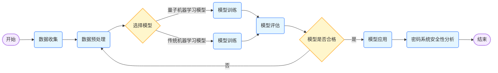

# 量子机器学习在密码系统安全性分析中的应用

> 关键词：量子机器学习、密码系统安全性分析、量子算法、机器学习模型、密码破解

> 摘要：本文深入探讨了量子机器学习在密码系统安全性分析中的应用。首先介绍了研究的背景、目的、预期读者、文档结构和相关术语。接着阐述了量子机器学习和密码系统安全性分析的核心概念及其联系，给出了相应的原理和架构示意图以及 Mermaid 流程图。详细讲解了核心算法原理，包括量子算法和机器学习算法，并给出 Python 源代码示例。通过数学模型和公式对密码系统安全性进行量化分析，并举例说明。在项目实战部分，展示了开发环境搭建、源代码实现和代码解读。分析了量子机器学习在密码系统安全性分析中的实际应用场景，推荐了相关的学习资源、开发工具框架和论文著作。最后总结了未来发展趋势与挑战，提供了常见问题解答和扩展阅读参考资料。

## 1. 背景介绍 
### 1.1 目的和范围
随着信息技术的飞速发展，密码系统在保障信息安全方面起着至关重要的作用。然而，传统的密码系统面临着来自量子计算的潜在威胁。量子机器学习作为量子计算与机器学习的交叉领域，为密码系统安全性分析提供了新的方法和视角。本文的目的是深入研究量子机器学习在密码系统安全性分析中的应用，探讨其原理、算法和实际应用场景，评估其对密码系统安全性的影响。

本文的范围涵盖了量子机器学习的基本概念、核心算法，密码系统安全性分析的基本原理，以及量子机器学习在密码系统安全性分析中的具体应用。同时，通过项目实战案例展示量子机器学习在实际中的应用，为相关研究和实践提供参考。

### 1.2 预期读者
本文预期读者包括计算机科学、信息安全、量子计算等领域的研究人员、工程师和学生。对于对量子机器学习和密码系统安全性分析感兴趣的技术爱好者，本文也提供了一个全面深入的学习资料。

### 1.3 文档结构概述
本文共分为十个部分。第一部分为背景介绍，包括目的和范围、预期读者、文档结构概述和术语表。第二部分阐述量子机器学习和密码系统安全性分析的核心概念及其联系，并给出相应的示意图和流程图。第三部分详细讲解核心算法原理，包括量子算法和机器学习算法，并给出 Python 源代码示例。第四部分通过数学模型和公式对密码系统安全性进行量化分析，并举例说明。第五部分为项目实战，展示开发环境搭建、源代码实现和代码解读。第六部分分析量子机器学习在密码系统安全性分析中的实际应用场景。第七部分推荐相关的学习资源、开发工具框架和论文著作。第八部分总结未来发展趋势与挑战。第九部分提供常见问题解答。第十部分给出扩展阅读参考资料。

### 1.4 术语表
#### 1.4.1 核心术语定义
- **量子机器学习**：将量子计算的原理和方法应用于机器学习领域，利用量子比特的叠加和纠缠特性，提高机器学习算法的效率和性能。
- **密码系统**：用于保护信息安全的一系列算法和协议，包括加密算法、解密算法、密钥管理等。
- **密码系统安全性分析**：评估密码系统抵抗各种攻击的能力，包括密码破解、密钥泄露等。
- **量子算法**：基于量子力学原理设计的算法，具有比经典算法更高的计算效率。
- **机器学习模型**：用于数据建模和预测的数学模型，包括神经网络、决策树、支持向量机等。

#### 1.4.2 相关概念解释
- **量子比特（qubit）**：量子计算中的基本信息单元，与经典比特不同，量子比特可以处于 0 和 1 的叠加态。
- **量子纠缠**：量子系统中多个量子比特之间的一种特殊关联，使得它们的状态相互依赖。
- **加密算法**：将明文转换为密文的算法，常用的加密算法有对称加密算法和非对称加密算法。
- **解密算法**：将密文转换为明文的算法，与加密算法相对应。
- **密钥**：加密和解密过程中使用的参数，密钥的安全性直接影响密码系统的安全性。

#### 1.4.3 缩略词列表
- **QC**：量子计算（Quantum Computing）
- **ML**：机器学习（Machine Learning）
- **QML**：量子机器学习（Quantum Machine Learning）
- **RSA**：一种非对称加密算法（Rivest–Shamir–Adleman）
- **AES**：一种对称加密算法（Advanced Encryption Standard）

## 2. 核心概念与联系 

### 2.1 量子机器学习的核心概念
量子机器学习结合了量子计算和机器学习的优势。量子计算利用量子比特的叠加和纠缠特性，能够在某些问题上实现指数级的加速。机器学习则是通过对大量数据的学习，构建模型来进行预测和决策。

量子机器学习的核心原理包括量子态的表示、量子算法的设计和量子测量。量子态可以用希尔伯特空间中的向量来表示，量子算法通过对量子态的操作来实现特定的计算任务，量子测量则是将量子态转换为经典信息。

### 2.2 密码系统安全性分析的核心概念
密码系统安全性分析主要关注密码系统抵抗各种攻击的能力。常见的攻击方式包括暴力攻击、差分攻击、线性攻击等。评估密码系统安全性的指标包括密钥空间大小、算法复杂度、抗攻击能力等。

### 2.3 量子机器学习与密码系统安全性分析的联系
量子机器学习为密码系统安全性分析提供了新的方法和工具。一方面，量子算法可以用于加速密码破解过程，对传统密码系统的安全性构成威胁。另一方面，机器学习模型可以用于分析密码系统的安全性，预测密码系统可能面临的攻击，以及评估密码系统的抗攻击能力。

### 2.4 核心概念原理和架构的文本示意图
```plaintext
量子机器学习
├── 量子计算
│   ├── 量子比特
│   ├── 量子叠加
│   ├── 量子纠缠
│   └── 量子算法
└── 机器学习
    ├── 数据预处理
    ├── 模型训练
    ├── 模型评估
    └── 模型应用

密码系统安全性分析
├── 密码系统
│   ├── 加密算法
│   ├── 解密算法
│   └── 密钥管理
└── 安全性评估
    ├── 密钥空间分析
    ├── 算法复杂度分析
    ├── 抗攻击能力分析
    └── 漏洞检测

量子机器学习在密码系统安全性分析中的应用
├── 密码破解加速
├── 安全性预测
├── 攻击模式识别
└── 密码系统优化
```

### 2.5 Mermaid 流程图


## 3. 核心算法原理 & 具体操作步骤 

### 3.1 量子算法原理
#### 3.1.1 量子搜索算法（Grover 算法）
Grover 算法是一种用于在无序数据库中搜索特定元素的量子算法。其核心思想是通过量子态的叠加和相位反转操作，将目标元素的概率振幅放大，从而提高搜索效率。

Grover 算法的步骤如下：
1. 初始化量子态：将所有量子比特初始化为叠加态。
2. 应用 Grover 迭代：重复应用 Grover 迭代操作，每次迭代包括相位反转和扩散操作。
3. 测量量子态：对量子态进行测量，得到目标元素的概率增大。

以下是 Grover 算法的 Python 代码示例，使用 Qiskit 库实现：
```python
from qiskit import QuantumCircuit, Aer, execute
from qiskit.visualization import plot_histogram
import matplotlib.pyplot as plt

# 定义数据库大小
n = 3
N = 2**n

# 创建量子电路
qc = QuantumCircuit(n, n)

# 初始化量子态
for qubit in range(n):
    qc.h(qubit)

# 定义 Oracle 函数
oracle_index = 3  # 目标元素的索引
oracle = QuantumCircuit(n)
oracle.x(oracle_index)
oracle.mct(list(range(n - 1)), n - 1)
oracle.x(oracle_index)

# 定义扩散算子
diffuser = QuantumCircuit(n)
for qubit in range(n):
    diffuser.h(qubit)
    diffuser.x(qubit)
diffuser.mct(list(range(n - 1)), n - 1)
for qubit in range(n):
    diffuser.x(qubit)
    diffuser.h(qubit)

# 应用 Grover 迭代
iterations = int((N**0.5) / 2)
for _ in range(iterations):
    qc.compose(oracle, inplace=True)
    qc.compose(diffuser, inplace=True)

# 测量量子态
qc.measure(range(n), range(n))

# 模拟量子电路
backend = Aer.get_backend('qasm_simulator')
job = execute(qc, backend, shots=1024)
result = job.result()
counts = result.get_counts(qc)

# 绘制结果直方图
plot_histogram(counts)
plt.show()
```

#### 3.1.2 量子因数分解算法（Shor 算法）
Shor 算法是一种用于分解大整数的量子算法，它可以在多项式时间内完成对大整数的因数分解，而经典算法的时间复杂度是指数级的。Shor 算法的核心思想是利用量子傅里叶变换和周期性查找来找到大整数的因数。

### 3.2 机器学习算法原理
#### 3.2.1 神经网络
神经网络是一种模仿人类神经系统的机器学习模型，由多个神经元组成的层构成。常见的神经网络包括多层感知机（MLP）、卷积神经网络（CNN）和循环神经网络（RNN）。

以下是一个简单的多层感知机的 Python 代码示例，使用 PyTorch 库实现：
```python
import torch
import torch.nn as nn
import torch.optim as optim

# 定义神经网络模型
class MLP(nn.Module):
    def __init__(self, input_size, hidden_size, output_size):
        super(MLP, self).__init__()
        self.fc1 = nn.Linear(input_size, hidden_size)
        self.relu = nn.ReLU()
        self.fc2 = nn.Linear(hidden_size, output_size)

    def forward(self, x):
        out = self.fc1(x)
        out = self.relu(out)
        out = self.fc2(out)
        return out

# 初始化模型
input_size = 10
hidden_size = 20
output_size = 2
model = MLP(input_size, hidden_size, output_size)

# 定义损失函数和优化器
criterion = nn.CrossEntropyLoss()
optimizer = optim.SGD(model.parameters(), lr=0.01)

# 训练模型
num_epochs = 100
for epoch in range(num_epochs):
    # 假设输入数据和标签
    inputs = torch.randn(32, input_size)
    labels = torch.randint(0, output_size, (32,))

    # 前向传播
    outputs = model(inputs)
    loss = criterion(outputs, labels)

    # 反向传播和优化
    optimizer.zero_grad()
    loss.backward()
    optimizer.step()

    if (epoch + 1) % 10 == 0:
        print(f'Epoch [{epoch+1}/{num_epochs}], Loss: {loss.item():.4f}')
```

#### 3.2.2 支持向量机（SVM）
支持向量机是一种用于分类和回归分析的监督学习模型。其核心思想是找到一个最优的超平面，将不同类别的数据分开，使得分类间隔最大。

### 3.3 量子机器学习算法原理
量子机器学习算法结合了量子算法和机器学习算法的优势。例如，量子支持向量机（QSVM）利用量子态的叠加和纠缠特性，提高了支持向量机的计算效率。

以下是一个简单的量子支持向量机的 Python 代码示例，使用 Qiskit Machine Learning 库实现：
```python
from qiskit import BasicAer
from qiskit.circuit.library import ZZFeatureMap
from qiskit.utils import QuantumInstance
from qiskit_machine_learning.algorithms import QSVC
from qiskit_machine_learning.kernels import QuantumKernel
import numpy as np

# 生成数据集
X = np.array([[0, 0], [0, 1], [1, 0], [1, 1]])
y = np.array([0, 1, 1, 0])

# 定义量子特征映射
feature_map = ZZFeatureMap(feature_dimension=2, reps=2)

# 定义量子核
backend = BasicAer.get_backend('statevector_simulator')
quantum_instance = QuantumInstance(backend)
quantum_kernel = QuantumKernel(feature_map=feature_map, quantum_instance=quantum_instance)

# 定义量子支持向量机
qsvc = QSVC(quantum_kernel=quantum_kernel)

# 训练模型
qsvc.fit(X, y)

# 预测
predictions = qsvc.predict(X)
print(predictions)
```

## 4. 数学模型和公式 & 详细讲解 & 举例说明 

### 4.1 量子态的数学表示
量子态可以用希尔伯特空间中的向量来表示。一个 $n$ 个量子比特的量子态可以表示为：
$$
|\psi\rangle = \sum_{i=0}^{2^n - 1} \alpha_i |i\rangle
$$
其中，$|i\rangle$ 是基态，$\alpha_i$ 是复数，满足 $\sum_{i=0}^{2^n - 1} |\alpha_i|^2 = 1$。

### 4.2 量子算法的数学原理
#### 4.2.1 Grover 算法的数学原理
Grover 算法的核心是相位反转和扩散操作。相位反转操作可以表示为：
$$
O = I - 2|x_0\rangle\langle x_0|
$$
其中，$|x_0\rangle$ 是目标元素的量子态。

扩散操作可以表示为：
$$
U_s = 2|s\rangle\langle s| - I
$$
其中，$|s\rangle = \frac{1}{\sqrt{2^n}} \sum_{i=0}^{2^n - 1} |i\rangle$ 是均匀叠加态。

Grover 迭代操作可以表示为：
$$
G = U_s O
$$

#### 4.2.2 Shor 算法的数学原理
Shor 算法的核心是量子傅里叶变换（QFT）。QFT 可以将一个量子态从计算基转换到傅里叶基：
$$
\text{QFT}|x\rangle = \frac{1}{\sqrt{2^n}} \sum_{y=0}^{2^n - 1} e^{2\pi i \frac{xy}{2^n}} |y\rangle
$$

### 4.3 机器学习模型的数学原理
#### 4.3.1 神经网络的数学原理
神经网络的前向传播可以表示为：
$$
\mathbf{h}^{(l)} = f^{(l)}(\mathbf{W}^{(l)} \mathbf{h}^{(l - 1)} + \mathbf{b}^{(l)})
$$
其中，$\mathbf{h}^{(l)}$ 是第 $l$ 层的输出，$\mathbf{W}^{(l)}$ 是第 $l$ 层的权重矩阵，$\mathbf{b}^{(l)}$ 是第 $l$ 层的偏置向量，$f^{(l)}$ 是第 $l$ 层的激活函数。

#### 4.3.2 支持向量机的数学原理
支持向量机的目标是找到一个最优的超平面：
$$
\mathbf{w}^T \mathbf{x} + b = 0
$$
使得分类间隔最大：
$$
\max_{\mathbf{w}, b} \frac{2}{\|\mathbf{w}\|}
$$
同时满足约束条件：
$$
y_i(\mathbf{w}^T \mathbf{x}_i + b) \geq 1, \quad i = 1, \ldots, n
$$

### 4.4 举例说明
#### 4.4.1 Grover 算法举例
假设我们有一个包含 4 个元素的无序数据库，目标元素的索引为 2。我们可以使用 Grover 算法来搜索该元素。

初始量子态为：
$$
|\psi_0\rangle = \frac{1}{2} (|0\rangle + |1\rangle + |2\rangle + |3\rangle)
$$

经过一次 Grover 迭代后，量子态变为：
$$
|\psi_1\rangle = G |\psi_0\rangle
$$

最终测量量子态，得到目标元素的概率增大。

#### 4.4.2 神经网络举例
假设我们有一个简单的二分类问题，输入数据的维度为 2，隐藏层的神经元个数为 3，输出层的神经元个数为 1。神经网络的前向传播过程可以表示为：
$$
\mathbf{h}^{(1)} = f^{(1)}(\mathbf{W}^{(1)} \mathbf{x} + \mathbf{b}^{(1)})
$$
$$
\hat{y} = f^{(2)}(\mathbf{W}^{(2)} \mathbf{h}^{(1)} + \mathbf{b}^{(2)})
$$
其中，$\mathbf{x}$ 是输入数据，$\hat{y}$ 是预测结果。

## 5. 项目实战：代码实际案例和详细解释说明 

### 5.1  开发环境搭建
#### 5.1.1 安装 Python
首先，确保你已经安装了 Python 3.6 或更高版本。你可以从 Python 官方网站（https://www.python.org/downloads/）下载并安装 Python。

#### 5.1.2 安装必要的库
在命令行中使用以下命令安装必要的库：
```sh
pip install qiskit qiskit-machine-learning torch numpy matplotlib
```

### 5.2  源代码详细实现和代码解读
#### 5.2.1 量子机器学习模型实现
以下是一个使用量子支持向量机进行密码系统安全性分类的代码示例：
```python
from qiskit import BasicAer
from qiskit.circuit.library import ZZFeatureMap
from qiskit.utils import QuantumInstance
from qiskit_machine_learning.algorithms import QSVC
from qiskit_machine_learning.kernels import QuantumKernel
import numpy as np
from sklearn.model_selection import train_test_split
from sklearn.metrics import accuracy_score

# 生成数据集
# 假设我们有一些密码系统的特征数据和对应的安全性标签
X = np.random.randn(100, 5)  # 100 个样本，每个样本有 5 个特征
y = np.random.randint(0, 2, 100)  # 安全性标签，0 表示不安全，1 表示安全

# 划分训练集和测试集
X_train, X_test, y_train, y_test = train_test_split(X, y, test_size=0.2, random_state=42)

# 定义量子特征映射
feature_map = ZZFeatureMap(feature_dimension=5, reps=2)

# 定义量子核
backend = BasicAer.get_backend('statevector_simulator')
quantum_instance = QuantumInstance(backend)
quantum_kernel = QuantumKernel(feature_map=feature_map, quantum_instance=quantum_instance)

# 定义量子支持向量机
qsvc = QSVC(quantum_kernel=quantum_kernel)

# 训练模型
qsvc.fit(X_train, y_train)

# 预测
y_pred = qsvc.predict(X_test)

# 计算准确率
accuracy = accuracy_score(y_test, y_pred)
print(f'Accuracy: {accuracy}')
```

#### 5.2.2 代码解读
1. **数据生成和划分**：使用 `numpy` 生成随机的密码系统特征数据和对应的安全性标签，并使用 `sklearn` 的 `train_test_split` 函数将数据划分为训练集和测试集。
2. **量子特征映射**：使用 `ZZFeatureMap` 定义量子特征映射，将经典数据映射到量子态。
3. **量子核**：使用 `QuantumKernel` 定义量子核，用于计算样本之间的相似度。
4. **量子支持向量机**：使用 `QSVC` 定义量子支持向量机模型，并使用训练集进行训练。
5. **预测和评估**：使用训练好的模型对测试集进行预测，并使用 `accuracy_score` 计算预测准确率。

### 5.3  代码解读与分析
#### 5.3.1 量子机器学习模型的优势
量子机器学习模型利用量子态的叠加和纠缠特性，能够在某些问题上实现指数级的加速，提高模型的计算效率和性能。

#### 5.3.2 可能存在的问题
目前，量子计算机的硬件还不够成熟，量子比特的数量和稳定性有限，导致量子机器学习模型的应用受到一定的限制。此外，量子算法的设计和实现也比较复杂，需要专业的知识和技能。

## 6. 实际应用场景 
### 6.1 密码破解加速
量子算法如 Grover 算法和 Shor 算法可以用于加速密码破解过程。例如，Shor 算法可以在多项式时间内完成对大整数的因数分解，从而对基于大整数分解的非对称加密算法（如 RSA）构成威胁。

### 6.2 安全性预测
机器学习模型可以用于分析密码系统的安全性，预测密码系统可能面临的攻击。通过对大量的密码系统数据进行学习，模型可以发现潜在的安全漏洞和攻击模式，提前采取措施进行防范。

### 6.3 攻击模式识别
量子机器学习可以用于识别密码系统中的攻击模式。通过对攻击数据的学习，模型可以准确地识别出不同类型的攻击，如暴力攻击、差分攻击等，并及时发出警报。

### 6.4 密码系统优化
量子机器学习可以用于优化密码系统的设计。通过对密码系统的性能和安全性进行评估，模型可以提出改进建议，提高密码系统的抗攻击能力和效率。

## 7. 工具和资源推荐
### 7.1 学习资源推荐
#### 7.1.1 书籍推荐
- 《量子计算与量子信息》（Quantum Computation and Quantum Information）：由 Michael A. Nielsen 和 Isaac L. Chuang 所著，是量子计算领域的经典教材。
- 《机器学习》（Machine Learning）：由 Tom M. Mitchell 所著，是机器学习领域的经典教材。
- 《量子机器学习》（Quantum Machine Learning）：由 Vedran Dunjko 和 Hans J. Briegel 所著，介绍了量子机器学习的基本概念和算法。

#### 7.1.2 在线课程
- Coursera 上的“量子计算基础”（Fundamentals of Quantum Computation）课程，由马里兰大学提供。
- edX 上的“机器学习导论”（Introduction to Machine Learning）课程，由麻省理工学院提供。
- Qiskit 官方提供的量子计算和量子机器学习教程。

#### 7.1.3 技术博客和网站
- Quantum Computing Report：提供量子计算领域的最新消息和技术文章。
- Towards Data Science：提供机器学习和数据科学领域的技术文章和教程。
- Qiskit 官方博客：提供量子计算和量子机器学习的最新进展和应用案例。

### 7.2 开发工具框架推荐
#### 7.2.1 IDE和编辑器
- PyCharm：一款专业的 Python 集成开发环境，提供代码编辑、调试、版本控制等功能。
- Jupyter Notebook：一种交互式的编程环境，适合进行数据探索和模型开发。
- Visual Studio Code：一款轻量级的代码编辑器，支持多种编程语言和插件扩展。

#### 7.2.2 调试和性能分析工具
- Qiskit Aer：Qiskit 提供的量子模拟器，用于调试和测试量子电路。
- PyTorch Profiler：PyTorch 提供的性能分析工具，用于分析模型的运行时间和内存使用情况。
- TensorBoard：TensorFlow 提供的可视化工具，用于监控模型的训练过程和性能指标。

#### 7.2.3 相关框架和库
- Qiskit：IBM 开发的开源量子计算框架，提供量子电路设计、模拟和执行等功能。
- PyTorch：Facebook 开发的深度学习框架，提供张量计算、自动求导和神经网络等功能。
- Scikit-learn：一个简单易用的机器学习库，提供分类、回归、聚类等多种机器学习算法。

### 7.3 相关论文著作推荐
#### 7.3.1 经典论文
- "Quantum Computing Algorithms: Shor and Grover"：由 Peter W. Shor 和 Lov K. Grover 等人撰写，介绍了 Shor 算法和 Grover 算法的原理和应用。
- "Support-Vector Networks"：由 Corinna Cortes 和 Vladimir Vapnik 撰写，是支持向量机领域的经典论文。
- "A Logical Calculus of the Ideas Immanent in Nervous Activity"：由 Warren S. McCulloch 和 Walter Pitts 撰写，是神经网络领域的奠基性论文。

#### 7.3.2 最新研究成果
- 关注 Nature、Science、Physical Review Letters 等顶级学术期刊上关于量子计算和机器学习的最新研究成果。
- 参加国际量子计算和机器学习会议，如 Quantum Computing and Machine Learning Conference（QML），了解最新的研究动态。

#### 7.3.3 应用案例分析
- 研究 IBM、Google 等公司在量子计算和密码系统安全性分析方面的应用案例，学习他们的实践经验和技术方案。

## 8. 总结：未来发展趋势与挑战
### 8.1 未来发展趋势
- **量子计算机硬件的发展**：随着量子计算机硬件技术的不断进步，量子比特的数量和稳定性将不断提高，为量子机器学习在密码系统安全性分析中的应用提供更强大的计算能力。
- **量子机器学习算法的创新**：研究人员将不断探索新的量子机器学习算法，提高算法的效率和性能，为密码系统安全性分析提供更有效的方法。
- **跨学科研究的深入**：量子机器学习涉及量子物理、计算机科学、数学等多个学科，未来跨学科研究将更加深入，推动量子机器学习在密码系统安全性分析中的应用。

### 8.2 挑战
- **量子噪声和误差**：量子计算机容易受到噪声和误差的影响，导致计算结果不准确。如何有效地减少量子噪声和误差，是量子机器学习在密码系统安全性分析中面临的一个重要挑战。
- **数据隐私和安全**：在使用量子机器学习进行密码系统安全性分析时，需要处理大量的敏感数据，如何保证数据的隐私和安全是一个关键问题。
- **人才短缺**：量子机器学习是一个新兴的交叉领域，需要具备量子物理、计算机科学、数学等多方面知识的专业人才。目前，相关领域的人才短缺，限制了量子机器学习在密码系统安全性分析中的应用和发展。

## 9. 附录：常见问题与解答
### 9.1 量子机器学习是否可以完全取代传统机器学习？
目前来看，量子机器学习还不能完全取代传统机器学习。虽然量子机器学习在某些问题上具有优势，但量子计算机的硬件还不够成熟，量子算法的设计和实现也比较复杂。传统机器学习在许多实际应用中仍然具有重要的地位，未来量子机器学习和传统机器学习可能会相互补充，共同发展。

### 9.2 量子机器学习对密码系统的安全性是威胁还是机遇？
量子机器学习对密码系统的安全性既是威胁也是机遇。一方面，量子算法如 Shor 算法可以用于加速密码破解过程，对传统密码系统的安全性构成威胁。另一方面，量子机器学习可以用于分析密码系统的安全性，预测密码系统可能面临的攻击，以及优化密码系统的设计，为密码系统的安全性提供保障。

### 9.3 学习量子机器学习需要具备哪些基础知识？
学习量子机器学习需要具备一定的量子物理、线性代数、概率论和机器学习等基础知识。建议先学习量子计算和机器学习的基础课程，掌握相关的概念和算法，再深入学习量子机器学习的理论和应用。

## 10. 扩展阅读 & 参考资料
- Nielsen, M. A., & Chuang, I. L. (2000). Quantum Computation and Quantum Information. Cambridge University Press.
- Mitchell, T. M. (1997). Machine Learning. McGraw-Hill.
- Dunjko, V., & Briegel, H. J. (2018). Quantum Machine Learning. Reviews of Modern Physics, 90(2), 025002.
- Shor, P. W. (1994). Algorithms for quantum computation: Discrete logarithms and factoring. Proceedings of the 35th Annual Symposium on Foundations of Computer Science, 124-134.
- Grover, L. K. (1996). A fast quantum mechanical algorithm for database search. Proceedings of the Twenty-Eighth Annual ACM Symposium on Theory of Computing, 212-219.
- Cortes, C., & Vapnik, V. (1995). Support-Vector Networks. Machine Learning, 20(3), 273-297.
- McCulloch, W. S., & Pitts, W. (1943). A logical calculus of the ideas immanent in nervous activity. The bulletin of mathematical biophysics, 5(4), 115-133.

作者：AI天才研究院/AI Genius Institute & 禅与计算机程序设计艺术 /Zen And The Art of Computer Programming