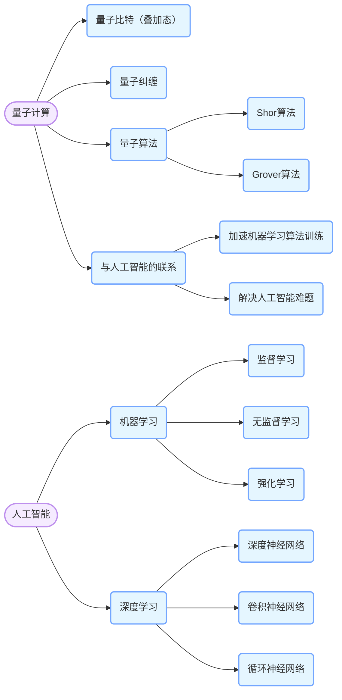

# 量子计算在AI中的潜在应用

> 关键词：量子计算、人工智能、潜在应用、量子算法、机器学习

> 摘要：本文深入探讨了量子计算在人工智能领域的潜在应用。首先介绍了量子计算和人工智能的背景知识，包括目的和范围、预期读者、文档结构概述以及相关术语。接着阐述了量子计算和人工智能的核心概念与联系，并给出了相应的文本示意图和Mermaid流程图。详细讲解了核心算法原理，用Python代码进行说明，同时介绍了相关的数学模型和公式。通过项目实战展示了量子计算在AI中的具体应用，包括开发环境搭建、源代码实现和代码解读。分析了量子计算在AI中的实际应用场景，推荐了相关的学习资源、开发工具框架和论文著作。最后总结了未来发展趋势与挑战，解答了常见问题，并提供了扩展阅读和参考资料。

## 1. 背景介绍 
### 1.1 目的和范围
本文章的目的在于全面深入地探讨量子计算在人工智能领域中的潜在应用。随着科技的飞速发展，量子计算作为一种新兴的计算范式，展现出了强大的计算能力和独特的特性。而人工智能则在各个领域取得了广泛的应用和显著的成果。研究量子计算在AI中的潜在应用，有助于我们探索新的计算方法和技术，为AI的发展带来新的突破和机遇。本文的范围涵盖了量子计算和人工智能的基本概念、核心算法、数学模型、实际应用场景以及相关的工具和资源等方面。

### 1.2 预期读者
本文预期读者包括对量子计算和人工智能领域感兴趣的科研人员、工程师、学生以及相关领域的从业者。对于科研人员来说，本文可以为他们的研究提供新的思路和方向；工程师可以从中获取关于量子计算在AI中应用的技术细节和实践经验；学生可以通过阅读本文了解该领域的前沿知识，激发他们的学习兴趣；相关领域的从业者则可以了解量子计算对其所在行业的潜在影响和发展趋势。

### 1.3 文档结构概述
本文共分为十个部分。第一部分是背景介绍，包括目的和范围、预期读者、文档结构概述以及术语表。第二部分阐述了量子计算和人工智能的核心概念与联系，并给出了相应的文本示意图和Mermaid流程图。第三部分详细讲解了核心算法原理，用Python代码进行说明。第四部分介绍了相关的数学模型和公式，并进行了详细讲解和举例说明。第五部分通过项目实战展示了量子计算在AI中的具体应用，包括开发环境搭建、源代码实现和代码解读。第六部分分析了量子计算在AI中的实际应用场景。第七部分推荐了相关的学习资源、开发工具框架和论文著作。第八部分总结了未来发展趋势与挑战。第九部分解答了常见问题。第十部分提供了扩展阅读和参考资料。

### 1.4 术语表
#### 1.4.1 核心术语定义
- **量子计算**：基于量子力学原理的计算方式，利用量子比特（qubit）来存储和处理信息。量子比特可以同时处于多个状态的叠加态，这使得量子计算机在某些问题上具有比经典计算机更高的计算效率。
- **人工智能**：研究如何使计算机系统能够执行通常需要人类智能才能完成的任务，如学习、推理、感知、语言理解等。
- **量子比特（qubit）**：量子计算中的基本信息单位，与经典比特（0或1）不同，量子比特可以同时处于0和1的叠加态。
- **量子纠缠**：量子系统中多个量子比特之间的一种特殊关联，使得一个量子比特的状态会瞬间影响其他量子比特的状态，无论它们之间的距离有多远。
- **机器学习**：人工智能的一个分支，研究如何让计算机通过数据学习模式和规律，从而进行预测和决策。

#### 1.4.2 相关概念解释
- **量子门**：类似于经典计算机中的逻辑门，用于对量子比特进行操作和变换。常见的量子门包括Hadamard门、Pauli门等。
- **量子算法**：专门为量子计算机设计的算法，利用量子计算的特性来解决特定的问题，如Shor算法用于整数分解，Grover算法用于搜索未排序数据库。
- **神经网络**：一种模仿人类神经系统的计算模型，由大量的神经元组成，用于处理和分析复杂的数据。
- **深度学习**：机器学习的一个子领域，使用深度神经网络来学习数据的深层次特征和表示。

#### 1.4.3 缩略词列表
- **AI**：人工智能（Artificial Intelligence）
- **QC**：量子计算（Quantum Computing）
- **qubit**：量子比特（Quantum Bit）
- **ML**：机器学习（Machine Learning）
- **DNN**：深度神经网络（Deep Neural Network）

## 2. 核心概念与联系 

### 量子计算核心概念
量子计算是基于量子力学原理的计算方式。其核心在于量子比特（qubit），与经典比特只能处于0或1状态不同，量子比特可以处于0和1的叠加态，即一个量子比特可以同时表示0和1。例如，一个由n个量子比特组成的系统可以同时处于$2^n$个状态的叠加态，这使得量子计算机在理论上具有比经典计算机指数级的计算能力提升。

量子纠缠也是量子计算中的重要概念。当多个量子比特处于纠缠态时，它们之间存在一种特殊的关联，对其中一个量子比特的测量会瞬间影响其他纠缠量子比特的状态，无论它们之间的距离有多远。这种特性可以用于实现高效的量子通信和量子计算。

### 人工智能核心概念
人工智能是研究如何使计算机系统能够执行通常需要人类智能才能完成的任务。机器学习是人工智能的一个重要分支，它通过让计算机从数据中学习模式和规律，从而进行预测和决策。深度学习则是机器学习的一个子领域，使用深度神经网络来学习数据的深层次特征和表示。

神经网络由大量的神经元组成，这些神经元通过连接权重相互作用。在训练过程中，通过调整连接权重，使得神经网络能够对输入数据进行准确的分类或预测。

### 量子计算与人工智能的联系
量子计算可以为人工智能带来多方面的提升。首先，在数据处理方面，量子计算的强大计算能力可以加速机器学习算法的训练过程。例如，对于大规模数据集的处理和分析，量子计算机可以在更短的时间内完成。其次，量子算法可以为人工智能中的一些难题提供新的解决方案。例如，量子搜索算法可以在未排序的数据集中更快地找到目标元素，这对于信息检索和推荐系统具有重要意义。

下面是量子计算与人工智能联系的文本示意图：

```plaintext
量子计算
|-- 量子比特（叠加态）
|-- 量子纠缠
|-- 量子算法（Shor算法、Grover算法等）
|
|-- 与人工智能的联系
    |-- 加速机器学习算法训练
    |-- 解决人工智能难题
    |
人工智能
|-- 机器学习
|   |-- 监督学习
|   |-- 无监督学习
|   |-- 强化学习
|
|-- 深度学习
    |-- 深度神经网络
    |-- 卷积神经网络
    |-- 循环神经网络
```

下面是对应的Mermaid流程图：



## 3. 核心算法原理 & 具体操作步骤 

### Grover算法原理
Grover算法是一种量子搜索算法，用于在未排序的数据集中找到目标元素。经典算法在未排序的数据集中搜索目标元素的时间复杂度为$O(N)$，其中$N$是数据集的大小。而Grover算法的时间复杂度为$O(\sqrt{N})$，在大数据集上具有显著的优势。

Grover算法的核心思想是通过多次迭代操作，放大目标元素的概率振幅，同时减小非目标元素的概率振幅。具体步骤如下：
1. **初始化**：将所有量子比特初始化为叠加态。
2. **Oracle操作**：通过一个Oracle函数，将目标元素的相位反转。
3. **扩散操作**：对所有量子比特进行扩散操作，进一步放大目标元素的概率振幅。
4. **重复步骤2和3**：多次重复Oracle操作和扩散操作，直到目标元素的概率振幅足够大。
5. **测量**：对所有量子比特进行测量，得到目标元素。

下面是使用Python和Qiskit库实现Grover算法的示例代码：

```python
from qiskit import QuantumCircuit, Aer, execute
from qiskit.visualization import plot_histogram
import math

# 定义数据集大小
n = 2
N = 2**n

# 计算迭代次数
iterations = int(math.pi/4 * math.sqrt(N))

# 创建量子电路
qc = QuantumCircuit(n, n)

# 初始化量子比特为叠加态
for qubit in range(n):
    qc.h(qubit)

# 定义Oracle函数
def oracle(qc, n):
    # 假设目标元素为|11>
    qc.cz(0, 1)

# 定义扩散操作
def diffusion(qc, n):
    for qubit in range(n):
        qc.h(qubit)
        qc.x(qubit)
    qc.cz(0, 1)
    for qubit in range(n):
        qc.x(qubit)
        qc.h(qubit)

# 重复Oracle操作和扩散操作
for _ in range(iterations):
    oracle(qc, n)
    diffusion(qc, n)

# 测量量子比特
for qubit in range(n):
    qc.measure(qubit, qubit)

# 模拟量子电路
backend = Aer.get_backend('qasm_simulator')
job = execute(qc, backend, shots=1024)
result = job.result()
counts = result.get_counts(qc)

# 绘制测量结果
plot_histogram(counts).show()
```

### Shor算法原理
Shor算法是一种量子算法，用于整数分解。在经典计算机上，整数分解是一个困难的问题，其时间复杂度是指数级的。而Shor算法可以在多项式时间内完成整数分解，这对于密码学具有重要的影响。

Shor算法的核心思想是将整数分解问题转化为寻找一个函数的周期问题。具体步骤如下：
1. **随机选择一个整数$a$**：满足$1 < a < N$，其中$N$是要分解的整数。
2. **计算最大公约数$gcd(a, N)$**：如果$gcd(a, N) > 1$，则$gcd(a, N)$是$N$的一个因子，算法结束。否则，继续下一步。
3. **使用量子电路计算函数$f(x) = a^x \mod N$的周期$r$**：通过量子傅里叶变换，可以高效地计算函数的周期。
4. **检查周期$r$**：如果$r$是偶数且$a^{r/2} \neq -1 \mod N$，则$p = gcd(a^{r/2} + 1, N)$和$q = gcd(a^{r/2} - 1, N)$是$N$的两个因子，算法结束。否则，返回步骤1。

下面是使用Python和Qiskit库实现Shor算法的示例代码：

```python
from qiskit import QuantumCircuit, Aer, execute
from qiskit.visualization import plot_histogram
import math

# 要分解的整数
N = 15

# 随机选择一个整数a
a = 2

# 计算最大公约数
from math import gcd
if gcd(a, N) > 1:
    print(f"找到因子: {gcd(a, N)}")
else:
    # 定义量子电路的位数
    n_count = 8

    # 创建量子电路
    qc = QuantumCircuit(n_count + 4, n_count)

    # 初始化量子比特为叠加态
    for qubit in range(n_count):
        qc.h(qubit)

    # 定义受控乘法门
    def c_amod15(a, power):
        if a not in [2, 4, 7, 8, 11, 13]:
            raise ValueError("'a' must be 2, 4, 7, 8, 11 or 13")
        U = QuantumCircuit(4)        
        for iteration in range(power):
            if a in [2, 13]:
                U.swap(0, 1)
                U.swap(1, 2)
                U.swap(2, 3)
            if a in [7, 8]:
                U.swap(2, 3)
                U.swap(1, 2)
                U.swap(0, 1)
            if a in [4, 11]:
                U.swap(1, 3)
                U.swap(0, 2)
            if a in [7, 11, 13]:
                for q in range(4):
                    U.x(q)
        U = U.to_gate()
        U.name = f"{a}^{power} mod 15"
        c_U = U.control()
        return c_U

    # 应用受控乘法门
    for q in range(n_count):
        qc.append(c_amod15(a, 2**q), [q] + list(range(n_count, n_count+4)))

    # 定义量子傅里叶变换
    def qft_dagger(n):
        qc = QuantumCircuit(n)
        for qubit in range(n//2):
            qc.swap(qubit, n-qubit-1)
        for j in range(n):
            for m in range(j):
                qc.cp(-math.pi/float(2**(j-m)), m, j)
            qc.h(j)
        qc.name = "QFT†"
        return qc

    # 应用量子傅里叶变换
    qc.append(qft_dagger(n_count), range(n_count))

    # 测量量子比特
    qc.measure(range(n_count), range(n_count))

    # 模拟量子电路
    backend = Aer.get_backend('qasm_simulator')
    job = execute(qc, backend, shots=1024)
    result = job.result()
    counts = result.get_counts(qc)

    # 绘制测量结果
    plot_histogram(counts).show()
```

## 4. 数学模型和公式 & 详细讲解 & 举例说明 

### 量子比特的数学表示
量子比特可以用二维复向量空间中的向量来表示。一个量子比特的状态可以表示为：

$$|\psi\rangle = \alpha|0\rangle + \beta|1\rangle$$

其中，$\alpha$和$\beta$是复数，满足$|\alpha|^2 + |\beta|^2 = 1$。$|0\rangle$和$|1\rangle$是量子比特的基态，分别对应经典比特的0和1。

例如，当$\alpha = \frac{1}{\sqrt{2}}$，$\beta = \frac{1}{\sqrt{2}}$时，量子比特处于$|0\rangle$和$|1\rangle$的等概率叠加态：

$$|\psi\rangle = \frac{1}{\sqrt{2}}|0\rangle + \frac{1}{\sqrt{2}}|1\rangle$$

### 量子门的数学表示
量子门可以用矩阵来表示。例如，Hadamard门的矩阵表示为：

$$H = \frac{1}{\sqrt{2}}\begin{bmatrix}1 & 1 \\ 1 & -1\end{bmatrix}$$

当Hadamard门作用于一个量子比特时，其状态会发生变化。例如，当$H$作用于$|0\rangle$时：

$$H|0\rangle = \frac{1}{\sqrt{2}}\begin{bmatrix}1 & 1 \\ 1 & -1\end{bmatrix}\begin{bmatrix}1 \\ 0\end{bmatrix} = \frac{1}{\sqrt{2}}\begin{bmatrix}1 \\ 1\end{bmatrix} = \frac{1}{\sqrt{2}}|0\rangle + \frac{1}{\sqrt{2}}|1\rangle$$

### Grover算法的数学原理
Grover算法的核心是通过多次迭代操作，放大目标元素的概率振幅。设数据集的大小为$N = 2^n$，其中$n$是量子比特的数量。初始时，所有量子比特处于等概率叠加态：

$$|\psi_0\rangle = \frac{1}{\sqrt{N}}\sum_{x=0}^{N-1}|x\rangle$$

Oracle操作可以表示为一个对角矩阵$O$，其中目标元素的相位反转：

$$O = I - 2|t\rangle\langle t|$$

其中，$|t\rangle$是目标元素的状态。

扩散操作可以表示为：

$$D = 2|\psi_0\rangle\langle\psi_0| - I$$

经过一次Oracle操作和扩散操作后，量子比特的状态变为：

$$|\psi_1\rangle = D O |\psi_0\rangle$$

通过多次迭代操作，可以不断放大目标元素的概率振幅。

### Shor算法的数学原理
Shor算法的核心是寻找函数$f(x) = a^x \mod N$的周期$r$。设$N$是要分解的整数，$a$是随机选择的整数。通过量子傅里叶变换，可以高效地计算函数的周期。

量子傅里叶变换的定义为：

$$QFT|x\rangle = \frac{1}{\sqrt{N}}\sum_{y=0}^{N-1}e^{2\pi i xy/N}|y\rangle$$

在Shor算法中，通过对函数$f(x)$进行量子计算，得到一个叠加态：

$$|\psi\rangle = \frac{1}{\sqrt{M}}\sum_{x=0}^{M-1}|x\rangle|f(x)\rangle$$

其中，$M$是一个足够大的整数。对第一个寄存器进行测量，得到一个值$x_0$，此时第二个寄存器的状态为$|f(x_0)\rangle$。由于$f(x)$是周期函数，所以第二个寄存器的状态是多个周期内相同值的叠加。对第一个寄存器进行量子傅里叶变换，然后测量，可以得到一个与周期$r$相关的值$y$。通过对$y$进行连分数展开，可以得到周期$r$的近似值。

## 5. 项目实战：代码实际案例和详细解释说明 

### 5.1  开发环境搭建
要进行量子计算在AI中的项目实战，需要搭建相应的开发环境。以下是具体步骤：

#### 安装Python
首先，需要安装Python。可以从Python官方网站（https://www.python.org/downloads/）下载适合自己操作系统的Python版本，并按照安装向导进行安装。

#### 安装Qiskit
Qiskit是一个开源的量子计算框架，提供了丰富的工具和库，用于开发和模拟量子算法。可以使用pip命令来安装Qiskit：

```bash
pip install qiskit
```

#### 安装其他依赖库
根据具体的项目需求，可能还需要安装其他依赖库，如NumPy、Matplotlib等。可以使用pip命令来安装这些库：

```bash
pip install numpy matplotlib
```

### 5.2  源代码详细实现和代码解读
以下是一个使用量子计算加速机器学习算法的示例项目。我们将使用量子模拟退火算法来解决一个简单的优化问题。

```python
import numpy as np
import matplotlib.pyplot as plt
from qiskit import QuantumCircuit, Aer, execute
from qiskit.visualization import plot_histogram

# 定义目标函数
def objective_function(x):
    return (x - 2)**2

# 定义量子模拟退火算法
def quantum_simulated_annealing(num_qubits, num_iterations, temperature):
    # 创建量子电路
    qc = QuantumCircuit(num_qubits, num_qubits)

    # 初始化量子比特为叠加态
    for qubit in range(num_qubits):
        qc.h(qubit)

    # 迭代执行量子模拟退火
    for _ in range(num_iterations):
        # 随机选择一个量子比特进行翻转
        qubit_to_flip = np.random.randint(0, num_qubits)
        qc.x(qubit_to_flip)

        # 计算目标函数值
        backend = Aer.get_backend('qasm_simulator')
        job = execute(qc, backend, shots=1024)
        result = job.result()
        counts = result.get_counts(qc)
        most_common = max(counts, key=counts.get)
        x = int(most_common, 2)
        current_energy = objective_function(x)

        # 翻转量子比特
        qc.x(qubit_to_flip)

        # 计算新的目标函数值
        job = execute(qc, backend, shots=1024)
        result = job.result()
        counts = result.get_counts(qc)
        most_common = max(counts, key=counts.get)
        new_x = int(most_common, 2)
        new_energy = objective_function(new_x)

        # 计算能量差
        delta_energy = new_energy - current_energy

        # 判断是否接受新状态
        if delta_energy < 0 or np.random.rand() < np.exp(-delta_energy / temperature):
            qc.x(qubit_to_flip)

        # 降低温度
        temperature *= 0.9

    # 测量量子比特
    qc.measure(range(num_qubits), range(num_qubits))

    # 模拟量子电路
    backend = Aer.get_backend('qasm_simulator')
    job = execute(qc, backend, shots=1024)
    result = job.result()
    counts = result.get_counts(qc)

    return counts

# 运行量子模拟退火算法
num_qubits = 3
num_iterations = 100
temperature = 10.0
counts = quantum_simulated_annealing(num_qubits, num_iterations, temperature)

# 绘制测量结果
plot_histogram(counts).show()

# 找到最优解
most_common = max(counts, key=counts.get)
optimal_x = int(most_common, 2)
optimal_energy = objective_function(optimal_x)
print(f"最优解: x = {optimal_x}, 能量 = {optimal_energy}")
```

### 5.3  代码解读与分析
#### 目标函数
```python
def objective_function(x):
    return (x - 2)**2
```
这个函数定义了我们要优化的目标函数。在这个例子中，目标函数是一个简单的二次函数，其最小值在$x = 2$处取得。

#### 量子模拟退火算法
```python
def quantum_simulated_annealing(num_qubits, num_iterations, temperature):
   ...
```
这个函数实现了量子模拟退火算法。具体步骤如下：
1. **初始化量子电路**：创建一个包含`num_qubits`个量子比特的量子电路，并将所有量子比特初始化为叠加态。
2. **迭代执行量子模拟退火**：在每次迭代中，随机选择一个量子比特进行翻转，计算翻转前后的目标函数值，根据能量差和温度判断是否接受新状态。如果接受新状态，则翻转量子比特；否则，保持原状态。然后降低温度。
3. **测量量子比特**：在迭代结束后，对所有量子比特进行测量，得到测量结果。
4. **返回测量结果**：返回测量结果的统计信息。

#### 运行量子模拟退火算法
```python
num_qubits = 3
num_iterations = 100
temperature = 10.0
counts = quantum_simulated_annealing(num_qubits, num_iterations, temperature)
```
这段代码设置了量子模拟退火算法的参数，包括量子比特数、迭代次数和初始温度，并调用`quantum_simulated_annealing`函数运行算法，得到测量结果的统计信息。

#### 找到最优解
```python
most_common = max(counts, key=counts.get)
optimal_x = int(most_common, 2)
optimal_energy = objective_function(optimal_x)
print(f"最优解: x = {optimal_x}, 能量 = {optimal_energy}")
```
这段代码从测量结果中找到出现次数最多的状态，将其转换为十进制数作为最优解，并计算最优解对应的目标函数值。

## 6. 实际应用场景 
### 机器学习算法加速
量子计算可以显著加速机器学习算法的训练过程。例如，在大规模数据集上进行线性回归、逻辑回归等算法的训练时，量子计算机可以利用其强大的计算能力，在更短的时间内完成计算。此外，量子算法还可以用于解决机器学习中的一些难题，如特征选择、模型优化等。

### 自然语言处理
在自然语言处理领域，量子计算可以用于文本分类、情感分析、机器翻译等任务。例如，量子搜索算法可以在大规模的文本数据集中快速找到相关的信息，提高信息检索的效率。量子神经网络可以学习文本数据的深层次特征和表示，提高自然语言处理的准确性和性能。

### 图像识别
量子计算可以为图像识别带来新的突破。量子算法可以加速图像特征提取和匹配的过程，提高图像识别的速度和准确性。此外，量子神经网络可以学习图像数据的复杂模式和结构，用于图像分类、目标检测等任务。

### 药物研发
在药物研发领域，量子计算可以用于分子模拟和药物设计。量子计算机可以模拟分子的量子态和相互作用，帮助科学家更好地理解分子的性质和行为。这对于发现新的药物靶点、设计高效的药物分子具有重要意义。

### 金融风险分析
量子计算可以用于金融风险分析和投资组合优化。量子算法可以处理大规模的金融数据，分析市场趋势和风险因素，帮助投资者做出更明智的决策。此外，量子计算还可以用于优化投资组合，提高投资回报率。

## 7. 工具和资源推荐
### 7.1 学习资源推荐
#### 7.1.1 书籍推荐
- 《量子计算与量子信息》（*Quantum Computation and Quantum Information*）：这是一本经典的量子计算教材，由Michael A. Nielsen和Isaac L. Chuang所著，全面介绍了量子计算和量子信息的基本概念、理论和算法。
- 《人工智能：一种现代的方法》（*Artificial Intelligence: A Modern Approach*）：这是一本权威的人工智能教材，由Stuart Russell和Peter Norvig所著，涵盖了人工智能的各个领域，包括机器学习、自然语言处理、计算机视觉等。
- 《深度学习》（*Deep Learning*）：这是一本深度学习领域的经典著作，由Ian Goodfellow、Yoshua Bengio和Aaron Courville所著，详细介绍了深度学习的基本原理、算法和应用。

#### 7.1.2 在线课程
- Coursera上的“量子计算基础”（*Fundamentals of Quantum Computation*）课程：该课程由马里兰大学提供，介绍了量子计算的基本概念、量子比特、量子门等内容。
- edX上的“人工智能基础”（*Introduction to Artificial Intelligence*）课程：该课程由伯克利大学提供，涵盖了人工智能的基本概念、搜索算法、机器学习等内容。
- Udemy上的“深度学习实战”（*Deep Learning A-Z™: Hands-On Artificial Neural Networks*）课程：该课程由Kiril Eremenko和Hadelin de Ponteves所教，通过实际项目介绍了深度学习的应用。

#### 7.1.3 技术博客和网站
- Qiskit官方博客（https://qiskit.org/blog/）：提供了关于量子计算的最新研究成果、技术文章和案例分析。
- Towards Data Science（https://towardsdatascience.com/）：一个专注于数据科学和人工智能的技术博客，提供了大量的技术文章和教程。
- arXiv（https://arxiv.org/）：一个预印本数据库，包含了大量的量子计算和人工智能领域的研究论文。

### 7.2 开发工具框架推荐
#### 7.2.1 IDE和编辑器
- PyCharm：一个功能强大的Python集成开发环境，提供了代码编辑、调试、版本控制等功能，适合开发量子计算和人工智能项目。
- Visual Studio Code：一个轻量级的代码编辑器，支持多种编程语言和插件，具有丰富的扩展功能，可用于开发量子计算和人工智能代码。

#### 7.2.2 调试和性能分析工具
- Qiskit的调试工具：Qiskit提供了一些调试工具，如`qiskit.visualization`模块中的可视化工具，可用于可视化量子电路和测量结果，帮助调试量子算法。
- TensorBoard：一个用于深度学习模型可视化和性能分析的工具，可以帮助开发者监控模型的训练过程、分析模型的性能。

#### 7.2.3 相关框架和库
- Qiskit：一个开源的量子计算框架，提供了丰富的工具和库，用于开发和模拟量子算法。
- TensorFlow：一个广泛使用的深度学习框架，提供了多种深度学习模型和算法的实现，可用于开发人工智能应用。
- PyTorch：另一个流行的深度学习框架，具有动态图和易于使用的特点，适合快速开发和实验深度学习模型。

### 7.3 相关论文著作推荐
#### 7.3.1 经典论文
- "Quantum Computing in the NISQ era and beyond"：该论文介绍了量子计算在近期有噪声中等规模量子（NISQ）时代的发展现状和挑战，以及未来的发展趋势。
- "Attention Is All You Need"：该论文提出了Transformer模型，是自然语言处理领域的经典论文，对后续的研究和应用产生了深远的影响。
- "ImageNet Classification with Deep Convolutional Neural Networks"：该论文介绍了AlexNet模型，是计算机视觉领域的经典论文，开启了深度学习在图像识别领域的广泛应用。

#### 7.3.2 最新研究成果
- 可以关注量子计算和人工智能领域的顶级学术会议，如NeurIPS（神经信息处理系统大会）、ICML（国际机器学习会议）、QIP（量子信息处理会议）等，获取最新的研究成果。
- 一些知名的学术期刊，如*Nature*、*Science*、*Physical Review Letters*等，也会发表量子计算和人工智能领域的重要研究成果。

#### 7.3.3 应用案例分析
- 可以参考一些实际应用案例分析的文章和报告，了解量子计算和人工智能在不同领域的应用情况和效果。例如，一些金融机构、制药公司等会发布关于量子计算在其业务中的应用案例。

## 8. 总结：未来发展趋势与挑战
### 未来发展趋势
#### 量子计算与人工智能的深度融合
未来，量子计算和人工智能将实现更深度的融合。量子算法将不断优化和扩展，为人工智能中的各种问题提供更高效的解决方案。例如，量子机器学习算法将在数据处理、模型训练和优化等方面取得更大的突破，提高人工智能系统的性能和效率。

#### 量子硬件的发展
随着量子硬件技术的不断进步，量子计算机的性能将不断提高。量子比特的数量将不断增加，量子比特的保真度将不断提高，量子计算的稳定性和可靠性将得到显著改善。这将为量子计算在人工智能领域的应用提供更坚实的硬件基础。

#### 跨学科研究的加强
量子计算和人工智能的研究涉及到多个学科领域，如物理学、计算机科学、数学等。未来，跨学科研究将得到进一步加强，不同学科的专家将共同合作，推动量子计算和人工智能的发展。

### 挑战
#### 量子硬件的局限性
目前，量子计算机还面临着许多技术挑战，如量子比特的稳定性、量子门的保真度、量子退相干等问题。这些问题限制了量子计算机的性能和应用范围，需要进一步的研究和技术突破来解决。

#### 算法设计的难度
量子算法的设计需要深入理解量子力学原理和量子计算的特性，这对于大多数开发者来说是一个挑战。此外，量子算法的验证和测试也比较困难，需要开发有效的验证和测试方法。

#### 人才短缺
量子计算和人工智能是新兴的领域，相关的专业人才相对短缺。培养既懂量子计算又懂人工智能的复合型人才是当前面临的一个重要挑战。

#### 伦理和安全问题
量子计算的发展可能会带来一些伦理和安全问题。例如，量子计算的强大计算能力可能会对现有的密码系统构成威胁，需要研究新的加密算法和安全机制来保障信息安全。

## 9. 附录：常见问题与解答
### 量子计算和经典计算有什么区别？
量子计算基于量子力学原理，利用量子比特来存储和处理信息。量子比特可以同时处于多个状态的叠加态，这使得量子计算机在某些问题上具有比经典计算机更高的计算效率。而经典计算基于经典物理学原理，使用经典比特（0或1）来存储和处理信息，经典比特只能处于0或1状态。

### 量子计算在AI中的应用有哪些优势？
量子计算在AI中的应用具有以下优势：
- **加速算法训练**：量子计算的强大计算能力可以加速机器学习算法的训练过程，尤其是在处理大规模数据集时。
- **解决难题**：量子算法可以为人工智能中的一些难题提供新的解决方案，如整数分解、搜索未排序数据库等。
- **提高性能**：量子计算可以提高人工智能系统的性能和效率，使其能够处理更复杂的任务。

### 量子计算机什么时候能够广泛应用？
目前，量子计算机还处于发展阶段，距离广泛应用还有一定的距离。量子计算机面临着许多技术挑战，如量子比特的稳定性、量子门的保真度、量子退相干等问题。随着技术的不断进步，预计在未来几十年内，量子计算机将逐渐走向实用化，在一些特定领域得到广泛应用。

### 学习量子计算和人工智能需要具备哪些基础知识？
学习量子计算和人工智能需要具备一定的数学和物理基础知识，如线性代数、概率论、量子力学等。此外，还需要掌握编程语言，如Python，以及相关的开发工具和框架，如Qiskit、TensorFlow等。

## 10. 扩展阅读 & 参考资料
### 扩展阅读
- 《量子力学导论》（*Introduction to Quantum Mechanics*）：这本书可以帮助读者深入了解量子力学的基本原理，为学习量子计算打下坚实的基础。
- 《人工智能哲学》（*Philosophy of Artificial Intelligence*）：这本书从哲学的角度探讨了人工智能的本质、发展和影响，有助于读者拓宽视野，深入思考人工智能的相关问题。
- 《量子计算的未来》（*The Future of Quantum Computing*）：这本书介绍了量子计算的发展现状和未来趋势，以及量子计算对各个领域的潜在影响。

### 参考资料
- Nielsen, M. A., & Chuang, I. L. (2010). *Quantum Computation and Quantum Information*. Cambridge University Press.
- Russell, S. J., & Norvig, P. (2020). *Artificial Intelligence: A Modern Approach*. Pearson.
- Goodfellow, I. J., Bengio, Y., & Courville, A. (2016). *Deep Learning*. MIT Press.
- Qiskit官方文档（https://qiskit.org/documentation/）
- TensorFlow官方文档（https://www.tensorflow.org/api_docs）
- PyTorch官方文档（https://pytorch.org/docs/stable/index.html）

作者：AI天才研究院/AI Genius Institute & 禅与计算机程序设计艺术 /Zen And The Art of Computer Programming