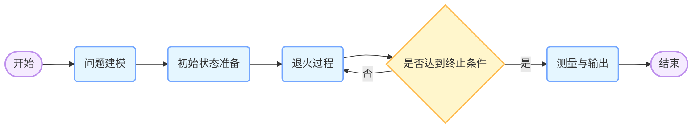

# 量子退火算法在组合优化问题中的应用

> 关键词：量子退火算法、组合优化问题、量子计算、算法原理、实际应用

> 摘要：本文深入探讨了量子退火算法在组合优化问题中的应用。首先介绍了量子退火算法和组合优化问题的背景知识，包括目的、预期读者、文档结构和相关术语。接着阐述了核心概念及其联系，给出了原理和架构的文本示意图与Mermaid流程图。详细讲解了核心算法原理，并用Python源代码进行了说明，同时给出了数学模型和公式，并举例解释。通过项目实战展示了代码的实际案例和详细解读。分析了量子退火算法在不同领域的实际应用场景，推荐了相关的学习资源、开发工具框架和论文著作。最后总结了量子退火算法的未来发展趋势与挑战，并对常见问题进行了解答，提供了扩展阅读和参考资料。

## 1. 背景介绍 
### 1.1 目的和范围
组合优化问题在众多领域，如物流调度、电路设计、金融投资等都有广泛的应用。然而，传统的优化算法在处理大规模、复杂的组合优化问题时，往往面临计算复杂度高、求解时间长等问题。量子退火算法作为一种新兴的计算方法，为解决组合优化问题提供了新的思路和方法。本文的目的在于深入探讨量子退火算法在组合优化问题中的应用，包括算法原理、实际操作步骤、数学模型以及实际应用案例等方面，旨在帮助读者全面了解量子退火算法在组合优化领域的应用潜力和实现方式。

### 1.2 预期读者
本文预期读者包括计算机科学、数学、物理学等相关专业的学生和研究人员，对量子计算和组合优化问题感兴趣的技术爱好者，以及在实际工作中需要解决组合优化问题的工程师和决策者。

### 1.3 文档结构概述
本文将按照以下结构进行阐述：首先介绍量子退火算法和组合优化问题的相关背景知识和术语；然后详细讲解核心概念及其联系，给出原理和架构的示意图；接着阐述核心算法原理，并用Python代码进行说明，同时给出数学模型和公式；通过项目实战展示代码的实际应用和详细解读；分析量子退火算法在不同领域的实际应用场景；推荐相关的学习资源、开发工具框架和论文著作；最后总结量子退火算法的未来发展趋势与挑战，解答常见问题，并提供扩展阅读和参考资料。

### 1.4 术语表
#### 1.4.1 核心术语定义
- **量子退火算法（Quantum Annealing Algorithm）**：一种基于量子力学原理的优化算法，通过模拟量子系统的演化过程来寻找问题的最优解。
- **组合优化问题（Combinatorial Optimization Problem）**：在一个有限的离散解空间中，寻找满足一定约束条件并使目标函数达到最优值的解的问题。
- **量子比特（Qubit）**：量子计算中的基本信息单元，类似于经典计算中的比特，但具有量子叠加和纠缠等特性。
- **哈密顿量（Hamiltonian）**：描述量子系统能量的算符，在量子退火算法中用于表示问题的目标函数和约束条件。
- **退火过程（Annealing Process）**：在量子退火算法中，通过逐渐降低系统的温度，使系统从一个高能量的无序状态逐渐演化到一个低能量的有序状态，从而找到问题的最优解。

#### 1.4.2 相关概念解释
- **量子叠加（Quantum Superposition）**：量子比特可以同时处于多个状态的叠加态，这使得量子计算能够并行处理多个计算任务，从而提高计算效率。
- **量子纠缠（Quantum Entanglement）**：多个量子比特之间存在一种特殊的关联，使得它们的状态相互依赖，即使它们之间的距离很远。这种特性可以用于实现量子信息的高效传输和处理。
- **绝热演化（Adiabatic Evolution）**：在量子退火算法中，系统的哈密顿量随时间缓慢变化，使得系统始终处于其瞬时基态，从而保证系统最终能够演化到问题的最优解。

#### 1.4.3 缩略词列表
- **QA**：Quantum Annealing（量子退火）
- **QUBO**：Quadratic Unconstrained Binary Optimization（二次无约束二进制优化）

## 2. 核心概念与联系 

### 核心概念原理
量子退火算法的核心思想是利用量子系统的特性，如量子叠加和量子隧穿，来寻找组合优化问题的最优解。在经典的模拟退火算法中，系统通过随机扰动和温度控制来探索解空间，逐渐找到最优解。而量子退火算法则引入了量子效应，使得系统能够在解空间中进行更高效的搜索。

具体来说，量子退火算法通过构建一个与组合优化问题对应的量子系统，该系统的哈密顿量 $H$ 可以表示为问题的目标函数和约束条件。在算法的初始阶段，系统处于一个简单的哈密顿量 $H_0$ 所描述的状态，该状态具有较高的能量和较大的量子涨落。随着时间的推移，系统的哈密顿量逐渐从 $H_0$ 演化到目标哈密顿量 $H_p$，这个过程称为退火过程。在退火过程中，系统的温度逐渐降低，量子涨落逐渐减小，系统最终会收敛到目标哈密顿量 $H_p$ 的基态，该基态对应于组合优化问题的最优解。

### 架构的文本示意图
量子退火算法的架构可以分为以下几个主要部分：
1. **问题建模**：将组合优化问题转化为一个量子系统的哈密顿量表示。
2. **初始状态准备**：将量子系统初始化为一个简单的哈密顿量所描述的状态。
3. **退火过程**：通过逐渐改变系统的哈密顿量，使系统从初始状态演化到目标状态。
4. **测量与输出**：对演化后的量子系统进行测量，得到组合优化问题的解。

### Mermaid 流程图


## 3. 核心算法原理 & 具体操作步骤 

### 算法原理
量子退火算法的核心是通过绝热演化来实现系统从初始哈密顿量 $H_0$ 到目标哈密顿量 $H_p$ 的转变。绝热演化的条件是系统的哈密顿量随时间的变化足够缓慢，使得系统始终处于其瞬时基态。

假设系统的哈密顿量 $H(t)$ 随时间 $t$ 从 $H_0$ 演化到 $H_p$，即 $H(t)=(1 - s(t))H_0 + s(t)H_p$，其中 $s(t)$ 是一个时间依赖的函数，满足 $s(0)=0$ 和 $s(T)=1$，$T$ 是退火时间。

根据量子力学的薛定谔方程，系统的状态 $\vert\psi(t)\rangle$ 随时间的演化可以表示为：
$$i\hbar\frac{d}{dt}\vert\psi(t)\rangle = H(t)\vert\psi(t)\rangle$$

在绝热近似下，系统始终处于 $H(t)$ 的基态 $\vert\psi_0(t)\rangle$，即 $\vert\psi(t)\rangle=\vert\psi_0(t)\rangle$。当退火时间 $T$ 足够长时，系统最终会演化到 $H_p$ 的基态，该基态对应于组合优化问题的最优解。

### 具体操作步骤
1. **问题建模**：将组合优化问题转化为一个二次无约束二进制优化（QUBO）问题。QUBO 问题的目标函数可以表示为：
$$\min_{x\in\{0,1\}^n} \sum_{i=1}^n \sum_{j=1}^n Q_{ij}x_ix_j$$
其中 $Q_{ij}$ 是一个 $n\times n$ 的对称矩阵，$x_i$ 是二进制变量。然后将 QUBO 问题转化为一个量子系统的哈密顿量表示：
$$H_p=\sum_{i=1}^n \sum_{j=1}^n Q_{ij}\sigma_i^z\sigma_j^z$$
其中 $\sigma_i^z$ 是第 $i$ 个量子比特的泡利 $z$ 算符。

2. **初始状态准备**：选择一个简单的初始哈密顿量 $H_0$，例如：
$$H_0 = -\sum_{i=1}^n \sigma_i^x$$
其中 $\sigma_i^x$ 是第 $i$ 个量子比特的泡利 $x$ 算符。将量子系统初始化为 $H_0$ 的基态。

3. **退火过程**：根据绝热演化的原理，逐渐改变系统的哈密顿量 $H(t)=(1 - s(t))H_0 + s(t)H_p$，其中 $s(t)$ 是一个时间依赖的函数，例如 $s(t)=\frac{t}{T}$。在退火过程中，系统的状态会随着哈密顿量的变化而逐渐演化。

4. **测量与输出**：在退火过程结束后，对量子系统进行测量，得到二进制变量 $x_i$ 的取值，即为组合优化问题的解。

### Python 源代码实现
```python
import numpy as np
from scipy.linalg import expm

# 定义泡利矩阵
sigma_x = np.array([[0, 1], [1, 0]])
sigma_z = np.array([[1, 0], [0, -1]])

# 问题建模：生成 QUBO 矩阵
n = 3  # 量子比特数
Q = np.random.randn(n, n)
Q = (Q + Q.T) / 2  # 确保 Q 是对称矩阵

# 构建目标哈密顿量 H_p
H_p = np.zeros((2**n, 2**n))
for i in range(n):
    for j in range(n):
        if i == j:
            H_ij = np.kron(np.eye(2**i), np.kron(sigma_z, np.eye(2**(n - i - 1))))
        else:
            idx1 = min(i, j)
            idx2 = max(i, j)
            H_ij = np.kron(np.eye(2**idx1), np.kron(sigma_z, np.kron(np.eye(2**(idx2 - idx1 - 1)), np.kron(sigma_z, np.eye(2**(n - idx2 - 1))))))
        H_p += Q[i, j] * H_ij

# 构建初始哈密顿量 H_0
H_0 = np.zeros((2**n, 2**n))
for i in range(n):
    H_0 -= np.kron(np.eye(2**i), np.kron(sigma_x, np.eye(2**(n - i - 1))))

# 退火过程
T = 100  # 退火时间
dt = 0.01  # 时间步长
psi = np.zeros(2**n)
psi[0] = 1  # 初始状态

for t in np.arange(0, T, dt):
    s = t / T
    H = (1 - s) * H_0 + s * H_p
    U = expm(-1j * H * dt)
    psi = np.dot(U, psi)

# 测量与输出
probabilities = np.abs(psi)**2
index = np.argmax(probabilities)
solution = [int(x) for x in bin(index)[2:].zfill(n)]
print("组合优化问题的解：", solution)
```

## 4. 数学模型和公式 & 详细讲解 & 举例说明 

### 数学模型和公式
#### QUBO 模型
如前所述，QUBO 问题的目标函数可以表示为：
$$\min_{x\in\{0,1\}^n} \sum_{i=1}^n \sum_{j=1}^n Q_{ij}x_ix_j$$
其中 $Q_{ij}$ 是一个 $n\times n$ 的对称矩阵，$x_i$ 是二进制变量。QUBO 模型可以用来表示许多组合优化问题，如最大割问题、旅行商问题等。

#### 量子哈密顿量
量子退火算法中，系统的哈密顿量 $H(t)$ 随时间 $t$ 从 $H_0$ 演化到 $H_p$，即：
$$H(t)=(1 - s(t))H_0 + s(t)H_p$$
其中 $H_0$ 是初始哈密顿量，$H_p$ 是目标哈密顿量，$s(t)$ 是一个时间依赖的函数，满足 $s(0)=0$ 和 $s(T)=1$，$T$ 是退火时间。

#### 薛定谔方程
量子系统的状态 $\vert\psi(t)\rangle$ 随时间的演化遵循薛定谔方程：
$$i\hbar\frac{d}{dt}\vert\psi(t)\rangle = H(t)\vert\psi(t)\rangle$$
在绝热近似下，系统始终处于 $H(t)$ 的基态 $\vert\psi_0(t)\rangle$，即 $\vert\psi(t)\rangle=\vert\psi_0(t)\rangle$。

### 详细讲解
#### QUBO 模型的转化
许多组合优化问题可以转化为 QUBO 问题。例如，最大割问题可以描述为：给定一个无向图 $G=(V, E)$，其中 $V$ 是顶点集，$E$ 是边集，要将顶点集 $V$ 划分为两个子集 $A$ 和 $B$，使得连接 $A$ 和 $B$ 的边的数量最大。

设 $x_i$ 表示顶点 $i$ 是否属于子集 $A$，$x_i = 1$ 表示属于 $A$，$x_i = 0$ 表示属于 $B$。则最大割问题的目标函数可以表示为：
$$\max_{x\in\{0,1\}^n} \sum_{(i,j)\in E} (x_i(1 - x_j) + x_j(1 - x_i))$$
通过展开和整理，可以将其转化为 QUBO 问题的形式：
$$\min_{x\in\{0,1\}^n} \sum_{i=1}^n \sum_{j=1}^n Q_{ij}x_ix_j$$
其中 $Q_{ij}$ 的取值根据图的边的连接情况确定。

#### 量子哈密顿量的演化
在量子退火算法中，通过改变 $s(t)$ 的值，使得系统的哈密顿量从 $H_0$ 逐渐演化到 $H_p$。在初始阶段，$s(0)=0$，系统的哈密顿量为 $H_0$，此时系统处于一个高能量的无序状态，具有较大的量子涨落。随着时间的推移，$s(t)$ 逐渐增大，系统的哈密顿量逐渐接近 $H_p$，量子涨落逐渐减小，系统最终会收敛到 $H_p$ 的基态。

#### 绝热演化的条件
绝热演化的条件是系统的哈密顿量随时间的变化足够缓慢，使得系统始终处于其瞬时基态。具体来说，绝热演化的条件可以表示为：
$$\frac{\vert\langle\psi_1(t)\vert\frac{dH(t)}{dt}\vert\psi_0(t)\rangle\vert}{\vert E_1(t) - E_0(t)\vert^2}\ll 1$$
其中 $\vert\psi_0(t)\rangle$ 和 $\vert\psi_1(t)\rangle$ 分别是 $H(t)$ 的基态和第一激发态，$E_0(t)$ 和 $E_1(t)$ 分别是它们的能量。

### 举例说明
考虑一个简单的组合优化问题：有三个物品，每个物品有一个价值 $v_i$ 和一个重量 $w_i$，要在总重量不超过 $W$ 的情况下，选择一些物品使得总价值最大。

设 $x_i$ 表示是否选择第 $i$ 个物品，$x_i = 1$ 表示选择，$x_i = 0$ 表示不选择。则该问题的目标函数可以表示为：
$$\max_{x\in\{0,1\}^3} \sum_{i=1}^3 v_ix_i$$
约束条件为：
$$\sum_{i=1}^3 w_ix_i\leq W$$

通过引入拉格朗日乘子 $\lambda$，可以将约束条件转化为目标函数的一部分，得到一个无约束的优化问题：
$$\min_{x\in\{0,1\}^3} -\sum_{i=1}^3 v_ix_i + \lambda(\sum_{i=1}^3 w_ix_i - W)^2$$

将其展开并整理，可以得到一个 QUBO 问题的形式：
$$\min_{x\in\{0,1\}^3} \sum_{i=1}^3 \sum_{j=1}^3 Q_{ij}x_ix_j$$
其中 $Q_{ij}$ 的取值根据 $v_i$、$w_i$ 和 $\lambda$ 的值确定。

然后可以按照量子退火算法的步骤，将该 QUBO 问题转化为量子系统的哈密顿量表示，进行退火过程，最终得到组合优化问题的解。

## 5. 项目实战：代码实际案例和详细解释说明 

### 5.1  开发环境搭建
为了运行量子退火算法的代码，需要搭建相应的开发环境。以下是具体的步骤：

#### 安装 Python
首先需要安装 Python 环境，建议使用 Python 3.7 及以上版本。可以从 Python 官方网站（https://www.python.org/downloads/）下载并安装适合自己操作系统的 Python 版本。

#### 安装必要的库
量子退火算法的代码需要使用一些 Python 库，如 `numpy`、`scipy` 等。可以使用 `pip` 命令来安装这些库：
```sh
pip install numpy scipy
```

### 5.2  源代码详细实现和代码解读
以下是一个完整的量子退火算法解决组合优化问题的 Python 代码示例：

```python
import numpy as np
from scipy.linalg import expm

# 定义泡利矩阵
sigma_x = np.array([[0, 1], [1, 0]])
sigma_z = np.array([[1, 0], [0, -1]])

# 问题建模：生成 QUBO 矩阵
n = 3  # 量子比特数
Q = np.random.randn(n, n)
Q = (Q + Q.T) / 2  # 确保 Q 是对称矩阵

# 构建目标哈密顿量 H_p
H_p = np.zeros((2**n, 2**n))
for i in range(n):
    for j in range(n):
        if i == j:
            H_ij = np.kron(np.eye(2**i), np.kron(sigma_z, np.eye(2**(n - i - 1))))
        else:
            idx1 = min(i, j)
            idx2 = max(i, j)
            H_ij = np.kron(np.eye(2**idx1), np.kron(sigma_z, np.kron(np.eye(2**(idx2 - idx1 - 1)), np.kron(sigma_z, np.eye(2**(n - idx2 - 1))))))
        H_p += Q[i, j] * H_ij

# 构建初始哈密顿量 H_0
H_0 = np.zeros((2**n, 2**n))
for i in range(n):
    H_0 -= np.kron(np.eye(2**i), np.kron(sigma_x, np.eye(2**(n - i - 1))))

# 退火过程
T = 100  # 退火时间
dt = 0.01  # 时间步长
psi = np.zeros(2**n)
psi[0] = 1  # 初始状态

for t in np.arange(0, T, dt):
    s = t / T
    H = (1 - s) * H_0 + s * H_p
    U = expm(-1j * H * dt)
    psi = np.dot(U, psi)

# 测量与输出
probabilities = np.abs(psi)**2
index = np.argmax(probabilities)
solution = [int(x) for x in bin(index)[2:].zfill(n)]
print("组合优化问题的解：", solution)
```

### 代码解读与分析
#### 泡利矩阵的定义
```python
sigma_x = np.array([[0, 1], [1, 0]])
sigma_z = np.array([[1, 0], [0, -1]])
```
这里定义了泡利 $x$ 矩阵和泡利 $z$ 矩阵，它们是量子计算中常用的算符。

#### QUBO 矩阵的生成
```python
n = 3  # 量子比特数
Q = np.random.randn(n, n)
Q = (Q + Q.T) / 2  # 确保 Q 是对称矩阵
```
这里随机生成了一个 $n\times n$ 的矩阵 $Q$，并确保它是对称矩阵，因为 QUBO 矩阵必须是对称的。

#### 目标哈密顿量 $H_p$ 的构建
```python
H_p = np.zeros((2**n, 2**n))
for i in range(n):
    for j in range(n):
        if i == j:
            H_ij = np.kron(np.eye(2**i), np.kron(sigma_z, np.eye(2**(n - i - 1))))
        else:
            idx1 = min(i, j)
            idx2 = max(i, j)
            H_ij = np.kron(np.eye(2**idx1), np.kron(sigma_z, np.kron(np.eye(2**(idx2 - idx1 - 1)), np.kron(sigma_z, np.eye(2**(n - idx2 - 1))))))
        H_p += Q[i, j] * H_ij
```
这里通过 Kronecker 积的方式构建了目标哈密顿量 $H_p$，它是一个 $2^n\times 2^n$ 的矩阵。

#### 初始哈密顿量 $H_0$ 的构建
```python
H_0 = np.zeros((2**n, 2**n))
for i in range(n):
    H_0 -= np.kron(np.eye(2**i), np.kron(sigma_x, np.eye(2**(n - i - 1))))
```
这里同样通过 Kronecker 积的方式构建了初始哈密顿量 $H_0$。

#### 退火过程
```python
T = 100  # 退火时间
dt = 0.01  # 时间步长
psi = np.zeros(2**n)
psi[0] = 1  # 初始状态

for t in np.arange(0, T, dt):
    s = t / T
    H = (1 - s) * H_0 + s * H_p
    U = expm(-1j * H * dt)
    psi = np.dot(U, psi)
```
这里进行了退火过程，通过逐渐改变系统的哈密顿量 $H$，并使用矩阵指数函数 `expm` 计算时间演化算符 $U$，更新系统的状态 $\psi$。

#### 测量与输出
```python
probabilities = np.abs(psi)**2
index = np.argmax(probabilities)
solution = [int(x) for x in bin(index)[2:].zfill(n)]
print("组合优化问题的解：", solution)
```
这里通过计算系统状态的概率分布，找到概率最大的状态对应的索引，将其转换为二进制字符串，得到组合优化问题的解。

## 6. 实际应用场景 
量子退火算法在许多领域都有潜在的应用，以下是一些具体的应用场景：

### 物流调度
在物流调度中，需要解决许多组合优化问题，如车辆路径规划、货物装载优化等。量子退火算法可以通过快速搜索解空间，找到最优的调度方案，从而提高物流效率，降低成本。

### 电路设计
在电路设计中，需要进行逻辑综合、布局布线等优化问题。量子退火算法可以用于解决这些问题，找到最优的电路设计方案，提高电路的性能和可靠性。

### 金融投资
在金融投资中，需要进行投资组合优化、风险评估等问题。量子退火算法可以通过考虑多种因素，找到最优的投资组合方案，降低投资风险，提高投资回报率。

### 机器学习
在机器学习中，需要进行特征选择、模型参数优化等问题。量子退火算法可以用于解决这些问题，提高机器学习模型的性能和效率。

### 蛋白质折叠预测
在生物信息学中，蛋白质折叠预测是一个重要的问题。量子退火算法可以通过模拟蛋白质分子的能量状态，找到最低能量的折叠结构，从而预测蛋白质的功能和性质。

## 7. 工具和资源推荐
### 7.1 学习资源推荐
#### 7.1.1 书籍推荐
- 《量子计算与量子信息》（*Quantum Computation and Quantum Information*）：由 Michael A. Nielsen 和 Isaac L. Chuang 所著，是量子计算领域的经典教材，涵盖了量子计算的基本原理、算法和应用。
- 《量子退火算法及其应用》（*Quantum Annealing Algorithms and Their Applications*）：详细介绍了量子退火算法的原理、实现和应用，是学习量子退火算法的重要参考书籍。

#### 7.1.2 在线课程
- Coursera 上的“量子计算基础”（*Foundations of Quantum Computing*）课程：由加州大学伯克利分校的教授授课，介绍了量子计算的基本概念和算法。
- edX 上的“量子信息科学与技术”（*Quantum Information Science and Technology*）课程：由麻省理工学院的教授授课，涵盖了量子信息的各个方面。

#### 7.1.3 技术博客和网站
- Quantum Computing Report（https://www.quantumcomputingreport.com/）：提供了量子计算领域的最新消息、技术分析和市场动态。
- Quantum Computing Now（https://www.quantumcomputingnow.com/）：专注于量子计算的应用和发展，分享了许多实际案例和研究成果。

### 7.2 开发工具框架推荐
#### 7.2.1 IDE和编辑器
- PyCharm：是一款功能强大的 Python 集成开发环境，提供了代码编辑、调试、版本控制等功能，适合开发量子退火算法的 Python 代码。
- Jupyter Notebook：是一个交互式的笔记本环境，支持 Python、R 等多种编程语言，方便进行代码演示和实验。

#### 7.2.2 调试和性能分析工具
- Numba：是一个用于 Python 的即时编译库，可以加速 Python 代码的执行，提高量子退火算法的性能。
- cProfile：是 Python 自带的性能分析工具，可以分析代码的运行时间和函数调用情况，帮助优化代码性能。

#### 7.2.3 相关框架和库
- D-Wave Ocean SDK：是 D-Wave 公司开发的量子计算软件开发工具包，提供了量子退火算法的实现和相关工具，方便开发人员进行量子计算实验。
- Qiskit：是 IBM 开发的开源量子计算框架，支持多种量子算法的实现，包括量子退火算法。

### 7.3 相关论文著作推荐
#### 7.3.1 经典论文
- “Quantum annealing by the path-integral Monte Carlo method: Application to spin glasses”：由 G. E. Santoro 和 E. Tosatti 发表，首次提出了量子退火算法的概念。
- “Optimization by simulated annealing”：由 S. Kirkpatrick、C. D. Gelatt 和 M. P. Vecchi 发表，介绍了模拟退火算法的原理和应用，为量子退火算法的发展奠定了基础。

#### 7.3.2 最新研究成果
- “Quantum annealing for combinatorial optimization problems: A review”：对量子退火算法在组合优化问题中的应用进行了全面的综述，介绍了最新的研究进展和挑战。
- “Experimental demonstration of quantum annealing with up to 512 qubits”：报道了使用 512 个量子比特进行量子退火实验的结果，展示了量子退火算法的实际应用潜力。

#### 7.3.3 应用案例分析
- “Quantum annealing for vehicle routing problems”：介绍了量子退火算法在车辆路径规划问题中的应用，通过实际案例验证了算法的有效性。
- “Quantum annealing for portfolio optimization”：探讨了量子退火算法在金融投资组合优化问题中的应用，分析了算法的性能和优势。

## 8. 总结：未来发展趋势与挑战
### 未来发展趋势
- **硬件技术的进步**：随着量子计算硬件技术的不断发展，量子比特的数量和质量将不断提高，量子退火算法的计算能力和效率也将得到显著提升。
- **与其他技术的融合**：量子退火算法可以与经典算法、机器学习等技术相结合，形成更加高效的混合算法，解决更加复杂的组合优化问题。
- **应用领域的拓展**：量子退火算法将在更多领域得到应用，如生物医学、能源管理、社会科学等，为这些领域的发展带来新的机遇。

### 挑战
- **量子比特的稳定性**：量子比特容易受到外界环境的干扰，导致量子退相干现象的发生，从而影响量子退火算法的性能。因此，如何提高量子比特的稳定性是一个亟待解决的问题。
- **算法的复杂度**：虽然量子退火算法在某些问题上具有优势，但对于一些大规模、复杂的组合优化问题，算法的复杂度仍然较高，需要进一步优化算法。
- **实际应用的验证**：目前量子退火算法的应用还处于实验阶段，需要在更多的实际场景中进行验证和测试，以证明其在实际应用中的有效性和可行性。

## 9. 附录：常见问题与解答
### 问题 1：量子退火算法与经典模拟退火算法有什么区别？
答：经典模拟退火算法通过随机扰动和温度控制来探索解空间，逐渐找到最优解。而量子退火算法引入了量子效应，如量子叠加和量子隧穿，使得系统能够在解空间中进行更高效的搜索。量子退火算法在某些问题上具有更快的收敛速度和更高的求解精度。

### 问题 2：量子退火算法对硬件有什么要求？
答：量子退火算法需要量子计算硬件的支持，如 D-Wave 公司的量子退火机。这些硬件需要具备一定数量的量子比特，并且能够实现量子比特之间的相互作用和控制。同时，硬件的稳定性和可靠性也是影响算法性能的重要因素。

### 问题 3：如何将组合优化问题转化为 QUBO 问题？
答：许多组合优化问题可以通过一定的方法转化为 QUBO 问题。一般来说，需要将问题的目标函数和约束条件进行数学建模，然后通过引入二进制变量和适当的变换，将其转化为 QUBO 问题的形式。具体的转化方法需要根据问题的具体特点进行设计。

### 问题 4：量子退火算法的求解结果一定是最优解吗？
答：量子退火算法是一种概率性算法，其求解结果不一定是最优解。由于量子系统的不确定性和量子退相干等因素的影响，算法可能会陷入局部最优解。为了提高求解的准确性，可以多次运行算法，取最优的结果。

## 10. 扩展阅读 & 参考资料
### 扩展阅读
- 《量子计算：从基础到应用》（*Quantum Computing: From Basics to Applications*）：进一步深入介绍了量子计算的原理、算法和应用，适合对量子计算有一定基础的读者阅读。
- 《组合优化：理论与算法》（*Combinatorial Optimization: Theory and Algorithms*）：详细介绍了组合优化问题的理论和算法，为理解量子退火算法在组合优化问题中的应用提供了理论基础。

### 参考资料
- Nielsen, M. A., & Chuang, I. L. (2000). *Quantum Computation and Quantum Information*. Cambridge University Press.
- Santoro, G. E., & Tosatti, E. (2006). Quantum annealing by the path-integral Monte Carlo method: Application to spin glasses. *Physical Review B*, 56(21), 13355-13362.
- Kirkpatrick, S., Gelatt, C. D., & Vecchi, M. P. (1983). Optimization by simulated annealing. *Science*, 220(4598), 671-680.

作者：AI天才研究院/AI Genius Institute & 禅与计算机程序设计艺术 /Zen And The Art of Computer Programming