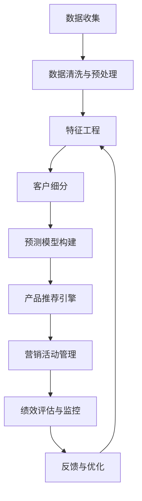

# 金融产品交叉销售优化系统

> 关键词：金融产品、交叉销售、优化系统、客户细分、机器学习

> 摘要：本文围绕金融产品交叉销售优化系统展开，详细介绍了该系统的背景、核心概念、算法原理、数学模型等内容。通过深入剖析系统的各个方面，阐述了如何利用先进的技术手段提高金融产品交叉销售的效率和效果。文中还结合实际案例，展示了系统在实际应用中的操作流程和优势，同时推荐了相关的学习资源、开发工具和论文著作。最后，对金融产品交叉销售优化系统的未来发展趋势和挑战进行了总结，并提供了常见问题的解答和扩展阅读参考资料。

## 1. 背景介绍 
### 1.1 目的和范围
在金融行业竞争日益激烈的今天，金融机构面临着如何提高客户忠诚度、增加客户价值的挑战。交叉销售作为一种有效的营销策略，能够通过向现有客户推荐相关的金融产品，实现客户资源的深度挖掘和利用，从而提高金融机构的收益。本金融产品交叉销售优化系统的目的在于构建一个智能化、高效的系统，利用数据分析和机器学习技术，精准地识别客户需求，为客户推荐最合适的金融产品组合，提高交叉销售的成功率。

本系统的范围涵盖了金融行业的各类产品，包括但不限于银行的储蓄账户、信用卡、贷款产品，保险公司的人寿保险、财产保险，以及证券公司的股票、基金等。系统将对客户的基本信息、交易记录、行为数据等进行全面分析，以实现精准的交叉销售。

### 1.2 预期读者
本文的预期读者主要包括金融行业的从业者，如银行客户经理、保险营销人员、证券分析师等，他们可以通过了解本系统的原理和操作方法，提高自己的交叉销售能力。同时，对于从事数据分析、机器学习等领域的技术人员，本文也提供了一个实际应用的案例，有助于他们深入理解这些技术在金融领域的应用。此外，对金融科技感兴趣的研究人员和学生也可以从本文中获取相关的知识和信息。

### 1.3 文档结构概述
本文将按照以下结构进行组织：首先介绍金融产品交叉销售优化系统的背景信息，包括目的、预期读者和文档结构概述等。接着阐述系统的核心概念与联系，通过文本示意图和 Mermaid 流程图展示系统的架构和原理。然后详细讲解核心算法原理和具体操作步骤，并使用 Python 源代码进行说明。之后介绍系统所涉及的数学模型和公式，并通过举例进行详细讲解。再通过项目实战，展示系统的实际开发过程和代码实现。随后探讨系统的实际应用场景，推荐相关的工具和资源。最后对系统的未来发展趋势和挑战进行总结，提供常见问题的解答和扩展阅读参考资料。

### 1.4 术语表
#### 1.4.1 核心术语定义
- **交叉销售**：指向现有客户销售与其已购买产品相关或互补的其他金融产品的营销方式。
- **客户细分**：根据客户的特征、行为、需求等因素，将客户划分为不同的群体，以便更好地进行针对性营销。
- **特征工程**：对原始数据进行预处理和转换，提取出有价值的特征，用于机器学习模型的训练。
- **模型评估**：使用各种评估指标对机器学习模型的性能进行评估，以确定模型的优劣。

#### 1.4.2 相关概念解释
- **金融产品组合**：由多种金融产品组成的集合，旨在满足客户的不同需求和风险偏好。
- **客户画像**：通过对客户的多维度数据进行分析和建模，构建出客户的特征和行为模型，以便更好地了解客户。
- **预测模型**：利用机器学习算法，根据客户的历史数据和特征，预测客户购买某种金融产品的概率。

#### 1.4.3 缩略词列表
- **CRM**：Customer Relationship Management，客户关系管理
- **ML**：Machine Learning，机器学习
- **KPI**：Key Performance Indicator，关键绩效指标
- **ROC**：Receiver Operating Characteristic，受试者工作特征曲线
- **AUC**：Area Under the Curve，曲线下面积

## 2. 核心概念与联系 
### 核心概念原理
金融产品交叉销售优化系统的核心原理是基于客户细分和预测模型。首先，通过对客户的各种数据进行分析，将客户划分为不同的细分群体，每个群体具有相似的特征和需求。然后，针对每个细分群体，构建预测模型，预测客户购买不同金融产品的概率。最后，根据预测结果，为客户推荐最合适的金融产品组合，实现交叉销售的优化。

### 架构的文本示意图
```plaintext
金融产品交叉销售优化系统架构

数据层：
- 客户基本信息（年龄、性别、收入等）
- 交易记录（存款、取款、消费等）
- 行为数据（网站浏览、APP 使用等）

处理层：
- 数据清洗与预处理
- 特征工程
- 客户细分
- 预测模型构建

应用层：
- 产品推荐引擎
- 营销活动管理
- 绩效评估与监控
```

### Mermaid 流程图


该流程图展示了金融产品交叉销售优化系统的主要流程。首先进行数据收集，然后对数据进行清洗和预处理，接着进行特征工程和客户细分。基于细分结果构建预测模型，通过产品推荐引擎为客户推荐产品。营销活动管理负责实施推荐策略，绩效评估与监控对营销效果进行评估。最后，根据评估结果进行反馈和优化，不断改进系统的性能。

## 3. 核心算法原理 & 具体操作步骤 
### 核心算法原理
本系统主要使用逻辑回归算法进行预测模型的构建。逻辑回归是一种广泛应用于分类问题的机器学习算法，它通过对输入特征进行线性组合，然后使用逻辑函数将其转换为概率值。逻辑函数的公式为：

$$\sigma(z)=\frac{1}{1 + e^{-z}}$$

其中，$z$ 是输入特征的线性组合，即 $z = \theta_0 + \theta_1x_1 + \theta_2x_2 + \cdots + \theta_nx_n$，$\theta_i$ 是模型的参数，$x_i$ 是输入特征。

逻辑回归的目标是找到一组最优的参数 $\theta$，使得模型对训练数据的预测概率与实际标签之间的误差最小。通常使用对数损失函数来衡量误差，对数损失函数的公式为：

$$J(\theta)=-\frac{1}{m}\sum_{i = 1}^{m}[y^{(i)}\log(\sigma(z^{(i)}))+(1 - y^{(i)})\log(1 - \sigma(z^{(i)}))]$$

其中，$m$ 是训练数据的样本数量，$y^{(i)}$ 是第 $i$ 个样本的实际标签，$\sigma(z^{(i)})$ 是模型对第 $i$ 个样本的预测概率。

### 具体操作步骤
#### 步骤 1：数据准备
首先，收集客户的相关数据，包括基本信息、交易记录、行为数据等。然后，对数据进行清洗和预处理，处理缺失值、异常值等问题。最后，将数据划分为训练集和测试集，通常按照 80:20 的比例进行划分。

#### 步骤 2：特征工程
对预处理后的数据进行特征工程，提取有价值的特征。可以使用的特征包括客户的年龄、性别、收入、存款余额、交易频率等。同时，还可以进行特征变换和组合，以提高模型的性能。

#### 步骤 3：模型训练
使用训练集数据对逻辑回归模型进行训练。在 Python 中，可以使用 `sklearn` 库来实现逻辑回归模型的训练，示例代码如下：
```python
from sklearn.linear_model import LogisticRegression
from sklearn.model_selection import train_test_split
import pandas as pd

# 读取数据
data = pd.read_csv('customer_data.csv')

# 划分特征和标签
X = data.drop('target', axis=1)
y = data['target']

# 划分训练集和测试集
X_train, X_test, y_train, y_test = train_test_split(X, y, test_size=0.2, random_state=42)

# 创建逻辑回归模型
model = LogisticRegression()

# 训练模型
model.fit(X_train, y_train)
```

#### 步骤 4：模型评估
使用测试集数据对训练好的模型进行评估。常用的评估指标包括准确率、精确率、召回率、F1 值等。示例代码如下：
```python
from sklearn.metrics import accuracy_score, precision_score, recall_score, f1_score

# 预测测试集
y_pred = model.predict(X_test)

# 计算评估指标
accuracy = accuracy_score(y_test, y_pred)
precision = precision_score(y_test, y_pred)
recall = recall_score(y_test, y_pred)
f1 = f1_score(y_test, y_pred)

print(f'Accuracy: {accuracy}')
print(f'Precision: {precision}')
print(f'Recall: {recall}')
print(f'F1 Score: {f1}')
```

#### 步骤 5：产品推荐
根据训练好的模型，对客户购买不同金融产品的概率进行预测。然后，根据预测结果为客户推荐最合适的金融产品组合。示例代码如下：
```python
# 预测客户购买产品的概率
probabilities = model.predict_proba(X_test)

# 选择概率最高的产品进行推荐
recommended_products = []
for prob in probabilities:
    recommended_product = prob.argmax()
    recommended_products.append(recommended_product)

print('Recommended products:', recommended_products)
```

## 4. 数学模型和公式 & 详细讲解 & 举例说明 
### 逻辑回归模型
逻辑回归模型的核心是逻辑函数，它将输入特征的线性组合转换为概率值。逻辑函数的公式为：

$$\sigma(z)=\frac{1}{1 + e^{-z}}$$

其中，$z$ 是输入特征的线性组合，即 $z = \theta_0 + \theta_1x_1 + \theta_2x_2 + \cdots + \theta_nx_n$，$\theta_i$ 是模型的参数，$x_i$ 是输入特征。

逻辑函数的图像是一个 S 形曲线，其取值范围在 0 到 1 之间。当 $z$ 趋近于正无穷时，$\sigma(z)$ 趋近于 1；当 $z$ 趋近于负无穷时，$\sigma(z)$ 趋近于 0。因此，逻辑函数可以将任意实数转换为概率值。

### 对数损失函数
逻辑回归模型使用对数损失函数来衡量预测概率与实际标签之间的误差。对数损失函数的公式为：

$$J(\theta)=-\frac{1}{m}\sum_{i = 1}^{m}[y^{(i)}\log(\sigma(z^{(i)}))+(1 - y^{(i)})\log(1 - \sigma(z^{(i)}))]$$

其中，$m$ 是训练数据的样本数量，$y^{(i)}$ 是第 $i$ 个样本的实际标签，$\sigma(z^{(i)})$ 是模型对第 $i$ 个样本的预测概率。

对数损失函数的作用是惩罚模型预测错误的样本。当实际标签为 1 时，如果模型的预测概率接近 0，则对数损失函数的值会很大；当实际标签为 0 时，如果模型的预测概率接近 1，则对数损失函数的值也会很大。因此，通过最小化对数损失函数，可以使模型的预测概率尽可能接近实际标签。

### 梯度下降算法
为了找到使对数损失函数最小化的参数 $\theta$，通常使用梯度下降算法。梯度下降算法的基本思想是沿着对数损失函数的负梯度方向更新参数，直到达到局部最优解。

梯度下降算法的更新公式为：

$$\theta_j:=\theta_j-\alpha\frac{\partial J(\theta)}{\partial\theta_j}$$

其中，$\theta_j$ 是第 $j$ 个参数，$\alpha$ 是学习率，$\frac{\partial J(\theta)}{\partial\theta_j}$ 是对数损失函数对第 $j$ 个参数的偏导数。

### 举例说明
假设我们有一个简单的数据集，包含两个特征 $x_1$ 和 $x_2$，以及一个标签 $y$。数据集如下：

| $x_1$ | $x_2$ | $y$ |
|-------|-------|-----|
| 1     | 2     | 0   |
| 2     | 3     | 0   |
| 3     | 4     | 1   |
| 4     | 5     | 1   |

我们使用逻辑回归模型对这个数据集进行训练。首先，初始化参数 $\theta_0 = 0$，$\theta_1 = 0$，$\theta_2 = 0$。然后，计算对数损失函数的值：

$$z^{(i)}=\theta_0+\theta_1x_1^{(i)}+\theta_2x_2^{(i)}$$

$$\sigma(z^{(i)})=\frac{1}{1 + e^{-z^{(i)}}}$$

$$J(\theta)=-\frac{1}{4}\sum_{i = 1}^{4}[y^{(i)}\log(\sigma(z^{(i)}))+(1 - y^{(i)})\log(1 - \sigma(z^{(i)}))]$$

接着，使用梯度下降算法更新参数：

$$\frac{\partial J(\theta)}{\partial\theta_j}=\frac{1}{4}\sum_{i = 1}^{4}(\sigma(z^{(i)})-y^{(i)})x_j^{(i)}$$

$$\theta_j:=\theta_j-\alpha\frac{\partial J(\theta)}{\partial\theta_j}$$

重复以上步骤，直到对数损失函数的值收敛。最终，我们可以得到一组最优的参数 $\theta$，用于预测新的样本。

## 5. 项目实战：代码实际案例和详细解释说明 
### 5.1  开发环境搭建
#### 安装 Python
首先，需要安装 Python 环境。可以从 Python 官方网站（https://www.python.org/downloads/）下载适合自己操作系统的 Python 安装包，并按照安装向导进行安装。

#### 安装必要的库
在项目中，我们需要使用一些 Python 库，如 `pandas`、`numpy`、`sklearn` 等。可以使用 `pip` 命令来安装这些库，示例代码如下：
```sh
pip install pandas numpy scikit-learn
```

### 5.2  源代码详细实现和代码解读
以下是一个完整的金融产品交叉销售优化系统的代码示例：
```python
import pandas as pd
import numpy as np
from sklearn.linear_model import LogisticRegression
from sklearn.model_selection import train_test_split
from sklearn.metrics import accuracy_score, precision_score, recall_score, f1_score

# 读取数据
data = pd.read_csv('customer_data.csv')

# 划分特征和标签
X = data.drop('target', axis=1)
y = data['target']

# 划分训练集和测试集
X_train, X_test, y_train, y_test = train_test_split(X, y, test_size=0.2, random_state=42)

# 创建逻辑回归模型
model = LogisticRegression()

# 训练模型
model.fit(X_train, y_train)

# 预测测试集
y_pred = model.predict(X_test)

# 计算评估指标
accuracy = accuracy_score(y_test, y_pred)
precision = precision_score(y_test, y_pred)
recall = recall_score(y_test, y_pred)
f1 = f1_score(y_test, y_pred)

print(f'Accuracy: {accuracy}')
print(f'Precision: {precision}')
print(f'Recall: {recall}')
print(f'F1 Score: {f1}')

# 预测客户购买产品的概率
probabilities = model.predict_proba(X_test)

# 选择概率最高的产品进行推荐
recommended_products = []
for prob in probabilities:
    recommended_product = prob.argmax()
    recommended_products.append(recommended_product)

print('Recommended products:', recommended_products)
```

### 代码解读与分析
#### 数据读取
```python
data = pd.read_csv('customer_data.csv')
```
使用 `pandas` 库的 `read_csv` 函数读取存储客户数据的 CSV 文件。

#### 特征和标签划分
```python
X = data.drop('target', axis=1)
y = data['target']
```
将数据集中的特征列和标签列分开，`X` 表示特征，`y` 表示标签。

#### 训练集和测试集划分
```python
X_train, X_test, y_train, y_test = train_test_split(X, y, test_size=0.2, random_state=42)
```
使用 `sklearn` 库的 `train_test_split` 函数将数据集划分为训练集和测试集，测试集占比为 20%。

#### 模型创建和训练
```python
model = LogisticRegression()
model.fit(X_train, y_train)
```
创建逻辑回归模型，并使用训练集数据对模型进行训练。

#### 模型评估
```python
y_pred = model.predict(X_test)
accuracy = accuracy_score(y_test, y_pred)
precision = precision_score(y_test, y_pred)
recall = recall_score(y_test, y_pred)
f1 = f1_score(y_test, y_pred)

print(f'Accuracy: {accuracy}')
print(f'Precision: {precision}')
print(f'Recall: {recall}')
print(f'F1 Score: {f1}')
```
使用测试集数据对模型进行预测，并计算准确率、精确率、召回率和 F1 值等评估指标。

#### 产品推荐
```python
probabilities = model.predict_proba(X_test)
recommended_products = []
for prob in probabilities:
    recommended_product = prob.argmax()
    recommended_products.append(recommended_product)

print('Recommended products:', recommended_products)
```
使用训练好的模型对测试集客户购买不同金融产品的概率进行预测，并选择概率最高的产品进行推荐。

## 6. 实际应用场景 
### 银行领域
在银行领域，金融产品交叉销售优化系统可以帮助银行客户经理更好地了解客户需求，为客户推荐合适的金融产品。例如，对于一个有一定存款的客户，系统可以根据其交易记录和行为数据，预测其可能对信用卡、理财产品等感兴趣，并将这些产品推荐给客户。同时，系统还可以帮助银行评估营销活动的效果，及时调整营销策略，提高交叉销售的成功率。

### 保险领域
在保险领域，该系统可以根据客户的年龄、健康状况、家庭情况等信息，为客户推荐合适的保险产品。例如，对于一个年轻的上班族，系统可以推荐意外险、健康险等产品；对于一个有家庭的中年客户，系统可以推荐人寿保险、财产保险等产品。通过精准的产品推荐，保险公司可以提高客户的满意度和忠诚度，增加保费收入。

### 证券领域
在证券领域，金融产品交叉销售优化系统可以根据客户的投资偏好、风险承受能力等因素，为客户推荐合适的股票、基金等投资产品。例如，对于一个风险偏好较高的客户，系统可以推荐一些成长型股票或股票型基金；对于一个风险偏好较低的客户，系统可以推荐一些债券型基金或货币基金。通过个性化的投资推荐，证券公司可以提高客户的投资收益，增强客户的粘性。

## 7. 工具和资源推荐
### 7.1 学习资源推荐
#### 7.1.1 书籍推荐
- 《Python 机器学习》：本书详细介绍了 Python 在机器学习领域的应用，包括数据预处理、模型选择、算法实现等方面的内容，适合初学者入门。
- 《机器学习》（周志华）：这是一本经典的机器学习教材，系统地介绍了机器学习的基本概念、算法和应用，内容丰富，讲解深入。
- 《金融数据分析与挖掘》：本书结合金融领域的实际案例，介绍了数据分析和挖掘技术在金融领域的应用，对于理解金融产品交叉销售优化系统有很大的帮助。

#### 7.1.2 在线课程
- Coursera 上的《机器学习》课程：由斯坦福大学的 Andrew Ng 教授授课，是一门非常经典的机器学习课程，内容全面，讲解清晰。
- edX 上的《数据科学与机器学习微硕士》课程：该课程涵盖了数据科学和机器学习的多个方面，包括数据预处理、模型构建、算法优化等，适合有一定基础的学习者深入学习。
- 网易云课堂上的《金融科技实战营》课程：该课程结合金融科技的实际应用，介绍了数据分析、机器学习、区块链等技术在金融领域的应用，对于金融从业者和技术人员都有很大的帮助。

#### 7.1.3 技术博客和网站
- Kaggle：这是一个全球知名的数据科学竞赛平台，上面有很多关于机器学习和数据分析的优秀案例和技术文章，可以学习到很多实际应用的经验和技巧。
- Towards Data Science：这是一个专注于数据科学和机器学习的技术博客，上面有很多来自业界和学术界的专家分享的文章和经验，内容丰富，质量较高。
- 开源中国：这是一个国内知名的开源技术社区，上面有很多关于 Python、机器学习、数据分析等方面的技术文章和开源项目，可以了解到最新的技术动态和发展趋势。

### 7.2 开发工具框架推荐
#### 7.2.1 IDE和编辑器
- PyCharm：这是一款专门为 Python 开发设计的集成开发环境，具有代码编辑、调试、版本控制等功能，功能强大，使用方便。
- Jupyter Notebook：这是一个交互式的开发环境，支持 Python、R 等多种编程语言，适合进行数据分析和模型实验。
- Visual Studio Code：这是一款轻量级的代码编辑器，支持多种编程语言和插件扩展，具有丰富的功能和良好的用户体验。

#### 7.2.2 调试和性能分析工具
- Py-Spy：这是一个用于 Python 代码性能分析的工具，可以实时监测 Python 程序的 CPU 使用率和函数调用情况，帮助开发者找出性能瓶颈。
- cProfile：这是 Python 标准库中的一个性能分析模块，可以对 Python 程序进行详细的性能分析，输出函数调用时间、调用次数等信息。
- TensorBoard：这是 TensorFlow 提供的一个可视化工具，可以用于可视化深度学习模型的训练过程和性能指标，帮助开发者更好地理解和优化模型。

#### 7.2.3 相关框架和库
- Pandas：这是一个用于数据处理和分析的 Python 库，提供了丰富的数据结构和函数，方便进行数据清洗、转换和分析。
- NumPy：这是一个用于科学计算的 Python 库，提供了高效的多维数组对象和数学函数，是许多机器学习和数据分析库的基础。
- Scikit-learn：这是一个用于机器学习的 Python 库，提供了丰富的机器学习算法和工具，包括分类、回归、聚类等算法，以及数据预处理、模型选择等工具。

### 7.3 相关论文著作推荐
#### 7.3.1 经典论文
- 《The Elements of Statistical Learning》：这本书是统计学和机器学习领域的经典著作，系统地介绍了统计学习的基本理论和方法，对于理解机器学习算法的原理和应用有很大的帮助。
- 《Pattern Recognition and Machine Learning》：这本书是模式识别和机器学习领域的经典教材，内容全面，讲解深入，对于学习机器学习和模式识别的基础知识和算法有很大的帮助。
- 《Deep Learning》：这本书是深度学习领域的经典著作，由深度学习领域的三位顶尖专家 Ian Goodfellow、Yoshua Bengio 和 Aaron Courville 合著，系统地介绍了深度学习的基本概念、算法和应用。

#### 7.3.2 最新研究成果
- 《Advances in Neural Information Processing Systems》（NeurIPS）：这是人工智能领域的顶级学术会议，每年都会发表很多关于机器学习、深度学习等领域的最新研究成果。
- 《Journal of Machine Learning Research》（JMLR）：这是机器学习领域的顶级学术期刊，发表了很多关于机器学习理论、算法和应用的高质量研究论文。
- 《ACM Transactions on Knowledge Discovery from Data》（TKDD）：这是数据挖掘领域的顶级学术期刊，发表了很多关于数据挖掘算法、技术和应用的研究论文。

#### 7.3.3 应用案例分析
- 《Applied Predictive Modeling》：这本书结合实际案例，介绍了预测建模的方法和应用，包括数据预处理、特征选择、模型构建、模型评估等方面的内容，对于理解金融产品交叉销售优化系统的实际应用有很大的帮助。
- 《Data Science for Business》：这本书结合商业案例，介绍了数据科学在商业领域的应用，包括客户细分、市场预测、风险管理等方面的内容，对于金融从业者和数据科学家都有很大的帮助。
- 《Python for Finance》：这本书结合 Python 编程语言，介绍了金融数据分析、量化交易、风险管理等方面的内容，对于金融从业者和技术人员都有很大的帮助。

## 8. 总结：未来发展趋势与挑战
### 未来发展趋势
- **智能化程度不断提高**：随着人工智能技术的不断发展，金融产品交叉销售优化系统将越来越智能化。系统将能够自动识别客户需求，实时调整推荐策略，提高交叉销售的精准度和效率。
- **多渠道融合**：未来的金融产品交叉销售将不再局限于传统的线下渠道，而是会与线上渠道进行深度融合。系统将能够通过手机 APP、网站、社交媒体等多种渠道与客户进行互动，提供个性化的服务和推荐。
- **数据安全与隐私保护**：随着数据的重要性日益凸显，数据安全与隐私保护将成为金融产品交叉销售优化系统未来发展的重要方向。系统将采用更加先进的技术手段，确保客户数据的安全和隐私。

### 挑战
- **数据质量问题**：金融产品交叉销售优化系统的性能很大程度上依赖于数据的质量。然而，实际应用中数据往往存在缺失值、异常值、错误值等问题，这些问题会影响模型的训练和预测效果。因此，如何提高数据质量是一个亟待解决的问题。
- **模型可解释性问题**：虽然机器学习模型在预测性能上表现出色，但很多模型的可解释性较差。在金融领域，模型的可解释性非常重要，因为金融决策往往需要考虑到各种因素和风险。因此，如何提高模型的可解释性是一个挑战。
- **法律法规问题**：金融行业受到严格的法律法规监管，金融产品交叉销售优化系统的开发和应用也需要遵守相关的法律法规。例如，数据收集、使用和共享需要得到客户的明确授权，推荐策略需要符合公平、公正、透明的原则。因此，如何确保系统的合规性是一个挑战。

## 9. 附录：常见问题与解答
### 问题 1：如何选择合适的特征进行模型训练？
解答：选择合适的特征需要考虑多个因素。首先，要根据业务需求和问题的特点，选择与目标变量相关的特征。可以通过相关性分析、特征重要性评估等方法来筛选特征。其次，要注意特征的质量，避免使用存在缺失值、异常值或高度相关的特征。最后，还可以进行特征工程，如特征变换、组合等，以提高特征的表达能力。

### 问题 2：逻辑回归模型的参数如何调整？
解答：逻辑回归模型的主要参数包括正则化系数 `C` 和正则化类型 `penalty` 等。可以使用网格搜索或随机搜索等方法来寻找最优的参数组合。具体来说，可以定义一个参数网格，然后在训练集上进行交叉验证，选择在验证集上表现最好的参数组合。

### 问题 3：如何评估模型的性能？
解答：评估模型的性能可以使用多种指标，如准确率、精确率、召回率、F1 值、ROC 曲线和 AUC 等。不同的指标适用于不同的问题场景。例如，在二分类问题中，如果关注的是模型预测正样本的能力，可以使用精确率和召回率；如果关注的是模型整体的分类性能，可以使用准确率和 F1 值。在多分类问题中，可以使用宏平均和微平均等方法来计算评估指标。

### 问题 4：如何处理数据中的缺失值？
解答：处理数据中的缺失值有多种方法。常见的方法包括删除包含缺失值的样本、使用均值、中位数或众数填充缺失值、使用插值方法填充缺失值、使用机器学习模型预测缺失值等。选择哪种方法需要根据数据的特点和问题的要求来决定。

## 10. 扩展阅读 & 参考资料
### 扩展阅读
- 《人工智能：现代方法》：这本书是人工智能领域的经典教材，系统地介绍了人工智能的基本概念、算法和应用，对于深入理解人工智能技术有很大的帮助。
- 《大数据时代》：这本书介绍了大数据的概念、特点和应用，探讨了大数据对社会、经济和科技发展的影响，对于了解大数据时代的背景和趋势有很大的帮助。
- 《金融科技前沿：技术驱动的金融创新》：这本书介绍了金融科技的最新发展动态和前沿技术，包括区块链、人工智能、大数据等技术在金融领域的应用，对于金融从业者和技术人员了解金融科技的发展趋势有很大的帮助。

### 参考资料
- 《Python 数据分析实战》：这本书结合实际案例，介绍了 Python 在数据分析领域的应用，包括数据处理、数据可视化、机器学习等方面的内容，是一本很好的 Python 数据分析入门书籍。
- 《机器学习实战》：这本书通过实际案例，介绍了机器学习的基本算法和应用，包括分类、回归、聚类等算法，以及数据预处理、模型选择等工具，是一本很好的机器学习入门书籍。
- 《金融数据分析与挖掘》：这本书结合金融领域的实际案例，介绍了数据分析和挖掘技术在金融领域的应用，包括风险评估、信用评分、投资决策等方面的内容，是一本很好的金融数据分析和挖掘入门书籍。

作者：AI天才研究院/AI Genius Institute & 禅与计算机程序设计艺术 /Zen And The Art of Computer Programming