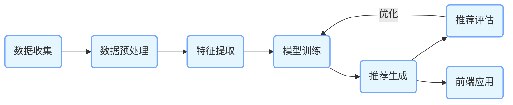

# 金融产品交叉销售推荐引擎

> 关键词：金融产品、交叉销售、推荐引擎、协同过滤、深度学习

> 摘要：本文围绕金融产品交叉销售推荐引擎展开深入探讨。首先介绍了该领域的背景信息，包括目的、预期读者、文档结构和相关术语。接着阐述了核心概念及其联系，给出了原理和架构的文本示意图与 Mermaid 流程图。详细讲解了核心算法原理，并用 Python 代码进行说明，同时介绍了相关的数学模型和公式。通过项目实战展示了代码的实际案例和详细解释。分析了金融产品交叉销售推荐引擎的实际应用场景，推荐了学习、开发相关的工具和资源，最后总结了未来发展趋势与挑战，提供了常见问题解答和扩展阅读参考资料，旨在为金融行业的交叉销售推荐提供全面且深入的技术指导。

## 1. 背景介绍 
### 1.1 目的和范围
金融产品交叉销售推荐引擎的主要目的是通过分析客户的历史行为、偏好和特征，为客户精准推荐合适的金融产品，从而提高金融机构的销售效率和客户满意度。其范围涵盖了各种金融产品，如银行的储蓄账户、信用卡、贷款产品，证券公司的股票、基金，保险公司的人寿保险、财产保险等。通过该推荐引擎，金融机构可以更好地了解客户需求，实现产品的精准营销，增加客户的购买意愿和忠诚度。

### 1.2 预期读者
本文的预期读者主要包括金融行业的从业者，如银行客户经理、金融分析师、市场营销人员等，他们可以通过本文了解如何利用推荐引擎进行金融产品的交叉销售。同时，也适合从事人工智能、数据挖掘领域的技术人员，他们可以从中获取金融领域推荐系统的具体应用和实现方法。此外，对金融科技感兴趣的研究人员和学生也可以从本文中获得相关的知识和启发。

### 1.3 文档结构概述
本文将按照以下结构进行阐述：首先介绍金融产品交叉销售推荐引擎的背景信息，包括目的、预期读者、文档结构和术语表。接着深入探讨核心概念与联系，通过文本示意图和 Mermaid 流程图展示其原理和架构。然后详细讲解核心算法原理，并使用 Python 代码进行具体实现。介绍相关的数学模型和公式，并举例说明。通过项目实战展示代码的实际应用和详细解释。分析金融产品交叉销售推荐引擎的实际应用场景。推荐学习、开发相关的工具和资源。最后总结未来发展趋势与挑战，提供常见问题解答和扩展阅读参考资料。

### 1.4 术语表
#### 1.4.1 核心术语定义
- **金融产品交叉销售**：指金融机构向现有客户推销其他相关金融产品的销售策略。例如，银行向持有储蓄账户的客户推荐信用卡或理财产品。
- **推荐引擎**：是一种基于数据分析和算法的系统，用于根据用户的历史行为、偏好等信息，为用户推荐可能感兴趣的物品或服务。
- **协同过滤**：是一种常用的推荐算法，通过分析用户之间或物品之间的相似性来进行推荐。分为基于用户的协同过滤和基于物品的协同过滤。
- **深度学习**：是一类基于人工神经网络的机器学习技术，能够自动从大量数据中学习复杂的模式和特征。

#### 1.4.2 相关概念解释
- **冷启动问题**：在推荐系统中，冷启动问题指的是当新用户或新物品进入系统时，由于缺乏足够的历史数据，导致推荐效果不佳的问题。
- **特征工程**：是指从原始数据中提取和转换特征的过程，以便更好地用于机器学习模型的训练。在金融产品交叉销售推荐中，特征工程可以包括客户的年龄、收入、信用评分等。
- **评估指标**：用于衡量推荐系统性能的指标，常见的评估指标包括准确率、召回率、F1 值、均方误差等。

#### 1.4.3 缩略词列表
- **CF**：协同过滤（Collaborative Filtering）
- **ANN**：人工神经网络（Artificial Neural Network）
- **RMSE**：均方根误差（Root Mean Squared Error）
- **AUC**：曲线下面积（Area Under the Curve）

## 2. 核心概念与联系 

### 核心概念原理
金融产品交叉销售推荐引擎的核心原理是通过收集和分析客户的各种信息，包括基本信息（如年龄、性别、职业等）、交易记录（如存款、取款、投资等）、行为数据（如浏览历史、咨询记录等），利用机器学习和数据分析技术建立客户画像和产品模型，从而预测客户对不同金融产品的兴趣和购买可能性。

其主要步骤包括：
1. **数据收集**：从金融机构的各个业务系统中收集客户的相关数据。
2. **数据预处理**：对收集到的数据进行清洗、转换和归一化等处理，以提高数据质量。
3. **特征提取**：从预处理后的数据中提取有价值的特征，用于模型训练。
4. **模型训练**：选择合适的机器学习算法，如协同过滤、深度学习等，对提取的特征进行训练，建立推荐模型。
5. **推荐生成**：根据训练好的模型，为每个客户生成个性化的金融产品推荐列表。
6. **推荐评估**：使用评估指标对推荐结果进行评估，不断优化推荐模型。

### 架构的文本示意图
金融产品交叉销售推荐引擎的架构主要包括以下几个部分：
1. **数据层**：负责收集和存储客户的各种数据，包括基本信息、交易记录、行为数据等。可以使用关系型数据库（如 MySQL、Oracle）或非关系型数据库（如 MongoDB、HBase）进行数据存储。
2. **数据处理层**：对收集到的数据进行预处理和特征提取，包括数据清洗、转换、归一化等操作。可以使用 Python 的 Pandas、Numpy 等库进行数据处理。
3. **模型层**：选择合适的机器学习算法进行模型训练，建立推荐模型。可以使用 Scikit-learn、TensorFlow、PyTorch 等机器学习框架进行模型训练。
4. **推荐服务层**：根据训练好的模型，为客户生成个性化的金融产品推荐列表，并将推荐结果返回给前端应用。可以使用 Flask、Django 等 Web 框架搭建推荐服务。
5. **前端应用层**：提供用户界面，让客户可以查看推荐的金融产品，并进行购买操作。可以使用 HTML、CSS、JavaScript 等前端技术开发用户界面。

### Mermaid 流程图


## 3. 核心算法原理 & 具体操作步骤 

### 协同过滤算法原理
协同过滤算法是推荐系统中最常用的算法之一，分为基于用户的协同过滤和基于物品的协同过滤。

#### 基于用户的协同过滤
基于用户的协同过滤算法的基本思想是：找到与目标用户兴趣相似的其他用户，然后根据这些相似用户的购买行为为目标用户进行推荐。具体步骤如下：
1. **计算用户之间的相似度**：常用的相似度计算方法有皮尔逊相关系数、余弦相似度等。假设用户 $u$ 和用户 $v$ 对物品 $i$ 的评分分别为 $r_{ui}$ 和 $r_{vi}$，则用户 $u$ 和用户 $v$ 的皮尔逊相关系数计算公式为：
$$
sim(u, v)=\frac{\sum_{i\in I_{uv}}(r_{ui}-\bar{r}_u)(r_{vi}-\bar{r}_v)}{\sqrt{\sum_{i\in I_{uv}}(r_{ui}-\bar{r}_u)^2\sum_{i\in I_{uv}}(r_{vi}-\bar{r}_v)^2}}
$$
其中，$I_{uv}$ 表示用户 $u$ 和用户 $v$ 共同评分的物品集合，$\bar{r}_u$ 和 $\bar{r}_v$ 分别表示用户 $u$ 和用户 $v$ 的平均评分。

2. **找到与目标用户最相似的 $k$ 个用户**：根据计算得到的用户相似度，选择与目标用户最相似的 $k$ 个用户。

3. **为目标用户生成推荐列表**：根据这 $k$ 个相似用户的购买行为，为目标用户推荐他们购买过但目标用户未购买过的物品。

#### 基于物品的协同过滤
基于物品的协同过滤算法的基本思想是：找到与目标物品相似的其他物品，然后根据目标用户对这些相似物品的购买行为为目标用户推荐目标物品。具体步骤如下：
1. **计算物品之间的相似度**：同样可以使用皮尔逊相关系数、余弦相似度等方法计算物品之间的相似度。假设物品 $i$ 和物品 $j$ 被用户 $u$ 评分分别为 $r_{ui}$ 和 $r_{uj}$，则物品 $i$ 和物品 $j$ 的皮尔逊相关系数计算公式为：
$$
sim(i, j)=\frac{\sum_{u\in U_{ij}}(r_{ui}-\bar{r}_i)(r_{uj}-\bar{r}_j)}{\sqrt{\sum_{u\in U_{ij}}(r_{ui}-\bar{r}_i)^2\sum_{u\in U_{ij}}(r_{uj}-\bar{r}_j)^2}}
$$
其中，$U_{ij}$ 表示对物品 $i$ 和物品 $j$ 都进行了评分的用户集合，$\bar{r}_i$ 和 $\bar{r}_j$ 分别表示物品 $i$ 和物品 $j$ 的平均评分。

2. **找到与目标物品最相似的 $k$ 个物品**：根据计算得到的物品相似度，选择与目标物品最相似的 $k$ 个物品。

3. **为目标用户生成推荐列表**：根据目标用户对这 $k$ 个相似物品的购买行为，为目标用户推荐目标物品。

### 深度学习算法原理
深度学习算法在推荐系统中也得到了广泛的应用，如使用神经网络来学习用户和物品的特征表示。以多层感知机（Multilayer Perceptron，MLP）为例，其基本原理是：将用户和物品的特征向量作为输入，通过多个隐藏层进行非线性变换，最后输出用户对物品的预测评分。

具体步骤如下：
1. **数据预处理**：将用户和物品的特征进行编码和归一化处理，转换为适合神经网络输入的格式。
2. **构建神经网络模型**：定义神经网络的结构，包括输入层、隐藏层和输出层的神经元数量，以及激活函数的选择。
3. **模型训练**：使用训练数据对神经网络模型进行训练，通过反向传播算法不断调整模型的参数，使得预测评分与实际评分之间的误差最小化。
4. **推荐生成**：根据训练好的模型，为每个用户预测对不同物品的评分，选择评分较高的物品作为推荐结果。

### Python 代码实现

#### 协同过滤算法实现
```python
import numpy as np
from sklearn.metrics.pairwise import cosine_similarity

# 示例评分矩阵，行表示用户，列表示物品
ratings = np.array([
    [5, 3, 0, 1],
    [4, 0, 0, 1],
    [1, 1, 0, 5],
    [1, 0, 0, 4],
    [0, 1, 5, 4]
])

# 计算用户之间的相似度
user_similarity = cosine_similarity(ratings)

# 找到与目标用户最相似的 k 个用户
target_user = 0
k = 2
similar_users = np.argsort(user_similarity[target_user])[::-1][1:k+1]

# 为目标用户生成推荐列表
unrated_items = np.where(ratings[target_user] == 0)[0]
recommended_items = []
for item in unrated_items:
    score = 0
    for user in similar_users:
        score += user_similarity[target_user][user] * ratings[user][item]
    recommended_items.append((item, score))

# 按评分排序并选择前 n 个推荐物品
n = 2
recommended_items.sort(key=lambda x: x[1], reverse=True)
top_n_recommendations = [item[0] for item in recommended_items[:n]]

print("Top {} recommendations for user {}: {}".format(n, target_user, top_n_recommendations))
```

#### 深度学习算法实现
```python
import tensorflow as tf
from tensorflow.keras.models import Model
from tensorflow.keras.layers import Input, Embedding, Flatten, Dense, Concatenate

# 示例数据
num_users = 5
num_items = 4
user_ids = np.array([0, 1, 2, 3, 4])
item_ids = np.array([0, 1, 2, 3])
ratings = np.array([5, 4, 1, 1, 1])

# 构建神经网络模型
user_input = Input(shape=(1,))
item_input = Input(shape=(1,))

user_embedding = Embedding(input_dim=num_users, output_dim=10)(user_input)
item_embedding = Embedding(input_dim=num_items, output_dim=10)(item_input)

user_flatten = Flatten()(user_embedding)
item_flatten = Flatten()(item_embedding)

concat = Concatenate()([user_flatten, item_flatten])
dense1 = Dense(64, activation='relu')(concat)
output = Dense(1)(dense1)

model = Model(inputs=[user_input, item_input], outputs=output)

# 编译模型
model.compile(optimizer='adam', loss='mse')

# 训练模型
model.fit([user_ids, item_ids], ratings, epochs=10, batch_size=1)

# 为目标用户生成推荐
target_user_id = np.array([0])
all_item_ids = np.arange(num_items)
predictions = model.predict([np.repeat(target_user_id, num_items), all_item_ids])
recommended_item_index = np.argmax(predictions)

print("Recommended item for user {}: {}".format(target_user_id[0], recommended_item_index))
```

## 4. 数学模型和公式 & 详细讲解 & 举例说明 

### 协同过滤中的相似度计算
#### 皮尔逊相关系数
皮尔逊相关系数用于衡量两个变量之间的线性相关性，在协同过滤中常用于计算用户之间或物品之间的相似度。其计算公式为：
$$
sim(u, v)=\frac{\sum_{i\in I_{uv}}(r_{ui}-\bar{r}_u)(r_{vi}-\bar{r}_v)}{\sqrt{\sum_{i\in I_{uv}}(r_{ui}-\bar{r}_u)^2\sum_{i\in I_{uv}}(r_{vi}-\bar{r}_v)^2}}
$$
其中，$u$ 和 $v$ 表示用户，$i$ 表示物品，$r_{ui}$ 表示用户 $u$ 对物品 $i$ 的评分，$\bar{r}_u$ 表示用户 $u$ 的平均评分，$I_{uv}$ 表示用户 $u$ 和用户 $v$ 共同评分的物品集合。

举例说明：假设有两个用户 $A$ 和 $B$，他们对物品 $1$、$2$、$3$ 的评分分别为 $A=(5, 3, 1)$ 和 $B=(4, 2, 0)$。首先计算用户 $A$ 和 $B$ 的平均评分：
$$
\bar{r}_A=\frac{5 + 3 + 1}{3}=3
$$
$$
\bar{r}_B=\frac{4 + 2 + 0}{3}=2
$$
然后计算分子和分母：
分子：
$$
\begin{align*}
&\sum_{i=1}^{3}(r_{Ai}-\bar{r}_A)(r_{Bi}-\bar{r}_B)\\
=&(5 - 3)(4 - 2)+(3 - 3)(2 - 2)+(1 - 3)(0 - 2)\\
=&2\times2 + 0\times0 + (-2)\times(-2)\\
=&4 + 0 + 4\\
=&8
\end{align*}
$$
分母：
$$
\begin{align*}
&\sqrt{\sum_{i=1}^{3}(r_{Ai}-\bar{r}_A)^2\sum_{i=1}^{3}(r_{Bi}-\bar{r}_B)^2}\\
=&\sqrt{( (5 - 3)^2+(3 - 3)^2+(1 - 3)^2 )( (4 - 2)^2+(2 - 2)^2+(0 - 2)^2 )}\\
=&\sqrt{(4 + 0 + 4)(4 + 0 + 4)}\\
=&\sqrt{8\times8}\\
=&8
\end{align*}
$$
最后得到用户 $A$ 和 $B$ 的皮尔逊相关系数：
$$
sim(A, B)=\frac{8}{8}=1
$$

#### 余弦相似度
余弦相似度通过计算两个向量之间的夹角余弦值来衡量它们的相似度。在协同过滤中，将用户的评分向量或物品的评分向量看作向量，计算它们之间的余弦相似度。其计算公式为：
$$
sim(u, v)=\frac{\mathbf{r}_u\cdot\mathbf{r}_v}{\|\mathbf{r}_u\|\|\mathbf{r}_v\|}
$$
其中，$\mathbf{r}_u$ 和 $\mathbf{r}_v$ 分别表示用户 $u$ 和用户 $v$ 的评分向量，$\cdot$ 表示向量的点积，$\|\mathbf{r}_u\|$ 和 $\|\mathbf{r}_v\|$ 分别表示向量 $\mathbf{r}_u$ 和 $\mathbf{r}_v$ 的模。

举例说明：假设有两个用户 $C$ 和 $D$，他们的评分向量分别为 $C=(3, 4)$ 和 $D=(6, 8)$。首先计算向量的点积和模：
点积：
$$
\mathbf{r}_C\cdot\mathbf{r}_D=3\times6 + 4\times8=18 + 32=50
$$
模：
$$
\|\mathbf{r}_C\|=\sqrt{3^2 + 4^2}=\sqrt{9 + 16}=5
$$
$$
\|\mathbf{r}_D\|=\sqrt{6^2 + 8^2}=\sqrt{36 + 64}=10
$$
最后得到用户 $C$ 和 $D$ 的余弦相似度：
$$
sim(C, D)=\frac{50}{5\times10}=1
$$

### 深度学习中的损失函数
在深度学习推荐模型中，常用的损失函数是均方误差（Mean Squared Error，MSE），用于衡量模型预测值与真实值之间的误差。其计算公式为：
$$
MSE=\frac{1}{n}\sum_{i=1}^{n}(y_i-\hat{y}_i)^2
$$
其中，$n$ 表示样本数量，$y_i$ 表示真实评分，$\hat{y}_i$ 表示模型预测评分。

举例说明：假设有 3 个样本，真实评分分别为 $y=(5, 4, 3)$，模型预测评分分别为 $\hat{y}=(4, 3, 2)$。则均方误差为：
$$
\begin{align*}
MSE&=\frac{1}{3}((5 - 4)^2+(4 - 3)^2+(3 - 2)^2)\\
&=\frac{1}{3}(1^2 + 1^2 + 1^2)\\
&=\frac{1}{3}(1 + 1 + 1)\\
&=1
\end{align*}
$$

## 5. 项目实战：代码实际案例和详细解释说明 

### 5.1  开发环境搭建
#### 操作系统
推荐使用 Linux 系统，如 Ubuntu 或 CentOS，也可以使用 Windows 系统。

#### 编程语言
使用 Python 作为开发语言，建议使用 Python 3.7 及以上版本。

#### 开发工具
可以使用 PyCharm 作为集成开发环境（IDE），也可以使用 Jupyter Notebook 进行代码的编写和调试。

#### 依赖库安装
使用以下命令安装所需的依赖库：
```sh
pip install numpy pandas scikit-learn tensorflow flask
```

### 5.2  源代码详细实现和代码解读
#### 数据准备
假设我们有一个包含用户 ID、物品 ID 和评分的 CSV 文件 `ratings.csv`，可以使用以下代码读取数据：
```python
import pandas as pd

# 读取数据
data = pd.read_csv('ratings.csv')

# 查看数据基本信息
print(data.info())

# 查看数据集行数和列数
rows, columns = data.shape

# 数据预处理
# 对数据进行归一化处理，例如将评分归一化到 [0, 1] 区间
data['rating'] = data['rating'] / data['rating'].max()

# 划分训练集和测试集
from sklearn.model_selection import train_test_split
train_data, test_data = train_test_split(data, test_size=0.2, random_state=42)
```
代码解读：首先使用 Pandas 库读取 CSV 文件，然后查看数据的基本信息。接着对评分数据进行归一化处理，将评分值映射到 [0, 1] 区间。最后使用 `train_test_split` 函数将数据划分为训练集和测试集，测试集占比为 20%。

#### 协同过滤模型实现
```python
import numpy as np
from sklearn.metrics.pairwise import cosine_similarity

# 创建用户 - 物品评分矩阵
user_item_matrix = train_data.pivot(index='user_id', columns='item_id', values='rating').fillna(0)

# 计算用户之间的相似度
user_similarity = cosine_similarity(user_item_matrix)

# 定义预测函数
def predict(ratings, similarity):
    mean_user_rating = ratings.mean(axis=1)
    ratings_diff = (ratings - mean_user_rating[:, np.newaxis])
    pred = mean_user_rating[:, np.newaxis] + similarity.dot(ratings_diff) / np.array([np.abs(similarity).sum(axis=1)]).T
    return pred

# 进行预测
user_item_prediction = predict(user_item_matrix.values, user_similarity)

# 将预测结果转换为 DataFrame
user_item_prediction_df = pd.DataFrame(user_item_prediction, index=user_item_matrix.index, columns=user_item_matrix.columns)
```
代码解读：首先使用 `pivot` 函数将训练数据转换为用户 - 物品评分矩阵，并将缺失值填充为 0。然后使用 `cosine_similarity` 函数计算用户之间的余弦相似度。定义 `predict` 函数，根据用户相似度和评分矩阵进行预测。最后将预测结果转换为 DataFrame 格式。

#### 深度学习模型实现
```python
import tensorflow as tf
from tensorflow.keras.models import Model
from tensorflow.keras.layers import Input, Embedding, Flatten, Dense, Concatenate

# 提取用户 ID 和物品 ID 的最大值
num_users = data['user_id'].max() + 1
num_items = data['item_id'].max() + 1

# 构建神经网络模型
user_input = Input(shape=(1,))
item_input = Input(shape=(1,))

user_embedding = Embedding(input_dim=num_users, output_dim=10)(user_input)
item_embedding = Embedding(input_dim=num_items, output_dim=10)(item_input)

user_flatten = Flatten()(user_embedding)
item_flatten = Flatten()(item_embedding)

concat = Concatenate()([user_flatten, item_flatten])
dense1 = Dense(64, activation='relu')(concat)
output = Dense(1)(dense1)

model = Model(inputs=[user_input, item_input], outputs=output)

# 编译模型
model.compile(optimizer='adam', loss='mse')

# 准备训练数据
train_user_ids = train_data['user_id'].values
train_item_ids = train_data['item_id'].values
train_ratings = train_data['rating'].values

# 训练模型
model.fit([train_user_ids, train_item_ids], train_ratings, epochs=10, batch_size=32)
```
代码解读：首先提取用户 ID 和物品 ID 的最大值，用于定义嵌入层的输入维度。然后构建神经网络模型，包括输入层、嵌入层、扁平化层、全连接层和输出层。使用 `compile` 函数编译模型，指定优化器为 Adam，损失函数为均方误差。准备训练数据，将用户 ID、物品 ID 和评分转换为 Numpy 数组。最后使用 `fit` 函数训练模型，训练 10 个 epoch，批量大小为 32。

#### 推荐服务搭建
```python
from flask import Flask, request, jsonify

app = Flask(__name__)

@app.route('/recommend', methods=['POST'])
def recommend():
    data = request.get_json()
    user_id = data['user_id']
    num_recommendations = data.get('num_recommendations', 5)

    # 协同过滤推荐
    user_ratings = user_item_prediction_df.loc[user_id]
    top_recommendations_cf = user_ratings.sort_values(ascending=False).head(num_recommendations).index.tolist()

    # 深度学习推荐
    all_item_ids = np.arange(num_items)
    user_ids = np.repeat(user_id, num_items)
    predictions = model.predict([user_ids, all_item_ids])
    top_recommendations_dl = np.argsort(predictions.flatten())[::-1][:num_recommendations].tolist()

    return jsonify({
        'collaborative_filtering_recommendations': top_recommendations_cf,
        'deep_learning_recommendations': top_recommendations_dl
    })

if __name__ == '__main__':
    app.run(debug=True)
```
代码解读：使用 Flask 框架搭建推荐服务，定义一个 `/recommend` 接口，接收用户 ID 和推荐数量作为输入。在接口中，分别使用协同过滤模型和深度学习模型为用户生成推荐列表，并将推荐结果以 JSON 格式返回。

### 5.3  代码解读与分析
#### 协同过滤模型分析
协同过滤模型的优点是简单易懂，实现方便，能够利用用户之间或物品之间的相似性进行推荐。缺点是对于新用户或新物品存在冷启动问题，且计算复杂度较高，特别是在数据量较大时。

#### 深度学习模型分析
深度学习模型的优点是能够自动学习数据中的复杂模式和特征，对于处理大规模数据和高维数据具有较好的效果。缺点是模型复杂度较高，训练时间较长，需要大量的训练数据和计算资源。

#### 推荐服务分析
通过 Flask 框架搭建的推荐服务可以方便地与前端应用进行集成，提供实时的推荐服务。使用 JSON 格式返回推荐结果，便于前端应用进行解析和展示。

## 6. 实际应用场景 
### 银行领域
- **储蓄账户客户推荐**：银行可以根据储蓄账户客户的存款金额、存款期限、交易频率等信息，为他们推荐信用卡、理财产品、贷款产品等。例如，对于存款金额较大且交易频繁的客户，可以推荐高端信用卡和高收益理财产品；对于有一定存款但资金流动性需求较高的客户，可以推荐短期理财产品或灵活贷款产品。
- **信用卡客户推荐**：针对信用卡客户，银行可以根据他们的消费行为、还款记录、信用评分等信息，为他们推荐其他信用卡产品、分期付款服务、保险产品等。例如，对于经常在海外消费的客户，可以推荐具有境外消费优惠的信用卡；对于信用评分较高且消费金额较大的客户，可以推荐分期付款服务和信用保险产品。

### 证券领域
- **股票投资者推荐**：证券公司可以根据股票投资者的投资偏好、交易记录、风险承受能力等信息，为他们推荐股票、基金、债券等金融产品。例如，对于偏好价值投资的投资者，可以推荐业绩稳定、股息率高的蓝筹股；对于风险承受能力较高的投资者，可以推荐成长型股票和股票型基金。
- **基金投资者推荐**：针对基金投资者，证券公司可以根据他们的投资组合、投资期限、收益目标等信息，为他们推荐不同类型的基金产品。例如，对于短期投资者，可以推荐货币基金和短期债券基金；对于长期投资者，可以推荐混合型基金和股票型基金。

### 保险领域
- **人寿保险客户推荐**：保险公司可以根据人寿保险客户的年龄、性别、职业、健康状况等信息，为他们推荐其他人寿保险产品、健康保险产品、养老保险产品等。例如，对于年轻的上班族，可以推荐定期寿险和意外险；对于中年人群，可以推荐重疾险和养老保险。
- **财产保险客户推荐**：针对财产保险客户，保险公司可以根据他们的财产状况、保险需求、风险偏好等信息，为他们推荐不同类型的财产保险产品。例如，对于有房产的客户，可以推荐家庭财产保险；对于有车辆的客户，可以推荐车险和第三者责任险。

## 7. 工具和资源推荐
### 7.1 学习资源推荐
#### 7.1.1 书籍推荐
- 《推荐系统实践》：作者项亮，本书系统地介绍了推荐系统的基本概念、算法和实践经验，是学习推荐系统的经典书籍。
- 《深度学习》：作者 Ian Goodfellow、Yoshua Bengio 和 Aaron Courville，本书全面介绍了深度学习的基本原理、算法和应用，是深度学习领域的权威著作。
- 《Python 数据分析实战》：作者 Robert Layton，本书通过实际案例介绍了使用 Python 进行数据分析的方法和技巧，对于学习推荐系统中的数据处理和分析非常有帮助。

#### 7.1.2 在线课程
- Coursera 上的“机器学习”课程：由斯坦福大学教授 Andrew Ng 主讲，是机器学习领域的经典课程，涵盖了推荐系统的相关内容。
- edX 上的“深度学习专项课程”：由 deeplearning.ai 提供，包括深度学习基础、卷积神经网络、循环神经网络等多个课程，对于深入学习深度学习在推荐系统中的应用非常有帮助。
- 阿里云天池平台上的“推荐系统实战”课程：该课程结合实际案例，介绍了推荐系统的算法原理、实现方法和优化技巧，具有很强的实践性。

#### 7.1.3 技术博客和网站
- 推荐系统研究社区（RSWeb）：提供了推荐系统领域的最新研究成果、技术文章和开源代码，是了解推荐系统发展动态的重要平台。
- 机器学习算法全栈工程师（Machine Learning Mastery）：该博客提供了丰富的机器学习和深度学习教程，包括推荐系统的相关内容，适合初学者和进阶者学习。
- Kaggle：是一个数据科学竞赛平台，上面有很多关于推荐系统的竞赛和数据集，可以通过参与竞赛和学习优秀的解决方案来提高自己的实践能力。

### 7.2 开发工具框架推荐
#### 7.2.1 IDE和编辑器
- PyCharm：是一款专门为 Python 开发设计的集成开发环境，具有代码自动补全、调试、版本控制等功能，非常适合开发推荐系统。
- Jupyter Notebook：是一个交互式的编程环境，支持多种编程语言，如 Python、R 等，可以方便地进行数据探索、模型训练和结果展示。
- Visual Studio Code：是一款轻量级的代码编辑器，支持多种编程语言和插件扩展，具有良好的代码编辑体验和调试功能。

#### 7.2.2 调试和性能分析工具
- TensorBoard：是 TensorFlow 提供的可视化工具，可以用于可视化模型的训练过程、损失函数变化、梯度分布等信息，帮助开发者调试和优化模型。
- Py-Spy：是一个 Python 性能分析工具，可以实时监控 Python 程序的 CPU 使用率、函数调用时间等信息，帮助开发者找出性能瓶颈。
- Scalene：是一个高性能的 Python 性能分析器，可以精确地测量 Python 代码的 CPU 和内存使用情况，提供详细的性能报告。

#### 7.2.3 相关框架和库
- Scikit-learn：是一个常用的机器学习库，提供了丰富的机器学习算法和工具，如分类、回归、聚类、降维等，对于实现推荐系统中的协同过滤算法非常有帮助。
- TensorFlow：是一个开源的深度学习框架，支持多种深度学习模型的构建和训练，如神经网络、卷积神经网络、循环神经网络等，广泛应用于推荐系统的开发。
- PyTorch：是另一个流行的深度学习框架，具有简洁的 API 和动态图机制，适合快速开发和实验，在推荐系统领域也有广泛的应用。

### 7.3 相关论文著作推荐
#### 7.3.1 经典论文
- “Item-based Collaborative Filtering Recommendation Algorithms”：该论文提出了基于物品的协同过滤算法，是协同过滤领域的经典论文之一。
- “Deep Neural Networks for YouTube Recommendations”：谷歌团队发表的关于使用深度学习进行 YouTube 视频推荐的论文，介绍了深度学习在大规模推荐系统中的应用。
- “Factorization Machines”：提出了因子分解机模型，能够有效地处理高维稀疏数据，在推荐系统中得到了广泛的应用。

#### 7.3.2 最新研究成果
- 在 ACM SIGKDD、NeurIPS、ICML 等顶级学术会议上，每年都会有很多关于推荐系统的最新研究成果发表，可以关注这些会议的论文集，了解推荐系统领域的最新动态。
- 一些知名的学术期刊，如 Journal of Machine Learning Research、ACM Transactions on Information Systems 等，也会发表推荐系统相关的高质量研究论文。

#### 7.3.3 应用案例分析
- 各大金融机构的官方网站和技术博客上，会分享他们在金融产品交叉销售推荐方面的实践经验和应用案例，可以从中学习到实际应用中的技术选型、数据处理和模型优化等方面的知识。
- 一些数据科学竞赛平台，如 Kaggle、天池等，会有金融领域的推荐系统竞赛，通过学习优秀的解决方案和竞赛报告，可以了解到最新的技术应用和实践技巧。

## 8. 总结：未来发展趋势与挑战
### 未来发展趋势
#### 多模态数据融合
未来的金融产品交叉销售推荐引擎将不仅仅依赖于用户的交易数据和基本信息，还会融合更多的多模态数据，如用户的社交媒体数据、地理位置数据、语音和图像数据等。通过综合分析这些多模态数据，可以更全面地了解用户的兴趣和需求，提高推荐的准确性和个性化程度。

#### 强化学习的应用
强化学习是一种通过智能体与环境进行交互并根据奖励信号来学习最优策略的机器学习方法。在金融产品交叉销售推荐中，强化学习可以用于动态调整推荐策略，根据用户的实时反馈和市场变化来优化推荐结果，提高推荐系统的适应性和灵活性。

#### 联邦学习
随着数据隐私和安全问题的日益关注，联邦学习将在金融产品交叉销售推荐中得到更广泛的应用。联邦学习允许在不共享原始数据的情况下进行模型训练，各个参与方可以在本地设备上进行模型训练，并通过加密通信机制交换模型参数，从而在保护数据隐私的前提下实现联合建模和推荐。

#### 可解释性推荐
为了提高用户对推荐结果的信任度和接受度，未来的推荐系统将更加注重可解释性。可解释性推荐可以向用户解释推荐结果的生成原因和依据，让用户了解为什么会得到这些推荐，从而提高用户的满意度和忠诚度。

### 挑战
#### 数据质量和隐私问题
金融数据通常具有高敏感性和隐私性，数据的收集、存储和使用需要严格遵守相关法律法规和监管要求。同时，数据质量也会影响推荐系统的性能，如数据缺失、噪声和异常值等问题需要进行有效的处理。

#### 冷启动问题
新用户和新金融产品的冷启动问题仍然是推荐系统面临的挑战之一。由于缺乏足够的历史数据，很难为新用户和新金融产品进行准确的推荐。需要研究和应用有效的冷启动策略，如基于内容的推荐、元数据推荐等。

#### 模型复杂度和计算资源
随着深度学习等复杂模型在推荐系统中的应用，模型的复杂度和计算资源需求也越来越高。需要优化模型结构和算法，提高模型的训练和推理效率，降低计算成本。

#### 市场变化和用户需求的动态性
金融市场和用户需求是动态变化的，推荐系统需要能够及时响应这些变化，调整推荐策略和模型参数。需要建立实时监测和反馈机制，不断更新和优化推荐系统。

## 9. 附录：常见问题与解答
### 1. 如何解决金融产品交叉销售推荐中的冷启动问题？
- **基于内容的推荐**：对于新用户，可以根据用户的基本信息（如年龄、性别、职业等）和兴趣标签，为其推荐与这些特征相关的金融产品。对于新金融产品，可以根据产品的属性和特点，为其匹配具有相应需求的用户。
- **元数据推荐**：利用金融产品的元数据，如产品类型、风险等级、收益情况等，为用户推荐符合其偏好的产品。同时，可以收集用户对元数据的反馈，不断优化推荐模型。
- **引导用户提供信息**：在用户注册或使用过程中，引导用户提供更多的信息，如投资经验、风险承受能力等，以便更好地了解用户需求，为其提供个性化的推荐。

### 2. 如何评估金融产品交叉销售推荐引擎的性能？
- **准确率和召回率**：准确率是指推荐的金融产品中用户实际感兴趣的比例，召回率是指用户实际感兴趣的金融产品中被推荐出来的比例。可以通过设置阈值来计算准确率和召回率，评估推荐系统的准确性和覆盖范围。
- **F1 值**：F1 值是准确率和召回率的调和平均数，综合考虑了准确率和召回率两个指标，能够更全面地评估推荐系统的性能。
- **均方误差（MSE）和均方根误差（RMSE）**：对于预测评分的推荐系统，可以使用 MSE 和 RMSE 来衡量预测评分与实际评分之间的误差，误差越小，说明推荐系统的性能越好。
- **AUC（曲线下面积）**：AUC 是衡量分类模型性能的常用指标，对于二分类的推荐问题（如推荐或不推荐），可以使用 AUC 来评估推荐系统的性能。

### 3. 如何处理金融数据中的缺失值和异常值？
- **缺失值处理**：可以采用删除含有缺失值的记录、填充缺失值（如使用均值、中位数、众数等统计量填充）、使用插值方法（如线性插值、样条插值等）等方法处理缺失值。
- **异常值处理**：可以采用基于统计的方法（如 Z 分数法、箱线图法等）识别异常值，然后根据具体情况进行处理，如删除异常值、修正异常值或对异常值进行平滑处理。

### 4. 如何选择适合的推荐算法？
- **数据规模和复杂度**：如果数据规模较小且复杂度较低，可以选择简单的推荐算法，如基于规则的推荐、协同过滤算法等。如果数据规模较大且复杂度较高，可以选择深度学习等复杂的推荐算法。
- **业务需求和场景**：不同的业务需求和场景对推荐算法的要求不同。例如，对于实时性要求较高的场景，需要选择计算效率高的推荐算法；对于个性化要求较高的场景，需要选择能够学习用户个性化特征的推荐算法。
- **可解释性要求**：如果对推荐结果的可解释性要求较高，可以选择可解释性较强的推荐算法，如基于规则的推荐、线性回归等。

## 10. 扩展阅读 & 参考资料
### 扩展阅读
- 《大数据时代：生活、工作与思维的大变革》：作者维克托·迈尔 - 舍恩伯格，本书介绍了大数据的概念、特点和应用，对于理解金融产品交叉销售推荐中数据的重要性和价值有很大帮助。
- 《人工智能时代：人类将何去何从》：作者李开复、王咏刚，本书探讨了人工智能的发展现状和未来趋势，以及对人类社会的影响，对于了解金融科技领域的发展方向有一定的启示。
- 《创新者的窘境》：作者克莱顿·克里斯坦森，本书介绍了创新的类型和规律，以及企业如何应对创新带来的挑战，对于金融机构在推荐系统创新方面有一定的借鉴意义。

### 参考资料
- 《金融科技发展规划（2022 - 2025 年）》：中国人民银行发布的金融科技发展规划，对金融科技的发展方向、重点任务和保障措施等进行了明确的部署，是金融科技领域的重要政策文件。
- 《个人金融信息保护技术规范》：中国人民银行发布的关于个人金融信息保护的技术规范，规定了个人金融信息在收集、存储、使用、传输等环节的安全要求，对于金融产品交叉销售推荐中的数据安全和隐私保护具有重要的指导意义。
- 各大金融机构的官方网站和技术博客，如工商银行、招商银行、蚂蚁金服等，这些网站和博客会分享他们在金融科技领域的实践经验和技术成果，是获取金融产品交叉销售推荐相关信息的重要来源。

作者：AI天才研究院/AI Genius Institute & 禅与计算机程序设计艺术 /Zen And The Art of Computer Programming