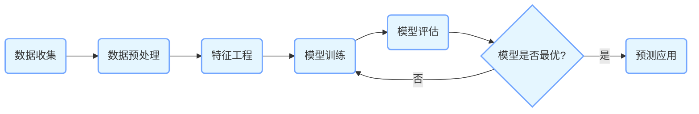

# 金融产品交叉销售预测引擎

> 关键词：金融产品、交叉销售、预测引擎、机器学习、数据分析

> 摘要：本文围绕金融产品交叉销售预测引擎展开深入探讨。旨在帮助金融机构更精准地预测客户对不同金融产品的需求，实现交叉销售，提高客户价值和业务收益。文章详细介绍了金融产品交叉销售预测引擎的背景、核心概念、算法原理、数学模型、项目实战、实际应用场景等内容，并提供了相关的工具和资源推荐，最后对其未来发展趋势与挑战进行了总结。

## 1. 背景介绍 
### 1.1 目的和范围
在金融行业竞争日益激烈的今天，如何有效地挖掘客户的潜在需求，实现金融产品的交叉销售，成为金融机构提高客户满意度和业务收入的关键。金融产品交叉销售预测引擎的目的就是利用先进的数据分析和机器学习技术，对客户的历史数据进行分析和挖掘，预测客户对不同金融产品的购买概率，为金融机构的营销决策提供支持。

本文的范围主要涵盖金融产品交叉销售预测引擎的原理、算法、实现和应用等方面。将介绍相关的核心概念和技术，通过具体的代码示例展示如何构建和训练预测模型，并探讨其在实际金融业务中的应用场景。

### 1.2 预期读者
本文的预期读者包括金融行业的从业者，如市场营销人员、业务分析师、数据科学家等，他们希望通过技术手段提升金融产品的交叉销售效果；也包括对机器学习和数据分析在金融领域应用感兴趣的技术人员，如程序员、软件架构师等，他们希望了解如何将相关技术应用到实际的金融业务中。

### 1.3 文档结构概述
本文将按照以下结构进行组织：
1. 背景介绍：阐述金融产品交叉销售预测引擎的目的、范围、预期读者和文档结构概述。
2. 核心概念与联系：介绍金融产品交叉销售、预测引擎等核心概念，以及它们之间的联系，并通过文本示意图和 Mermaid 流程图进行展示。
3. 核心算法原理 & 具体操作步骤：讲解常用的机器学习算法在金融产品交叉销售预测中的应用原理，并使用 Python 源代码详细阐述具体的操作步骤。
4. 数学模型和公式 & 详细讲解 & 举例说明：介绍金融产品交叉销售预测中涉及的数学模型和公式，并通过具体的例子进行详细讲解。
5. 项目实战：代码实际案例和详细解释说明：通过一个实际的项目案例，展示如何搭建开发环境、实现源代码，并对代码进行详细解读和分析。
6. 实际应用场景：探讨金融产品交叉销售预测引擎在实际金融业务中的应用场景。
7. 工具和资源推荐：推荐相关的学习资源、开发工具框架和论文著作。
8. 总结：未来发展趋势与挑战：总结金融产品交叉销售预测引擎的未来发展趋势和面临的挑战。
9. 附录：常见问题与解答：解答读者在阅读过程中可能遇到的常见问题。
10. 扩展阅读 & 参考资料：提供相关的扩展阅读材料和参考资料。

### 1.4 术语表
#### 1.4.1 核心术语定义
- **金融产品交叉销售**：指金融机构向现有客户推销其他相关金融产品的营销策略。例如，银行向已有储蓄账户的客户推销信用卡、理财产品等。
- **预测引擎**：一种利用数据分析和机器学习技术，对未来事件或结果进行预测的系统。在金融产品交叉销售中，预测引擎用于预测客户对不同金融产品的购买概率。
- **机器学习**：一门多领域交叉学科，涉及概率论、统计学、逼近论、凸分析、算法复杂度理论等多门学科。它专门研究计算机怎样模拟或实现人类的学习行为，以获取新的知识或技能，重新组织已有的知识结构使之不断改善自身的性能。
- **特征工程**：指对原始数据进行预处理、提取和转换，以得到适合机器学习模型输入的特征的过程。在金融产品交叉销售预测中，特征工程包括对客户的基本信息、交易记录、信用评级等数据进行处理和分析。

#### 1.4.2 相关概念解释
- **数据挖掘**：从大量的、不完全的、有噪声的、模糊的、随机的数据中，提取隐含在其中的、人们事先不知道的、但又是潜在有用的信息和知识的过程。在金融产品交叉销售预测中，数据挖掘用于发现客户的潜在需求和购买模式。
- **模型评估**：对机器学习模型的性能进行评估的过程。常用的评估指标包括准确率、召回率、F1 值、ROC 曲线等。在金融产品交叉销售预测中，模型评估用于选择最优的预测模型。
- **过拟合**：指机器学习模型在训练数据上表现良好，但在测试数据上表现不佳的现象。过拟合通常是由于模型过于复杂，对训练数据中的噪声和异常值过度拟合导致的。在金融产品交叉销售预测中，需要避免过拟合现象的发生。

#### 1.4.3 缩略词列表
- **ML**：Machine Learning，机器学习
- **ROC**：Receiver Operating Characteristic，受试者工作特征曲线
- **AUC**：Area Under the Curve，曲线下面积
- **F1**：F1 值，是准确率和召回率的调和平均数

## 2. 核心概念与联系 

### 核心概念原理
#### 金融产品交叉销售
金融产品交叉销售的核心原理是基于客户的需求和行为特征，发现客户对不同金融产品的潜在需求。通过分析客户的历史交易数据、基本信息、信用评级等，金融机构可以了解客户的消费习惯、风险偏好和财务状况，从而有针对性地向客户推荐适合的金融产品。

#### 预测引擎
预测引擎是金融产品交叉销售的关键技术之一。它利用机器学习算法对客户的历史数据进行建模和训练，预测客户对不同金融产品的购买概率。预测引擎的工作流程包括数据收集、数据预处理、特征工程、模型训练和模型评估等环节。

### 架构的文本示意图
```plaintext
金融产品交叉销售预测引擎架构

数据收集层
|-- 客户基本信息（年龄、性别、职业等）
|-- 交易记录（存款、贷款、信用卡消费等）
|-- 信用评级信息

数据预处理层
|-- 数据清洗（去除缺失值、异常值等）
|-- 数据归一化（将数据转换到同一尺度）
|-- 数据编码（将分类变量转换为数值变量）

特征工程层
|-- 特征提取（从原始数据中提取有价值的特征）
|-- 特征选择（选择对预测结果影响较大的特征）

模型训练层
|-- 选择合适的机器学习算法（逻辑回归、决策树、随机森林等）
|-- 使用训练数据对模型进行训练

模型评估层
|-- 使用测试数据对模型进行评估
|-- 选择最优的模型

预测应用层
|-- 根据最优模型对新客户进行预测
|-- 向客户推荐合适的金融产品
```

### Mermaid 流程图


## 3. 核心算法原理 & 具体操作步骤 

### 逻辑回归算法原理
逻辑回归是一种常用的二分类算法，它通过逻辑函数将线性回归的输出映射到 [0, 1] 区间，从而得到一个概率值。逻辑回归的数学模型可以表示为：

$$P(y=1|x)=\frac{1}{1+e^{-(w_0 + w_1x_1 + w_2x_2 + \cdots + w_nx_n)}}$$

其中，$P(y=1|x)$ 表示在输入特征 $x$ 下，样本属于正类的概率；$w_0, w_1, w_2, \cdots, w_n$ 是模型的参数；$x_1, x_2, \cdots, x_n$ 是输入特征。

### 具体操作步骤（Python 实现）
```python
import numpy as np
from sklearn.linear_model import LogisticRegression
from sklearn.model_selection import train_test_split
from sklearn.metrics import accuracy_score

# 生成示例数据
np.random.seed(0)
X = np.random.randn(100, 2)
y = (X[:, 0] + X[:, 1] > 0).astype(int)

# 划分训练集和测试集
X_train, X_test, y_train, y_test = train_test_split(X, y, test_size=0.2, random_state=42)

# 创建逻辑回归模型
model = LogisticRegression()

# 训练模型
model.fit(X_train, y_train)

# 进行预测
y_pred = model.predict(X_test)

# 评估模型
accuracy = accuracy_score(y_test, y_pred)
print(f"模型准确率: {accuracy}")
```

### 代码解释
1. **数据生成**：使用 `numpy` 生成 100 个二维随机样本，并根据样本的特征值生成对应的标签。
2. **数据划分**：使用 `train_test_split` 函数将数据划分为训练集和测试集，其中测试集占比为 20%。
3. **模型创建**：创建一个逻辑回归模型对象。
4. **模型训练**：使用训练集数据对模型进行训练。
5. **模型预测**：使用训练好的模型对测试集数据进行预测。
6. **模型评估**：使用 `accuracy_score` 函数计算模型的准确率。

### 决策树算法原理
决策树是一种基于树结构进行决策的机器学习算法。它通过对特征空间进行划分，将样本分配到不同的叶子节点，每个叶子节点对应一个类别或一个值。决策树的构建过程是一个递归的过程，每次选择一个最优的特征进行划分，直到满足停止条件为止。

### 具体操作步骤（Python 实现）
```python
from sklearn.tree import DecisionTreeClassifier
from sklearn.model_selection import train_test_split
from sklearn.metrics import accuracy_score

# 生成示例数据
np.random.seed(0)
X = np.random.randn(100, 2)
y = (X[:, 0] + X[:, 1] > 0).astype(int)

# 划分训练集和测试集
X_train, X_test, y_train, y_test = train_test_split(X, y, test_size=0.2, random_state=42)

# 创建决策树模型
model = DecisionTreeClassifier()

# 训练模型
model.fit(X_train, y_train)

# 进行预测
y_pred = model.predict(X_test)

# 评估模型
accuracy = accuracy_score(y_test, y_pred)
print(f"模型准确率: {accuracy}")
```

### 代码解释
1. **数据生成**：与逻辑回归示例相同，生成 100 个二维随机样本，并根据样本的特征值生成对应的标签。
2. **数据划分**：使用 `train_test_split` 函数将数据划分为训练集和测试集，其中测试集占比为 20%。
3. **模型创建**：创建一个决策树分类器对象。
4. **模型训练**：使用训练集数据对模型进行训练。
5. **模型预测**：使用训练好的模型对测试集数据进行预测。
6. **模型评估**：使用 `accuracy_score` 函数计算模型的准确率。

## 4. 数学模型和公式 & 详细讲解 & 举例说明 

### 逻辑回归的损失函数
逻辑回归的损失函数通常使用对数损失函数（也称为交叉熵损失函数），其数学公式为：

$$L(w)=-\frac{1}{N}\sum_{i=1}^{N}[y_i\log(P(y_i=1|x_i))+(1 - y_i)\log(1 - P(y_i=1|x_i))]$$

其中，$N$ 是样本数量；$y_i$ 是第 $i$ 个样本的真实标签；$P(y_i=1|x_i)$ 是第 $i$ 个样本属于正类的预测概率。

### 详细讲解
对数损失函数的作用是衡量模型预测结果与真实标签之间的差异。当 $y_i = 1$ 时，损失函数变为 $-\log(P(y_i=1|x_i))$，表示模型预测样本属于正类的概率越小，损失越大；当 $y_i = 0$ 时，损失函数变为 $-\log(1 - P(y_i=1|x_i))$，表示模型预测样本属于正类的概率越大，损失越大。

### 举例说明
假设我们有一个简单的逻辑回归模型，输入特征 $x = [1, 2]$，模型参数 $w = [0.1, 0.2]$，偏置 $w_0 = 0.3$。则模型的输出为：

$$z = w_0 + w_1x_1 + w_2x_2 = 0.3 + 0.1\times1 + 0.2\times2 = 0.8$$

$$P(y=1|x)=\frac{1}{1+e^{-z}}=\frac{1}{1+e^{-0.8}}\approx0.69$$

假设真实标签 $y = 1$，则对数损失为：

$$L(w)=-\log(P(y=1|x))=-\log(0.69)\approx0.37$$

### 决策树的信息增益
决策树在选择划分特征时，通常使用信息增益作为划分标准。信息增益的计算公式为：

$$IG(D, A)=H(D)-H(D|A)$$

其中，$IG(D, A)$ 表示特征 $A$ 对数据集 $D$ 的信息增益；$H(D)$ 表示数据集 $D$ 的信息熵；$H(D|A)$ 表示在特征 $A$ 给定的条件下，数据集 $D$ 的条件熵。

### 详细讲解
信息熵是衡量数据集纯度的指标，其计算公式为：

$$H(D)=-\sum_{k=1}^{K}p_k\log_2(p_k)$$

其中，$K$ 是数据集 $D$ 中类别的数量；$p_k$ 是第 $k$ 个类别的样本在数据集 $D$ 中所占的比例。

条件熵是衡量在某个特征给定的条件下，数据集的纯度的指标，其计算公式为：

$$H(D|A)=\sum_{v=1}^{V}\frac{|D^v|}{|D|}H(D^v)$$

其中，$V$ 是特征 $A$ 的取值个数；$D^v$ 是特征 $A$ 取值为 $v$ 的样本子集；$|D|$ 和 $|D^v|$ 分别表示数据集 $D$ 和子集 $D^v$ 的样本数量。

信息增益表示使用特征 $A$ 进行划分后，数据集的纯度提高的程度。信息增益越大，说明使用该特征进行划分越有效。

### 举例说明
假设我们有一个数据集 $D$，包含 10 个样本，分为两个类别：正类和负类，其中正类样本有 6 个，负类样本有 4 个。则数据集 $D$ 的信息熵为：

$$H(D)=-\frac{6}{10}\log_2(\frac{6}{10})-\frac{4}{10}\log_2(\frac{4}{10})\approx0.97$$

假设我们有一个特征 $A$，取值为 0 和 1，其中取值为 0 的样本有 4 个，包含 3 个正类样本和 1 个负类样本；取值为 1 的样本有 6 个，包含 3 个正类样本和 3 个负类样本。则特征 $A$ 给定的条件下，数据集 $D$ 的条件熵为：

$$H(D|A)=\frac{4}{10}(-\frac{3}{4}\log_2(\frac{3}{4})-\frac{1}{4}\log_2(\frac{1}{4}))+\frac{6}{10}(-\frac{3}{6}\log_2(\frac{3}{6})-\frac{3}{6}\log_2(\frac{3}{6}))\approx0.88$$

则特征 $A$ 对数据集 $D$ 的信息增益为：

$$IG(D, A)=H(D)-H(D|A)=0.97 - 0.88 = 0.09$$

## 5. 项目实战：代码实际案例和详细解释说明 

### 5.1  开发环境搭建
#### 安装 Python
首先，需要安装 Python 环境。可以从 Python 官方网站（https://www.python.org/downloads/） 下载适合自己操作系统的 Python 安装包，并按照安装向导进行安装。

#### 安装必要的库
使用 `pip` 命令安装以下必要的库：
```sh
pip install numpy pandas scikit-learn matplotlib
```

### 5.2  源代码详细实现和代码解读
#### 数据加载和预处理
```python
import pandas as pd
from sklearn.preprocessing import StandardScaler
from sklearn.model_selection import train_test_split

# 加载数据
data = pd.read_csv('financial_data.csv')

# 分离特征和标签
X = data.drop('target', axis=1)
y = data['target']

# 数据标准化
scaler = StandardScaler()
X_scaled = scaler.fit_transform(X)

# 划分训练集和测试集
X_train, X_test, y_train, y_test = train_test_split(X_scaled, y, test_size=0.2, random_state=42)
```
#### 代码解读
1. **数据加载**：使用 `pandas` 库的 `read_csv` 函数加载金融数据文件。
2. **特征和标签分离**：将数据集中的特征和标签分离，其中 `target` 列是标签。
3. **数据标准化**：使用 `StandardScaler` 对特征数据进行标准化处理，将数据转换为均值为 0，标准差为 1 的分布。
4. **数据划分**：使用 `train_test_split` 函数将数据划分为训练集和测试集，其中测试集占比为 20%。

#### 模型训练和评估
```python
from sklearn.ensemble import RandomForestClassifier
from sklearn.metrics import accuracy_score, confusion_matrix, classification_report

# 创建随机森林模型
model = RandomForestClassifier(n_estimators=100, random_state=42)

# 训练模型
model.fit(X_train, y_train)

# 进行预测
y_pred = model.predict(X_test)

# 评估模型
accuracy = accuracy_score(y_test, y_pred)
conf_matrix = confusion_matrix(y_test, y_pred)
class_report = classification_report(y_test, y_pred)

print(f"模型准确率: {accuracy}")
print("混淆矩阵:")
print(conf_matrix)
print("分类报告:")
print(class_report)
```
#### 代码解读
1. **模型创建**：创建一个随机森林分类器对象，设置 `n_estimators` 为 100，表示使用 100 棵决策树。
2. **模型训练**：使用训练集数据对模型进行训练。
3. **模型预测**：使用训练好的模型对测试集数据进行预测。
4. **模型评估**：使用 `accuracy_score` 计算模型的准确率，使用 `confusion_matrix` 计算混淆矩阵，使用 `classification_report` 生成分类报告。

### 5.3  代码解读与分析
#### 准确率
准确率是分类模型最常用的评估指标之一，它表示模型预测正确的样本数占总样本数的比例。在本案例中，模型的准确率可以直观地反映模型对金融产品交叉销售预测的整体性能。

#### 混淆矩阵
混淆矩阵是一个 $2\times2$ 的矩阵，用于展示模型在不同类别上的预测结果。矩阵的行表示真实标签，列表示预测标签。通过混淆矩阵，可以计算出模型的精确率、召回率等指标。

#### 分类报告
分类报告包含了模型在每个类别上的精确率、召回率、F1 值等指标。精确率表示模型预测为正类的样本中，实际为正类的比例；召回率表示实际为正类的样本中，被模型预测为正类的比例；F1 值是精确率和召回率的调和平均数。通过分类报告，可以全面评估模型在不同类别上的性能。

## 6. 实际应用场景 
### 银行客户营销
银行可以利用金融产品交叉销售预测引擎，对现有客户进行分析和预测，了解客户对不同金融产品的潜在需求。例如，对于已经拥有储蓄账户的客户，银行可以预测其是否有购买信用卡、理财产品或贷款的可能性，并针对性地进行营销推广，提高客户的购买转化率。

### 保险产品销售
保险公司可以通过预测引擎分析客户的风险偏好和保险需求，为客户推荐适合的保险产品。例如，对于年轻的上班族，可以推荐意外险、健康险等产品；对于有家庭的客户，可以推荐寿险、教育金保险等产品。通过交叉销售，保险公司可以提高客户的保险覆盖率和保费收入。

### 证券投资服务
证券公司可以利用预测引擎对客户的投资行为和风险承受能力进行分析，为客户提供个性化的投资建议和理财产品推荐。例如，对于风险偏好较高的客户，可以推荐股票型基金、权证等产品；对于风险偏好较低的客户，可以推荐债券型基金、货币基金等产品。通过交叉销售，证券公司可以提高客户的资产配置效率和投资收益。

## 7. 工具和资源推荐
### 7.1 学习资源推荐
#### 7.1.1 书籍推荐
- 《机器学习》（周志华著）：这本书是机器学习领域的经典教材，全面介绍了机器学习的基本概念、算法和应用。
- 《Python 数据分析实战》（Sebastian Raschka 著）：这本书结合 Python 语言，介绍了数据分析和机器学习的实际应用，适合初学者入门。
- 《深度学习》（Ian Goodfellow 等著）：这本书是深度学习领域的权威著作，深入介绍了深度学习的原理、算法和应用。

#### 7.1.2 在线课程
- Coursera 上的“机器学习”课程（Andrew Ng 教授授课）：这是一门非常经典的机器学习课程，涵盖了机器学习的基本概念、算法和应用。
- edX 上的“数据分析与可视化”课程：该课程介绍了数据分析和可视化的基本方法和工具，适合初学者学习。
- 阿里云天池平台上的“金融风控实战训练营”：该课程结合金融风控实际案例，介绍了机器学习在金融领域的应用。

#### 7.1.3 技术博客和网站
- 博客园：这是一个技术人员分享技术经验和心得的平台，有很多关于机器学习和数据分析的优秀博客文章。
- 知乎：知乎上有很多关于机器学习和数据分析的问题和讨论，可以从中获取很多有用的信息和建议。
- Kaggle：Kaggle 是一个数据科学竞赛平台，上面有很多实际的数据集和竞赛项目，可以通过参与竞赛来提高自己的数据分析和机器学习能力。

### 7.2 开发工具框架推荐
#### 7.2.1 IDE和编辑器
- PyCharm：这是一款专门为 Python 开发设计的集成开发环境，具有代码编辑、调试、版本控制等功能，非常适合开发机器学习项目。
- Jupyter Notebook：这是一个交互式的开发环境，可以在浏览器中编写和运行 Python 代码，同时可以插入文本、图片、公式等，非常适合数据分析和模型开发。
- Visual Studio Code：这是一款轻量级的代码编辑器，支持多种编程语言，具有丰富的插件和扩展功能，可以通过安装 Python 插件来进行机器学习开发。

#### 7.2.2 调试和性能分析工具
- PySnooper：这是一个简单易用的 Python 调试工具，可以自动记录函数的输入输出和变量值，方便调试代码。
- cProfile：这是 Python 内置的性能分析工具，可以分析代码的运行时间和函数调用次数，帮助找出代码的性能瓶颈。
- TensorBoard：这是 TensorFlow 提供的可视化工具，可以用于可视化模型的训练过程、损失曲线、准确率曲线等，方便监控模型的性能。

#### 7.2.3 相关框架和库
- NumPy：这是 Python 中用于科学计算的基础库，提供了高效的多维数组对象和各种数学函数，是机器学习和数据分析的基础。
- Pandas：这是一个用于数据处理和分析的库，提供了数据结构和数据操作工具，方便对数据进行清洗、转换和分析。
- Scikit-learn：这是一个简单易用的机器学习库，提供了各种机器学习算法和工具，包括分类、回归、聚类、降维等，适合初学者入门。
- TensorFlow：这是一个开源的深度学习框架，提供了高效的计算能力和丰富的深度学习模型，适合开发复杂的深度学习应用。
- PyTorch：这是另一个流行的深度学习框架，具有动态图机制和易于使用的接口，适合快速开发和实验深度学习模型。

### 7.3 相关论文著作推荐
#### 7.3.1 经典论文
- “A Decision-Theoretic Generalization of On-Line Learning and an Application to Boosting”（Yoav Freund 和 Robert E. Schapire 著）：这篇论文提出了 AdaBoost 算法，是集成学习领域的经典论文。
- “Support-Vector Networks”（Corinna Cortes 和 Vladimir Vapnik 著）：这篇论文介绍了支持向量机（SVM）算法，是机器学习领域的重要成果。
- “Gradient-Based Learning Applied to Document Recognition”（Yann LeCun 等著）：这篇论文提出了卷积神经网络（CNN）的概念，是深度学习领域的奠基之作。

#### 7.3.2 最新研究成果
- 可以关注顶级学术会议和期刊，如 NeurIPS（神经信息处理系统大会）、ICML（国际机器学习会议）、JMLR（机器学习研究杂志）等，了解机器学习和数据分析领域的最新研究成果。

#### 7.3.3 应用案例分析
- 《智能金融：科技如何重塑金融未来》：这本书介绍了人工智能、大数据等技术在金融领域的应用案例和实践经验，对于了解金融产品交叉销售预测引擎的实际应用有很大的帮助。

## 8. 总结：未来发展趋势与挑战
### 未来发展趋势
#### 智能化和自动化
随着人工智能技术的不断发展，金融产品交叉销售预测引擎将越来越智能化和自动化。未来的预测引擎将能够自动处理和分析大量的金融数据，自动选择最优的模型和算法，自动进行模型的训练和更新，从而提高预测的准确性和效率。

#### 个性化和定制化
未来的金融产品交叉销售预测引擎将更加注重个性化和定制化。它将能够根据客户的个人特征、消费习惯、风险偏好等因素，为客户提供更加个性化的金融产品推荐和服务，提高客户的满意度和忠诚度。

#### 与其他技术的融合
金融产品交叉销售预测引擎将与其他技术，如区块链、物联网、云计算等进行融合。例如，利用区块链技术可以提高金融数据的安全性和可信度；利用物联网技术可以获取更多的客户行为数据；利用云计算技术可以提供强大的计算能力和存储能力。

### 面临的挑战
#### 数据质量和安全问题
金融数据的质量和安全是金融产品交叉销售预测引擎面临的重要挑战之一。金融数据通常包含大量的敏感信息，如客户的个人信息、财务信息等，因此需要采取严格的安全措施来保护数据的安全。同时，数据的质量也会影响预测模型的准确性，因此需要对数据进行清洗、预处理和特征工程等操作，以提高数据的质量。

#### 模型可解释性问题
机器学习模型通常是黑盒模型，难以解释其预测结果的原因。在金融领域，模型的可解释性非常重要，因为金融决策往往需要考虑到风险和合规等因素。因此，如何提高模型的可解释性是金融产品交叉销售预测引擎面临的另一个挑战。

#### 法律法规和监管问题
金融行业受到严格的法律法规和监管要求的约束。金融产品交叉销售预测引擎的应用需要遵守相关的法律法规和监管要求，如数据保护法、反洗钱法等。因此，如何在合规的前提下开展金融产品交叉销售预测业务是金融机构需要面对的挑战之一。

## 9. 附录：常见问题与解答
### 问题 1：金融产品交叉销售预测引擎的准确率能达到多少？
答：金融产品交叉销售预测引擎的准确率受到多种因素的影响，如数据质量、模型选择、特征工程等。一般来说，在实际应用中，预测引擎的准确率可以达到 70% - 90% 左右，但具体的准确率还需要根据实际情况进行评估。

### 问题 2：如何选择合适的机器学习算法？
答：选择合适的机器学习算法需要考虑多个因素，如数据类型、数据规模、问题类型、模型可解释性等。一般来说，如果数据规模较小，可以选择简单的算法，如逻辑回归、决策树等；如果数据规模较大，可以选择复杂的算法，如随机森林、深度学习等。同时，还需要根据问题的类型选择合适的算法，如分类问题可以选择分类算法，回归问题可以选择回归算法。

### 问题 3：金融产品交叉销售预测引擎需要哪些数据？
答：金融产品交叉销售预测引擎需要的数据包括客户的基本信息（如年龄、性别、职业等）、交易记录（如存款、贷款、信用卡消费等）、信用评级信息等。这些数据可以从金融机构的内部系统、第三方数据提供商等渠道获取。

### 问题 4：如何评估金融产品交叉销售预测引擎的性能？
答：可以使用多种指标来评估金融产品交叉销售预测引擎的性能，如准确率、召回率、F1 值、ROC 曲线、AUC 等。同时，还可以进行交叉验证、模型对比等操作，以选择最优的模型和算法。

## 10. 扩展阅读 & 参考资料
### 扩展阅读
- 《数据挖掘：概念与技术》（Jiawei Han 等著）：这本书介绍了数据挖掘的基本概念、算法和应用，对于深入理解金融产品交叉销售预测引擎的原理和技术有很大的帮助。
- 《人工智能：现代方法》（Stuart Russell 和 Peter Norvig 著）：这本书是人工智能领域的经典教材，全面介绍了人工智能的基本概念、算法和应用。

### 参考资料
- 相关的学术论文和研究报告，可以通过学术数据库（如 IEEE Xplore、ACM Digital Library 等）进行查找。
- 金融机构的官方网站和报告，了解金融行业的最新动态和发展趋势。
- 开源项目和代码库，如 GitHub 上的相关项目，可以学习和参考他人的代码实现。

作者：AI天才研究院/AI Genius Institute & 禅与计算机程序设计艺术 /Zen And The Art of Computer Programming