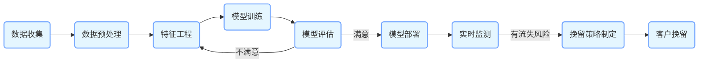

# 金融产品客户流失预警模型

> 关键词：金融产品、客户流失预警、模型构建、机器学习、数据分析

> 摘要：本文围绕金融产品客户流失预警模型展开深入探讨。首先介绍了该模型研究的背景、目的、预期读者等基本信息。接着阐述了核心概念及其联系，详细讲解了核心算法原理和具体操作步骤，并通过Python代码进行示例。同时，给出了相关的数学模型和公式，并举例说明。在项目实战部分，从开发环境搭建到源代码实现及解读进行了全面介绍。还分析了该模型的实际应用场景，推荐了学习所需的工具和资源。最后对未来发展趋势与挑战进行总结，提供常见问题解答及扩展阅读参考资料，旨在为金融行业有效预警客户流失提供全面的技术指导和解决方案。

## 1. 背景介绍 
### 1.1 目的和范围
在金融行业，客户是企业生存和发展的核心资源。客户流失意味着市场份额的减少和潜在利润的损失。金融产品客户流失预警模型的目的在于提前识别可能流失的客户，以便金融机构能够及时采取针对性的挽留措施，降低客户流失率，提高客户忠诚度和企业的经济效益。

本模型的范围涵盖了各类金融产品，如银行的储蓄账户、信用卡业务，证券的股票账户、基金产品，以及保险的各类险种等。通过对客户的历史数据、交易行为、服务使用情况等多方面信息进行分析，构建能够准确预测客户流失可能性的模型。

### 1.2 预期读者
本文的预期读者主要包括金融行业的从业者，如银行客户经理、证券分析师、保险营销人员等，他们可以利用该模型更好地了解客户动态，制定有效的客户挽留策略。同时，也适合从事数据分析、机器学习的技术人员，为他们在金融领域的应用提供参考和实践案例。此外，对金融科技感兴趣的研究人员和学生也可以从中获取相关知识和研究思路。

### 1.3 文档结构概述
本文共分为十个部分。第一部分为背景介绍，阐述了模型的目的、预期读者和文档结构。第二部分介绍核心概念与联系，包括客户流失的定义、相关影响因素以及模型的架构。第三部分详细讲解核心算法原理和具体操作步骤，并给出Python代码示例。第四部分介绍数学模型和公式，并举例说明其在模型中的应用。第五部分是项目实战，包括开发环境搭建、源代码实现和代码解读。第六部分分析模型的实际应用场景。第七部分推荐学习所需的工具和资源，包括书籍、在线课程、开发工具等。第八部分总结未来发展趋势与挑战。第九部分为附录，提供常见问题与解答。第十部分给出扩展阅读和参考资料。

### 1.4 术语表
#### 1.4.1 核心术语定义
- **客户流失**：指客户停止使用金融产品或服务，不再与金融机构保持业务关系的行为。
- **客户流失预警模型**：通过对客户相关数据的分析和建模，预测客户未来一段时间内流失可能性的模型。
- **特征变量**：用于描述客户特征和行为的各种数据指标，如年龄、性别、账户余额、交易频率等。
- **模型评估指标**：用于衡量模型性能的指标，如准确率、召回率、F1值等。

#### 1.4.2 相关概念解释
- **机器学习**：是一门多领域交叉学科，涉及概率论、统计学、逼近论、凸分析、算法复杂度理论等多门学科。它专门研究计算机怎样模拟或实现人类的学习行为，以获取新的知识或技能，重新组织已有的知识结构使之不断改善自身的性能。在客户流失预警模型中，机器学习算法用于对客户数据进行训练和预测。
- **数据挖掘**：是指从大量的数据中通过算法搜索隐藏于其中信息的过程。在金融产品客户流失预警中，数据挖掘技术用于从海量的客户数据中提取有价值的信息和模式。

#### 1.4.3 缩略词列表
- **ROC**：Receiver Operating Characteristic，受试者工作特征曲线，用于衡量二分类模型的性能。
- **AUC**：Area Under the Curve，ROC曲线下的面积，是衡量模型区分能力的重要指标。
- **F1**：F1值，是准确率和召回率的调和平均数，用于综合评估模型的性能。

## 2. 核心概念与联系 

### 核心概念原理
客户流失预警模型的核心原理是基于客户的历史数据和行为模式，构建一个能够预测客户未来流失可能性的模型。通过对大量客户数据的分析，找出与客户流失相关的特征变量，然后利用机器学习算法对这些特征变量进行训练，得到一个预测模型。当有新的客户数据输入时，模型可以根据这些数据预测该客户流失的概率。

客户流失的影响因素通常包括客户的基本信息（如年龄、性别、职业等）、账户信息（如账户余额、存款期限等）、交易行为（如交易频率、交易金额等）、服务使用情况（如是否使用网上银行、是否购买理财产品等）以及客户的投诉情况等。这些因素相互作用，共同影响客户的流失决策。

### 架构示意图


### 详细解释
1. **数据收集**：从金融机构的各个业务系统中收集客户的相关数据，包括基本信息、账户信息、交易记录、服务使用情况等。
2. **数据预处理**：对收集到的数据进行清洗、转换和归一化等处理，去除噪声数据和缺失值，将数据转换为适合模型训练的格式。
3. **特征工程**：从预处理后的数据中提取有价值的特征变量，并对特征进行选择和降维，以提高模型的性能。
4. **模型训练**：选择合适的机器学习算法，如逻辑回归、决策树、随机森林等，对特征变量进行训练，得到预测模型。
5. **模型评估**：使用测试数据对训练好的模型进行评估，计算模型的评估指标，如准确率、召回率、F1值等，判断模型的性能是否满足要求。
6. **模型部署**：将评估通过的模型部署到生产环境中，对新的客户数据进行实时监测。
7. **实时监测**：对客户的实时数据进行监测，根据模型预测客户的流失概率。
8. **挽留策略制定**：当发现客户有流失风险时，根据客户的特征和流失原因，制定针对性的挽留策略。
9. **客户挽留**：实施挽留策略，与客户进行沟通和协商，尝试挽留客户。

## 3. 核心算法原理 & 具体操作步骤 

### 逻辑回归算法原理
逻辑回归是一种常用的二分类算法，用于预测某个事件发生的概率。在客户流失预警模型中，我们可以将客户是否流失看作一个二分类问题，即流失（1）和不流失（0）。逻辑回归的基本原理是通过一个逻辑函数将线性回归的结果映射到[0, 1]的概率区间。

逻辑函数的表达式为：
$$\sigma(z)=\frac{1}{1 + e^{-z}}$$
其中，$z$ 是线性回归的结果，即：
$$z = \theta_0 + \theta_1x_1 + \theta_2x_2 + \cdots + \theta_nx_n$$
$\theta_0, \theta_1, \cdots, \theta_n$ 是模型的参数，$x_1, x_2, \cdots, x_n$ 是特征变量。

逻辑回归的目标是找到一组最优的参数 $\theta$，使得模型对训练数据的预测结果与实际结果之间的误差最小。通常使用最大似然估计来求解参数 $\theta$。

### Python代码实现
```python
import pandas as pd
from sklearn.model_selection import train_test_split
from sklearn.linear_model import LogisticRegression
from sklearn.metrics import accuracy_score, recall_score, f1_score

# 读取数据
data = pd.read_csv('customer_data.csv')

# 分离特征变量和目标变量
X = data.drop('churn', axis=1)
y = data['churn']

# 划分训练集和测试集
X_train, X_test, y_train, y_test = train_test_split(X, y, test_size=0.2, random_state=42)

# 创建逻辑回归模型
model = LogisticRegression()

# 模型训练
model.fit(X_train, y_train)

# 模型预测
y_pred = model.predict(X_test)

# 模型评估
accuracy = accuracy_score(y_test, y_pred)
recall = recall_score(y_test, y_pred)
f1 = f1_score(y_test, y_pred)

print(f'Accuracy: {accuracy}')
print(f'Recall: {recall}')
print(f'F1 Score: {f1}')
```

### 具体操作步骤
1. **数据读取**：使用 `pandas` 库读取包含客户数据的 CSV 文件。
2. **特征变量和目标变量分离**：将数据集中的特征变量和目标变量（客户是否流失）分离。
3. **数据集划分**：使用 `train_test_split` 函数将数据集划分为训练集和测试集，其中测试集占总数据集的 20%。
4. **模型创建**：创建一个逻辑回归模型对象。
5. **模型训练**：使用训练集数据对模型进行训练。
6. **模型预测**：使用训练好的模型对测试集数据进行预测。
7. **模型评估**：使用 `accuracy_score`、`recall_score` 和 `f1_score` 函数计算模型的准确率、召回率和 F1 值。

## 4. 数学模型和公式 & 详细讲解 & 举例说明 

### 最大似然估计
在逻辑回归中，我们使用最大似然估计来求解模型的参数 $\theta$。最大似然估计的基本思想是找到一组参数 $\theta$，使得在这组参数下，观察到训练数据的概率最大。

假设训练数据中有 $m$ 个样本，每个样本的特征向量为 $x^{(i)}$，对应的目标变量为 $y^{(i)}$，其中 $i = 1, 2, \cdots, m$。则每个样本的似然函数为：
$$P(y^{(i)}|x^{(i)};\theta) = (\sigma(z^{(i)}))^{y^{(i)}}(1 - \sigma(z^{(i)}))^{1 - y^{(i)}}$$
其中，$z^{(i)} = \theta_0 + \theta_1x_1^{(i)} + \theta_2x_2^{(i)} + \cdots + \theta_nx_n^{(i)}$。

整个训练数据集的似然函数为：
$$L(\theta) = \prod_{i = 1}^{m}P(y^{(i)}|x^{(i)};\theta) = \prod_{i = 1}^{m}(\sigma(z^{(i)}))^{y^{(i)}}(1 - \sigma(z^{(i)}))^{1 - y^{(i)}}$$

为了方便计算，通常对似然函数取对数，得到对数似然函数：
$$\ell(\theta) = \log L(\theta) = \sum_{i = 1}^{m}[y^{(i)}\log(\sigma(z^{(i)})) + (1 - y^{(i)})\log(1 - \sigma(z^{(i)}))]$$

最大似然估计的目标是找到一组参数 $\theta$，使得对数似然函数 $\ell(\theta)$ 最大。通常使用梯度上升法来求解这个优化问题。

### 梯度上升法
梯度上升法是一种迭代优化算法，用于求解函数的最大值。其基本思想是沿着函数的梯度方向不断更新参数，直到函数达到最大值。

对于对数似然函数 $\ell(\theta)$，其梯度为：
$$\nabla_{\theta}\ell(\theta) = \sum_{i = 1}^{m}(y^{(i)} - \sigma(z^{(i)}))x^{(i)}$$

梯度上升法的迭代公式为：
$$\theta_j := \theta_j + \alpha\nabla_{\theta_j}\ell(\theta)$$
其中，$\alpha$ 是学习率，控制每次迭代更新的步长。

### 举例说明
假设我们有一个简单的数据集，包含两个特征变量 $x_1$ 和 $x_2$，以及一个目标变量 $y$。数据集如下：

| $x_1$ | $x_2$ | $y$ |
| --- | --- | --- |
| 1 | 2 | 0 |
| 2 | 3 | 1 |
| 3 | 4 | 1 |

我们的目标是使用逻辑回归模型预测 $y$ 的值。

首先，我们初始化参数 $\theta = [0, 0, 0]$，学习率 $\alpha = 0.1$。

对于第一个样本 $(x_1 = 1, x_2 = 2, y = 0)$：
$$z = \theta_0 + \theta_1x_1 + \theta_2x_2 = 0 + 0\times1 + 0\times2 = 0$$
$$\sigma(z) = \frac{1}{1 + e^{-0}} = 0.5$$
$$\nabla_{\theta_0}\ell(\theta) = (y - \sigma(z))\times1 = (0 - 0.5)\times1 = -0.5$$
$$\nabla_{\theta_1}\ell(\theta) = (y - \sigma(z))\times x_1 = (0 - 0.5)\times1 = -0.5$$
$$\nabla_{\theta_2}\ell(\theta) = (y - \sigma(z))\times x_2 = (0 - 0.5)\times2 = -1$$

更新参数：
$$\theta_0 := \theta_0 + \alpha\nabla_{\theta_0}\ell(\theta) = 0 + 0.1\times(-0.5) = -0.05$$
$$\theta_1 := \theta_1 + \alpha\nabla_{\theta_1}\ell(\theta) = 0 + 0.1\times(-0.5) = -0.05$$
$$\theta_2 := \theta_2 + \alpha\nabla_{\theta_2}\ell(\theta) = 0 + 0.1\times(-1) = -0.1$$

重复上述步骤，对每个样本进行迭代更新，直到对数似然函数收敛。

## 5. 项目实战：代码实际案例和详细解释说明 

### 5.1  开发环境搭建
#### 安装Python
首先，需要安装 Python 环境。建议使用 Python 3.7 及以上版本。可以从 Python 官方网站（https://www.python.org/downloads/）下载并安装适合自己操作系统的 Python 版本。

#### 安装必要的库
使用 `pip` 命令安装项目所需的库，包括 `pandas`、`numpy`、`scikit-learn` 等。
```sh
pip install pandas numpy scikit-learn
```

#### 准备数据集
准备包含客户数据的 CSV 文件，文件中应包含特征变量和目标变量（客户是否流失）。

### 5.2  源代码详细实现和代码解读
```python
import pandas as pd
from sklearn.model_selection import train_test_split
from sklearn.ensemble import RandomForestClassifier
from sklearn.metrics import accuracy_score, recall_score, f1_score

# 读取数据
data = pd.read_csv('customer_data.csv')

# 分离特征变量和目标变量
X = data.drop('churn', axis=1)
y = data['churn']

# 划分训练集和测试集
X_train, X_test, y_train, y_test = train_test_split(X, y, test_size=0.2, random_state=42)

# 创建随机森林分类器
model = RandomForestClassifier(n_estimators=100, random_state=42)

# 模型训练
model.fit(X_train, y_train)

# 模型预测
y_pred = model.predict(X_test)

# 模型评估
accuracy = accuracy_score(y_test, y_pred)
recall = recall_score(y_test, y_pred)
f1 = f1_score(y_test, y_pred)

print(f'Accuracy: {accuracy}')
print(f'Recall: {recall}')
print(f'F1 Score: {f1}')
```

### 代码解读与分析
1. **数据读取**：使用 `pandas` 库的 `read_csv` 函数读取包含客户数据的 CSV 文件。
2. **特征变量和目标变量分离**：使用 `drop` 方法将目标变量（`churn`）从数据集中移除，得到特征变量 `X`；将目标变量单独提取出来，得到 `y`。
3. **数据集划分**：使用 `train_test_split` 函数将数据集划分为训练集和测试集，其中测试集占总数据集的 20%。`random_state` 参数用于保证每次划分的结果一致。
4. **模型创建**：创建一个随机森林分类器对象，`n_estimators` 参数指定森林中树的数量，`random_state` 参数用于保证每次训练的结果一致。
5. **模型训练**：使用训练集数据对随机森林分类器进行训练。
6. **模型预测**：使用训练好的模型对测试集数据进行预测。
7. **模型评估**：使用 `accuracy_score`、`recall_score` 和 `f1_score` 函数计算模型的准确率、召回率和 F1 值，并打印输出。

## 6. 实际应用场景 
### 银行储蓄账户
银行可以利用客户流失预警模型对储蓄账户客户进行实时监测。当模型预测某个客户有较高的流失风险时，银行可以及时与客户沟通，了解客户的需求和不满，提供个性化的优惠政策或服务，如提高存款利率、赠送礼品等，以挽留客户。

### 信用卡业务
对于信用卡客户，银行可以通过分析客户的消费行为、还款记录等数据，预测客户是否会注销信用卡。如果发现客户有流失风险，银行可以推出积分兑换活动、降低年费、提供临时额度提升等措施，增加客户的粘性。

### 证券股票账户
证券公司可以利用客户流失预警模型对股票账户客户进行分析。当模型预测某个客户可能会转户到其他证券公司时，证券公司可以为客户提供专业的投资咨询服务、举办投资讲座、降低交易佣金等，以提高客户的满意度和忠诚度。

### 保险业务
保险公司可以通过客户流失预警模型对保险客户进行评估。当发现客户有退保的可能性时，保险公司可以为客户提供保险方案调整建议、增加保险福利、提供优质的理赔服务等，以减少客户流失。

## 7. 工具和资源推荐
### 7.1 学习资源推荐
#### 7.1.1 书籍推荐
- 《Python 数据分析实战》：本书详细介绍了使用 Python 进行数据分析的方法和技巧，包括数据清洗、数据可视化、机器学习等内容，适合初学者入门。
- 《机器学习》（周志华著）：被称为“西瓜书”，是机器学习领域的经典教材，全面介绍了机器学习的基本概念、算法和应用。
- 《统计学习方法》（李航著）：系统地介绍了统计学习的主要方法，包括感知机、支持向量机、决策树、逻辑回归等，适合有一定数学基础的读者深入学习。

#### 7.1.2 在线课程
- Coursera 上的《机器学习》课程（Andrew Ng 教授主讲）：该课程是机器学习领域的经典在线课程，全面介绍了机器学习的基本概念、算法和应用，课程内容深入浅出，适合初学者。
- edX 上的《Python 数据科学手册》课程：该课程介绍了使用 Python 进行数据科学的方法和技巧，包括数据处理、数据分析、机器学习等内容，课程实践性强。
- 阿里云天池平台的《机器学习实战营》：该课程结合实际案例，介绍了机器学习在各个领域的应用，包括金融、医疗、电商等，适合有一定编程基础的读者提高实践能力。

#### 7.1.3 技术博客和网站
- 博客园：是一个技术博客平台，上面有很多关于数据分析、机器学习的技术文章，作者们分享了自己的经验和心得。
- 知乎：是一个知识分享平台，上面有很多关于金融科技、机器学习的讨论和问答，可以从中获取不同的观点和思路。
- Kaggle：是一个数据科学竞赛平台，上面有很多关于金融产品客户流失预警的数据集和解决方案，可以学习到其他选手的优秀经验和方法。

### 7.2 开发工具框架推荐
#### 7.2.1 IDE和编辑器
- PyCharm：是一款专门为 Python 开发设计的集成开发环境，具有代码编辑、调试、自动补全、版本控制等功能，适合专业的 Python 开发者。
- Jupyter Notebook：是一个交互式的开发环境，支持 Python、R 等多种编程语言，可以在浏览器中直接编写和运行代码，适合数据科学家和分析师进行数据分析和模型开发。
- Visual Studio Code：是一款轻量级的代码编辑器，支持多种编程语言，具有丰富的插件生态系统，可以通过安装插件来扩展功能，适合初学者和小型项目开发。

#### 7.2.2 调试和性能分析工具
- `pdb`：是 Python 自带的调试工具，可以在代码中设置断点，逐行执行代码，查看变量的值和程序的执行流程，帮助开发者调试代码。
- `cProfile`：是 Python 自带的性能分析工具，可以统计程序中各个函数的执行时间和调用次数，帮助开发者找出程序的性能瓶颈。
- `Scikit-learn` 的 `learning_curve` 函数：可以绘制学习曲线，帮助开发者分析模型的学习能力和泛化能力，判断模型是否存在过拟合或欠拟合问题。

#### 7.2.3 相关框架和库
- `pandas`：是一个用于数据处理和分析的 Python 库，提供了高效的数据结构和数据操作方法，如数据读取、数据清洗、数据转换等。
- `numpy`：是一个用于科学计算的 Python 库，提供了高效的多维数组对象和数学函数，如数组运算、线性代数运算等。
- `scikit-learn`：是一个用于机器学习的 Python 库，提供了丰富的机器学习算法和工具，如分类、回归、聚类、特征选择等。
- `TensorFlow` 和 `PyTorch`：是两个流行的深度学习框架，提供了高效的深度学习模型训练和部署工具，适合处理大规模的数据集和复杂的模型。

### 7.3 相关论文著作推荐
#### 7.3.1 经典论文
- “Customer Relationship Management in Financial Services: A Review of the Literature”：该论文对金融服务领域的客户关系管理进行了全面的综述，包括客户流失预测、客户细分、客户满意度等方面的研究成果。
- “Predicting Customer Churn in the Telecommunications Industry”：虽然是关于电信行业客户流失预测的论文，但其中的方法和思路可以借鉴到金融行业，如特征选择、模型构建等方面。
- “Using Data Mining Techniques in Customer Relationship Management: An Application in the Banking Industry”：该论文介绍了如何使用数据挖掘技术进行银行客户关系管理，包括客户流失预测、客户价值评估等方面的应用。

#### 7.3.2 最新研究成果
- 可以通过学术数据库，如 IEEE Xplore、ACM Digital Library、ScienceDirect 等，搜索关于金融产品客户流失预警的最新研究论文。这些论文通常会介绍最新的算法和方法，以及在实际应用中的效果。

#### 7.3.3 应用案例分析
- 可以关注金融机构的官方网站和行业报告，了解他们在客户流失预警方面的应用案例和实践经验。例如，一些银行会发布关于如何通过数据分析和模型预测来降低客户流失率的报告。

## 8. 总结：未来发展趋势与挑战
### 未来发展趋势
#### 多源数据融合
未来的客户流失预警模型将不仅仅依赖于金融机构内部的客户数据，还会融合外部数据，如社交媒体数据、宏观经济数据等。通过多源数据的融合，可以更全面地了解客户的特征和行为，提高模型的预测准确率。

#### 深度学习的应用
随着深度学习技术的不断发展，越来越多的金融机构将尝试使用深度学习模型进行客户流失预警。深度学习模型具有强大的特征提取能力和非线性建模能力，可以处理更复杂的客户数据，提高模型的性能。

#### 实时监测和动态调整
未来的客户流失预警模型将实现实时监测客户的行为和状态，当客户的行为发生变化时，模型能够及时调整预测结果，并自动触发相应的挽留策略。这种实时监测和动态调整的能力将大大提高金融机构对客户流失的响应速度和处理效果。

#### 可解释性模型
由于金融行业的特殊性，模型的可解释性非常重要。未来的客户流失预警模型将更加注重可解释性，不仅要能够准确预测客户流失的概率，还要能够解释预测结果的原因，以便金融机构能够更好地理解和应用模型。

### 挑战
#### 数据质量问题
金融机构的数据通常存在数据缺失、数据错误、数据不一致等问题，这些问题会影响模型的训练和预测效果。因此，如何提高数据质量，是构建准确可靠的客户流失预警模型的关键挑战之一。

#### 模型过拟合和欠拟合
在模型训练过程中，容易出现过拟合和欠拟合的问题。过拟合会导致模型在训练集上表现良好，但在测试集上表现不佳；欠拟合则会导致模型无法捕捉数据中的复杂模式，预测准确率较低。如何选择合适的模型和参数，避免过拟合和欠拟合，是模型构建过程中的一大挑战。

#### 隐私和安全问题
金融机构的客户数据包含大量的敏感信息，如个人身份信息、账户信息、交易记录等。在构建客户流失预警模型的过程中，如何保护客户的隐私和数据安全，是一个不容忽视的问题。

#### 业务理解和模型应用
客户流失预警模型的最终目的是为金融机构的业务决策提供支持。因此，模型的开发者需要深入了解金融业务，将模型的预测结果转化为实际的业务策略。如何加强业务理解和模型应用之间的联系，是模型落地过程中的一大挑战。

## 9. 附录：常见问题与解答
### 问题 1：如何选择合适的特征变量？
解答：选择合适的特征变量是构建客户流失预警模型的关键。可以从以下几个方面入手：
- **业务经验**：根据金融业务的特点和经验，选择与客户流失相关的特征变量，如账户余额、交易频率、服务使用情况等。
- **相关性分析**：计算特征变量与目标变量（客户是否流失）之间的相关性，选择相关性较高的特征变量。
- **特征选择算法**：使用特征选择算法，如方差分析、卡方检验、递归特征消除等，自动选择重要的特征变量。

### 问题 2：如何处理数据中的缺失值？
解答：处理数据中的缺失值有以下几种方法：
- **删除缺失值**：如果缺失值的比例较小，可以直接删除包含缺失值的样本。
- **填充缺失值**：可以使用均值、中位数、众数等统计量填充缺失值，也可以使用机器学习算法进行填充，如决策树、随机森林等。
- **将缺失值作为一个特殊类别**：对于分类变量，可以将缺失值作为一个特殊的类别进行处理。

### 问题 3：如何评估模型的性能？
解答：评估模型的性能可以使用以下指标：
- **准确率**：预测正确的样本数占总样本数的比例，反映模型的整体预测能力。
- **召回率**：预测为正例的样本中实际为正例的比例，反映模型对正例的识别能力。
- **F1值**：准确率和召回率的调和平均数，综合考虑了模型的准确率和召回率。
- **ROC曲线和AUC值**：ROC曲线是描述模型在不同阈值下的真阳性率和假阳性率之间的关系，AUC值是ROC曲线下的面积，反映模型的区分能力。

### 问题 4：如何解决模型过拟合的问题？
解答：解决模型过拟合的问题可以采取以下措施：
- **增加训练数据**：增加训练数据的数量，可以减少模型对训练数据的依赖，提高模型的泛化能力。
- **正则化**：在模型的损失函数中加入正则化项，如L1正则化和L2正则化，可以限制模型的复杂度，避免过拟合。
- **特征选择和降维**：选择重要的特征变量，减少特征的数量，或者使用降维算法，如主成分分析（PCA），降低数据的维度，减少模型的复杂度。
- **早停法**：在模型训练过程中，当模型在验证集上的性能不再提高时，停止训练，避免模型过拟合。

## 10. 扩展阅读 & 参考资料
### 扩展阅读
- 《金融科技前沿：理论与实务》：本书介绍了金融科技的前沿理论和实务应用，包括区块链、人工智能、大数据等技术在金融领域的应用，对于深入了解金融科技和客户流失预警模型有很大的帮助。
- 《数据驱动的市场营销：从策略到执行》：该书介绍了如何使用数据分析和模型预测来指导市场营销决策，对于金融机构制定客户挽留策略有一定的参考价值。

### 参考资料
- 《Python 数据分析实战》，作者：[美] Wes McKinney，人民邮电出版社
- 《机器学习》，作者：周志华，清华大学出版社
- 《统计学习方法》，作者：李航，清华大学出版社
- Coursera 上的《机器学习》课程，链接：https://www.coursera.org/learn/machine-learning
- edX 上的《Python 数据科学手册》课程，链接：https://www.edx.org/course/python-data-science-handbook

作者：AI天才研究院/AI Genius Institute & 禅与计算机程序设计艺术 /Zen And The Art of Computer Programming