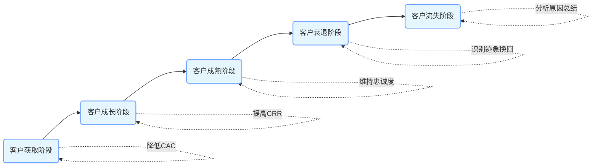

# 金融产品客户生命周期价值最大化

> 关键词：金融产品、客户生命周期价值、最大化策略、数据分析、客户关系管理

> 摘要：本文聚焦于金融产品客户生命周期价值最大化这一核心主题。首先介绍了相关背景，包括目的范围、预期读者等内容。接着详细阐述了核心概念及其联系，通过文本示意图和 Mermaid 流程图进行直观展示。深入剖析了核心算法原理，并结合 Python 代码进行说明。同时给出了数学模型和公式，辅以具体例子帮助理解。在项目实战部分，从开发环境搭建到源代码实现及解读，进行了全面介绍。探讨了实际应用场景，推荐了学习、开发工具框架以及相关论文著作。最后总结了未来发展趋势与挑战，还包含常见问题解答和扩展阅读参考资料，旨在为金融行业从业者提供全面且深入的指导，以实现金融产品客户生命周期价值的最大化。

## 1. 背景介绍 
### 1.1 目的和范围
在金融市场竞争日益激烈的当下，金融机构面临着客户获取成本上升、客户流失率增加等问题。如何在有限的客户资源下实现利润最大化，成为了金融机构亟待解决的问题。本文章的目的在于深入探讨金融产品客户生命周期价值最大化的策略和方法，为金融机构提供理论支持和实践指导。

文章的范围涵盖了金融产品客户生命周期的各个阶段，包括客户获取、客户成长、客户成熟、客户衰退和客户流失等阶段。通过对每个阶段的分析，提出相应的策略和方法，以实现客户生命周期价值的最大化。

### 1.2 预期读者
本文的预期读者主要包括金融行业的从业者，如银行、证券、保险等金融机构的市场营销人员、客户关系管理人员、数据分析人员等。同时，也适合对金融科技、客户关系管理等领域感兴趣的研究人员和学生阅读。

### 1.3 文档结构概述
本文将按照以下结构进行组织：
- 核心概念与联系：介绍金融产品客户生命周期价值的核心概念，以及各阶段之间的联系。
- 核心算法原理 & 具体操作步骤：详细阐述计算客户生命周期价值的核心算法，并给出具体的操作步骤。
- 数学模型和公式 & 详细讲解 & 举例说明：通过数学模型和公式对客户生命周期价值进行量化分析，并给出具体的例子进行说明。
- 项目实战：代码实际案例和详细解释说明：通过实际的项目案例，展示如何使用 Python 代码实现客户生命周期价值的计算和分析。
- 实际应用场景：探讨金融产品客户生命周期价值最大化在实际中的应用场景。
- 工具和资源推荐：推荐一些学习、开发工具框架以及相关论文著作。
- 总结：未来发展趋势与挑战：总结本文的主要内容，分析未来金融产品客户生命周期价值最大化的发展趋势和面临的挑战。
- 附录：常见问题与解答：对一些常见问题进行解答。
- 扩展阅读 & 参考资料：提供一些扩展阅读的资料和参考文献。

### 1.4 术语表
#### 1.4.1 核心术语定义
- **客户生命周期价值（Customer Lifetime Value，CLV）**：指客户在其整个与金融机构的关系期间内，为金融机构带来的净收益的现值。
- **客户获取成本（Customer Acquisition Cost，CAC）**：指金融机构为获取一个新客户所花费的成本。
- **客户留存率（Customer Retention Rate，CRR）**：指在一定时期内，金融机构保留的客户数量与期初客户数量的比率。
- **客户流失率（Customer Churn Rate，CCR）**：指在一定时期内，金融机构失去的客户数量与期初客户数量的比率。

#### 1.4.2 相关概念解释
- **客户生命周期**：指客户从首次接触金融机构到最终与金融机构终止关系的整个过程，通常包括客户获取、客户成长、客户成熟、客户衰退和客户流失等阶段。
- **客户价值**：指客户为金融机构带来的经济价值，包括直接价值和间接价值。直接价值指客户购买金融产品和服务所带来的收入，间接价值指客户口碑传播、推荐新客户等所带来的价值。

#### 1.4.3 缩略词列表
- CLV：Customer Lifetime Value
- CAC：Customer Acquisition Cost
- CRR：Customer Retention Rate
- CCR：Customer Churn Rate

## 2. 核心概念与联系 

### 核心概念原理
金融产品客户生命周期价值最大化的核心在于理解客户在其与金融机构关系的不同阶段所产生的价值，并通过有效的策略和方法来提高每个阶段的价值。客户生命周期可以分为以下几个阶段：

#### 客户获取阶段
在这个阶段，金融机构的主要目标是吸引潜在客户，将其转化为实际客户。这个阶段的关键指标是客户获取成本（CAC），金融机构需要通过有效的市场营销策略来降低 CAC，提高客户获取效率。

#### 客户成长阶段
客户成为金融机构的客户后，进入成长阶段。在这个阶段，金融机构的主要目标是提高客户的忠诚度和消费频率，增加客户的价值。这个阶段的关键指标是客户留存率（CRR）和客户消费增长率。

#### 客户成熟阶段
当客户的消费达到一定水平后，进入成熟阶段。在这个阶段，客户的价值达到最大化，金融机构的主要目标是维持客户的忠诚度，延长客户的生命周期。这个阶段的关键指标是客户满意度和客户推荐率。

#### 客户衰退阶段
随着时间的推移，客户的需求可能会发生变化，或者受到竞争对手的影响，进入衰退阶段。在这个阶段，金融机构的主要目标是识别客户衰退的迹象，采取相应的措施来挽回客户。这个阶段的关键指标是客户流失率（CCR）。

#### 客户流失阶段
如果金融机构无法挽回衰退阶段的客户，客户将最终流失。在这个阶段，金融机构需要分析客户流失的原因，总结经验教训，为未来的客户管理提供参考。

### 架构的文本示意图
```plaintext
客户获取阶段
|
|-- 降低客户获取成本（CAC）
|-- 吸引潜在客户
|
客户成长阶段
|
|-- 提高客户留存率（CRR）
|-- 增加客户消费频率
|
客户成熟阶段
|
|-- 维持客户忠诚度
|-- 提高客户满意度和推荐率
|
客户衰退阶段
|
|-- 识别客户衰退迹象
|-- 采取挽回措施
|
客户流失阶段
|
|-- 分析客户流失原因
|-- 总结经验教训
```

### Mermaid 流程图


## 3. 核心算法原理 & 具体操作步骤 

### 核心算法原理
计算客户生命周期价值（CLV）的方法有很多种，这里介绍一种常用的基于历史数据的计算方法。假设客户在第 $t$ 期的净收益为 $r_t$，客户的折现率为 $d$，客户的生命周期为 $T$，则客户生命周期价值的计算公式为：

$$CLV = \sum_{t=1}^{T} \frac{r_t}{(1 + d)^t}$$

### 具体操作步骤

#### 步骤 1：收集数据
收集客户的历史交易数据，包括交易时间、交易金额、交易成本等信息。

#### 步骤 2：计算净收益
根据收集到的交易数据，计算每个客户在每个时期的净收益 $r_t$。净收益等于交易金额减去交易成本。

#### 步骤 3：确定折现率
折现率 $d$ 反映了未来收益的现值，通常根据金融机构的资金成本和市场利率来确定。

#### 步骤 4：确定客户生命周期
客户生命周期 $T$ 可以根据客户的历史数据和行业经验来确定。

#### 步骤 5：计算客户生命周期价值
根据上述公式，计算每个客户的生命周期价值。

### Python 代码实现
```python
import pandas as pd

# 示例数据
data = {
    'customer_id': [1, 1, 1, 2, 2],
    'transaction_date': ['2023-01-01', '2023-02-01', '2023-03-01', '2023-01-01', '2023-02-01'],
    'transaction_amount': [100, 200, 300, 150, 250],
    'transaction_cost': [10, 20, 30, 15, 25]
}

df = pd.DataFrame(data)

# 计算净收益
df['net_income'] = df['transaction_amount'] - df['transaction_cost']

# 假设折现率为 0.1
discount_rate = 0.1

# 计算每个客户的生命周期价值
clv_dict = {}
for customer_id, group in df.groupby('customer_id'):
    group = group.sort_values('transaction_date')
    clv = 0
    for t, row in enumerate(group.iterrows(), start=1):
        net_income = row[1]['net_income']
        clv += net_income / ((1 + discount_rate) ** t)
    clv_dict[customer_id] = clv

# 输出结果
for customer_id, clv in clv_dict.items():
    print(f'客户 {customer_id} 的生命周期价值为: {clv}')
```

## 4. 数学模型和公式 & 详细讲解 & 举例说明 

### 数学模型和公式
在前面的章节中，我们介绍了客户生命周期价值的计算公式：

$$CLV = \sum_{t=1}^{T} \frac{r_t}{(1 + d)^t}$$

其中，$CLV$ 表示客户生命周期价值，$r_t$ 表示客户在第 $t$ 期的净收益，$d$ 表示折现率，$T$ 表示客户的生命周期。

### 详细讲解
- **净收益 $r_t$**：净收益是指客户在每个时期的交易收入减去交易成本。交易收入可以包括客户购买金融产品的费用、利息收入等，交易成本可以包括营销成本、运营成本等。
- **折现率 $d$**：折现率反映了未来收益的现值。由于未来的收益存在不确定性，因此需要将未来的收益折现到当前时刻。折现率通常根据金融机构的资金成本和市场利率来确定。
- **客户生命周期 $T$**：客户生命周期是指客户从首次购买金融产品到最后一次购买金融产品的时间跨度。客户生命周期可以根据客户的历史数据和行业经验来确定。

### 举例说明
假设某客户在第 1 年的净收益为 100 元，第 2 年的净收益为 200 元，第 3 年的净收益为 300 元，折现率为 0.1，则该客户的生命周期价值为：

$$CLV = \frac{100}{(1 + 0.1)^1} + \frac{200}{(1 + 0.1)^2} + \frac{300}{(1 + 0.1)^3}$$

$$CLV = \frac{100}{1.1} + \frac{200}{1.21} + \frac{300}{1.331}$$

$$CLV \approx 90.91 + 165.29 + 225.40$$

$$CLV \approx 481.60$$

因此，该客户的生命周期价值约为 481.60 元。

## 5. 项目实战：代码实际案例和详细解释说明 

### 5.1  开发环境搭建
#### 安装 Python
首先，需要安装 Python 环境。可以从 Python 官方网站（https://www.python.org/downloads/）下载适合自己操作系统的 Python 版本，并按照安装向导进行安装。

#### 安装必要的库
在 Python 中，我们可以使用 `pandas` 库来处理数据，使用 `numpy` 库进行数值计算。可以使用以下命令来安装这些库：

```sh
pip install pandas numpy
```

### 5.2  源代码详细实现和代码解读
```python
import pandas as pd
import numpy as np

# 生成示例数据
np.random.seed(0)
n_customers = 10
n_periods = 5
customer_ids = np.repeat(np.arange(1, n_customers + 1), n_periods)
transaction_dates = pd.date_range(start='2023-01-01', periods=n_periods).tolist() * n_customers
transaction_amounts = np.random.randint(100, 500, size=n_customers * n_periods)
transaction_costs = np.random.randint(10, 50, size=n_customers * n_periods)

data = {
    'customer_id': customer_ids,
    'transaction_date': transaction_dates,
    'transaction_amount': transaction_amounts,
    'transaction_cost': transaction_costs
}

df = pd.DataFrame(data)

# 计算净收益
df['net_income'] = df['transaction_amount'] - df['transaction_cost']

# 假设折现率为 0.1
discount_rate = 0.1

# 计算每个客户的生命周期价值
clv_dict = {}
for customer_id, group in df.groupby('customer_id'):
    group = group.sort_values('transaction_date')
    clv = 0
    for t, row in enumerate(group.iterrows(), start=1):
        net_income = row[1]['net_income']
        clv += net_income / ((1 + discount_rate) ** t)
    clv_dict[customer_id] = clv

# 输出结果
for customer_id, clv in clv_dict.items():
    print(f'客户 {customer_id} 的生命周期价值为: {clv}')
```

### 代码解读与分析
1. **数据生成**：使用 `numpy` 库生成示例数据，包括客户 ID、交易日期、交易金额和交易成本。
2. **计算净收益**：通过交易金额减去交易成本，计算每个交易的净收益。
3. **设置折现率**：假设折现率为 0.1。
4. **计算客户生命周期价值**：使用 `groupby` 方法按客户 ID 分组，对每个客户的交易数据进行排序，然后根据公式计算客户生命周期价值。
5. **输出结果**：将每个客户的生命周期价值输出。

## 6. 实际应用场景 
### 客户细分
通过计算客户生命周期价值，可以将客户分为不同的价值等级，如高价值客户、中价值客户和低价值客户。针对不同价值等级的客户，金融机构可以采取不同的营销策略和服务措施，以提高客户的满意度和忠诚度。

### 营销资源分配
根据客户生命周期价值的大小，金融机构可以合理分配营销资源。对于高价值客户，可以投入更多的营销资源，如提供个性化的金融产品和服务、举办专属的客户活动等；对于低价值客户，可以采取低成本的营销方式，如短信营销、电子邮件营销等。

### 客户挽留
在客户进入衰退阶段时，通过计算客户生命周期价值，可以及时识别出有流失风险的客户。金融机构可以针对这些客户采取相应的挽留措施，如提供优惠活动、改进服务质量等，以降低客户流失率。

### 产品开发
通过分析不同客户群体的生命周期价值，可以了解客户的需求和偏好。金融机构可以根据这些信息开发新的金融产品和服务，以满足客户的需求，提高客户的价值。

## 7. 工具和资源推荐
### 7.1 学习资源推荐
#### 7.1.1 书籍推荐
- 《客户关系管理：概念、策略与技术》：本书系统地介绍了客户关系管理的概念、策略和技术，对金融产品客户生命周期价值最大化具有重要的指导意义。
- 《数据分析实战：基于 Python 的数据挖掘和数据分析》：本书详细介绍了使用 Python 进行数据分析的方法和技巧，对于计算客户生命周期价值和进行数据分析具有很大的帮助。

#### 7.1.2 在线课程
- Coursera 上的“客户关系管理”课程：该课程由知名大学的教授授课，内容涵盖了客户关系管理的各个方面。
- edX 上的“数据分析与可视化”课程：该课程介绍了数据分析和可视化的基本方法和工具，对于处理客户数据和分析客户生命周期价值非常有用。

#### 7.1.3 技术博客和网站
- 数据派：提供了大量的数据科学和数据分析的文章和案例，对于学习客户生命周期价值计算和数据分析有很大的帮助。
- 掘金：是一个技术社区，有很多关于 Python 编程和数据分析的文章和教程。

### 7.2 开发工具框架推荐
#### 7.2.1 IDE和编辑器
- PyCharm：是一款专业的 Python 集成开发环境，具有代码编辑、调试、自动完成等功能，非常适合 Python 开发。
- Jupyter Notebook：是一个交互式的开发环境，可以在浏览器中编写和运行 Python 代码，非常适合数据分析和数据可视化。

#### 7.2.2 调试和性能分析工具
- pdb：是 Python 自带的调试工具，可以帮助开发者调试 Python 代码。
- cProfile：是 Python 自带的性能分析工具，可以帮助开发者分析 Python 代码的性能瓶颈。

#### 7.2.3 相关框架和库
- pandas：是一个强大的数据处理和分析库，提供了数据结构和数据操作的功能，非常适合处理客户数据。
- numpy：是一个用于科学计算的库，提供了高效的数组操作和数学函数，对于计算客户生命周期价值非常有用。

### 7.3 相关论文著作推荐
#### 7.3.1 经典论文
- Berger, P. D., & Nasr, N. I. (1998). Customer lifetime value: Marketing models and applications. Journal of Interactive Marketing, 12(1), 17-30. 这篇论文提出了客户生命周期价值的基本模型和计算方法。
- Rust, R. T., Lemon, K. N., & Zeithaml, V. A. (2004). Return on marketing: Using customer equity to focus marketing strategy. Journal of Marketing, 68(4), 109-127. 该论文探讨了如何使用客户权益来聚焦营销策略，以提高营销回报率。

#### 7.3.2 最新研究成果
- 关注顶级学术期刊如《Journal of Marketing》《Marketing Science》等，这些期刊会发表关于客户生命周期价值和金融营销的最新研究成果。

#### 7.3.3 应用案例分析
- 《金融营销案例集》：收集了金融行业的各种营销案例，包括客户生命周期价值最大化的应用案例，可以从中学习到实际的操作经验。

## 8. 总结：未来发展趋势与挑战
### 未来发展趋势
#### 数据驱动的精准营销
随着大数据和人工智能技术的不断发展，金融机构将能够更加精准地了解客户的需求和偏好，实现数据驱动的精准营销。通过分析客户的历史数据和行为数据，金融机构可以为客户提供个性化的金融产品和服务，提高客户的满意度和忠诚度。

#### 客户体验至上
未来，客户体验将成为金融机构竞争的关键因素。金融机构将更加注重客户体验的提升，通过优化服务流程、提高服务质量、加强客户沟通等方式，为客户提供更加便捷、高效、优质的服务。

#### 跨行业融合
金融行业将与其他行业进行更加深入的融合，如金融科技、医疗、教育等。通过跨行业融合，金融机构可以拓展客户群体，提供更加多元化的金融产品和服务，实现客户生命周期价值的最大化。

### 面临的挑战
#### 数据安全和隐私保护
随着金融机构收集和使用客户数据的增加，数据安全和隐私保护将成为一个重要的挑战。金融机构需要加强数据安全管理，采取有效的技术措施和管理制度，保护客户的个人信息和隐私。

#### 技术创新和人才短缺
金融行业的数字化转型需要不断进行技术创新，如人工智能、区块链、大数据等。然而，目前金融行业面临着技术创新和人才短缺的问题。金融机构需要加大技术研发投入，培养和引进相关的技术人才。

#### 市场竞争加剧
随着金融市场的开放和竞争的加剧，金融机构面临着越来越大的市场竞争压力。金融机构需要不断创新和优化金融产品和服务，提高市场竞争力，以实现客户生命周期价值的最大化。

## 9. 附录：常见问题与解答
### 问题 1：如何确定折现率？
折现率通常根据金融机构的资金成本和市场利率来确定。资金成本可以包括存款利率、贷款利率等，市场利率可以参考国债收益率、银行间同业拆借利率等。一般来说，折现率应该反映未来收益的风险和不确定性。

### 问题 2：客户生命周期如何确定？
客户生命周期可以根据客户的历史数据和行业经验来确定。可以通过分析客户的购买频率、购买间隔时间等数据，来预测客户的生命周期。同时，也可以参考行业的平均客户生命周期来进行估计。

### 问题 3：客户生命周期价值计算中需要考虑哪些成本？
在客户生命周期价值计算中，需要考虑的成本包括营销成本、运营成本、服务成本等。营销成本包括广告费用、促销费用等，运营成本包括人力成本、设备成本等，服务成本包括客户服务费用、投诉处理费用等。

## 10. 扩展阅读 & 参考资料
### 扩展阅读
- 《金融科技前沿》：介绍了金融科技的最新发展动态和应用案例，对于了解金融行业的数字化转型和客户生命周期价值最大化具有重要的参考价值。
- 《客户体验管理》：详细介绍了客户体验管理的理论和方法，对于提高金融机构的客户体验和客户满意度具有很大的帮助。

### 参考资料
- 相关的金融行业报告和统计数据，可以从金融监管机构、行业协会等网站获取。
- 学术论文和研究报告，可以通过学术数据库如知网、万方、Web of Science 等进行搜索。

作者：AI天才研究院/AI Genius Institute & 禅与计算机程序设计艺术 /Zen And The Art of Computer Programming