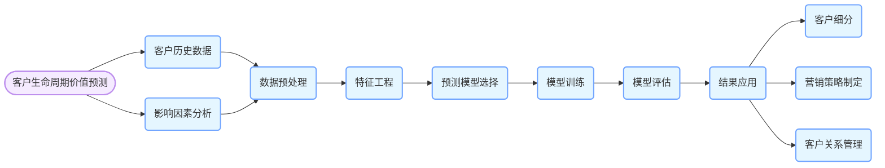

# 金融产品客户生命周期价值预测

> 关键词：金融产品、客户生命周期价值、预测模型、机器学习、数据分析

> 摘要：本文围绕金融产品客户生命周期价值预测展开深入探讨。首先介绍了相关背景知识，包括目的范围、预期读者、文档结构等。接着阐述了核心概念及其联系，详细讲解了核心算法原理与具体操作步骤，并结合数学模型和公式进行说明。通过项目实战展示了代码实现及解读，分析了实际应用场景。还推荐了学习工具、资源和相关论文著作。最后总结了未来发展趋势与挑战，同时给出了常见问题解答和扩展阅读参考资料，旨在为金融领域从业者和相关研究者提供全面且深入的客户生命周期价值预测知识体系。

## 1. 背景介绍 
### 1.1 目的和范围
在金融行业中，准确预测客户生命周期价值（Customer Lifetime Value，CLV）对于企业的战略决策、市场营销、客户关系管理等方面具有至关重要的意义。本文章的目的在于深入探讨金融产品客户生命周期价值预测的方法和技术，为金融机构提供有效的预测模型和实践指导。范围涵盖了从核心概念的阐述、算法原理的分析到实际项目的应用，以及相关工具和资源的推荐等多个方面。

### 1.2 预期读者
本文的预期读者主要包括金融行业的从业者，如市场营销人员、客户关系管理人员、数据分析师等，他们可以从中获取实用的客户生命周期价值预测方法和策略。同时，也适合对金融数据分析和机器学习感兴趣的研究者和学生，为他们提供理论和实践相结合的学习资料。

### 1.3 文档结构概述
本文将按照以下结构进行组织：首先介绍核心概念与联系，明确客户生命周期价值的定义和相关因素；接着阐述核心算法原理和具体操作步骤，包括使用的机器学习算法和实现流程；然后给出数学模型和公式，并进行详细讲解和举例说明；通过项目实战展示代码实际案例和详细解释；分析实际应用场景；推荐相关的工具和资源；总结未来发展趋势与挑战；提供常见问题与解答；最后列出扩展阅读和参考资料。

### 1.4 术语表
#### 1.4.1 核心术语定义
- **客户生命周期价值（Customer Lifetime Value，CLV）**：指客户在与企业建立业务关系的整个生命周期内，为企业带来的总利润贡献。它考虑了客户在不同阶段的购买行为、消费金额、购买频率等因素。
- **预测模型（Prediction Model）**：用于根据历史数据和相关特征预测未来事件或结果的数学模型。在客户生命周期价值预测中，预测模型可以根据客户的历史行为数据预测其未来的价值。
- **机器学习（Machine Learning）**：是一门多领域交叉学科，涉及概率论、统计学、逼近论、凸分析、算法复杂度理论等多门学科。它专门研究计算机怎样模拟或实现人类的学习行为，以获取新的知识或技能，重新组织已有的知识结构使之不断改善自身的性能。

#### 1.4.2 相关概念解释
- **客户获取（Customer Acquisition）**：指企业通过各种营销手段吸引新客户的过程。在客户生命周期的初期，客户获取成本是影响客户生命周期价值的重要因素之一。
- **客户留存（Customer Retention）**：指企业通过提供优质的产品和服务，保持客户与企业的长期合作关系。客户留存率越高，客户生命周期价值通常也越高。
- **客户流失（Customer Churn）**：指客户停止与企业进行业务往来的现象。客户流失会导致客户生命周期价值的降低，因此预测客户流失并采取相应的措施进行挽留是提高客户生命周期价值的重要手段。

#### 1.4.3 缩略词列表
- **CLV**：Customer Lifetime Value，客户生命周期价值
- **ML**：Machine Learning，机器学习
- **CRM**：Customer Relationship Management，客户关系管理

## 2. 核心概念与联系 

### 客户生命周期价值的原理
客户生命周期价值是一个综合指标，它反映了客户在整个生命周期内对企业的经济价值。其原理基于客户的购买行为和消费模式，通过对客户历史数据的分析和挖掘，预测客户未来的购买行为和消费金额，从而计算出客户在整个生命周期内为企业带来的总利润贡献。

### 影响客户生命周期价值的因素
影响客户生命周期价值的因素主要包括以下几个方面：
- **客户购买行为**：包括购买频率、购买金额、购买时间间隔等。购买频率越高、购买金额越大，客户生命周期价值通常也越高。
- **客户忠诚度**：客户对企业的忠诚度越高，越有可能长期与企业合作，从而提高客户生命周期价值。
- **客户服务质量**：优质的客户服务可以提高客户满意度和忠诚度，减少客户流失，进而提高客户生命周期价值。
- **市场竞争环境**：激烈的市场竞争可能导致客户流失，从而降低客户生命周期价值。企业需要通过不断提升自身的竞争力，吸引和留住客户。

### 核心概念架构示意图


该流程图展示了金融产品客户生命周期价值预测的主要流程，从数据获取开始，经过预处理、特征工程、模型选择、训练和评估，最终将预测结果应用于客户细分、营销策略制定和客户关系管理等方面。

## 3. 核心算法原理 & 具体操作步骤 

### 常用的预测算法
在金融产品客户生命周期价值预测中，常用的机器学习算法包括线性回归、逻辑回归、决策树、随机森林、支持向量机等。下面以线性回归为例，详细介绍其算法原理和具体操作步骤。

### 线性回归算法原理
线性回归是一种用于建立自变量和因变量之间线性关系的统计模型。其基本形式为：
$$y = \beta_0 + \beta_1x_1 + \beta_2x_2 + \cdots + \beta_nx_n + \epsilon$$
其中，$y$ 是因变量，$x_1, x_2, \cdots, x_n$ 是自变量，$\beta_0, \beta_1, \beta_2, \cdots, \beta_n$ 是回归系数，$\epsilon$ 是误差项。线性回归的目标是通过最小化误差项的平方和，找到最优的回归系数，使得模型能够最好地拟合数据。

### 具体操作步骤
以下是使用Python实现线性回归进行客户生命周期价值预测的具体步骤：

```python
import numpy as np
import pandas as pd
from sklearn.model_selection import train_test_split
from sklearn.linear_model import LinearRegression
from sklearn.metrics import mean_squared_error

# 步骤1：数据准备
# 假设我们有一个包含客户特征和生命周期价值的数据集
data = pd.read_csv('customer_data.csv')
X = data.drop('CLV', axis=1)  # 特征矩阵
y = data['CLV']  # 目标变量

# 步骤2：数据划分
# 将数据集划分为训练集和测试集
X_train, X_test, y_train, y_test = train_test_split(X, y, test_size=0.2, random_state=42)

# 步骤3：模型训练
# 创建线性回归模型
model = LinearRegression()
# 拟合模型
model.fit(X_train, y_train)

# 步骤4：模型预测
# 在测试集上进行预测
y_pred = model.predict(X_test)

# 步骤5：模型评估
# 计算均方误差
mse = mean_squared_error(y_test, y_pred)
print(f"均方误差: {mse}")

# 步骤6：模型应用
# 可以使用训练好的模型对新客户进行生命周期价值预测
new_customer = np.array([[1, 2, 3, 4, 5]])  # 新客户的特征向量
predicted_clv = model.predict(new_customer)
print(f"新客户的预测生命周期价值: {predicted_clv[0]}")
```

### 代码解释
1. **数据准备**：使用 `pandas` 库读取包含客户特征和生命周期价值的数据集，并将特征矩阵和目标变量分别存储在 `X` 和 `y` 中。
2. **数据划分**：使用 `train_test_split` 函数将数据集划分为训练集和测试集，其中测试集占比为20%。
3. **模型训练**：创建线性回归模型，并使用训练集数据进行拟合。
4. **模型预测**：使用训练好的模型对测试集数据进行预测。
5. **模型评估**：使用均方误差（Mean Squared Error，MSE）评估模型的性能。
6. **模型应用**：使用训练好的模型对新客户的生命周期价值进行预测。

## 4. 数学模型和公式 & 详细讲解 & 举例说明 

### 线性回归的数学模型
线性回归的数学模型可以表示为：
$$y = \beta_0 + \beta_1x_1 + \beta_2x_2 + \cdots + \beta_nx_n + \epsilon$$
其中，$y$ 是因变量，$x_1, x_2, \cdots, x_n$ 是自变量，$\beta_0, \beta_1, \beta_2, \cdots, \beta_n$ 是回归系数，$\epsilon$ 是误差项。误差项 $\epsilon$ 通常假设为服从均值为0、方差为 $\sigma^2$ 的正态分布，即 $\epsilon \sim N(0, \sigma^2)$。

### 最小二乘法求解回归系数
线性回归的目标是找到最优的回归系数 $\beta_0, \beta_1, \beta_2, \cdots, \beta_n$，使得误差项的平方和最小。误差项的平方和可以表示为：
$$S(\beta) = \sum_{i=1}^{m}(y_i - \hat{y}_i)^2 = \sum_{i=1}^{m}(y_i - (\beta_0 + \beta_1x_{i1} + \beta_2x_{i2} + \cdots + \beta_nx_{in}))^2$$
其中，$m$ 是样本数量，$y_i$ 是第 $i$ 个样本的实际值，$\hat{y}_i$ 是第 $i$ 个样本的预测值。

为了找到最优的回归系数，我们可以对 $S(\beta)$ 求偏导数，并令其等于0。对于简单线性回归（只有一个自变量），回归系数的计算公式为：
$$\beta_1 = \frac{\sum_{i=1}^{m}(x_i - \bar{x})(y_i - \bar{y})}{\sum_{i=1}^{m}(x_i - \bar{x})^2}$$
$$\beta_0 = \bar{y} - \beta_1\bar{x}$$
其中，$\bar{x}$ 和 $\bar{y}$ 分别是自变量和因变量的均值。

### 举例说明
假设我们有以下数据集：
| $x$ | $y$ |
| --- | --- |
| 1 | 2 |
| 2 | 4 |
| 3 | 6 |
| 4 | 8 |
| 5 | 10 |

首先，计算自变量和因变量的均值：
$$\bar{x} = \frac{1 + 2 + 3 + 4 + 5}{5} = 3$$
$$\bar{y} = \frac{2 + 4 + 6 + 8 + 10}{5} = 6$$

然后，计算 $\beta_1$：
$$\sum_{i=1}^{5}(x_i - \bar{x})(y_i - \bar{y}) = (1 - 3)(2 - 6) + (2 - 3)(4 - 6) + (3 - 3)(6 - 6) + (4 - 3)(8 - 6) + (5 - 3)(10 - 6) = 20$$
$$\sum_{i=1}^{5}(x_i - \bar{x})^2 = (1 - 3)^2 + (2 - 3)^2 + (3 - 3)^2 + (4 - 3)^2 + (5 - 3)^2 = 10$$
$$\beta_1 = \frac{20}{10} = 2$$

最后，计算 $\beta_0$：
$$\beta_0 = \bar{y} - \beta_1\bar{x} = 6 - 2 \times 3 = 0$$

因此，回归方程为 $y = 2x$。

## 5. 项目实战：代码实际案例和详细解释说明 

### 5.1  开发环境搭建
在进行金融产品客户生命周期价值预测项目实战之前，需要搭建相应的开发环境。以下是具体步骤：

#### 安装Python
首先，需要安装Python编程语言。可以从Python官方网站（https://www.python.org/downloads/）下载适合自己操作系统的Python安装包，并按照安装向导进行安装。

#### 安装必要的库
在安装好Python之后，需要安装一些必要的库，如 `pandas`、`numpy`、`scikit-learn` 等。可以使用 `pip` 命令进行安装：
```sh
pip install pandas numpy scikit-learn
```

### 5.2  源代码详细实现和代码解读
以下是一个完整的金融产品客户生命周期价值预测项目的源代码：

```python
import pandas as pd
import numpy as np
from sklearn.model_selection import train_test_split
from sklearn.ensemble import RandomForestRegressor
from sklearn.metrics import mean_squared_error, r2_score
import matplotlib.pyplot as plt

# 步骤1：数据加载
data = pd.read_csv('financial_customer_data.csv')

# 步骤2：数据预处理
# 处理缺失值
data = data.dropna()

# 步骤3：特征工程
# 选择特征和目标变量
X = data.drop('CLV', axis=1)
y = data['CLV']

# 步骤4：数据划分
X_train, X_test, y_train, y_test = train_test_split(X, y, test_size=0.2, random_state=42)

# 步骤5：模型选择与训练
model = RandomForestRegressor(n_estimators=100, random_state=42)
model.fit(X_train, y_train)

# 步骤6：模型预测
y_pred = model.predict(X_test)

# 步骤7：模型评估
mse = mean_squared_error(y_test, y_pred)
r2 = r2_score(y_test, y_pred)
print(f"均方误差: {mse}")
print(f"决定系数: {r2}")

# 步骤8：可视化结果
plt.scatter(y_test, y_pred)
plt.xlabel('实际值')
plt.ylabel('预测值')
plt.title('实际值 vs 预测值')
plt.show()
```

### 代码解读
1. **数据加载**：使用 `pandas` 库的 `read_csv` 函数读取包含金融产品客户数据的CSV文件。
2. **数据预处理**：使用 `dropna` 函数处理数据中的缺失值。
3. **特征工程**：选择除 `CLV` 以外的所有列作为特征矩阵 `X`，选择 `CLV` 列作为目标变量 `y`。
4. **数据划分**：使用 `train_test_split` 函数将数据集划分为训练集和测试集，其中测试集占比为20%。
5. **模型选择与训练**：选择随机森林回归模型作为预测模型，并使用训练集数据进行拟合。
6. **模型预测**：使用训练好的模型对测试集数据进行预测。
7. **模型评估**：使用均方误差（MSE）和决定系数（$R^2$）评估模型的性能。
8. **可视化结果**：使用 `matplotlib` 库绘制实际值和预测值的散点图，直观展示模型的预测效果。

### 5.3  代码解读与分析
#### 均方误差（MSE）
均方误差是衡量模型预测误差的一个重要指标，其计算公式为：
$$MSE = \frac{1}{m}\sum_{i=1}^{m}(y_i - \hat{y}_i)^2$$
其中，$m$ 是样本数量，$y_i$ 是第 $i$ 个样本的实际值，$\hat{y}_i$ 是第 $i$ 个样本的预测值。均方误差越小，说明模型的预测效果越好。

#### 决定系数（$R^2$）
决定系数是衡量模型拟合优度的一个指标，其计算公式为：
$$R^2 = 1 - \frac{\sum_{i=1}^{m}(y_i - \hat{y}_i)^2}{\sum_{i=1}^{m}(y_i - \bar{y})^2}$$
其中，$\bar{y}$ 是因变量的均值。决定系数的取值范围在 $[0, 1]$ 之间，越接近1说明模型的拟合效果越好。

#### 可视化结果分析
通过绘制实际值和预测值的散点图，可以直观地观察模型的预测效果。如果散点图中的点大致分布在一条直线上，说明模型的预测效果较好；如果点的分布比较分散，说明模型的预测效果较差。

## 6. 实际应用场景 
金融产品客户生命周期价值预测在金融行业有着广泛的应用场景，以下是一些常见的应用场景：

### 客户细分
通过预测客户的生命周期价值，可以将客户分为不同的细分群体，如高价值客户、中价值客户和低价值客户。针对不同细分群体的特点，企业可以制定个性化的营销策略，提高营销效果和客户满意度。

### 营销策略制定
根据客户生命周期价值预测结果，企业可以制定针对性的营销策略。对于高价值客户，可以提供更优质的服务和专属的优惠活动，以提高客户的忠诚度和满意度；对于低价值客户，可以采取一些激励措施，如优惠券、积分等，吸引他们增加消费。

### 客户关系管理
客户生命周期价值预测可以帮助企业更好地管理客户关系。通过及时了解客户的价值变化情况，企业可以采取相应的措施，如客户关怀、流失预警等，提高客户的留存率和忠诚度。

### 产品设计与优化
了解客户的生命周期价值可以为企业的产品设计和优化提供参考。企业可以根据不同客户群体的需求和偏好，设计出更符合市场需求的金融产品，提高产品的竞争力。

### 风险评估
在金融业务中，客户的生命周期价值也可以作为风险评估的一个重要指标。高价值客户通常具有较低的违约风险，企业可以根据客户的生命周期价值评估客户的信用风险，制定合理的信贷政策。

## 7. 工具和资源推荐
### 7.1 学习资源推荐
#### 7.1.1 书籍推荐
- 《Python机器学习》：本书详细介绍了Python在机器学习领域的应用，包括各种机器学习算法的原理和实现，适合初学者入门。
- 《数据挖掘：概念与技术》：全面介绍了数据挖掘的基本概念、算法和应用，是数据挖掘领域的经典教材。
- 《客户关系管理：概念、战略与工具》：深入探讨了客户关系管理的理论和实践，包括客户生命周期价值的计算和应用。

#### 7.1.2 在线课程
- Coursera上的“机器学习”课程：由斯坦福大学教授Andrew Ng主讲，是机器学习领域的经典课程，涵盖了机器学习的基本概念、算法和应用。
- edX上的“数据科学微硕士项目”：提供了全面的数据科学课程，包括数据预处理、机器学习、深度学习等方面的内容。
- 网易云课堂上的“金融数据分析实战”课程：结合金融行业的实际案例，介绍了数据分析在金融领域的应用，包括客户生命周期价值预测。

#### 7.1.3 技术博客和网站
- Kaggle：是一个数据科学竞赛平台，上面有很多关于金融数据分析和客户生命周期价值预测的优秀案例和代码分享。
- Towards Data Science：是一个专注于数据科学和机器学习的博客平台，上面有很多高质量的技术文章和教程。
- 掘金：是一个面向开发者的技术社区，上面有很多关于金融科技和数据分析的技术文章和经验分享。

### 7.2 开发工具框架推荐
#### 7.2.1 IDE和编辑器
- PyCharm：是一款专门为Python开发设计的集成开发环境（IDE），具有代码自动补全、调试、版本控制等功能，适合开发大型Python项目。
- Jupyter Notebook：是一个交互式的笔记本环境，支持Python、R等多种编程语言，适合进行数据分析和模型实验。
- Visual Studio Code：是一款轻量级的代码编辑器，支持多种编程语言和插件扩展，适合快速开发和调试代码。

#### 7.2.2 调试和性能分析工具
- Py-Spy：是一个用于分析Python程序性能的工具，可以实时监控程序的CPU使用率、内存使用率等指标。
- cProfile：是Python标准库中的一个性能分析工具，可以统计程序中各个函数的执行时间和调用次数。
- TensorBoard：是TensorFlow的可视化工具，可以用于可视化模型的训练过程、性能指标等。

#### 7.2.3 相关框架和库
- Scikit-learn：是一个常用的机器学习库，提供了各种机器学习算法的实现，如线性回归、逻辑回归、决策树、随机森林等。
- TensorFlow：是一个开源的深度学习框架，广泛应用于图像识别、自然语言处理等领域，也可以用于客户生命周期价值预测。
- PyTorch：是另一个流行的深度学习框架，具有动态图机制，适合快速开发和实验。

### 7.3 相关论文著作推荐
#### 7.3.1 经典论文
- “Customer Lifetime Value Measurement and Management in the Internet Era”：该论文深入探讨了互联网时代客户生命周期价值的测量和管理方法，具有重要的理论和实践意义。
- “Modeling Customer Lifetime Value”：提出了一种基于马尔可夫链的客户生命周期价值预测模型，为客户生命周期价值预测提供了新的思路。
- “The Value of Perfect Information in Customer Relationship Management”：研究了在客户关系管理中完美信息的价值，对企业的决策具有重要的参考价值。

#### 7.3.2 最新研究成果
- 近年来，随着人工智能和机器学习技术的不断发展，越来越多的研究将这些技术应用于客户生命周期价值预测。例如，一些研究使用深度学习模型，如循环神经网络（RNN）和长短期记忆网络（LSTM），来预测客户的未来购买行为和生命周期价值。
- 另一些研究则关注于如何结合多源数据，如客户的交易数据、社交媒体数据等，来提高客户生命周期价值预测的准确性。

#### 7.3.3 应用案例分析
- 许多金融机构已经开始应用客户生命周期价值预测技术，并取得了显著的成效。例如，某银行通过客户生命周期价值预测，对客户进行了细分，针对不同细分群体制定了个性化的营销策略，从而提高了客户的满意度和忠诚度，增加了银行的收益。
- 某保险公司通过预测客户的生命周期价值，优化了保险产品的设计和定价，提高了产品的竞争力和市场占有率。

## 8. 总结：未来发展趋势与挑战
### 未来发展趋势
- **智能化和自动化**：随着人工智能和机器学习技术的不断发展，金融产品客户生命周期价值预测将越来越智能化和自动化。未来，预测模型将能够自动学习和适应数据的变化，提高预测的准确性和效率。
- **多源数据融合**：未来的客户生命周期价值预测将不仅仅依赖于传统的交易数据，还将融合更多的多源数据，如社交媒体数据、地理位置数据等。通过综合分析这些数据，可以更全面地了解客户的行为和需求，提高预测的准确性。
- **个性化服务**：基于客户生命周期价值预测结果，金融机构将能够为客户提供更加个性化的服务和产品。例如，根据客户的价值和需求，为客户推荐合适的金融产品和服务，提高客户的满意度和忠诚度。
- **实时预测**：随着实时数据处理技术的不断发展，未来的客户生命周期价值预测将能够实现实时预测。金融机构可以及时了解客户的价值变化情况，采取相应的措施，提高客户的留存率和忠诚度。

### 挑战
- **数据质量问题**：数据质量是影响客户生命周期价值预测准确性的重要因素之一。金融机构需要确保数据的准确性、完整性和一致性，同时需要处理好数据中的噪声和异常值。
- **模型解释性**：一些复杂的机器学习模型，如深度学习模型，虽然在预测准确性上表现较好，但模型的解释性较差。金融机构需要在提高预测准确性的同时，也要考虑模型的解释性，以便更好地理解模型的预测结果。
- **隐私和安全问题**：在客户生命周期价值预测过程中，需要处理大量的客户数据，涉及到客户的隐私和安全问题。金融机构需要采取有效的措施，保护客户的数据隐私和安全，遵守相关的法律法规。
- **技术更新换代快**：人工智能和机器学习技术发展迅速，新的算法和模型不断涌现。金融机构需要不断学习和掌握新的技术，及时更新和优化预测模型，以适应市场的变化和发展。

## 9. 附录：常见问题与解答
### 问题1：客户生命周期价值预测的准确性如何保证？
解答：要保证客户生命周期价值预测的准确性，需要从多个方面入手。首先，要确保数据的质量，包括数据的准确性、完整性和一致性。其次，要选择合适的预测模型，根据数据的特点和问题的需求选择最适合的算法。此外，还需要进行模型评估和优化，不断调整模型的参数，提高模型的性能。最后，要结合业务知识和经验，对预测结果进行合理的解释和应用。

### 问题2：如何处理数据中的缺失值和异常值？
解答：处理数据中的缺失值和异常值可以采用以下方法：
- **缺失值处理**：可以使用删除法、插补法等方法处理缺失值。删除法是直接删除包含缺失值的记录；插补法是使用均值、中位数、众数等统计量来填充缺失值，也可以使用机器学习算法进行插补。
- **异常值处理**：可以使用统计方法，如Z-score法、箱线图法等，识别和处理异常值。也可以使用机器学习算法，如聚类算法、孤立森林算法等，来检测和处理异常值。

### 问题3：如何选择合适的预测模型？
解答：选择合适的预测模型需要考虑以下因素：
- **数据特点**：包括数据的类型、规模、分布等。不同的模型对数据的要求不同，需要根据数据的特点选择合适的模型。
- **问题需求**：根据问题的类型和需求，选择合适的模型。例如，如果是回归问题，可以选择线性回归、决策树回归等模型；如果是分类问题，可以选择逻辑回归、支持向量机等模型。
- **模型性能**：可以使用交叉验证等方法评估不同模型的性能，选择性能最好的模型。
- **模型解释性**：在某些情况下，需要选择具有较好解释性的模型，以便更好地理解模型的预测结果。

### 问题4：客户生命周期价值预测在实际应用中存在哪些挑战？
解答：客户生命周期价值预测在实际应用中存在以下挑战：
- **数据质量问题**：数据的准确性、完整性和一致性会影响预测的准确性。
- **模型解释性问题**：一些复杂的模型解释性较差，难以理解和应用。
- **隐私和安全问题**：处理客户数据需要遵守相关的法律法规，保护客户的隐私和安全。
- **技术更新换代快**：需要不断学习和掌握新的技术，及时更新和优化预测模型。

## 10. 扩展阅读 & 参考资料
### 扩展阅读
- 《人工智能：现代方法》：全面介绍了人工智能的基本概念、算法和应用，适合深入学习人工智能技术。
- 《大数据时代：生活、工作与思维的大变革》：探讨了大数据时代的特点和影响，对理解金融数据的价值和应用具有重要的启示。
- 《创新者的窘境》：提出了创新者的窘境理论，对金融机构的创新和发展具有重要的参考价值。

### 参考资料
- [Python官方文档](https://docs.python.org/3/)
- [Scikit-learn官方文档](https://scikit-learn.org/stable/)
- [TensorFlow官方文档](https://www.tensorflow.org/)
- [PyTorch官方文档](https://pytorch.org/)

作者：AI天才研究院/AI Genius Institute & 禅与计算机程序设计艺术 /Zen And The Art of Computer Programming