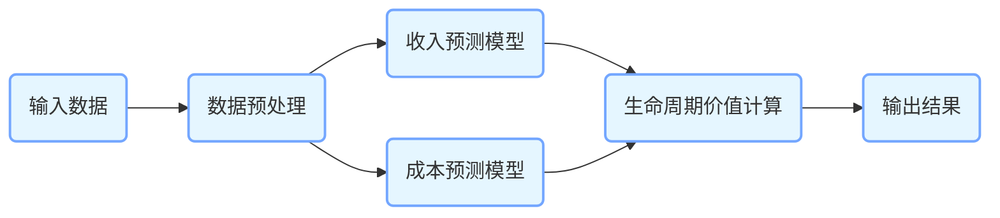

# 金融产品生命周期价值评估

> 关键词：金融产品、生命周期价值评估、客户价值、数据分析、数学模型、实际应用

> 摘要：本文聚焦于金融产品生命周期价值评估这一重要课题。在金融行业竞争日益激烈的背景下，准确评估金融产品的生命周期价值对于企业制定战略决策、优化资源配置以及提升客户满意度至关重要。文章从背景介绍入手，阐述了评估的目的、范围、预期读者和文档结构，接着详细解释了核心概念及其联系，深入剖析了核心算法原理并给出具体操作步骤，通过数学模型和公式进行量化分析，结合项目实战案例展示评估过程和代码实现，探讨了实际应用场景，推荐了相关的学习资源、开发工具框架和论文著作，最后总结了未来发展趋势与挑战，并提供常见问题解答和扩展阅读参考资料，旨在为读者全面深入地理解金融产品生命周期价值评估提供专业且实用的指导。

## 1. 背景介绍 
### 1.1 目的和范围
在金融市场中，不同的金融产品如银行存款、贷款、基金、保险等都有其特定的生命周期。准确评估金融产品在整个生命周期内为企业带来的价值，有助于金融机构做出更明智的决策。其目的主要包括：合理规划产品的推广策略，根据不同阶段的价值表现调整资源投入；优化产品设计，提升产品的竞争力和盈利能力；加强客户关系管理，针对不同价值的客户群体提供个性化的服务。

本文章的范围涵盖了常见金融产品的生命周期价值评估，包括但不限于零售金融产品（如信用卡、个人贷款）和投资金融产品（如股票型基金、债券型基金）。同时，会涉及到不同的评估方法和技术，以及如何将评估结果应用于实际的业务决策中。

### 1.2 预期读者
本文预期读者主要包括金融行业的从业者，如银行客户经理、金融产品经理、投资顾问等，他们可以通过本文了解如何评估金融产品的生命周期价值，以便更好地进行产品推广和客户服务。同时，数据分析师、算法工程师等技术人员也可以从中获取相关的技术和方法，用于开发和优化金融产品价值评估系统。此外，对金融科技感兴趣的学生和研究人员也能从本文中获得有价值的知识和研究思路。

### 1.3 文档结构概述
本文将按照以下结构进行组织：首先介绍核心概念与联系，帮助读者建立对金融产品生命周期价值评估的基本认知；接着详细阐述核心算法原理和具体操作步骤，通过Python代码进行实现；然后介绍相关的数学模型和公式，并举例说明其应用；之后通过项目实战案例，展示如何在实际中进行金融产品生命周期价值评估；再探讨实际应用场景，说明评估结果在金融业务中的具体用途；推荐相关的工具和资源，方便读者进一步学习和实践；最后总结未来发展趋势与挑战，提供常见问题解答和扩展阅读参考资料。

### 1.4 术语表
#### 1.4.1 核心术语定义
- **金融产品生命周期价值（Lifetime Value, LTV）**：指金融产品在其整个生命周期内为金融机构带来的净收益的现值总和。它考虑了客户在与金融产品交互过程中的所有收入和成本，包括初始购买、续费、交叉销售、服务成本等。
- **客户获取成本（Customer Acquisition Cost, CAC）**：指金融机构为了获取一个新客户而付出的所有成本，包括营销费用、销售费用等。
- **客户留存率（Customer Retention Rate, CRR）**：指在一定时期内，继续使用金融产品的客户数量与期初客户数量的比例。
- **净现值（Net Present Value, NPV）**：指投资项目在未来各期现金流量的现值之和减去初始投资的现值。在金融产品生命周期价值评估中，用于计算未来收益的现值。

#### 1.4.2 相关概念解释
- **生命周期阶段**：金融产品的生命周期通常包括引入期、成长期、成熟期和衰退期。在不同阶段，产品的市场需求、竞争状况和盈利能力都有所不同，因此其生命周期价值也会发生变化。
- **收入流**：指金融产品在生命周期内为金融机构带来的各种收入，如利息收入、手续费收入、管理费收入等。
- **成本流**：指金融机构为了提供金融产品和服务而发生的各种成本，如资金成本、运营成本、营销成本等。

#### 1.4.3 缩略词列表
- LTV：Lifetime Value
- CAC：Customer Acquisition Cost
- CRR：Customer Retention Rate
- NPV：Net Present Value

## 2. 核心概念与联系 

### 核心概念原理
金融产品生命周期价值评估的核心原理是通过对金融产品在整个生命周期内的收入和成本进行预测和分析，计算出产品为金融机构带来的净收益的现值。其基本思想是将未来的现金流量折现到当前时刻，考虑了货币的时间价值。

金融产品的收入主要来源于客户的购买、续费和交叉销售等行为。而成本则包括客户获取成本、运营成本、资金成本等。通过对这些收入和成本的准确估算，可以得到产品在不同生命周期阶段的盈利情况。

### 架构的文本示意图
```plaintext
金融产品生命周期价值评估
|-- 输入数据
|   |-- 客户数据（年龄、性别、收入等）
|   |-- 产品数据（类型、利率、费用等）
|   |-- 市场数据（利率波动、市场份额等）
|-- 数据预处理
|   |-- 数据清洗
|   |-- 特征工程
|-- 收入预测模型
|   |-- 购买预测
|   |-- 续费预测
|   |-- 交叉销售预测
|-- 成本预测模型
|   |-- 客户获取成本预测
|   |-- 运营成本预测
|   |-- 资金成本预测
|-- 生命周期价值计算
|   |-- 净现值计算
|   |-- 不同阶段价值分析
|-- 输出结果
|   |-- 金融产品生命周期价值
|   |-- 各阶段价值分布
```

### Mermaid 流程图


## 3. 核心算法原理 & 具体操作步骤 

### 核心算法原理
在金融产品生命周期价值评估中，常用的算法包括回归分析、时间序列分析和机器学习算法等。下面以线性回归为例，介绍如何预测金融产品的收入。

线性回归是一种用于建立自变量和因变量之间线性关系的统计方法。假设我们要预测金融产品的收入 $y$，可以选择一些相关的自变量 $x_1, x_2, \cdots, x_n$，建立线性回归模型：

$$y = \beta_0 + \beta_1x_1 + \beta_2x_2 + \cdots + \beta_nx_n + \epsilon$$

其中，$\beta_0$ 是截距，$\beta_1, \beta_2, \cdots, \beta_n$ 是回归系数，$\epsilon$ 是误差项。

通过最小化误差平方和，可以估计出回归系数 $\beta_0, \beta_1, \cdots, \beta_n$ 的值。然后，根据新的自变量值，就可以预测出金融产品的收入。

### 具体操作步骤
#### 步骤 1：数据收集
收集与金融产品相关的数据，包括客户数据、产品数据和市场数据等。例如，客户的年龄、性别、收入，产品的利率、费用，市场的利率波动、市场份额等。

#### 步骤 2：数据预处理
对收集到的数据进行清洗和预处理，包括去除缺失值、异常值，进行数据标准化等操作。

#### 步骤 3：特征选择
选择与金融产品收入相关的特征作为自变量。可以使用相关性分析、特征重要性排序等方法进行特征选择。

#### 步骤 4：模型训练
使用训练数据对线性回归模型进行训练，估计回归系数的值。

#### 步骤 5：模型评估
使用测试数据对训练好的模型进行评估，计算模型的评估指标，如均方误差（MSE）、决定系数（$R^2$）等。

#### 步骤 6：收入预测
使用训练好的模型对金融产品的未来收入进行预测。

### Python 源代码实现
```python
import pandas as pd
from sklearn.model_selection import train_test_split
from sklearn.linear_model import LinearRegression
from sklearn.metrics import mean_squared_error, r2_score

# 步骤 1：数据收集
# 假设已经有一个包含特征和目标变量的数据集 data.csv
data = pd.read_csv('data.csv')

# 步骤 2：数据预处理
# 去除缺失值
data = data.dropna()

# 步骤 3：特征选择
# 假设选择前三个特征作为自变量
X = data.iloc[:, :3]
y = data.iloc[:, -1]

# 步骤 4：模型训练
# 划分训练集和测试集
X_train, X_test, y_train, y_test = train_test_split(X, y, test_size=0.2, random_state=42)

# 创建线性回归模型
model = LinearRegression()

# 训练模型
model.fit(X_train, y_train)

# 步骤 5：模型评估
# 预测测试集
y_pred = model.predict(X_test)

# 计算均方误差
mse = mean_squared_error(y_test, y_pred)
print(f"均方误差: {mse}")

# 计算决定系数
r2 = r2_score(y_test, y_pred)
print(f"决定系数: {r2}")

# 步骤 6：收入预测
# 假设新的特征值
new_X = [[1, 2, 3]]
predicted_income = model.predict(new_X)
print(f"预测收入: {predicted_income[0]}")
```

## 4. 数学模型和公式 & 详细讲解 & 举例说明 

### 金融产品生命周期价值的计算
金融产品生命周期价值（LTV）可以通过以下公式计算：

$$LTV = \sum_{t=0}^{T} \frac{R_t - C_t}{(1 + r)^t}$$

其中，$R_t$ 是第 $t$ 期的收入，$C_t$ 是第 $t$ 期的成本，$r$ 是折现率，$T$ 是金融产品的生命周期。

### 详细讲解
- **收入 $R_t$**：包括客户的购买收入、续费收入、交叉销售收入等。可以通过前面介绍的收入预测模型进行预测。
- **成本 $C_t$**：包括客户获取成本、运营成本、资金成本等。同样，可以通过成本预测模型进行预测。
- **折现率 $r$**：用于考虑货币的时间价值。一般来说，折现率可以根据市场利率、金融机构的资金成本等因素来确定。
- **生命周期 $T$**：金融产品的生命周期可以根据产品的特点和市场情况来确定。例如，信用卡的生命周期可能为 5 - 10 年，而短期理财产品的生命周期可能只有几个月。

### 举例说明
假设某金融产品的生命周期为 3 年，每年的收入和成本预测如下：

| 年份 | 收入 ($R_t$) | 成本 ($C_t$) |
|------|--------------|--------------|
| 1    | 1000         | 500          |
| 2    | 1200         | 600          |
| 3    | 1500         | 700          |

折现率 $r = 0.1$。

则该金融产品的生命周期价值为：

$$
\begin{align*}
LTV &= \frac{1000 - 500}{(1 + 0.1)^1} + \frac{1200 - 600}{(1 + 0.1)^2} + \frac{1500 - 700}{(1 + 0.1)^3}\\
&= \frac{500}{1.1} + \frac{600}{1.21} + \frac{800}{1.331}\\
&\approx 454.55 + 495.87 + 601.05\\
&= 1551.47
\end{align*}
$$

这意味着该金融产品在其 3 年的生命周期内，为金融机构带来的净收益的现值约为 1551.47 元。

## 5. 项目实战：代码实际案例和详细解释说明 

### 5.1 开发环境搭建
#### 操作系统
可以选择 Windows、Linux 或 macOS 操作系统。本文以 Windows 10 为例进行说明。

#### 编程语言和版本
使用 Python 3.8 及以上版本。可以从 Python 官方网站（https://www.python.org/downloads/）下载并安装。

#### 开发工具
推荐使用 Anaconda 作为 Python 开发环境管理工具，它集成了许多常用的科学计算库和工具。可以从 Anaconda 官方网站（https://www.anaconda.com/products/individual）下载并安装。

#### 所需库
- Pandas：用于数据处理和分析。
- NumPy：用于数值计算。
- Scikit-learn：用于机器学习模型的训练和评估。
- Matplotlib：用于数据可视化。

可以使用以下命令安装所需库：
```sh
pip install pandas numpy scikit-learn matplotlib
```

### 5.2 源代码详细实现和代码解读
```python
import pandas as pd
import numpy as np
from sklearn.model_selection import train_test_split
from sklearn.linear_model import LinearRegression
from sklearn.metrics import mean_squared_error, r2_score
import matplotlib.pyplot as plt

# 步骤 1：数据收集
# 假设已经有一个包含客户特征和产品收入的数据集 data.csv
data = pd.read_csv('data.csv')

# 步骤 2：数据预处理
# 去除缺失值
data = data.dropna()

# 数据标准化
from sklearn.preprocessing import StandardScaler
scaler = StandardScaler()
features = data.drop('income', axis=1)
target = data['income']
scaled_features = scaler.fit_transform(features)

# 步骤 3：特征选择
# 这里简单选择所有特征
X = scaled_features
y = target

# 步骤 4：模型训练
# 划分训练集和测试集
X_train, X_test, y_train, y_test = train_test_split(X, y, test_size=0.2, random_state=42)

# 创建线性回归模型
model = LinearRegression()

# 训练模型
model.fit(X_train, y_train)

# 步骤 5：模型评估
# 预测测试集
y_pred = model.predict(X_test)

# 计算均方误差
mse = mean_squared_error(y_test, y_pred)
print(f"均方误差: {mse}")

# 计算决定系数
r2 = r2_score(y_test, y_pred)
print(f"决定系数: {r2}")

# 步骤 6：收入预测
# 假设新的特征值
new_X = np.array([[1, 2, 3, 4, 5]])
scaled_new_X = scaler.transform(new_X)
predicted_income = model.predict(scaled_new_X)
print(f"预测收入: {predicted_income[0]}")

# 步骤 7：可视化结果
plt.scatter(y_test, y_pred)
plt.xlabel('实际收入')
plt.ylabel('预测收入')
plt.title('实际收入 vs 预测收入')
plt.show()
```

### 代码解读与分析
- **数据收集**：使用 `pandas` 库的 `read_csv` 函数读取包含客户特征和产品收入的数据集。
- **数据预处理**：使用 `dropna` 函数去除数据集中的缺失值，然后使用 `StandardScaler` 对特征进行标准化处理，以提高模型的训练效果。
- **特征选择**：这里简单选择所有特征作为自变量。在实际应用中，可以使用更复杂的特征选择方法。
- **模型训练**：使用 `train_test_split` 函数将数据集划分为训练集和测试集，然后使用 `LinearRegression` 模型进行训练。
- **模型评估**：使用 `mean_squared_error` 和 `r2_score` 函数计算模型的均方误差和决定系数，评估模型的性能。
- **收入预测**：使用训练好的模型对新的特征值进行预测，得到预测收入。
- **可视化结果**：使用 `matplotlib` 库绘制实际收入和预测收入的散点图，直观地展示模型的预测效果。

## 6. 实际应用场景 
### 产品推广策略制定
根据金融产品的生命周期价值评估结果，金融机构可以制定不同的产品推广策略。对于生命周期价值高的产品，可以加大推广力度，投入更多的营销资源，如广告宣传、促销活动等。而对于生命周期价值低的产品，可以考虑优化产品设计或者减少推广投入。

### 客户细分和个性化服务
通过评估客户购买金融产品的生命周期价值，金融机构可以对客户进行细分。对于高价值客户，可以提供更个性化的服务，如专属的理财产品、优先的客户服务等，以提高客户的满意度和忠诚度。对于低价值客户，可以通过提供一些优惠活动或者增值服务，提高他们的生命周期价值。

### 资源配置优化
金融机构可以根据金融产品的生命周期价值评估结果，优化资源配置。将更多的资源投入到生命周期价值高的产品和客户群体上，提高资源的利用效率，从而提升整体的盈利能力。

### 产品创新和优化
通过分析金融产品在不同生命周期阶段的价值表现，金融机构可以发现产品存在的问题和改进的空间。例如，如果发现产品在成熟期的收入增长放缓，可以考虑进行产品创新，推出新的功能或者服务，以延长产品的生命周期。

## 7. 工具和资源推荐
### 7.1 学习资源推荐
#### 7.1.1 书籍推荐
- 《金融数据分析与挖掘》：本书介绍了金融数据分析和挖掘的基本方法和技术，包括数据预处理、模型建立、评估和应用等方面，对于理解金融产品生命周期价值评估有很大的帮助。
- 《Python 数据分析实战》：通过实际案例介绍了如何使用 Python 进行数据分析和处理，涵盖了 Pandas、NumPy、Scikit-learn 等常用库的使用，适合初学者学习。
- 《机器学习实战》：详细介绍了机器学习的各种算法和应用，包括线性回归、决策树、神经网络等，对于掌握金融产品收入预测模型的建立有重要的参考价值。

#### 7.1.2 在线课程
- Coursera 上的“Data Science Specialization”：由多所知名大学的教授授课，系统地介绍了数据科学的各个方面，包括数据处理、机器学习、深度学习等，适合有一定编程基础的学习者。
- edX 上的“Financial Engineering and Risk Management”：该课程介绍了金融工程和风险管理的基本理论和方法，对于理解金融产品的成本和风险评估有很大的帮助。
- 网易云课堂上的“Python 数据分析从入门到精通”：以实际案例为导向，详细介绍了 Python 数据分析的全过程，适合初学者快速上手。

#### 7.1.3 技术博客和网站
- Towards Data Science：一个专注于数据科学和机器学习的博客平台，上面有很多关于金融数据分析和模型建立的优秀文章。
- Kaggle：一个数据科学竞赛平台，上面有很多金融相关的数据集和竞赛项目，可以通过参与竞赛提高自己的数据分析和建模能力。
- Medium：一个综合性的博客平台，上面有很多技术专家分享的关于金融科技和数据分析的文章。

### 7.2 开发工具框架推荐
#### 7.2.1 IDE和编辑器
- PyCharm：一款专业的 Python 集成开发环境，具有代码自动补全、调试、版本控制等功能，适合大型项目的开发。
- Jupyter Notebook：一个交互式的开发环境，可以实时运行代码、展示数据可视化结果，适合数据分析和模型验证。
- Visual Studio Code：一款轻量级的代码编辑器，支持多种编程语言和插件扩展，适合快速开发和调试。

#### 7.2.2 调试和性能分析工具
- PDB：Python 自带的调试工具，可以帮助开发者定位代码中的错误和问题。
- cProfile：Python 自带的性能分析工具，可以分析代码的运行时间和函数调用情况，帮助开发者优化代码性能。
- TensorBoard：一个用于可视化深度学习模型训练过程的工具，可以展示模型的损失函数、准确率等指标的变化情况。

#### 7.2.3 相关框架和库
- Pandas：用于数据处理和分析的 Python 库，提供了高效的数据结构和数据操作方法。
- NumPy：用于数值计算的 Python 库，提供了多维数组和各种数学函数。
- Scikit-learn：用于机器学习的 Python 库，提供了各种机器学习算法和工具，如线性回归、决策树、支持向量机等。
- PyTorch：一个深度学习框架，提供了高效的张量计算和自动求导功能，适合开发复杂的神经网络模型。

### 7.3 相关论文著作推荐
#### 7.3.1 经典论文
- “Customer Lifetime Value: Marketing Models and Applications”：该论文系统地介绍了客户生命周期价值的概念、模型和应用，是客户生命周期价值研究领域的经典之作。
- “Predictive Analytics for Customer Lifetime Value in Financial Services”：该论文探讨了如何使用预测分析技术评估金融服务领域的客户生命周期价值，提出了一些实用的模型和方法。
- “A Markov Chain Model for Customer Base Analysis”：该论文提出了一种基于马尔可夫链的客户基础分析模型，用于预测客户的行为和生命周期价值。

#### 7.3.2 最新研究成果
- 可以关注顶级金融学术期刊，如《Journal of Financial Economics》、《Review of Financial Studies》等，上面会发表一些关于金融产品价值评估和客户行为分析的最新研究成果。
- 也可以关注一些知名的学术会议，如 INFORMS Annual Meeting、ACM SIGKDD Conference on Knowledge Discovery and Data Mining 等，这些会议会展示金融科技和数据分析领域的最新研究进展。

#### 7.3.3 应用案例分析
- 《金融科技案例集》：收集了国内外金融科技领域的各种应用案例，包括金融产品创新、风险管理、客户服务等方面，对于理解金融产品生命周期价值评估在实际中的应用有很大的帮助。
- 各大金融机构的官方网站和年报：可以从中获取到一些金融机构在产品推广、客户管理和资源配置等方面的实际应用案例和经验分享。

## 8. 总结：未来发展趋势与挑战
### 未来发展趋势
- **智能化评估**：随着人工智能和机器学习技术的不断发展，金融产品生命周期价值评估将越来越智能化。未来的评估模型将能够自动学习和适应市场变化，提高评估的准确性和效率。
- **多维度评估**：除了考虑传统的收入和成本因素外，未来的评估将更加注重多维度的因素，如客户体验、社会影响等。通过综合考虑这些因素，可以更全面地评估金融产品的生命周期价值。
- **实时评估**：随着金融市场的快速变化和数据的实时更新，未来的评估将更加注重实时性。金融机构可以通过实时监测客户行为和市场数据，及时调整产品策略和资源配置。

### 挑战
- **数据质量和安全**：金融产品生命周期价值评估需要大量的高质量数据。然而，数据的收集、存储和管理面临着诸多挑战，如数据缺失、数据错误、数据安全等问题。如何保证数据的质量和安全是未来需要解决的重要问题。
- **模型解释性**：随着评估模型的越来越复杂，模型的解释性变得越来越重要。金融机构需要能够理解模型的决策过程和结果，以便做出合理的决策。如何提高模型的解释性是未来需要研究的一个重要方向。
- **市场不确定性**：金融市场充满了不确定性，如利率波动、市场风险等。这些不确定性因素会影响金融产品的收入和成本，从而增加了评估的难度。如何应对市场不确定性是未来评估工作面临的一个挑战。

## 9. 附录：常见问题与解答
### 问题 1：金融产品生命周期价值评估的准确性如何保证？
解答：要保证评估的准确性，需要从多个方面入手。首先，要收集高质量的数据，确保数据的完整性和准确性。其次，选择合适的评估模型和方法，根据不同的金融产品和市场情况进行调整。此外，还需要对模型进行不断的验证和优化，及时调整参数和方法，以适应市场变化。

### 问题 2：如何处理数据中的缺失值和异常值？
解答：对于缺失值，可以采用删除缺失值、填充缺失值等方法进行处理。填充缺失值可以使用均值、中位数、众数等统计量，也可以使用机器学习算法进行预测填充。对于异常值，可以采用基于统计方法（如 Z-score 方法）或基于机器学习方法（如孤立森林算法）进行检测和处理。

### 问题 3：金融产品生命周期价值评估模型是否需要定期更新？
解答：是的，金融产品生命周期价值评估模型需要定期更新。因为金融市场是不断变化的，客户行为和市场环境也会发生变化。定期更新模型可以保证模型的准确性和有效性，使评估结果更符合实际情况。

### 问题 4：如何将评估结果应用于实际的业务决策中？
解答：可以将评估结果应用于产品推广策略制定、客户细分和个性化服务、资源配置优化等方面。例如，对于生命周期价值高的产品和客户，可以加大投入；对于生命周期价值低的产品和客户，可以进行优化和改进。同时，还可以根据评估结果进行产品创新和优化，提高产品的竞争力和盈利能力。

## 10. 扩展阅读 & 参考资料
### 扩展阅读
- 《金融科技前沿：理论与实务》：本书介绍了金融科技领域的最新理论和实践，包括区块链、人工智能、大数据等技术在金融领域的应用，对于深入理解金融产品生命周期价值评估有很大的帮助。
- 《数据驱动的市场营销》：该书介绍了如何使用数据分析和挖掘技术进行市场营销决策，对于将金融产品生命周期价值评估结果应用于市场营销有一定的参考价值。

### 参考资料
- 相关金融机构的官方网站和年报，获取实际应用案例和数据。
- 学术数据库，如 IEEE Xplore、ACM Digital Library 等，获取相关的学术论文和研究成果。

作者：AI天才研究院/AI Genius Institute & 禅与计算机程序设计艺术 /Zen And The Art of Computer Programming