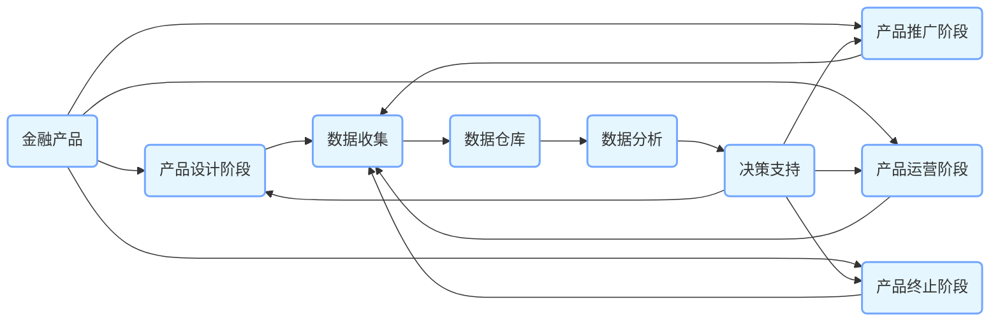

# 金融产品生命周期管理平台

> 关键词：金融产品、生命周期管理、平台架构、算法原理、实际应用

> 摘要：本文围绕金融产品生命周期管理平台展开深入探讨。首先介绍了平台开发的背景，包括目的、预期读者、文档结构和相关术语。接着阐述了核心概念及其联系，通过文本示意图和 Mermaid 流程图进行清晰展示。详细讲解了核心算法原理，并给出 Python 代码示例。对数学模型和公式进行推导和举例说明。通过项目实战，从开发环境搭建到源代码实现和解读进行了全面分析。列举了该平台的实际应用场景，推荐了学习资源、开发工具框架和相关论文著作。最后总结了平台的未来发展趋势与挑战，提供常见问题解答和扩展阅读参考资料，旨在为金融行业相关人员提供全面、深入的技术指导。

## 1. 背景介绍 
### 1.1 目的和范围
金融产品生命周期管理平台的目的在于实现对金融产品从诞生到退出市场整个过程的有效管理和监控。在金融行业，产品种类繁多，包括银行理财产品、保险产品、证券投资基金等，每种产品都有其独特的生命周期，涵盖了产品的设计、开发、推广、运营和终止等阶段。该平台的范围包括对各类金融产品的全生命周期数据进行收集、整理、分析和决策支持，帮助金融机构提高产品管理效率、降低风险、提升客户满意度。

### 1.2 预期读者
本文的预期读者主要包括金融机构的产品经理、风险管理人员、技术开发人员以及对金融科技感兴趣的研究人员。产品经理可以借助平台更好地规划和管理金融产品；风险管理人员能够通过平台实时监控产品风险；技术开发人员可以从中获取平台架构和开发实现的相关知识；研究人员则可以了解金融产品生命周期管理的最新技术和发展趋势。

### 1.3 文档结构概述
本文将按照以下结构进行阐述：首先介绍核心概念与联系，让读者对金融产品生命周期管理有清晰的认识；接着详细讲解核心算法原理和具体操作步骤，并给出 Python 代码示例；然后介绍数学模型和公式，通过具体例子加深理解；再通过项目实战展示平台的开发过程和代码实现；列举实际应用场景，说明平台的实用性；推荐相关的工具和资源，帮助读者进一步学习和开发；最后总结未来发展趋势与挑战，提供常见问题解答和扩展阅读参考资料。

### 1.4 术语表
#### 1.4.1 核心术语定义
- **金融产品**：指金融机构向市场提供的各种具有特定收益、风险和流动性特征的产品，如存款、贷款、债券、股票、基金等。
- **生命周期管理**：对金融产品从设计、开发、推广、运营到终止的全过程进行规划、监控和决策的管理活动。
- **数据仓库**：用于存储和管理金融产品生命周期相关数据的数据库，支持数据的集成、存储和分析。
- **风险评估**：对金融产品在生命周期内面临的各种风险进行识别、衡量和评价的过程。

#### 1.4.2 相关概念解释
- **产品设计阶段**：金融机构根据市场需求和自身战略，确定产品的基本特征、收益模式、风险水平等要素的阶段。
- **产品推广阶段**：通过各种营销渠道将金融产品推向市场，吸引客户购买的阶段。
- **产品运营阶段**：对已发行的金融产品进行日常管理和维护，包括客户服务、资金管理、风险监控等工作的阶段。
- **产品终止阶段**：当金融产品达到预定的期限或满足特定条件时，停止运营并进行清算的阶段。

#### 1.4.3 缩略词列表
- **CRM**：Customer Relationship Management，客户关系管理
- **ETL**：Extract, Transform, Load，数据抽取、转换和加载
- **KPI**：Key Performance Indicator，关键绩效指标
- **VAR**：Value at Risk，风险价值

## 2. 核心概念与联系 
金融产品生命周期管理平台的核心概念主要包括金融产品、生命周期阶段、数据管理和决策支持。这些概念之间相互关联，共同构成了平台的架构。

### 核心概念原理和架构的文本示意图
金融产品是平台的核心对象，它在不同的生命周期阶段会产生不同的数据。数据管理模块负责收集、存储和处理这些数据，为决策支持模块提供数据基础。决策支持模块根据数据分析结果，为产品的各个阶段提供决策建议，如产品设计优化、营销策略调整、风险控制措施等。

### Mermaid 流程图


该流程图展示了金融产品从不同生命周期阶段产生数据，数据经过收集存储到数据仓库，再经过分析为决策支持提供依据，决策支持又反馈到各个生命周期阶段的循环过程。

## 3. 核心算法原理 & 具体操作步骤 
### 核心算法原理
在金融产品生命周期管理平台中，核心算法主要包括风险评估算法、产品定价算法和客户细分算法。下面以风险评估算法为例进行详细讲解。

风险评估算法的核心思想是通过对金融产品的各种风险因素进行量化分析，计算出产品的风险价值（VAR）。VAR 是指在一定的置信水平下，某一金融资产或投资组合在未来特定的一段时间内可能遭受的最大损失。常见的 VAR 计算方法有历史模拟法、方差 - 协方差法和蒙特卡罗模拟法。这里我们采用历史模拟法进行讲解。

历史模拟法的基本原理是基于历史数据来估计未来的风险。具体步骤如下：
1. 收集金融产品的历史价格数据。
2. 计算每个时间点的收益率。
3. 对收益率进行排序。
4. 根据置信水平确定 VAR 值。

### Python 代码示例
```python
import numpy as np

def historical_var(prices, confidence_level=0.95):
    """
    计算金融产品的历史模拟法风险价值（VAR）
    :param prices: 金融产品的历史价格数据
    :param confidence_level: 置信水平，默认为 0.95
    :return: VAR 值
    """
    # 计算收益率
    returns = np.diff(prices) / prices[:-1]
    # 对收益率进行排序
    sorted_returns = np.sort(returns)
    # 确定 VAR 的索引
    var_index = int((1 - confidence_level) * len(sorted_returns))
    # 计算 VAR 值
    var = -sorted_returns[var_index]
    return var

# 示例数据
prices = np.array([100, 102, 105, 103, 101, 104, 106, 108, 107, 109])
# 计算 VAR 值
var = historical_var(prices)
print(f"VAR 值: {var}")
```

### 具体操作步骤
1. **数据准备**：收集金融产品的历史价格数据，可以从金融数据提供商或交易系统中获取。
2. **数据预处理**：对收集到的数据进行清洗和整理，去除缺失值和异常值。
3. **调用函数计算 VAR**：将处理后的数据传入 `historical_var` 函数，设置置信水平，计算 VAR 值。
4. **结果分析**：根据计算得到的 VAR 值，评估金融产品的风险水平，为决策提供依据。

## 4. 数学模型和公式 & 详细讲解 & 举例说明 
### 历史模拟法 VAR 数学模型和公式
历史模拟法 VAR 的计算公式为：

$$VAR = -R_{(n(1 - c))}$$

其中，$R_{(n(1 - c))}$ 表示排序后收益率序列中第 $n(1 - c)$ 个元素，$n$ 为收益率序列的长度，$c$ 为置信水平。

### 详细讲解
历史模拟法基于这样一个假设：未来的收益率分布与历史收益率分布相似。通过对历史收益率进行排序，我们可以找到在一定置信水平下的最坏情况收益率，将其取相反数即为 VAR 值。例如，当置信水平为 95% 时，我们需要找到排序后收益率序列中第 5% 位置的收益率，该收益率对应的损失即为在 95% 置信水平下的最大可能损失。

### 举例说明
假设我们有 100 个历史收益率数据，置信水平为 95%。则 $n = 100$，$c = 0.95$，$n(1 - c) = 100\times(1 - 0.95) = 5$。我们对这 100 个收益率进行排序，取第 5 个收益率（从最小的开始数），将其取相反数即为 VAR 值。

假设排序后的收益率序列为 $[-0.05, -0.04, -0.03, -0.02, -0.01, 0, 0.01, 0.02, 0.03, 0.04, \cdots]$，则第 5 个收益率为 -0.01，VAR 值为 $-(-0.01) = 0.01$，即该金融产品在 95% 置信水平下，未来一段时间内可能遭受的最大损失为 1%。

## 5. 项目实战：代码实际案例和详细解释说明 
### 5.1  开发环境搭建
#### 操作系统
建议使用 Linux 系统，如 Ubuntu 或 CentOS，因为 Linux 系统具有稳定性高、开源免费等优点，适合进行开发和部署。

#### 数据库
选择 MySQL 作为数据仓库，用于存储金融产品的相关数据。可以通过以下命令安装 MySQL：
```bash
sudo apt-get update
sudo apt-get install mysql-server
```

#### Python 环境
安装 Python 3.7 及以上版本，并使用虚拟环境管理工具 `virtualenv` 来创建独立的开发环境。
```bash
pip install virtualenv
virtualenv -p python3 myenv
source myenv/bin/activate
```

#### 开发框架
使用 Flask 作为 Web 开发框架，Flask 是一个轻量级的 Python Web 框架，易于学习和使用。
```bash
pip install flask
```

### 5.2  源代码详细实现和代码解读
#### 数据库连接
```python
import mysql.connector

# 连接数据库
mydb = mysql.connector.connect(
    host="localhost",
    user="your_username",
    password="your_password",
    database="financial_product_db"
)

# 创建游标
mycursor = mydb.cursor()
```
这段代码用于连接 MySQL 数据库，并创建一个游标对象，用于执行 SQL 语句。

#### 数据插入
```python
# 插入金融产品数据
product_data = ("Product A", "2023-01-01", "2023-12-31", 1000000)
sql = "INSERT INTO financial_products (product_name, start_date, end_date, initial_investment) VALUES (%s, %s, %s, %s)"
mycursor.execute(sql, product_data)
mydb.commit()
print(mycursor.rowcount, "record inserted.")
```
这段代码将一条金融产品数据插入到 `financial_products` 表中。

#### Web 应用开发
```python
from flask import Flask, jsonify

app = Flask(__name__)

@app.route('/products', methods=['GET'])
def get_products():
    # 查询金融产品数据
    mycursor.execute("SELECT * FROM financial_products")
    products = mycursor.fetchall()
    product_list = []
    for product in products:
        product_dict = {
            "id": product[0],
            "product_name": product[1],
            "start_date": str(product[2]),
            "end_date": str(product[3]),
            "initial_investment": product[4]
        }
        product_list.append(product_dict)
    return jsonify(product_list)

if __name__ == '__main__':
    app.run(debug=True)
```
这段代码使用 Flask 框架创建了一个简单的 Web 应用，提供了一个 `/products` 接口，用于获取所有金融产品的数据。

### 5.3  代码解读与分析
#### 数据库连接部分
通过 `mysql.connector` 模块连接到 MySQL 数据库，使用 `mydb` 对象表示数据库连接，`mycursor` 对象用于执行 SQL 语句。

#### 数据插入部分
使用 `INSERT INTO` 语句将金融产品数据插入到数据库中，通过 `mydb.commit()` 方法提交事务，确保数据插入成功。

#### Web 应用部分
使用 Flask 框架创建了一个 Web 应用，定义了一个 `/products` 路由，当客户端访问该路由时，执行 SQL 查询语句获取所有金融产品数据，并将数据转换为 JSON 格式返回给客户端。

## 6. 实际应用场景 
### 银行理财产品管理
银行可以使用金融产品生命周期管理平台对理财产品进行全生命周期管理。在产品设计阶段，平台可以通过数据分析提供市场需求和客户偏好信息，帮助银行设计出更符合市场需求的理财产品。在产品推广阶段，平台可以根据客户细分结果，制定个性化的营销策略，提高产品的销售效率。在产品运营阶段，平台可以实时监控产品的风险和收益情况，及时调整投资组合，保障客户的利益。在产品终止阶段，平台可以进行清算和结算工作，确保资金的安全和准确返还。

### 保险产品开发与管理
保险公司可以利用平台对保险产品进行开发和管理。在产品设计阶段，平台可以分析历史理赔数据和市场需求，确定保险产品的费率和保障范围。在产品推广阶段，平台可以通过 CRM 系统对客户进行精准营销，提高客户的购买意愿。在产品运营阶段，平台可以实时监控客户的风险状况，及时调整保险费率和理赔政策。在产品终止阶段，平台可以进行保单的注销和清算工作。

### 证券投资基金管理
证券投资基金公司可以借助平台对基金产品进行管理。在产品设计阶段，平台可以分析市场趋势和投资策略，确定基金的投资组合和风险水平。在产品推广阶段，平台可以通过各种渠道向投资者宣传基金产品，提高基金的知名度和认可度。在产品运营阶段，平台可以实时监控基金的净值和业绩表现，及时调整投资组合，提高基金的收益率。在产品终止阶段，平台可以进行基金的清算和份额赎回工作。

## 7. 工具和资源推荐
### 7.1 学习资源推荐
#### 7.1.1 书籍推荐
- 《金融产品设计》：全面介绍了金融产品的设计原理和方法，包括银行、证券、保险等各类金融产品。
- 《金融风险管理》：深入讲解了金融风险的识别、衡量和控制方法，是金融风险管理领域的经典著作。
- 《Python 金融数据分析实战》：结合 Python 编程语言，介绍了金融数据分析的方法和技巧，适合初学者学习。

#### 7.1.2 在线课程
- Coursera 上的“金融科技基础”课程：由知名高校教授授课，涵盖了金融科技的各个方面，包括金融产品创新、风险管理等。
- edX 上的“Python 金融编程”课程：通过实际案例，讲解了如何使用 Python 进行金融数据分析和建模。

#### 7.1.3 技术博客和网站
- 金融界网站：提供了丰富的金融资讯和研究报告，是了解金融市场动态的重要渠道。
- 量化投资与机器学习论坛：专注于量化投资和机器学习在金融领域的应用，分享了很多实用的技术和经验。

### 7.2 开发工具框架推荐
#### 7.2.1 IDE和编辑器
- PyCharm：一款专业的 Python 集成开发环境，提供了丰富的代码编辑、调试和分析功能。
- Visual Studio Code：一款轻量级的代码编辑器，支持多种编程语言，具有丰富的插件生态系统。

#### 7.2.2 调试和性能分析工具
- Py-Spy：一个用于 Python 程序性能分析的工具，可以帮助开发者找出程序中的性能瓶颈。
- PDB：Python 内置的调试工具，方便开发者进行代码调试和错误排查。

#### 7.2.3 相关框架和库
- Pandas：一个强大的数据分析库，提供了高效的数据结构和数据处理功能，广泛应用于金融数据分析领域。
- NumPy：一个用于科学计算的基础库，提供了多维数组对象和各种数学函数，是金融计算的重要工具。
- Scikit-learn：一个机器学习库，提供了各种机器学习算法和工具，可用于金融风险评估和预测。

### 7.3 相关论文著作推荐
#### 7.3.1 经典论文
- “On the Pricing of Corporate Debt: The Risk Structure of Interest Rates”：由 Merton 提出的经典论文，奠定了信用风险定价的理论基础。
- “Capital Asset Pricing Model: Theory and Evidence”：介绍了资本资产定价模型（CAPM）的理论和实证研究，是现代金融理论的重要成果。

#### 7.3.2 最新研究成果
- 近年来关于金融科技和区块链在金融产品管理中的应用研究，探讨了新技术对金融产品生命周期管理的影响和挑战。
- 基于人工智能和机器学习的金融风险评估模型的研究，提高了风险评估的准确性和效率。

#### 7.3.3 应用案例分析
- 国内外金融机构在金融产品生命周期管理方面的成功案例分析，包括平台建设、业务流程优化和风险管理等方面的经验。

## 8. 总结：未来发展趋势与挑战
### 未来发展趋势
- **数字化转型加速**：随着金融科技的不断发展，金融产品生命周期管理平台将更加数字化和智能化。利用大数据、人工智能和区块链等技术，实现数据的实时采集、分析和决策，提高平台的运营效率和服务质量。
- **个性化服务增强**：根据客户的个性化需求和风险偏好，提供定制化的金融产品和服务。通过客户细分和精准营销，提高客户的满意度和忠诚度。
- **跨行业融合加深**：金融行业与科技、医疗、教育等行业的融合将越来越深入，金融产品的种类和形式将更加多样化。平台需要具备更强的兼容性和扩展性，以适应跨行业融合的发展趋势。

### 挑战
- **数据安全与隐私保护**：金融产品生命周期管理平台涉及大量的客户敏感信息和金融数据，数据安全和隐私保护是至关重要的。需要采取有效的技术和管理措施，确保数据的安全性和保密性。
- **技术创新与人才短缺**：金融科技的快速发展要求平台不断进行技术创新，但目前金融行业的技术人才相对短缺。需要加强人才培养和引进，提高平台的技术水平和创新能力。
- **监管合规要求严格**：金融行业受到严格的监管，平台需要遵守各种法律法规和监管要求。在平台建设和运营过程中，需要充分考虑监管合规因素，确保平台的合法合规运行。

## 9. 附录：常见问题与解答
### 问题 1：金融产品生命周期管理平台需要哪些数据？
答：平台需要收集金融产品的基本信息，如产品名称、类型、期限、收益率等；客户信息，如客户姓名、年龄、性别、收入等；市场数据，如利率、汇率、股票指数等；交易数据，如交易时间、交易金额、交易对象等。

### 问题 2：如何保证平台的稳定性和可靠性？
答：可以采用分布式架构、集群技术和备份恢复机制，提高平台的可用性和容错能力。同时，加强系统监控和性能优化，及时发现和解决潜在的问题。

### 问题 3：平台如何与其他系统进行集成？
答：可以通过 API 接口实现平台与其他系统的集成，如 CRM 系统、财务管理系统等。在集成过程中，需要确保数据的一致性和安全性。

## 10. 扩展阅读 & 参考资料
### 扩展阅读
- 《金融科技前沿与趋势》：介绍了金融科技的最新发展动态和前沿技术，对金融产品生命周期管理平台的发展具有一定的指导意义。
- 《区块链技术在金融领域的应用》：探讨了区块链技术在金融产品发行、交易和结算等方面的应用前景和挑战。

### 参考资料
- 《金融产品设计与管理》教材
- 金融行业相关的法律法规和监管文件
- 国内外金融机构的年度报告和研究报告

作者：AI天才研究院/AI Genius Institute & 禅与计算机程序设计艺术 /Zen And The Art of Computer Programming