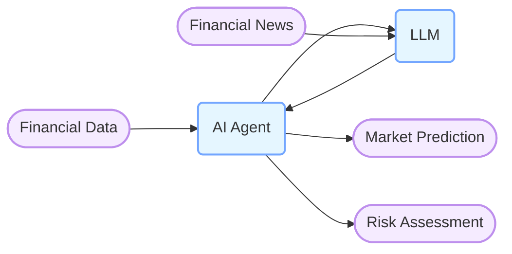

# 金融分析 AI Agent：利用 LLM 进行市场预测与风险评估

> 关键词：金融分析、AI Agent、大语言模型（LLM）、市场预测、风险评估

> 摘要：本文聚焦于金融分析领域中 AI Agent 结合大语言模型（LLM）的应用，深入探讨如何利用 LLM 进行市场预测与风险评估。首先介绍了相关背景知识，包括目的、预期读者、文档结构和术语表。接着阐述了核心概念及联系，给出了原理和架构的文本示意图与 Mermaid 流程图。详细讲解了核心算法原理和具体操作步骤，并辅以 Python 源代码。同时给出了相关数学模型和公式，通过举例进行说明。通过项目实战，展示了代码实际案例及详细解释。分析了该技术在实际中的应用场景，推荐了学习、开发工具及相关论文著作。最后总结了未来发展趋势与挑战，并提供了常见问题解答和扩展阅读参考资料。

## 1. 背景介绍 
### 1.1 目的和范围
金融市场的复杂性和不确定性使得市场预测与风险评估成为金融领域的核心任务。传统的金融分析方法在处理海量数据和复杂关系时存在一定的局限性。随着人工智能技术的发展，特别是大语言模型（LLM）的出现，为金融分析带来了新的机遇。本文的目的是探讨如何利用 AI Agent 结合 LLM 进行金融市场预测和风险评估，涵盖了从理论原理到实际应用的各个方面，包括核心概念、算法原理、数学模型、项目实战以及实际应用场景等。

### 1.2 预期读者
本文适合对金融分析、人工智能技术感兴趣的专业人士，包括金融分析师、投资经理、数据科学家、人工智能研究者等。同时，也适合对金融科技领域有一定了解，希望深入学习利用 AI 技术进行金融决策的爱好者。

### 1.3 文档结构概述
本文共分为十个部分。第一部分为背景介绍，阐述了文章的目的、预期读者和文档结构。第二部分介绍核心概念与联系，包括相关概念的原理和架构。第三部分讲解核心算法原理和具体操作步骤，并给出 Python 源代码。第四部分介绍数学模型和公式，并举例说明。第五部分通过项目实战展示代码实际案例和详细解释。第六部分分析实际应用场景。第七部分推荐学习、开发工具和相关论文著作。第八部分总结未来发展趋势与挑战。第九部分为附录，解答常见问题。第十部分提供扩展阅读和参考资料。

### 1.4 术语表
#### 1.4.1 核心术语定义
- **AI Agent**：人工智能代理，是一种能够感知环境、进行决策并采取行动以实现特定目标的软件实体。在金融分析中，AI Agent 可以根据市场数据和规则进行市场预测和风险评估。
- **大语言模型（LLM）**：一种基于深度学习的自然语言处理模型，通过在大规模文本数据上进行训练，能够生成自然流畅的文本、理解语义、进行知识问答等。常见的 LLM 有 GPT 系列、BERT 等。
- **市场预测**：根据历史和当前的市场数据，运用各种方法和模型，对未来市场的走势、价格变化等进行预测。
- **风险评估**：对金融投资或业务活动中可能面临的风险进行识别、分析和评估，确定风险的可能性和影响程度。

#### 1.4.2 相关概念解释
- **金融分析**：对金融市场、金融产品、金融机构等进行研究和分析，以支持投资决策、风险管理等金融活动。
- **深度学习**：一种机器学习的分支，通过构建多层神经网络来学习数据的特征和模式，在图像识别、自然语言处理等领域取得了显著的成果。
- **自然语言处理（NLP）**：研究如何让计算机理解和处理人类语言的技术，包括文本分类、情感分析、机器翻译等任务。

#### 1.4.3 缩略词列表
- **LLM**：Large Language Model（大语言模型）
- **AI**：Artificial Intelligence（人工智能）
- **NLP**：Natural Language Processing（自然语言处理）

## 2. 核心概念与联系 

### 核心概念原理
在金融分析中，AI Agent 作为智能决策的主体，利用大语言模型（LLM）的强大语言理解和生成能力来处理金融领域的文本信息和数据。LLM 可以从新闻报道、研究报告、社交媒体等大量文本中提取有价值的信息，如市场趋势、行业动态、公司业绩等。AI Agent 则根据这些信息，结合预设的规则和算法，进行市场预测和风险评估。

例如，AI Agent 可以将金融市场数据和新闻文本输入到 LLM 中，让 LLM 分析市场的情绪和趋势。然后，AI Agent 根据 LLM 的输出结果，结合自身的风险评估模型，判断投资的风险程度。如果 LLM 分析得出某行业的新闻报道大多为负面，且市场数据显示该行业的股价下跌，AI Agent 可以预测该行业未来的市场表现不佳，并评估投资该行业股票的风险较高。

### 架构的文本示意图
```plaintext
+---------------------+
|     Financial Data    |
|  (Market Prices, etc.)|
+---------------------+
          |
          v
+---------------------+
|     AI Agent         |
|  (Decision-making)   |
+---------------------+
          |
          v
+---------------------+
|     LLM (e.g., GPT)  |
|  (Text Understanding)|
+---------------------+
          |
          v
+---------------------+
|    Financial News    |
|  (Reports, Articles) |
+---------------------+
```

### Mermaid 流程图


这个流程图展示了金融分析 AI Agent 利用 LLM 进行市场预测和风险评估的主要流程。首先，AI Agent 接收金融数据和金融新闻，将金融新闻输入到 LLM 中进行文本理解和分析。LLM 的输出结果反馈给 AI Agent，AI Agent 根据这些信息进行市场预测和风险评估。

## 3. 核心算法原理 & 具体操作步骤 

### 核心算法原理
在利用 LLM 进行金融市场预测和风险评估时，主要涉及到以下几个核心算法步骤：

1. **数据预处理**：对金融数据和文本数据进行清洗、转换和特征提取。金融数据可能包括股票价格、成交量、财务报表等，文本数据可能包括新闻报道、研究报告等。数据预处理的目的是将数据转换为适合 LLM 处理的格式。
2. **文本嵌入**：将文本数据转换为向量表示，以便 LLM 能够处理。常见的文本嵌入方法有 Word2Vec、GloVe 等。LLM 可以将文本嵌入作为输入，进行语义理解和分析。
3. **模型推理**：将预处理后的数据输入到 LLM 中，进行推理和分析。LLM 可以根据输入的数据生成文本输出，如市场趋势分析、风险评估报告等。
4. **决策制定**：AI Agent 根据 LLM 的输出结果，结合预设的规则和算法，进行市场预测和风险评估。决策制定可以采用基于规则的方法、机器学习算法等。

### 具体操作步骤

#### 步骤 1：数据收集
收集金融市场数据和相关的文本数据。金融市场数据可以从金融数据提供商（如 Bloomberg、Wind 等）获取，文本数据可以从新闻网站、社交媒体等渠道获取。

#### 步骤 2：数据预处理
以下是一个简单的 Python 代码示例，用于对金融文本数据进行预处理：

```python
import pandas as pd
import re
import nltk
from nltk.corpus import stopwords
from nltk.stem import WordNetLemmatizer

nltk.download('stopwords')
nltk.download('wordnet')

# 读取文本数据
data = pd.read_csv('financial_news.csv')

# 定义预处理函数
def preprocess_text(text):
    # 去除特殊字符
    text = re.sub(r'[^a-zA-Z]', ' ', text)
    # 转换为小写
    text = text.lower()
    # 分词
    words = text.split()
    # 去除停用词
    stop_words = set(stopwords.words('english'))
    words = [w for w in words if not w in stop_words]
    # 词形还原
    lemmatizer = WordNetLemmatizer()
    words = [lemmatizer.lemmatize(w) for w in words]
    # 拼接成字符串
    text = ' '.join(words)
    return text

# 对文本数据进行预处理
data['text'] = data['text'].apply(preprocess_text)
```

#### 步骤 3：文本嵌入
使用预训练的词向量模型（如 Word2Vec）对文本数据进行嵌入：

```python
from gensim.models import Word2Vec

# 分词
sentences = [text.split() for text in data['text']]

# 训练 Word2Vec 模型
model = Word2Vec(sentences, min_count=1)

# 获取文本的向量表示
def get_text_vector(text):
    words = text.split()
    vectors = [model.wv[w] for w in words if w in model.wv]
    if len(vectors) == 0:
        return [0] * model.vector_size
    vector = sum(vectors) / len(vectors)
    return vector

data['vector'] = data['text'].apply(get_text_vector)
```

#### 步骤 4：模型推理
使用 LLM 进行推理。这里以 Hugging Face 的 Transformers 库为例，使用预训练的语言模型进行文本生成：

```python
from transformers import pipeline

# 加载预训练的语言模型
generator = pipeline('text-generation', model='gpt2')

# 进行推理
input_text = "The stock market is showing signs of volatility. Predict the future trend."
output = generator(input_text, max_length=100, num_return_sequences=1)
print(output[0]['generated_text'])
```

#### 步骤 5：决策制定
根据 LLM 的输出结果，结合预设的规则进行市场预测和风险评估：

```python
# 简单的决策规则
if "upward trend" in output[0]['generated_text'].lower():
    prediction = "Market is expected to rise."
    risk_level = "Low"
else:
    prediction = "Market is expected to be stable or decline."
    risk_level = "High"

print("Market Prediction:", prediction)
print("Risk Level:", risk_level)
```

## 4. 数学模型和公式 & 详细讲解 & 举例说明 

### 文本嵌入的数学模型
在文本嵌入中，常用的方法是将文本中的每个单词映射到一个低维向量空间中。以 Word2Vec 为例，其基本思想是通过神经网络学习单词的上下文信息，从而得到单词的向量表示。

Word2Vec 有两种主要的模型架构：Skip-gram 和 Continuous Bag-of-Words (CBOW)。

#### Skip-gram 模型
Skip-gram 模型的目标是根据中心单词预测其上下文单词。假设我们有一个单词序列 $w_1, w_2, \cdots, w_T$，Skip-gram 模型的目标是最大化以下概率：

$$
\prod_{t=1}^{T} \prod_{-c \leq j \leq c, j \neq 0} P(w_{t+j} | w_t)
$$

其中，$c$ 是上下文窗口的大小，$P(w_{t+j} | w_t)$ 表示在给定中心单词 $w_t$ 的情况下，预测上下文单词 $w_{t+j}$ 的概率。这个概率可以通过 softmax 函数计算：

$$
P(w_j | w_i) = \frac{\exp(\mathbf{v}_{w_j}^{\top} \mathbf{u}_{w_i})}{\sum_{k=1}^{V} \exp(\mathbf{v}_{w_k}^{\top} \mathbf{u}_{w_i})}
$$

其中，$\mathbf{v}_{w_j}$ 是单词 $w_j$ 的上下文向量，$\mathbf{u}_{w_i}$ 是单词 $w_i$ 的中心向量，$V$ 是词汇表的大小。

#### CBOW 模型
CBOW 模型的目标是根据上下文单词预测中心单词。其目标函数为：

$$
\prod_{t=1}^{T} P(w_t | w_{t-c}, \cdots, w_{t-1}, w_{t+1}, \cdots, w_{t+c})
$$

同样，这个概率可以通过 softmax 函数计算：

$$
P(w_t | \text{Context}(w_t)) = \frac{\exp(\mathbf{v}_{w_t}^{\top} \frac{1}{2c} \sum_{-c \leq j \leq c, j \neq 0} \mathbf{u}_{w_{t+j}})}{\sum_{k=1}^{V} \exp(\mathbf{v}_{w_k}^{\top} \frac{1}{2c} \sum_{-c \leq j \leq c, j \neq 0} \mathbf{u}_{w_{t+j}})}
$$

### 举例说明
假设我们有一个简单的文本序列："The stock market is volatile."，词汇表为 $\{ \text{The}, \text{stock}, \text{market}, \text{is}, \text{volatile} \}$。使用 Skip-gram 模型，以 "stock" 为中心单词，上下文窗口大小 $c = 1$，则上下文单词为 "The" 和 "market"。Skip-gram 模型的目标是最大化 $P(\text{The} | \text{stock})$ 和 $P(\text{market} | \text{stock})$ 的概率。

### 风险评估的数学模型
在风险评估中，常用的方法是计算风险度量指标，如标准差、夏普比率等。

#### 标准差
标准差是衡量数据离散程度的指标，在金融领域中可以用来衡量投资组合的风险。假设我们有一个投资组合的收益率序列 $r_1, r_2, \cdots, r_n$，其标准差 $\sigma$ 可以通过以下公式计算：

$$
\sigma = \sqrt{\frac{1}{n-1} \sum_{i=1}^{n} (r_i - \bar{r})^2}
$$

其中，$\bar{r}$ 是收益率序列的均值：

$$
\bar{r} = \frac{1}{n} \sum_{i=1}^{n} r_i
$$

#### 夏普比率
夏普比率是衡量投资组合风险调整后收益的指标，其计算公式为：

$$
\text{Sharpe Ratio} = \frac{\bar{r}_p - r_f}{\sigma_p}
$$

其中，$\bar{r}_p$ 是投资组合的平均收益率，$r_f$ 是无风险收益率，$\sigma_p$ 是投资组合的标准差。

### 举例说明
假设我们有一个投资组合的收益率序列为 $[0.05, 0.03, -0.02, 0.04]$，无风险收益率为 $0.01$。首先计算平均收益率：

$$
\bar{r} = \frac{0.05 + 0.03 - 0.02 + 0.04}{4} = 0.025
$$

然后计算标准差：

$$
\begin{align*}
\sigma &= \sqrt{\frac{1}{4-1} \left[ (0.05 - 0.025)^2 + (0.03 - 0.025)^2 + (-0.02 - 0.025)^2 + (0.04 - 0.025)^2 \right]} \\
&= \sqrt{\frac{1}{3} \left[ 0.000625 + 0.000025 + 0.002025 + 0.000225 \right]} \\
&= \sqrt{\frac{1}{3} \times 0.0029} \\
&\approx 0.031
\end{align*}
$$

最后计算夏普比率：

$$
\text{Sharpe Ratio} = \frac{0.025 - 0.01}{0.031} \approx 0.48
$$

## 5. 项目实战：代码实际案例和详细解释说明 

### 5.1  开发环境搭建
#### 安装 Python
首先，确保你已经安装了 Python 3.7 或更高版本。你可以从 Python 官方网站（https://www.python.org/downloads/）下载并安装 Python。

#### 创建虚拟环境
为了避免不同项目之间的依赖冲突，建议使用虚拟环境。在命令行中执行以下命令创建并激活虚拟环境：

```bash
# 创建虚拟环境
python -m venv financial_analysis_env

# 激活虚拟环境
# 在 Windows 上
financial_analysis_env\Scripts\activate
# 在 Linux 或 macOS 上
source financial_analysis_env/bin/activate
```

#### 安装依赖库
在虚拟环境中，安装项目所需的依赖库：

```bash
pip install pandas numpy gensim transformers nltk
```

### 5.2  源代码详细实现和代码解读

```python
import pandas as pd
import re
import nltk
from nltk.corpus import stopwords
from nltk.stem import WordNetLemmatizer
from gensim.models import Word2Vec
from transformers import pipeline

# 下载必要的 NLTK 数据
nltk.download('stopwords')
nltk.download('wordnet')

# 读取金融新闻数据
data = pd.read_csv('financial_news.csv')

# 定义预处理函数
def preprocess_text(text):
    # 去除特殊字符
    text = re.sub(r'[^a-zA-Z]', ' ', text)
    # 转换为小写
    text = text.lower()
    # 分词
    words = text.split()
    # 去除停用词
    stop_words = set(stopwords.words('english'))
    words = [w for w in words if not w in stop_words]
    # 词形还原
    lemmatizer = WordNetLemmatizer()
    words = [lemmatizer.lemmatize(w) for w in words]
    # 拼接成字符串
    text = ' '.join(words)
    return text

# 对文本数据进行预处理
data['text'] = data['text'].apply(preprocess_text)

# 分词
sentences = [text.split() for text in data['text']]

# 训练 Word2Vec 模型
model = Word2Vec(sentences, min_count=1)

# 获取文本的向量表示
def get_text_vector(text):
    words = text.split()
    vectors = [model.wv[w] for w in words if w in model.wv]
    if len(vectors) == 0:
        return [0] * model.vector_size
    vector = sum(vectors) / len(vectors)
    return vector

data['vector'] = data['text'].apply(get_text_vector)

# 加载预训练的语言模型
generator = pipeline('text-generation', model='gpt2')

# 选择一条新闻进行推理
input_text = data['text'][0] + " Predict the market trend and assess the risk."
output = generator(input_text, max_length=100, num_return_sequences=1)

# 简单的决策规则
if "upward trend" in output[0]['generated_text'].lower():
    prediction = "Market is expected to rise."
    risk_level = "Low"
else:
    prediction = "Market is expected to be stable or decline."
    risk_level = "High"

print("Input Text:", input_text)
print("LLM Output:", output[0]['generated_text'])
print("Market Prediction:", prediction)
print("Risk Level:", risk_level)
```

### 5.3  代码解读与分析
1. **数据读取和预处理**：使用 `pandas` 库读取金融新闻数据，并定义 `preprocess_text` 函数对文本数据进行预处理，包括去除特殊字符、转换为小写、去除停用词和词形还原。
2. **文本嵌入**：使用 `gensim` 库的 `Word2Vec` 模型对预处理后的文本数据进行训练，得到单词的向量表示。然后定义 `get_text_vector` 函数，将文本转换为向量。
3. **模型推理**：使用 `transformers` 库的 `pipeline` 加载预训练的语言模型（这里使用 GPT-2），并选择一条新闻进行推理。
4. **决策制定**：根据 LLM 的输出结果，使用简单的决策规则进行市场预测和风险评估。

## 6. 实际应用场景 
### 投资决策支持
金融分析 AI Agent 结合 LLM 可以为投资者提供实时的市场预测和风险评估信息，帮助投资者做出更明智的投资决策。例如，投资者可以根据 AI Agent 的预测结果，调整投资组合的配置，选择风险较低、收益较高的投资标的。

### 风险管理
金融机构可以利用 AI Agent 进行风险评估和监控，及时发现潜在的风险因素。例如，银行可以使用 AI Agent 对贷款客户的信用风险进行评估，保险公司可以对保险标的的风险进行评估，从而制定合理的风险应对策略。

### 市场研究
市场研究机构可以利用 AI Agent 分析大量的金融新闻和市场数据，了解市场趋势和行业动态。例如，分析不同行业的发展前景、竞争对手的情况等，为企业的战略决策提供支持。

### 量化交易
量化交易策略可以结合 AI Agent 的市场预测结果，自动执行交易操作。例如，当 AI Agent 预测某只股票的价格将上涨时，量化交易系统可以自动买入该股票；当预测价格将下跌时，自动卖出该股票。

## 7. 工具和资源推荐
### 7.1 学习资源推荐
#### 7.1.1 书籍推荐
- 《Python 金融数据分析实战》：介绍了如何使用 Python 进行金融数据的收集、处理和分析，包括金融市场数据的获取、数据可视化、风险评估等内容。
- 《深度学习》：由 Ian Goodfellow、Yoshua Bengio 和 Aaron Courville 编写，是深度学习领域的经典教材，涵盖了神经网络、卷积神经网络、循环神经网络等内容。
- 《自然语言处理入门》：介绍了自然语言处理的基本概念、方法和技术，包括文本分类、情感分析、机器翻译等任务。

#### 7.1.2 在线课程
- Coursera 上的“金融科技”课程：介绍了金融科技的发展趋势、应用场景和技术方法，包括区块链、人工智能、大数据等在金融领域的应用。
- edX 上的“深度学习基础”课程：由 DeepLearning.AI 提供，讲解了深度学习的基本原理和实践方法，包括神经网络的构建、训练和优化。
- Kaggle 上的“自然语言处理微课程”：提供了自然语言处理的实践案例和教程，帮助学习者掌握文本处理、特征提取、模型训练等技能。

#### 7.1.3 技术博客和网站
- Towards Data Science：一个专注于数据科学和机器学习的博客平台，提供了大量的技术文章和实践案例。
- Hugging Face Blog：Hugging Face 公司的官方博客，分享了自然语言处理领域的最新研究成果和技术应用。
- Financial Times：金融时报是全球知名的财经媒体，提供了丰富的金融新闻和市场分析。

### 7.2 开发工具框架推荐
#### 7.2.1 IDE和编辑器
- PyCharm：一款专业的 Python 集成开发环境，提供了代码编辑、调试、版本控制等功能，适合开发大型的 Python 项目。
- Jupyter Notebook：一个交互式的开发环境，支持 Python、R 等多种编程语言，适合进行数据分析和模型实验。
- Visual Studio Code：一款轻量级的代码编辑器，支持多种编程语言和插件扩展，具有丰富的代码编辑和调试功能。

#### 7.2.2 调试和性能分析工具
- PDB：Python 内置的调试器，可以帮助开发者在代码中设置断点、单步执行、查看变量值等，方便调试代码。
- cProfile：Python 标准库中的性能分析工具，可以分析代码的执行时间和函数调用情况，帮助开发者找出性能瓶颈。
- TensorBoard：TensorFlow 提供的可视化工具，可以用于可视化模型的训练过程、损失函数曲线、模型结构等，方便开发者进行模型调优。

#### 7.2.3 相关框架和库
- Pandas：一个强大的数据处理和分析库，提供了数据结构（如 DataFrame）和数据操作方法，方便进行金融数据的处理和分析。
- NumPy：一个用于科学计算的基础库，提供了多维数组对象和各种数学函数，是许多机器学习和数据分析库的基础。
- Gensim：一个用于主题建模、文档索引和相似性检索的 Python 库，提供了 Word2Vec、Doc2Vec 等文本嵌入模型。
- Transformers：Hugging Face 开发的自然语言处理库，提供了预训练的语言模型（如 GPT、BERT 等）和相应的工具，方便进行文本生成、文本分类等任务。

### 7.3 相关论文著作推荐
#### 7.3.1 经典论文
- "Efficient Estimation of Word Representations in Vector Space"：介绍了 Word2Vec 模型的原理和实现方法，是文本嵌入领域的经典论文。
- "Attention Is All You Need"：提出了 Transformer 架构，是自然语言处理领域的重要突破，为后续的大语言模型发展奠定了基础。
- "A Capital Asset Pricing Model: Theory and Evidence"：提出了资本资产定价模型（CAPM），是金融领域的经典理论，用于描述资产的预期收益率与风险之间的关系。

#### 7.3.2 最新研究成果
- 在 arXiv 预印本平台上搜索“Financial Analysis with Large Language Models”等关键词，可以找到关于利用大语言模型进行金融分析的最新研究成果。
- 金融领域的顶级学术期刊，如《Journal of Finance》、《Review of Financial Studies》等，也会发表相关的研究论文。

#### 7.3.3 应用案例分析
- 一些金融科技公司的官方博客和研究报告中会分享他们在利用 AI 技术进行金融分析的应用案例，如蚂蚁金服、腾讯金融科技等。
- 咨询公司（如麦肯锡、波士顿咨询等）的研究报告也会涉及金融科技的应用案例和趋势分析。

## 8. 总结：未来发展趋势与挑战
### 未来发展趋势
- **更强大的语言模型**：随着技术的不断进步，大语言模型将不断发展和完善，其语言理解和生成能力将进一步提高，能够更准确地进行金融市场预测和风险评估。
- **多模态融合**：未来的金融分析 AI Agent 可能会结合文本、图像、语音等多模态数据，提供更全面、准确的市场信息。例如，结合财经新闻视频中的图像和语音信息，进行更深入的市场分析。
- **个性化服务**：根据不同用户的需求和偏好，提供个性化的市场预测和风险评估服务。例如，为不同投资风格的投资者提供定制化的投资建议。
- **与区块链技术结合**：区块链技术的去中心化、不可篡改等特性可以为金融分析提供更可靠的数据来源，同时也可以提高金融交易的安全性和透明度。未来，AI Agent 可能会与区块链技术结合，实现更高效、安全的金融分析和交易。

### 挑战
- **数据质量和隐私问题**：金融数据的质量和隐私是金融分析的关键问题。数据中的噪声、错误和缺失值可能会影响模型的准确性，而数据隐私问题则需要遵守严格的法律法规。如何获取高质量、安全可靠的金融数据是一个挑战。
- **模型可解释性**：大语言模型通常是黑盒模型，其决策过程难以解释。在金融领域，模型的可解释性至关重要，因为投资者和监管机构需要了解模型的决策依据。如何提高模型的可解释性是一个亟待解决的问题。
- **市场不确定性**：金融市场具有高度的不确定性和复杂性，受到多种因素的影响，如宏观经济环境、政策变化、突发事件等。即使使用先进的 AI 技术，也难以完全准确地预测市场走势和评估风险。
- **技术门槛和成本**：开发和应用金融分析 AI Agent 需要具备较高的技术门槛和大量的计算资源。对于一些小型金融机构和投资者来说，可能难以承担相关的技术成本。

## 9. 附录：常见问题与解答
### 问题 1：如何选择合适的大语言模型进行金融分析？
解答：选择合适的大语言模型需要考虑多个因素，如模型的性能、适用场景、计算资源等。一般来说，可以选择在自然语言处理领域表现优秀、经过大规模数据训练的预训练模型，如 GPT 系列、BERT 等。同时，还需要根据具体的金融分析任务进行微调，以提高模型的准确性和适应性。

### 问题 2：金融数据的收集有哪些渠道？
解答：金融数据的收集渠道有很多，常见的包括金融数据提供商（如 Bloomberg、Wind 等）、证券交易所网站、公司财务报表、新闻媒体、社交媒体等。不同的渠道提供的数据类型和质量可能有所不同，需要根据具体需求进行选择和整合。

### 问题 3：如何评估金融分析 AI Agent 的性能？
解答：可以从多个方面评估金融分析 AI Agent 的性能，如市场预测的准确性、风险评估的可靠性、决策建议的有效性等。常用的评估指标包括准确率、召回率、均方误差、夏普比率等。同时，还可以通过与传统金融分析方法进行对比，评估 AI Agent 的优势和不足。

### 问题 4：金融分析 AI Agent 是否可以完全替代人类分析师？
解答：虽然金融分析 AI Agent 具有强大的数据分析和处理能力，但目前还不能完全替代人类分析师。人类分析师具有丰富的经验、判断力和创造力，能够考虑到一些难以量化的因素，如市场情绪、政策变化等。金融分析 AI Agent 可以作为人类分析师的辅助工具，提供更准确、全面的市场信息和决策建议。

## 10. 扩展阅读 & 参考资料
### 扩展阅读
- 《金融科技前沿：人工智能、区块链和大数据在金融领域的应用》：深入介绍了人工智能、区块链和大数据等新兴技术在金融领域的应用，包括智能投顾、数字货币、供应链金融等。
- 《AI 时代的金融科技革命》：探讨了 AI 技术对金融行业的影响和变革，分析了金融科技的发展趋势和挑战。
- 《自然语言处理：原理、算法与应用》：详细介绍了自然语言处理的原理、算法和应用，适合对自然语言处理技术有深入学习需求的读者。

### 参考资料
- Hugging Face 官方文档：https://huggingface.co/docs
- Pandas 官方文档：https://pandas.pydata.org/docs/
- NumPy 官方文档：https://numpy.org/doc/
- Gensim 官方文档：https://radimrehurek.com/gensim/

作者：AI天才研究院/AI Genius Institute & 禅与计算机程序设计艺术 /Zen And The Art of Computer Programming