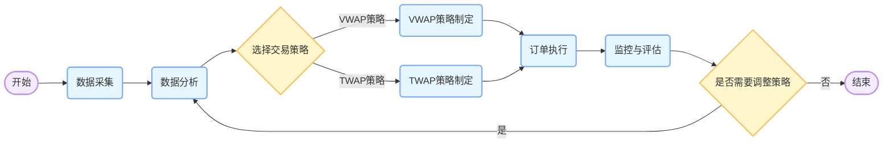

# 金融市场交易成本优化系统

> 关键词：金融市场、交易成本优化、算法原理、数学模型、项目实战

> 摘要：本文围绕金融市场交易成本优化系统展开深入探讨。首先介绍了该系统的背景信息，包括目的、预期读者、文档结构和相关术语。接着阐述了核心概念及其联系，给出了原理和架构的示意图与流程图。详细讲解了核心算法原理并通过Python代码展示，同时介绍了数学模型和公式。通过项目实战，从开发环境搭建到源代码实现及解读进行了详细说明。分析了该系统的实际应用场景，推荐了相关的学习资源、开发工具框架和论文著作。最后总结了未来发展趋势与挑战，并给出常见问题解答和扩展阅读参考资料，旨在为金融领域相关人员提供全面且深入的技术指导。

## 1. 背景介绍 
### 1.1 目的和范围
在金融市场中，交易成本是影响投资者收益的重要因素之一。交易成本不仅包括显性的佣金、手续费等，还包括隐性的市场冲击成本、延迟成本等。金融市场交易成本优化系统的目的在于通过一系列的算法和策略，降低投资者在交易过程中的总成本，提高投资回报率。

本系统的范围涵盖了股票、期货、外汇等多种金融市场。系统将从交易策略制定、订单执行等多个环节入手，分析并优化交易成本。通过对历史数据的分析和实时市场数据的监测，系统能够为投资者提供最优的交易方案。

### 1.2 预期读者
本文的预期读者主要包括金融市场的投资者、交易员、金融分析师、金融科技公司的技术人员以及对金融市场交易成本优化感兴趣的研究人员。对于投资者和交易员来说，了解该系统可以帮助他们降低交易成本，提高投资收益；对于金融分析师，该系统提供了一种新的分析工具和视角；对于金融科技公司的技术人员，本文的技术讲解和代码实现可以为他们开发类似系统提供参考；对于研究人员，本文可以为他们的研究提供理论和实践基础。

### 1.3 文档结构概述
本文将按照以下结构进行阐述：首先介绍金融市场交易成本优化系统的背景信息，包括目的、预期读者、文档结构和相关术语。接着详细讲解核心概念及其联系，通过文本示意图和Mermaid流程图展示系统的原理和架构。然后介绍核心算法原理，并使用Python源代码进行详细阐述，同时给出数学模型和公式，并通过举例进行说明。之后通过项目实战，介绍开发环境搭建、源代码实现和代码解读。分析该系统的实际应用场景，推荐相关的学习资源、开发工具框架和论文著作。最后总结未来发展趋势与挑战，给出常见问题解答和扩展阅读参考资料。

### 1.4 术语表
#### 1.4.1 核心术语定义
- **交易成本**：投资者在金融市场进行交易时所产生的各种费用，包括显性成本（如佣金、手续费）和隐性成本（如市场冲击成本、延迟成本）。
- **市场冲击成本**：当投资者进行大额交易时，由于交易指令对市场价格产生的影响而导致的额外成本。
- **延迟成本**：由于交易指令执行延迟而导致的成本，例如市场价格在延迟期间发生不利变化。
- **最优交易策略**：在考虑交易成本的情况下，能够使投资者获得最大收益的交易策略。

#### 1.4.2 相关概念解释
- **算法交易**：利用计算机算法自动生成和执行交易指令的交易方式，旨在降低交易成本、提高交易效率。
- **流动性**：金融市场中资产能够以合理价格快速买卖的能力。流动性越高，交易成本越低。
- **滑点**：交易执行价格与预期价格之间的差异，通常是由于市场流动性不足或交易延迟导致的。

#### 1.4.3 缩略词列表
- **VWAP**：Volume - Weighted Average Price，成交量加权平均价格。
- **TWAP**：Time - Weighted Average Price，时间加权平均价格。

## 2. 核心概念与联系 

### 核心概念原理
金融市场交易成本优化系统的核心原理是通过对交易成本的分析和建模，制定最优的交易策略，以降低交易总成本。系统主要考虑以下几个方面的因素：

- **市场数据**：包括价格、成交量、买卖价差等实时和历史数据。这些数据是分析市场流动性和交易成本的基础。
- **交易策略**：根据市场数据和投资者的目标，制定不同的交易策略。常见的交易策略包括VWAP策略、TWAP策略等。
- **成本模型**：建立交易成本模型，量化各种交易成本，如市场冲击成本、延迟成本等。通过成本模型，可以评估不同交易策略的成本效益。

### 架构的文本示意图
```plaintext
金融市场交易成本优化系统
|-- 数据采集模块
|   |-- 实时市场数据采集
|   |-- 历史市场数据采集
|-- 数据分析模块
|   |-- 市场流动性分析
|   |-- 交易成本分析
|-- 策略制定模块
|   |-- VWAP策略生成
|   |-- TWAP策略生成
|-- 订单执行模块
|   |-- 订单拆分
|   |-- 订单发送
|-- 监控与评估模块
|   |-- 交易过程监控
|   |-- 策略效果评估
```

### Mermaid流程图


## 3. 核心算法原理 & 具体操作步骤 

### VWAP策略原理
VWAP策略的目标是使交易执行价格接近成交量加权平均价格。具体原理如下：

- 计算VWAP：在一个给定的时间段内，将每个交易时刻的成交价格乘以该时刻的成交量，然后将所有乘积相加，再除以总成交量，得到VWAP。
- 交易执行：根据VWAP，将大订单拆分成多个小订单，在不同的时间点进行交易，以尽量使交易价格接近VWAP。

### Python代码实现
```python
import pandas as pd

def calculate_vwap(data):
    """
    计算VWAP
    :param data: 包含价格和成交量的DataFrame，列名为'price'和'volume'
    :return: VWAP值
    """
    total_volume = data['volume'].sum()
    price_volume_product = data['price'] * data['volume']
    vwap = price_volume_product.sum() / total_volume
    return vwap

# 示例数据
data = pd.DataFrame({
    'price': [100, 101, 102, 103],
    'volume': [1000, 2000, 3000, 4000]
})

vwap = calculate_vwap(data)
print(f"VWAP值为: {vwap}")
```

### TWAP策略原理
TWAP策略的目标是使交易执行价格接近时间加权平均价格。具体原理如下：

- 计算TWAP：在一个给定的时间段内，将每个交易时刻的成交价格相加，然后除以交易时刻的数量，得到TWAP。
- 交易执行：将大订单平均分配到不同的时间间隔内进行交易，以尽量使交易价格接近TWAP。

### Python代码实现
```python
def calculate_twap(data):
    """
    计算TWAP
    :param data: 包含价格的Series
    :return: TWAP值
    """
    twap = data.mean()
    return twap

# 示例数据
prices = pd.Series([100, 101, 102, 103])

twap = calculate_twap(prices)
print(f"TWAP值为: {twap}")
```

### 具体操作步骤
1. **数据采集**：从金融市场数据源获取实时和历史的价格、成交量等数据。
2. **数据分析**：根据采集到的数据，计算VWAP、TWAP等指标，分析市场流动性和交易成本。
3. **策略选择**：根据投资者的目标和市场情况，选择合适的交易策略（VWAP或TWAP）。
4. **订单拆分**：将大订单按照所选策略拆分成多个小订单。
5. **订单执行**：在不同的时间点发送小订单进行交易。
6. **监控与评估**：实时监控交易过程，评估策略的效果，根据评估结果调整策略。

## 4. 数学模型和公式 & 详细讲解 & 举例说明 

### VWAP数学模型
VWAP的计算公式为：
$$VWAP = \frac{\sum_{i = 1}^{n}P_iV_i}{\sum_{i = 1}^{n}V_i}$$
其中，$P_i$ 是第 $i$ 个交易时刻的成交价格，$V_i$ 是第 $i$ 个交易时刻的成交量，$n$ 是交易时刻的数量。

### 详细讲解
VWAP的计算是基于成交量加权的思想。成交量越大的交易时刻，其成交价格对VWAP的影响越大。通过使交易执行价格接近VWAP，可以减少市场冲击成本，因为在成交量大的时段进行交易，对市场价格的影响相对较小。

### 举例说明
假设有以下交易数据：
| 交易时刻 | 成交价格 ($P_i$) | 成交量 ($V_i$) |
| ---- | ---- | ---- |
| 1 | 100 | 1000 |
| 2 | 101 | 2000 |
| 3 | 102 | 3000 |
| 4 | 103 | 4000 |

则：
$\sum_{i = 1}^{4}P_iV_i = 100\times1000 + 101\times2000 + 102\times3000 + 103\times4000 = 100000 + 202000 + 306000 + 412000 = 1020000$
$\sum_{i = 1}^{4}V_i = 1000 + 2000 + 3000 + 4000 = 10000$

$VWAP = \frac{1020000}{10000} = 102$

### TWAP数学模型
TWAP的计算公式为：
$$TWAP = \frac{\sum_{i = 1}^{n}P_i}{n}$$
其中，$P_i$ 是第 $i$ 个交易时刻的成交价格，$n$ 是交易时刻的数量。

### 详细讲解
TWAP的计算是基于时间加权的思想，每个交易时刻的成交价格对TWAP的影响是相等的。通过将大订单平均分配到不同的时间间隔内进行交易，可以减少延迟成本，因为交易在时间上分布更加均匀。

### 举例说明
假设有以下成交价格：$P_1 = 100$，$P_2 = 101$，$P_3 = 102$，$P_4 = 103$，$n = 4$。

则：
$\sum_{i = 1}^{4}P_i = 100 + 101 + 102 + 103 = 406$
$TWAP = \frac{406}{4} = 101.5$

## 5. 项目实战：代码实际案例和详细解释说明 

### 5.1  开发环境搭建
#### 安装Python
首先，需要安装Python。可以从Python官方网站（https://www.python.org/downloads/）下载适合自己操作系统的Python版本。建议安装Python 3.7及以上版本。

#### 安装必要的库
使用以下命令安装必要的Python库：
```sh
pip install pandas numpy matplotlib
```
- `pandas`：用于数据处理和分析。
- `numpy`：用于数值计算。
- `matplotlib`：用于数据可视化。

### 5.2  源代码详细实现和代码解读
以下是一个完整的金融市场交易成本优化系统的Python代码示例：

```python
import pandas as pd
import numpy as np
import matplotlib.pyplot as plt

# 生成示例数据
def generate_sample_data():
    num_periods = 10
    prices = np.random.uniform(100, 110, num_periods)
    volumes = np.random.randint(1000, 2000, num_periods)
    data = pd.DataFrame({
        'price': prices,
        'volume': volumes
    })
    return data

# 计算VWAP
def calculate_vwap(data):
    total_volume = data['volume'].sum()
    price_volume_product = data['price'] * data['volume']
    vwap = price_volume_product.sum() / total_volume
    return vwap

# 计算TWAP
def calculate_twap(data):
    twap = data['price'].mean()
    return twap

# VWAP策略执行
def vwap_strategy(data, total_order_size):
    vwap = calculate_vwap(data)
    total_volume = data['volume'].sum()
    order_sizes = []
    for volume in data['volume']:
        order_size = total_order_size * (volume / total_volume)
        order_sizes.append(order_size)
    return order_sizes

# TWAP策略执行
def twap_strategy(data, total_order_size):
    num_periods = len(data)
    order_size_per_period = total_order_size / num_periods
    order_sizes = [order_size_per_period] * num_periods
    return order_sizes

# 主函数
def main():
    data = generate_sample_data()
    total_order_size = 10000

    # 计算VWAP和TWAP
    vwap = calculate_vwap(data)
    twap = calculate_twap(data)
    print(f"VWAP: {vwap}")
    print(f"TWAP: {twap}")

    # 执行VWAP策略
    vwap_order_sizes = vwap_strategy(data, total_order_size)
    print("VWAP策略订单拆分:", vwap_order_sizes)

    # 执行TWAP策略
    twap_order_sizes = twap_strategy(data, total_order_size)
    print("TWAP策略订单拆分:", twap_order_sizes)

    # 可视化订单拆分
    plt.figure(figsize=(12, 6))
    plt.subplot(1, 2, 1)
    plt.bar(range(len(vwap_order_sizes)), vwap_order_sizes)
    plt.title('VWAP策略订单拆分')
    plt.xlabel('交易时刻')
    plt.ylabel('订单大小')

    plt.subplot(1, 2, 2)
    plt.bar(range(len(twap_order_sizes)), twap_order_sizes)
    plt.title('TWAP策略订单拆分')
    plt.xlabel('交易时刻')
    plt.ylabel('订单大小')

    plt.show()

if __name__ == "__main__":
    main()
```

### 5.3  代码解读与分析
#### 数据生成
`generate_sample_data` 函数用于生成示例的价格和成交量数据。使用 `numpy` 库生成随机的价格和成交量数据，并将其存储在 `pandas` 的 `DataFrame` 中。

#### 成本计算
`calculate_vwap` 函数根据VWAP的计算公式计算VWAP值。`calculate_twap` 函数根据TWAP的计算公式计算TWAP值。

#### 策略执行
`vwap_strategy` 函数根据VWAP策略将总订单拆分成多个小订单。每个小订单的大小根据该时刻的成交量占总成交量的比例来确定。`twap_strategy` 函数根据TWAP策略将总订单平均分配到每个交易时刻。

#### 主函数
`main` 函数是程序的入口点。首先生成示例数据，然后计算VWAP和TWAP值。接着分别执行VWAP和TWAP策略，并打印订单拆分结果。最后使用 `matplotlib` 库将订单拆分结果可视化。

## 6. 实际应用场景 
### 机构投资者
对于大型机构投资者，如基金公司、保险公司等，他们通常需要进行大额交易。交易成本的优化对于他们来说至关重要。金融市场交易成本优化系统可以帮助他们制定最优的交易策略，降低交易成本，提高投资收益。例如，基金公司在进行股票投资时，可以使用VWAP或TWAP策略将大额订单拆分成多个小订单，减少市场冲击成本。

### 高频交易公司
高频交易公司通过快速的交易策略获取微小的利润。交易成本的微小变化可能会对他们的收益产生重大影响。该系统可以帮助高频交易公司优化交易策略，减少延迟成本和滑点成本。例如，高频交易公司可以根据实时市场数据，动态调整交易策略，以适应市场变化。

### 金融科技公司
金融科技公司可以将该系统集成到自己的交易平台中，为客户提供更优质的交易服务。通过降低客户的交易成本，提高客户的满意度和忠诚度。例如，一些在线证券交易平台可以使用该系统为客户提供智能交易策略，帮助客户优化交易成本。

## 7. 工具和资源推荐
### 7.1 学习资源推荐
#### 7.1.1 书籍推荐
- 《算法交易：金融工程和投资管理的新前沿》：介绍了算法交易的基本原理、策略和技术，对金融市场交易成本优化有深入的探讨。
- 《金融市场的计量经济学》：涵盖了金融市场数据的分析方法和模型，对于理解交易成本的数学模型和公式有很大帮助。

#### 7.1.2 在线课程
- Coursera上的“金融市场与投资”课程：系统地介绍了金融市场的基本概念、投资策略和风险管理，其中包括交易成本的相关内容。
- edX上的“算法交易与量化策略”课程：详细讲解了算法交易的原理、策略和实现方法，适合对金融市场交易成本优化感兴趣的学习者。

#### 7.1.3 技术博客和网站
- QuantNet：一个专注于量化金融领域的社区，提供了大量的技术文章、论坛讨论和招聘信息，对于了解金融市场交易成本优化的最新技术和趋势有很大帮助。
- Seeking Alpha：一个金融市场分析和投资建议的网站，包含了许多关于交易成本优化的文章和研究报告。

### 7.2 开发工具框架推荐
#### 7.2.1 IDE和编辑器
- PyCharm：一款专业的Python集成开发环境，提供了丰富的代码编辑、调试和分析功能，适合开发金融市场交易成本优化系统。
- Jupyter Notebook：一个交互式的开发环境，支持Python代码的编写、运行和可视化，方便进行数据探索和算法验证。

#### 7.2.2 调试和性能分析工具
- Py-Spy：一个用于分析Python程序性能的工具，可以帮助开发者找出程序中的性能瓶颈。
- PDB：Python自带的调试器，用于调试Python代码，定位和解决程序中的错误。

#### 7.2.3 相关框架和库
- Zipline：一个用于算法交易的Python框架，提供了回测和实盘交易的功能，方便开发者快速实现交易策略。
- TA-Lib：一个技术分析库，提供了各种技术指标的计算函数，可用于金融市场数据的分析。

### 7.3 相关论文著作推荐
#### 7.3.1 经典论文
- Almgren, R., & Chriss, N. (2001). Optimal execution of portfolio transactions. The Journal of Risk, 3(2), 5-39. 该论文提出了一种优化投资组合交易执行的方法，对交易成本的优化有重要的理论贡献。
- Bertsimas, D., & Lo, A. W. (1998). Optimal control of execution costs. The Journal of Financial Markets, 1(1), 1-50. 研究了交易执行成本的最优控制问题，为交易成本优化提供了理论基础。

#### 7.3.2 最新研究成果
- 在顶级金融学术期刊如《Journal of Finance》《Review of Financial Studies》上，经常会发表关于金融市场交易成本优化的最新研究成果。可以通过学术数据库如EBSCOhost、JSTOR等获取这些论文。

#### 7.3.3 应用案例分析
- 一些金融机构和咨询公司会发布关于交易成本优化的应用案例分析报告。例如，麦肯锡公司的一些报告会分析不同行业和机构在交易成本优化方面的实践经验和效果。

## 8. 总结：未来发展趋势与挑战
### 未来发展趋势
#### 智能化与自动化
随着人工智能和机器学习技术的不断发展，金融市场交易成本优化系统将越来越智能化和自动化。系统可以通过学习历史数据和实时市场数据，自动调整交易策略，以适应不同的市场环境。例如，使用深度学习算法预测市场价格走势，从而优化交易时机和订单拆分策略。

#### 多市场融合
未来的交易成本优化系统将不仅仅局限于单一的金融市场，而是会融合股票、期货、外汇等多个市场。通过跨市场的交易策略，可以进一步降低交易成本，提高投资收益。例如，利用不同市场之间的套利机会，进行跨市场交易。

#### 个性化服务
系统将为不同的投资者提供个性化的交易成本优化方案。根据投资者的风险偏好、投资目标和交易习惯，定制适合他们的交易策略。例如，对于风险偏好较高的投资者，可以提供更激进的交易策略；对于风险偏好较低的投资者，可以提供更保守的交易策略。

### 挑战
#### 数据质量和隐私问题
金融市场交易成本优化系统依赖于大量的市场数据和投资者数据。数据的质量和准确性直接影响系统的性能和决策效果。同时，数据隐私问题也越来越受到关注。如何在保证数据质量的前提下，保护投资者的隐私，是系统面临的一个重要挑战。

#### 市场复杂性和不确定性
金融市场具有高度的复杂性和不确定性。市场价格受到多种因素的影响，如宏观经济数据、政策变化、突发事件等。这些因素使得市场价格难以预测，增加了交易成本优化的难度。系统需要具备强大的抗干扰能力和自适应能力，以应对市场的变化。

#### 技术更新换代快
金融科技领域的技术更新换代非常快。新的算法、模型和工具不断涌现。系统需要及时跟进技术发展，不断进行升级和优化，以保持竞争力。同时，技术的快速发展也对开发者的技术水平提出了更高的要求。

## 9. 附录：常见问题与解答
### 问题1：VWAP和TWAP策略哪个更好？
答：VWAP和TWAP策略各有优缺点，适用于不同的市场情况和投资者需求。VWAP策略更注重成交量加权，适合在成交量较大的时段进行交易，能够减少市场冲击成本。TWAP策略更注重时间加权，适合在时间上均匀分布交易，能够减少延迟成本。在市场流动性较好的情况下，VWAP策略可能更有效；在市场流动性较差或价格波动较大的情况下，TWAP策略可能更合适。

### 问题2：如何评估交易成本优化系统的效果？
答：可以从以下几个方面评估交易成本优化系统的效果：
- 交易成本降低程度：比较使用系统前后的交易成本，包括显性成本和隐性成本的变化。
- 投资收益提高程度：比较使用系统前后的投资收益，评估系统对投资回报率的影响。
- 策略执行偏差：评估实际交易执行价格与预期价格之间的偏差，偏差越小，说明系统的执行效果越好。

### 问题3：系统能否适应不同的金融市场？
答：系统可以通过调整参数和策略，适应不同的金融市场。不同的金融市场具有不同的特点，如交易规则、流动性、价格波动等。系统需要根据这些特点进行相应的调整，以实现最优的交易成本优化效果。例如，在外汇市场中，系统需要考虑汇率波动和交易时间的特殊性；在期货市场中，系统需要考虑合约到期和保证金要求等因素。

## 10. 扩展阅读 & 参考资料
### 扩展阅读
- 《金融科技：重塑金融未来》：介绍了金融科技的发展趋势和应用场景，对于了解金融市场交易成本优化系统在金融科技领域的地位和作用有帮助。
- 《量化投资：策略与技术》：深入探讨了量化投资的策略和技术，包括交易成本优化的相关内容。

### 参考资料
- [Python官方文档](https://docs.python.org/3/)
- [Pandas官方文档](https://pandas.pydata.org/docs/)
- [Numpy官方文档](https://numpy.org/doc/)
- [Matplotlib官方文档](https://matplotlib.org/stable/contents.html)

作者：AI天才研究院/AI Genius Institute & 禅与计算机程序设计艺术 /Zen And The Art of Computer Programming