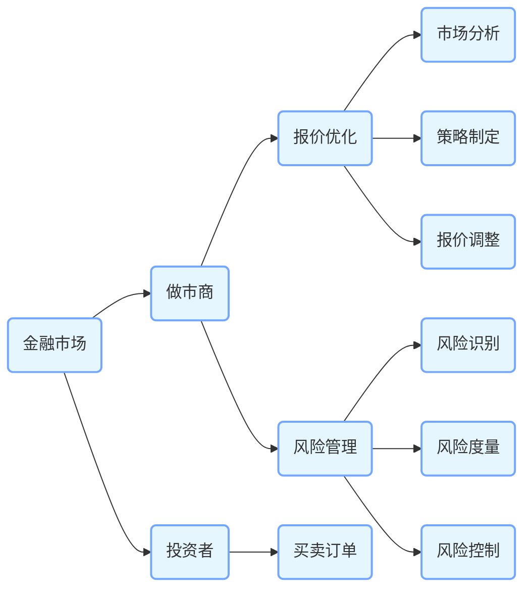

# 金融市场做市商报价优化与风险管理

> 关键词：金融市场、做市商、报价优化、风险管理、算法交易

> 摘要：本文围绕金融市场做市商的报价优化与风险管理展开深入探讨。首先介绍了做市商在金融市场中的重要作用以及研究报价优化和风险管理的目的与范围。详细阐述了做市商报价和风险管理的核心概念、原理及架构，通过Python代码对核心算法进行了原理讲解和步骤说明。同时给出了相关的数学模型和公式，并举例说明其应用。通过项目实战展示了开发环境搭建、源代码实现及代码解读。分析了做市商报价优化与风险管理在不同金融场景中的实际应用，推荐了学习资源、开发工具框架和相关论文著作。最后总结了未来发展趋势与挑战，并对常见问题进行了解答。

## 1. 背景介绍 
### 1.1 目的和范围
做市商在金融市场中扮演着至关重要的角色，他们为市场提供流动性，促进交易的顺利进行。报价优化的目的在于使做市商在满足市场需求的同时，实现自身利润的最大化。风险管理则是确保做市商在市场波动中能够控制风险，避免重大损失。本文的范围涵盖了股票、期货、外汇等主要金融市场，重点研究做市商在这些市场中的报价策略和风险管理方法。

### 1.2 预期读者
本文预期读者包括金融市场从业者，如做市商、交易员、风险管理人员等；金融科技领域的开发者和研究人员；以及对金融市场算法交易和风险管理感兴趣的学者和学生。

### 1.3 文档结构概述
本文首先介绍了做市商报价优化与风险管理的背景信息，包括目的、预期读者和文档结构。接着阐述了核心概念与联系，通过示意图和流程图进行说明。然后详细讲解了核心算法原理和具体操作步骤，并给出了Python代码示例。之后介绍了相关的数学模型和公式，并举例说明。通过项目实战展示了代码的实际应用和解读。分析了实际应用场景，推荐了相关的工具和资源。最后总结了未来发展趋势与挑战，解答了常见问题，并提供了扩展阅读和参考资料。

### 1.4 术语表
#### 1.4.1 核心术语定义
- **做市商**：是指在金融市场上，不断向公众投资者报出某些特定证券的买卖价格（即双向报价），并在该价位上接受公众投资者的买卖要求，以其自有资金和证券与投资者进行证券交易的金融机构。
- **报价优化**：做市商通过调整买卖报价，以达到提高利润、增强市场竞争力和满足监管要求等目标的过程。
- **风险管理**：识别、评估和应对金融市场中的各种风险，以确保做市商的财务稳定和业务可持续性。
- **买卖价差**：做市商报出的买入价和卖出价之间的差额，是做市商的主要收入来源之一。

#### 1.4.2 相关概念解释
- **流动性**：金融市场中资产能够以合理价格快速买卖的能力。做市商通过提供买卖报价，增加了市场的流动性。
- **市场冲击**：做市商的交易行为对市场价格产生的影响。大规模的买卖订单可能导致市场价格大幅波动。
- **风险暴露**：做市商在金融市场中面临的潜在风险程度，通常与持仓头寸、市场波动等因素有关。

#### 1.4.3 缩略词列表
- **VaR**：Value at Risk，风险价值，是一种衡量金融风险的指标，表示在一定的置信水平和持有期内，投资组合可能遭受的最大损失。
- **PnL**：Profit and Loss，损益，指做市商在交易过程中的盈利或亏损情况。

## 2. 核心概念与联系 
### 核心概念原理
做市商的主要职责是提供连续的买卖报价，以促进市场的流动性。其报价策略基于对市场供求关系、资产价格波动、自身成本和风险承受能力等因素的综合考虑。报价优化的核心在于平衡买卖价差和订单执行概率，以实现利润最大化。

风险管理则是做市商确保自身生存和发展的关键。做市商面临着多种风险，如市场风险、信用风险、操作风险等。通过合理的风险度量和控制方法，做市商可以降低风险暴露，避免因市场波动而导致的重大损失。

### 架构的文本示意图
```plaintext
金融市场
|
|-- 做市商
|   |-- 报价优化
|   |   |-- 市场分析
|   |   |-- 策略制定
|   |   |-- 报价调整
|   |
|   |-- 风险管理
|       |-- 风险识别
|       |-- 风险度量
|       |-- 风险控制
|
|-- 投资者
|   |-- 买卖订单
```

### Mermaid 流程图


## 3. 核心算法原理 & 具体操作步骤 
### 核心算法原理
做市商报价优化的一种常见算法是基于市场微观结构理论的动态报价算法。该算法根据市场的实时信息，如订单簿深度、交易活跃度等，动态调整买卖报价。

假设做市商的目标是最大化其长期平均利润，利润函数可以表示为：

$$ \text{Profit} = \text{Volume} \times \text{Spread} - \text{Cost} - \text{RiskPenalty} $$

其中，$\text{Volume}$ 是交易成交量，$\text{Spread}$ 是买卖价差，$\text{Cost}$ 是交易成本，$\text{RiskPenalty}$ 是风险惩罚项。

### 具体操作步骤
1. **市场分析**：收集市场数据，包括资产价格、订单簿信息、交易历史等。分析市场趋势、流动性状况和波动性。
2. **策略制定**：根据市场分析结果，确定报价策略。例如，可以采用固定价差策略、动态价差策略或基于机器学习的策略。
3. **报价调整**：根据市场变化实时调整买卖报价。当市场流动性降低时，适当扩大买卖价差；当市场波动性增加时，增加风险惩罚项。

### Python 源代码示例
```python
import numpy as np

# 模拟市场数据
class MarketData:
    def __init__(self):
        self.mid_price = 100.0
        self.spread = 0.5
        self.volume = 100
        self.volatility = 0.1

    def update(self):
        # 模拟价格波动
        self.mid_price += np.random.normal(0, self.volatility)
        # 模拟流动性变化
        self.volume = int(self.volume * (1 + np.random.uniform(-0.1, 0.1)))

# 做市商类
class MarketMaker:
    def __init__(self):
        self.market_data = MarketData()
        self.bid_price = self.market_data.mid_price - self.market_data.spread / 2
        self.ask_price = self.market_data.mid_price + self.market_data.spread / 2

    def update_quote(self):
        # 根据市场数据更新报价
        self.market_data.update()
        if self.market_data.volume < 80:
            # 流动性降低，扩大价差
            self.market_data.spread *= 1.1
        elif self.market_data.volume > 120:
            # 流动性增加，缩小价差
            self.market_data.spread *= 0.9

        self.bid_price = self.market_data.mid_price - self.market_data.spread / 2
        self.ask_price = self.market_data.mid_price + self.market_data.spread / 2

    def print_quote(self):
        print(f"Bid: {self.bid_price}, Ask: {self.ask_price}")

# 主程序
if __name__ == "__main__":
    market_maker = MarketMaker()
    for i in range(10):
        market_maker.update_quote()
        market_maker.print_quote()
```

## 4. 数学模型和公式 & 详细讲解 & 举例说明 
### 买卖价差模型
做市商的买卖价差可以通过以下公式表示：

$$ S = c + \lambda \sigma + \theta I $$

其中，$S$ 是买卖价差，$c$ 是固定成本，$\lambda$ 是流动性调整系数，$\sigma$ 是市场波动率，$\theta$ 是信息不对称调整系数，$I$ 是信息不对称程度。

固定成本 $c$ 包括交易手续费、清算费用等。流动性调整系数 $\lambda$ 反映了市场流动性对价差的影响，当市场流动性降低时，$\lambda$ 增大，价差扩大。市场波动率 $\sigma$ 衡量了资产价格的波动程度，波动率越高，价差越大。信息不对称调整系数 $\theta$ 和信息不对称程度 $I$ 考虑了做市商与投资者之间的信息差异，信息不对称程度越高，价差越大。

### 风险价值（VaR）模型
风险价值（VaR）是一种常用的风险度量指标，用于衡量在一定的置信水平和持有期内，投资组合可能遭受的最大损失。

假设投资组合的收益率 $R$ 服从正态分布 $N(\mu, \sigma^2)$，则在置信水平 $1 - \alpha$ 下的 VaR 可以表示为：

$$ \text{VaR} = z_{\alpha} \sigma \sqrt{T} V $$

其中，$z_{\alpha}$ 是标准正态分布的 $\alpha$ 分位数，$\sigma$ 是投资组合的波动率，$T$ 是持有期，$V$ 是投资组合的价值。

### 举例说明
假设做市商持有一个价值为 $100000$ 美元的投资组合，其收益率的波动率为 $0.2$，持有期为 1 天，置信水平为 95%。

首先，查找标准正态分布的 5% 分位数 $z_{0.05} \approx -1.645$。

然后，计算 VaR：

$$ \text{VaR} = 1.645 \times 0.2 \times \sqrt{1} \times 100000 = 32900 $$

这意味着在 95% 的置信水平下，做市商在 1 天内可能遭受的最大损失为 $32900$ 美元。

## 5. 项目实战：代码实际案例和详细解释说明 
### 5.1  开发环境搭建
- **操作系统**：可以选择 Windows、Linux 或 macOS。
- **编程语言**：Python 3.x
- **开发工具**：推荐使用 Anaconda 作为 Python 环境管理工具，使用 PyCharm 作为集成开发环境（IDE）。
- **第三方库**：需要安装 `numpy`、`pandas`、`matplotlib` 等库，用于数据处理和可视化。可以使用以下命令进行安装：
```bash
pip install numpy pandas matplotlib
```

### 5.2  源代码详细实现和代码解读
```python
import numpy as np
import pandas as pd
import matplotlib.pyplot as plt

# 模拟市场数据生成函数
def generate_market_data(num_periods):
    mid_prices = [100.0]
    spreads = [0.5]
    volumes = [100]
    for i in range(1, num_periods):
        # 模拟价格波动
        mid_price = mid_prices[i - 1] + np.random.normal(0, 0.1)
        mid_prices.append(mid_price)

        # 模拟流动性变化
        volume = int(volumes[i - 1] * (1 + np.random.uniform(-0.1, 0.1)))
        volumes.append(volume)

        # 根据流动性调整价差
        if volume < 80:
            spread = spreads[i - 1] * 1.1
        elif volume > 120:
            spread = spreads[i - 1] * 0.9
        else:
            spread = spreads[i - 1]
        spreads.append(spread)

    data = pd.DataFrame({
        'mid_price': mid_prices,
        'spread': spreads,
        'volume': volumes
    })
    return data

# 做市商类
class MarketMaker:
    def __init__(self, market_data):
        self.market_data = market_data
        self.bid_prices = []
        self.ask_prices = []

    def generate_quotes(self):
        for i in range(len(self.market_data)):
            mid_price = self.market_data['mid_price'][i]
            spread = self.market_data['spread'][i]
            bid_price = mid_price - spread / 2
            ask_price = mid_price + spread / 2
            self.bid_prices.append(bid_price)
            self.ask_prices.append(ask_price)

        return self.bid_prices, self.ask_prices

# 主程序
if __name__ == "__main__":
    num_periods = 100
    market_data = generate_market_data(num_periods)

    market_maker = MarketMaker(market_data)
    bid_prices, ask_prices = market_maker.generate_quotes()

    # 可视化报价数据
    plt.figure(figsize=(12, 6))
    plt.plot(market_data['mid_price'], label='Mid Price')
    plt.plot(bid_prices, label='Bid Price')
    plt.plot(ask_prices, label='Ask Price')
    plt.xlabel('Period')
    plt.ylabel('Price')
    plt.title('Market Maker Quotes')
    plt.legend()
    plt.show()
```

### 代码解读与分析
1. **市场数据生成**：`generate_market_data` 函数模拟了市场数据的生成过程，包括中间价格、买卖价差和交易量。价格通过随机游走模型进行模拟，交易量根据随机变化进行调整，价差根据交易量进行动态调整。
2. **做市商类**：`MarketMaker` 类根据市场数据生成买卖报价。`generate_quotes` 方法遍历市场数据，计算每个时期的买卖报价，并将其存储在 `bid_prices` 和 `ask_prices` 列表中。
3. **可视化**：使用 `matplotlib` 库将中间价格、买卖报价进行可视化，方便观察报价的变化情况。

## 6. 实际应用场景 
### 股票市场
在股票市场中，做市商为股票提供连续的买卖报价，增加了市场的流动性。做市商通过优化报价策略，吸引更多的投资者进行交易，从而提高自身的利润。同时，做市商需要对股票价格波动、市场流动性等风险进行管理，避免因市场变化而导致的损失。

### 期货市场
期货市场的做市商为期货合约提供报价，促进期货交易的活跃。由于期货市场具有高杠杆和高风险性，做市商需要更加精确地进行报价优化和风险管理。例如，做市商需要根据期货合约的到期时间、标的资产价格波动等因素调整报价，同时使用风险度量工具对持仓风险进行监控。

### 外汇市场
外汇市场是全球最大的金融市场之一，做市商在外汇市场中扮演着重要的角色。做市商通过提供外汇买卖报价，满足投资者的交易需求。外汇市场的波动性较大，做市商需要密切关注汇率变化、宏观经济数据等因素，及时调整报价和风险管理策略。

## 7. 工具和资源推荐
### 7.1 学习资源推荐
#### 7.1.1 书籍推荐
- 《金融市场微观结构理论》：介绍了金融市场的微观结构和做市商的行为，是研究做市商报价和风险管理的经典书籍。
- 《期权、期货及其他衍生品》：详细讲解了金融衍生品的定价和风险管理，对于理解做市商在衍生品市场中的操作有很大帮助。
- 《Python 金融数据分析与挖掘实战》：介绍了如何使用 Python 进行金融数据处理、分析和建模，是学习金融编程的实用书籍。

#### 7.1.2 在线课程
- Coursera 上的“金融市场与投资策略”课程：由知名教授授课，涵盖了金融市场的基本原理、投资策略和风险管理等内容。
- edX 上的“Python 金融分析”课程：通过实际案例讲解如何使用 Python 进行金融数据分析和建模。

#### 7.1.3 技术博客和网站
- QuantNet：是一个专注于量化金融领域的社区，提供了大量的技术文章、论坛讨论和招聘信息。
- Seeking Alpha：是一个金融投资网站，提供了股票、基金、债券等金融产品的分析和评论。

### 7.2 开发工具框架推荐
#### 7.2.1 IDE和编辑器
- PyCharm：是一款专业的 Python 集成开发环境，具有代码编辑、调试、版本控制等功能，适合开发复杂的金融算法。
- Jupyter Notebook：是一个交互式的开发环境，支持 Python、R 等多种编程语言，适合进行数据探索和模型验证。

#### 7.2.2 调试和性能分析工具
- PDB：是 Python 自带的调试工具，可以帮助开发者定位代码中的错误。
- cProfile：是 Python 的性能分析工具，可以分析代码的运行时间和函数调用情况，帮助优化代码性能。

#### 7.2.3 相关框架和库
- NumPy：是 Python 的科学计算库，提供了高效的数组操作和数学函数，是金融数据分析的基础库。
- Pandas：是 Python 的数据处理库，提供了数据结构和数据分析工具，方便处理和分析金融数据。
- Scikit-learn：是 Python 的机器学习库，提供了各种机器学习算法和工具，可用于做市商的报价策略优化和风险管理。

### 7.3 相关论文著作推荐
#### 7.3.1 经典论文
- "The Economics of Dealer Markets: Making a Market with Inventory" by Larry Glosten and Paul Milgrom：该论文建立了做市商库存模型，分析了做市商的报价行为和市场流动性。
- "Market Microstructure and Asset Pricing: On the Compensation for Illiquidity in Stock Returns" by Yakov Amihud and Haim Mendelson：研究了市场微观结构对资产定价的影响，特别是流动性对股票收益率的补偿作用。

#### 7.3.2 最新研究成果
- 近年来，随着人工智能和机器学习技术的发展，越来越多的研究将这些技术应用于做市商的报价优化和风险管理。例如，使用深度学习模型预测市场价格走势，使用强化学习算法优化报价策略。

#### 7.3.3 应用案例分析
- 一些金融机构和研究机构会发布做市商报价优化和风险管理的应用案例分析报告，这些报告可以帮助读者了解实际应用中的问题和解决方案。

## 8. 总结：未来发展趋势与挑战
### 未来发展趋势
- **智能化**：随着人工智能和机器学习技术的不断发展，做市商将越来越多地使用智能化的报价策略和风险管理方法。例如，使用深度学习模型预测市场价格走势，使用强化学习算法优化报价策略。
- **全球化**：金融市场的全球化趋势将继续加强，做市商需要在全球范围内进行报价和风险管理。这将要求做市商具备更强的跨市场分析和风险控制能力。
- **合规化**：监管机构对做市商的监管将越来越严格，做市商需要遵守更多的法规和规范。例如，要求做市商提高市场透明度，加强风险管理等。

### 挑战
- **数据质量和安全**：智能化的报价和风险管理方法需要大量的高质量数据支持。同时，数据安全也是一个重要的问题，做市商需要保护客户信息和交易数据的安全。
- **模型风险**：人工智能和机器学习模型存在一定的风险，如过拟合、模型失效等。做市商需要对模型进行严格的验证和监控，确保模型的可靠性和有效性。
- **竞争压力**：随着金融科技的发展，越来越多的机构进入做市商领域，市场竞争将更加激烈。做市商需要不断创新和提高自身的竞争力，以适应市场的变化。

## 9. 附录：常见问题与解答
### 做市商的报价是如何确定的？
做市商的报价通常基于市场供求关系、资产价格波动、自身成本和风险承受能力等因素。做市商通过分析市场数据，制定报价策略，并根据市场变化实时调整报价。

### 做市商面临哪些风险？
做市商面临着多种风险，如市场风险、信用风险、操作风险等。市场风险是指由于市场价格波动导致的损失风险；信用风险是指交易对手违约的风险；操作风险是指由于内部管理不善或技术故障导致的风险。

### 如何衡量做市商的风险管理效果？
可以使用多种指标来衡量做市商的风险管理效果，如风险价值（VaR）、损益波动率等。风险价值（VaR）可以衡量在一定的置信水平和持有期内，投资组合可能遭受的最大损失；损益波动率可以衡量做市商的损益波动程度。

### 做市商的报价优化和风险管理有什么关系？
报价优化和风险管理是相互关联的。合理的报价策略可以降低做市商的风险暴露，同时提高利润。例如，通过扩大买卖价差可以增加利润，但也可能降低订单执行概率，增加库存风险。因此，做市商需要在报价优化和风险管理之间找到平衡。

## 10. 扩展阅读 & 参考资料
- 《金融计量学》：进一步深入学习金融数据的计量分析方法。
- 《高频交易》：了解高频交易环境下做市商的报价和风险管理策略。
- 相关金融学术期刊，如《Journal of Financial Economics》、《Review of Financial Studies》等，可获取最新的研究成果。

作者：AI天才研究院/AI Genius Institute & 禅与计算机程序设计艺术 /Zen And The Art of Computer Programming