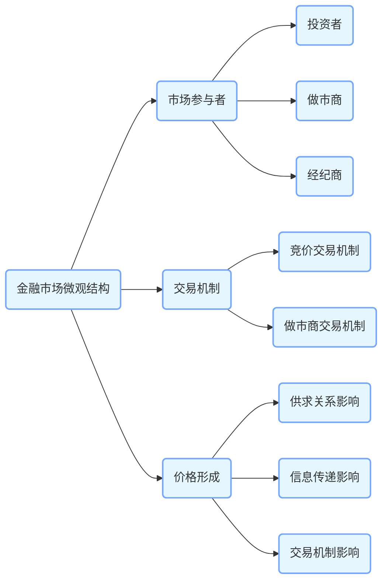

# 金融市场微观结构分析

> 关键词：金融市场微观结构、交易机制、价格形成、信息传递、市场流动性

> 摘要：本文围绕金融市场微观结构展开深入分析。首先介绍了金融市场微观结构的研究背景、目的、预期读者等内容。接着阐述了核心概念与联系，包括市场参与者、交易机制等，并通过示意图和流程图展示其架构。详细讲解了核心算法原理，如做市商定价算法，给出Python代码示例。同时介绍了相关数学模型和公式，如市场深度模型。在项目实战部分，搭建开发环境，实现并解读代码。探讨了金融市场微观结构在高频交易、风险管理等方面的实际应用场景。推荐了学习资源、开发工具框架以及相关论文著作。最后总结了未来发展趋势与挑战，并提供常见问题解答和扩展阅读参考资料。

## 1. 背景介绍 
### 1.1 目的和范围
金融市场微观结构分析的主要目的是深入理解金融市场中交易的具体过程和机制，揭示价格形成的微观基础，以及市场参与者的行为如何影响市场的流动性、稳定性和效率。其研究范围涵盖了各种金融市场，如股票市场、债券市场、期货市场、外汇市场等，以及不同的交易机制，如竞价交易机制、做市商交易机制等。通过对金融市场微观结构的研究，可以为投资者制定交易策略、监管机构制定政策提供理论支持和实践指导。

### 1.2 预期读者
本文预期读者包括金融领域的从业者，如交易员、分析师、投资经理等，他们可以通过本文了解金融市场微观结构的原理和方法，从而优化交易策略和风险管理。同时，也适合金融专业的学生和研究人员，帮助他们深入学习金融市场的运行机制，开展相关的学术研究。此外，对金融市场感兴趣的普通投资者也可以通过本文增进对市场的理解，提高投资决策的科学性。

### 1.3 文档结构概述
本文将按照以下结构进行阐述：首先介绍金融市场微观结构的背景知识，包括目的、预期读者和文档结构概述等内容。接着详细讲解核心概念与联系，通过文本示意图和Mermaid流程图展示其架构。然后介绍核心算法原理和具体操作步骤，并用Python代码进行详细阐述。随后讲解相关的数学模型和公式，并举例说明。在项目实战部分，将搭建开发环境，实现代码并进行解读。探讨金融市场微观结构的实际应用场景。推荐学习资源、开发工具框架和相关论文著作。最后总结未来发展趋势与挑战，提供常见问题解答和扩展阅读参考资料。

### 1.4 术语表
#### 1.4.1 核心术语定义
- **金融市场微观结构**：指金融市场中交易的具体制度安排和交易机制，包括市场参与者、交易规则、交易指令类型等，它研究的是金融资产交易过程中的微观层面的细节。
- **交易机制**：是指金融市场中进行交易的方式和规则，主要包括竞价交易机制和做市商交易机制。竞价交易机制是指买卖双方通过公开竞价的方式确定交易价格；做市商交易机制是指由做市商提供买卖报价，投资者根据做市商的报价进行交易。
- **价格形成**：是指金融资产的交易价格是如何在市场中确定的过程，它受到市场供求关系、信息传递、交易机制等多种因素的影响。
- **市场流动性**：是指金融资产在市场中能够以合理价格快速买卖的能力，它反映了市场的活跃程度和交易成本的高低。

#### 1.4.2 相关概念解释
- **订单簿**：是指记录市场中所有未成交订单的列表，它包含了订单的价格、数量和买卖方向等信息。订单簿是市场价格形成和交易执行的重要基础。
- **买卖价差**：是指做市商提供的买入价和卖出价之间的差额，它是做市商的主要收入来源，同时也反映了市场的交易成本。
- **市场深度**：是指在一定价格范围内市场能够承受的交易量，它反映了市场的流动性和稳定性。

#### 1.4.3 缩略词列表
- **HFT**：High Frequency Trading，高频交易，是指利用计算机技术和算法，在极短的时间内进行大量交易的交易策略。
- **VWAP**：Volume - Weighted Average Price，成交量加权平均价格，是一种常用的交易成本衡量指标。
- **LOB**：Limit Order Book，限价订单簿，是订单簿的一种常见形式，记录了市场中所有限价订单的信息。

## 2. 核心概念与联系 

### 核心概念原理
金融市场微观结构主要涉及三个核心概念：市场参与者、交易机制和价格形成。

#### 市场参与者
市场参与者包括投资者、做市商、经纪商等。投资者是金融资产的买卖者，他们根据自己的投资目标和市场预期进行交易决策。做市商是金融市场中的重要参与者，他们通过提供买卖报价，为市场提供流动性。经纪商则是投资者和市场之间的中介，他们帮助投资者执行交易指令。

#### 交易机制
交易机制是金融市场中进行交易的方式和规则，主要包括竞价交易机制和做市商交易机制。在竞价交易机制中，买卖双方通过公开竞价的方式确定交易价格，交易按照价格优先、时间优先的原则进行。在做市商交易机制中，做市商提供买卖报价，投资者根据做市商的报价进行交易，做市商通过买卖价差获取利润。

#### 价格形成
价格形成是金融市场微观结构的核心问题之一。金融资产的价格受到市场供求关系、信息传递、交易机制等多种因素的影响。在市场中，投资者根据自己掌握的信息和对市场的预期进行交易决策，这些交易决策会影响市场的供求关系，从而影响价格的形成。

### 架构的文本示意图
```plaintext
金融市场微观结构
|-- 市场参与者
|   |-- 投资者
|   |-- 做市商
|   |-- 经纪商
|-- 交易机制
|   |-- 竞价交易机制
|   |-- 做市商交易机制
|-- 价格形成
|   |-- 供求关系影响
|   |-- 信息传递影响
|   |-- 交易机制影响
```

### Mermaid流程图


## 3. 核心算法原理 & 具体操作步骤 

### 做市商定价算法原理
做市商的主要职责是提供买卖报价，其定价算法需要考虑多个因素，如市场供求关系、自身库存、交易成本等。一种常见的做市商定价算法是基于库存控制的定价算法。

做市商的目标是通过合理定价来平衡自身的库存，避免库存过多或过少带来的风险。假设做市商的库存为 $q$，市场的均衡价格为 $p_0$，做市商的买入价为 $p_b$，卖出价为 $p_a$。做市商可以根据库存情况调整买卖报价：

当库存 $q > 0$ 时，做市商希望卖出库存，因此会降低卖出价 $p_a$，提高买入价 $p_b$，以吸引投资者买入和减少投资者卖出。

当库存 $q < 0$ 时，做市商希望补充库存，因此会提高卖出价 $p_a$，降低买入价 $p_b$，以吸引投资者卖出和减少投资者买入。

### Python 代码实现
```python
import numpy as np

class MarketMaker:
    def __init__(self, initial_inventory=0, equilibrium_price=100, spread=2):
        self.inventory = initial_inventory
        self.equilibrium_price = equilibrium_price
        self.spread = spread

    def update_quote(self):
        if self.inventory > 0:
            # 库存过多，降低卖出价，提高买入价
            buy_price = self.equilibrium_price - self.spread / 2 + 0.1 * self.inventory
            sell_price = self.equilibrium_price + self.spread / 2 - 0.1 * self.inventory
        elif self.inventory < 0:
            # 库存过少，提高卖出价，降低买入价
            buy_price = self.equilibrium_price - self.spread / 2 - 0.1 * self.inventory
            sell_price = self.equilibrium_price + self.spread / 2 + 0.1 * self.inventory
        else:
            # 库存平衡，正常报价
            buy_price = self.equilibrium_price - self.spread / 2
            sell_price = self.equilibrium_price + self.spread / 2

        return buy_price, sell_price

    def execute_trade(self, trade_size):
        self.inventory += trade_size
        return self.update_quote()

# 示例使用
market_maker = MarketMaker()
buy_price, sell_price = market_maker.update_quote()
print(f"初始买入价: {buy_price}, 初始卖出价: {sell_price}")

# 模拟一笔买入交易
trade_size = 10
new_buy_price, new_sell_price = market_maker.execute_trade(trade_size)
print(f"交易后买入价: {new_buy_price}, 交易后卖出价: {new_sell_price}")
```

### 具体操作步骤
1. **初始化做市商参数**：包括初始库存、市场均衡价格和买卖价差。
2. **更新报价**：根据库存情况调用 `update_quote` 方法更新买卖报价。
3. **执行交易**：当有交易发生时，调用 `execute_trade` 方法更新库存，并重新更新报价。

## 4. 数学模型和公式 & 详细讲解 & 举例说明 

### 市场深度模型
市场深度是指在一定价格范围内市场能够承受的交易量，它反映了市场的流动性和稳定性。一种简单的市场深度模型可以用线性函数来表示。

假设市场的买入深度函数为 $D_b(p)$，卖出深度函数为 $D_s(p)$，其中 $p$ 为价格。

买入深度函数可以表示为：
$$D_b(p) = a_b - b_b \cdot p$$

卖出深度函数可以表示为：
$$D_s(p) = a_s + b_s \cdot p$$

其中 $a_b$、$b_b$、$a_s$、$b_s$ 为常数，$a_b > 0$，$b_b > 0$，$a_s > 0$，$b_s > 0$。

市场的均衡价格 $p^*$ 可以通过求解买入深度等于卖出深度的方程得到：
$$D_b(p^*) = D_s(p^*)$$
即
$$a_b - b_b \cdot p^* = a_s + b_s \cdot p^*$$
解得
$$p^* = \frac{a_b - a_s}{b_b + b_s}$$

### 详细讲解
- **买入深度函数**：$D_b(p) = a_b - b_b \cdot p$ 表示随着价格 $p$ 的升高，市场中愿意买入的交易量逐渐减少。$a_b$ 表示当价格为 0 时市场中愿意买入的最大交易量，$b_b$ 表示价格每升高一个单位，市场中愿意买入的交易量减少的幅度。
- **卖出深度函数**：$D_s(p) = a_s + b_s \cdot p$ 表示随着价格 $p$ 的升高，市场中愿意卖出的交易量逐渐增加。$a_s$ 表示当价格为 0 时市场中愿意卖出的最小交易量，$b_s$ 表示价格每升高一个单位，市场中愿意卖出的交易量增加的幅度。
- **均衡价格**：均衡价格 $p^*$ 是市场中买入深度等于卖出深度时的价格，此时市场达到供求平衡。

### 举例说明
假设 $a_b = 100$，$b_b = 1$，$a_s = 20$，$b_s = 1$。

则买入深度函数为 $D_b(p) = 100 - p$，卖出深度函数为 $D_s(p) = 20 + p$。

求解均衡价格：
$$100 - p^* = 20 + p^*$$
$$2p^* = 80$$
$$p^* = 40$$

当价格为 40 时，市场的买入深度和卖出深度相等，均为 $D_b(40) = D_s(40) = 60$。

## 5. 项目实战：代码实际案例和详细解释说明 

### 5.1  开发环境搭建
为了实现金融市场微观结构的模拟，我们需要搭建一个 Python 开发环境。以下是具体的搭建步骤：

1. **安装 Python**：可以从 Python 官方网站（https://www.python.org/downloads/）下载并安装 Python 3.x 版本。
2. **安装必要的库**：我们需要安装一些常用的 Python 库，如 `numpy`、`pandas` 等。可以使用 `pip` 命令进行安装：
```sh
pip install numpy pandas
```
3. **选择开发工具**：可以选择使用 Jupyter Notebook、PyCharm 等开发工具。这里我们推荐使用 Jupyter Notebook，它可以方便地进行代码编写、调试和可视化。

### 5.2  源代码详细实现和代码解读
以下是一个简单的金融市场微观结构模拟的 Python 代码示例：

```python
import numpy as np
import pandas as pd

# 定义市场参与者类
class Investor:
    def __init__(self, id, initial_cash=10000, initial_shares=0):
        self.id = id
        self.cash = initial_cash
        self.shares = initial_shares

    def place_order(self, price, quantity, order_type):
        if order_type == 'buy':
            if self.cash >= price * quantity:
                self.cash -= price * quantity
                return True
            else:
                return False
        elif order_type == 'sell':
            if self.shares >= quantity:
                self.shares -= quantity
                return True
            else:
                return False

# 定义市场类
class Market:
    def __init__(self):
        self.investors = {}
        self.order_book = []

    def add_investor(self, investor):
        self.investors[investor.id] = investor

    def place_order(self, investor_id, price, quantity, order_type):
        investor = self.investors.get(investor_id)
        if investor:
            if investor.place_order(price, quantity, order_type):
                self.order_book.append({
                    'investor_id': investor_id,
                    'price': price,
                    'quantity': quantity,
                    'order_type': order_type
                })
                return True
            else:
                return False
        else:
            return False

    def match_orders(self):
        buy_orders = [order for order in self.order_book if order['order_type'] == 'buy']
        sell_orders = [order for order in self.order_book if order['order_type'] == 'sell']

        buy_orders.sort(key=lambda x: x['price'], reverse=True)
        sell_orders.sort(key=lambda x: x['price'])

        executed_orders = []
        i = 0
        j = 0
        while i < len(buy_orders) and j < len(sell_orders):
            buy_order = buy_orders[i]
            sell_order = sell_orders[j]
            if buy_order['price'] >= sell_order['price']:
                trade_quantity = min(buy_order['quantity'], sell_order['quantity'])
                trade_price = sell_order['price']

                # 更新投资者的资产
                buyer = self.investors[buy_order['investor_id']]
                seller = self.investors[sell_order['investor_id']]
                buyer.shares += trade_quantity
                buyer.cash += trade_price * trade_quantity
                seller.shares -= trade_quantity
                seller.cash += trade_price * trade_quantity

                # 更新订单簿
                buy_order['quantity'] -= trade_quantity
                sell_order['quantity'] -= trade_quantity

                executed_orders.append({
                    'buyer_id': buy_order['investor_id'],
                    'seller_id': sell_order['investor_id'],
                    'price': trade_price,
                    'quantity': trade_quantity
                })

                if buy_order['quantity'] == 0:
                    i += 1
                if sell_order['quantity'] == 0:
                    j += 1
            else:
                break

        # 移除已执行完的订单
        self.order_book = [order for order in self.order_book if order['quantity'] > 0]

        return executed_orders

# 示例使用
market = Market()

# 添加投资者
investor1 = Investor(1)
investor2 = Investor(2)
market.add_investor(investor1)
market.add_investor(investor2)

# 投资者下单
market.place_order(1, 100, 10, 'buy')
market.place_order(2, 90, 10, 'sell')

# 匹配订单
executed_orders = market.match_orders()
print("执行的交易：", executed_orders)
```

### 5.3  代码解读与分析
#### 投资者类（Investor）
- **初始化**：`__init__` 方法初始化投资者的 ID、初始现金和初始股票数量。
- **下单方法**：`place_order` 方法用于投资者下单，根据订单类型（买入或卖出）检查投资者的现金或股票数量是否足够，如果足够则执行交易并更新投资者的资产，返回 `True`；否则返回 `False`。

#### 市场类（Market）
- **初始化**：`__init__` 方法初始化市场的投资者字典和订单簿列表。
- **添加投资者**：`add_investor` 方法用于向市场中添加投资者。
- **下单方法**：`place_order` 方法用于投资者在市场中下单，首先检查投资者是否存在，然后调用投资者的 `place_order` 方法检查订单是否可以执行，如果可以执行则将订单添加到订单簿中，返回 `True`；否则返回 `False`。
- **订单匹配方法**：`match_orders` 方法用于匹配订单簿中的买入订单和卖出订单。首先将买入订单按价格从高到低排序，卖出订单按价格从低到高排序。然后遍历买入订单和卖出订单，当买入订单的价格大于等于卖出订单的价格时，执行交易，更新投资者的资产和订单簿。最后移除已执行完的订单，并返回执行的交易列表。

通过这个简单的模拟，我们可以看到金融市场中投资者下单和订单匹配的基本过程。

## 6. 实际应用场景 
### 高频交易
高频交易是金融市场微观结构分析的一个重要应用场景。高频交易策略通常基于对市场微观结构的深入理解，利用计算机算法在极短的时间内进行大量交易。例如，高频交易员可以通过分析订单簿的信息，预测市场价格的短期走势，从而进行快速的买卖操作。高频交易策略可以利用市场的微小价格差异和流动性变化来获取利润，对市场的流动性和价格形成有着重要的影响。

### 风险管理
金融市场微观结构分析在风险管理中也有着重要的应用。通过对市场微观结构的研究，可以更好地理解市场的流动性风险、价格波动风险等。例如，投资者可以通过分析市场深度和买卖价差等指标，评估市场的流动性状况，从而合理调整投资组合，降低流动性风险。同时，金融机构可以利用金融市场微观结构模型来预测市场价格的波动，制定相应的风险管理策略。

### 市场监管
金融市场微观结构分析对于市场监管机构来说也非常重要。监管机构可以通过分析市场的交易数据和微观结构特征，监测市场的运行情况，发现异常交易行为和市场操纵现象。例如，监管机构可以通过分析订单簿的信息，发现是否存在大量的虚假订单或异常的交易模式，从而采取相应的监管措施，维护市场的公平、公正和稳定。

### 交易成本优化
投资者在进行交易时需要考虑交易成本，如佣金、买卖价差等。金融市场微观结构分析可以帮助投资者优化交易成本。例如，投资者可以通过分析市场的流动性和价格形成机制，选择合适的交易时机和交易方式，降低交易成本。同时，投资者还可以利用算法交易策略，根据市场的微观结构特征自动调整交易指令，实现交易成本的优化。

## 7. 工具和资源推荐
### 7.1 学习资源推荐
#### 7.1.1 书籍推荐
- 《金融市场微观结构理论》：这本书是金融市场微观结构领域的经典著作，系统地介绍了金融市场微观结构的理论和方法，包括市场参与者、交易机制、价格形成等方面的内容。
- 《高频交易：原理、实践与监管》：该书详细介绍了高频交易的原理、策略和监管问题，对于理解高频交易在金融市场微观结构中的应用具有重要的参考价值。
- 《投资学》：这本书是投资领域的经典教材，其中也包含了金融市场微观结构的相关内容，对于全面了解金融市场和投资决策具有重要的帮助。

#### 7.1.2 在线课程
- Coursera 上的“Financial Markets”：该课程由耶鲁大学的 Robert Shiller 教授主讲，涵盖了金融市场的各个方面，包括金融市场微观结构的相关内容。
- edX 上的“Algorithmic Trading and Quantitative Strategies”：该课程介绍了算法交易的原理和策略，以及如何利用金融市场微观结构的知识进行交易决策。

#### 7.1.3 技术博客和网站
- QuantNet：这是一个专注于量化金融领域的社区，提供了大量关于金融市场微观结构、算法交易等方面的技术文章和讨论。
- Seeking Alpha：这是一个金融市场分析和投资研究的网站，提供了丰富的金融市场数据和分析报告，对于了解金融市场的微观结构和市场动态具有重要的参考价值。

### 7.2 开发工具框架推荐
#### 7.2.1 IDE和编辑器
- PyCharm：这是一款专业的 Python 集成开发环境，提供了丰富的代码编辑、调试和项目管理功能，非常适合用于金融市场微观结构分析的 Python 代码开发。
- Jupyter Notebook：这是一个交互式的开发环境，可以方便地进行代码编写、调试和可视化，对于数据分析和模型验证非常有用。

#### 7.2.2 调试和性能分析工具
- PDB：Python 自带的调试器，可以帮助开发者在代码中设置断点、单步执行代码，方便进行调试和问题排查。
- cProfile：Python 的性能分析工具，可以帮助开发者分析代码的运行时间和函数调用情况，找出性能瓶颈。

#### 7.2.3 相关框架和库
- NumPy：这是一个 Python 的科学计算库，提供了高效的数组操作和数学函数，对于金融市场微观结构分析中的数据处理和计算非常有用。
- Pandas：这是一个 Python 的数据分析库，提供了灵活的数据结构和数据处理功能，对于金融市场数据的分析和处理非常方便。
- TA - Lib：这是一个技术分析库，提供了各种技术分析指标和算法，对于金融市场微观结构分析中的价格分析和交易策略制定具有重要的帮助。

### 7.3 相关论文著作推荐
#### 7.3.1 经典论文
- "Market Microstructure and Asset Pricing: On the Compensation for Illiquidity in Stock Returns" by Yakov Amihud and Haim Mendelson：该论文研究了市场流动性对股票收益率的影响，提出了衡量市场流动性的指标，并分析了流动性风险的定价问题。
- "The Econometrics of Financial Markets" by John Y. Campbell, Andrew W. Lo, and A. Craig MacKinlay：这本书是金融计量经济学领域的经典著作，其中包含了大量关于金融市场微观结构的实证研究方法和案例。

#### 7.3.2 最新研究成果
- 可以关注 Journal of Financial Economics、Review of Financial Studies 等金融领域的顶级学术期刊，这些期刊经常发表关于金融市场微观结构的最新研究成果。

#### 7.3.3 应用案例分析
- 可以参考一些金融机构的研究报告和案例分析，了解金融市场微观结构分析在实际应用中的具体案例和效果。例如，一些投资银行的研究报告中会对市场流动性、交易成本等方面进行分析，并提出相应的投资策略。

## 8. 总结：未来发展趋势与挑战
### 未来发展趋势
#### 技术创新推动
随着人工智能、机器学习、大数据等技术的不断发展，金融市场微观结构分析将迎来更多的创新和发展。例如，利用深度学习算法可以对大量的金融市场数据进行分析和挖掘，发现市场中的潜在规律和模式，从而开发出更加有效的交易策略和风险管理模型。

#### 跨市场融合
金融市场的全球化和一体化趋势不断加强，不同金融市场之间的联系日益紧密。未来，金融市场微观结构分析将更加注重跨市场的研究和分析，例如股票市场、债券市场、期货市场、外汇市场等之间的联动关系和风险传导机制。

#### 监管加强
为了维护金融市场的稳定和公平，监管机构将加强对金融市场微观结构的监管。未来，监管机构将更加关注市场的流动性、交易成本、信息披露等方面的问题，制定更加严格的监管政策和规则。

### 挑战
#### 数据质量和隐私问题
金融市场微观结构分析需要大量的高质量数据，然而数据的质量和隐私问题一直是困扰研究者和从业者的难题。数据的不准确、不完整或被篡改可能会导致分析结果的偏差和错误，而数据的隐私保护问题也需要得到妥善解决。

#### 模型复杂度和可解释性
随着金融市场微观结构分析模型的不断复杂，模型的可解释性成为了一个重要的挑战。复杂的模型可能会提高预测的准确性，但也会增加模型的理解和解释难度，使得决策者难以根据模型的结果做出合理的决策。

#### 市场不确定性和风险
金融市场具有高度的不确定性和风险性，市场的突发事件和异常波动可能会导致模型的失效和交易策略的失败。因此，如何在不确定的市场环境中有效地进行金融市场微观结构分析和风险管理是一个亟待解决的问题。

## 9. 附录：常见问题与解答
### 问题 1：金融市场微观结构分析与宏观金融分析有什么区别？
金融市场微观结构分析主要关注金融市场中交易的具体过程和机制，研究市场参与者的行为、交易规则、价格形成等微观层面的问题。而宏观金融分析则主要关注宏观经济变量对金融市场的影响，如货币政策、财政政策、经济增长等宏观层面的问题。两者的研究视角和重点不同，但相互关联，宏观金融分析的结果会影响金融市场的微观结构，而金融市场微观结构的变化也会对宏观经济产生反馈作用。

### 问题 2：金融市场微观结构分析在实际投资中有哪些应用？
金融市场微观结构分析在实际投资中有很多应用，例如：
- **交易策略制定**：通过分析市场的流动性、价格形成机制等微观结构特征，制定合适的交易策略，如高频交易策略、套利策略等。
- **风险管理**：评估市场的流动性风险、价格波动风险等，合理调整投资组合，降低风险。
- **交易成本优化**：选择合适的交易时机和交易方式，降低交易成本。

### 问题 3：如何获取金融市场微观结构数据？
可以通过以下几种方式获取金融市场微观结构数据：
- **金融数据提供商**：如 Bloomberg、Wind 等，这些数据提供商提供了丰富的金融市场数据，包括订单簿数据、交易数据等。
- **交易所**：一些交易所会提供部分公开的市场数据，如交易行情数据等。
- **学术研究数据库**：一些学术研究数据库也会收集和整理金融市场微观结构数据，供研究者使用。

### 问题 4：金融市场微观结构分析需要具备哪些知识和技能？
金融市场微观结构分析需要具备以下知识和技能：
- **金融知识**：了解金融市场的基本概念、交易机制、金融工具等。
- **数学和统计学知识**：掌握概率论、数理统计、线性代数等数学知识，以及时间序列分析、回归分析等统计方法。
- **编程技能**：熟练掌握 Python 等编程语言，能够使用相关的库和工具进行数据处理、模型开发和分析。
- **数据分析能力**：具备数据分析和可视化的能力，能够从大量的数据中提取有价值的信息。

## 10. 扩展阅读 & 参考资料
### 扩展阅读
- 《行为金融学》：了解投资者的行为偏差对金融市场微观结构的影响。
- 《量化投资：策略与技术》：深入学习量化投资的策略和技术，以及如何应用金融市场微观结构分析进行量化投资。

### 参考资料
- 金融市场微观结构相关的学术论文和研究报告。
- 金融数据提供商的官方文档和说明。
- 相关的技术博客和论坛上的讨论和分享。

作者：AI天才研究院/AI Genius Institute & 禅与计算机程序设计艺术 /Zen And The Art of Computer Programming