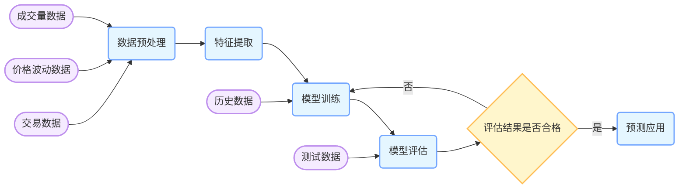

# 金融市场微观结构变化预测模型

> 关键词：金融市场微观结构、预测模型、核心算法、数学模型、实际应用

> 摘要：本文围绕金融市场微观结构变化预测模型展开深入研究。首先介绍了相关背景，包括目的、预期读者、文档结构和术语表等内容。接着阐述了核心概念及其联系，详细讲解了核心算法原理并给出 Python 代码示例，同时对数学模型和公式进行了说明与举例。通过项目实战，展示了代码的实际案例和详细解读。探讨了该模型在实际中的应用场景，推荐了学习资源、开发工具框架和相关论文著作。最后总结了未来发展趋势与挑战，提供了常见问题解答和扩展阅读参考资料，旨在为金融领域的研究者和从业者提供全面且深入的技术指导。

## 1. 背景介绍 
### 1.1 目的和范围
金融市场微观结构主要研究金融资产交易的过程和机制，包括交易规则、市场参与者行为、信息传递等方面。本研究的目的在于构建一个有效的预测模型，对金融市场微观结构的变化进行准确预测。范围涵盖了股票市场、期货市场、外汇市场等多种金融市场类型，重点关注市场微观结构中的交易数据、价格波动、成交量等关键因素的变化预测。

### 1.2 预期读者
本文预期读者包括金融领域的研究者、金融分析师、量化交易员、金融科技开发者以及对金融市场微观结构和预测模型感兴趣的技术爱好者。这些读者希望通过本文了解金融市场微观结构变化预测模型的原理、方法和应用，以便在实际工作中更好地进行市场分析和决策。

### 1.3 文档结构概述
本文首先介绍金融市场微观结构变化预测模型的背景信息，包括目的、预期读者和文档结构等。接着阐述核心概念与联系，包括相关概念的原理和架构示意图。然后详细讲解核心算法原理和具体操作步骤，并给出 Python 源代码。之后介绍数学模型和公式，并通过举例进行说明。再通过项目实战展示代码的实际应用和详细解读。随后探讨实际应用场景，推荐学习资源、开发工具框架和相关论文著作。最后总结未来发展趋势与挑战，提供常见问题解答和扩展阅读参考资料。

### 1.4 术语表
#### 1.4.1 核心术语定义
- **金融市场微观结构**：指金融市场中交易的具体制度安排、交易机制和市场参与者行为等微观层面的特征和结构。
- **预测模型**：用于对未来事件或现象进行预测的数学模型或算法模型。
- **交易数据**：包括交易时间、交易价格、成交量、买卖方向等与金融资产交易相关的数据。
- **价格波动**：金融资产价格在一定时间内的变化幅度和频率。
- **成交量**：在一定时间内金融资产的交易数量。

#### 1.4.2 相关概念解释
- **市场效率**：指金融市场将信息迅速、准确地反映在资产价格中的能力。市场效率的高低会影响金融市场微观结构的变化。
- **流动性**：指金融资产能够以合理价格迅速买卖的能力。流动性的变化是金融市场微观结构变化的重要表现之一。
- **信息不对称**：指市场参与者之间掌握的信息存在差异。信息不对称会影响市场参与者的决策和市场价格的形成，进而影响金融市场微观结构。

#### 1.4.3 缩略词列表
- **ARIMA**：Autoregressive Integrated Moving Average，自回归积分滑动平均模型。
- **LSTM**：Long Short-Term Memory，长短期记忆网络。
- **GARCH**：Generalized Autoregressive Conditional Heteroskedasticity，广义自回归条件异方差模型。

## 2. 核心概念与联系 
### 核心概念原理
金融市场微观结构变化预测模型主要基于对金融市场中各种数据的分析和挖掘，通过建立数学模型和算法来预测市场微观结构的未来变化。核心概念包括交易数据、价格波动、成交量等。交易数据是市场微观结构的基础，它记录了市场参与者的交易行为和决策。价格波动反映了市场供求关系的变化和市场参与者对资产价值的预期。成交量则反映了市场的活跃程度和参与者的交易意愿。

### 架构示意图


该流程图展示了金融市场微观结构变化预测模型的主要流程。首先收集交易数据、价格波动数据和成交量数据，进行数据预处理，然后提取特征。接着使用历史数据进行模型训练，训练好的模型使用测试数据进行评估。如果评估结果合格，则可以将模型应用于实际预测；如果评估结果不合格，则需要重新进行模型训练。

## 3. 核心算法原理 & 具体操作步骤 
### 核心算法原理
本研究使用长短期记忆网络（LSTM）作为核心算法。LSTM 是一种特殊的循环神经网络（RNN），能够有效地处理序列数据中的长期依赖问题。在金融市场微观结构变化预测中，交易数据、价格波动和成交量等都是时间序列数据，LSTM 可以捕捉这些数据中的长期依赖关系，从而更准确地预测市场微观结构的变化。

### Python 代码示例
```python
import numpy as np
import pandas as pd
from tensorflow.keras.models import Sequential
from tensorflow.keras.layers import LSTM, Dense

# 生成示例数据
data = np.random.randn(1000, 3)  # 假设数据集有 1000 个样本，每个样本有 3 个特征
train_size = int(len(data) * 0.8)
train_data = data[:train_size]
test_data = data[train_size:]

# 数据预处理
def create_sequences(data, seq_length):
    xs, ys = [], []
    for i in range(len(data) - seq_length):
        x = data[i:i+seq_length]
        y = data[i+seq_length, 0]  # 假设预测第一个特征
        xs.append(x)
        ys.append(y)
    return np.array(xs), np.array(ys)

seq_length = 10
X_train, y_train = create_sequences(train_data, seq_length)
X_test, y_test = create_sequences(test_data, seq_length)

# 构建 LSTM 模型
model = Sequential()
model.add(LSTM(50, activation='relu', input_shape=(seq_length, 3)))
model.add(Dense(1))
model.compile(optimizer='adam', loss='mse')

# 模型训练
model.fit(X_train, y_train, epochs=50, batch_size=32, verbose=1)

# 模型预测
predictions = model.predict(X_test)
```
### 具体操作步骤
1. **数据收集**：收集金融市场的交易数据、价格波动数据和成交量数据等。
2. **数据预处理**：对收集到的数据进行清洗、归一化等处理，以提高模型的训练效果。
3. **特征提取**：从预处理后的数据中提取有用的特征，如均值、标准差、趋势等。
4. **数据集划分**：将数据集划分为训练集和测试集，用于模型的训练和评估。
5. **模型构建**：使用 LSTM 构建预测模型，设置模型的层数、神经元数量等参数。
6. **模型训练**：使用训练集对模型进行训练，调整模型的参数以最小化损失函数。
7. **模型评估**：使用测试集对训练好的模型进行评估，计算评估指标，如均方误差（MSE）、平均绝对误差（MAE）等。
8. **模型优化**：根据评估结果，对模型进行优化，如调整模型参数、增加训练数据等。
9. **预测应用**：将优化后的模型应用于实际预测，对金融市场微观结构的未来变化进行预测。

## 4. 数学模型和公式 & 详细讲解 & 举例说明 
### 数学模型和公式
#### LSTM 单元结构
LSTM 单元由输入门、遗忘门、输出门和细胞状态组成。其数学公式如下：

遗忘门：
$$f_t = \sigma(W_f[h_{t-1}, x_t] + b_f)$$

输入门：
$$i_t = \sigma(W_i[h_{t-1}, x_t] + b_i)$$

候选细胞状态：
$$\tilde{C}_t = \tanh(W_C[h_{t-1}, x_t] + b_C)$$

细胞状态更新：
$$C_t = f_t \odot C_{t-1} + i_t \odot \tilde{C}_t$$

输出门：
$$o_t = \sigma(W_o[h_{t-1}, x_t] + b_o)$$

隐藏状态更新：
$$h_t = o_t \odot \tanh(C_t)$$

其中，$x_t$ 是当前时刻的输入，$h_{t-1}$ 是上一时刻的隐藏状态，$C_{t-1}$ 是上一时刻的细胞状态，$W$ 是权重矩阵，$b$ 是偏置向量，$\sigma$ 是 sigmoid 函数，$\tanh$ 是双曲正切函数，$\odot$ 表示逐元素相乘。

### 详细讲解
- **遗忘门**：决定上一时刻的细胞状态 $C_{t-1}$ 中有多少信息需要被遗忘。遗忘门的输出 $f_t$ 是一个介于 0 到 1 之间的向量，0 表示完全遗忘，1 表示完全保留。
- **输入门**：决定当前输入 $x_t$ 中有多少信息需要被添加到细胞状态中。输入门的输出 $i_t$ 也是一个介于 0 到 1 之间的向量。
- **候选细胞状态**：根据当前输入 $x_t$ 和上一时刻的隐藏状态 $h_{t-1}$ 计算得到的候选细胞状态 $\tilde{C}_t$。
- **细胞状态更新**：将上一时刻的细胞状态 $C_{t-1}$ 乘以遗忘门的输出 $f_t$，再加上输入门的输出 $i_t$ 乘以候选细胞状态 $\tilde{C}_t$，得到当前时刻的细胞状态 $C_t$。
- **输出门**：决定当前时刻的细胞状态 $C_t$ 中有多少信息需要被输出到隐藏状态 $h_t$ 中。输出门的输出 $o_t$ 是一个介于 0 到 1 之间的向量。
- **隐藏状态更新**：将输出门的输出 $o_t$ 乘以经过双曲正切函数处理后的细胞状态 $\tanh(C_t)$，得到当前时刻的隐藏状态 $h_t$。

### 举例说明
假设我们有一个简单的时间序列数据 $x = [1, 2, 3, 4, 5]$，我们使用 LSTM 模型来预测下一个值。在每个时间步，LSTM 单元会根据当前输入 $x_t$ 和上一时刻的隐藏状态 $h_{t-1}$ 计算遗忘门、输入门、候选细胞状态、细胞状态和输出门，然后更新隐藏状态 $h_t$。最终，模型会根据最后一个时间步的隐藏状态 $h_T$ 进行预测。

例如，在第一个时间步，$x_1 = 1$，假设初始隐藏状态 $h_0 = [0, 0]$ 和初始细胞状态 $C_0 = [0, 0]$。首先计算遗忘门：
$$f_1 = \sigma(W_f[h_0, x_1] + b_f)$$
然后计算输入门、候选细胞状态、细胞状态和输出门，最后更新隐藏状态 $h_1$。重复这个过程，直到最后一个时间步，得到最终的预测结果。

## 5. 项目实战：代码实际案例和详细解释说明 
### 5.1  开发环境搭建
#### 安装 Python
首先需要安装 Python 环境，建议使用 Python 3.7 及以上版本。可以从 Python 官方网站（https://www.python.org/downloads/）下载并安装。

#### 安装必要的库
使用以下命令安装必要的库：
```sh
pip install numpy pandas tensorflow
```

### 5.2  源代码详细实现和代码解读
```python
import numpy as np
import pandas as pd
from tensorflow.keras.models import Sequential
from tensorflow.keras.layers import LSTM, Dense

# 生成示例数据
data = np.random.randn(1000, 3)  # 假设数据集有 1000 个样本，每个样本有 3 个特征
train_size = int(len(data) * 0.8)
train_data = data[:train_size]
test_data = data[train_size:]

# 数据预处理
def create_sequences(data, seq_length):
    xs, ys = [], []
    for i in range(len(data) - seq_length):
        x = data[i:i+seq_length]
        y = data[i+seq_length, 0]  # 假设预测第一个特征
        xs.append(x)
        ys.append(y)
    return np.array(xs), np.array(ys)

seq_length = 10
X_train, y_train = create_sequences(train_data, seq_length)
X_test, y_test = create_sequences(test_data, seq_length)

# 构建 LSTM 模型
model = Sequential()
model.add(LSTM(50, activation='relu', input_shape=(seq_length, 3)))
model.add(Dense(1))
model.compile(optimizer='adam', loss='mse')

# 模型训练
model.fit(X_train, y_train, epochs=50, batch_size=32, verbose=1)

# 模型预测
predictions = model.predict(X_test)
```
### 代码解读与分析
1. **数据生成**：使用 `np.random.randn(1000, 3)` 生成一个包含 1000 个样本，每个样本有 3 个特征的随机数据集。
2. **数据集划分**：将数据集划分为训练集和测试集，训练集占 80%，测试集占 20%。
3. **数据预处理**：定义 `create_sequences` 函数，将时间序列数据转换为适合 LSTM 模型输入的格式。该函数将数据划分为长度为 `seq_length` 的序列，并将每个序列的下一个值作为目标值。
4. **模型构建**：使用 `Sequential` 模型构建 LSTM 模型，添加一个包含 50 个神经元的 LSTM 层和一个全连接层。使用 `adam` 优化器和均方误差（MSE）损失函数进行模型编译。
5. **模型训练**：使用 `fit` 方法对模型进行训练，设置训练轮数为 50，批次大小为 32。
6. **模型预测**：使用训练好的模型对测试集进行预测，得到预测结果。

## 6. 实际应用场景 
### 量化交易
量化交易员可以使用金融市场微观结构变化预测模型来预测资产价格的波动和成交量的变化，从而制定交易策略。例如，当模型预测价格将上涨时，交易员可以买入资产；当模型预测价格将下跌时，交易员可以卖出资产。

### 风险管理
金融机构可以使用该模型来评估市场风险，预测市场微观结构的变化对资产组合的影响。例如，当模型预测市场流动性将下降时，金融机构可以调整资产组合，减少对流动性较差资产的持有。

### 市场监管
市场监管机构可以使用该模型来监测市场的异常波动和操纵行为。例如，当模型预测市场价格波动异常时，监管机构可以及时进行调查，维护市场的公平和稳定。

### 投资决策
投资者可以使用该模型来辅助投资决策，了解市场微观结构的变化趋势，选择合适的投资时机和投资标的。例如，当模型预测某个行业的市场微观结构将发生有利变化时，投资者可以增加对该行业的投资。

## 7. 工具和资源推荐
### 7.1 学习资源推荐
#### 7.1.1 书籍推荐
- 《金融市场微观结构理论》：本书系统地介绍了金融市场微观结构的基本理论和方法，是学习金融市场微观结构的经典教材。
- 《Python 金融数据分析实战》：本书介绍了如何使用 Python 进行金融数据分析和建模，包括数据处理、可视化、机器学习等方面的内容。
- 《深度学习》：本书是深度学习领域的经典著作，详细介绍了深度学习的基本原理、算法和应用，对于理解 LSTM 等深度学习模型有很大帮助。

#### 7.1.2 在线课程
- Coursera 上的“Financial Markets”：该课程由耶鲁大学教授 Robert Shiller 主讲，介绍了金融市场的基本概念、理论和实践。
- edX 上的“Introduction to Financial Engineering and Risk Management”：该课程介绍了金融工程和风险管理的基本概念、方法和工具。
- Udemy 上的“Deep Learning A-Z™: Hands-On Artificial Neural Networks”：该课程介绍了深度学习的基本原理和实践，包括神经网络、卷积神经网络、循环神经网络等方面的内容。

#### 7.1.3 技术博客和网站
- Medium 上的 Towards Data Science：该博客平台上有很多关于金融数据分析、机器学习和深度学习的文章，内容丰富且具有一定的深度。
- QuantNet：该网站是量化金融领域的专业论坛，提供了很多关于量化交易、金融建模和数据分析的讨论和资源。
- Investing.com：该网站提供了全球金融市场的实时行情、新闻和分析，对于了解金融市场动态有很大帮助。

### 7.2 开发工具框架推荐
#### 7.2.1 IDE和编辑器
- PyCharm：是一款专业的 Python 集成开发环境，提供了丰富的代码编辑、调试和分析功能，适合开发大型 Python 项目。
- Jupyter Notebook：是一个交互式的开发环境，支持 Python、R 等多种编程语言，适合进行数据分析和模型开发。
- Visual Studio Code：是一款轻量级的代码编辑器，支持多种编程语言和插件，具有良好的扩展性和用户体验。

#### 7.2.2 调试和性能分析工具
- TensorBoard：是 TensorFlow 提供的可视化工具，可以用于可视化模型的训练过程、损失函数变化、模型结构等信息，帮助开发者调试和优化模型。
- Py-Spy：是一个 Python 性能分析工具，可以实时监测 Python 程序的 CPU 使用率、函数调用时间等信息，帮助开发者找出性能瓶颈。
- Memory Profiler：是一个 Python 内存分析工具，可以分析 Python 程序的内存使用情况，帮助开发者优化内存使用。

#### 7.2.3 相关框架和库
- TensorFlow：是一个开源的深度学习框架，提供了丰富的深度学习模型和工具，支持 CPU、GPU 和 TPU 等多种计算设备。
- PyTorch：是另一个开源的深度学习框架，具有动态图机制和简洁的 API，适合快速开发和实验深度学习模型。
- Pandas：是一个用于数据处理和分析的 Python 库，提供了丰富的数据结构和函数，方便进行数据清洗、转换和分析。

### 7.3 相关论文著作推荐
#### 7.3.1 经典论文
- “Market Microstructure and Asset Pricing: On the Compensation for Illiquidity in Stock Returns”：该论文研究了市场微观结构与资产定价的关系，提出了流动性溢价的概念。
- “The Limits of Arbitrage”：该论文分析了套利行为的局限性，指出市场中存在的各种摩擦会限制套利的有效性。
- “Long Short-Term Memory”：该论文介绍了长短期记忆网络（LSTM）的基本原理和结构，是 LSTM 领域的经典论文。

#### 7.3.2 最新研究成果
- 可以关注金融领域的顶级学术期刊，如 Journal of Finance、Review of Financial Studies 等，了解金融市场微观结构变化预测模型的最新研究成果。
- 还可以关注 arXiv 等预印本平台，获取最新的研究论文和技术报告。

#### 7.3.3 应用案例分析
- 可以参考一些量化交易公司和金融科技公司的研究报告和案例分析，了解金融市场微观结构变化预测模型在实际应用中的效果和经验。
- 一些行业会议和研讨会也会分享相关的应用案例，可以关注这些活动获取更多信息。

## 8. 总结：未来发展趋势与挑战
### 未来发展趋势
- **多模态数据融合**：未来的金融市场微观结构变化预测模型将不仅仅依赖于交易数据、价格波动和成交量等传统数据，还将融合新闻文本、社交媒体数据、宏观经济数据等多模态数据，以提高预测的准确性和可靠性。
- **深度学习模型的改进**：随着深度学习技术的不断发展，LSTM 等模型将不断得到改进和优化。例如，引入注意力机制、强化学习等技术，提高模型的学习能力和适应性。
- **实时预测与决策**：未来的预测模型将更加注重实时性，能够实时监测市场微观结构的变化，并及时做出决策。例如，在高频交易中，实时预测模型可以帮助交易员快速做出交易决策。
- **跨市场和跨资产预测**：随着金融市场的全球化和金融产品的多样化，未来的预测模型将不仅局限于单一市场和单一资产，还将实现跨市场和跨资产的预测，为投资者提供更全面的市场分析和投资建议。

### 挑战
- **数据质量和可靠性**：金融市场数据往往存在噪声、缺失值和异常值等问题，这些问题会影响模型的训练和预测效果。因此，如何提高数据质量和可靠性是一个重要的挑战。
- **模型解释性**：深度学习模型通常是黑箱模型，难以解释其预测结果。在金融领域，模型的解释性非常重要，因为投资者和监管机构需要了解模型的决策依据。因此，如何提高模型的解释性是一个亟待解决的问题。
- **市场不确定性**：金融市场具有高度的不确定性，市场微观结构的变化受到多种因素的影响，如政策变化、突发事件等。这些因素难以预测，增加了模型预测的难度。
- **计算资源和成本**：深度学习模型通常需要大量的计算资源和时间进行训练，这对于一些小型金融机构和个人投资者来说是一个挑战。如何降低计算资源和成本，提高模型的训练效率是一个需要解决的问题。

## 9. 附录：常见问题与解答
### 问题 1：如何选择合适的特征用于金融市场微观结构变化预测？
答：选择合适的特征需要考虑多个因素。首先，要选择与金融市场微观结构变化密切相关的特征，如交易数据、价格波动、成交量等。其次，可以使用特征选择方法，如相关性分析、主成分分析等，筛选出对预测结果影响较大的特征。此外，还可以结合领域知识和经验，选择具有实际意义的特征。

### 问题 2：LSTM 模型的训练时间过长怎么办？
答：如果 LSTM 模型的训练时间过长，可以考虑以下几种方法：
- **减少模型复杂度**：减少 LSTM 层的神经元数量或层数，降低模型的复杂度。
- **增加计算资源**：使用 GPU 或 TPU 等加速设备进行训练，提高训练速度。
- **优化训练参数**：调整训练轮数、批次大小等训练参数，找到最优的训练设置。
- **使用预训练模型**：可以使用预训练的 LSTM 模型进行微调，减少训练时间。

### 问题 3：如何评估金融市场微观结构变化预测模型的性能？
答：可以使用多种评估指标来评估预测模型的性能，常见的评估指标包括均方误差（MSE）、平均绝对误差（MAE）、均方根误差（RMSE）、决定系数（$R^2$）等。此外，还可以使用一些金融领域特定的评估指标，如夏普比率、信息比率等，评估模型在实际投资中的表现。

### 问题 4：模型预测结果不准确怎么办？
答：如果模型预测结果不准确，可以考虑以下几种方法：
- **检查数据质量**：确保数据没有噪声、缺失值和异常值等问题，对数据进行清洗和预处理。
- **调整模型参数**：尝试调整模型的参数，如 LSTM 层的神经元数量、层数、学习率等，找到最优的参数设置。
- **增加训练数据**：增加训练数据的数量和多样性，提高模型的泛化能力。
- **使用其他模型**：尝试使用其他类型的模型，如 ARIMA 模型、GARCH 模型等，或者将多种模型进行融合，提高预测的准确性。

## 10. 扩展阅读 & 参考资料
### 扩展阅读
- 《金融计量学：从初级到高级建模技术》：本书介绍了金融计量学的基本理论和方法，包括时间序列分析、回归分析、风险管理等方面的内容，对于深入理解金融市场微观结构变化预测模型有很大帮助。
- 《人工智能在金融领域的应用》：本书介绍了人工智能技术在金融领域的应用，包括机器学习、深度学习、自然语言处理等方面的内容，对于了解金融科技的发展趋势有很大帮助。
- 《量化投资：策略与技术》：本书介绍了量化投资的基本概念、策略和技术，包括量化交易策略的设计、回测和优化等方面的内容，对于量化交易员和投资者有很大的参考价值。

### 参考资料
- O'Hara, M. (1995). Market Microstructure Theory. Blackwell Publishers.
- Goodfellow, I. J., Bengio, Y., & Courville, A. (2016). Deep Learning. MIT Press.
- Chollet, F. (2017). Deep Learning with Python. Manning Publications.

作者：AI天才研究院/AI Genius Institute & 禅与计算机程序设计艺术 /Zen And The Art of Computer Programming