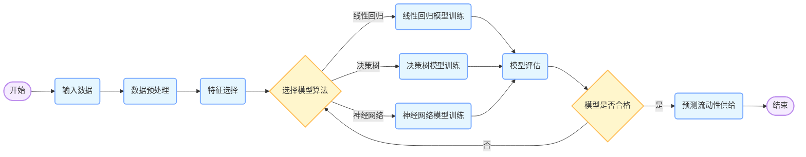

# 金融市场流动性供给预测模型

> 关键词：金融市场、流动性供给、预测模型、数据分析、机器学习

> 摘要：本文聚焦于金融市场流动性供给预测模型，旨在深入剖析该模型的核心概念、算法原理、数学模型以及实际应用。首先介绍了研究的背景、目的、预期读者和文档结构，对相关术语进行了详细解释。接着阐述了核心概念及其联系，给出了原理和架构的示意图与流程图。通过Python代码详细讲解了核心算法原理和具体操作步骤，并对数学模型和公式进行了深入分析和举例说明。以实际项目为例，展示了开发环境搭建、源代码实现及代码解读。探讨了该模型在金融领域的实际应用场景，推荐了学习资源、开发工具框架和相关论文著作。最后总结了未来发展趋势与挑战，提供了常见问题解答和扩展阅读参考资料，为金融市场流动性供给预测提供了全面而深入的技术指导。

## 1. 背景介绍 
### 1.1 目的和范围
金融市场的流动性供给是影响市场稳定和资产价格的关键因素之一。准确预测流动性供给有助于投资者制定合理的投资策略，金融机构进行有效的风险管理，监管部门实施科学的政策调控。本研究的目的在于构建一个有效的金融市场流动性供给预测模型，通过对相关数据的分析和挖掘，为金融市场参与者提供可靠的预测信息。

本研究的范围涵盖了多种金融市场，包括股票市场、债券市场、外汇市场等。研究将考虑多种影响流动性供给的因素，如宏观经济指标、货币政策、市场情绪等，并运用数据分析和机器学习技术来构建预测模型。

### 1.2 预期读者
本文的预期读者包括金融市场投资者、金融机构从业人员、金融监管部门工作人员以及对金融数据分析和预测感兴趣的研究人员和学生。对于投资者来说，了解流动性供给预测模型可以帮助他们更好地把握市场趋势，制定投资策略；金融机构可以利用该模型进行风险管理和资产配置；监管部门可以依据预测结果制定宏观政策，维护金融市场稳定；研究人员和学生可以从本文中获取相关的理论知识和实践经验，开展进一步的研究和学习。

### 1.3 文档结构概述
本文将按照以下结构进行组织：
- 核心概念与联系：介绍金融市场流动性供给的核心概念，分析各因素之间的联系，并给出原理和架构的示意图与流程图。
- 核心算法原理 & 具体操作步骤：详细讲解构建预测模型所使用的核心算法原理，并用Python代码展示具体的操作步骤。
- 数学模型和公式 & 详细讲解 & 举例说明：给出预测模型的数学模型和公式，对其进行详细讲解，并通过实际例子进行说明。
- 项目实战：代码实际案例和详细解释说明：以一个实际项目为例，展示开发环境搭建、源代码实现和代码解读的过程。
- 实际应用场景：探讨金融市场流动性供给预测模型在实际金融领域中的应用场景。
- 工具和资源推荐：推荐学习该领域知识的相关资源，包括书籍、在线课程、技术博客和网站，以及开发工具框架和相关论文著作。
- 总结：未来发展趋势与挑战：总结金融市场流动性供给预测模型的未来发展趋势和面临的挑战。
- 附录：常见问题与解答：提供关于该模型的常见问题及解答。
- 扩展阅读 & 参考资料：列出进一步学习和研究所需的扩展阅读资料和参考文献。

### 1.4 术语表
#### 1.4.1 核心术语定义
- **金融市场流动性供给**：指在金融市场中，能够随时满足市场参与者交易需求的资金和资产的数量。它反映了市场的交易活跃程度和资金的充裕程度。
- **预测模型**：基于历史数据和相关因素，运用数学和统计方法构建的，用于预测未来事件或现象的模型。
- **机器学习**：一门多领域交叉学科，涉及概率论、统计学、逼近论、凸分析、算法复杂度理论等多门学科。它专门研究计算机怎样模拟或实现人类的学习行为，以获取新的知识或技能，重新组织已有的知识结构使之不断改善自身的性能。

#### 1.4.2 相关概念解释
- **宏观经济指标**：反映宏观经济运行状况的统计数据，如国内生产总值（GDP）、通货膨胀率、利率等。这些指标对金融市场的流动性供给有着重要的影响。
- **货币政策**：中央银行通过调节货币供应量和利率等手段，来影响经济增长、通货膨胀和就业等宏观经济目标的政策。货币政策的调整会直接影响金融市场的流动性供给。
- **市场情绪**：投资者对金融市场的信心和预期，通常通过市场参与者的交易行为和言论来体现。市场情绪的波动会影响投资者的交易决策，进而影响金融市场的流动性供给。

#### 1.4.3 缩略词列表
- **GDP**：国内生产总值（Gross Domestic Product）
- **CPI**：消费者物价指数（Consumer Price Index）
- **ML**：机器学习（Machine Learning）

## 2. 核心概念与联系 

### 核心概念原理
金融市场流动性供给预测模型的核心原理是基于对影响流动性供给的各种因素进行分析和建模。这些因素可以分为宏观经济因素、货币政策因素和市场因素等。宏观经济因素如GDP增长率、通货膨胀率等反映了经济的整体运行状况，会影响企业和居民的资金需求和供给；货币政策因素如利率调整、货币供应量变化等直接影响金融市场的资金成本和流动性；市场因素如市场情绪、交易量等反映了市场参与者的行为和预期，也会对流动性供给产生影响。

通过收集和整理这些因素的历史数据，运用数据分析和机器学习技术，可以建立起流动性供给与这些因素之间的关系模型。该模型可以根据当前的因素数据预测未来的流动性供给情况。

### 架构的文本示意图
```plaintext
输入数据层：
- 宏观经济数据（GDP、CPI等）
- 货币政策数据（利率、货币供应量等）
- 市场数据（交易量、市场情绪指数等）

数据预处理层：
- 数据清洗（去除缺失值、异常值）
- 数据标准化（将数据转换为统一的尺度）
- 特征选择（选择对流动性供给影响较大的特征）

模型构建层：
- 选择合适的机器学习算法（如线性回归、决策树、神经网络等）
- 训练模型（使用历史数据进行训练）

预测输出层：
- 根据当前输入数据进行预测
- 输出流动性供给预测结果
```

### Mermaid 流程图


## 3. 核心算法原理 & 具体操作步骤 

### 线性回归算法原理
线性回归是一种简单而常用的机器学习算法，用于建立自变量和因变量之间的线性关系。在金融市场流动性供给预测中，我们可以将流动性供给作为因变量，宏观经济指标、货币政策指标等作为自变量，通过线性回归模型来预测流动性供给。

线性回归模型的一般形式为：
$$y = \beta_0 + \beta_1x_1 + \beta_2x_2 + \cdots + \beta_nx_n + \epsilon$$
其中，$y$ 是因变量（流动性供给），$x_1, x_2, \cdots, x_n$ 是自变量（宏观经济指标、货币政策指标等），$\beta_0, \beta_1, \beta_2, \cdots, \beta_n$ 是模型的系数，$\epsilon$ 是误差项。

### Python 代码实现线性回归模型
```python
import numpy as np
import pandas as pd
from sklearn.model_selection import train_test_split
from sklearn.linear_model import LinearRegression
from sklearn.metrics import mean_squared_error

# 读取数据
data = pd.read_csv('financial_data.csv')

# 分离自变量和因变量
X = data.drop('liquidity_supply', axis=1)
y = data['liquidity_supply']

# 划分训练集和测试集
X_train, X_test, y_train, y_test = train_test_split(X, y, test_size=0.2, random_state=42)

# 创建线性回归模型
model = LinearRegression()

# 训练模型
model.fit(X_train, y_train)

# 预测
y_pred = model.predict(X_test)

# 评估模型
mse = mean_squared_error(y_test, y_pred)
print(f"均方误差: {mse}")
```

### 具体操作步骤
1. **数据读取**：使用 `pandas` 库读取包含流动性供给和相关影响因素的数据集。
2. **数据分离**：将数据集分为自变量（影响因素）和因变量（流动性供给）。
3. **数据集划分**：使用 `train_test_split` 函数将数据集划分为训练集和测试集，一般将 80% 的数据作为训练集，20% 的数据作为测试集。
4. **模型创建**：创建线性回归模型对象。
5. **模型训练**：使用训练集数据对模型进行训练，即求解模型的系数。
6. **模型预测**：使用训练好的模型对测试集数据进行预测。
7. **模型评估**：使用均方误差（MSE）等指标评估模型的预测性能。

## 4. 数学模型和公式 & 详细讲解 & 举例说明 

### 线性回归模型的数学推导
在线性回归模型中，我们的目标是找到一组系数 $\beta_0, \beta_1, \beta_2, \cdots, \beta_n$，使得预测值 $\hat{y}$ 与真实值 $y$ 之间的误差最小。通常使用最小二乘法来求解这个问题，即最小化误差平方和：
$$S(\beta) = \sum_{i=1}^{m}(y_i - \hat{y}_i)^2 = \sum_{i=1}^{m}(y_i - (\beta_0 + \beta_1x_{i1} + \beta_2x_{i2} + \cdots + \beta_nx_{in}))^2$$
其中，$m$ 是样本数量，$y_i$ 是第 $i$ 个样本的真实值，$\hat{y}_i$ 是第 $i$ 个样本的预测值。

为了找到使 $S(\beta)$ 最小的 $\beta$，我们对 $S(\beta)$ 求偏导数，并令其等于 0：
$$\frac{\partial S(\beta)}{\partial \beta_j} = 0, j = 0, 1, 2, \cdots, n$$
通过求解这些偏导数方程，可以得到模型的系数 $\beta$。

### 举例说明
假设我们有一个简单的线性回归模型，只有一个自变量 $x$ 和一个因变量 $y$，模型形式为：
$$y = \beta_0 + \beta_1x + \epsilon$$
我们有以下数据集：
| $x$ | $y$ |
| --- | --- |
| 1 | 3 |
| 2 | 5 |
| 3 | 7 |
| 4 | 9 |

我们的目标是找到 $\beta_0$ 和 $\beta_1$ 的值，使得误差平方和最小。

首先，我们可以列出误差平方和的表达式：
$$S(\beta_0, \beta_1) = \sum_{i=1}^{4}(y_i - (\beta_0 + \beta_1x_i))^2$$
$$=(3 - (\beta_0 + \beta_1\times1))^2 + (5 - (\beta_0 + \beta_1\times2))^2 + (7 - (\beta_0 + \beta_1\times3))^2 + (9 - (\beta_0 + \beta_1\times4))^2$$

然后，对 $S(\beta_0, \beta_1)$ 分别求关于 $\beta_0$ 和 $\beta_1$ 的偏导数，并令其等于 0：
$$\frac{\partial S(\beta_0, \beta_1)}{\partial \beta_0} = -2(3 - (\beta_0 + \beta_1\times1)) - 2(5 - (\beta_0 + \beta_1\times2)) - 2(7 - (\beta_0 + \beta_1\times3)) - 2(9 - (\beta_0 + \beta_1\times4)) = 0$$
$$\frac{\partial S(\beta_0, \beta_1)}{\partial \beta_1} = -2\times1\times(3 - (\beta_0 + \beta_1\times1)) - 2\times2\times(5 - (\beta_0 + \beta_1\times2)) - 2\times3\times(7 - (\beta_0 + \beta_1\times3)) - 2\times4\times(9 - (\beta_0 + \beta_1\times4)) = 0$$

解这个方程组，可以得到 $\beta_0 = 1$，$\beta_1 = 2$。

因此，我们得到的线性回归模型为：
$$y = 1 + 2x$$

## 5. 项目实战：代码实际案例和详细解释说明 

### 5.1  开发环境搭建
#### 安装 Python
首先，需要安装 Python 环境。可以从 Python 官方网站（https://www.python.org/downloads/）下载适合自己操作系统的 Python 版本，并按照安装向导进行安装。

#### 安装必要的库
在安装好 Python 后，需要安装一些必要的库，如 `pandas`、`numpy`、`scikit-learn` 等。可以使用 `pip` 命令进行安装：
```sh
pip install pandas numpy scikit-learn
```

### 5.2  源代码详细实现和代码解读
```python
import pandas as pd
import numpy as np
from sklearn.model_selection import train_test_split
from sklearn.linear_model import LinearRegression
from sklearn.metrics import mean_squared_error
import matplotlib.pyplot as plt

# 读取数据
data = pd.read_csv('financial_data.csv')

# 查看数据基本信息
print("数据基本信息：")
data.info()

# 查看数据集行数和列数
rows, columns = data.shape

if rows < 30:
    # 小样本数据（行数少于30）查看全量数据信息
    print("数据全部内容信息：")
    print(data.to_csv(sep='\t', na_rep='nan'))
else:
    # 大样本数据查看数据前几行信息
    print("数据前几行内容信息：")
    print(data.head().to_csv(sep='\t', na_rep='nan'))

# 分离自变量和因变量
X = data.drop('liquidity_supply', axis=1)
y = data['liquidity_supply']

# 划分训练集和测试集
X_train, X_test, y_train, y_test = train_test_split(X, y, test_size=0.2, random_state=42)

# 创建线性回归模型
model = LinearRegression()

# 训练模型
model.fit(X_train, y_train)

# 预测
y_pred = model.predict(X_test)

# 评估模型
mse = mean_squared_error(y_test, y_pred)
print(f"均方误差: {mse}")

# 可视化预测结果
plt.scatter(y_test, y_pred)
plt.xlabel('真实值')
plt.ylabel('预测值')
plt.title('线性回归模型预测结果')
plt.show()
```

### 5.3  代码解读与分析
1. **数据读取**：使用 `pandas` 库的 `read_csv` 函数读取包含金融市场数据的 CSV 文件。
2. **数据查看**：使用 `info` 方法查看数据的基本信息，包括数据类型、缺失值情况等。根据数据行数的多少，分别查看全量数据信息或前几行数据信息。
3. **数据分离**：使用 `drop` 方法将数据集分为自变量（除 `liquidity_supply` 列外的其他列）和因变量（`liquidity_supply` 列）。
4. **数据集划分**：使用 `train_test_split` 函数将数据集划分为训练集和测试集，其中测试集占比为 20%。
5. **模型创建**：创建线性回归模型对象。
6. **模型训练**：使用训练集数据对模型进行训练，即求解模型的系数。
7. **模型预测**：使用训练好的模型对测试集数据进行预测。
8. **模型评估**：使用均方误差（MSE）评估模型的预测性能，MSE 越小，说明模型的预测效果越好。
9. **可视化**：使用 `matplotlib` 库绘制散点图，展示真实值和预测值之间的关系，帮助我们直观地了解模型的预测效果。

## 6. 实际应用场景 
### 投资者决策
投资者可以利用金融市场流动性供给预测模型来制定投资策略。当预测到流动性供给将增加时，市场资金充裕，资产价格可能上涨，投资者可以增加投资仓位；反之，当预测到流动性供给将减少时，市场资金紧张，资产价格可能下跌，投资者可以减少投资仓位或选择防御性资产。

### 金融机构风险管理
金融机构如银行、证券公司等可以使用该模型进行风险管理。通过预测流动性供给的变化，金融机构可以提前做好资金安排，避免出现流动性风险。例如，当预测到流动性供给将减少时，银行可以增加资金储备，提高流动性覆盖率。

### 监管部门政策制定
金融监管部门可以依据流动性供给预测模型的结果制定宏观政策，维护金融市场稳定。当预测到流动性供给不足时，监管部门可以采取宽松的货币政策，如降低利率、增加货币供应量等，以增加市场流动性；当预测到流动性供给过剩时，监管部门可以采取紧缩的货币政策，如提高利率、减少货币供应量等，以防止资产泡沫和通货膨胀。

## 7. 工具和资源推荐
### 7.1 学习资源推荐
#### 7.1.1 书籍推荐
- 《Python 数据分析实战》：介绍了使用 Python 进行数据分析的方法和技巧，包括数据处理、可视化和机器学习等方面的内容。
- 《机器学习》：周志华著，全面介绍了机器学习的基本概念、算法和应用，是机器学习领域的经典教材。
- 《金融数据分析与挖掘》：讲解了金融数据的特点和分析方法，以及如何运用数据分析和挖掘技术解决金融领域的实际问题。

#### 7.1.2 在线课程
- Coursera 上的“机器学习”课程：由斯坦福大学教授 Andrew Ng 主讲，是机器学习领域最受欢迎的在线课程之一。
- edX 上的“Python 数据科学导论”课程：介绍了使用 Python 进行数据科学的基础知识和技能。
- 中国大学 MOOC 上的“金融数据分析”课程：结合金融领域的实际案例，讲解了金融数据分析的方法和应用。

#### 7.1.3 技术博客和网站
- 博客园：国内知名的技术博客平台，有很多关于数据分析、机器学习和金融科技的技术文章。
- Medium：国外的技术博客平台，上面有很多高质量的数据分析和机器学习相关的文章。
- Kaggle：全球最大的数据科学社区，提供了丰富的数据集和数据分析竞赛，是学习和实践数据分析的好平台。

### 7.2 开发工具框架推荐
#### 7.2.1 IDE和编辑器
- PyCharm：一款专业的 Python 集成开发环境，具有代码编辑、调试、版本控制等功能，适合开发大型 Python 项目。
- Jupyter Notebook：一个交互式的开发环境，可以实时运行代码、展示结果和编写文档，非常适合数据分析和机器学习的探索性工作。
- Visual Studio Code：一款轻量级的代码编辑器，支持多种编程语言和插件扩展，也可以用于 Python 开发。

#### 7.2.2 调试和性能分析工具
- pdb：Python 自带的调试器，可以帮助开发者定位代码中的错误。
- cProfile：Python 标准库中的性能分析工具，可以分析代码的运行时间和函数调用情况。
- TensorBoard：TensorFlow 提供的可视化工具，可以用于可视化模型训练过程中的各种指标和数据。

#### 7.2.3 相关框架和库
- Pandas：用于数据处理和分析的 Python 库，提供了高效的数据结构和数据操作方法。
- NumPy：用于科学计算的 Python 库，提供了多维数组对象和各种数学函数。
- Scikit-learn：一个简单而高效的机器学习库，提供了各种机器学习算法和工具，如分类、回归、聚类等。
- TensorFlow：一个开源的机器学习框架，广泛应用于深度学习领域，支持构建和训练各种神经网络模型。

### 7.3 相关论文著作推荐
#### 7.3.1 经典论文
- Fama, E. F., & French, K. R. (1993). Common risk factors in the returns on stocks and bonds. *Journal of Financial Economics*, 33(1), 3-56. 该论文提出了著名的 Fama-French 三因子模型，用于解释股票和债券的收益率。
- Sharpe, W. F. (1964). Capital asset prices: A theory of market equilibrium under conditions of risk. *The Journal of Finance*, 19(3), 425-442. 该论文提出了资本资产定价模型（CAPM），是现代金融理论的重要基础之一。

#### 7.3.2 最新研究成果
- Diebold, F. X., & Yilmaz, K. (2012). Better to give than to receive: Predictive directional measurement of volatility spillovers. *International Journal of Forecasting*, 28(1), 57-66. 该论文提出了一种新的波动率溢出预测方法，对于金融市场的风险分析和预测具有重要意义。
- Cochrane, J. H. (2017). Presidential address: Discount rates. *The Journal of Finance*, 72(2), 497-536. 该论文对贴现率的理论和应用进行了深入探讨，对于理解金融资产定价和投资决策具有重要启示。

#### 7.3.3 应用案例分析
- 巴曙松等. 《中国金融市场流动性分析与预测》：该书结合中国金融市场的实际情况，对流动性供给的影响因素和预测方法进行了深入分析，并提供了具体的应用案例。
- 王春峰等. 《金融市场风险管理：理论、方法与应用》：该书介绍了金融市场风险管理的理论和方法，包括流动性风险的管理，并通过实际案例说明了如何运用相关方法进行风险管理。

## 8. 总结：未来发展趋势与挑战
### 未来发展趋势
- **多模型融合**：单一的预测模型可能存在局限性，未来的研究将倾向于将多种模型进行融合，如线性回归模型与神经网络模型、支持向量机模型等相结合，以提高预测的准确性和稳定性。
- **考虑更多因素**：随着金融市场的不断发展和变化，影响流动性供给的因素也越来越复杂。未来的预测模型将考虑更多的因素，如社交媒体情绪、区块链技术应用等，以更全面地反映市场的实际情况。
- **实时预测**：金融市场的变化非常迅速，实时预测对于投资者和金融机构来说至关重要。未来的预测模型将朝着实时预测的方向发展，能够及时反映市场的最新动态。

### 挑战
- **数据质量问题**：金融市场数据通常存在噪声、缺失值和异常值等问题，这些问题会影响预测模型的准确性。如何有效地处理数据质量问题，是未来研究需要解决的重要挑战之一。
- **模型解释性**：一些复杂的机器学习模型，如神经网络模型，虽然具有较高的预测性能，但模型的解释性较差。在金融领域，模型的解释性非常重要，因为投资者和监管部门需要了解模型的决策依据。如何提高模型的解释性，是未来研究的另一个挑战。
- **市场不确定性**：金融市场具有高度的不确定性，受到宏观经济政策、政治事件、自然灾害等多种因素的影响。如何在不确定性的市场环境中准确预测流动性供给，是未来研究面临的最大挑战。

## 9. 附录：常见问题与解答
### 问题 1：如何选择合适的预测模型？
答：选择合适的预测模型需要考虑多个因素，如数据的特点、问题的复杂度、模型的可解释性等。对于简单的线性关系问题，可以选择线性回归模型；对于复杂的非线性关系问题，可以选择神经网络、决策树等模型。同时，还可以通过交叉验证等方法比较不同模型的性能，选择性能最优的模型。

### 问题 2：数据预处理的重要性是什么？
答：数据预处理是构建预测模型的重要步骤，它可以提高数据的质量和可用性，从而提高模型的预测性能。数据预处理包括数据清洗、数据标准化、特征选择等操作。数据清洗可以去除数据中的噪声、缺失值和异常值；数据标准化可以将数据转换为统一的尺度，避免不同特征之间的量纲差异影响模型的训练；特征选择可以选择对目标变量影响较大的特征，减少模型的复杂度。

### 问题 3：如何评估预测模型的性能？
答：评估预测模型的性能可以使用多种指标，如均方误差（MSE）、均方根误差（RMSE）、平均绝对误差（MAE）、决定系数（$R^2$）等。均方误差和均方根误差衡量了预测值与真实值之间的平均误差程度，值越小说明模型的预测效果越好；平均绝对误差衡量了预测值与真实值之间的平均绝对误差；决定系数表示模型对数据的拟合程度，值越接近 1 说明模型的拟合效果越好。

### 问题 4：预测模型的结果一定准确吗？
答：预测模型的结果并不一定准确，因为金融市场具有高度的不确定性，受到多种因素的影响。预测模型只是基于历史数据和已知因素建立的，无法完全预测未来的市场变化。因此，在使用预测模型的结果时，需要结合其他信息和经验进行综合判断。

## 10. 扩展阅读 & 参考资料
### 扩展阅读
- 《金融时间序列分析》：介绍了金融时间序列的特点和分析方法，对于深入理解金融市场数据的动态变化具有重要意义。
- 《深度学习》：Ian Goodfellow 等著，全面介绍了深度学习的基本概念、算法和应用，是深度学习领域的经典著作。
- 《量化投资：策略与技术》：介绍了量化投资的基本概念、策略和技术，对于将数据分析和机器学习技术应用于金融投资具有指导作用。

### 参考资料
- Fama, E. F., & French, K. R. (1993). Common risk factors in the returns on stocks and bonds. *Journal of Financial Economics*, 33(1), 3-56.
- Sharpe, W. F. (1964). Capital asset prices: A theory of market equilibrium under conditions of risk. *The Journal of Finance*, 19(3), 425-442.
- Diebold, F. X., & Yilmaz, K. (2012). Better to give than to receive: Predictive directional measurement of volatility spillovers. *International Journal of Forecasting*, 28(1), 57-66.
- Cochrane, J. H. (2017). Presidential address: Discount rates. *The Journal of Finance*, 72(2), 497-536.

作者：AI天才研究院/AI Genius Institute & 禅与计算机程序设计艺术 /Zen And The Art of Computer Programming