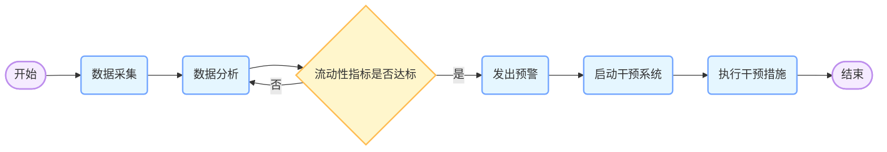

# 金融市场流动性枯竭预警与干预系统

> 关键词：金融市场、流动性枯竭、预警系统、干预系统、数据分析

> 摘要：本文围绕金融市场流动性枯竭预警与干预系统展开深入研究。首先介绍了该系统构建的背景、目的、适用读者以及文档结构等内容。接着详细阐述了核心概念及联系，包括流动性枯竭的定义、预警与干预的原理等，并通过示意图和流程图进行直观展示。深入讲解了核心算法原理，结合Python代码说明具体操作步骤。从数学模型和公式的角度对系统进行剖析，并举例说明其应用。通过项目实战部分，搭建开发环境，给出源代码实现及详细解读。探讨了系统在实际金融市场中的应用场景，推荐了相关的学习资源、开发工具框架以及论文著作。最后总结了系统未来的发展趋势与挑战，解答了常见问题，并提供了扩展阅读和参考资料，旨在为金融市场从业者和研究者提供全面且深入的系统构建与应用指导。

## 1. 背景介绍 
### 1.1 目的和范围
金融市场的稳定运行对于经济的健康发展至关重要，而流动性是金融市场的核心要素之一。流动性枯竭指的是市场上资产难以迅速以合理价格进行交易的状态，这可能引发市场恐慌、价格暴跌等严重后果。本系统的目的在于构建一个能够实时监测金融市场流动性状况，提前预警流动性枯竭风险，并在必要时提供干预策略的综合性系统。

本系统的范围涵盖了多种金融市场，如股票市场、债券市场、外汇市场等。它可以对不同类型的金融资产进行流动性分析，包括股票、债券、基金等。同时，系统不仅关注国内金融市场，也考虑国际金融市场的影响，以提供更全面的预警和干预支持。

### 1.2 预期读者
本系统相关内容的预期读者主要包括金融市场从业者，如银行交易员、基金经理、证券公司分析师等，他们可以利用该系统进行日常的市场监测和交易决策。金融监管机构人员也可以通过该系统及时掌握市场流动性风险，制定相应的监管政策。此外，金融领域的研究者和学者可以将本系统作为研究金融市场流动性的工具和参考。

### 1.3 文档结构概述
本文首先对金融市场流动性枯竭预警与干预系统的背景进行介绍，包括目的、预期读者和文档结构等内容。接着阐述核心概念与联系，让读者对系统的基本原理有清晰的认识。详细讲解核心算法原理和具体操作步骤，并通过Python代码进行说明。从数学模型和公式的角度对系统进行深入剖析，并举例说明。通过项目实战部分，展示系统的开发环境搭建、源代码实现和代码解读。探讨系统在实际金融市场中的应用场景。推荐相关的学习资源、开发工具框架和论文著作。最后总结系统未来的发展趋势与挑战，解答常见问题，并提供扩展阅读和参考资料。

### 1.4 术语表
#### 1.4.1 核心术语定义
- **金融市场流动性**：指金融资产能够以合理价格迅速进行交易的能力。它反映了市场上买卖双方的交易意愿和交易成本。
- **流动性枯竭**：当市场上的流动性严重不足，导致资产难以在合理时间内以合理价格进行交易时，就出现了流动性枯竭的情况。
- **预警系统**：通过对金融市场相关数据的监测和分析，提前发现流动性枯竭的潜在风险，并发出警报的系统。
- **干预系统**：在预警系统发出警报后，根据预设的策略对市场进行干预，以缓解流动性枯竭风险的系统。

#### 1.4.2 相关概念解释
- **市场深度**：指在不影响市场价格的情况下，市场能够容纳的交易量。市场深度越大，说明市场的流动性越好。
- **买卖价差**：指买入价格和卖出价格之间的差值。买卖价差越小，说明市场的流动性越好。
- **流动性风险**：指由于市场流动性不足而导致金融资产无法及时变现或变现价格低于预期的风险。

#### 1.4.3 缩略词列表
- **VaR**：Value at Risk，风险价值，用于衡量在一定的置信水平下，某一金融资产或投资组合在未来特定时期内可能遭受的最大损失。
- **ES**：Expected Shortfall，预期尾部损失，是在VaR的基础上，考虑了超过VaR的损失情况。

## 2. 核心概念与联系 
### 核心概念原理
金融市场流动性枯竭预警与干预系统主要基于对金融市场流动性的监测和分析。预警系统通过收集和分析市场交易数据、资产价格数据、宏观经济数据等多方面信息，运用各种指标和模型来评估市场的流动性状况。当监测到流动性指标达到或超过预设的阈值时，预警系统会发出警报，提示可能存在流动性枯竭的风险。

干预系统则在预警系统发出警报后启动。它根据预设的干预策略，如央行注入流动性、金融机构调整资产配置等，对市场进行干预，以缓解流动性枯竭的压力，维护市场的稳定运行。

### 架构的文本示意图
该系统主要由数据采集层、数据分析层、预警层和干预层组成。

数据采集层负责收集金融市场的各种数据，包括交易数据、价格数据、宏观经济数据等。这些数据来源广泛，如证券交易所、银行、政府统计部门等。

数据分析层对采集到的数据进行清洗、整理和分析。运用各种统计方法和机器学习算法，计算流动性指标，如市场深度、买卖价差等，并建立流动性模型，以评估市场的流动性状况。

预警层根据数据分析层的结果，设置预警阈值。当流动性指标达到或超过阈值时，预警层会发出警报，通知相关人员采取措施。

干预层在预警层发出警报后启动。它根据预设的干预策略，对市场进行干预。干预措施可以包括央行注入流动性、金融机构调整资产配置、监管机构出台政策等。

### Mermaid 流程图


## 3. 核心算法原理 & 具体操作步骤 
### 核心算法原理
本系统主要使用两种核心算法：基于统计分析的流动性指标计算算法和基于机器学习的预警模型算法。

#### 基于统计分析的流动性指标计算算法
该算法主要用于计算市场深度、买卖价差等流动性指标。以市场深度为例，其计算公式为：

市场深度 = 一定价格范围内的买入订单总量 + 一定价格范围内的卖出订单总量

#### 基于机器学习的预警模型算法
本系统使用支持向量机（SVM）作为预警模型。SVM是一种二分类算法，它可以将数据分为两类：正常流动性和流动性枯竭。SVM的核心思想是找到一个最优的超平面，使得两类数据之间的间隔最大。

### 具体操作步骤
#### 数据采集
使用Python的`pandas-datareader`库从金融数据接口（如雅虎财经）采集金融市场的交易数据和价格数据。以下是示例代码：
```python
import pandas_datareader as pdr
import datetime

# 设置数据采集的时间范围
start = datetime.datetime(2020, 1, 1)
end = datetime.datetime(2023, 12, 31)

# 采集某只股票的数据
stock_data = pdr.get_data_yahoo('AAPL', start=start, end=end)
```

#### 数据清洗和预处理
使用`pandas`库对采集到的数据进行清洗和预处理，去除缺失值和异常值。以下是示例代码：
```python
import pandas as pd

# 去除缺失值
stock_data = stock_data.dropna()

# 计算买卖价差
stock_data['Spread'] = stock_data['High'] - stock_data['Low']
```

#### 流动性指标计算
根据上述的流动性指标计算公式，计算市场深度和买卖价差等指标。以下是示例代码：
```python
# 计算市场深度（假设简单计算）
market_depth = stock_data['Volume'].sum()

# 计算平均买卖价差
average_spread = stock_data['Spread'].mean()
```

#### 预警模型训练
使用`scikit-learn`库构建支持向量机预警模型，并使用历史数据进行训练。以下是示例代码：
```python
from sklearn import svm
from sklearn.model_selection import train_test_split

# 准备特征和标签
X = stock_data[['Volume', 'Spread']]
y = [0 if spread < average_spread else 1 for spread in stock_data['Spread']]

# 划分训练集和测试集
X_train, X_test, y_train, y_test = train_test_split(X, y, test_size=0.2, random_state=42)

# 构建支持向量机模型
clf = svm.SVC(kernel='linear')

# 训练模型
clf.fit(X_train, y_train)
```

#### 预警和干预
使用训练好的模型对实时数据进行预测，当预测结果为流动性枯竭时，发出预警并启动干预系统。以下是示例代码：
```python
# 实时数据预测
new_data = pd.DataFrame({'Volume': [1000000], 'Spread': [2.0]})
prediction = clf.predict(new_data)

if prediction[0] == 1:
    print("预警：可能出现流动性枯竭！")
    # 启动干预系统（此处可添加具体的干预代码）
```

## 4. 数学模型和公式 & 详细讲解 & 举例说明 
### 流动性指标的数学模型和公式
#### 市场深度
市场深度 $MD$ 的计算公式为：

$$MD = \sum_{i=1}^{n}Q_{b,i} + \sum_{j=1}^{m}Q_{s,j}$$

其中，$Q_{b,i}$ 表示第 $i$ 个买入订单的数量，$n$ 表示一定价格范围内的买入订单数量；$Q_{s,j}$ 表示第 $j$ 个卖出订单的数量，$m$ 表示一定价格范围内的卖出订单数量。

举例说明：假设在某一时刻，某股票在一定价格范围内有 3 个买入订单，数量分别为 100、200、300；有 2 个卖出订单，数量分别为 150、250。则该股票的市场深度为：

$$MD = 100 + 200 + 300 + 150 + 250 = 1000$$

#### 买卖价差
买卖价差 $S$ 的计算公式为：

$$S = P_{a} - P_{b}$$

其中，$P_{a}$ 表示卖出价格，$P_{b}$ 表示买入价格。

举例说明：假设某股票的买入价格为 10 元，卖出价格为 10.1 元，则该股票的买卖价差为：

$$S = 10.1 - 10 = 0.1$$

### 预警模型的数学模型和公式
支持向量机（SVM）的目标是找到一个最优的超平面 $w^T x + b = 0$，使得两类数据之间的间隔最大。间隔的计算公式为：

$$\gamma = \frac{2}{\|w\|}$$

其中，$w$ 是超平面的法向量，$b$ 是偏置项。

SVM 的优化目标是在满足分类约束的条件下，最大化间隔 $\gamma$，即最小化 $\frac{1}{2}\|w\|^2$。分类约束条件为：

$$y_i(w^T x_i + b) \geq 1, i = 1, 2, \cdots, n$$

其中，$x_i$ 是第 $i$ 个样本的特征向量，$y_i$ 是第 $i$ 个样本的标签（$y_i \in \{-1, 1\}$），$n$ 是样本数量。

通过引入拉格朗日乘子 $\alpha_i$，可以将上述优化问题转化为对偶问题：

$$\max_{\alpha} \sum_{i=1}^{n} \alpha_i - \frac{1}{2} \sum_{i=1}^{n} \sum_{j=1}^{n} \alpha_i \alpha_j y_i y_j x_i^T x_j$$

$$\text{s.t.} \sum_{i=1}^{n} \alpha_i y_i = 0, \alpha_i \geq 0, i = 1, 2, \cdots, n$$

求解对偶问题得到最优的拉格朗日乘子 $\alpha_i^*$，然后可以计算出最优的 $w$ 和 $b$：

$$w^* = \sum_{i=1}^{n} \alpha_i^* y_i x_i$$

$$b^* = y_j - w^{*T} x_j, \text{其中} \alpha_j^* > 0$$

举例说明：假设有一个二维的数据集，包含两个类别：正类和负类。我们可以使用 SVM 找到一个最优的超平面将这两类数据分开。通过求解上述的对偶问题，得到最优的 $\alpha_i^*$，进而计算出 $w^*$ 和 $b^*$，得到最优的超平面方程。

## 5. 项目实战：代码实际案例和详细解释说明 
### 5.1  开发环境搭建
#### 安装 Python
首先需要安装 Python 环境，建议使用 Python 3.7 及以上版本。可以从 Python 官方网站（https://www.python.org/downloads/）下载并安装。

#### 安装必要的库
使用`pip`命令安装项目所需的库，包括`pandas`、`pandas-datareader`、`scikit-learn`等。以下是安装命令：
```bash
pip install pandas pandas-datareader scikit-learn
```

### 5.2  源代码详细实现和代码解读
以下是一个完整的金融市场流动性枯竭预警与干预系统的源代码示例：
```python
import pandas_datareader as pdr
import datetime
import pandas as pd
from sklearn import svm
from sklearn.model_selection import train_test_split

# 数据采集
def collect_data():
    start = datetime.datetime(2020, 1, 1)
    end = datetime.datetime(2023, 12, 31)
    stock_data = pdr.get_data_yahoo('AAPL', start=start, end=end)
    return stock_data

# 数据清洗和预处理
def preprocess_data(stock_data):
    stock_data = stock_data.dropna()
    stock_data['Spread'] = stock_data['High'] - stock_data['Low']
    return stock_data

# 流动性指标计算
def calculate_liquidity_metrics(stock_data):
    market_depth = stock_data['Volume'].sum()
    average_spread = stock_data['Spread'].mean()
    return market_depth, average_spread

# 预警模型训练
def train_warning_model(stock_data):
    X = stock_data[['Volume', 'Spread']]
    y = [0 if spread < average_spread else 1 for spread in stock_data['Spread']]
    X_train, X_test, y_train, y_test = train_test_split(X, y, test_size=0.2, random_state=42)
    clf = svm.SVC(kernel='linear')
    clf.fit(X_train, y_train)
    return clf

# 预警和干预
def warning_and_intervention(clf, new_data):
    prediction = clf.predict(new_data)
    if prediction[0] == 1:
        print("预警：可能出现流动性枯竭！")
        # 启动干预系统（此处可添加具体的干预代码）

# 主函数
if __name__ == "__main__":
    # 数据采集
    stock_data = collect_data()
    
    # 数据清洗和预处理
    stock_data = preprocess_data(stock_data)
    
    # 流动性指标计算
    market_depth, average_spread = calculate_liquidity_metrics(stock_data)
    
    # 预警模型训练
    clf = train_warning_model(stock_data)
    
    # 实时数据预测
    new_data = pd.DataFrame({'Volume': [1000000], 'Spread': [2.0]})
    warning_and_intervention(clf, new_data)
```

### 5.3  代码解读与分析
- **数据采集函数 `collect_data`**：使用`pandas-datareader`库从雅虎财经采集某只股票在指定时间范围内的数据。
- **数据清洗和预处理函数 `preprocess_data`**：使用`pandas`库去除数据中的缺失值，并计算买卖价差。
- **流动性指标计算函数 `calculate_liquidity_metrics`**：计算市场深度和平均买卖价差。
- **预警模型训练函数 `train_warning_model`**：使用`scikit-learn`库构建支持向量机预警模型，并使用历史数据进行训练。
- **预警和干预函数 `warning_and_intervention`**：使用训练好的模型对实时数据进行预测，当预测结果为流动性枯竭时，发出预警并启动干预系统。
- **主函数**：依次调用上述函数，完成数据采集、预处理、指标计算、模型训练和预警干预等操作。

## 6. 实际应用场景 
### 银行风险管理
银行在进行资产配置和风险管理时，可以使用本系统实时监测金融市场的流动性状况。当系统发出流动性枯竭预警时，银行可以及时调整资产配置，减少高风险资产的持有，增加流动性资产的比例，以降低流动性风险。

### 基金投资决策
基金经理在进行投资决策时，可以参考本系统的预警信息。当预警系统提示可能出现流动性枯竭时，基金经理可以暂停新的投资项目，或者提前卖出部分资产，以避免资产价值的大幅下跌。

### 金融监管
金融监管机构可以使用本系统对金融市场进行全面监测，及时发现流动性枯竭的潜在风险。当风险达到一定程度时，监管机构可以出台相应的政策措施，如注入流动性、调整监管要求等，以维护金融市场的稳定。

### 企业融资
企业在进行融资活动时，需要考虑金融市场的流动性状况。本系统可以为企业提供市场流动性的实时信息，帮助企业选择合适的融资时机和融资方式，降低融资成本和融资风险。

## 7. 工具和资源推荐
### 7.1 学习资源推荐
#### 7.1.1 书籍推荐
- 《金融市场学》：全面介绍了金融市场的基本概念、运行机制和交易品种，是学习金融市场的经典教材。
- 《机器学习》：周志华著，系统地介绍了机器学习的基本概念、算法和应用，对于理解预警模型的原理和实现有很大帮助。
- 《Python 数据分析实战》：介绍了如何使用 Python 进行数据分析，包括数据采集、清洗、分析和可视化等方面的内容，适合初学者入门。

#### 7.1.2 在线课程
- Coursera 上的“金融市场”课程：由知名大学的教授授课，内容涵盖了金融市场的各个方面，包括市场结构、资产定价、风险管理等。
- edX 上的“机器学习基础”课程：提供了机器学习的基础知识和算法实现，通过实际案例让学员掌握机器学习的应用。
- 网易云课堂上的“Python 数据分析从入门到精通”课程：详细介绍了 Python 数据分析的方法和技巧，适合想要使用 Python 进行金融数据分析的学员。

#### 7.1.3 技术博客和网站
- 金融界（https://www.jrj.com.cn/）：提供了丰富的金融市场资讯和数据分析工具，有助于了解金融市场的动态。
- 机器学习社区（https://www.csdn.net/）：有大量关于机器学习的技术文章和代码示例，对于学习预警模型的实现有很大帮助。
- Python 官方文档（https://docs.python.org/3/）：是学习 Python 的权威资料，包含了 Python 的语法、标准库和第三方库的详细介绍。

### 7.2 开发工具框架推荐
#### 7.2.1 IDE和编辑器
- PyCharm：是一款专门为 Python 开发设计的集成开发环境（IDE），具有代码自动补全、调试、版本控制等功能，适合开发大型的 Python 项目。
- Jupyter Notebook：是一个交互式的开发环境，支持代码、文本、图像等多种形式的展示，适合进行数据分析和模型训练的实验。
- Visual Studio Code：是一款轻量级的代码编辑器，支持多种编程语言和插件扩展，具有丰富的功能和良好的用户体验。

#### 7.2.2 调试和性能分析工具
- PDB：是 Python 自带的调试工具，可以帮助开发者在代码中设置断点、查看变量值等，方便调试程序。
- cProfile：是 Python 的性能分析工具，可以分析程序的运行时间和函数调用情况，帮助开发者找出程序的性能瓶颈。
- Py-Spy：是一个用于分析 Python 程序性能的工具，可以实时监测程序的 CPU 使用情况和函数调用栈，提供直观的性能分析报告。

#### 7.2.3 相关框架和库
- Pandas：是 Python 中用于数据处理和分析的核心库，提供了高效的数据结构和数据操作方法，适合处理金融市场的交易数据和价格数据。
- NumPy：是 Python 中用于科学计算的基础库，提供了高效的数组操作和数学函数，对于实现预警模型的算法有很大帮助。
- Scikit-learn：是 Python 中用于机器学习的常用库，提供了丰富的机器学习算法和工具，如分类、回归、聚类等，适合构建预警模型。

### 7.3 相关论文著作推荐
#### 7.3.1 经典论文
- “On the Pricing of Corporate Debt: The Risk Structure of Interest Rates”：该论文提出了信用风险定价的经典模型，对于理解金融市场的风险结构和流动性有重要意义。
- “A Simple Model of Capital Market Equilibrium with Incomplete Information”：探讨了信息不完全情况下的资本市场均衡问题，为研究金融市场的流动性提供了理论基础。
- “The Limits of Arbitrage”：分析了套利的局限性，指出在某些情况下，套利无法有效消除市场的异常现象，从而影响市场的流动性。

#### 7.3.2 最新研究成果
- “Liquidity Risk and Expected Stock Returns”：研究了流动性风险与股票预期收益率之间的关系，为投资者在考虑流动性因素的情况下进行投资决策提供了参考。
- “Measuring and Managing Liquidity Risk in Financial Institutions”：提出了金融机构流动性风险的测量和管理方法，对于金融机构的风险管理具有重要指导意义。
- “Machine Learning in Financial Markets: Applications and Challenges”：探讨了机器学习在金融市场中的应用和挑战，为将机器学习技术应用于金融市场流动性预警和干预提供了思路。

#### 7.3.3 应用案例分析
- 《金融危机案例分析》：通过对历史上多次金融危机的案例分析，揭示了金融市场流动性枯竭的原因和影响，为预防和应对流动性枯竭提供了宝贵的经验教训。
- 《金融科技应用案例集》：收集了金融科技在各个领域的应用案例，其中包括金融市场流动性监测和预警的案例，对于实际应用具有参考价值。

## 8. 总结：未来发展趋势与挑战
### 未来发展趋势
#### 数据驱动的智能化
随着金融市场数据的不断丰富和信息技术的发展，未来的预警与干预系统将更加依赖数据驱动。通过运用大数据、人工智能等技术，系统可以更准确地分析市场流动性状况，提前发现潜在风险，并自动生成干预策略。

#### 多市场融合
金融市场之间的联系日益紧密，未来的系统将不仅仅关注单一市场的流动性，而是实现多市场的融合监测。例如，同时监测股票市场、债券市场和外汇市场的流动性，以提供更全面的预警和干预支持。

#### 实时性和动态性
金融市场的变化非常迅速，未来的系统需要具备更高的实时性和动态性。能够实时采集和分析市场数据，及时调整预警阈值和干预策略，以适应市场的变化。

### 挑战
#### 数据质量和安全性
金融市场数据的质量和安全性是系统运行的基础。数据可能存在缺失、错误或被篡改的情况，这会影响系统的准确性和可靠性。同时，金融数据涉及大量的敏感信息，数据安全问题也是一个重要的挑战。

#### 模型的复杂性和可解释性
随着预警和干预模型的不断发展，模型的复杂性也在增加。复杂的模型可能会导致过拟合问题，降低模型的泛化能力。此外，模型的可解释性也是一个问题，决策者需要理解模型的决策过程和依据，以便做出合理的决策。

#### 政策和监管的不确定性
金融市场受到政策和监管的影响较大，政策和监管的不确定性会给预警与干预系统的实施带来困难。系统需要及时适应政策和监管的变化，调整预警和干预策略。

## 9. 附录：常见问题与解答
### 问题 1：系统如何保证预警的准确性？
解答：系统通过多种方式保证预警的准确性。首先，采集多方面的金融市场数据，包括交易数据、价格数据、宏观经济数据等，以全面反映市场的流动性状况。其次，运用多种指标和模型进行分析，如市场深度、买卖价差、支持向量机预警模型等，通过综合判断来提高预警的准确性。此外，还会不断对模型进行优化和调整，根据历史数据和实际情况进行验证和改进。

### 问题 2：干预系统的干预措施有哪些？
解答：干预系统的干预措施包括多种形式。央行可以通过公开市场操作，如买入债券、投放货币等方式注入流动性。金融机构可以调整资产配置，减少高风险资产的持有，增加流动性资产的比例。监管机构可以出台政策措施，如调整存款准备金率、放宽融资限制等，以缓解市场的流动性压力。

### 问题 3：系统是否适用于所有金融市场？
解答：本系统的基本原理和方法适用于多种金融市场，如股票市场、债券市场、外汇市场等。但不同金融市场具有不同的特点和规则，在实际应用中需要根据具体市场的情况进行调整和优化。例如，在外汇市场中，需要考虑汇率波动、国际资本流动等因素；在债券市场中，需要关注债券的信用风险、利率风险等。

### 问题 4：如何评估系统的性能？
解答：可以从多个方面评估系统的性能。在预警方面，可以使用准确率、召回率、F1 值等指标来评估预警的准确性和有效性。在干预方面，可以通过评估干预措施对市场流动性的改善效果、对市场稳定的影响等方面来评估系统的性能。此外，还可以进行模拟实验和历史数据回测，以验证系统在不同市场情况下的表现。

## 10. 扩展阅读 & 参考资料
### 扩展阅读
- 《金融风险管理》：深入介绍了金融风险管理的理论和方法，对于理解金融市场流动性风险的管理有很大帮助。
- 《量化投资：策略与技术》：介绍了量化投资的基本概念、策略和技术，对于将量化分析方法应用于金融市场流动性预警和干预有一定的启示。
- 《人工智能与金融科技》：探讨了人工智能在金融科技领域的应用，包括金融市场监测、风险评估等方面，为系统的进一步发展提供了思路。

### 参考资料
- [1] Hull, J. C. (2017). Options, Futures, and Other Derivatives. Pearson.
- [2] Murphy, K. P. (2012). Machine Learning: A Probabilistic Perspective. MIT Press.
- [3] McKinsey Global Institute. (2019). Global Financial Markets: Entering a New Era.
- [4] Federal Reserve Bank of New York. (2020). Measuring Market Liquidity.

作者：AI天才研究院/AI Genius Institute & 禅与计算机程序设计艺术 /Zen And The Art of Computer Programming