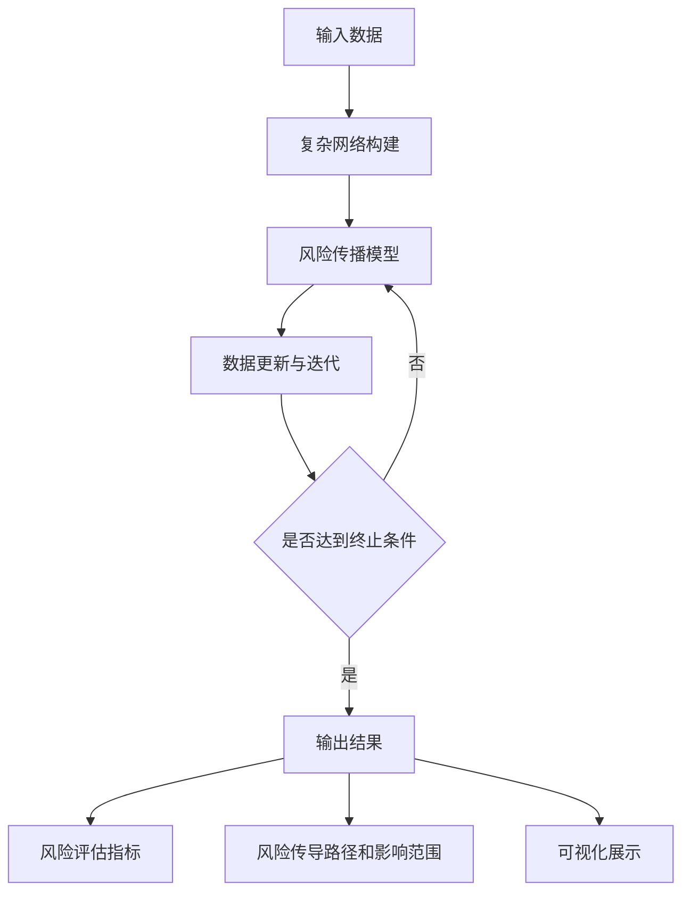

# 金融市场系统性风险传导模拟器

> 关键词：金融市场、系统性风险传导、模拟器、风险评估、金融建模

> 摘要：本文旨在介绍金融市场系统性风险传导模拟器的相关内容。首先阐述了其开发的背景、目的和适用读者，对涉及的核心术语和概念进行解释。接着详细分析了核心概念及其联系，给出了原理和架构的示意图与流程图。通过Python代码阐述了核心算法原理及具体操作步骤，并运用数学模型和公式对其进行深入讲解与举例。以实际案例展示了模拟器在项目中的应用，包括开发环境搭建、源代码实现与解读。探讨了该模拟器在金融领域的实际应用场景，推荐了学习、开发相关的工具和资源，最后总结了其未来发展趋势与挑战，还提供了常见问题解答和扩展阅读参考资料，帮助读者全面了解金融市场系统性风险传导模拟器。

## 1. 背景介绍 
### 1.1 目的和范围
金融市场系统性风险是指由于外部冲击或内部因素导致整个金融体系遭受严重损害甚至崩溃的风险。金融市场系统性风险传导模拟器的主要目的是模拟金融市场中系统性风险的传导过程，帮助金融机构、监管部门和研究者更好地理解风险的传播机制，评估不同情景下的风险程度，从而制定相应的风险管理策略和监管政策。

本模拟器的范围涵盖了多种金融市场主体，如银行、证券机构、保险公司等，以及不同类型的金融资产，如股票、债券、衍生品等。同时，考虑了多种风险因素，如宏观经济波动、利率变动、信用违约等对金融市场的影响。

### 1.2 预期读者
- 金融机构从业人员：包括银行的风险管理部门、证券机构的投资分析人员、保险公司的精算师等，他们可以利用模拟器评估投资组合的风险，制定风险管理策略。
- 监管部门工作人员：如央行、银保监会、证监会等，通过模拟器了解金融市场系统性风险的传导情况，制定和调整监管政策，维护金融稳定。
- 金融研究者：包括高校和科研机构的学者，他们可以利用模拟器进行学术研究，探索金融市场系统性风险的形成机制和传播规律。

### 1.3 文档结构概述
本文将按照以下结构进行阐述：首先介绍金融市场系统性风险传导模拟器的背景信息，包括目的、预期读者和文档结构概述，以及相关术语的定义和解释。接着详细分析核心概念及其联系，给出原理和架构的示意图与流程图。然后讲解核心算法原理及具体操作步骤，通过Python代码进行详细阐述。运用数学模型和公式对其进行深入讲解并举例说明。以实际案例展示模拟器在项目中的应用，包括开发环境搭建、源代码实现与解读。探讨该模拟器在金融领域的实际应用场景，推荐学习、开发相关的工具和资源。最后总结其未来发展趋势与挑战，提供常见问题解答和扩展阅读参考资料。

### 1.4 术语表
#### 1.4.1 核心术语定义
- **系统性风险**：指由整体政治、经济、社会等环境因素对金融市场上所有参与者产生影响的风险，这种风险无法通过分散投资来消除。
- **风险传导**：指风险在金融市场的不同主体、不同资产之间的传播和扩散过程。
- **金融市场主体**：参与金融市场交易的各类机构和个人，如银行、证券机构、保险公司、企业和投资者等。
- **金融资产**：代表未来收益或资产合法要求权的凭证，如股票、债券、基金、衍生品等。
- **风险因素**：可能导致金融市场系统性风险的各种因素，如宏观经济指标（GDP增长率、通货膨胀率等）、利率变动、信用违约等。

#### 1.4.2 相关概念解释
- **风险传染**：与风险传导类似，强调风险在金融市场中的快速传播和相互影响，通常伴随着市场信心的下降和恐慌情绪的蔓延。
- **金融脆弱性**：指金融体系本身所具有的易受冲击和不稳定的特性，是系统性风险产生的内在基础。
- **宏观审慎监管**：一种基于金融体系整体稳定的监管方法，旨在防范系统性风险，维护金融稳定。

#### 1.4.3 缩略词列表
- **GDP**：国内生产总值（Gross Domestic Product）
- **VaR**：风险价值（Value at Risk）
- **CDS**：信用违约互换（Credit Default Swap）

## 2. 核心概念与联系 
### 核心概念原理
金融市场系统性风险传导模拟器的核心原理是基于复杂网络理论和风险传播模型，将金融市场抽象为一个由金融市场主体和金融资产构成的复杂网络。每个金融市场主体可以看作是网络中的节点，金融资产则是连接节点的边。风险因素作为外部冲击，会影响某些节点的状态，进而通过边在网络中进行传播和扩散。

在这个过程中，不同类型的金融市场主体和金融资产具有不同的风险承受能力和风险传导机制。例如，银行之间的同业拆借关系会导致信用风险在银行体系内传导；股票市场的波动会通过投资者的资产配置行为影响其他金融市场。

### 架构的文本示意图
```plaintext
金融市场系统性风险传导模拟器架构

输入层：
- 宏观经济数据（GDP增长率、通货膨胀率等）
- 金融市场主体信息（资产负债表、信用评级等）
- 金融资产信息（价格、收益率等）
- 风险因素设定（利率变动、信用违约概率等）

处理层：
- 复杂网络构建：将金融市场主体和金融资产构建成复杂网络
- 风险传播模型：模拟风险在网络中的传播过程
- 数据更新与迭代：根据风险传播结果更新节点和边的状态

输出层：
- 风险评估指标（VaR、预期损失等）
- 风险传导路径和影响范围
- 可视化展示（网络拓扑图、风险动态变化图等）
```

### Mermaid 流程图


## 3. 核心算法原理 & 具体操作步骤 
### 核心算法原理
本模拟器采用基于代理的建模方法（Agent-Based Modeling，ABM）来模拟金融市场系统性风险的传导过程。在ABM中，每个金融市场主体被看作是一个具有自主决策能力的代理，它们根据自身的状态和环境信息进行决策，从而影响整个金融市场的状态。

具体来说，模拟器的核心算法包括以下几个步骤：
1. **初始化**：设置金融市场主体的初始状态（如资产负债表、信用评级等）、金融资产的初始价格和收益率，以及风险因素的初始值。
2. **风险冲击**：根据设定的风险因素，对某些金融市场主体或金融资产施加冲击，改变其状态。
3. **风险传导**：金融市场主体根据自身的决策规则和市场信息，调整其资产配置和交易行为，从而导致风险在金融市场中传导和扩散。
4. **数据更新**：根据风险传导的结果，更新金融市场主体和金融资产的状态。
5. **终止条件判断**：判断是否达到终止条件（如模拟时间达到设定值、风险传播达到稳定状态等），如果未达到则返回步骤2继续模拟，否则结束模拟。

### 具体操作步骤（Python代码实现）
```python
import numpy as np
import networkx as nx

# 定义金融市场主体类
class FinancialAgent:
    def __init__(self, id, assets, liabilities, credit_rating):
        self.id = id
        self.assets = assets
        self.liabilities = liabilities
        self.credit_rating = credit_rating
        self.default = False

    def update_assets(self, change):
        self.assets += change
        if self.assets < self.liabilities:
            self.default = True

# 初始化金融市场主体
def initialize_agents(num_agents):
    agents = []
    for i in range(num_agents):
        assets = np.random.uniform(100, 1000)
        liabilities = np.random.uniform(50, 500)
        credit_rating = np.random.randint(1, 10)
        agent = FinancialAgent(i, assets, liabilities, credit_rating)
        agents.append(agent)
    return agents

# 构建金融市场网络
def build_network(agents, num_edges):
    G = nx.Graph()
    for agent in agents:
        G.add_node(agent.id)
    while G.number_of_edges() < num_edges:
        node1 = np.random.choice(len(agents))
        node2 = np.random.choice(len(agents))
        if node1!= node2 and not G.has_edge(node1, node2):
            G.add_edge(node1, node2)
    return G

# 风险冲击
def shock_agents(agents, shock_percentage):
    shocked_agent = np.random.choice(agents)
    shock_amount = shocked_agent.assets * shock_percentage
    shocked_agent.update_assets(-shock_amount)
    return shocked_agent

# 风险传导
def propagate_risk(G, agents):
    for edge in G.edges():
        agent1 = agents[edge[0]]
        agent2 = agents[edge[1]]
        if agent1.default:
            exposure = np.random.uniform(0, 1) * agent2.assets
            agent2.update_assets(-exposure)

# 模拟过程
def simulate(num_agents, num_edges, shock_percentage, num_steps):
    agents = initialize_agents(num_agents)
    G = build_network(agents, num_edges)
    shocked_agent = shock_agents(agents, shock_percentage)
    for step in range(num_steps):
        propagate_risk(G, agents)
    default_count = sum([agent.default for agent in agents])
    return default_count

# 运行模拟
num_agents = 100
num_edges = 200
shock_percentage = 0.2
num_steps = 10
default_count = simulate(num_agents, num_edges, shock_percentage, num_steps)
print(f"Number of default agents: {default_count}")
```

### 代码解释
1. **FinancialAgent类**：定义了金融市场主体的基本属性和方法，包括资产、负债、信用评级和违约状态。`update_assets`方法用于更新资产状态，并判断是否违约。
2. **initialize_agents函数**：初始化一定数量的金融市场主体，随机生成其资产、负债和信用评级。
3. **build_network函数**：使用`networkx`库构建金融市场网络，随机连接金融市场主体。
4. **shock_agents函数**：随机选择一个金融市场主体施加风险冲击，减少其资产。
5. **propagate_risk函数**：模拟风险在金融市场网络中的传导过程，如果一个节点违约，会影响与其相连的节点的资产。
6. **simulate函数**：整合了初始化、风险冲击和风险传导的过程，运行指定步数的模拟，并返回违约主体的数量。

## 4. 数学模型和公式 & 详细讲解 & 举例说明 
### 数学模型
本模拟器的核心数学模型基于复杂网络理论和风险传播模型。复杂网络用于描述金融市场主体之间的连接关系，风险传播模型用于模拟风险在网络中的传播过程。

#### 复杂网络模型
我们使用图论来表示金融市场网络，其中节点表示金融市场主体，边表示金融市场主体之间的金融关系（如借贷、投资等）。设 $G=(V, E)$ 表示一个无向图，其中 $V=\{v_1, v_2, \cdots, v_n\}$ 是节点集合，$E=\{e_1, e_2, \cdots, e_m\}$ 是边集合。节点 $v_i$ 的度 $k_i$ 表示与该节点相连的边的数量。

#### 风险传播模型
我们采用SIR（Susceptible-Infected-Recovered）模型的变种来模拟风险的传播过程。在金融市场中，节点可以处于三种状态：易感状态（Susceptible）、感染状态（Infected）和恢复状态（Recovered）。易感状态表示节点未受到风险影响，感染状态表示节点已经受到风险影响，恢复状态表示节点已经从风险中恢复或违约。

设 $S(t)$、$I(t)$ 和 $R(t)$ 分别表示在时间 $t$ 时处于易感状态、感染状态和恢复状态的节点数量，$N=S(t)+I(t)+R(t)$ 表示节点总数。风险传播的动力学方程可以表示为：

$$
\frac{dS(t)}{dt}=-\beta\frac{S(t)I(t)}{N}
$$

$$
\frac{dI(t)}{dt}=\beta\frac{S(t)I(t)}{N}-\gamma I(t)
$$

$$
\frac{dR(t)}{dt}=\gamma I(t)
$$

其中，$\beta$ 是感染率，表示易感节点被感染的概率；$\gamma$ 是恢复率，表示感染节点恢复或违约的概率。

### 详细讲解
#### 复杂网络模型
复杂网络模型可以帮助我们分析金融市场主体之间的连接结构和拓扑特征。例如，节点的度可以反映一个金融市场主体与其他主体的关联程度，度越大表示该主体在金融市场中的影响力越大。网络的聚类系数可以反映节点之间的聚集程度，聚类系数越高表示金融市场主体之间的关联越紧密。

#### 风险传播模型
风险传播模型描述了风险在金融市场网络中的传播过程。感染率 $\beta$ 取决于多种因素，如金融市场主体之间的信用关系、信息传播速度等。恢复率 $\gamma$ 取决于金融市场主体的风险承受能力和应对措施。

### 举例说明
假设一个金融市场网络有 $N = 100$ 个节点，初始时有 $I(0) = 5$ 个感染节点，$S(0) = 95$ 个易感节点，$R(0) = 0$ 个恢复节点。感染率 $\beta = 0.2$，恢复率 $\gamma = 0.1$。

我们可以使用欧拉方法来求解上述动力学方程：

```python
import numpy as np
import matplotlib.pyplot as plt

# 参数设置
N = 100
I0 = 5
S0 = N - I0
R0 = 0
beta = 0.2
gamma = 0.1
t_end = 50
dt = 0.1

# 初始化数组
t = np.arange(0, t_end, dt)
S = np.zeros_like(t)
I = np.zeros_like(t)
R = np.zeros_like(t)
S[0] = S0
I[0] = I0
R[0] = R0

# 欧拉方法求解
for i in range(1, len(t)):
    dS = -beta * S[i-1] * I[i-1] / N * dt
    dI = (beta * S[i-1] * I[i-1] / N - gamma * I[i-1]) * dt
    dR = gamma * I[i-1] * dt
    S[i] = S[i-1] + dS
    I[i] = I[i-1] + dI
    R[i] = R[i-1] + dR

# 绘制结果
plt.plot(t, S, label='Susceptible')
plt.plot(t, I, label='Infected')
plt.plot(t, R, label='Recovered')
plt.xlabel('Time')
plt.ylabel('Number of nodes')
plt.title('Risk propagation in financial network')
plt.legend()
plt.show()
```

通过上述代码，我们可以得到风险在金融市场网络中传播的动态变化图，直观地观察到易感节点、感染节点和恢复节点的数量随时间的变化情况。

## 5. 项目实战：代码实际案例和详细解释说明 
### 5.1  开发环境搭建
#### 操作系统
本项目可以在多种操作系统上进行开发，如Windows、Linux（如Ubuntu）和macOS。

#### 编程语言和库
- **Python**：作为主要的编程语言，推荐使用Python 3.7及以上版本。
- **NumPy**：用于数值计算和数组操作。
- **NetworkX**：用于构建和分析复杂网络。
- **Matplotlib**：用于数据可视化。

#### 安装步骤
可以使用`pip`来安装所需的库：
```sh
pip install numpy networkx matplotlib
```

### 5.2  源代码详细实现和代码解读
以下是一个完整的金融市场系统性风险传导模拟器的代码示例：

```python
import numpy as np
import networkx as nx
import matplotlib.pyplot as plt

# 定义金融市场主体类
class FinancialAgent:
    def __init__(self, id, assets, liabilities, credit_rating):
        self.id = id
        self.assets = assets
        self.liabilities = liabilities
        self.credit_rating = credit_rating
        self.default = False

    def update_assets(self, change):
        self.assets += change
        if self.assets < self.liabilities:
            self.default = True

# 初始化金融市场主体
def initialize_agents(num_agents):
    agents = []
    for i in range(num_agents):
        assets = np.random.uniform(100, 1000)
        liabilities = np.random.uniform(50, 500)
        credit_rating = np.random.randint(1, 10)
        agent = FinancialAgent(i, assets, liabilities, credit_rating)
        agents.append(agent)
    return agents

# 构建金融市场网络
def build_network(agents, num_edges):
    G = nx.Graph()
    for agent in agents:
        G.add_node(agent.id)
    while G.number_of_edges() < num_edges:
        node1 = np.random.choice(len(agents))
        node2 = np.random.choice(len(agents))
        if node1!= node2 and not G.has_edge(node1, node2):
            G.add_edge(node1, node2)
    return G

# 风险冲击
def shock_agents(agents, shock_percentage):
    shocked_agent = np.random.choice(agents)
    shock_amount = shocked_agent.assets * shock_percentage
    shocked_agent.update_assets(-shock_amount)
    return shocked_agent

# 风险传导
def propagate_risk(G, agents):
    for edge in G.edges():
        agent1 = agents[edge[0]]
        agent2 = agents[edge[1]]
        if agent1.default:
            exposure = np.random.uniform(0, 1) * agent2.assets
            agent2.update_assets(-exposure)

# 模拟过程
def simulate(num_agents, num_edges, shock_percentage, num_steps):
    agents = initialize_agents(num_agents)
    G = build_network(agents, num_edges)
    shocked_agent = shock_agents(agents, shock_percentage)
    default_counts = []
    for step in range(num_steps):
        propagate_risk(G, agents)
        default_count = sum([agent.default for agent in agents])
        default_counts.append(default_count)
    return default_counts

# 运行模拟
num_agents = 100
num_edges = 200
shock_percentage = 0.2
num_steps = 20
default_counts = simulate(num_agents, num_edges, shock_percentage, num_steps)

# 绘制结果
plt.plot(range(num_steps), default_counts)
plt.xlabel('Time step')
plt.ylabel('Number of default agents')
plt.title('Financial market systemic risk propagation simulation')
plt.show()
```

### 代码解读与分析
1. **FinancialAgent类**：定义了金融市场主体的基本属性和方法，包括资产、负债、信用评级和违约状态。`update_assets`方法用于更新资产状态，并判断是否违约。
2. **initialize_agents函数**：初始化一定数量的金融市场主体，随机生成其资产、负债和信用评级。
3. **build_network函数**：使用`networkx`库构建金融市场网络，随机连接金融市场主体。
4. **shock_agents函数**：随机选择一个金融市场主体施加风险冲击，减少其资产。
5. **propagate_risk函数**：模拟风险在金融市场网络中的传导过程，如果一个节点违约，会影响与其相连的节点的资产。
6. **simulate函数**：整合了初始化、风险冲击和风险传导的过程，运行指定步数的模拟，并记录每一步的违约主体数量。
7. **主程序**：设置模拟参数，运行模拟，并使用`matplotlib`库绘制违约主体数量随时间的变化图。

通过这个代码示例，我们可以观察到金融市场系统性风险在网络中的传导过程，以及违约主体数量的动态变化。

## 6. 实际应用场景 
### 金融机构风险管理
金融机构可以使用金融市场系统性风险传导模拟器来评估其投资组合的风险。通过模拟不同的风险情景，金融机构可以了解风险在其投资组合中的传导路径和影响范围，从而制定相应的风险管理策略，如调整资产配置、增加风险对冲工具等。

例如，银行可以使用模拟器来评估其同业拆借业务的风险。在模拟中，银行可以设置不同的信用违约概率和利率变动情景，观察风险在银行体系内的传导情况，以及对自身资产负债表的影响。

### 监管部门政策制定
监管部门可以利用模拟器来制定和调整监管政策，防范金融市场系统性风险。通过模拟不同的监管措施对金融市场的影响，监管部门可以评估政策的有效性和合理性，从而优化监管政策。

例如，央行可以使用模拟器来评估提高存款准备金率对金融市场流动性和系统性风险的影响。在模拟中，央行可以设置不同的存款准备金率水平，观察金融市场主体的行为变化和风险传导情况，从而确定最优的存款准备金率政策。

### 学术研究
金融研究者可以使用模拟器进行学术研究，探索金融市场系统性风险的形成机制和传播规律。通过模拟不同的金融市场结构和风险因素，研究者可以深入分析风险的传导过程和影响因素，为金融理论的发展提供实证支持。

例如，研究者可以使用模拟器来研究金融市场网络结构对系统性风险的影响。在模拟中，研究者可以构建不同拓扑结构的金融市场网络，观察风险在不同网络中的传播速度和范围，从而揭示网络结构与系统性风险之间的关系。

## 7. 工具和资源推荐
### 7.1 学习资源推荐
#### 7.1.1 书籍推荐
- 《金融风险管理》（John C. Hull著）：全面介绍了金融风险管理的理论和方法，包括市场风险、信用风险、操作风险等。
- 《复杂网络理论及其应用》（汪小帆等著）：详细介绍了复杂网络的基本概念、模型和分析方法，以及在金融、生物、社会等领域的应用。
- 《Python数据分析实战》（Wes McKinney著）：介绍了使用Python进行数据分析的方法和技巧，包括NumPy、Pandas、Matplotlib等库的使用。

#### 7.1.2 在线课程
- Coursera上的“Financial Markets”课程：由耶鲁大学教授Robert Shiller讲授，介绍了金融市场的基本概念、理论和实践。
- edX上的“Complex Networks”课程：由波士顿大学教授Albert-László Barabási讲授，介绍了复杂网络的基本理论和应用。
- Udemy上的“Python for Data Science and Machine Learning Bootcamp”课程：介绍了使用Python进行数据科学和机器学习的方法和技巧。

#### 7.1.3 技术博客和网站
- Towards Data Science：一个专注于数据科学和机器学习的技术博客，提供了大量的教程和案例分析。
- Medium上的金融科技相关博客：如Fintech Weekly、The Financial Revolutionist等，提供了金融科技领域的最新动态和技术应用。
- 中国金融学术研究网：提供了金融学术研究的最新成果和前沿动态。

### 7.2 开发工具框架推荐
#### 7.2.1 IDE和编辑器
- PyCharm：一款专业的Python集成开发环境，提供了丰富的代码编辑、调试和分析功能。
- Jupyter Notebook：一个交互式的开发环境，适合进行数据探索和可视化。
- Visual Studio Code：一款轻量级的代码编辑器，支持多种编程语言和插件扩展。

#### 7.2.2 调试和性能分析工具
- Py-Spy：一个用于分析Python程序性能的工具，可以实时监测CPU使用率和函数调用情况。
- cProfile：Python标准库中的性能分析模块，可以统计函数调用次数和执行时间。
- pdb：Python标准库中的调试模块，可以用于调试Python程序。

#### 7.2.3 相关框架和库
- NumPy：用于数值计算和数组操作的基础库。
- Pandas：用于数据处理和分析的库，提供了高效的数据结构和数据操作方法。
- NetworkX：用于构建和分析复杂网络的库，提供了丰富的图算法和可视化功能。
- Matplotlib：用于数据可视化的库，提供了多种绘图方式和样式。

### 7.3 相关论文著作推荐
#### 7.3.1 经典论文
- “The Financial Accelerator in a Quantitative Business Cycle Framework”（Bernanke, Gertler, and Gilchrist, 1999）：提出了金融加速器理论，解释了金融市场与实体经济之间的相互作用。
- “Complexity and Contagion”（Allen and Gale, 2000）：研究了金融市场的复杂性和风险传染机制。
- “Systemic Risk and Financial Contagion”（Upper, 2011）：对金融市场系统性风险和风险传染进行了综述和分析。

#### 7.3.2 最新研究成果
- 可以关注《Journal of Financial Economics》、《Review of Financial Studies》、《Journal of Financial Intermediation》等金融领域的顶级学术期刊，获取最新的研究成果。

#### 7.3.3 应用案例分析
- 国际货币基金组织（IMF）和世界银行（WB）的工作报告和研究报告中，经常包含金融市场系统性风险评估和管理的应用案例分析。

## 8. 总结：未来发展趋势与挑战
### 未来发展趋势
#### 多维度风险模拟
未来的金融市场系统性风险传导模拟器将不仅考虑宏观经济因素和金融市场主体之间的连接关系，还将纳入更多的维度，如气候变化风险、科技风险、地缘政治风险等。通过多维度的风险模拟，可以更全面地评估金融市场的系统性风险。

#### 实时数据驱动
随着金融科技的发展，金融市场的数据变得更加丰富和实时。未来的模拟器将能够实时获取和处理金融市场数据，实现动态的风险模拟和预警。例如，通过实时监测金融市场主体的交易数据和信用评级变化，及时调整风险传导模型的参数，提高风险评估的准确性。

#### 人工智能与机器学习应用
人工智能和机器学习技术将在金融市场系统性风险传导模拟器中得到更广泛的应用。例如，使用深度学习算法来预测金融市场的波动和风险传导路径，使用强化学习算法来优化风险管理策略。

### 挑战
#### 数据质量和可得性
金融市场数据的质量和可得性是影响模拟器准确性的重要因素。一方面，金融市场数据存在噪声和缺失值，需要进行数据清洗和预处理；另一方面，一些关键数据（如金融市场主体之间的真实连接关系）可能难以获取，需要通过间接方法进行估计。

#### 模型复杂性和可解释性
随着模拟器的功能不断增强，模型的复杂性也会不断提高。复杂的模型虽然可以更准确地模拟金融市场的实际情况，但也会导致模型的可解释性下降。在实际应用中，决策者需要理解模型的运行机制和结果，因此如何在保证模型准确性的前提下提高模型的可解释性是一个挑战。

#### 监管和合规要求
金融市场系统性风险传导模拟器的应用需要符合相关的监管和合规要求。例如，在使用模拟器进行风险评估和决策时，需要保证模型的透明度和公正性，避免对金融市场造成不必要的影响。

## 9. 附录：常见问题与解答
### 1. 模拟器的准确性如何保证？
模拟器的准确性受到多种因素的影响，包括数据质量、模型假设和参数设置等。为了保证模拟器的准确性，需要采用高质量的金融市场数据，并进行严格的数据清洗和预处理。同时，需要对模型的假设和参数进行合理的设置，并通过历史数据进行验证和校准。此外，还可以采用多种模型进行对比分析，提高风险评估的准确性。

### 2. 模拟器能否预测金融市场的未来走势？
模拟器不能完全准确地预测金融市场的未来走势，因为金融市场是一个复杂的、不确定的系统，受到多种因素的影响。模拟器的主要作用是模拟不同风险情景下金融市场系统性风险的传导过程，帮助用户了解风险的传播机制和影响范围，从而制定相应的风险管理策略。

### 3. 如何选择合适的风险因素进行模拟？
选择合适的风险因素需要考虑金融市场的实际情况和研究目的。一般来说，可以选择宏观经济指标（如GDP增长率、通货膨胀率等）、利率变动、信用违约概率等作为风险因素。同时，还可以根据具体的研究问题，选择其他相关的风险因素，如行业风险、政策风险等。

### 4. 模拟器的运行时间较长怎么办？
如果模拟器的运行时间较长，可以考虑以下方法进行优化：
- 优化代码：使用更高效的算法和数据结构，减少不必要的计算和内存开销。
- 并行计算：使用多核处理器或分布式计算平台，并行运行模拟任务，提高计算效率。
- 简化模型：在保证模型准确性的前提下，适当简化模型的复杂度，减少计算量。

## 10. 扩展阅读 & 参考资料
### 扩展阅读
- 《金融科技前沿：技术驱动的金融创新》：介绍了金融科技的最新发展和应用，包括区块链、人工智能、大数据等技术在金融领域的应用。
- 《货币金融学》：全面介绍了货币、银行、金融市场等方面的理论和实践，为理解金融市场系统性风险提供了理论基础。
- 《金融监管的边界》：探讨了金融监管的目标、原则和方法，以及如何在防范系统性风险和促进金融创新之间找到平衡。

### 参考资料
- 国际清算银行（BIS）的相关报告和研究论文。
- 各国央行和金融监管部门的官方网站，获取最新的金融政策和监管信息。
- 相关学术数据库，如IEEE Xplore、ACM Digital Library等，获取金融领域的最新研究成果。

作者：AI天才研究院/AI Genius Institute & 禅与计算机程序设计艺术 /Zen And The Art of Computer Programming