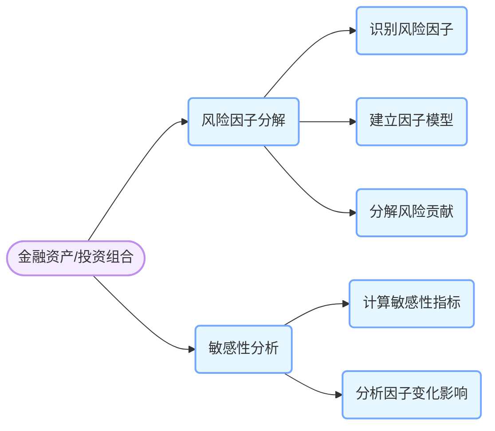

# 金融市场风险因子分解与敏感性分析

> 关键词：金融市场、风险因子分解、敏感性分析、因子模型、风险管理

> 摘要：本文聚焦于金融市场的风险因子分解与敏感性分析。详细介绍了相关背景知识，包括目的、预期读者等。深入探讨了核心概念及其联系，阐述了核心算法原理并给出Python代码示例。通过数学模型和公式进一步解释其原理，结合实际案例展示代码实现与分析。同时，列举了该技术在金融领域的实际应用场景，推荐了学习资源、开发工具框架以及相关论文著作。最后对未来发展趋势与挑战进行总结，并给出常见问题解答和扩展阅读参考资料，旨在为金融从业者和研究者提供全面深入的技术指导。

## 1. 背景介绍 
### 1.1 目的和范围
金融市场充满了各种不确定性和风险，准确地识别、度量和管理这些风险对于投资者、金融机构和监管部门至关重要。风险因子分解与敏感性分析作为金融风险管理的重要工具，旨在将金融资产或投资组合的风险分解为不同的驱动因素，并分析这些因素对资产价值或投资组合回报的敏感程度。

本文的范围涵盖了风险因子分解与敏感性分析的基本概念、核心算法、数学模型，以及在实际金融市场中的应用。通过理论讲解和实际案例分析，帮助读者理解如何运用这些技术进行有效的风险管理。

### 1.2 预期读者
本文预期读者包括金融从业者，如投资经理、风险分析师、交易员等，他们可以通过本文了解风险因子分解与敏感性分析的方法和应用，提升风险管理能力。同时，也适合金融领域的研究者和学生，为他们的学术研究和学习提供参考。

### 1.3 文档结构概述
本文首先介绍相关背景知识，包括目的、预期读者和文档结构。接着阐述核心概念与联系，通过文本示意图和Mermaid流程图进行说明。然后讲解核心算法原理，并给出Python源代码示例。再通过数学模型和公式详细解释其原理，并举例说明。之后进行项目实战，展示代码实际案例和详细解释。接着介绍实际应用场景，推荐学习资源、开发工具框架和相关论文著作。最后总结未来发展趋势与挑战，给出常见问题解答和扩展阅读参考资料。

### 1.4 术语表
#### 1.4.1 核心术语定义
- **风险因子**：影响金融资产价格或投资组合回报的各种因素，如利率、汇率、股票指数、大宗商品价格等。
- **风险因子分解**：将金融资产或投资组合的风险分解为不同风险因子的贡献，以便更好地理解风险的来源和结构。
- **敏感性分析**：研究当一个或多个风险因子发生变化时，金融资产价格或投资组合回报的变化程度。
- **因子模型**：一种描述金融资产回报与风险因子之间关系的数学模型，常见的有单因子模型和多因子模型。

#### 1.4.2 相关概念解释
- **系统性风险**：由宏观经济因素、市场整体波动等不可分散的因素引起的风险，对整个市场或大部分资产产生影响。
- **非系统性风险**：由个别资产或公司特有的因素引起的风险，可以通过分散投资来降低。
- **Beta系数**：衡量一种资产或投资组合相对于市场整体波动的敏感性指标。

#### 1.4.3 缩略词列表
- **CAPM**：Capital Asset Pricing Model，资本资产定价模型
- **APT**：Arbitrage Pricing Theory，套利定价理论
- **VaR**：Value at Risk，风险价值

## 2. 核心概念与联系 

### 核心概念原理
风险因子分解的核心思想是将金融资产或投资组合的风险归因于不同的风险因子。通过建立因子模型，可以描述资产回报与风险因子之间的关系。例如，单因子模型可以表示为：

$$R_i = \alpha_i + \beta_i R_m + \epsilon_i$$

其中，$R_i$ 是资产 $i$ 的回报，$\alpha_i$ 是资产 $i$ 的超额回报，$\beta_i$ 是资产 $i$ 对市场因子 $R_m$ 的敏感性，$\epsilon_i$ 是资产 $i$ 的特异性回报。

敏感性分析则是在因子模型的基础上，研究当风险因子发生变化时，资产回报的变化情况。可以通过计算资产回报对风险因子的偏导数来衡量敏感性。

### 架构的文本示意图
```plaintext
金融资产/投资组合
|
|-- 风险因子分解
|   |-- 识别风险因子
|   |-- 建立因子模型
|   |-- 分解风险贡献
|
|-- 敏感性分析
|   |-- 计算敏感性指标
|   |-- 分析因子变化影响
```

### Mermaid流程图


## 3. 核心算法原理 & 具体操作步骤 

### 单因子模型算法原理
单因子模型假设资产回报只与一个市场因子相关。其核心公式为：

$$R_i = \alpha_i + \beta_i R_m + \epsilon_i$$

其中，$\alpha_i$ 和 $\beta_i$ 是待估计的参数，可以通过最小二乘法进行估计。最小二乘法的目标是使残差平方和最小，即：

$$\min_{\alpha_i, \beta_i} \sum_{t=1}^{T} (R_{i,t} - \alpha_i - \beta_i R_{m,t})^2$$

### Python代码实现
```python
import numpy as np
import pandas as pd
import statsmodels.api as sm

# 生成示例数据
np.random.seed(0)
n_periods = 100
market_returns = np.random.normal(0.01, 0.05, n_periods)
asset_returns = 0.02 + 1.2 * market_returns + np.random.normal(0, 0.03, n_periods)

# 构建数据框
data = pd.DataFrame({
    'Market Returns': market_returns,
    'Asset Returns': asset_returns
})

# 添加常数项
X = sm.add_constant(data['Market Returns'])
y = data['Asset Returns']

# 拟合线性回归模型
model = sm.OLS(y, X).fit()

# 输出结果
print(model.summary())
```

### 代码解释
1. **数据生成**：使用 `numpy` 生成市场回报和资产回报的示例数据。
2. **数据框构建**：使用 `pandas` 构建数据框，方便后续处理。
3. **添加常数项**：使用 `statsmodels` 的 `add_constant` 函数为自变量添加常数项。
4. **拟合线性回归模型**：使用 `statsmodels` 的 `OLS` 函数拟合线性回归模型。
5. **输出结果**：使用 `summary` 方法输出模型的详细信息，包括参数估计值、显著性检验等。

### 多因子模型算法原理
多因子模型考虑了多个风险因子对资产回报的影响。其公式可以表示为：

$$R_i = \alpha_i + \sum_{j=1}^{k} \beta_{ij} F_j + \epsilon_i$$

其中，$F_j$ 是第 $j$ 个风险因子，$\beta_{ij}$ 是资产 $i$ 对第 $j$ 个风险因子的敏感性。同样可以使用最小二乘法估计参数。

### Python代码实现
```python
# 生成示例数据
np.random.seed(0)
n_periods = 100
factor1 = np.random.normal(0.01, 0.05, n_periods)
factor2 = np.random.normal(0.02, 0.06, n_periods)
asset_returns = 0.03 + 1.1 * factor1 + 0.9 * factor2 + np.random.normal(0, 0.04, n_periods)

# 构建数据框
data = pd.DataFrame({
    'Factor 1': factor1,
    'Factor 2': factor2,
    'Asset Returns': asset_returns
})

# 添加常数项
X = sm.add_constant(data[['Factor 1', 'Factor 2']])
y = data['Asset Returns']

# 拟合线性回归模型
model = sm.OLS(y, X).fit()

# 输出结果
print(model.summary())
```

### 代码解释
与单因子模型类似，只是自变量变为多个风险因子。通过 `statsmodels` 的 `OLS` 函数拟合多因子线性回归模型，并输出结果。

## 4. 数学模型和公式 & 详细讲解 & 举例说明 

### 单因子模型
单因子模型的公式为：

$$R_i = \alpha_i + \beta_i R_m + \epsilon_i$$

其中：
- $R_i$ 是资产 $i$ 在某一时期的回报。
- $\alpha_i$ 是资产 $i$ 的超额回报，即不依赖于市场因子的回报。
- $\beta_i$ 是资产 $i$ 对市场因子 $R_m$ 的敏感性，也称为 Beta 系数。
- $\epsilon_i$ 是资产 $i$ 的特异性回报，代表与市场因子无关的随机波动。

#### 举例说明
假设市场回报率 $R_m$ 为 0.05，某资产的 $\alpha_i$ 为 0.01，$\beta_i$ 为 1.2。则该资产的预期回报为：

$$R_i = 0.01 + 1.2 \times 0.05 = 0.07$$

### 多因子模型
多因子模型的公式为：

$$R_i = \alpha_i + \sum_{j=1}^{k} \beta_{ij} F_j + \epsilon_i$$

其中：
- $F_j$ 是第 $j$ 个风险因子。
- $\beta_{ij}$ 是资产 $i$ 对第 $j$ 个风险因子的敏感性。

#### 举例说明
假设存在两个风险因子 $F_1$ 和 $F_2$，某资产的 $\alpha_i$ 为 0.02，$\beta_{i1}$ 为 1.1，$\beta_{i2}$ 为 0.9，$F_1$ 的值为 0.03，$F_2$ 的值为 0.04。则该资产的预期回报为：

$$R_i = 0.02 + 1.1 \times 0.03 + 0.9 \times 0.04 = 0.089$$

### 敏感性分析公式
敏感性分析可以通过计算资产回报对风险因子的偏导数来衡量。对于单因子模型，资产回报对市场因子的敏感性为：

$$\frac{\partial R_i}{\partial R_m} = \beta_i$$

对于多因子模型，资产回报对第 $j$ 个风险因子的敏感性为：

$$\frac{\partial R_i}{\partial F_j} = \beta_{ij}$$

#### 举例说明
在上述单因子模型的例子中，资产对市场因子的敏感性为 1.2。这意味着当市场回报率每增加 1% 时，该资产的预期回报将增加 1.2%。

## 5. 项目实战：代码实际案例和详细解释说明 

### 5.1  开发环境搭建
#### 安装Python
首先需要安装 Python 环境，建议使用 Python 3.7 及以上版本。可以从 Python 官方网站（https://www.python.org/downloads/） 下载并安装。

#### 安装必要的库
使用 `pip` 安装必要的库，包括 `numpy`、`pandas`、`statsmodels` 等。可以使用以下命令进行安装：

```sh
pip install numpy pandas statsmodels
```

### 5.2  源代码详细实现和代码解读
#### 数据获取
假设我们使用雅虎财经 API 获取股票数据和市场指数数据。以下是获取数据的代码：

```python
import yfinance as yf

# 定义股票和市场指数代码
stock_symbol = 'AAPL'
market_symbol = '^GSPC'

# 定义时间范围
start_date = '2020-01-01'
end_date = '2021-01-01'

# 获取数据
stock_data = yf.download(stock_symbol, start=start_date, end=end_date)
market_data = yf.download(market_symbol, start=start_date, end=end_date)

# 计算每日回报率
stock_returns = stock_data['Adj Close'].pct_change().dropna()
market_returns = market_data['Adj Close'].pct_change().dropna()
```

#### 代码解读
1. **导入库**：使用 `yfinance` 库获取股票和市场指数数据。
2. **定义代码和时间范围**：指定要获取的股票代码和市场指数代码，以及时间范围。
3. **获取数据**：使用 `yf.download` 函数获取数据。
4. **计算回报率**：使用 `pct_change` 函数计算每日回报率，并去除缺失值。

#### 单因子模型拟合
```python
import statsmodels.api as sm

# 添加常数项
X = sm.add_constant(market_returns)
y = stock_returns

# 拟合线性回归模型
model = sm.OLS(y, X).fit()

# 输出结果
print(model.summary())
```

#### 代码解读
1. **添加常数项**：使用 `statsmodels` 的 `add_constant` 函数为市场回报率添加常数项。
2. **拟合线性回归模型**：使用 `statsmodels` 的 `OLS` 函数拟合单因子线性回归模型。
3. **输出结果**：使用 `summary` 方法输出模型的详细信息。

### 5.3  代码解读与分析
#### 模型结果分析
通过 `model.summary()` 输出的结果，我们可以得到以下信息：
- **参数估计值**：包括 $\alpha$ 和 $\beta$ 的估计值，以及它们的标准误差和显著性检验结果。
- **拟合优度**：通过 $R^2$ 和调整后的 $R^2$ 衡量模型的拟合程度。
- **残差分析**：检查残差是否满足正态分布、独立性等假设。

#### 敏感性分析
根据模型的 $\beta$ 值，我们可以进行敏感性分析。例如，如果 $\beta$ 值为 1.2，则意味着该股票的回报率对市场回报率的变化较为敏感，市场回报率每增加 1%，该股票的回报率预计将增加 1.2%。

## 6. 实际应用场景 
### 投资组合管理
在投资组合管理中，风险因子分解与敏感性分析可以帮助投资者识别投资组合的主要风险来源，优化投资组合的配置。通过分析不同风险因子对投资组合回报的贡献，投资者可以调整资产权重，降低投资组合的风险。

### 风险管理
金融机构可以使用风险因子分解与敏感性分析来评估自身的风险状况，制定风险管理策略。例如，银行可以分析利率、汇率等风险因子对其资产负债表的影响，采取相应的对冲措施。

### 资产定价
风险因子分解与敏感性分析在资产定价中也有重要应用。通过建立因子模型，可以更准确地估计资产的预期回报，从而为资产定价提供依据。例如，资本资产定价模型（CAPM）就是一种基于单因子模型的资产定价模型。

### 业绩评估
投资者和基金经理可以使用风险因子分解与敏感性分析来评估投资组合的业绩。通过比较投资组合的实际回报与基于因子模型的预期回报，可以判断投资组合的业绩是否优于市场平均水平。

## 7. 工具和资源推荐
### 7.1 学习资源推荐
#### 7.1.1 书籍推荐
- 《投资学》（Investments），作者：滋维·博迪（Zvi Bodie）等。这本书是投资学领域的经典教材，涵盖了投资组合理论、资产定价模型、风险管理等内容。
- 《金融风险管理师（FRM）考试手册》（FRM Handbook），作者：菲利普·乔瑞（Philippe Jorion）。该书是 FRM 考试的重要参考书籍，对金融风险管理的各个方面进行了详细介绍。

#### 7.1.2 在线课程
- Coursera 上的“金融市场”（Financial Markets）课程，由耶鲁大学的罗伯特·席勒（Robert Shiller）教授授课，介绍了金融市场的基本概念、资产定价理论等内容。
- edX 上的“风险管理与金融机构”（Risk Management and Financial Institutions）课程，由纽约大学的约翰·赫尔（John Hull）教授授课，深入讲解了金融风险管理的方法和技术。

#### 7.1.3 技术博客和网站
- 量化投资与机器学习社区（https://www.joinquant.com/）：提供量化投资和机器学习的相关知识、代码示例和社区交流平台。
- 优矿（https://uqer.datayes.com/）：专注于金融数据和量化分析，提供丰富的金融数据接口和量化策略开发工具。

### 7.2 开发工具框架推荐
#### 7.2.1 IDE和编辑器
- PyCharm：一款专业的 Python 集成开发环境，提供代码编辑、调试、版本控制等功能。
- Jupyter Notebook：一种交互式的编程环境，适合进行数据分析和模型开发，支持 Python、R 等多种编程语言。

#### 7.2.2 调试和性能分析工具
- `pdb`：Python 内置的调试工具，可以帮助开发者定位代码中的错误。
- `cProfile`：Python 标准库中的性能分析工具，可以分析代码的运行时间和函数调用次数。

#### 7.2.3 相关框架和库
- `numpy`：用于数值计算和数组操作的 Python 库。
- `pandas`：用于数据处理和分析的 Python 库，提供了丰富的数据结构和数据操作方法。
- `statsmodels`：用于统计建模和计量经济学分析的 Python 库，支持线性回归、时间序列分析等多种模型。

### 7.3 相关论文著作推荐
#### 7.3.1 经典论文
- 《资本资产定价：风险条件下的市场均衡理论》（Capital Asset Prices: A Theory of Market Equilibrium under Conditions of Risk），作者：威廉·夏普（William Sharpe）。该论文提出了资本资产定价模型（CAPM），是现代金融理论的重要基石。
- 《套利定价理论》（Arbitrage Pricing Theory），作者：斯蒂芬·罗斯（Stephen Ross）。该论文提出了套利定价理论（APT），为多因子模型的发展奠定了基础。

#### 7.3.2 最新研究成果
可以关注《金融研究评论》（Review of Financial Studies）、《金融经济学杂志》（Journal of Financial Economics）等顶级金融学术期刊，了解风险因子分解与敏感性分析领域的最新研究成果。

#### 7.3.3 应用案例分析
可以参考一些金融机构的研究报告和案例分析，了解风险因子分解与敏感性分析在实际金融市场中的应用。例如，摩根大通的《市场风险分析报告》、高盛的《投资组合风险管理案例》等。

## 8. 总结：未来发展趋势与挑战
### 未来发展趋势
#### 多因子模型的扩展
随着金融市场的不断发展和复杂化，传统的单因子和多因子模型可能无法完全解释资产回报的变化。未来，多因子模型可能会进一步扩展，纳入更多的风险因子，如宏观经济变量、行业特定因子等。

#### 机器学习和人工智能的应用
机器学习和人工智能技术在金融领域的应用越来越广泛。未来，这些技术可能会被用于风险因子的识别和筛选、因子模型的构建和优化等方面，提高风险因子分解与敏感性分析的准确性和效率。

#### 实时风险监测和预警
随着金融市场的实时性和波动性不断增加，实时风险监测和预警变得越来越重要。未来，风险因子分解与敏感性分析可能会与实时数据和信息技术相结合，实现对金融市场风险的实时监测和预警。

### 挑战
#### 数据质量和可得性
风险因子分解与敏感性分析需要大量的高质量数据支持。然而，金融数据往往存在噪声、缺失值等问题，数据的可得性也受到限制。如何获取和处理高质量的数据是一个挑战。

#### 模型的复杂性和解释性
随着模型的不断扩展和复杂化，模型的解释性变得越来越困难。如何在提高模型准确性的同时，保持模型的解释性，是一个需要解决的问题。

#### 市场的不确定性和波动性
金融市场具有高度的不确定性和波动性，风险因子的关系和影响也可能随时间发生变化。如何应对市场的不确定性和波动性，提高风险因子分解与敏感性分析的适应性，是一个挑战。

## 9. 附录：常见问题与解答
### 问题1：如何选择合适的风险因子？
答：选择合适的风险因子需要考虑多个因素，包括理论依据、数据可得性、因子的解释性等。可以参考相关的金融理论和研究成果，结合实际情况选择具有代表性和解释力的风险因子。

### 问题2：因子模型的假设条件有哪些？
答：不同的因子模型有不同的假设条件。一般来说，因子模型假设资产回报与风险因子之间存在线性关系，残差项相互独立且服从正态分布等。

### 问题3：如何评估因子模型的拟合效果？
答：可以通过 $R^2$、调整后的 $R^2$、F 检验等指标评估因子模型的拟合效果。同时，还可以进行残差分析，检查残差是否满足正态分布、独立性等假设。

### 问题4：敏感性分析的结果受哪些因素影响？
答：敏感性分析的结果受多种因素影响，包括因子模型的选择、风险因子的变化范围、数据的质量等。在进行敏感性分析时，需要注意这些因素的影响，并进行合理的假设和处理。

## 10. 扩展阅读 & 参考资料
### 扩展阅读
- 《金融时间序列分析》（Financial Time Series Analysis），作者：蔡瑞胸（Ruey S. Tsay）。该书介绍了金融时间序列的建模和分析方法，对于深入理解金融市场的动态变化有很大帮助。
- 《Python 金融数据分析实战》（Python for Finance: Analyze Big Financial Data），作者：Yves Hilpisch。该书通过实际案例介绍了如何使用 Python 进行金融数据分析和建模。

### 参考资料
- Bodie, Z., Kane, A., & Marcus, A. J. (2018). Investments. McGraw-Hill Education.
- Jorion, P. (2017). Financial Risk Manager Handbook. Wiley.
- Sharpe, W. F. (1964). Capital asset prices: A theory of market equilibrium under conditions of risk. The Journal of Finance, 19(3), 425-442.
- Ross, S. A. (1976). The arbitrage theory of capital asset pricing. Journal of Economic Theory, 13(3), 341-360.

作者：AI天才研究院/AI Genius Institute & 禅与计算机程序设计艺术 /Zen And The Art of Computer Programming