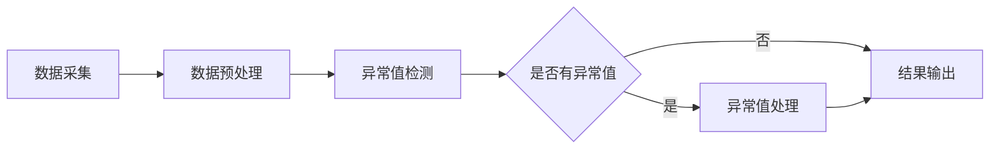

# 金融数据异常值检测与处理平台

> 关键词：金融数据、异常值检测、异常值处理、数据平台、机器学习

> 摘要：本文围绕金融数据异常值检测与处理平台展开深入探讨。在金融领域，数据的准确性和可靠性至关重要，而异常值的存在可能会对分析结果和决策产生严重影响。文章首先介绍了该平台开发的背景、目的、预期读者等内容。接着详细阐述了异常值检测与处理的核心概念、相关算法原理，并给出了具体的Python代码实现。通过数学模型和公式进一步解释了算法的原理。然后结合实际项目案例，讲解了开发环境搭建、源代码实现及解读。还探讨了该平台的实际应用场景，推荐了相关的学习资源、开发工具和论文著作。最后总结了未来的发展趋势与挑战，并提供了常见问题的解答以及扩展阅读和参考资料，旨在为金融数据异常值检测与处理提供全面且深入的技术指导。

## 1. 背景介绍 
### 1.1 目的和范围
在金融领域，数据是决策的重要依据。然而，金融数据中常常存在异常值，这些异常值可能是由于数据录入错误、系统故障、市场突发情况等原因产生的。异常值的存在可能会影响金融分析的准确性，如风险评估、投资决策等。本金融数据异常值检测与处理平台的目的在于提供一个高效、准确且易用的工具，帮助金融机构和相关从业者检测和处理金融数据中的异常值，提高数据质量和分析结果的可靠性。

本平台的范围涵盖了多种常见的金融数据类型，包括但不限于股票价格、汇率、利率、交易量等。支持多种异常值检测和处理方法，适用于不同规模和复杂度的金融数据集。

### 1.2 预期读者
本平台的预期读者主要包括以下几类人群：
- **金融从业者**：如银行分析师、投资经理、风险评估师等，他们需要处理大量的金融数据，该平台可以帮助他们提高数据处理效率和分析结果的准确性。
- **数据科学家和分析师**：负责对金融数据进行深入挖掘和分析，平台提供的多种算法和工具可以满足他们的研究需求。
- **软件开发人员**：对金融数据处理和异常值检测算法感兴趣的开发者，可以参考平台的实现原理和代码，进行二次开发或优化。

### 1.3 文档结构概述
本文将按照以下结构进行阐述：
- **核心概念与联系**：介绍金融数据异常值的相关概念、检测与处理的原理以及它们之间的联系，并通过示意图和流程图进行直观展示。
- **核心算法原理 & 具体操作步骤**：详细讲解常用的异常值检测和处理算法，并用Python代码实现。
- **数学模型和公式 & 详细讲解 & 举例说明**：通过数学模型和公式解释算法的原理，并结合实际例子进行说明。
- **项目实战：代码实际案例和详细解释说明**：给出一个具体的项目案例，包括开发环境搭建、源代码实现和代码解读。
- **实际应用场景**：探讨该平台在金融领域的实际应用场景。
- **工具和资源推荐**：推荐相关的学习资源、开发工具和论文著作。
- **总结：未来发展趋势与挑战**：总结金融数据异常值检测与处理的未来发展趋势和面临的挑战。
- **附录：常见问题与解答**：解答一些常见的问题。
- **扩展阅读 & 参考资料**：提供相关的扩展阅读内容和参考资料。

### 1.4 术语表
#### 1.4.1 核心术语定义
- **金融数据**：指与金融市场、金融机构、金融交易等相关的数据，如股票价格、汇率、利率等。
- **异常值**：在数据集中与其他数据点明显不同的数据点，可能是由于错误、特殊事件等原因产生的。
- **异常值检测**：从数据集中识别出异常值的过程。
- **异常值处理**：对检测出的异常值进行处理的过程，如删除、替换、修正等。

#### 1.4.2 相关概念解释
- **数据质量**：指数据的准确性、完整性、一致性等特征。异常值的存在会影响数据质量。
- **统计分析**：通过对数据的统计特征进行分析，如均值、方差等，来检测异常值。
- **机器学习算法**：利用机器学习模型，如聚类算法、分类算法等，来检测异常值。

#### 1.4.3 缩略词列表
- **PCA**：主成分分析（Principal Component Analysis）
- **KNN**：k近邻算法（k-Nearest Neighbors）
- **SVM**：支持向量机（Support Vector Machine）

## 2. 核心概念与联系 
### 核心概念原理
#### 异常值的产生原因
金融数据中的异常值可能由多种原因产生，主要包括以下几个方面：
- **数据录入错误**：人工录入数据时可能会出现输入错误，如误输入数字、遗漏数据等。
- **系统故障**：数据采集系统、传输系统或存储系统出现故障，可能会导致数据异常。
- **市场突发情况**：如重大政策调整、突发事件等，可能会导致金融市场出现异常波动，从而产生异常数据。

#### 异常值检测方法
常见的异常值检测方法可以分为以下几类：
- **基于统计的方法**：通过计算数据的统计特征，如均值、标准差等，来判断数据点是否为异常值。例如，若某个数据点与均值的距离超过一定倍数的标准差，则认为该数据点为异常值。
- **基于机器学习的方法**：利用机器学习模型，如聚类算法、分类算法等，来检测异常值。例如，聚类算法可以将数据点划分为不同的簇，离群的点可能被视为异常值。
- **基于深度学习的方法**：利用深度学习模型，如神经网络，来学习数据的分布特征，从而检测异常值。

#### 异常值处理方法
常见的异常值处理方法包括以下几种：
- **删除异常值**：直接将检测出的异常值从数据集中删除。这种方法简单直接，但可能会导致数据丢失。
- **替换异常值**：用合理的值替换异常值，如用均值、中位数等统计量替换。
- **修正异常值**：根据数据的上下文信息或相关模型，对异常值进行修正。

### 架构的文本示意图
金融数据异常值检测与处理平台的架构主要包括数据采集层、数据预处理层、异常值检测层、异常值处理层和结果输出层。
- **数据采集层**：负责从各种数据源采集金融数据，如数据库、文件系统、网络接口等。
- **数据预处理层**：对采集到的数据进行清洗、转换、归一化等预处理操作，以提高数据质量。
- **异常值检测层**：利用各种异常值检测算法对预处理后的数据进行检测，识别出异常值。
- **异常值处理层**：根据检测结果，对异常值进行处理，如删除、替换、修正等。
- **结果输出层**：将处理后的数据输出到指定的目标，如数据库、文件系统、可视化界面等。

### Mermaid 流程图


## 3. 核心算法原理 & 具体操作步骤 
### 基于统计的异常值检测算法 - Z-score 方法
#### 算法原理
Z-score 方法是一种基于统计的异常值检测方法，它通过计算数据点与均值的距离，并将其标准化为 Z-score 值。Z-score 的计算公式为：
$$Z = \frac{X - \mu}{\sigma}$$
其中，$X$ 是数据点的值，$\mu$ 是数据集的均值，$\sigma$ 是数据集的标准差。

一般来说，如果某个数据点的 Z-score 的绝对值大于某个阈值（通常为 3），则认为该数据点为异常值。

#### Python 代码实现
```python
import numpy as np

def z_score_outlier_detection(data, threshold=3):
    mean = np.mean(data)
    std = np.std(data)
    z_scores = np.abs((data - mean) / std)
    outliers = data[z_scores > threshold]
    return outliers

# 示例数据
data = np.array([1, 2, 3, 4, 5, 100])
outliers = z_score_outlier_detection(data)
print("异常值:", outliers)
```
#### 具体操作步骤
1. 计算数据集的均值和标准差。
2. 计算每个数据点的 Z-score 值。
3. 根据阈值判断每个数据点是否为异常值。
4. 输出异常值。

### 基于机器学习的异常值检测算法 - KNN 方法
#### 算法原理
KNN 方法是一种基于机器学习的异常值检测方法，它通过计算每个数据点与其最近的 k 个邻居的距离，来判断该数据点是否为异常值。如果某个数据点与其最近的 k 个邻居的距离远大于其他数据点，则认为该数据点为异常值。

#### Python 代码实现
```python
from sklearn.neighbors import NearestNeighbors
import numpy as np

def knn_outlier_detection(data, n_neighbors=5, threshold=3):
    nbrs = NearestNeighbors(n_neighbors=n_neighbors).fit(data.reshape(-1, 1))
    distances, _ = nbrs.kneighbors(data.reshape(-1, 1))
    mean_distances = np.mean(distances, axis=1)
    std_distance = np.std(mean_distances)
    mean_distance_mean = np.mean(mean_distances)
    z_scores = np.abs((mean_distances - mean_distance_mean) / std_distance)
    outliers = data[z_scores > threshold]
    return outliers

# 示例数据
data = np.array([1, 2, 3, 4, 5, 100])
outliers = knn_outlier_detection(data)
print("异常值:", outliers)
```
#### 具体操作步骤
1. 选择合适的 k 值。
2. 计算每个数据点与其最近的 k 个邻居的距离。
3. 计算每个数据点的平均距离。
4. 根据平均距离的统计特征（如均值、标准差）计算 Z-score 值。
5. 根据阈值判断每个数据点是否为异常值。
6. 输出异常值。

## 4. 数学模型和公式 & 详细讲解 & 举例说明 
### Z-score 方法的数学模型和公式
#### 数学模型
Z-score 方法基于正态分布的假设，认为数据集中的数据点服从正态分布。在正态分布中，大部分数据点集中在均值附近，而远离均值的数据点出现的概率较小。

#### 公式详细讲解
$$Z = \frac{X - \mu}{\sigma}$$
其中，$Z$ 是 Z-score 值，$X$ 是数据点的值，$\mu$ 是数据集的均值，$\sigma$ 是数据集的标准差。

Z-score 值表示数据点与均值的距离，以标准差为单位。如果 Z-score 的绝对值大于某个阈值（通常为 3），则认为该数据点为异常值，因为在正态分布中，数据点落在均值加减 3 倍标准差范围之外的概率非常小（约为 0.3%）。

#### 举例说明
假设有一个数据集 $X = \{1, 2, 3, 4, 5, 100\}$，首先计算均值 $\mu$ 和标准差 $\sigma$：
$$\mu = \frac{1 + 2 + 3 + 4 + 5 + 100}{6} = \frac{115}{6} \approx 19.17$$
$$\sigma = \sqrt{\frac{\sum_{i=1}^{6}(x_i - \mu)^2}{6}} \approx 38.08$$
对于数据点 $x = 100$，其 Z-score 值为：
$$Z = \frac{100 - 19.17}{38.08} \approx 2.12$$
假设阈值为 3，则该数据点不是异常值。但如果数据点的 Z-score 绝对值大于 3，则认为该数据点为异常值。

### KNN 方法的数学模型和公式
#### 数学模型
KNN 方法基于数据点的局部密度和距离信息。正常的数据点通常会聚集在一起，而异常值则会远离其他数据点。通过计算每个数据点与其最近的 k 个邻居的距离，可以判断数据点的局部密度和是否离群。

#### 公式详细讲解
1. 计算每个数据点与其最近的 k 个邻居的距离 $d_{i,j}$，其中 $i$ 表示数据点的索引，$j$ 表示邻居的索引。
2. 计算每个数据点的平均距离 $\bar{d}_i$：
$$\bar{d}_i = \frac{1}{k} \sum_{j=1}^{k} d_{i,j}$$
3. 计算平均距离的均值 $\mu_{\bar{d}}$ 和标准差 $\sigma_{\bar{d}}$。
4. 计算每个数据点的 Z-score 值 $Z_i$：
$$Z_i = \frac{\bar{d}_i - \mu_{\bar{d}}}{\sigma_{\bar{d}}}$$
如果 $Z_i$ 的绝对值大于某个阈值，则认为该数据点为异常值。

#### 举例说明
假设有一个数据集 $X = \{1, 2, 3, 4, 5, 100\}$，选择 $k = 2$。
- 对于数据点 $x = 1$，其最近的两个邻居是 2 和 3，距离分别为 1 和 2，平均距离 $\bar{d}_1 = \frac{1 + 2}{2} = 1.5$。
- 同理，计算其他数据点的平均距离。
- 计算平均距离的均值 $\mu_{\bar{d}}$ 和标准差 $\sigma_{\bar{d}}$。
- 计算每个数据点的 Z-score 值，判断是否为异常值。

## 5. 项目实战：代码实际案例和详细解释说明 
### 5.1  开发环境搭建
#### 操作系统
本项目可以在 Windows、Linux 或 macOS 操作系统上进行开发。建议使用 Linux 或 macOS，因为它们对 Python 开发环境的支持更好。

#### Python 环境
使用 Python 3.6 及以上版本。可以通过以下步骤安装 Python：
- **Windows**：从 Python 官方网站（https://www.python.org/downloads/）下载安装包，按照安装向导进行安装。
- **Linux**：使用系统自带的包管理器进行安装，如在 Ubuntu 上可以使用以下命令：
```bash
sudo apt-get update
sudo apt-get install python3 python3-pip
```
- **macOS**：可以使用 Homebrew 进行安装：
```bash
brew install python3
```

#### 依赖库安装
本项目需要安装以下依赖库：
- **numpy**：用于数值计算。
- **pandas**：用于数据处理和分析。
- **scikit-learn**：用于机器学习算法的实现。

可以使用以下命令安装这些库：
```bash
pip3 install numpy pandas scikit-learn
```

### 5.2  源代码详细实现和代码解读
#### 数据加载和预处理
```python
import pandas as pd
import numpy as np

# 加载数据
data = pd.read_csv('financial_data.csv')

# 数据预处理
# 处理缺失值
data = data.dropna()

# 提取特征
features = data[['price', 'volume', 'rate']].values
```
代码解读：
- 使用 `pandas` 库的 `read_csv` 函数加载金融数据文件。
- 使用 `dropna` 方法处理缺失值，删除包含缺失值的行。
- 提取需要分析的特征，如价格、交易量、利率等。

#### 异常值检测
```python
from sklearn.neighbors import NearestNeighbors

def knn_outlier_detection(data, n_neighbors=5, threshold=3):
    nbrs = NearestNeighbors(n_neighbors=n_neighbors).fit(data)
    distances, _ = nbrs.kneighbors(data)
    mean_distances = np.mean(distances, axis=1)
    std_distance = np.std(mean_distances)
    mean_distance_mean = np.mean(mean_distances)
    z_scores = np.abs((mean_distances - mean_distance_mean) / std_distance)
    outliers_indices = np.where(z_scores > threshold)[0]
    return outliers_indices

# 检测异常值
outliers_indices = knn_outlier_detection(features)
```
代码解读：
- 定义 `knn_outlier_detection` 函数，使用 KNN 方法检测异常值。
- 使用 `NearestNeighbors` 类计算每个数据点与其最近的 k 个邻居的距离。
- 计算平均距离、平均距离的均值和标准差。
- 计算 Z-score 值，根据阈值判断异常值的索引。

#### 异常值处理
```python
# 删除异常值
clean_data = np.delete(features, outliers_indices, axis=0)
```
代码解读：
- 使用 `np.delete` 函数删除检测出的异常值。

### 5.3  代码解读与分析
#### 数据加载和预处理
数据加载和预处理是数据处理的重要步骤，它可以提高数据质量，减少噪声对异常值检测的影响。处理缺失值可以避免因缺失值导致的计算错误。提取需要分析的特征可以减少数据维度，提高计算效率。

#### 异常值检测
KNN 方法通过计算数据点的局部密度和距离信息来检测异常值。选择合适的 k 值和阈值非常重要，k 值过小可能会导致将正常数据误判为异常值，k 值过大可能会导致漏检异常值。阈值的选择也需要根据具体情况进行调整。

#### 异常值处理
删除异常值是一种简单直接的处理方法，但可能会导致数据丢失。在实际应用中，可以根据具体情况选择其他处理方法，如替换异常值或修正异常值。

## 6. 实际应用场景 
### 风险评估
在金融风险评估中，异常值可能会导致风险评估结果的偏差。通过使用金融数据异常值检测与处理平台，可以检测和处理金融数据中的异常值，提高风险评估的准确性。例如，在信用风险评估中，异常的收入数据或逾期记录可能会影响客户的信用评级，通过处理这些异常值可以更准确地评估客户的信用风险。

### 投资决策
在投资决策中，金融数据的准确性对投资决策的质量至关重要。异常值可能会误导投资者的判断，导致错误的投资决策。通过该平台检测和处理异常值，可以为投资者提供更可靠的数据支持，帮助他们做出更明智的投资决策。例如，在股票投资中，异常的股票价格波动可能会影响投资者对股票走势的判断，处理这些异常值可以更准确地分析股票的基本面和市场趋势。

### 市场监测
在金融市场监测中，异常值可能是市场异常波动的信号。通过实时监测金融数据中的异常值，可以及时发现市场的异常情况，采取相应的措施进行风险控制。例如，在外汇市场中，异常的汇率波动可能会引发汇率风险，通过监测和处理这些异常值可以及时调整外汇头寸，降低风险。

## 7. 工具和资源推荐
### 7.1 学习资源推荐
#### 7.1.1 书籍推荐
- 《Python 数据分析实战》：介绍了 Python 在数据分析领域的应用，包括数据处理、统计分析、机器学习等方面的内容。
- 《机器学习》：由周志华教授编写，是机器学习领域的经典教材，系统地介绍了机器学习的基本概念、算法和应用。
- 《金融数据分析与挖掘》：专门介绍了金融数据的分析和挖掘方法，包括异常值检测、风险评估、投资决策等方面的内容。

#### 7.1.2 在线课程
- Coursera 上的 “Data Science Specialization”：由多所知名大学的教授授课，涵盖了数据科学的各个方面，包括数据处理、机器学习、深度学习等。
- edX 上的 “Machine Learning Fundamentals”：介绍了机器学习的基本概念、算法和应用，适合初学者学习。
- 中国大学 MOOC 上的 “金融数据分析与应用”：专门介绍了金融数据的分析和应用方法，包括异常值检测、风险评估等方面的内容。

#### 7.1.3 技术博客和网站
- Towards Data Science：是一个专注于数据科学和机器学习的技术博客，提供了大量的技术文章和案例分析。
- Kaggle：是一个数据科学竞赛平台，上面有很多关于金融数据处理和异常值检测的竞赛和优秀案例。
- 金融界：是一个专业的金融资讯网站，提供了丰富的金融数据和市场分析报告。

### 7.2 开发工具框架推荐
#### 7.2.1 IDE和编辑器
- PyCharm：是一款专业的 Python 集成开发环境，提供了丰富的代码编辑、调试、版本控制等功能。
- Jupyter Notebook：是一个交互式的开发环境，适合进行数据分析和实验。
- Visual Studio Code：是一款轻量级的代码编辑器，支持多种编程语言，有丰富的插件可以扩展功能。

#### 7.2.2 调试和性能分析工具
- PDB：是 Python 自带的调试工具，可以帮助开发者调试代码。
- cProfile：是 Python 自带的性能分析工具，可以分析代码的性能瓶颈。
- Py-Spy：是一个轻量级的 Python 性能分析工具，可以实时分析 Python 程序的性能。

#### 7.2.3 相关框架和库
- scikit-learn：是一个开源的机器学习库，提供了丰富的机器学习算法和工具，如分类、回归、聚类等。
- TensorFlow：是一个开源的深度学习框架，广泛应用于图像识别、自然语言处理等领域。
- PyTorch：是一个开源的深度学习框架，具有简洁易用的特点，适合快速开发和实验。

### 7.3 相关论文著作推荐
#### 7.3.1 经典论文
- “Outlier Detection with Nearest Neighbors”：介绍了基于最近邻的异常值检测方法。
- “Isolation Forest”：提出了一种基于孤立森林的异常值检测算法。
- “One-Class SVM for Novelty Detection”：介绍了基于一类支持向量机的异常值检测方法。

#### 7.3.2 最新研究成果
- 关注顶级学术会议，如 KDD（Knowledge Discovery and Data Mining）、ICML（International Conference on Machine Learning）等，上面有很多关于异常值检测和处理的最新研究成果。
- 关注顶级学术期刊，如 Journal of Machine Learning Research、ACM Transactions on Knowledge Discovery from Data 等，上面也有很多相关的研究论文。

#### 7.3.3 应用案例分析
- 可以参考一些金融机构的研究报告和案例分析，了解他们在金融数据异常值检测和处理方面的实践经验。
- 关注一些数据科学竞赛平台上的优秀案例，学习其他参赛者的思路和方法。

## 8. 总结：未来发展趋势与挑战
### 未来发展趋势
#### 多模态数据融合
未来的金融数据异常值检测与处理平台将不仅仅局限于结构化数据，还将融合多模态数据，如文本、图像、音频等。例如，结合新闻文本和社交媒体数据，分析市场情绪对金融数据的影响，从而更全面地检测异常值。

#### 实时处理
随着金融市场的快速变化，对金融数据的实时处理需求越来越高。未来的平台将具备实时数据采集、处理和分析的能力，能够及时发现和处理异常值，为金融决策提供更及时的支持。

#### 智能化和自动化
未来的平台将越来越智能化和自动化，能够自动选择合适的异常值检测和处理方法，根据数据的特点和应用场景进行自适应调整。同时，平台还将具备自动生成报告和建议的功能，提高工作效率。

### 挑战
#### 数据隐私和安全
金融数据涉及大量的敏感信息，数据隐私和安全是一个重要的挑战。在异常值检测和处理过程中，需要采取有效的措施保护数据的隐私和安全，防止数据泄露和滥用。

#### 复杂数据的处理
金融数据越来越复杂，如高维数据、时序数据、非平稳数据等。处理这些复杂数据需要更先进的算法和技术，如何开发和应用这些算法和技术是一个挑战。

#### 算法的可解释性
机器学习和深度学习算法在异常值检测中取得了很好的效果，但这些算法往往缺乏可解释性。在金融领域，算法的可解释性非常重要，因为金融决策需要有明确的依据。如何提高算法的可解释性是一个亟待解决的问题。

## 9. 附录：常见问题与解答
### 问题 1：如何选择合适的异常值检测方法？
解答：选择合适的异常值检测方法需要考虑多个因素，如数据类型、数据分布、数据规模、应用场景等。一般来说，基于统计的方法适用于数据分布已知且数据规模较小的情况；基于机器学习的方法适用于数据分布复杂且数据规模较大的情况；基于深度学习的方法适用于处理复杂的多模态数据。

### 问题 2：异常值处理后的数据是否一定比原始数据更好？
解答：不一定。异常值处理的目的是提高数据质量，但处理方法不当可能会导致数据失真。例如，删除异常值可能会导致数据丢失，替换异常值可能会引入新的误差。因此，在进行异常值处理时，需要根据具体情况选择合适的处理方法，并对处理后的数据进行评估。

### 问题 3：如何评估异常值检测和处理的效果？
解答：可以使用以下指标来评估异常值检测和处理的效果：
- **准确率**：检测出的真正异常值占所有异常值的比例。
- **召回率**：检测出的真正异常值占所有被检测为异常值的比例。
- **F1 值**：综合考虑准确率和召回率的指标。
- **均方误差**：用于评估处理后的数据与真实数据之间的误差。

## 10. 扩展阅读 & 参考资料
### 扩展阅读
- 《人工智能：现代方法》：全面介绍了人工智能的基本概念、算法和应用，对深入理解异常值检测和处理的相关技术有很大帮助。
- 《大数据时代》：探讨了大数据时代的特点和挑战，以及如何利用大数据进行决策和创新。
- 《金融科技前沿》：介绍了金融科技领域的最新发展和应用，包括区块链、人工智能、大数据等技术在金融领域的应用。

### 参考资料
- Python 官方文档：https://docs.python.org/3/
- scikit-learn 官方文档：https://scikit-learn.org/stable/
- TensorFlow 官方文档：https://www.tensorflow.org/
- PyTorch 官方文档：https://pytorch.org/

作者：AI天才研究院/AI Genius Institute & 禅与计算机程序设计艺术 /Zen And The Art of Computer Programming