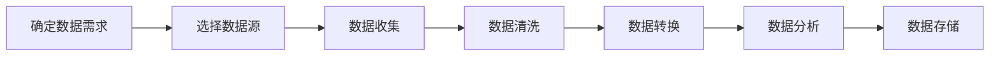

# 金融数据收集与处理

> 关键词：金融数据、数据收集、数据处理、数据清洗、数据分析

> 摘要：本文围绕金融数据收集与处理展开深入探讨。详细阐述了金融数据收集的背景、目的、适用读者群体以及文档结构。介绍了金融数据相关的核心概念及其联系，包括数据的类型、来源等。深入讲解了数据收集与处理的核心算法原理，并结合Python代码给出具体操作步骤。同时，给出了相关的数学模型和公式，并举例说明。通过项目实战，展示了开发环境搭建、源代码实现与解读。探讨了金融数据收集与处理在实际中的应用场景，推荐了学习资源、开发工具框架以及相关论文著作。最后总结了未来发展趋势与挑战，解答了常见问题，并提供了扩展阅读和参考资料，旨在为读者全面呈现金融数据收集与处理的知识体系。

## 1. 背景介绍 
### 1.1 目的和范围
金融数据收集与处理在金融领域具有至关重要的地位。其目的在于获取准确、全面且及时的金融数据，并对这些数据进行有效的处理和分析，以支持金融决策、风险评估、投资策略制定等活动。范围涵盖了各种金融市场的数据，如股票市场、债券市场、外汇市场等，还包括金融机构内部的业务数据，如客户信息、交易记录等。通过对这些数据的收集与处理，可以挖掘出有价值的信息，帮助金融从业者更好地理解市场动态，把握投资机会，降低风险。

### 1.2 预期读者
本文预期读者包括金融从业者，如投资经理、分析师、交易员等，他们可以借助本文的知识更好地进行数据收集和分析，提升工作效率和决策准确性。也适合计算机专业的学生和开发者，为他们在金融数据处理领域的研究和实践提供参考。同时，对金融数据处理感兴趣的爱好者也能通过本文了解相关的基本概念和方法。

### 1.3 文档结构概述
本文首先介绍金融数据收集与处理的背景知识，包括目的、预期读者和文档结构。接着阐述核心概念与联系，让读者对金融数据有清晰的认识。然后讲解核心算法原理和具体操作步骤，结合Python代码进行详细说明。之后给出数学模型和公式，并举例说明其应用。通过项目实战展示实际操作过程，包括开发环境搭建、源代码实现和解读。再探讨实际应用场景，推荐相关的工具和资源。最后总结未来发展趋势与挑战，解答常见问题，并提供扩展阅读和参考资料。

### 1.4 术语表
#### 1.4.1 核心术语定义
- **金融数据**：指与金融活动相关的各种信息，包括市场数据（如股票价格、利率等）、财务数据（如公司财报）、交易数据（如买卖记录）等。
- **数据收集**：通过各种途径获取金融数据的过程。
- **数据处理**：对收集到的数据进行清洗、转换、分析等操作，以使其更具可用性和价值。
- **数据清洗**：去除数据中的噪声、重复数据、缺失值等，提高数据质量。
- **数据分析**：运用各种方法和技术对数据进行深入研究，以发现其中的规律和趋势。

#### 1.4.2 相关概念解释
- **数据源**：数据的来源，如金融资讯网站、数据库、API接口等。
- **数据仓库**：用于存储大量数据的系统，方便数据的管理和查询。
- **ETL（Extract, Transform, Load）**：数据抽取、转换和加载的过程，是数据处理的重要环节。

#### 1.4.3 缩略词列表
- **API（Application Programming Interface）**：应用程序编程接口，用于实现不同系统之间的数据交互。
- **CSV（Comma-Separated Values）**：逗号分隔值，一种常见的数据存储格式。
- **JSON（JavaScript Object Notation）**：一种轻量级的数据交换格式。

## 2. 核心概念与联系 

### 2.1 金融数据的类型
金融数据可以分为以下几类：
- **市场数据**：包括股票价格、债券收益率、外汇汇率、商品价格等。这些数据反映了金融市场的实时动态，是投资者关注的重点。
- **财务数据**：如公司的资产负债表、利润表、现金流量表等。财务数据可以帮助分析公司的财务状况和经营业绩。
- **交易数据**：记录了金融交易的详细信息，如交易时间、交易金额、交易数量等。交易数据对于分析市场流动性和交易行为具有重要意义。
- **宏观经济数据**：包括国内生产总值（GDP）、通货膨胀率、利率等。宏观经济数据会对整个金融市场产生影响。

### 2.2 金融数据的来源
金融数据的来源广泛，主要包括以下几个方面：
- **金融资讯网站**：如新浪财经、东方财富网等，提供了丰富的市场数据和公司信息。
- **交易所**：如上海证券交易所、纽约证券交易所等，是市场数据的重要来源。
- **金融机构**：银行、证券公司等金融机构拥有大量的客户信息和交易数据。
- **政府部门**：如国家统计局、央行等，发布宏观经济数据。
- **数据供应商**：如彭博、路透社等，提供专业的金融数据服务。

### 2.3 数据收集与处理的流程
金融数据收集与处理的流程主要包括以下几个步骤：

- **确定数据需求**：根据具体的业务需求和分析目标，确定需要收集的数据类型和范围。
- **选择数据源**：根据数据需求，选择合适的数据源，确保数据的准确性和及时性。
- **数据收集**：通过各种方式从数据源中获取数据，如网络爬虫、API调用等。
- **数据清洗**：对收集到的数据进行清洗，去除噪声、重复数据和缺失值。
- **数据转换**：将清洗后的数据进行转换，如数据标准化、编码等，以便进行后续分析。
- **数据分析**：运用各种数据分析方法和技术，对转换后的数据进行深入分析，挖掘有价值的信息。
- **数据存储**：将分析后的数据存储到数据仓库或数据库中，以便后续查询和使用。

## 3. 核心算法原理 & 具体操作步骤 

### 3.1 数据收集算法原理
数据收集的方法有多种，这里以网络爬虫和API调用为例进行介绍。

#### 3.1.1 网络爬虫原理
网络爬虫是一种自动获取网页内容的程序。其基本原理是通过HTTP协议向目标网站发送请求，获取网页的HTML代码，然后解析HTML代码，提取所需的数据。以下是一个简单的Python网络爬虫示例：
```python
import requests
from bs4 import BeautifulSoup

# 发送请求获取网页内容
url = 'https://example.com'
response = requests.get(url)
html_content = response.text

# 解析HTML代码
soup = BeautifulSoup(html_content, 'html.parser')

# 提取所需的数据
data = soup.find_all('div', class_='example-class')
for item in data:
    print(item.text)
```
#### 3.1.2 API调用原理
API是一种用于实现不同系统之间数据交互的接口。通过调用API，可以直接获取所需的数据。以下是一个简单的Python API调用示例：
```python
import requests

# API地址
api_url = 'https://api.example.com/data'

# 请求参数
params = {
    'param1': 'value1',
    'param2': 'value2'
}

# 发送请求获取数据
response = requests.get(api_url, params=params)
data = response.json()

# 处理数据
for item in data:
    print(item)
```

### 3.2 数据清洗算法原理
数据清洗主要包括去除噪声、重复数据和缺失值等操作。以下是一些常见的数据清洗方法及其Python代码实现：

#### 3.2.1 去除重复数据
```python
import pandas as pd

# 读取数据
data = pd.read_csv('data.csv')

# 去除重复数据
cleaned_data = data.drop_duplicates()

# 保存清洗后的数据
cleaned_data.to_csv('cleaned_data.csv', index=False)
```
#### 3.2.2 处理缺失值
```python
import pandas as pd

# 读取数据
data = pd.read_csv('data.csv')

# 填充缺失值
data.fillna(method='ffill', inplace=True)

# 保存处理后的数据
data.to_csv('filled_data.csv', index=False)
```
#### 3.2.3 去除噪声数据
```python
import pandas as pd
import numpy as np

# 读取数据
data = pd.read_csv('data.csv')

# 定义噪声阈值
threshold = 3

# 计算均值和标准差
mean = np.mean(data['column_name'])
std = np.std(data['column_name'])

# 去除噪声数据
cleaned_data = data[(data['column_name'] < mean + threshold * std) & (data['column_name'] > mean - threshold * std)]

# 保存清洗后的数据
cleaned_data.to_csv('cleaned_noise_data.csv', index=False)
```

### 3.3 数据转换算法原理
数据转换主要包括数据标准化、编码等操作。以下是一些常见的数据转换方法及其Python代码实现：

#### 3.3.1 数据标准化
```python
from sklearn.preprocessing import StandardScaler
import pandas as pd

# 读取数据
data = pd.read_csv('data.csv')

# 提取数值列
numeric_columns = data.select_dtypes(include=[np.number]).columns

# 标准化数据
scaler = StandardScaler()
data[numeric_columns] = scaler.fit_transform(data[numeric_columns])

# 保存标准化后的数据
data.to_csv('standardized_data.csv', index=False)
```
#### 3.3.2 数据编码
```python
import pandas as pd

# 读取数据
data = pd.read_csv('data.csv')

# 对分类列进行编码
encoded_data = pd.get_dummies(data, columns=['categorical_column'])

# 保存编码后的数据
encoded_data.to_csv('encoded_data.csv', index=False)
```

## 4. 数学模型和公式 & 详细讲解 & 举例说明 

### 4.1 均值和标准差
均值（Mean）是一组数据的平均值，标准差（Standard Deviation）是衡量数据离散程度的指标。

#### 4.1.1 公式
均值的计算公式为：
$$\bar{x} = \frac{1}{n}\sum_{i=1}^{n}x_i$$
其中，$\bar{x}$ 表示均值，$n$ 表示数据的个数，$x_i$ 表示第 $i$ 个数据。

标准差的计算公式为：
$$\sigma = \sqrt{\frac{1}{n}\sum_{i=1}^{n}(x_i - \bar{x})^2}$$
其中，$\sigma$ 表示标准差。

#### 4.1.2 举例说明
假设有一组数据：$[1, 2, 3, 4, 5]$。
首先计算均值：
$$\bar{x} = \frac{1 + 2 + 3 + 4 + 5}{5} = 3$$
然后计算标准差：
$$\sigma = \sqrt{\frac{(1 - 3)^2 + (2 - 3)^2 + (3 - 3)^2 + (4 - 3)^2 + (5 - 3)^2}{5}} = \sqrt{2} \approx 1.414$$

### 4.2 相关系数
相关系数（Correlation Coefficient）用于衡量两个变量之间的线性关系强度。

#### 4.2.1 公式
皮尔逊相关系数的计算公式为：
$$r = \frac{\sum_{i=1}^{n}(x_i - \bar{x})(y_i - \bar{y})}{\sqrt{\sum_{i=1}^{n}(x_i - \bar{x})^2}\sqrt{\sum_{i=1}^{n}(y_i - \bar{y})^2}}$$
其中，$r$ 表示相关系数，$x_i$ 和 $y_i$ 分别表示两个变量的第 $i$ 个数据，$\bar{x}$ 和 $\bar{y}$ 分别表示两个变量的均值。

#### 4.2.2 举例说明
假设有两组数据：$x = [1, 2, 3, 4, 5]$，$y = [2, 4, 6, 8, 10]$。
首先计算均值：
$\bar{x} = 3$，$\bar{y} = 6$
然后计算相关系数：
$$r = \frac{(1 - 3)(2 - 6) + (2 - 3)(4 - 6) + (3 - 3)(6 - 6) + (4 - 3)(8 - 6) + (5 - 3)(10 - 6)}{\sqrt{(1 - 3)^2 + (2 - 3)^2 + (3 - 3)^2 + (4 - 3)^2 + (5 - 3)^2}\sqrt{(2 - 6)^2 + (4 - 6)^2 + (6 - 6)^2 + (8 - 6)^2 + (10 - 6)^2}} = 1$$
这表明 $x$ 和 $y$ 之间存在完全正相关关系。

## 5. 项目实战：代码实际案例和详细解释说明 

### 5.1  开发环境搭建
#### 5.1.1 安装Python
首先需要安装Python，可以从Python官方网站（https://www.python.org/downloads/）下载适合自己操作系统的Python版本，并按照安装向导进行安装。

#### 5.1.2 安装必要的库
使用以下命令安装必要的Python库：
```sh
pip install requests pandas beautifulsoup4 scikit-learn
```

### 5.2  源代码详细实现和代码解读
#### 5.2.1 数据收集
以下是一个从雅虎财经获取股票数据的示例代码：
```python
import requests
import pandas as pd

# 定义API地址
api_url = 'https://query1.finance.yahoo.com/v7/finance/download/AAPL?period1=1609459200&period2=1640995200&interval=1d&events=history&includeAdjustedClose=true'

# 发送请求获取数据
response = requests.get(api_url)

# 将数据保存为CSV文件
with open('aapl_stock_data.csv', 'w') as file:
    file.write(response.text)

# 读取数据
data = pd.read_csv('aapl_stock_data.csv')

# 打印数据信息
print(data.info())
```
代码解读：
- 首先定义了雅虎财经的API地址，该地址用于获取苹果公司（AAPL）的股票历史数据。
- 然后使用 `requests.get` 方法发送请求，获取数据。
- 将获取的数据保存为CSV文件。
- 最后使用 `pandas` 库读取CSV文件，并打印数据信息。

#### 5.2.2 数据清洗
以下是对收集到的股票数据进行清洗的示例代码：
```python
import pandas as pd

# 读取数据
data = pd.read_csv('aapl_stock_data.csv')

# 去除缺失值
data = data.dropna()

# 去除重复数据
data = data.drop_duplicates()

# 保存清洗后的数据
data.to_csv('cleaned_aapl_stock_data.csv', index=False)
```
代码解读：
- 使用 `pandas` 库读取CSV文件。
- 使用 `dropna` 方法去除缺失值。
- 使用 `drop_duplicates` 方法去除重复数据。
- 将清洗后的数据保存为CSV文件。

#### 5.2.3 数据转换
以下是对清洗后的股票数据进行标准化的示例代码：
```python
from sklearn.preprocessing import StandardScaler
import pandas as pd

# 读取数据
data = pd.read_csv('cleaned_aapl_stock_data.csv')

# 提取数值列
numeric_columns = data.select_dtypes(include=[np.number]).columns

# 标准化数据
scaler = StandardScaler()
data[numeric_columns] = scaler.fit_transform(data[numeric_columns])

# 保存标准化后的数据
data.to_csv('standardized_aapl_stock_data.csv', index=False)
```
代码解读：
- 使用 `pandas` 库读取CSV文件。
- 使用 `select_dtypes` 方法提取数值列。
- 使用 `StandardScaler` 类对数值列进行标准化。
- 将标准化后的数据保存为CSV文件。

### 5.3  代码解读与分析
通过以上代码，我们完成了股票数据的收集、清洗和转换过程。在数据收集阶段，我们使用了网络请求的方式从雅虎财经获取数据。在数据清洗阶段，我们去除了缺失值和重复数据，提高了数据质量。在数据转换阶段，我们对数值列进行了标准化，使得数据具有可比性。这些步骤是金融数据处理的基本操作，对于后续的数据分析和建模具有重要意义。

## 6. 实际应用场景 
### 6.1 投资决策
金融数据收集与处理可以帮助投资者更好地了解市场动态和公司基本面，从而做出更明智的投资决策。通过分析股票价格、财务数据等信息，投资者可以评估股票的价值和风险，选择合适的投资时机和标的。

### 6.2 风险评估
金融机构可以利用收集到的金融数据对客户的信用风险、市场风险等进行评估。通过分析客户的财务状况、交易记录等信息，金融机构可以预测客户的违约概率，制定相应的风险管理策略。

### 6.3 市场监管
监管部门可以通过收集和分析金融数据，监测市场的运行情况，防范金融风险。例如，通过分析股票交易数据，监管部门可以发现异常交易行为，及时采取措施维护市场秩序。

### 6.4 金融产品创新
金融机构可以根据市场需求和客户偏好，利用金融数据开发新的金融产品。例如，通过分析客户的投资行为和风险承受能力，金融机构可以设计个性化的投资组合产品。

## 7. 工具和资源推荐
### 7.1 学习资源推荐
#### 7.1.1 书籍推荐
- 《Python金融大数据分析》：介绍了如何使用Python进行金融数据的收集、处理和分析。
- 《金融时间序列分析》：详细讲解了金融时间序列数据的建模和分析方法。
- 《量化投资：策略与技术》：介绍了量化投资的基本概念、策略和技术。

#### 7.1.2 在线课程
- Coursera上的“Financial Markets”课程：由耶鲁大学教授罗伯特·席勒（Robert Shiller）主讲，介绍了金融市场的基本原理和运行机制。
- edX上的“Python for Finance”课程：教授如何使用Python进行金融数据分析和建模。

#### 7.1.3 技术博客和网站
- 金融界（https://www.jrj.com.cn/）：提供丰富的金融资讯和数据。
- 雪球（https://xueqiu.com/）：一个投资者社区，有很多关于金融数据和投资策略的讨论。

### 7.2 开发工具框架推荐
#### 7.2.1 IDE和编辑器
- PyCharm：一款专业的Python集成开发环境，提供了丰富的功能和插件。
- Jupyter Notebook：一种交互式的开发环境，适合进行数据探索和分析。

#### 7.2.2 调试和性能分析工具
- pdb：Python自带的调试工具，可以帮助开发者定位代码中的问题。
- cProfile：Python的性能分析工具，可以分析代码的运行时间和性能瓶颈。

#### 7.2.3 相关框架和库
- pandas：一个强大的数据处理和分析库，提供了丰富的数据结构和操作方法。
- numpy：一个用于科学计算的库，提供了高效的数组操作和数学函数。
- scikit-learn：一个机器学习库，提供了各种机器学习算法和工具。

### 7.3 相关论文著作推荐
#### 7.3.1 经典论文
- Fama, E. F., & French, K. R. (1992). The cross-section of expected stock returns. The Journal of Finance, 47(2), 427-465.
- Markowitz, H. M. (1952). Portfolio selection. The Journal of Finance, 7(1), 77-91.

#### 7.3.2 最新研究成果
可以通过学术数据库（如IEEE Xplore、ACM Digital Library等）搜索最新的金融数据处理相关研究成果。

#### 7.3.3 应用案例分析
可以参考一些金融机构的研究报告和案例分析，了解金融数据处理在实际中的应用。

## 8. 总结：未来发展趋势与挑战
### 8.1 未来发展趋势
- **大数据和人工智能的应用**：随着大数据和人工智能技术的不断发展，金融数据的收集和处理将更加自动化和智能化。例如，利用机器学习算法可以对金融数据进行预测和分析，提高决策的准确性和效率。
- **区块链技术的应用**：区块链技术具有去中心化、不可篡改等特点，可以提高金融数据的安全性和可信度。例如，在金融交易中使用区块链技术可以实现交易数据的实时共享和验证。
- **数据共享和开放**：越来越多的金融机构开始重视数据共享和开放，通过开放API等方式提供金融数据服务，促进金融创新和发展。

### 8.2 挑战
- **数据安全和隐私保护**：金融数据涉及到大量的个人隐私和商业机密，数据安全和隐私保护是金融数据处理面临的重要挑战。需要采取有效的技术和管理措施，确保数据的安全性和隐私性。
- **数据质量和一致性**：金融数据来源广泛，数据质量和一致性难以保证。需要建立完善的数据质量管理体系，对数据进行清洗和整合，提高数据质量。
- **技术人才短缺**：金融数据处理需要具备金融和计算机技术的复合型人才，目前这类人才相对短缺。需要加强相关领域的人才培养和引进。

## 9. 附录：常见问题与解答
### 9.1 如何选择合适的数据源？
选择合适的数据源需要考虑以下几个因素：数据的准确性、及时性、完整性、可靠性等。可以根据具体的业务需求和分析目标，选择金融资讯网站、交易所、金融机构、政府部门、数据供应商等数据源。

### 9.2 如何处理大量的数据？
处理大量的数据可以采用分布式计算、并行计算等技术，提高数据处理的效率。也可以使用数据采样、数据压缩等方法，减少数据量。

### 9.3 如何保证数据的安全性？
保证数据的安全性可以采取以下措施：加密数据传输和存储、设置访问权限、定期备份数据、加强安全审计等。

## 10. 扩展阅读 & 参考资料
### 10.1 扩展阅读
- 《金融科技：前沿与趋势》
- 《智能金融：科技重塑金融未来》

### 10.2 参考资料
- 相关金融数据供应商的官方文档
- Python官方文档
- 机器学习相关书籍和论文

作者：AI天才研究院/AI Genius Institute & 禅与计算机程序设计艺术 /Zen And The Art of Computer Programming