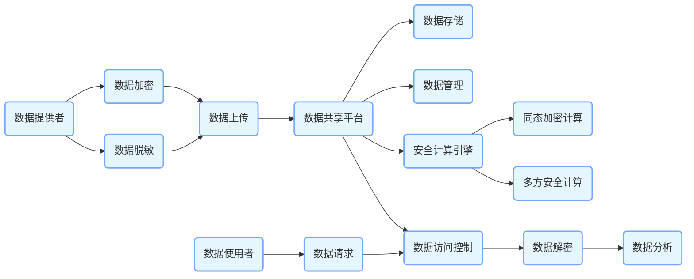

# 金融数据隐私保护与共享平台设计

> 关键词：金融数据、隐私保护、数据共享、平台设计、加密算法

> 摘要：本文聚焦于金融数据隐私保护与共享平台的设计。在当今数字化时代，金融数据的价值愈发凸显，但同时其隐私保护问题也备受关注。一方面，金融机构有数据共享的需求以提升业务效率和创新能力；另一方面，必须确保数据主体的隐私不被侵犯。文章首先介绍了相关背景知识，包括目的、预期读者、文档结构和术语表。接着阐述了核心概念及其联系，详细讲解了核心算法原理和具体操作步骤，并给出了数学模型和公式。通过项目实战，展示了代码的实际案例和详细解释。此外，还探讨了实际应用场景，推荐了相关的工具和资源。最后对未来发展趋势与挑战进行了总结，并提供了常见问题解答和扩展阅读参考资料。

## 1. 背景介绍 
### 1.1 目的和范围
金融数据包含了大量敏感信息，如客户的个人身份、财务状况、交易记录等。随着金融科技的发展，金融机构之间的数据共享需求日益增长，例如在风险评估、信贷审批、反欺诈等领域。然而，数据共享过程中存在着隐私泄露的风险，这不仅会损害客户的利益，也会影响金融机构的声誉和市场竞争力。因此，设计一个既能实现金融数据共享，又能有效保护数据隐私的平台具有重要的现实意义。

本文章的范围主要涵盖金融数据隐私保护与共享平台的整体设计，包括核心概念、算法原理、数学模型、项目实战、实际应用场景等方面。同时，还会推荐相关的工具和资源，以帮助读者更好地理解和实践。

### 1.2 预期读者
本文的预期读者包括金融科技领域的从业者，如金融机构的技术人员、数据分析师、风险管理人员等；对数据隐私保护和共享感兴趣的研究人员；以及正在学习相关知识的学生。

### 1.3 文档结构概述
本文将按照以下结构进行阐述：
- 核心概念与联系：介绍金融数据隐私保护与共享的核心概念，以及它们之间的联系，并通过文本示意图和 Mermaid 流程图进行展示。
- 核心算法原理 & 具体操作步骤：详细讲解实现金融数据隐私保护与共享的核心算法原理，并给出具体的操作步骤，同时使用 Python 源代码进行阐述。
- 数学模型和公式 & 详细讲解 & 举例说明：给出相关的数学模型和公式，并进行详细讲解，通过具体例子帮助读者理解。
- 项目实战：代码实际案例和详细解释说明：通过一个实际的项目案例，展示如何实现金融数据隐私保护与共享平台，包括开发环境搭建、源代码详细实现和代码解读。
- 实际应用场景：探讨金融数据隐私保护与共享平台在实际中的应用场景。
- 工具和资源推荐：推荐相关的学习资源、开发工具框架和论文著作。
- 总结：未来发展趋势与挑战：对金融数据隐私保护与共享平台的未来发展趋势进行总结，并分析面临的挑战。
- 附录：常见问题与解答：解答读者在阅读过程中可能遇到的常见问题。
- 扩展阅读 & 参考资料：提供相关的扩展阅读材料和参考资料。

### 1.4 术语表
#### 1.4.1 核心术语定义
- **金融数据**：指金融机构在业务运营过程中产生和收集的各种数据，包括客户信息、交易记录、市场数据等。
- **隐私保护**：指采取一系列技术和管理措施，确保数据主体的个人信息不被非法获取、使用和披露。
- **数据共享**：指不同金融机构或部门之间，在符合法律法规和隐私保护要求的前提下，交换和使用数据的过程。
- **加密算法**：指用于对数据进行加密和解密的数学算法，常见的加密算法有对称加密算法和非对称加密算法。
- **同态加密**：指一种特殊的加密算法，允许在加密数据上进行特定的计算，而无需先解密数据。

#### 1.4.2 相关概念解释
- **差分隐私**：是一种用于保护数据隐私的数学框架，通过在数据中添加噪声来降低个体信息的可识别性。
- **多方安全计算**：是一种允许多个参与方在不泄露各自数据的情况下进行联合计算的技术。
- **区块链**：是一种分布式账本技术，具有去中心化、不可篡改、可追溯等特点，可以用于金融数据的存储和共享。

#### 1.4.3 缩略词列表
- **AES**：Advanced Encryption Standard，高级加密标准
- **RSA**：Rivest-Shamir-Adleman，一种非对称加密算法
- **HE**：Homomorphic Encryption，同态加密
- **DP**：Differential Privacy，差分隐私
- **MPC**：Multi-Party Computation，多方安全计算

## 2. 核心概念与联系 
### 核心概念原理
#### 金融数据隐私保护
金融数据隐私保护的核心目标是确保数据主体的个人信息不被非法获取、使用和披露。为了实现这一目标，可以采用多种技术手段，如加密算法、差分隐私、访问控制等。

加密算法是最常用的隐私保护技术之一，通过对数据进行加密，可以将数据转换为密文，只有拥有正确密钥的人才能解密和访问数据。常见的加密算法有对称加密算法和非对称加密算法。对称加密算法使用相同的密钥进行加密和解密，如 AES 算法；非对称加密算法使用一对密钥，即公钥和私钥，公钥用于加密数据，私钥用于解密数据，如 RSA 算法。

差分隐私是一种新兴的隐私保护技术，通过在数据中添加噪声来降低个体信息的可识别性。差分隐私的核心思想是，在保证数据的统计特性基本不变的前提下，使得攻击者无法通过数据分析出某个个体的具体信息。

访问控制是指对数据的访问进行限制，只有经过授权的用户才能访问数据。访问控制可以通过身份验证、授权管理等方式实现。

#### 金融数据共享
金融数据共享的核心目标是在符合法律法规和隐私保护要求的前提下，实现不同金融机构或部门之间的数据交换和使用。为了实现这一目标，可以采用多种技术手段，如同态加密、多方安全计算、区块链等。

同态加密是一种特殊的加密算法，允许在加密数据上进行特定的计算，而无需先解密数据。同态加密可以在保证数据隐私的前提下，实现数据的共享和联合计算。

多方安全计算是一种允许多个参与方在不泄露各自数据的情况下进行联合计算的技术。多方安全计算可以通过密码学协议实现，如秘密分享、不经意传输等。

区块链是一种分布式账本技术，具有去中心化、不可篡改、可追溯等特点。区块链可以用于金融数据的存储和共享，通过智能合约可以实现数据的授权访问和共享。

### 架构的文本示意图
```plaintext
金融数据隐私保护与共享平台
|-- 数据提供者
|   |-- 数据加密
|   |-- 数据脱敏
|   |-- 数据上传
|-- 数据共享平台
|   |-- 数据存储
|   |-- 数据管理
|   |-- 数据访问控制
|   |-- 安全计算引擎
|       |-- 同态加密计算
|       |-- 多方安全计算
|-- 数据使用者
|   |-- 数据请求
|   |-- 数据解密
|   |-- 数据分析
```

### Mermaid 流程图


## 3. 核心算法原理 & 具体操作步骤 
### 同态加密算法原理
同态加密是一种特殊的加密算法，允许在加密数据上进行特定的计算，而无需先解密数据。同态加密可以分为全同态加密和部分同态加密。全同态加密允许在加密数据上进行任意的计算，而部分同态加密只允许在加密数据上进行特定的计算，如加法、乘法等。

以 Paillier 部分同态加密算法为例，其原理如下：

#### 密钥生成
- 选择两个大素数 $p$ 和 $q$，计算 $n = pq$ 和 $\lambda = lcm(p - 1, q - 1)$。
- 选择一个随机整数 $g$，使得 $gcd(L(g^{\lambda} \bmod n^2), n) = 1$，其中 $L(u) = \frac{u - 1}{n}$。
- 公钥为 $(n, g)$，私钥为 $(\lambda)$。

#### 加密
设明文消息为 $m$，选择一个随机整数 $r$，计算密文 $c = g^m r^n \bmod n^2$。

#### 解密
计算 $m = L(c^{\lambda} \bmod n^2) \cdot L(g^{\lambda} \bmod n^2)^{-1} \bmod n$。

#### 同态加法
设 $c_1$ 和 $c_2$ 分别是明文消息 $m_1$ 和 $m_2$ 的密文，则 $c_1 \cdot c_2 \bmod n^2$ 是 $m_1 + m_2$ 的密文。

### Python 代码实现
```python
import gmpy2
from gmpy2 import mpz

def key_generation():
    # 选择两个大素数
    p = gmpy2.next_prime(mpz(10**10))
    q = gmpy2.next_prime(mpz(10**10 + 1))
    n = p * q
    lambda_n = gmpy2.lcm(p - 1, q - 1)
    g = n + 1
    # 公钥
    public_key = (n, g)
    # 私钥
    private_key = (lambda_n)
    return public_key, private_key

def encrypt(public_key, m):
    n, g = public_key
    r = gmpy2.mpz_random(gmpy2.random_state(), n)
    while gmpy2.gcd(r, n)!= 1:
        r = gmpy2.mpz_random(gmpy2.random_state(), n)
    c = gmpy2.powmod(g, m, n**2) * gmpy2.powmod(r, n, n**2) % n**2
    return c

def decrypt(private_key, public_key, c):
    lambda_n = private_key
    n, g = public_key
    mu = gmpy2.invert((gmpy2.powmod(g, lambda_n, n**2) - 1) // n, n)
    m = ((gmpy2.powmod(c, lambda_n, n**2) - 1) // n * mu) % n
    return m

def homomorphic_addition(public_key, c1, c2):
    n, _ = public_key
    return c1 * c2 % n**2

# 测试
public_key, private_key = key_generation()
m1 = 5
m2 = 3
c1 = encrypt(public_key, m1)
c2 = encrypt(public_key, m2)
c_sum = homomorphic_addition(public_key, c1, c2)
m_sum = decrypt(private_key, public_key, c_sum)
print(f"明文相加结果: {m1 + m2}")
print(f"同态加密相加结果: {m_sum}")
```

### 具体操作步骤
1. **密钥生成**：数据提供者和数据使用者分别生成自己的公钥和私钥。
2. **数据加密**：数据提供者使用数据使用者的公钥对数据进行加密。
3. **数据上传**：数据提供者将加密后的数据上传到数据共享平台。
4. **数据请求**：数据使用者向数据共享平台发送数据请求。
5. **数据计算**：数据共享平台在加密数据上进行同态加密计算。
6. **数据解密**：数据使用者使用自己的私钥对计算结果进行解密。

## 4. 数学模型和公式 & 详细讲解 & 举例说明 
### 差分隐私数学模型
差分隐私的核心思想是在数据中添加噪声来降低个体信息的可识别性。差分隐私的数学定义如下：

设 $\mathcal{X}$ 是数据集的集合，$\mathcal{Y}$ 是查询结果的集合，$M: \mathcal{X} \to \mathcal{Y}$ 是一个随机算法。如果对于任意相邻的数据集 $x, x' \in \mathcal{X}$ 和任意的子集 $S \subseteq \mathcal{Y}$，都有：

$$
Pr[M(x) \in S] \leq e^{\epsilon} Pr[M(x') \in S]
$$

其中 $\epsilon$ 是一个非负实数，称为隐私预算，则称算法 $M$ 满足 $\epsilon$-差分隐私。

### 拉普拉斯机制
拉普拉斯机制是一种常用的差分隐私机制，用于在查询结果中添加噪声。设 $f: \mathcal{X} \to \mathbb{R}^d$ 是一个查询函数，其敏感度 $\Delta f$ 定义为：

$$
\Delta f = \max_{x, x' \in \mathcal{X}, ||x - x'||_1 = 1} ||f(x) - f(x')||_1
$$

其中 $||\cdot||_1$ 是 $L_1$ 范数。拉普拉斯机制 $M_{Lap}(x, f, \epsilon)$ 定义为：

$$
M_{Lap}(x, f, \epsilon) = f(x) + (Y_1, Y_2, \cdots, Y_d)
$$

其中 $Y_i \sim Lap(\frac{\Delta f}{\epsilon})$，$Lap(\mu, b)$ 是拉普拉斯分布，其概率密度函数为：

$$
f(x; \mu, b) = \frac{1}{2b} e^{-\frac{|x - \mu|}{b}}
$$

### 举例说明
假设我们有一个数据集 $x = [1, 2, 3, 4, 5]$，我们要计算数据集的总和。查询函数 $f(x) = \sum_{i = 1}^{n} x_i$，其敏感度 $\Delta f = 1$。

设隐私预算 $\epsilon = 0.1$，则噪声的尺度 $b = \frac{\Delta f}{\epsilon} = 10$。

```python
import numpy as np

# 数据集
x = np.array([1, 2, 3, 4, 5])
# 查询函数
f = np.sum(x)
# 敏感度
delta_f = 1
# 隐私预算
epsilon = 0.1
# 噪声尺度
b = delta_f / epsilon
# 生成噪声
noise = np.random.laplace(0, b)
# 添加噪声后的结果
result = f + noise

print(f"真实总和: {f}")
print(f"添加噪声后的总和: {result}")
```

在这个例子中，我们通过拉普拉斯机制在查询结果中添加了噪声，从而实现了差分隐私保护。

## 5. 项目实战：代码实际案例和详细解释说明 
### 5.1  开发环境搭建
#### 操作系统
推荐使用 Linux 操作系统，如 Ubuntu 18.04 或更高版本。

#### 编程语言
使用 Python 3.7 或更高版本。

#### 依赖库安装
```bash
pip install gmpy2 numpy
```

### 5.2  源代码详细实现和代码解读
```python
import gmpy2
from gmpy2 import mpz
import numpy as np

# 同态加密部分

def key_generation():
    # 选择两个大素数
    p = gmpy2.next_prime(mpz(10**10))
    q = gmpy2.next_prime(mpz(10**10 + 1))
    n = p * q
    lambda_n = gmpy2.lcm(p - 1, q - 1)
    g = n + 1
    # 公钥
    public_key = (n, g)
    # 私钥
    private_key = (lambda_n)
    return public_key, private_key

def encrypt(public_key, m):
    n, g = public_key
    r = gmpy2.mpz_random(gmpy2.random_state(), n)
    while gmpy2.gcd(r, n)!= 1:
        r = gmpy2.mpz_random(gmpy2.random_state(), n)
    c = gmpy2.powmod(g, m, n**2) * gmpy2.powmod(r, n, n**2) % n**2
    return c

def decrypt(private_key, public_key, c):
    lambda_n = private_key
    n, g = public_key
    mu = gmpy2.invert((gmpy2.powmod(g, lambda_n, n**2) - 1) // n, n)
    m = ((gmpy2.powmod(c, lambda_n, n**2) - 1) // n * mu) % n
    return m

def homomorphic_addition(public_key, c1, c2):
    n, _ = public_key
    return c1 * c2 % n**2

# 差分隐私部分

def laplace_mechanism(f, delta_f, epsilon):
    b = delta_f / epsilon
    noise = np.random.laplace(0, b)
    return f + noise

# 主程序
if __name__ == "__main__":
    # 同态加密测试
    public_key, private_key = key_generation()
    m1 = 5
    m2 = 3
    c1 = encrypt(public_key, m1)
    c2 = encrypt(public_key, m2)
    c_sum = homomorphic_addition(public_key, c1, c2)
    m_sum = decrypt(private_key, public_key, c_sum)
    print(f"同态加密: 明文相加结果: {m1 + m2}, 同态加密相加结果: {m_sum}")

    # 差分隐私测试
    x = np.array([1, 2, 3, 4, 5])
    f = np.sum(x)
    delta_f = 1
    epsilon = 0.1
    result = laplace_mechanism(f, delta_f, epsilon)
    print(f"差分隐私: 真实总和: {f}, 添加噪声后的总和: {result}")
```

### 5.3  代码解读与分析
#### 同态加密部分
- `key_generation` 函数：生成 Paillier 同态加密算法的公钥和私钥。
- `encrypt` 函数：使用公钥对明文进行加密。
- `decrypt` 函数：使用私钥对密文进行解密。
- `homomorphic_addition` 函数：对两个密文进行同态加法运算。

#### 差分隐私部分
- `laplace_mechanism` 函数：实现拉普拉斯机制，在查询结果中添加噪声。

#### 主程序
在主程序中，我们分别测试了同态加密和差分隐私的功能。通过同态加密，我们可以在加密数据上进行加法运算，而无需先解密数据；通过差分隐私，我们可以在查询结果中添加噪声，从而保护数据的隐私。

## 6. 实际应用场景 
### 风险评估
金融机构在进行风险评估时，需要综合考虑多个数据源的信息，如客户的信用记录、财务状况、交易历史等。通过金融数据隐私保护与共享平台，不同金融机构可以在保护数据隐私的前提下，共享相关数据，从而提高风险评估的准确性和效率。

### 信贷审批
在信贷审批过程中，金融机构需要对申请人的信用状况进行评估。通过数据共享平台，金融机构可以获取申请人在其他金融机构的信用记录和交易信息，从而更全面地了解申请人的信用状况，做出更准确的信贷审批决策。

### 反欺诈
金融欺诈是金融行业面临的一个重要问题。通过金融数据隐私保护与共享平台，不同金融机构可以共享欺诈信息和风险预警数据，从而及时发现和防范金融欺诈行为，保护金融机构和客户的利益。

### 市场分析
金融机构需要对市场趋势和客户需求进行分析，以制定相应的营销策略和产品创新方案。通过数据共享平台，金融机构可以获取更多的市场数据和客户信息，从而更准确地把握市场动态和客户需求，提高市场竞争力。

## 7. 工具和资源推荐
### 7.1 学习资源推荐
#### 7.1.1 书籍推荐
- 《密码学原理与实践》：介绍了密码学的基本原理和常见算法，包括对称加密、非对称加密、哈希函数等。
- 《差分隐私基础教程》：详细讲解了差分隐私的理论和应用，包括差分隐私的定义、机制设计、算法实现等。
- 《多方安全计算：原理与应用》：介绍了多方安全计算的基本原理和常见协议，包括秘密分享、不经意传输、同态加密等。

#### 7.1.2 在线课程
- Coursera 上的 “Cryptography” 课程：由斯坦福大学教授 Dan Boneh 主讲，介绍了密码学的基本原理和应用。
- edX 上的 “Differential Privacy” 课程：由微软研究院的 Cynthia Dwork 教授主讲，详细讲解了差分隐私的理论和实践。
- Udemy 上的 “Multi-Party Computation for Beginners” 课程：适合初学者学习多方安全计算的基本概念和算法。

#### 7.1.3 技术博客和网站
- Cryptology ePrint Archive：提供了最新的密码学研究成果和论文。
- Differential Privacy Blog：关注差分隐私领域的最新动态和研究进展。
- Privacy Enhancing Technologies Symposium (PETS)：是隐私保护技术领域的重要学术会议，其官方网站提供了相关的研究论文和会议记录。

### 7.2 开发工具框架推荐
#### 7.2.1 IDE和编辑器
- PyCharm：是一款专业的 Python 集成开发环境，提供了丰富的代码编辑、调试、测试等功能。
- Visual Studio Code：是一款轻量级的代码编辑器，支持多种编程语言，并且有丰富的插件扩展。

#### 7.2.2 调试和性能分析工具
- PDB：是 Python 自带的调试工具，可以帮助开发者定位和解决代码中的问题。
- cProfile：是 Python 自带的性能分析工具，可以分析代码的运行时间和函数调用情况。

#### 7.2.3 相关框架和库
- Pycryptodome：是一个 Python 密码学库，提供了多种加密算法的实现，如 AES、RSA、Paillier 等。
- OpenDP：是一个用于差分隐私的 Python 库，提供了多种差分隐私机制的实现，如拉普拉斯机制、高斯机制等。
- MP-SPDZ：是一个用于多方安全计算的开源框架，支持多种安全计算协议的实现，如同态加密、秘密分享等。

### 7.3 相关论文著作推荐
#### 7.3.1 经典论文
- “A Method for Obtaining Digital Signatures and Public-Key Cryptosystems”：RSA 算法的原始论文，介绍了 RSA 非对称加密算法的原理和实现。
- “Differential Privacy”：差分隐私的开创性论文，由 Cynthia Dwork 等人发表，奠定了差分隐私的理论基础。
- “Fully Homomorphic Encryption Using Ideal Lattices”：全同态加密的重要论文，提出了基于理想格的全同态加密方案。

#### 7.3.2 最新研究成果
- 关注 ACM SIGSAC Conference on Computer and Communications Security (CCS)、IEEE Symposium on Security and Privacy (S&P) 等顶级安全会议的最新论文，了解金融数据隐私保护与共享领域的最新研究进展。

#### 7.3.3 应用案例分析
- 阅读金融机构和科技公司发布的技术报告和案例分析，了解金融数据隐私保护与共享平台在实际应用中的经验和挑战。

## 8. 总结：未来发展趋势与挑战
### 未来发展趋势
- **技术融合**：未来，金融数据隐私保护与共享平台将融合多种技术，如同态加密、差分隐私、多方安全计算、区块链等，以实现更高级别的隐私保护和更高效的数据共享。
- **标准化和规范化**：随着金融数据隐私保护与共享的重要性日益凸显，相关的标准和规范将逐渐完善，以确保不同金融机构和平台之间的数据共享和互操作性。
- **应用场景拓展**：除了现有的风险评估、信贷审批、反欺诈等应用场景，金融数据隐私保护与共享平台将在更多领域得到应用，如金融监管、保险理赔、投资决策等。

### 挑战
- **性能问题**：目前，同态加密、多方安全计算等隐私保护技术的计算复杂度较高，会导致数据处理和计算效率低下。如何在保证隐私保护的前提下，提高系统的性能是一个亟待解决的问题。
- **法律法规和监管**：金融数据涉及到大量敏感信息，其隐私保护和共享需要遵守严格的法律法规和监管要求。如何在满足法律法规和监管要求的前提下，实现数据的有效共享是一个挑战。
- **用户信任**：用户对金融数据隐私保护的关注度越来越高，如何建立用户对金融数据隐私保护与共享平台的信任，是平台推广和应用的关键。

## 9. 附录：常见问题与解答
### 同态加密的计算效率如何提高？
可以采用优化的算法和硬件加速技术来提高同态加密的计算效率。例如，使用更高效的同态加密方案，如基于格的同态加密算法；利用 GPU 或 FPGA 等硬件设备进行加速计算。

### 差分隐私的隐私预算如何选择？
隐私预算 $\epsilon$ 是一个权衡隐私保护和数据可用性的参数。$\epsilon$ 越小，隐私保护程度越高，但数据的可用性越低；$\epsilon$ 越大，数据的可用性越高，但隐私保护程度越低。在实际应用中，需要根据具体的应用场景和需求来选择合适的隐私预算。

### 金融数据隐私保护与共享平台如何保证数据的安全性？
可以采用多种技术手段来保证数据的安全性，如加密算法、访问控制、数据脱敏、审计和监控等。同时，平台需要遵守严格的法律法规和监管要求，建立完善的安全管理制度和应急预案。

## 10. 扩展阅读 & 参考资料
### 扩展阅读
- 《金融科技前沿：隐私保护与数据共享》
- 《区块链与金融数据隐私保护》
- 《人工智能时代的金融数据安全》

### 参考资料
- [Cryptography: Theory and Practice](https://www.crcpress.com/Cryptography-Theory-and-Practice/Menezes-van-Oorschot-Vanstone/p/book/9781498727418)
- [The Algorithmic Foundations of Differential Privacy](https://www.cis.upenn.edu/~aaroth/Papers/privacybook.pdf)
- [Multi-Party Computation: Theory and Practice](https://link.springer.com/book/10.1007/978-3-030-32900-8)

作者：AI天才研究院/AI Genius Institute & 禅与计算机程序设计艺术 /Zen And The Art of Computer Programming