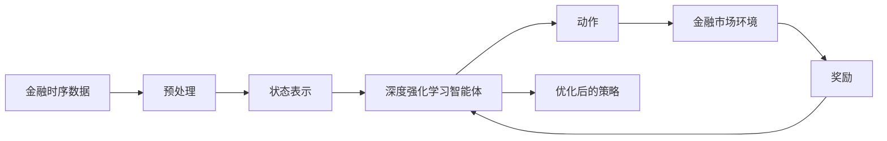

# 金融时序数据的深度强化学习应用

> 关键词：金融时序数据、深度强化学习、交易策略、风险控制、神经网络

> 摘要：本文聚焦于金融时序数据的深度强化学习应用。首先介绍了金融时序数据和深度强化学习的背景知识，包括研究目的、预期读者等内容。接着详细阐述了核心概念及其联系，给出了原理和架构的示意图与流程图。深入讲解了核心算法原理及具体操作步骤，并通过 Python 代码进行说明。同时给出了相关数学模型和公式，还结合实际案例进行分析。在项目实战部分，介绍了开发环境搭建、源代码实现与解读。探讨了该技术在金融领域的实际应用场景，推荐了学习资源、开发工具框架和相关论文著作。最后总结了未来发展趋势与挑战，并给出常见问题解答和扩展阅读参考资料。

## 1. 背景介绍 
### 1.1 目的和范围
金融市场充满了不确定性和复杂性，金融时序数据包含了丰富的市场信息，如股票价格、汇率、利率等随时间变化的数据。深度强化学习结合了深度学习的强大表征能力和强化学习的决策能力，旨在从金融时序数据中学习有效的交易策略，实现收益最大化和风险最小化。

本文的范围涵盖了深度强化学习在金融时序数据中的基本概念、算法原理、实际应用案例以及相关工具和资源的推荐。通过对这些内容的详细介绍，帮助读者深入理解如何将深度强化学习应用于金融领域。

### 1.2 预期读者
本文预期读者包括金融从业者，如交易员、投资经理等，他们可以通过学习深度强化学习技术，改进现有的交易策略，提高投资收益。同时，也适合计算机科学领域的研究者和开发者，尤其是对人工智能在金融领域应用感兴趣的人员，帮助他们了解金融领域的实际需求和应用场景。此外，对于金融和计算机科学交叉学科的学生来说，本文也是一份很好的学习资料。

### 1.3 文档结构概述
本文将按照以下结构进行组织：
- 核心概念与联系：介绍金融时序数据和深度强化学习的核心概念，以及它们之间的联系。
- 核心算法原理 & 具体操作步骤：详细讲解深度强化学习的核心算法，如深度 Q 网络（DQN）等，并给出具体的操作步骤。
- 数学模型和公式 & 详细讲解 & 举例说明：给出深度强化学习中的数学模型和公式，并结合实际例子进行详细讲解。
- 项目实战：通过一个实际的金融交易项目，介绍开发环境搭建、源代码实现和代码解读。
- 实际应用场景：探讨深度强化学习在金融领域的实际应用场景，如股票交易、期货交易等。
- 工具和资源推荐：推荐学习资源、开发工具框架和相关论文著作。
- 总结：总结未来发展趋势与挑战。
- 附录：解答常见问题。
- 扩展阅读 & 参考资料：提供扩展阅读的资料和参考书目。

### 1.4 术语表
#### 1.4.1 核心术语定义
- **金融时序数据**：按时间顺序排列的金融市场相关数据，如股票价格、成交量、汇率等。
- **深度强化学习**：将深度学习与强化学习相结合的技术，通过神经网络来学习最优策略。
- **状态（State）**：在强化学习中，状态是对环境的一种描述，在金融领域中可以是当前的市场价格、交易量等信息。
- **动作（Action）**：智能体在某个状态下可以采取的操作，如买入、卖出、持有等。
- **奖励（Reward）**：智能体采取某个动作后，环境给予的反馈，用于评估动作的好坏，在金融交易中可以是交易的收益。
- **策略（Policy）**：智能体根据当前状态选择动作的规则。

#### 1.4.2 相关概念解释
- **深度学习**：一种基于人工神经网络的机器学习技术，通过多层神经网络自动学习数据的特征和模式。
- **强化学习**：智能体通过与环境进行交互，不断尝试不同的动作，根据环境给予的奖励来学习最优策略。
- **经验回放**：深度强化学习中的一种技术，将智能体的经验（状态、动作、奖励、下一个状态）存储在经验池中，然后随机从经验池中采样进行训练，以打破数据之间的相关性。

#### 1.4.3 缩略词列表
- **DQN**：Deep Q-Network，深度 Q 网络。
- **DDQN**：Double Deep Q-Network，双深度 Q 网络。
- **DDPG**：Deep Deterministic Policy Gradient，深度确定性策略梯度。

## 2. 核心概念与联系 

### 金融时序数据
金融时序数据是金融市场中随时间变化的数据序列，具有以下特点：
- **时间相关性**：数据点之间存在时间上的依赖关系，过去的数据会影响未来的数据。
- **噪声和不确定性**：金融市场受到多种因素的影响，如宏观经济环境、政策变化、突发事件等，导致数据中存在大量的噪声和不确定性。
- **非平稳性**：金融时序数据的统计特性可能随时间变化，不满足平稳性假设。

### 深度强化学习
深度强化学习是一种结合了深度学习和强化学习的技术。深度学习用于学习数据的特征和模式，强化学习用于智能体的决策和学习。深度强化学习的基本框架包括智能体、环境、状态、动作和奖励。智能体根据当前状态选择动作，与环境进行交互，环境根据智能体的动作给出奖励和下一个状态，智能体通过不断地与环境交互来学习最优策略。

### 核心概念原理和架构的文本示意图
```plaintext
金融时序数据
|
| 预处理（归一化、特征提取等）
|
V
状态表示（包含金融时序数据特征）
|
| 深度强化学习智能体
|   |
|   | 策略网络（根据状态选择动作）
|   |
|   | 价值网络（评估状态价值）
|
V
动作（如买入、卖出、持有）
|
| 与金融市场环境交互
|
V
奖励（如交易收益）
|
| 更新策略和价值网络
|
V
优化后的策略
```

### Mermaid 流程图


## 3. 核心算法原理 & 具体操作步骤 

### 深度 Q 网络（DQN）原理
深度 Q 网络（DQN）是一种基于价值的深度强化学习算法，其核心思想是使用神经网络来近似 Q 函数。Q 函数表示在某个状态下采取某个动作的预期累积奖励。

DQN 的目标是学习一个最优的 Q 函数 $Q^*(s,a)$，使得智能体在每个状态下选择能够最大化 Q 值的动作。DQN 使用一个神经网络 $Q(s,a;\theta)$ 来近似 $Q^*(s,a)$，其中 $\theta$ 是神经网络的参数。

DQN 的损失函数通常使用均方误差（MSE）：
$$L(\theta) = \mathbb{E}_{(s,a,r,s')\sim D}[(r + \gamma \max_{a'} Q(s',a';\theta^-) - Q(s,a;\theta))^2]$$
其中，$D$ 是经验回放池，$\gamma$ 是折扣因子，$\theta^-$ 是目标网络的参数。

### 具体操作步骤
1. **初始化**：初始化神经网络 $Q(s,a;\theta)$ 和目标网络 $Q(s,a;\theta^-)$，并将 $\theta^-$ 初始化为 $\theta$。初始化经验回放池 $D$。
2. **环境交互**：在每个时间步 $t$：
    - 观察当前状态 $s_t$。
    - 根据当前的 Q 网络 $Q(s,a;\theta)$ 和一定的探索策略（如 $\epsilon$-贪心策略）选择动作 $a_t$。
    - 执行动作 $a_t$，与环境交互，得到奖励 $r_t$ 和下一个状态 $s_{t+1}$。
    - 将经验 $(s_t,a_t,r_t,s_{t+1})$ 存储到经验回放池 $D$ 中。
3. **经验回放**：从经验回放池 $D$ 中随机采样一批经验 $(s,a,r,s')$。
4. **计算目标值**：计算目标值 $y = r + \gamma \max_{a'} Q(s',a';\theta^-)$。
5. **更新 Q 网络**：使用均方误差损失函数更新 Q 网络的参数 $\theta$。
6. **更新目标网络**：每隔一定的时间步，将目标网络的参数 $\theta^-$ 更新为 $\theta$。

### Python 代码实现
```python
import numpy as np
import torch
import torch.nn as nn
import torch.optim as optim
import random

# 定义 Q 网络
class QNetwork(nn.Module):
    def __init__(self, input_dim, output_dim):
        super(QNetwork, self).__init__()
        self.fc1 = nn.Linear(input_dim, 64)
        self.fc2 = nn.Linear(64, 64)
        self.fc3 = nn.Linear(64, output_dim)

    def forward(self, x):
        x = torch.relu(self.fc1(x))
        x = torch.relu(self.fc2(x))
        return self.fc3(x)

# 定义 DQN 智能体
class DQNAgent:
    def __init__(self, input_dim, output_dim, learning_rate=0.001, gamma=0.99, epsilon=1.0, epsilon_decay=0.995, epsilon_min=0.01, batch_size=64, memory_size=10000):
        self.input_dim = input_dim
        self.output_dim = output_dim
        self.learning_rate = learning_rate
        self.gamma = gamma
        self.epsilon = epsilon
        self.epsilon_decay = epsilon_decay
        self.epsilon_min = epsilon_min
        self.batch_size = batch_size
        self.memory = []
        self.memory_size = memory_size

        self.q_network = QNetwork(input_dim, output_dim)
        self.target_network = QNetwork(input_dim, output_dim)
        self.target_network.load_state_dict(self.q_network.state_dict())
        self.optimizer = optim.Adam(self.q_network.parameters(), lr=learning_rate)
        self.criterion = nn.MSELoss()

    def remember(self, state, action, reward, next_state):
        if len(self.memory) > self.memory_size:
            self.memory.pop(0)
        self.memory.append((state, action, reward, next_state))

    def act(self, state):
        if np.random.rand() <= self.epsilon:
            return random.randrange(self.output_dim)
        state = torch.FloatTensor(state).unsqueeze(0)
        q_values = self.q_network(state)
        action = torch.argmax(q_values).item()
        return action

    def replay(self):
        if len(self.memory) < self.batch_size:
            return
        minibatch = random.sample(self.memory, self.batch_size)
        states, actions, rewards, next_states = zip(*minibatch)

        states = torch.FloatTensor(states)
        actions = torch.LongTensor(actions)
        rewards = torch.FloatTensor(rewards)
        next_states = torch.FloatTensor(next_states)

        q_values = self.q_network(states)
        next_q_values = self.target_network(next_states)
        next_max_q_values = torch.max(next_q_values, dim=1)[0]

        targets = q_values.clone()
        for i in range(self.batch_size):
            targets[i][actions[i]] = rewards[i] + self.gamma * next_max_q_values[i]

        self.optimizer.zero_grad()
        loss = self.criterion(q_values, targets)
        loss.backward()
        self.optimizer.step()

        if self.epsilon > self.epsilon_min:
            self.epsilon *= self.epsilon_decay

    def update_target_network(self):
        self.target_network.load_state_dict(self.q_network.state_dict())
```

## 4. 数学模型和公式 & 详细讲解 & 举例说明 

### 马尔可夫决策过程（MDP）
马尔可夫决策过程是强化学习的基础数学模型，它由一个四元组 $(S,A,P,R,\gamma)$ 组成：
- $S$ 是状态空间，表示环境的所有可能状态。
- $A$ 是动作空间，表示智能体可以采取的所有动作。
- $P(s'|s,a)$ 是状态转移概率，表示在状态 $s$ 下采取动作 $a$ 后转移到状态 $s'$ 的概率。
- $R(s,a)$ 是奖励函数，表示在状态 $s$ 下采取动作 $a$ 后获得的即时奖励。
- $\gamma$ 是折扣因子，用于衡量未来奖励的重要性，取值范围为 $[0,1]$。

### 价值函数
价值函数用于评估状态或状态 - 动作对的好坏。主要有两种价值函数：
- **状态价值函数 $V(s)$**：表示从状态 $s$ 开始，遵循某个策略 $\pi$ 所能获得的预期累积奖励：
$$V^\pi(s) = \mathbb{E}_\pi\left[\sum_{t=0}^{\infty} \gamma^t R_{t+1} | S_0 = s\right]$$
- **动作价值函数 $Q(s,a)$**：表示在状态 $s$ 下采取动作 $a$，然后遵循某个策略 $\pi$ 所能获得的预期累积奖励：
$$Q^\pi(s,a) = \mathbb{E}_\pi\left[\sum_{t=0}^{\infty} \gamma^t R_{t+1} | S_0 = s, A_0 = a\right]$$

### 贝尔曼方程
贝尔曼方程描述了价值函数的递归关系：
- **状态价值函数的贝尔曼方程**：
$$V^\pi(s) = \sum_{a\in A} \pi(a|s) \sum_{s'\in S} P(s'|s,a) [R(s,a) + \gamma V^\pi(s')]$$
- **动作价值函数的贝尔曼方程**：
$$Q^\pi(s,a) = \sum_{s'\in S} P(s'|s,a) [R(s,a) + \gamma \sum_{a'\in A} \pi(a'|s') Q^\pi(s',a')]$$

### 最优价值函数和最优策略
最优状态价值函数 $V^*(s)$ 和最优动作价值函数 $Q^*(s,a)$ 分别定义为：
$$V^*(s) = \max_\pi V^\pi(s)$$
$$Q^*(s,a) = \max_\pi Q^\pi(s,a)$$

最优策略 $\pi^*$ 是使得 $V^\pi(s)$ 或 $Q^\pi(s,a)$ 达到最大值的策略。

### 举例说明
假设一个简单的金融交易场景，状态空间 $S$ 包含两个状态：$s_1$ 表示股票价格上涨，$s_2$ 表示股票价格下跌；动作空间 $A$ 包含两个动作：$a_1$ 表示买入，$a_2$ 表示卖出。

状态转移概率如下：
- $P(s_1|s_1,a_1) = 0.7$，$P(s_2|s_1,a_1) = 0.3$
- $P(s_1|s_1,a_2) = 0.3$，$P(s_2|s_1,a_2) = 0.7$
- $P(s_1|s_2,a_1) = 0.3$，$P(s_2|s_2,a_1) = 0.7$
- $P(s_1|s_2,a_2) = 0.7$，$P(s_2|s_2,a_2) = 0.3$

奖励函数如下：
- $R(s_1,a_1) = 10$，$R(s_1,a_2) = -5$
- $R(s_2,a_1) = -10$，$R(s_2,a_2) = 5$

折扣因子 $\gamma = 0.9$。

假设当前策略 $\pi$ 是在状态 $s_1$ 下以概率 0.6 买入，以概率 0.4 卖出；在状态 $s_2$ 下以概率 0.3 买入，以概率 0.7 卖出。

我们可以根据贝尔曼方程计算状态价值函数 $V^\pi(s)$：
对于状态 $s_1$：
$$
\begin{align*}
V^\pi(s_1) &= \pi(a_1|s_1) \sum_{s'\in S} P(s'|s_1,a_1) [R(s_1,a_1) + \gamma V^\pi(s')] + \pi(a_2|s_1) \sum_{s'\in S} P(s'|s_1,a_2) [R(s_1,a_2) + \gamma V^\pi(s')]\\
&= 0.6\times(0.7\times(10 + 0.9V^\pi(s_1)) + 0.3\times(-10 + 0.9V^\pi(s_2))) + 0.4\times(0.3\times(-5 + 0.9V^\pi(s_1)) + 0.7\times(5 + 0.9V^\pi(s_2)))
\end{align*}
$$
对于状态 $s_2$：
$$
\begin{align*}
V^\pi(s_2) &= \pi(a_1|s_2) \sum_{s'\in S} P(s'|s_2,a_1) [R(s_2,a_1) + \gamma V^\pi(s')] + \pi(a_2|s_2) \sum_{s'\in S} P(s'|s_2,a_2) [R(s_2,a_2) + \gamma V^\pi(s')]\\
&= 0.3\times(0.3\times(-10 + 0.9V^\pi(s_1)) + 0.7\times(-10 + 0.9V^\pi(s_2))) + 0.7\times(0.7\times(5 + 0.9V^\pi(s_1)) + 0.3\times(5 + 0.9V^\pi(s_2)))
\end{align*}
$$
通过迭代求解上述方程组，可以得到状态价值函数 $V^\pi(s)$ 的值。

## 5. 项目实战：代码实际案例和详细解释说明 

### 5.1  开发环境搭建
#### 安装 Python
首先需要安装 Python，建议使用 Python 3.7 及以上版本。可以从 Python 官方网站（https://www.python.org/downloads/）下载并安装。

#### 安装依赖库
使用以下命令安装所需的依赖库：
```bash
pip install numpy torch pandas matplotlib
```
- `numpy`：用于数值计算。
- `torch`：PyTorch 深度学习框架。
- `pandas`：用于数据处理和分析。
- `matplotlib`：用于数据可视化。

### 5.2  源代码详细实现和代码解读
```python
import numpy as np
import pandas as pd
import torch
import torch.nn as nn
import torch.optim as optim
import matplotlib.pyplot as plt

# 定义 Q 网络
class QNetwork(nn.Module):
    def __init__(self, input_dim, output_dim):
        super(QNetwork, self).__init__()
        self.fc1 = nn.Linear(input_dim, 64)
        self.fc2 = nn.Linear(64, 64)
        self.fc3 = nn.Linear(64, output_dim)

    def forward(self, x):
        x = torch.relu(self.fc1(x))
        x = torch.relu(self.fc2(x))
        return self.fc3(x)

# 定义 DQN 智能体
class DQNAgent:
    def __init__(self, input_dim, output_dim, learning_rate=0.001, gamma=0.99, epsilon=1.0, epsilon_decay=0.995, epsilon_min=0.01, batch_size=64, memory_size=10000):
        self.input_dim = input_dim
        self.output_dim = output_dim
        self.learning_rate = learning_rate
        self.gamma = gamma
        self.epsilon = epsilon
        self.epsilon_decay = epsilon_decay
        self.epsilon_min = epsilon_min
        self.batch_size = batch_size
        self.memory = []
        self.memory_size = memory_size

        self.q_network = QNetwork(input_dim, output_dim)
        self.target_network = QNetwork(input_dim, output_dim)
        self.target_network.load_state_dict(self.q_network.state_dict())
        self.optimizer = optim.Adam(self.q_network.parameters(), lr=learning_rate)
        self.criterion = nn.MSELoss()

    def remember(self, state, action, reward, next_state):
        if len(self.memory) > self.memory_size:
            self.memory.pop(0)
        self.memory.append((state, action, reward, next_state))

    def act(self, state):
        if np.random.rand() <= self.epsilon:
            return np.random.randint(self.output_dim)
        state = torch.FloatTensor(state).unsqueeze(0)
        q_values = self.q_network(state)
        action = torch.argmax(q_values).item()
        return action

    def replay(self):
        if len(self.memory) < self.batch_size:
            return
        minibatch = np.random.choice(len(self.memory), self.batch_size, replace=False)
        states, actions, rewards, next_states = zip(*[self.memory[i] for i in minibatch])

        states = torch.FloatTensor(states)
        actions = torch.LongTensor(actions)
        rewards = torch.FloatTensor(rewards)
        next_states = torch.FloatTensor(next_states)

        q_values = self.q_network(states)
        next_q_values = self.target_network(next_states)
        next_max_q_values = torch.max(next_q_values, dim=1)[0]

        targets = q_values.clone()
        for i in range(self.batch_size):
            targets[i][actions[i]] = rewards[i] + self.gamma * next_max_q_values[i]

        self.optimizer.zero_grad()
        loss = self.criterion(q_values, targets)
        loss.backward()
        self.optimizer.step()

        if self.epsilon > self.epsilon_min:
            self.epsilon *= self.epsilon_decay

    def update_target_network(self):
        self.target_network.load_state_dict(self.q_network.state_dict())

# 加载金融时序数据
def load_data(file_path):
    data = pd.read_csv(file_path)
    prices = data['Close'].values
    return prices

# 训练智能体
def train_agent(agent, prices, episodes=100, window_size=10):
    total_rewards = []
    for episode in range(episodes):
        state = prices[:window_size]
        total_reward = 0
        for t in range(window_size, len(prices) - 1):
            action = agent.act(state)
            next_state = prices[t - window_size + 1:t + 1]
            if action == 0:  # 买入
                reward = prices[t + 1] - prices[t]
            elif action == 1:  # 卖出
                reward = prices[t] - prices[t + 1]
            else:  # 持有
                reward = 0

            agent.remember(state, action, reward, next_state)
            agent.replay()

            state = next_state
            total_reward += reward

        agent.update_target_network()
        total_rewards.append(total_reward)
        print(f'Episode {episode + 1}/{episodes}, Total Reward: {total_reward}')

    plt.plot(total_rewards)
    plt.xlabel('Episode')
    plt.ylabel('Total Reward')
    plt.show()

# 主函数
if __name__ == '__main__':
    file_path = 'stock_prices.csv'
    prices = load_data(file_path)
    input_dim = 10
    output_dim = 3
    agent = DQNAgent(input_dim, output_dim)
    train_agent(agent, prices)
```

### 5.3  代码解读与分析
#### QNetwork 类
这是一个简单的三层全连接神经网络，用于近似 Q 函数。输入维度为 `input_dim`，输出维度为 `output_dim`。

#### DQNAgent 类
- `__init__` 方法：初始化智能体的参数，包括学习率、折扣因子、探索率等，同时初始化 Q 网络和目标网络。
- `remember` 方法：将智能体的经验（状态、动作、奖励、下一个状态）存储到经验回放池中。
- `act` 方法：根据当前状态选择动作，使用 $\epsilon$-贪心策略进行探索。
- `replay` 方法：从经验回放池中随机采样一批经验，计算目标值，更新 Q 网络的参数。
- `update_target_network` 方法：更新目标网络的参数。

#### load_data 函数
从 CSV 文件中加载金融时序数据，返回股票收盘价的数组。

#### train_agent 函数
训练智能体，在每个回合中，智能体与环境进行交互，选择动作，获得奖励，并更新 Q 网络和目标网络。同时记录每个回合的总奖励，并绘制奖励曲线。

#### 主函数
加载数据，初始化智能体，调用 `train_agent` 函数进行训练。

## 6. 实际应用场景 
### 股票交易
深度强化学习可以用于股票交易策略的制定。智能体可以根据股票的历史价格、成交量等信息，学习最优的交易策略，如买入、卖出、持有等。通过不断地与市场环境进行交互，智能体可以适应市场的变化，提高交易收益。

### 期货交易
在期货交易中，深度强化学习可以帮助投资者更好地管理风险和获取收益。智能体可以根据期货合约的价格波动、市场情绪等因素，制定合理的交易策略。例如，在市场上涨时买入，在市场下跌时卖出，或者进行套期保值操作。

### 资产配置
深度强化学习可以用于资产配置问题，帮助投资者在不同的资产之间进行合理的分配。智能体可以根据不同资产的风险和收益特征，以及投资者的风险偏好，学习最优的资产配置策略，以实现投资组合的最大化收益和最小化风险。

### 风险管理
在金融领域，风险管理是非常重要的。深度强化学习可以用于风险评估和管理，智能体可以根据市场的不确定性和风险因素，学习如何调整投资组合，以降低风险。例如，在市场波动较大时，减少风险资产的配置，增加稳健资产的配置。

## 7. 工具和资源推荐
### 7.1 学习资源推荐
#### 7.1.1 书籍推荐
- 《Reinforcement Learning: An Introduction》：由 Richard S. Sutton 和 Andrew G. Barto 编写，是强化学习领域的经典教材，全面介绍了强化学习的基本概念、算法和应用。
- 《Deep Learning》：由 Ian Goodfellow、Yoshua Bengio 和 Aaron Courville 编写，是深度学习领域的权威著作，涵盖了深度学习的基本原理、模型和算法。
- 《Python for Finance: Analyze Big Financial Data》：介绍了如何使用 Python 进行金融数据分析和建模，包括金融时序数据处理、机器学习在金融领域的应用等内容。

#### 7.1.2 在线课程
- Coursera 上的 “Reinforcement Learning Specialization”：由 University of Alberta 提供，包括四门课程，系统地介绍了强化学习的理论和实践。
- edX 上的 “Deep Learning MicroMasters Program”：由多个知名高校联合提供，涵盖了深度学习的各个方面，包括深度强化学习。
- Udemy 上的 “Algorithmic Trading Using Python - Full Course”：介绍了如何使用 Python 进行算法交易，包括金融时序数据处理、交易策略开发等内容。

#### 7.1.3 技术博客和网站
- OpenAI Blog（https://openai.com/blog/）：OpenAI 发布的最新研究成果和技术文章，包括深度强化学习的应用案例和算法改进。
- Medium 上的 Towards Data Science（https://towardsdatascience.com/）：有大量关于数据分析、机器学习和深度学习的技术文章，其中也包括深度强化学习在金融领域的应用。
- arXiv（https://arxiv.org/）：预印本论文平台，提供了最新的学术研究成果，包括深度强化学习在金融领域的研究论文。

### 7.2 开发工具框架推荐
#### 7.2.1 IDE和编辑器
- PyCharm：功能强大的 Python 集成开发环境，提供了代码编辑、调试、版本控制等功能，适合开发复杂的 Python 项目。
- Jupyter Notebook：交互式的开发环境，支持代码、文本、图表等多种形式的展示，适合进行数据探索和模型实验。
- Visual Studio Code：轻量级的代码编辑器，支持多种编程语言，具有丰富的插件生态系统，可以方便地进行 Python 开发。

#### 7.2.2 调试和性能分析工具
- TensorBoard：TensorFlow 提供的可视化工具，可以用于可视化训练过程中的损失函数、准确率等指标，帮助开发者调试模型。
- PyTorch Profiler：PyTorch 提供的性能分析工具，可以帮助开发者分析模型的性能瓶颈，优化代码。
- cProfile：Python 内置的性能分析工具，可以用于分析 Python 代码的执行时间和调用次数。

#### 7.2.3 相关框架和库
- PyTorch：开源的深度学习框架，提供了丰富的神经网络层和优化算法，易于使用和扩展。
- TensorFlow：另一个广泛使用的深度学习框架，具有强大的分布式训练和部署能力。
- Stable Baselines3：基于 PyTorch 的强化学习库，提供了多种强化学习算法的实现，方便开发者快速搭建和训练强化学习模型。

### 7.3 相关论文著作推荐
#### 7.3.1 经典论文
- “Playing Atari with Deep Reinforcement Learning”：由 DeepMind 团队发表，首次提出了深度 Q 网络（DQN）算法，开启了深度强化学习的研究热潮。
- “Human-level control through deep reinforcement learning”：同样是 DeepMind 团队的工作，将 DQN 算法应用于 Atari 游戏，实现了人类水平的游戏控制。
- “Deep Reinforcement Learning for Automated Stock Trading: An Ensemble Strategy”：探讨了深度强化学习在股票交易中的应用，提出了一种集成策略。

#### 7.3.2 最新研究成果
- 关注 NeurIPS、ICML、AAAI 等顶级人工智能会议的论文，这些会议每年都会发表大量关于深度强化学习的最新研究成果。
- 关注金融领域的学术期刊，如 Journal of Financial Economics、Review of Financial Studies 等，这些期刊会发表深度强化学习在金融领域的应用研究。

#### 7.3.3 应用案例分析
- 可以参考一些知名金融机构的研究报告和案例分析，了解深度强化学习在实际金融交易中的应用效果和挑战。
- 一些开源项目也提供了深度强化学习在金融领域的应用案例，如 FinRL（https://github.com/AI4Finance-Foundation/FinRL），可以参考其代码和文档进行学习。

## 8. 总结：未来发展趋势与挑战
### 未来发展趋势
- **多模态数据融合**：未来的研究可能会将金融时序数据与其他模态的数据，如新闻文本、社交媒体数据等进行融合，以获取更全面的市场信息，提高交易策略的性能。
- **深度强化学习与其他技术的结合**：将深度强化学习与传统的金融分析方法、机器学习算法相结合，发挥各自的优势，实现更精准的市场预测和交易决策。
- **自适应和鲁棒的策略学习**：开发能够自适应市场变化和应对不确定性的深度强化学习算法，提高交易策略的鲁棒性和稳定性。
- **实际应用的拓展**：深度强化学习在金融领域的应用将不断拓展，除了股票交易、期货交易等传统领域，还可能应用于数字货币交易、量化投资等新兴领域。

### 挑战
- **数据质量和数量**：金融时序数据往往存在噪声、缺失值等问题，数据的质量和数量会影响深度强化学习模型的性能。如何获取高质量的金融数据，并进行有效的预处理是一个挑战。
- **市场的不确定性**：金融市场是复杂和不确定的，市场环境可能会发生突然的变化，如金融危机、政策调整等。深度强化学习模型需要具备应对这些不确定性的能力。
- **模型的可解释性**：深度强化学习模型通常是黑盒模型，其决策过程难以解释。在金融领域，模型的可解释性非常重要，因为投资者需要了解模型的决策依据。如何提高深度强化学习模型的可解释性是一个亟待解决的问题。
- **计算资源和时间成本**：深度强化学习模型的训练通常需要大量的计算资源和时间。如何优化算法和模型结构，降低计算资源和时间成本，是实际应用中的一个挑战。

## 9. 附录：常见问题与解答
### 1. 深度强化学习在金融领域的应用是否可靠？
深度强化学习在金融领域的应用具有一定的潜力，但也存在一定的风险。由于金融市场的复杂性和不确定性，模型的性能可能会受到多种因素的影响。在实际应用中，需要对模型进行充分的验证和测试，结合传统的金融分析方法，以提高决策的可靠性。

### 2. 如何选择合适的深度强化学习算法？
选择合适的深度强化学习算法需要考虑多个因素，如问题的类型（离散动作空间还是连续动作空间）、数据的规模和特征、计算资源等。常见的深度强化学习算法包括 DQN、DDQN、DDPG 等。对于离散动作空间的问题，可以考虑使用 DQN 及其变种；对于连续动作空间的问题，可以考虑使用 DDPG 等算法。

### 3. 如何评估深度强化学习模型在金融领域的性能？
可以使用多种指标来评估深度强化学习模型在金融领域的性能，如累计收益率、夏普比率、最大回撤等。累计收益率反映了模型的盈利能力，夏普比率衡量了模型在承担单位风险下的收益能力，最大回撤表示模型在一段时间内的最大损失。同时，还可以进行回测实验，将模型的交易策略应用于历史数据，评估其在不同市场环境下的表现。

### 4. 深度强化学习模型的训练时间过长怎么办？
可以采取以下措施来缩短深度强化学习模型的训练时间：
- 优化模型结构，减少模型的参数数量。
- 使用更高效的优化算法，如 Adam 等。
- 利用 GPU 进行加速训练。
- 采用分布式训练的方法，并行训练多个模型。

## 10. 扩展阅读 & 参考资料
### 扩展阅读
- 《Advances in Financial Machine Learning》：介绍了机器学习在金融领域的最新进展和应用，包括深度强化学习在金融市场预测和交易策略制定中的应用。
- 《Algorithmic Trading: Winning Strategies and Their Rationale》：详细介绍了算法交易的各种策略和原理，包括基于机器学习和深度学习的交易策略。

### 参考资料
- Sutton, R. S., & Barto, A. G. (2018). Reinforcement Learning: An Introduction. MIT press.
- Goodfellow, I., Bengio, Y., & Courville, A. (2016). Deep Learning. MIT press.
- Mnih, V., Kavukcuoglu, K., Silver, D., Rusu, A. A., Veness, J., Bellemare, M. G.,... & Petersen, S. (2015). Human-level control through deep reinforcement learning. Nature, 518(7540), 529-533.

作者：AI天才研究院/AI Genius Institute & 禅与计算机程序设计艺术 /Zen And The Art of Computer Programming