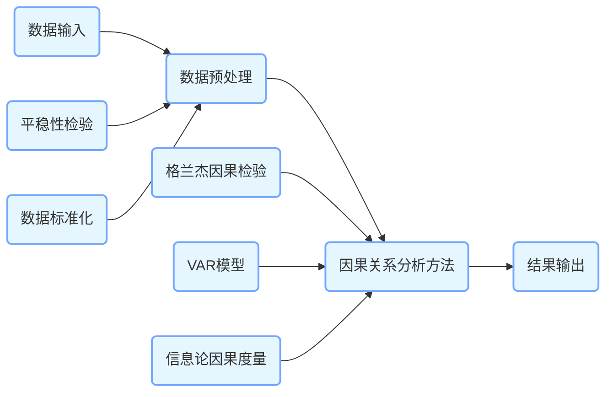

# 金融时间序列因果关系分析

> 关键词：金融时间序列、因果关系分析、格兰杰因果检验、VAR模型、信息论因果度量

> 摘要：本文围绕金融时间序列因果关系分析展开，深入探讨其核心概念、算法原理、数学模型等内容。详细阐述了格兰杰因果检验等常见方法的原理及实现步骤，并结合Python代码进行具体演示。通过项目实战展示如何在实际中运用这些方法进行金融时间序列因果关系分析。同时，介绍了该领域的实际应用场景、相关工具和资源，最后对未来发展趋势与挑战进行总结，旨在为金融领域的研究和实践提供全面的技术参考。

## 1. 背景介绍 
### 1.1 目的和范围
金融市场中，各种资产价格、宏观经济指标等数据随时间不断变化，形成金融时间序列。分析这些时间序列之间的因果关系，对于理解金融市场的运行机制、进行投资决策、风险管理等具有重要意义。本文的目的在于系统地介绍金融时间序列因果关系分析的理论、方法和实践，涵盖从基本概念到具体算法实现，再到实际应用场景的多个方面。范围包括常见的因果关系分析方法，如格兰杰因果检验、基于信息论的因果度量等，以及如何使用Python进行相关分析和实际案例的展示。

### 1.2 预期读者
本文预期读者包括金融领域的研究人员、数据分析师、量化交易员以及对金融时间序列分析感兴趣的技术人员。无论您是希望深入了解金融市场因果关系的原理，还是寻求实际应用中解决问题的方法，都能从本文中获得有价值的信息。

### 1.3 文档结构概述
本文首先介绍金融时间序列因果关系分析的背景知识，包括目的、预期读者和文档结构。接着阐述核心概念与联系，给出相关原理和架构的示意图及流程图。然后详细讲解核心算法原理和具体操作步骤，并用Python代码进行实现。之后介绍数学模型和公式，并通过举例说明其应用。再通过项目实战展示代码的实际应用和详细解释。随后讨论实际应用场景，推荐相关的工具和资源。最后总结未来发展趋势与挑战，并提供常见问题与解答以及扩展阅读和参考资料。

### 1.4 术语表
#### 1.4.1 核心术语定义
- **金融时间序列**：按时间顺序排列的金融数据序列，如股票价格、汇率、利率等随时间变化的数据。
- **因果关系**：在金融时间序列中，指一个时间序列的变化是否会引起另一个时间序列的变化。
- **格兰杰因果检验**：一种统计检验方法，用于判断一个时间序列是否有助于预测另一个时间序列。
- **VAR模型**：向量自回归模型，用于描述多个时间序列之间的动态关系。
- **信息论因果度量**：基于信息论的方法，如传递熵等，用于度量时间序列之间的因果关系。

#### 1.4.2 相关概念解释
- **自回归**：时间序列中的一个变量用其自身的过去值来进行回归分析。
- **滞后阶数**：在时间序列分析中，指使用过去多少期的数据来进行预测或分析。
- **平稳性**：时间序列的统计特性不随时间变化的性质，是许多时间序列分析方法的前提条件。

#### 1.4.3 缩略词列表
- **VAR**：Vector Autoregression（向量自回归）
- **GDP**：Gross Domestic Product（国内生产总值）
- **CPI**：Consumer Price Index（消费者物价指数）

## 2. 核心概念与联系 
### 核心概念原理
#### 格兰杰因果检验
格兰杰因果检验基于这样的思想：如果一个时间序列 $X$ 是另一个时间序列 $Y$ 的格兰杰原因，那么 $X$ 的过去值应该有助于预测 $Y$ 的未来值，而不仅仅是使用 $Y$ 的过去值进行预测。具体来说，我们构建两个回归模型：

无约束模型：
$$Y_t = \sum_{i = 1}^{p} \alpha_i Y_{t - i}+\sum_{j = 1}^{p} \beta_j X_{t - j}+\epsilon_t$$

约束模型：
$$Y_t = \sum_{i = 1}^{p} \alpha_i Y_{t - i}+\epsilon_t$$

其中，$Y_t$ 是 $Y$ 在 $t$ 时刻的值，$X_t$ 是 $X$ 在 $t$ 时刻的值，$p$ 是滞后阶数，$\alpha_i$ 和 $\beta_j$ 是回归系数，$\epsilon_t$ 是误差项。

通过比较两个模型的残差平方和，使用 $F$ 检验来判断 $X$ 是否是 $Y$ 的格兰杰原因。如果 $F$ 统计量大于临界值，则拒绝原假设，认为 $X$ 是 $Y$ 的格兰杰原因。

#### VAR模型
VAR模型是一种多变量时间序列模型，用于描述多个时间序列之间的动态关系。对于 $n$ 个时间序列 $Y_1, Y_2, \cdots, Y_n$，VAR(p) 模型可以表示为：

$$Y_t = c+\sum_{i = 1}^{p} A_i Y_{t - i}+\epsilon_t$$

其中，$Y_t$ 是 $n$ 维向量，$c$ 是 $n$ 维常数向量，$A_i$ 是 $n\times n$ 系数矩阵，$\epsilon_t$ 是 $n$ 维误差向量。

VAR模型可以用于预测和分析时间序列之间的相互影响。通过估计系数矩阵 $A_i$，可以了解不同时间序列之间的动态关系。

#### 信息论因果度量 - 传递熵
传递熵是一种基于信息论的因果度量方法，用于度量一个时间序列向另一个时间序列传递的信息。对于两个时间序列 $X$ 和 $Y$，传递熵 $T_{X\rightarrow Y}$ 定义为：

$$T_{X\rightarrow Y}= \sum_{x_{t+1}, y_t, x_t} p(x_{t + 1}, y_t, x_t)\log\frac{p(x_{t + 1}|y_t, x_t)}{p(x_{t + 1}|y_t)}$$

其中，$p(\cdot)$ 是概率分布函数。传递熵衡量了在已知 $Y$ 的过去值的情况下，$X$ 的过去值对 $X$ 的未来值的额外信息贡献。如果 $T_{X\rightarrow Y}>0$，则说明 $X$ 对 $Y$ 存在因果影响。

### 架构的文本示意图
```plaintext
金融时间序列因果关系分析
|-- 数据输入
|   |-- 金融时间序列数据
|-- 数据预处理
|   |-- 平稳性检验
|   |-- 数据标准化
|-- 因果关系分析方法
|   |-- 格兰杰因果检验
|   |-- VAR模型
|   |-- 信息论因果度量
|-- 结果输出
|   |-- 因果关系判断
|   |-- 模型参数估计
```

### Mermaid流程图


## 3. 核心算法原理 & 具体操作步骤 

### 格兰杰因果检验
#### 算法原理
格兰杰因果检验的核心是比较无约束模型和约束模型的残差平方和。假设我们有两个时间序列 $X$ 和 $Y$，我们要检验 $X$ 是否是 $Y$ 的格兰杰原因。

首先，我们估计无约束模型：
$$Y_t = \sum_{i = 1}^{p} \alpha_i Y_{t - i}+\sum_{j = 1}^{p} \beta_j X_{t - j}+\epsilon_t$$

得到残差平方和 $SSR_{ur}$。

然后，我们估计约束模型：
$$Y_t = \sum_{i = 1}^{p} \alpha_i Y_{t - i}+\epsilon_t$$

得到残差平方和 $SSR_{r}$。

计算 $F$ 统计量：
$$F=\frac{(SSR_{r}-SSR_{ur})/p}{SSR_{ur}/(T - 2p - 1)}$$

其中，$T$ 是样本数量，$p$ 是滞后阶数。

最后，根据 $F$ 分布的临界值进行判断。如果 $F$ 统计量大于临界值，则拒绝原假设，认为 $X$ 是 $Y$ 的格兰杰原因。

#### 具体操作步骤
1. **数据准备**：获取两个时间序列 $X$ 和 $Y$。
2. **平稳性检验**：使用单位根检验（如ADF检验）检查时间序列的平稳性。如果不平稳，进行差分处理使其平稳。
3. **确定滞后阶数**：可以使用信息准则（如AIC、BIC）来确定最佳滞后阶数 $p$。
4. **估计无约束模型和约束模型**：使用最小二乘法估计两个模型的参数，并计算残差平方和 $SSR_{ur}$ 和 $SSR_{r}$。
5. **计算 $F$ 统计量**：根据上述公式计算 $F$ 统计量。
6. **判断因果关系**：根据 $F$ 分布的临界值进行判断，确定 $X$ 是否是 $Y$ 的格兰杰原因。

#### Python代码实现
```python
import pandas as pd
import numpy as np
from statsmodels.tsa.stattools import adfuller
from statsmodels.tsa.api import VAR
from statsmodels.stats.stattools import durbin_watson
from statsmodels.tsa.stattools import grangercausalitytests

# 示例数据
np.random.seed(0)
n = 100
x = np.random.randn(n)
y = np.random.randn(n)

# 平稳性检验
def adf_test(series):
    result = adfuller(series)
    print('ADF Statistic: {}'.format(result[0]))
    print('p-value: {}'.format(result[1]))
    print('Critical Values:')
    for key, value in result[4].items():
        print('\t{}: {}'.format(key, value))
    if result[1] <= 0.05:
        print("Series is stationary")
    else:
        print("Series is non-stationary")
    return result[1] <= 0.05

is_x_stationary = adf_test(x)
is_y_stationary = adf_test(y)

# 格兰杰因果检验
maxlag = 5
test = 'ssr_chi2test'

def granger_causation_matrix(data, variables, test='ssr_chi2test', verbose=False):    
    df = pd.DataFrame(np.zeros((len(variables), len(variables))), columns=variables, index=variables)
    for c in df.columns:
        for r in df.index:
            test_result = grangercausalitytests(data[[r, c]], maxlag=maxlag, verbose=False)
            p_values = [round(test_result[i+1][0][test][1],4) for i in range(maxlag)]
            if verbose: print(f'Y = {r}, X = {c}, P Values = {p_values}')
            min_p_value = np.min(p_values)
            df.loc[r, c] = min_p_value
    return df

data = pd.DataFrame({'x': x, 'y': y})
granger_matrix = granger_causation_matrix(data, variables = data.columns)
print(granger_matrix)
```

### VAR模型
#### 算法原理
VAR模型通过最小二乘法估计系数矩阵 $A_i$。对于VAR(p) 模型：

$$Y_t = c+\sum_{i = 1}^{p} A_i Y_{t - i}+\epsilon_t$$

我们可以将其写成矩阵形式：

$$Y = C + A_1 Y_{-1}+\cdots+A_p Y_{-p}+\epsilon$$

其中，$Y$ 是 $T\times n$ 矩阵，$C$ 是 $T\times n$ 常数矩阵，$Y_{-i}$ 是 $T\times n$ 矩阵，$\epsilon$ 是 $T\times n$ 误差矩阵。

通过最小化误差平方和：

$$\min_{\{A_i\}} \sum_{t = 1}^{T} \|\epsilon_t\|^2$$

可以得到系数矩阵 $A_i$ 的估计值。

#### 具体操作步骤
1. **数据准备**：获取多个时间序列数据，组成一个矩阵 $Y$。
2. **平稳性检验**：检查每个时间序列的平稳性，如有必要进行差分处理。
3. **确定滞后阶数**：使用信息准则（如AIC、BIC）确定最佳滞后阶数 $p$。
4. **模型估计**：使用最小二乘法估计VAR(p) 模型的系数矩阵 $A_i$ 和常数向量 $c$。
5. **模型诊断**：检查模型的残差是否满足独立性和正态性假设。
6. **预测和分析**：使用估计的模型进行预测和分析时间序列之间的相互影响。

#### Python代码实现
```python
# VAR模型示例
from statsmodels.tsa.api import VAR

# 生成示例数据
np.random.seed(1)
nobs = 100
data = np.random.randn(nobs, 2)
df = pd.DataFrame(data, columns=['y1', 'y2'])

# 平稳性检验
for col in df.columns:
    adf_test(df[col])

# 确定滞后阶数
model = VAR(df)
lags = model.select_order(maxlags=10)
print(lags.summary())
best_lag = lags.selected_orders['aic']

# 拟合VAR模型
model_fit = model.fit(best_lag)
print(model_fit.summary())

# 预测
forecast_steps = 10
forecast = model_fit.forecast(df.values[-best_lag:], steps=forecast_steps)
print(forecast)
```

### 信息论因果度量 - 传递熵
#### 算法原理
传递熵的计算基于概率分布的估计。在实际应用中，通常使用离散化的方法将连续的时间序列转换为离散的状态，然后估计概率分布 $p(x_{t + 1}, y_t, x_t)$、$p(x_{t + 1}|y_t, x_t)$ 和 $p(x_{t + 1}|y_t)$。

#### 具体操作步骤
1. **数据准备**：获取两个时间序列 $X$ 和 $Y$。
2. **数据离散化**：将连续的时间序列离散化为有限个状态。
3. **估计概率分布**：根据离散化后的数据估计 $p(x_{t + 1}, y_t, x_t)$、$p(x_{t + 1}|y_t, x_t)$ 和 $p(x_{t + 1}|y_t)$。
4. **计算传递熵**：根据传递熵的定义计算 $T_{X\rightarrow Y}$。

#### Python代码实现
```python
import numpy as np

def transfer_entropy(x, y, k=1):
    n = len(x)
    states_x = np.unique(x)
    states_y = np.unique(y)
    n_states_x = len(states_x)
    n_states_y = len(states_y)
    
    # 初始化概率分布
    p_xy = np.zeros((n_states_x, n_states_y, n_states_x))
    p_yx = np.zeros((n_states_y, n_states_x))
    p_y = np.zeros(n_states_y)
    
    # 统计频数
    for t in range(k, n):
        x_t = np.where(states_x == x[t])[0][0]
        y_t = np.where(states_y == y[t - 1])[0][0]
        x_t_k = np.where(states_x == x[t - k])[0][0]
        
        p_xy[x_t, y_t, x_t_k] += 1
        p_yx[y_t, x_t_k] += 1
        p_y[y_t] += 1
    
    # 计算概率
    p_xy /= (n - k)
    p_yx /= (n - k)
    p_y /= (n - k)
    
    # 计算传递熵
    TE = 0
    for x_t in range(n_states_x):
        for y_t in range(n_states_y):
            for x_t_k in range(n_states_x):
                if p_xy[x_t, y_t, x_t_k] > 0:
                    p_x_given_yx = p_xy[x_t, y_t, x_t_k] / p_yx[y_t, x_t_k]
                    p_x_given_y = np.sum(p_xy[x_t, y_t, :]) / p_y[y_t]
                    TE += p_xy[x_t, y_t, x_t_k] * np.log2(p_x_given_yx / p_x_given_y)
    
    return TE

# 示例数据
np.random.seed(0)
x = np.random.randint(0, 2, 100)
y = np.random.randint(0, 2, 100)

te = transfer_entropy(x, y)
print(f"Transfer entropy: {te}")
```

## 4. 数学模型和公式 & 详细讲解 & 举例说明 

### 格兰杰因果检验
#### 数学模型和公式
如前面所述，格兰杰因果检验通过比较无约束模型和约束模型的残差平方和来判断因果关系。

无约束模型：
$$Y_t = \sum_{i = 1}^{p} \alpha_i Y_{t - i}+\sum_{j = 1}^{p} \beta_j X_{t - j}+\epsilon_t$$

约束模型：
$$Y_t = \sum_{i = 1}^{p} \alpha_i Y_{t - i}+\epsilon_t$$

$F$ 统计量：
$$F=\frac{(SSR_{r}-SSR_{ur})/p}{SSR_{ur}/(T - 2p - 1)}$$

#### 详细讲解
- 无约束模型包含了 $X$ 的过去值，用于检验 $X$ 是否对 $Y$ 有额外的预测能力。
- 约束模型只包含 $Y$ 的过去值。
- $F$ 统计量衡量了在加入 $X$ 的过去值后，模型的拟合优度是否有显著提高。如果 $F$ 统计量较大，说明加入 $X$ 的过去值对模型有显著改善，即 $X$ 是 $Y$ 的格兰杰原因。

#### 举例说明
假设我们有两个时间序列 $X$ 和 $Y$，样本数量 $T = 100$，滞后阶数 $p = 2$。经过估计，无约束模型的残差平方和 $SSR_{ur}=100$，约束模型的残差平方和 $SSR_{r}=120$。

计算 $F$ 统计量：
$$F=\frac{(120 - 100)/2}{100/(100 - 2\times2 - 1)}=\frac{10}{100/95}=9.5$$

假设在显著性水平 $\alpha = 0.05$ 下，$F$ 分布的临界值为 $3.0$。由于 $F = 9.5>3.0$，我们拒绝原假设，认为 $X$ 是 $Y$ 的格兰杰原因。

### VAR模型
#### 数学模型和公式
VAR(p) 模型：
$$Y_t = c+\sum_{i = 1}^{p} A_i Y_{t - i}+\epsilon_t$$

写成矩阵形式：
$$Y = C + A_1 Y_{-1}+\cdots+A_p Y_{-p}+\epsilon$$

#### 详细讲解
- $Y_t$ 是 $n$ 维向量，表示 $n$ 个时间序列在 $t$ 时刻的值。
- $c$ 是 $n$ 维常数向量，反映了时间序列的长期趋势。
- $A_i$ 是 $n\times n$ 系数矩阵，描述了不同时间序列之间的动态关系。
- $\epsilon_t$ 是 $n$ 维误差向量，假设其均值为零，协方差矩阵为 $\Sigma$。

#### 举例说明
假设我们有两个时间序列 $Y_1$ 和 $Y_2$，VAR(1) 模型可以表示为：

$$\begin{bmatrix}Y_{1t}\\Y_{2t}\end{bmatrix}=\begin{bmatrix}c_1\\c_2\end{bmatrix}+\begin{bmatrix}A_{11}&A_{12}\\A_{21}&A_{22}\end{bmatrix}\begin{bmatrix}Y_{1,t - 1}\\Y_{2,t - 1}\end{bmatrix}+\begin{bmatrix}\epsilon_{1t}\\\epsilon_{2t}\end{bmatrix}$$

其中，$A_{11}$ 表示 $Y_1$ 的过去值对 $Y_1$ 的当前值的影响，$A_{12}$ 表示 $Y_2$ 的过去值对 $Y_1$ 的当前值的影响，以此类推。

### 信息论因果度量 - 传递熵
#### 数学模型和公式
传递熵 $T_{X\rightarrow Y}$ 定义为：
$$T_{X\rightarrow Y}= \sum_{x_{t+1}, y_t, x_t} p(x_{t + 1}, y_t, x_t)\log\frac{p(x_{t + 1}|y_t, x_t)}{p(x_{t + 1}|y_t)}$$

#### 详细讲解
- 传递熵衡量了在已知 $Y$ 的过去值的情况下，$X$ 的过去值对 $X$ 的未来值的额外信息贡献。
- $p(x_{t + 1}, y_t, x_t)$ 是 $X$ 的未来值、$Y$ 的过去值和 $X$ 的过去值的联合概率分布。
- $p(x_{t + 1}|y_t, x_t)$ 是在已知 $Y$ 的过去值和 $X$ 的过去值的情况下，$X$ 的未来值的条件概率分布。
- $p(x_{t + 1}|y_t)$ 是在已知 $Y$ 的过去值的情况下，$X$ 的未来值的条件概率分布。

#### 举例说明
假设我们有两个离散的时间序列 $X$ 和 $Y$，取值范围为 $\{0, 1\}$。经过统计，得到以下概率分布：

$p(x_{t + 1}=0, y_t = 0, x_t = 0)=0.1$，$p(x_{t + 1}=0|y_t = 0, x_t = 0)=0.5$，$p(x_{t + 1}=0|y_t = 0)=0.3$

则这部分对传递熵的贡献为：

$$0.1\times\log_2\frac{0.5}{0.3}\approx0.1\times0.737 = 0.0737$$

将所有可能的状态组合的贡献相加，即可得到传递熵 $T_{X\rightarrow Y}$。

## 5. 项目实战：代码实际案例和详细解释说明 

### 5.1  开发环境搭建
#### 安装Python
首先，确保你已经安装了Python 3.x 版本。可以从Python官方网站（https://www.python.org/downloads/） 下载并安装适合你操作系统的版本。

#### 安装必要的库
使用pip命令安装以下必要的库：
```bash
pip install pandas numpy statsmodels
```

### 5.2  源代码详细实现和代码解读
#### 数据准备
```python
import pandas as pd
import numpy as np

# 生成示例数据
np.random.seed(0)
n = 100
x = np.random.randn(n)
y = np.random.randn(n)

data = pd.DataFrame({'x': x, 'y': y})
```
代码解读：
- 导入 `pandas` 和 `numpy` 库。
- 使用 `np.random.randn` 生成两个随机时间序列 $x$ 和 $y$。
- 将两个时间序列组合成一个 `pandas` 的 `DataFrame` 对象 `data`。

#### 平稳性检验
```python
from statsmodels.tsa.stattools import adfuller

def adf_test(series):
    result = adfuller(series)
    print('ADF Statistic: {}'.format(result[0]))
    print('p-value: {}'.format(result[1]))
    print('Critical Values:')
    for key, value in result[4].items():
        print('\t{}: {}'.format(key, value))
    if result[1] <= 0.05:
        print("Series is stationary")
    else:
        print("Series is non-stationary")
    return result[1] <= 0.05

is_x_stationary = adf_test(data['x'])
is_y_stationary = adf_test(data['y'])
```
代码解读：
- 导入 `adfuller` 函数用于进行ADF单位根检验。
- 定义 `adf_test` 函数，该函数接受一个时间序列作为输入，输出ADF统计量、p值和临界值，并判断时间序列是否平稳。
- 对 `data` 中的 `x` 和 `y` 分别进行平稳性检验。

#### 格兰杰因果检验
```python
from statsmodels.tsa.stattools import grangercausalitytests

maxlag = 5
test = 'ssr_chi2test'

def granger_causation_matrix(data, variables, test='ssr_chi2test', verbose=False):    
    df = pd.DataFrame(np.zeros((len(variables), len(variables))), columns=variables, index=variables)
    for c in df.columns:
        for r in df.index:
            test_result = grangercausalitytests(data[[r, c]], maxlag=maxlag, verbose=False)
            p_values = [round(test_result[i+1][0][test][1],4) for i in range(maxlag)]
            if verbose: print(f'Y = {r}, X = {c}, P Values = {p_values}')
            min_p_value = np.min(p_values)
            df.loc[r, c] = min_p_value
    return df

granger_matrix = granger_causation_matrix(data, variables = data.columns)
print(granger_matrix)
```
代码解读：
- 导入 `grangercausalitytests` 函数用于进行格兰杰因果检验。
- 定义 `granger_causation_matrix` 函数，该函数接受一个 `DataFrame` 对象和变量名列表作为输入，返回一个因果关系矩阵，矩阵中的元素表示对应变量之间的最小p值。
- 调用 `granger_causation_matrix` 函数对 `data` 进行格兰杰因果检验，并输出因果关系矩阵。

### 5.3  代码解读与分析
#### 数据准备部分
随机生成的时间序列可以用于测试代码的正确性，但在实际应用中，需要使用真实的金融时间序列数据，如股票价格、汇率等。可以从金融数据提供商（如雅虎财经、Tushare等）获取数据，并将其转换为 `pandas` 的 `DataFrame` 对象。

#### 平稳性检验部分
平稳性是许多时间序列分析方法的前提条件。如果时间序列不平稳，可能会导致虚假回归等问题。在进行格兰杰因果检验和VAR模型估计之前，需要确保时间序列是平稳的。如果时间序列不平稳，可以进行差分处理，直到其平稳为止。

#### 格兰杰因果检验部分
格兰杰因果检验的结果是基于统计显著性的判断。p值越小，说明拒绝原假设的证据越强，即一个时间序列是另一个时间序列的格兰杰原因的可能性越大。但需要注意的是，格兰杰因果关系并不等同于真正的因果关系，它只是一种统计上的预测关系。

## 6. 实际应用场景 
### 投资决策
在投资决策中，分析金融时间序列之间的因果关系可以帮助投资者了解不同资产之间的相互影响。例如，通过检验股票价格和宏观经济指标（如GDP、CPI等）之间的因果关系，投资者可以预测股票市场的走势，从而做出更合理的投资决策。如果发现GDP增长是股票价格上涨的格兰杰原因，那么当GDP数据公布后，投资者可以根据GDP的增长情况调整自己的投资组合。

### 风险管理
金融机构在进行风险管理时，需要了解不同风险因素之间的因果关系。例如，在信用风险管理中，分析借款人的信用评分、收入水平和违约率等时间序列之间的因果关系，可以帮助金融机构更好地评估借款人的信用风险，制定合理的风险控制策略。如果发现收入水平的下降是违约率上升的格兰杰原因，金融机构可以在借款人收入水平下降时加强风险监测和控制。

### 市场预测
通过分析金融市场中不同时间序列之间的因果关系，可以对市场的未来走势进行预测。例如，分析股票市场和债券市场之间的因果关系，可以预测股票市场和债券市场的相对表现。如果发现股票市场的上涨是债券市场下跌的格兰杰原因，那么当股票市场出现上涨趋势时，投资者可以预测债券市场可能会下跌，从而调整自己的资产配置。

### 政策制定
政府和监管机构在制定金融政策时，需要考虑不同政策变量之间的因果关系。例如，分析利率政策和通货膨胀率之间的因果关系，可以帮助政府制定合理的货币政策。如果发现利率的调整是通货膨胀率变化的格兰杰原因，政府可以通过调整利率来控制通货膨胀率。

## 7. 工具和资源推荐
### 7.1 学习资源推荐
#### 7.1.1 书籍推荐
- 《时间序列分析：预测与控制》（*Time Series Analysis: Forecasting and Control*）：这是一本经典的时间序列分析教材，详细介绍了时间序列分析的理论和方法，包括ARIMA模型、VAR模型等。
- 《金融时间序列分析》（*Financial Time Series Analysis*）：专门针对金融时间序列分析的书籍，涵盖了金融时间序列的特征、模型和应用，适合金融领域的研究人员和从业者阅读。
- 《Python数据分析实战》（*Python for Data Analysis*）：介绍了如何使用Python进行数据分析，包括数据处理、可视化和建模等方面，对于使用Python进行金融时间序列分析非常有帮助。

#### 7.1.2 在线课程
- Coursera上的“时间序列分析与预测”（*Time Series Analysis and Forecasting*）课程：由知名教授授课，系统地介绍了时间序列分析的基本概念、方法和应用。
- edX上的“金融数据分析与机器学习”（*Financial Data Analysis and Machine Learning*）课程：结合金融数据和机器学习方法，讲解如何进行金融数据分析和建模。
- 中国大学MOOC上的“金融计量学”课程：介绍了金融计量学的基本理论和方法，包括时间序列分析、回归分析等，适合金融专业的学生和从业者学习。

#### 7.1.3 技术博客和网站
- Towards Data Science：一个专注于数据科学和机器学习的博客平台，上面有许多关于金融时间序列分析的文章和教程。
- QuantNet：一个量化金融社区，提供了丰富的金融时间序列分析的资源和讨论。
- 知乎：在知乎上搜索“金融时间序列分析”可以找到许多相关的问题和回答，从中可以获取不同的观点和经验。

### 7.2 开发工具框架推荐
#### 7.2.1 IDE和编辑器
- PyCharm：一款专业的Python集成开发环境，提供了丰富的代码编辑、调试和项目管理功能，适合进行大规模的Python项目开发。
- Jupyter Notebook：一个交互式的开发环境，支持Python、R等多种编程语言，非常适合进行数据分析和模型验证。
- Visual Studio Code：一款轻量级的代码编辑器，支持多种编程语言和插件，具有良好的扩展性和用户体验。

#### 7.2.2 调试和性能分析工具
- PDB：Python自带的调试器，可以帮助开发者定位和解决代码中的问题。
- cProfile：Python的性能分析工具，可以分析代码的运行时间和函数调用情况，帮助开发者优化代码性能。
- TensorBoard：一个可视化工具，用于可视化深度学习模型的训练过程和性能指标，也可以用于分析时间序列模型的训练情况。

#### 7.2.3 相关框架和库
- Pandas：一个强大的数据分析库，提供了数据处理、清洗、分析和可视化等功能，是进行金融时间序列分析的必备工具。
- Numpy：Python的数值计算库，提供了高效的数组操作和数学函数，是许多数据分析和机器学习库的基础。
- Statsmodels：一个统计建模库，提供了各种统计模型和方法，包括时间序列分析、回归分析等，非常适合进行金融时间序列的建模和分析。
- Scikit-learn：一个机器学习库，提供了各种机器学习算法和工具，如分类、回归、聚类等，可以用于金融时间序列的预测和分类。

### 7.3 相关论文著作推荐
#### 7.3.1 经典论文
- Granger, C. W. J. (1969). Investigating causal relations by econometric models and cross-spectral methods. *Econometrica*, 37(3), 424-438. 这篇论文提出了格兰杰因果检验的概念和方法，是时间序列因果关系分析领域的经典之作。
- Sims, C. A. (1980). Macroeconomics and reality. *Econometrica*, 48(1), 1-48. 该论文引入了向量自回归（VAR）模型，为多变量时间序列分析提供了重要的工具。
- Schreiber, T. (2000). Measuring information transfer. *Physical Review Letters*, 85(2), 461-464. 这篇论文提出了传递熵的概念，用于度量时间序列之间的因果关系。

#### 7.3.2 最新研究成果
- 可以关注《Journal of Financial Economics》、《Review of Financial Studies》、《Journal of Econometrics》等金融和计量经济学领域的顶级期刊，了解金融时间序列因果关系分析的最新研究成果。
- 参加国际金融学术会议，如美国金融协会（AFA）年会、西部金融协会（WFA）年会等，与领域内的专家学者交流最新的研究进展。

#### 7.3.3 应用案例分析
- 一些金融机构和研究机构会发布关于金融时间序列因果关系分析的应用案例报告，可以通过他们的官方网站获取这些报告。例如，国际货币基金组织（IMF）、世界银行等会发布关于宏观经济和金融市场的分析报告，其中可能包含时间序列因果关系分析的应用案例。

## 8. 总结：未来发展趋势与挑战
### 未来发展趋势
#### 多源数据融合
随着金融科技的发展，金融数据的来源越来越多样化，除了传统的市场数据和宏观经济数据外，还包括社交媒体数据、新闻文本数据等。未来，金融时间序列因果关系分析将更加注重多源数据的融合，通过综合分析不同来源的数据，挖掘更全面、更深入的因果关系。

#### 深度学习方法的应用
深度学习在图像识别、自然语言处理等领域取得了巨大的成功，未来也将在金融时间序列因果关系分析中得到更广泛的应用。深度学习模型，如循环神经网络（RNN）、长短期记忆网络（LSTM）等，可以自动学习时间序列的复杂模式和因果关系，提高分析的准确性和效率。

#### 实时分析和预测
在金融市场中，实时性非常重要。未来，金融时间序列因果关系分析将更加注重实时性，能够实时监测市场数据的变化，及时发现因果关系的动态变化，并进行实时预测和决策。

#### 跨领域研究
金融时间序列因果关系分析将与其他领域，如物理学、生物学、社会学等进行更深入的跨领域研究。通过借鉴其他领域的理论和方法，为金融时间序列因果关系分析提供新的思路和方法。

### 挑战
#### 数据质量和噪声问题
金融数据通常存在噪声、缺失值和异常值等问题，这些问题会影响因果关系分析的准确性。如何有效地处理数据质量问题，提高数据的可靠性和可用性，是金融时间序列因果关系分析面临的一个重要挑战。

#### 因果关系的复杂性
金融市场是一个复杂的系统，时间序列之间的因果关系往往是复杂的、非线性的，并且可能存在时变特性。如何准确地识别和建模这些复杂的因果关系，是当前研究的一个难点。

#### 模型解释性
深度学习等复杂模型在金融时间序列因果关系分析中取得了较好的效果，但这些模型往往缺乏解释性，难以理解模型的决策过程和因果关系的本质。如何提高模型的解释性，使模型的结果更具可信度和可解释性，是未来需要解决的一个重要问题。

#### 计算资源和效率
随着数据量的不断增加和模型复杂度的提高，金融时间序列因果关系分析需要大量的计算资源和时间。如何提高计算效率，降低计算成本，是实际应用中面临的一个挑战。

## 9. 附录：常见问题与解答
### 格兰杰因果检验和真正的因果关系有什么区别？
格兰杰因果检验是一种基于统计预测的方法，它只能判断一个时间序列是否有助于预测另一个时间序列，而不能证明真正的因果关系。真正的因果关系需要满足一定的因果机制和理论基础，例如通过实验或观察来验证。格兰杰因果关系只是一种统计上的关联，可能存在虚假因果关系的情况。

### 如何选择VAR模型的滞后阶数？
可以使用信息准则，如AIC（赤池信息准则）、BIC（贝叶斯信息准则）等来选择VAR模型的滞后阶数。这些信息准则综合考虑了模型的拟合优度和复杂度，选择使信息准则值最小的滞后阶数作为最佳滞后阶数。在Python中，可以使用 `statsmodels` 库的 `select_order` 方法来自动选择滞后阶数。

### 传递熵的计算复杂度如何？
传递熵的计算复杂度主要取决于时间序列的长度和状态空间的大小。在实际应用中，通常需要对时间序列进行离散化处理，将其转换为有限个状态。状态空间的大小会影响概率分布的估计和传递熵的计算复杂度。当状态空间较大时，计算复杂度会显著增加。可以采用一些近似计算方法来降低计算复杂度。

### 金融时间序列不平稳怎么办？
如果金融时间序列不平稳，可以进行差分处理，直到其平稳为止。差分处理是指将时间序列的相邻值相减，得到差分后的时间序列。一阶差分可以消除时间序列的线性趋势，二阶差分可以消除二次趋势。在进行差分处理后，需要再次进行平稳性检验，确保差分后的时间序列是平稳的。

## 10. 扩展阅读 & 参考资料
### 扩展阅读
- 《机器学习》（*Machine Learning*）：这本书介绍了机器学习的基本概念、算法和应用，对于理解深度学习在金融时间序列因果关系分析中的应用有很大帮助。
- 《复杂网络》（*Complex Networks*）：复杂网络理论可以用于分析金融市场中不同资产之间的关联结构，与金融时间序列因果关系分析有一定的联系。
- 《信息论基础》（*Elements of Information Theory*）：深入了解信息论的基本概念和方法，对于理解信息论因果度量（如传递熵）非常有必要。

### 参考资料
- Granger, C. W. J. (1969). Investigating causal relations by econometric models and cross-spectral methods. *Econometrica*, 37(3), 424-438.
- Sims, C. A. (1980). Macroeconomics and reality. *Econometrica*, 48(1), 1-48.
- Schreiber, T. (2000). Measuring information transfer. *Physical Review Letters*, 85(2), 461-464.
- McNeil, A. J., Frey, R., & Embrechts, P. (2005). *Quantitative risk management: Concepts, techniques and tools*. Princeton University Press.
- Tsay, R. S. (2014). *Analysis of financial time series*. John Wiley & Sons.

作者：AI天才研究院/AI Genius Institute & 禅与计算机程序设计艺术 /Zen And The Art of Computer Programming