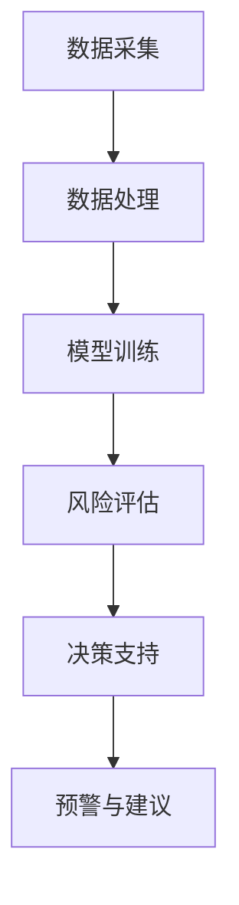

# 金融监管合规风险评估自动化平台

> 关键词：金融监管、合规风险评估、自动化平台、机器学习、数据处理

> 摘要：本文围绕金融监管合规风险评估自动化平台展开深入探讨。首先介绍了平台开发的背景，包括目的、预期读者和文档结构等内容。接着详细阐述了核心概念，如合规风险评估的原理和架构，并通过示意图和流程图进行直观展示。在核心算法原理部分，使用 Python 代码详细说明了算法的实现步骤。同时给出了相关的数学模型和公式，并举例进行说明。通过项目实战，介绍了开发环境搭建、源代码实现及代码解读。分析了该平台在金融领域的实际应用场景，推荐了学习资源、开发工具框架以及相关论文著作。最后总结了平台的未来发展趋势与挑战，并对常见问题进行了解答。

## 1. 背景介绍 
### 1.1 目的和范围
金融行业面临着日益严格的监管要求，合规风险评估是金融机构确保自身运营符合法律法规的重要环节。传统的合规风险评估方法往往依赖人工，效率低下且容易出现疏漏。本金融监管合规风险评估自动化平台的目的在于开发一个高效、准确的自动化系统，能够实时监测金融机构的业务活动，评估其合规风险，并及时发出预警。

平台的范围涵盖了多种金融业务，如银行信贷业务、证券交易业务、保险业务等。它可以处理大量的业务数据，包括交易记录、客户信息、财务报表等，并根据监管规则和行业标准进行风险评估。

### 1.2 预期读者
本文的预期读者包括金融机构的管理人员、合规部门工作人员、技术研发人员以及对金融监管和合规风险评估感兴趣的研究人员。金融机构管理人员可以通过本文了解平台的功能和优势，以便在决策中考虑引入该平台；合规部门工作人员可以掌握平台的使用方法和流程，提高工作效率；技术研发人员可以从代码实现和算法原理等方面获取灵感，进行相关系统的开发；研究人员可以通过本文了解金融监管合规风险评估的最新技术和发展趋势。

### 1.3 文档结构概述
本文将按照以下结构进行组织：首先介绍平台开发的背景信息，包括目的、预期读者和文档结构等；接着阐述核心概念，通过文本示意图和 Mermaid 流程图展示合规风险评估的原理和架构；然后详细讲解核心算法原理，并使用 Python 代码进行具体实现；给出相关的数学模型和公式，并举例说明；通过项目实战，介绍开发环境搭建、源代码实现及代码解读；分析平台的实际应用场景；推荐学习资源、开发工具框架和相关论文著作；最后总结平台的未来发展趋势与挑战，解答常见问题，并提供扩展阅读和参考资料。

### 1.4 术语表
#### 1.4.1 核心术语定义
- **金融监管**：指政府或金融监管机构为了维护金融市场的稳定、保护投资者利益、防范金融风险等目的，对金融机构的业务活动进行监督和管理的一系列措施。
- **合规风险**：指金融机构因未能遵循法律法规、监管要求、行业准则等规定而可能遭受法律制裁、监管处罚、重大财务损失或声誉损失的风险。
- **风险评估**：指对金融机构面临的各种风险进行识别、分析和评价的过程，以确定风险的性质、程度和可能性。
- **自动化平台**：指利用计算机技术和自动化算法，实现业务流程自动化处理的系统平台。

#### 1.4.2 相关概念解释
- **监管规则**：金融监管机构制定的一系列法律法规和政策要求，金融机构必须遵守这些规则进行业务活动。
- **风险指标**：用于衡量金融机构合规风险的各种量化指标，如资本充足率、不良贷款率、流动性比率等。
- **机器学习算法**：一种基于数据的算法，通过对大量数据的学习和分析，自动发现数据中的规律和模式，用于预测和决策。

#### 1.4.3 缩略词列表
- **API**：Application Programming Interface，应用程序编程接口
- **AI**：Artificial Intelligence，人工智能
- **ML**：Machine Learning，机器学习
- **KPI**：Key Performance Indicator，关键绩效指标

## 2. 核心概念与联系 

### 核心概念原理
金融监管合规风险评估自动化平台的核心原理是基于大量的业务数据和监管规则，利用机器学习算法和数据分析技术，对金融机构的业务活动进行实时监测和风险评估。平台首先收集金融机构的各种业务数据，包括交易记录、客户信息、财务报表等；然后对这些数据进行清洗、预处理和特征提取，将其转化为适合机器学习算法处理的格式；接着使用机器学习算法对数据进行分析和建模，预测金融机构的合规风险；最后根据风险评估结果，及时发出预警并提供相应的建议。

### 架构的文本示意图
```plaintext
+-------------------+
| 数据采集层        |
| - 交易记录        |
| - 客户信息        |
| - 财务报表        |
+-------------------+
| 数据处理层        |
| - 数据清洗        |
| - 预处理          |
| - 特征提取        |
+-------------------+
| 模型训练层        |
| - 机器学习算法    |
| - 模型评估        |
+-------------------+
| 风险评估层        |
| - 实时监测        |
| - 风险预测        |
| - 预警生成        |
+-------------------+
| 决策支持层        |
| - 建议生成        |
| - 报告输出        |
+-------------------+
```

### Mermaid 流程图


## 3. 核心算法原理 & 具体操作步骤 

### 核心算法原理
本平台主要使用逻辑回归算法进行合规风险评估。逻辑回归是一种常用的机器学习算法，用于解决二分类问题。在金融监管合规风险评估中，我们可以将金融机构的业务活动分为合规和不合规两类，通过逻辑回归算法对业务数据进行分析和建模，预测业务活动是否合规。

逻辑回归的基本原理是通过一个逻辑函数（也称为 Sigmoid 函数）将线性回归的输出映射到 [0, 1] 区间，从而得到一个概率值。该概率值表示样本属于正类（合规）的概率。逻辑函数的公式如下：

$$
\sigma(z)=\frac{1}{1 + e^{-z}}
$$

其中，$z$ 是线性回归的输出，$e$ 是自然常数。

线性回归的输出 $z$ 可以表示为：

$$
z = \theta_0 + \theta_1x_1 + \theta_2x_2 + \cdots + \theta_nx_n
$$

其中，$\theta_0, \theta_1, \cdots, \theta_n$ 是模型的参数，$x_1, x_2, \cdots, x_n$ 是输入特征。

### 具体操作步骤
1. **数据准备**：收集金融机构的业务数据，并进行清洗和预处理，将其转化为适合机器学习算法处理的格式。
2. **特征选择**：从预处理后的数据中选择与合规风险相关的特征，减少数据维度，提高模型的训练效率和准确性。
3. **模型训练**：使用逻辑回归算法对训练数据进行训练，调整模型的参数，使得模型能够准确地预测业务活动是否合规。
4. **模型评估**：使用测试数据对训练好的模型进行评估，计算模型的准确率、召回率、F1 值等指标，评估模型的性能。
5. **风险评估**：使用训练好的模型对新的业务数据进行风险评估，预测业务活动是否合规，并根据预测结果发出预警。

### Python 源代码实现
```python
import numpy as np
from sklearn.linear_model import LogisticRegression
from sklearn.model_selection import train_test_split
from sklearn.metrics import accuracy_score, recall_score, f1_score

# 生成示例数据
X = np.random.rand(100, 5)  # 100 个样本，每个样本有 5 个特征
y = np.random.randint(0, 2, 100)  # 随机生成标签，0 或 1

# 划分训练集和测试集
X_train, X_test, y_train, y_test = train_test_split(X, y, test_size=0.2, random_state=42)

# 创建逻辑回归模型
model = LogisticRegression()

# 训练模型
model.fit(X_train, y_train)

# 预测测试集
y_pred = model.predict(X_test)

# 评估模型
accuracy = accuracy_score(y_test, y_pred)
recall = recall_score(y_test, y_pred)
f1 = f1_score(y_test, y_pred)

print(f"Accuracy: {accuracy}")
print(f"Recall: {recall}")
print(f"F1 Score: {f1}")
```

## 4. 数学模型和公式 & 详细讲解 & 举例说明 

### 逻辑回归的损失函数
逻辑回归使用对数损失函数（也称为交叉熵损失函数）来衡量模型的预测结果与真实标签之间的差异。对数损失函数的公式如下：

$$
J(\theta)=-\frac{1}{m}\sum_{i = 1}^{m}[y^{(i)}\log(h_{\theta}(x^{(i)}))+(1 - y^{(i)})\log(1 - h_{\theta}(x^{(i)}))]
$$

其中，$m$ 是样本数量，$y^{(i)}$ 是第 $i$ 个样本的真实标签，$h_{\theta}(x^{(i)})$ 是第 $i$ 个样本的预测概率，$\theta$ 是模型的参数。

### 梯度下降法
为了最小化损失函数 $J(\theta)$，我们可以使用梯度下降法来更新模型的参数 $\theta$。梯度下降法的更新公式如下：

$$
\theta_j:=\theta_j-\alpha\frac{\partial J(\theta)}{\partial\theta_j}
$$

其中，$\alpha$ 是学习率，控制每次参数更新的步长。

### 举例说明
假设我们有一个简单的二分类问题，有两个特征 $x_1$ 和 $x_2$，真实标签 $y$ 为 0 或 1。我们可以使用逻辑回归模型来预测样本属于正类的概率。

首先，我们定义线性回归的输出 $z$ 为：

$$
z = \theta_0 + \theta_1x_1 + \theta_2x_2
$$

然后，通过逻辑函数将 $z$ 映射到 [0, 1] 区间，得到预测概率 $h_{\theta}(x)$：

$$
h_{\theta}(x)=\frac{1}{1 + e^{-z}}
$$

假设我们有一个样本 $(x_1 = 1, x_2 = 2)$，模型的参数为 $\theta_0 = 0.1, \theta_1 = 0.2, \theta_2 = 0.3$，则：

$$
z = 0.1 + 0.2\times1 + 0.3\times2 = 0.9
$$

$$
h_{\theta}(x)=\frac{1}{1 + e^{-0.9}}\approx0.71
$$

这意味着该样本属于正类的概率约为 0.71。

## 5. 项目实战：代码实际案例和详细解释说明 

### 5.1  开发环境搭建
1. **安装 Python**：推荐使用 Python 3.7 及以上版本，可以从 Python 官方网站（https://www.python.org/downloads/）下载并安装。
2. **安装必要的库**：使用 pip 命令安装所需的库，包括 numpy、pandas、scikit-learn 等。
```bash
pip install numpy pandas scikit-learn
```
3. **选择开发工具**：可以使用 PyCharm、Jupyter Notebook 等开发工具进行代码编写和调试。

### 5.2  源代码详细实现和代码解读
```python
import numpy as np
import pandas as pd
from sklearn.linear_model import LogisticRegression
from sklearn.model_selection import train_test_split
from sklearn.metrics import accuracy_score, recall_score, f1_score

# 加载数据
data = pd.read_csv('financial_data.csv')

# 数据预处理
X = data.drop('label', axis=1)  # 特征
y = data['label']  # 标签

# 划分训练集和测试集
X_train, X_test, y_train, y_test = train_test_split(X, y, test_size=0.2, random_state=42)

# 创建逻辑回归模型
model = LogisticRegression()

# 训练模型
model.fit(X_train, y_train)

# 预测测试集
y_pred = model.predict(X_test)

# 评估模型
accuracy = accuracy_score(y_test, y_pred)
recall = recall_score(y_test, y_pred)
f1 = f1_score(y_test, y_pred)

print(f"Accuracy: {accuracy}")
print(f"Recall: {recall}")
print(f"F1 Score: {f1}")
```

### 代码解读与分析
1. **数据加载**：使用 pandas 库的 `read_csv` 函数加载金融数据文件 `financial_data.csv`。
2. **数据预处理**：将特征和标签分离，分别存储在 `X` 和 `y` 中。
3. **划分训练集和测试集**：使用 `train_test_split` 函数将数据集划分为训练集和测试集，测试集占比为 20%。
4. **模型创建**：创建逻辑回归模型对象 `model`。
5. **模型训练**：使用训练集数据对模型进行训练，调用 `fit` 方法。
6. **模型预测**：使用训练好的模型对测试集数据进行预测，调用 `predict` 方法。
7. **模型评估**：使用 `accuracy_score`、`recall_score` 和 `f1_score` 函数计算模型的准确率、召回率和 F1 值。

## 6. 实际应用场景 
### 银行信贷业务
在银行信贷业务中，金融监管合规风险评估自动化平台可以实时监测借款人的信用状况、还款能力等信息，评估贷款业务的合规风险。例如，平台可以根据监管要求对借款人的收入水平、负债情况、信用记录等进行分析，判断贷款申请是否符合规定。如果发现借款人存在信用风险或不符合监管要求，平台可以及时发出预警，帮助银行采取相应的措施，如拒绝贷款申请、调整贷款利率等。

### 证券交易业务
在证券交易业务中，平台可以监测证券交易的合规性，防止内幕交易、操纵市场等违法行为。平台可以实时分析交易数据，如交易时间、交易价格、交易数量等，识别异常交易行为。例如，如果发现某一账户在短时间内进行大量的同一证券交易，且交易价格波动异常，平台可以及时发出预警，提示监管部门进行调查。

### 保险业务
在保险业务中，平台可以评估保险公司的业务合规风险，如保险产品的设计是否符合监管要求、保险销售过程是否存在欺诈行为等。平台可以对保险合同条款、销售记录、理赔数据等进行分析，发现潜在的合规问题。例如，如果发现某一保险产品的费率过高或过低，不符合市场规律，平台可以提示保险公司进行调整。

## 7. 工具和资源推荐
### 7.1 学习资源推荐
#### 7.1.1 书籍推荐
- 《Python 机器学习》：这本书详细介绍了 Python 在机器学习领域的应用，包括各种机器学习算法的原理和实现。
- 《金融科技：重塑金融未来》：该书介绍了金融科技的发展趋势和应用场景，包括金融监管科技的相关内容。
- 《机器学习实战》：通过实际案例介绍了机器学习算法的应用，帮助读者更好地理解和掌握机器学习技术。

#### 7.1.2 在线课程
- Coursera 上的《机器学习》课程：由斯坦福大学教授 Andrew Ng 授课，是一门非常经典的机器学习课程。
- edX 上的《金融科技基础》课程：介绍了金融科技的基本概念和技术，包括金融监管科技的相关内容。
- 阿里云大学的《Python 数据分析与机器学习实战》课程：通过实际案例介绍了 Python 在数据分析和机器学习领域的应用。

#### 7.1.3 技术博客和网站
- Medium 上的金融科技相关博客：可以关注一些金融科技领域的博主，了解最新的技术动态和应用案例。
- 知乎上的金融科技话题：可以在知乎上搜索金融科技相关的问题和回答，与其他爱好者交流和学习。
- 金融监管机构的官方网站：可以关注各国金融监管机构的官方网站，了解最新的监管政策和要求。

### 7.2 开发工具框架推荐
#### 7.2.1 IDE和编辑器
- PyCharm：是一款专业的 Python 集成开发环境，提供了丰富的功能和插件，适合开发大型的 Python 项目。
- Jupyter Notebook：是一个交互式的开发环境，适合进行数据分析和机器学习的实验和演示。
- Visual Studio Code：是一款轻量级的代码编辑器，支持多种编程语言，安装相关插件后可以用于 Python 开发。

#### 7.2.2 调试和性能分析工具
- Py-Spy：是一个用于 Python 代码性能分析的工具，可以帮助开发者找出代码中的性能瓶颈。
- PDB：是 Python 自带的调试工具，可以在代码中设置断点，逐步执行代码，帮助开发者调试代码。
- cProfile：是 Python 自带的性能分析工具，可以分析代码的运行时间和函数调用次数。

#### 7.2.3 相关框架和库
- Scikit-learn：是一个常用的机器学习库，提供了各种机器学习算法的实现，包括逻辑回归、决策树、支持向量机等。
- Pandas：是一个用于数据处理和分析的库，提供了高效的数据结构和数据操作方法，适合处理金融数据。
- Numpy：是一个用于科学计算的库，提供了高效的数组操作和数学函数，是许多机器学习库的基础。

### 7.3 相关论文著作推荐
#### 7.3.1 经典论文
- 《Credit Scoring Using Neural Networks and Discriminant Analysis》：介绍了使用神经网络和判别分析进行信用评分的方法。
- 《A Survey on Machine Learning in Credit Risk Analysis》：对机器学习在信用风险分析中的应用进行了综述。
- 《Financial Technology and Financial Stability》：探讨了金融科技对金融稳定的影响。

#### 7.3.2 最新研究成果
可以关注顶级金融和计算机科学会议和期刊上的最新研究成果，如 ACM SIGKDD、IEEE ICDM、Journal of Financial Economics 等。

#### 7.3.3 应用案例分析
可以参考一些金融机构的官方报告和研究论文，了解金融监管合规风险评估自动化平台的实际应用案例和效果。

## 8. 总结：未来发展趋势与挑战
### 未来发展趋势
- **智能化**：随着人工智能技术的不断发展，金融监管合规风险评估自动化平台将越来越智能化。平台将能够自动学习和适应新的监管规则和业务模式，提高风险评估的准确性和效率。
- **实时化**：平台将实现实时监测和预警，能够及时发现和处理合规风险。例如，在交易发生的瞬间，平台就能够对交易的合规性进行评估，并发出预警。
- **集成化**：平台将与金融机构的其他系统进行集成，实现数据的共享和业务流程的自动化。例如，与风险管理系统、客户关系管理系统等集成，提高金融机构的整体运营效率。
- **国际化**：随着金融全球化的发展，金融监管合规风险评估自动化平台将面临国际化的挑战和机遇。平台需要支持不同国家和地区的监管规则和业务模式，实现跨国界的风险评估和管理。

### 挑战
- **数据质量**：金融数据通常具有多样性、复杂性和不确定性，数据质量的好坏直接影响平台的性能和准确性。因此，如何提高数据质量，确保数据的准确性、完整性和一致性，是平台开发和应用面临的重要挑战。
- **监管规则变化**：金融监管规则不断变化和更新，平台需要及时适应这些变化，保证风险评估的合规性。如何快速、准确地将新的监管规则纳入平台，是平台开发和维护的难点。
- **技术安全**：金融数据涉及到大量的敏感信息，平台的技术安全至关重要。如何保障平台的安全性，防止数据泄露和恶意攻击，是平台开发和运营需要解决的关键问题。
- **人才短缺**：金融监管合规风险评估自动化平台的开发和应用需要既懂金融又懂技术的复合型人才。目前，这类人才相对短缺，如何培养和吸引相关人才，是平台发展面临的挑战之一。

## 9. 附录：常见问题与解答
### 问题 1：平台可以处理哪些类型的金融数据？
答：平台可以处理多种类型的金融数据，包括交易记录、客户信息、财务报表、信用评级等。具体的数据类型取决于金融机构的业务需求和监管要求。

### 问题 2：平台的风险评估结果是否准确可靠？
答：平台的风险评估结果的准确性和可靠性取决于多个因素，如数据质量、算法选择、模型训练等。为了提高评估结果的准确性，我们需要不断优化数据处理和算法模型，同时结合人工审核和专家经验进行综合判断。

### 问题 3：平台是否可以与金融机构的现有系统集成？
答：平台可以与金融机构的现有系统进行集成，通过 API 接口实现数据的共享和业务流程的自动化。在集成过程中，需要确保数据的安全性和兼容性。

### 问题 4：平台的开发和维护成本高吗？
答：平台的开发和维护成本取决于多个因素，如平台的功能需求、数据规模、技术复杂度等。一般来说，开发和维护一个功能完善的金融监管合规风险评估自动化平台需要一定的成本，但从长期来看，平台可以提高金融机构的工作效率，降低合规风险，带来显著的经济效益。

## 10. 扩展阅读 & 参考资料
- 《金融监管科技前沿》
- 《人工智能在金融领域的应用》
- 国际金融协会（IIF）发布的相关报告
- 各国金融监管机构发布的政策文件和研究报告

作者：AI天才研究院/AI Genius Institute & 禅与计算机程序设计艺术 /Zen And The Art of Computer Programming