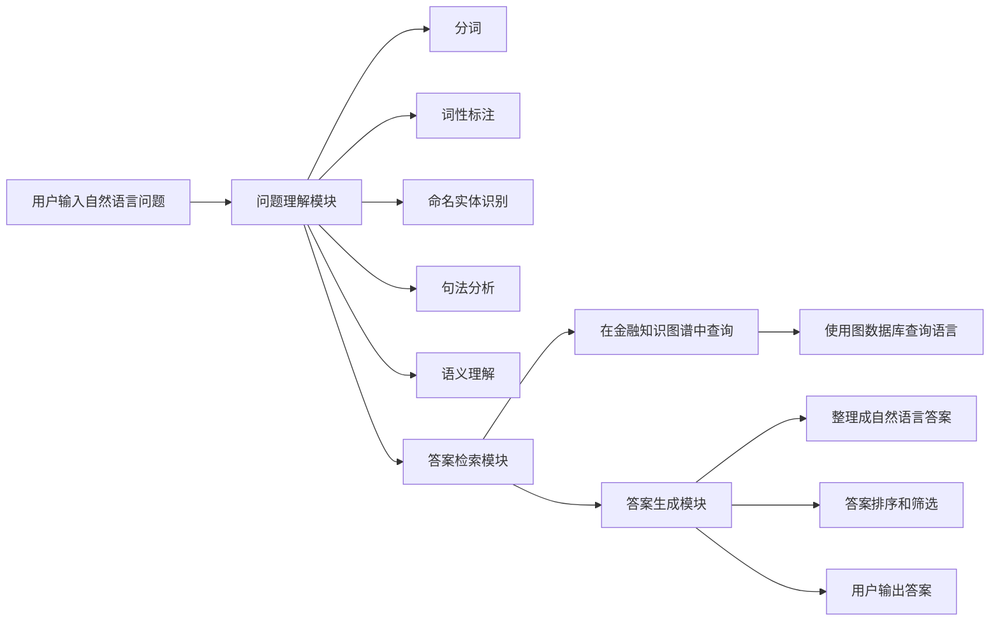

# 金融知识图谱在智能问答中的应用

> 关键词：金融知识图谱、智能问答、知识表示、自然语言处理、图数据库

> 摘要：本文深入探讨了金融知识图谱在智能问答中的应用。首先介绍了金融知识图谱和智能问答的背景知识，包括目的、预期读者、文档结构和相关术语。接着阐述了核心概念及其联系，详细讲解了核心算法原理和具体操作步骤，并结合Python代码进行说明。同时给出了相关的数学模型和公式，并举例说明。通过项目实战，展示了开发环境搭建、源代码实现和代码解读。分析了金融知识图谱在智能问答中的实际应用场景，推荐了学习资源、开发工具框架和相关论文著作。最后总结了未来发展趋势与挑战，解答了常见问题，并提供了扩展阅读和参考资料。

## 1. 背景介绍 
### 1.1 目的和范围
金融领域信息繁杂，包含大量的公司、产品、市场数据等。传统的信息检索方式难以满足用户对于复杂金融问题的高效解答需求。金融知识图谱在智能问答中的应用旨在构建一个能够理解用户自然语言问题，并基于金融知识图谱提供准确、全面答案的智能系统。本文章的范围涵盖了金融知识图谱和智能问答的基本概念、核心算法、数学模型、项目实战以及实际应用场景等方面，旨在为读者提供一个全面深入的技术指导。

### 1.2 预期读者
本文的预期读者包括金融科技领域的从业者，如数据分析师、算法工程师、产品经理等；对人工智能和自然语言处理技术感兴趣的研究人员；以及希望了解金融知识图谱和智能问答应用的学生和爱好者。

### 1.3 文档结构概述
本文首先介绍了相关的背景知识，包括目的、预期读者和文档结构。接着阐述了核心概念及其联系，详细讲解了核心算法原理和具体操作步骤。然后给出了相关的数学模型和公式，并举例说明。通过项目实战，展示了开发环境搭建、源代码实现和代码解读。分析了金融知识图谱在智能问答中的实际应用场景，推荐了学习资源、开发工具框架和相关论文著作。最后总结了未来发展趋势与挑战，解答了常见问题，并提供了扩展阅读和参考资料。

### 1.4 术语表
#### 1.4.1 核心术语定义
- **金融知识图谱**：是一种基于图的数据结构，将金融领域的实体（如公司、金融产品、市场指标等）及其之间的关系（如股权关系、交易关系等）以图的形式进行表示和存储。
- **智能问答**：是一种让计算机理解用户自然语言问题，并根据知识库或其他信息源提供准确答案的技术。
- **知识表示**：是将知识以计算机能够处理和理解的方式进行表示，在金融知识图谱中常用的知识表示方法有三元组（实体 - 关系 - 实体）。
- **自然语言处理（NLP）**：是研究如何让计算机理解和处理人类自然语言的技术，包括文本分类、命名实体识别、句法分析等任务。
- **图数据库**：是专门用于存储和管理图数据的数据库，如Neo4j、JanusGraph等。

#### 1.4.2 相关概念解释
- **实体**：是指现实世界中的具体事物，在金融领域可以是公司、个人、金融产品等。
- **关系**：描述了实体之间的联系，如“投资”、“持有”、“发行”等。
- **属性**：是实体的特征，如公司的注册资本、成立时间等。
- **语义理解**：是指计算机对自然语言文本的语义进行分析和理解，从而能够准确把握用户的意图。

#### 1.4.3 缩略词列表
- **NLP**：Natural Language Processing（自然语言处理）
- **KG**：Knowledge Graph（知识图谱）
- **RDF**：Resource Description Framework（资源描述框架）
- **SPARQL**：SPARQL Protocol and RDF Query Language（SPARQL协议和RDF查询语言）

## 2. 核心概念与联系 

### 核心概念原理
#### 金融知识图谱
金融知识图谱是金融领域知识的结构化表示。它通过将金融实体（如银行、企业、金融产品等）以及它们之间的关系（如股权关系、借贷关系等）抽象为图的节点和边，形成一个语义网络。例如，一家银行可以作为一个节点，它对某企业的贷款关系可以用一条边来表示。这种表示方式能够清晰地展示金融领域的复杂信息，为智能问答提供了丰富的知识基础。

#### 智能问答
智能问答系统旨在理解用户的自然语言问题，并根据知识库（如金融知识图谱）提供准确的答案。它主要包括三个关键步骤：问题理解、答案检索和答案生成。问题理解是对用户输入的问题进行语义分析，提取关键信息；答案检索是根据问题理解的结果在知识库中查找相关信息；答案生成是将检索到的信息整理成自然语言的答案反馈给用户。

### 架构的文本示意图
```plaintext
用户输入自然语言问题
|
|-- 问题理解模块
|    |-- 分词
|    |-- 词性标注
|    |-- 命名实体识别
|    |-- 句法分析
|    |-- 语义理解
|
|-- 答案检索模块
|    |-- 根据问题语义在金融知识图谱中查询相关实体和关系
|    |-- 利用图数据库的查询语言（如Cypher、SPARQL）进行查询
|
|-- 答案生成模块
|    |-- 将查询结果整理成自然语言答案
|    |-- 进行答案的排序和筛选
|
|-- 用户输出答案
```

### Mermaid流程图


## 3. 核心算法原理 & 具体操作步骤 

### 问题理解算法：基于深度学习的命名实体识别（NER）和词性标注
命名实体识别和词性标注是问题理解的重要步骤，它们可以帮助我们从用户输入的问题中提取关键信息。这里我们使用Python的`transformers`库来实现基于预训练模型的NER和词性标注。

```python
from transformers import AutoTokenizer, AutoModelForTokenClassification
import torch

# 加载预训练的NER模型和分词器
tokenizer = AutoTokenizer.from_pretrained("dbmdz/bert-large-cased-finetuned-conll03-english")
model = AutoModelForTokenClassification.from_pretrained("dbmdz/bert-large-cased-finetuned-conll03-english")

def ner_and_pos_tagging(text):
    # 对输入文本进行分词
    inputs = tokenizer(text, return_tensors="pt")
    # 模型推理
    with torch.no_grad():
        logits = model(**inputs).logits
    # 获取预测结果
    predictions = torch.argmax(logits, dim=2)
    # 解码预测结果
    predicted_token_class = [model.config.id2label[t.item()] for t in predictions[0]]
    # 打印结果
    for token, tag in zip(tokenizer.tokenize(text), predicted_token_class):
        print(f"{token}: {tag}")

# 示例问题
question = "What is the market capitalization of Apple Inc.?"
ner_and_pos_tagging(question)
```

### 答案检索算法：图数据库查询
在金融知识图谱中，我们可以使用图数据库（如Neo4j）来存储和查询知识。以下是一个使用Python的`py2neo`库进行Neo4j查询的示例。

```python
from py2neo import Graph

# 连接到Neo4j数据库
graph = Graph("bolt://localhost:7687", auth=("neo4j", "password"))

def answer_retrieval(question):
    # 假设问题已经经过处理，得到了需要查询的实体和关系
    entity = "Apple Inc."
    relation = "market capitalization"
    # 构建Cypher查询语句
    query = f"MATCH (n:Company {{name: '{entity}'}})-[r]->(m) WHERE type(r) = '{relation}' RETURN m.value"
    # 执行查询
    result = graph.run(query)
    # 获取查询结果
    for record in result:
        print(record[0])

# 示例问题
question = "What is the market capitalization of Apple Inc.?"
answer_retrieval(question)
```

### 答案生成算法：模板填充
答案生成可以使用模板填充的方法，根据查询结果和预定义的模板生成自然语言答案。

```python
def answer_generation(result):
    template = "The {relation} of {entity} is {value}."
    entity = "Apple Inc."
    relation = "market capitalization"
    value = result
    answer = template.format(entity=entity, relation=relation, value=value)
    return answer

# 示例结果
result = "2.5 trillion dollars"
answer = answer_generation(result)
print(answer)
```

## 4. 数学模型和公式 & 详细讲解 & 举例说明 

### 知识表示的数学模型：资源描述框架（RDF）
资源描述框架（RDF）是一种用于表示知识的标准模型，它使用三元组（主语 - 谓语 - 宾语）来描述实体之间的关系。在金融知识图谱中，一个RDF三元组可以表示为 $(s, p, o)$，其中 $s$ 是主语（实体），$p$ 是谓语（关系），$o$ 是宾语（实体或属性值）。

例如，“Apple Inc. 发行了 iPhone” 可以表示为一个RDF三元组：

$$
(\text{Apple Inc.}, \text{发行}, \text{iPhone})
$$

### 图数据库查询的数学模型：图查询语言
图数据库查询语言（如Cypher、SPARQL）可以看作是一种对图数据进行查询的数学模型。以Cypher为例，它使用图模式匹配的方式来查询图数据。

例如，查询所有与 “Apple Inc.” 有 “投资” 关系的实体可以用以下Cypher查询语句表示：

```plaintext
MATCH (n:Company {name: 'Apple Inc.'})-[r:投资]->(m) RETURN m.name
```

从数学角度来看，这个查询可以看作是在图 $G=(V, E)$ 中寻找满足特定条件的节点和边。其中 $V$ 是节点集合，$E$ 是边集合。查询的目标是找到所有满足条件的节点 $m$，使得存在一条从节点 $n$ 到节点 $m$ 的边 $r$，且 $n$ 的名称为 “Apple Inc.”，$r$ 的类型为 “投资”。

### 自然语言处理中的概率模型：隐马尔可夫模型（HMM）
在词性标注和命名实体识别等自然语言处理任务中，隐马尔可夫模型（HMM）是一种常用的概率模型。HMM由三个部分组成：状态集合 $S$、观测集合 $O$ 和三个概率分布：初始状态概率分布 $\pi$、状态转移概率分布 $A$ 和观测概率分布 $B$。

设 $Q = q_1, q_2, \cdots, q_T$ 是一个状态序列，$O = o_1, o_2, \cdots, o_T$ 是一个观测序列。HMM的目标是找到最可能的状态序列 $Q$ 来生成观测序列 $O$。

根据HMM的定义，观测序列 $O$ 和状态序列 $Q$ 的联合概率可以表示为：

$$
P(O, Q) = \pi_{q_1} \prod_{t=1}^{T-1} a_{q_t q_{t+1}} \prod_{t=1}^{T} b_{q_t}(o_t)
$$

其中 $\pi_{q_1}$ 是初始状态 $q_1$ 的概率，$a_{q_t q_{t+1}}$ 是从状态 $q_t$ 转移到状态 $q_{t+1}$ 的概率，$b_{q_t}(o_t)$ 是在状态 $q_t$ 下观测到 $o_t$ 的概率。

例如，在词性标注任务中，状态可以表示词性，观测可以表示单词。我们可以使用HMM来预测每个单词的词性。

## 5. 项目实战：代码实际案例和详细解释说明 

### 5.1  开发环境搭建
#### 安装Python和相关库
首先，确保你已经安装了Python 3.6或更高版本。然后使用`pip`安装以下必要的库：

```bash
pip install transformers py2neo
```

#### 安装Neo4j图数据库
1. 从Neo4j官方网站（https://neo4j.com/download/）下载并安装Neo4j社区版。
2. 启动Neo4j服务，并使用浏览器访问`http://localhost:7474`，设置用户名和密码。

### 5.2  源代码详细实现和代码解读
以下是一个完整的金融知识图谱智能问答系统的示例代码：

```python
from transformers import AutoTokenizer, AutoModelForTokenClassification
import torch
from py2neo import Graph

# 加载预训练的NER模型和分词器
tokenizer = AutoTokenizer.from_pretrained("dbmdz/bert-large-cased-finetuned-conll03-english")
model = AutoModelForTokenClassification.from_pretrained("dbmdz/bert-large-cased-finetuned-conll03-english")

# 连接到Neo4j数据库
graph = Graph("bolt://localhost:7687", auth=("neo4j", "password"))

def ner_and_pos_tagging(text):
    """
    命名实体识别和词性标注
    :param text: 输入文本
    :return: 预测的标签列表
    """
    inputs = tokenizer(text, return_tensors="pt")
    with torch.no_grad():
        logits = model(**inputs).logits
    predictions = torch.argmax(logits, dim=2)
    predicted_token_class = [model.config.id2label[t.item()] for t in predictions[0]]
    return predicted_token_class

def extract_entity_and_relation(tags, text):
    """
    从NER和词性标注结果中提取实体和关系
    :param tags: 预测的标签列表
    :param text: 输入文本
    :return: 实体和关系
    """
    entity = ""
    relation = ""
    tokens = tokenizer.tokenize(text)
    for i, (token, tag) in enumerate(zip(tokens, tags)):
        if tag.startswith("B-ORG"):  # 假设ORG表示组织实体
            entity = token
        elif tag.startswith("B-REL"):  # 假设REL表示关系
            relation = token
    return entity, relation

def answer_retrieval(entity, relation):
    """
    在金融知识图谱中检索答案
    :param entity: 实体
    :param relation: 关系
    :return: 查询结果
    """
    query = f"MATCH (n:Company {{name: '{entity}'}})-[r]->(m) WHERE type(r) = '{relation}' RETURN m.value"
    result = graph.run(query)
    for record in result:
        return record[0]
    return None

def answer_generation(result, entity, relation):
    """
    根据查询结果生成自然语言答案
    :param result: 查询结果
    :param entity: 实体
    :param relation: 关系
    :return: 自然语言答案
    """
    template = "The {relation} of {entity} is {value}."
    if result is not None:
        answer = template.format(entity=entity, relation=relation, value=result)
    else:
        answer = f"Sorry, I couldn't find the {relation} of {entity}."
    return answer

def main():
    question = "What is the market capitalization of Apple Inc.?"
    tags = ner_and_pos_tagging(question)
    entity, relation = extract_entity_and_relation(tags, question)
    result = answer_retrieval(entity, relation)
    answer = answer_generation(result, entity, relation)
    print(answer)

if __name__ == "__main__":
    main()
```

### 5.3  代码解读与分析
- **`ner_and_pos_tagging` 函数**：使用预训练的NER模型对输入文本进行命名实体识别和词性标注。
- **`extract_entity_and_relation` 函数**：从NER和词性标注结果中提取实体和关系。
- **`answer_retrieval` 函数**：根据提取的实体和关系在金融知识图谱中进行查询。
- **`answer_generation` 函数**：根据查询结果生成自然语言答案。
- **`main` 函数**：将上述步骤整合起来，实现一个完整的智能问答流程。

## 6. 实际应用场景 
### 金融咨询服务
在金融咨询服务中，客户可能会提出各种问题，如某只股票的基本面信息、某家银行的理财产品特点等。金融知识图谱智能问答系统可以快速准确地回答这些问题，为客户提供及时的咨询服务。

### 投资决策辅助
投资者在做出投资决策时，需要了解大量的金融信息，如公司的财务状况、行业竞争格局等。智能问答系统可以根据投资者的问题，从金融知识图谱中提取相关信息，为投资决策提供参考。

### 风险评估
金融机构在进行风险评估时，需要分析各种风险因素，如信用风险、市场风险等。金融知识图谱智能问答系统可以帮助分析师快速获取相关的风险信息，提高风险评估的效率和准确性。

### 金融监管
金融监管机构需要对金融市场进行实时监测和监管，及时发现和处理潜在的风险。智能问答系统可以帮助监管人员快速查询和分析金融机构的相关信息，提高监管的有效性。

## 7. 工具和资源推荐
### 7.1 学习资源推荐
#### 7.1.1 书籍推荐
- 《知识图谱：方法、实践与应用》：全面介绍了知识图谱的理论、技术和应用，包括知识表示、知识获取、知识推理等方面。
- 《自然语言处理入门》：系统地介绍了自然语言处理的基本概念、算法和技术，适合初学者学习。
- 《Python自然语言处理》：通过Python代码示例，详细介绍了自然语言处理的各种任务和技术，如分词、词性标注、命名实体识别等。

#### 7.1.2 在线课程
- Coursera上的“Natural Language Processing Specialization”：由知名高校教授授课，系统地介绍了自然语言处理的各个方面。
- edX上的“Knowledge Graphs”：深入讲解了知识图谱的理论和实践，包括知识图谱的构建、查询和应用。

#### 7.1.3 技术博客和网站
- 博客园：有很多技术博主分享自然语言处理和知识图谱的相关经验和技术文章。
- 机器之心：专注于人工智能领域的前沿技术和应用，提供了很多有价值的资讯和文章。
- arXiv：是一个预印本数据库，包含了大量的最新研究成果，对于了解金融知识图谱和智能问答的最新研究动态非常有帮助。

### 7.2 开发工具框架推荐
#### 7.2.1 IDE和编辑器
- PyCharm：是一款专业的Python集成开发环境，提供了丰富的代码编辑、调试和测试功能。
- Jupyter Notebook：是一个交互式的开发环境，适合进行数据探索和模型实验。

#### 7.2.2 调试和性能分析工具
- TensorBoard：是TensorFlow的可视化工具，可以帮助我们直观地查看模型的训练过程和性能指标。
- Py-Spy：是一个Python性能分析工具，可以帮助我们找出代码中的性能瓶颈。

#### 7.2.3 相关框架和库
- `transformers`：是Hugging Face开发的一个自然语言处理库，提供了大量的预训练模型和工具，方便我们进行命名实体识别、文本分类等任务。
- `py2neo`：是一个Python库，用于与Neo4j图数据库进行交互，方便我们进行图数据的存储和查询。
- `NLTK`：是一个Python自然语言处理工具包，提供了丰富的语料库和工具，适合初学者学习和实践。

### 7.3 相关论文著作推荐
#### 7.3.1 经典论文
- “Knowledge Graph Embedding: A Survey of Approaches and Applications”：对知识图谱嵌入技术进行了全面的综述，介绍了各种知识图谱嵌入方法和应用场景。
- “Natural Language Processing (Almost) from Scratch”：系统地介绍了自然语言处理的基本概念和算法，是自然语言处理领域的经典论文之一。

#### 7.3.2 最新研究成果
- 可以关注ACM SIGKDD、IEEE ICDM等顶级数据挖掘会议，以及ACL、EMNLP等自然语言处理会议上的最新研究成果。

#### 7.3.3 应用案例分析
- 可以参考一些金融科技公司的技术博客和报告，了解金融知识图谱和智能问答在实际应用中的案例和经验。

## 8. 总结：未来发展趋势与挑战
### 未来发展趋势
- **多模态融合**：未来的金融知识图谱智能问答系统将不仅仅局限于文本信息，还将融合图像、音频、视频等多模态信息，提供更加丰富和全面的答案。
- **强化学习与智能交互**：引入强化学习技术，使智能问答系统能够根据用户的反馈不断优化回答策略，实现更加智能和个性化的交互。
- **跨领域知识融合**：将金融知识图谱与其他领域的知识图谱进行融合，如医疗、教育等，为用户提供更加综合和全面的服务。

### 挑战
- **知识图谱构建的准确性和完整性**：金融领域知识复杂多变，如何确保知识图谱构建的准确性和完整性是一个挑战。需要不断优化知识获取和融合方法，提高知识图谱的质量。
- **自然语言理解的难度**：自然语言具有多样性和歧义性，如何准确理解用户的问题意图是智能问答系统面临的一大挑战。需要不断改进自然语言处理技术，提高语义理解的准确性。
- **数据隐私和安全**：金融领域涉及大量的敏感数据，如何在保证智能问答系统性能的同时，确保数据的隐私和安全是一个重要的问题。需要采用先进的加密技术和安全机制，保护用户数据的安全。

## 9. 附录：常见问题与解答
### 如何选择合适的图数据库？
选择合适的图数据库需要考虑以下因素：
- **性能**：根据数据规模和查询需求，选择性能良好的图数据库。
- **功能**：不同的图数据库提供不同的功能，如查询语言、数据建模等，根据实际需求选择合适的功能。
- **社区支持**：选择有活跃社区支持的图数据库，方便获取技术支持和资源。

### 如何提高自然语言理解的准确性？
可以从以下几个方面提高自然语言理解的准确性：
- **使用预训练模型**：如BERT、GPT等预训练模型，它们在自然语言处理任务中表现出色。
- **数据增强**：通过数据增强技术，如随机替换、插入等，扩充训练数据，提高模型的泛化能力。
- **多模型融合**：将多个自然语言处理模型进行融合，综合利用它们的优势，提高理解的准确性。

### 如何确保金融知识图谱的安全性？
可以采取以下措施确保金融知识图谱的安全性：
- **数据加密**：对敏感数据进行加密处理，防止数据泄露。
- **访问控制**：设置严格的访问权限，只有授权人员才能访问和修改知识图谱。
- **安全审计**：定期进行安全审计，及时发现和处理安全漏洞。

## 10. 扩展阅读 & 参考资料
### 扩展阅读
- 《人工智能：现代方法》：全面介绍了人工智能的各个领域，包括自然语言处理、知识表示、机器学习等。
- 《图神经网络：基础、前沿与应用》：详细介绍了图神经网络的理论和应用，对于理解金融知识图谱的表示和推理有很大帮助。

### 参考资料
- Neo4j官方文档：https://neo4j.com/docs/
- Hugging Face官方文档：https://huggingface.co/docs/transformers/index
- NLTK官方文档：https://www.nltk.org/

作者：AI天才研究院/AI Genius Institute & 禅与计算机程序设计艺术 /Zen And The Art of Computer Programming