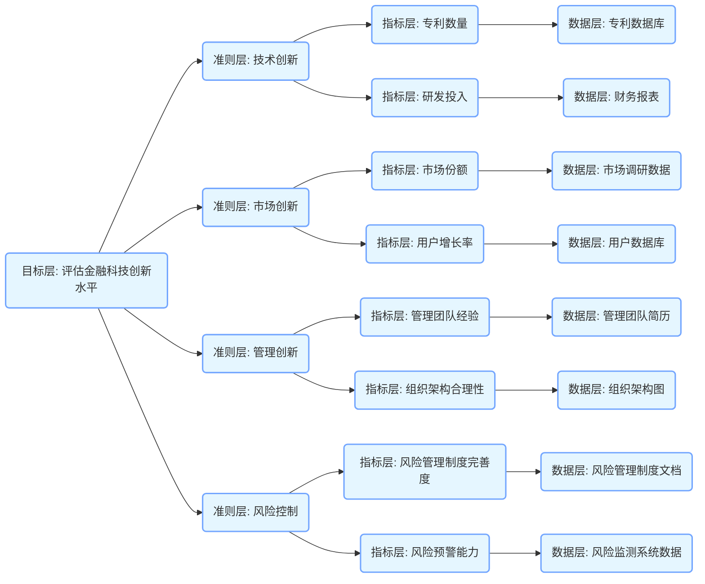

# 金融科技创新评估框架

> 关键词：金融科技、创新评估框架、评估指标、数学模型、实际应用

> 摘要：本文旨在构建一个全面、科学的金融科技创新评估框架。首先介绍了金融科技创新评估的背景，包括目的、预期读者、文档结构和相关术语。接着阐述了核心概念及联系，给出了清晰的原理和架构示意图。详细讲解了核心算法原理并使用 Python 代码进行说明，同时引入数学模型和公式辅助理解。通过项目实战展示了如何在实际中运用该评估框架，分析了开发环境搭建、源代码实现及解读。探讨了该评估框架的实际应用场景，推荐了相关的学习资源、开发工具和论文著作。最后总结了金融科技创新评估框架的未来发展趋势与挑战，并提供了常见问题解答和扩展阅读参考资料，为金融科技领域的创新评估提供了系统的指导。

## 1. 背景介绍 
### 1.1 目的和范围
金融科技（Fintech）作为金融与科技深度融合的产物，正以前所未有的速度改变着传统金融行业的格局。金融科技创新不仅带来了新的金融产品、服务和模式，也对金融监管、风险管理等方面提出了新的挑战。因此，建立一个科学、合理、有效的金融科技创新评估框架具有重要的现实意义。

本评估框架的目的在于为金融机构、监管部门、投资者等相关主体提供一个全面、客观、可量化的评估工具，以准确衡量金融科技创新的水平和价值，为决策提供科学依据。评估范围涵盖了金融科技的各个领域，包括但不限于支付清算、借贷融资、财富管理、保险科技、监管科技等。

### 1.2 预期读者
本评估框架的预期读者包括以下几类：
1. **金融机构从业者**：银行、证券、保险等金融机构的管理人员、产品研发人员、市场营销人员等，他们可以利用该评估框架评估自身的创新能力，发现优势和不足，制定相应的发展战略。
2. **监管部门工作人员**：负责金融监管的政府部门和行业协会的工作人员，他们可以通过该评估框架了解金融科技行业的创新动态，制定合理的监管政策，防范金融风险。
3. **投资者**：风险投资机构、私募股权投资基金、个人投资者等，他们可以借助该评估框架评估金融科技企业的投资价值，做出明智的投资决策。
4. **科研人员和学者**：从事金融科技领域研究的科研人员和学者，他们可以将该评估框架作为研究工具，深入探讨金融科技创新的规律和机制。

### 1.3 文档结构概述
本文将按照以下结构进行阐述：
1. **核心概念与联系**：介绍金融科技创新评估框架的核心概念，包括金融科技、创新评估等，并分析它们之间的联系。
2. **核心算法原理 & 具体操作步骤**：详细讲解评估框架所采用的核心算法原理，并给出具体的操作步骤，同时使用 Python 代码进行说明。
3. **数学模型和公式 & 详细讲解 & 举例说明**：引入数学模型和公式来描述评估过程，对公式进行详细讲解，并通过具体例子说明如何应用这些公式。
4. **项目实战：代码实际案例和详细解释说明**：通过一个实际的项目案例，展示如何使用该评估框架进行金融科技创新评估，包括开发环境搭建、源代码实现和代码解读。
5. **实际应用场景**：探讨该评估框架在金融机构、监管部门、投资者等不同主体中的实际应用场景。
6. **工具和资源推荐**：推荐相关的学习资源、开发工具和论文著作，帮助读者进一步深入学习和研究金融科技创新评估。
7. **总结：未来发展趋势与挑战**：总结金融科技创新评估框架的发展现状，分析未来的发展趋势和面临的挑战。
8. **附录：常见问题与解答**：提供常见问题的解答，帮助读者解决在使用评估框架过程中遇到的问题。
9. **扩展阅读 & 参考资料**：列出相关的扩展阅读材料和参考资料，方便读者进一步查阅。

### 1.4 术语表
#### 1.4.1 核心术语定义
- **金融科技（Fintech）**：是指技术带来的金融创新，它能创造新的业务模式、应用、流程或产品，从而对金融市场、金融机构或金融服务的提供方式产生重大影响。
- **金融科技创新评估**：是指运用科学的方法和指标体系，对金融科技领域的创新活动进行全面、客观、公正的评价和分析，以衡量其创新水平、价值和潜力。
- **评估指标**：是指用于衡量金融科技创新水平和价值的具体变量或因素，如技术创新性、市场竞争力、风险控制能力等。
- **权重**：是指在评估指标体系中，每个指标所占据的重要程度，通常用数值表示。

#### 1.4.2 相关概念解释
- **创新能力**：是指企业或组织在技术、产品、服务、管理等方面进行创新的能力，包括创新的意愿、创新的资源投入、创新的成果产出等方面。
- **市场潜力**：是指金融科技产品或服务在市场上的潜在需求和发展空间，包括市场规模、市场增长率、市场份额等方面。
- **风险控制**：是指金融机构或企业在开展金融科技业务过程中，对各种风险进行识别、评估、监测和控制的能力，以确保业务的稳健运行。

#### 1.4.3 缩略词列表
- **AI**：人工智能（Artificial Intelligence）
- **ML**：机器学习（Machine Learning）
- **DL**：深度学习（Deep Learning）
- **Blockchain**：区块链
- **API**：应用程序编程接口（Application Programming Interface）

## 2. 核心概念与联系 
### 核心概念原理
金融科技创新评估框架的核心概念主要包括金融科技、创新评估和评估指标体系。

金融科技是技术与金融的融合，其创新主要体现在利用新兴技术如人工智能、区块链、大数据等改进金融服务的效率、质量和安全性。创新评估则是对金融科技企业或项目的创新程度、价值和潜力进行综合评价的过程。评估指标体系是创新评估的基础，它由一系列相互关联的评估指标组成，用于全面、客观地反映金融科技创新的各个方面。

### 架构的文本示意图
金融科技创新评估框架的架构可以分为以下几个层次：
1. **目标层**：评估金融科技创新的总体水平和价值，为决策提供依据。
2. **准则层**：包括技术创新、市场创新、管理创新和风险控制等几个方面，是对金融科技创新的不同维度进行分类评估。
3. **指标层**：每个准则层下又包含若干个具体的评估指标，如技术创新性可以用专利数量、研发投入等指标来衡量。
4. **数据层**：收集和整理与评估指标相关的数据，为评估提供基础数据支持。

### Mermaid 流程图


## 3. 核心算法原理 & 具体操作步骤 
### 核心算法原理
本评估框架采用层次分析法（AHP）和模糊综合评价法相结合的方法进行评估。层次分析法用于确定评估指标的权重，模糊综合评价法用于对金融科技创新进行综合评价。

层次分析法（AHP）是一种将定性和定量分析相结合的决策方法，其基本原理是将复杂的决策问题分解为多个层次，通过两两比较确定各层次中元素的相对重要性，从而得到各元素的权重。

模糊综合评价法是一种基于模糊数学的综合评价方法，它通过建立模糊评价矩阵，将定性评价转化为定量评价，从而得到综合评价结果。

### 具体操作步骤
1. **建立层次结构模型**：根据金融科技创新评估的目标和准则，建立层次结构模型，包括目标层、准则层和指标层。
2. **构造判断矩阵**：通过专家打分的方式，对同一层次中的元素进行两两比较，构造判断矩阵。判断矩阵的元素表示两个元素之间的相对重要性，通常采用 1 - 9 标度法进行赋值。
3. **计算权重向量**：对判断矩阵进行一致性检验，若通过检验，则计算判断矩阵的特征向量，归一化后得到各元素的权重向量。
4. **建立模糊评价矩阵**：根据评估指标的实际数据，确定每个指标的隶属度，从而建立模糊评价矩阵。
5. **进行模糊综合评价**：将权重向量与模糊评价矩阵相乘，得到综合评价向量，根据最大隶属度原则确定评价结果。

### Python 源代码实现
```python
import numpy as np

# 层次分析法计算权重
def ahp(matrix):
    n = matrix.shape[0]
    # 计算特征值和特征向量
    eigenvalues, eigenvectors = np.linalg.eig(matrix)
    # 最大特征值
    max_eigenvalue = np.max(eigenvalues).real
    # 对应的特征向量
    index = np.argmax(eigenvalues)
    eigenvector = eigenvectors[:, index].real
    # 归一化处理
    weights = eigenvector / np.sum(eigenvector)
    # 一致性检验
    RI = [0, 0, 0.58, 0.9, 1.12, 1.24, 1.32, 1.41, 1.45]
    CI = (max_eigenvalue - n) / (n - 1)
    CR = CI / RI[n - 1]
    if CR < 0.1:
        print("一致性检验通过")
    else:
        print("一致性检验未通过，请重新调整判断矩阵")
    return weights

# 模糊综合评价
def fuzzy_evaluation(weights, fuzzy_matrix):
    # 计算综合评价向量
    result = np.dot(weights, fuzzy_matrix)
    # 最大隶属度原则确定评价结果
    index = np.argmax(result)
    evaluation_levels = ['低', '中', '高']
    return evaluation_levels[index]

# 示例判断矩阵
matrix = np.array([[1, 3, 5],
                   [1/3, 1, 3],
                   [1/5, 1/3, 1]])

# 计算权重
weights = ahp(matrix)
print("权重向量:", weights)

# 示例模糊评价矩阵
fuzzy_matrix = np.array([[0.2, 0.3, 0.5],
                         [0.3, 0.4, 0.3],
                         [0.1, 0.3, 0.6]])

# 进行模糊综合评价
evaluation_result = fuzzy_evaluation(weights, fuzzy_matrix)
print("评价结果:", evaluation_result)
```

## 4. 数学模型和公式 & 详细讲解 & 举例说明 
### 层次分析法数学模型和公式
#### 构造判断矩阵
设准则层有 $n$ 个元素 $C_1, C_2, \cdots, C_n$，通过两两比较得到判断矩阵 $A = (a_{ij})_{n\times n}$，其中 $a_{ij}$ 表示元素 $C_i$ 与元素 $C_j$ 的相对重要性，且满足 $a_{ij} > 0$，$a_{ji} = \frac{1}{a_{ij}}$，$a_{ii} = 1$。

#### 计算最大特征值和特征向量
判断矩阵 $A$ 的最大特征值 $\lambda_{max}$ 满足：
$$A\omega = \lambda_{max}\omega$$
其中 $\omega$ 是对应的特征向量。

#### 一致性检验
一致性指标 $CI$ 定义为：
$$CI = \frac{\lambda_{max} - n}{n - 1}$$
随机一致性指标 $RI$ 是一个与矩阵阶数 $n$ 有关的常数，其值可以通过查表得到。
一致性比率 $CR$ 定义为：
$$CR = \frac{CI}{RI}$$
当 $CR < 0.1$ 时，认为判断矩阵具有满意的一致性；否则，需要重新调整判断矩阵。

#### 示例说明
假设有三个准则 $C_1$、$C_2$、$C_3$，通过专家打分得到判断矩阵：
$$A = \begin{bmatrix}
1 & 3 & 5 \\
\frac{1}{3} & 1 & 3 \\
\frac{1}{5} & \frac{1}{3} & 1
\end{bmatrix}$$
首先计算最大特征值 $\lambda_{max}$ 和对应的特征向量 $\omega$，然后计算一致性指标 $CI$ 和一致性比率 $CR$。
```python
import numpy as np

matrix = np.array([[1, 3, 5],
                   [1/3, 1, 3],
                   [1/5, 1/3, 1]])

n = matrix.shape[0]
eigenvalues, eigenvectors = np.linalg.eig(matrix)
max_eigenvalue = np.max(eigenvalues).real
index = np.argmax(eigenvalues)
eigenvector = eigenvectors[:, index].real
weights = eigenvector / np.sum(eigenvector)

RI = [0, 0, 0.58, 0.9, 1.12, 1.24, 1.32, 1.41, 1.45]
CI = (max_eigenvalue - n) / (n - 1)
CR = CI / RI[n - 1]

print("最大特征值:", max_eigenvalue)
print("权重向量:", weights)
print("一致性指标 CI:", CI)
print("一致性比率 CR:", CR)
```

### 模糊综合评价法数学模型和公式
#### 建立模糊评价矩阵
设评估指标有 $m$ 个，评价等级有 $s$ 个，通过对每个指标进行评价，得到模糊评价矩阵 $R = (r_{ij})_{m\times s}$，其中 $r_{ij}$ 表示第 $i$ 个指标属于第 $j$ 个评价等级的隶属度。

#### 进行模糊综合评价
设指标权重向量为 $W = (w_1, w_2, \cdots, w_m)$，则综合评价向量 $B$ 为：
$$B = W \cdot R$$
根据最大隶属度原则，选择 $B$ 中最大元素对应的评价等级作为最终评价结果。

#### 示例说明
假设有三个指标 $I_1$、$I_2$、$I_3$，评价等级为“低”、“中”、“高”，模糊评价矩阵为：
$$R = \begin{bmatrix}
0.2 & 0.3 & 0.5 \\
0.3 & 0.4 & 0.3 \\
0.1 & 0.3 & 0.6
\end{bmatrix}$$
指标权重向量为 $W = (0.6, 0.3, 0.1)$，则综合评价向量为：
$$B = W \cdot R = (0.6\times0.2 + 0.3\times0.3 + 0.1\times0.1, 0.6\times0.3 + 0.3\times0.4 + 0.1\times0.3, 0.6\times0.5 + 0.3\times0.3 + 0.1\times0.6) = (0.16, 0.33, 0.51)$$
根据最大隶属度原则，最终评价结果为“高”。
```python
import numpy as np

weights = np.array([0.6, 0.3, 0.1])
fuzzy_matrix = np.array([[0.2, 0.3, 0.5],
                         [0.3, 0.4, 0.3],
                         [0.1, 0.3, 0.6]])

result = np.dot(weights, fuzzy_matrix)
index = np.argmax(result)
evaluation_levels = ['低', '中', '高']
print("综合评价向量:", result)
print("评价结果:", evaluation_levels[index])
```

## 5. 项目实战：代码实际案例和详细解释说明 
### 5.1  开发环境搭建
#### 安装 Python
首先需要安装 Python 环境，建议使用 Python 3.7 及以上版本。可以从 Python 官方网站（https://www.python.org/downloads/）下载安装包，按照安装向导进行安装。

#### 安装必要的库
本项目需要使用 `numpy` 库进行矩阵运算，可以使用以下命令进行安装：
```sh
pip install numpy
```

### 5.2  源代码详细实现和代码解读
```python
import numpy as np

# 层次分析法计算权重
def ahp(matrix):
    n = matrix.shape[0]
    # 计算特征值和特征向量
    eigenvalues, eigenvectors = np.linalg.eig(matrix)
    # 最大特征值
    max_eigenvalue = np.max(eigenvalues).real
    # 对应的特征向量
    index = np.argmax(eigenvalues)
    eigenvector = eigenvectors[:, index].real
    # 归一化处理
    weights = eigenvector / np.sum(eigenvector)
    # 一致性检验
    RI = [0, 0, 0.58, 0.9, 1.12, 1.24, 1.32, 1.41, 1.45]
    CI = (max_eigenvalue - n) / (n - 1)
    CR = CI / RI[n - 1]
    if CR < 0.1:
        print("一致性检验通过")
    else:
        print("一致性检验未通过，请重新调整判断矩阵")
    return weights

# 模糊综合评价
def fuzzy_evaluation(weights, fuzzy_matrix):
    # 计算综合评价向量
    result = np.dot(weights, fuzzy_matrix)
    # 最大隶属度原则确定评价结果
    index = np.argmax(result)
    evaluation_levels = ['低', '中', '高']
    return evaluation_levels[index]

# 示例判断矩阵
matrix = np.array([[1, 3, 5],
                   [1/3, 1, 3],
                   [1/5, 1/3, 1]])

# 计算权重
weights = ahp(matrix)
print("权重向量:", weights)

# 示例模糊评价矩阵
fuzzy_matrix = np.array([[0.2, 0.3, 0.5],
                         [0.3, 0.4, 0.3],
                         [0.1, 0.3, 0.6]])

# 进行模糊综合评价
evaluation_result = fuzzy_evaluation(weights, fuzzy_matrix)
print("评价结果:", evaluation_result)
```

### 代码解读与分析
1. **层次分析法函数 `ahp`**：
    - 输入参数为判断矩阵 `matrix`。
    - 首先计算判断矩阵的特征值和特征向量，找到最大特征值和对应的特征向量。
    - 对特征向量进行归一化处理，得到权重向量。
    - 进行一致性检验，计算一致性指标 $CI$ 和一致性比率 $CR$，如果 $CR < 0.1$，则认为判断矩阵具有满意的一致性。
    - 返回权重向量。

2. **模糊综合评价函数 `fuzzy_evaluation`**：
    - 输入参数为权重向量 `weights` 和模糊评价矩阵 `fuzzy_matrix`。
    - 计算权重向量与模糊评价矩阵的乘积，得到综合评价向量。
    - 根据最大隶属度原则，选择综合评价向量中最大元素对应的评价等级作为最终评价结果。
    - 返回评价结果。

3. **主程序**：
    - 定义示例判断矩阵和模糊评价矩阵。
    - 调用 `ahp` 函数计算权重向量。
    - 调用 `fuzzy_evaluation` 函数进行模糊综合评价，得到评价结果。
    - 输出权重向量和评价结果。

## 6. 实际应用场景 
### 金融机构
金融机构可以利用该评估框架评估自身的金融科技创新能力，发现优势和不足，制定相应的发展战略。例如，银行可以通过评估支付清算、借贷融资等业务领域的创新水平，优化业务流程，提高服务质量和效率。同时，金融机构还可以利用评估结果选择合适的金融科技合作伙伴，共同开展创新业务。

### 监管部门
监管部门可以使用该评估框架了解金融科技行业的创新动态，制定合理的监管政策，防范金融风险。通过对金融科技企业的创新评估，监管部门可以及时发现潜在的风险点，采取相应的监管措施，确保金融市场的稳定运行。例如，对于创新程度较高但风险也较大的金融科技业务，监管部门可以加强监管力度，要求企业建立健全风险管理制度。

### 投资者
投资者可以借助该评估框架评估金融科技企业的投资价值，做出明智的投资决策。通过对企业的技术创新、市场创新、管理创新和风险控制等方面进行评估，投资者可以了解企业的发展潜力和风险状况，选择具有投资价值的企业进行投资。例如，对于具有较高技术创新性和市场潜力的金融科技企业，投资者可以加大投资力度。

## 7. 工具和资源推荐
### 7.1 学习资源推荐
#### 7.1.1 书籍推荐
- 《金融科技：架构与实践》：本书全面介绍了金融科技的相关技术和应用，包括区块链、人工智能、大数据等，适合金融科技从业者和研究者阅读。
- 《人工智能：现代方法》：经典的人工智能教材，涵盖了人工智能的各个领域，如机器学习、自然语言处理等，对于理解金融科技中的人工智能应用有很大帮助。
- 《层次分析法原理与应用》：详细介绍了层次分析法的原理、方法和应用，是学习层次分析法的重要参考书籍。

#### 7.1.2 在线课程
- Coursera 上的“Financial Technology (Fintech): Foundations and Applications”：该课程由香港科技大学教授授课，系统介绍了金融科技的基础知识和应用案例。
- edX 上的“Artificial Intelligence for Finance”：该课程介绍了人工智能在金融领域的应用，包括风险评估、投资决策等方面。

#### 7.1.3 技术博客和网站
- 零壹财经（https://01caijing.com/）：专注于金融科技领域的资讯和研究，提供最新的行业动态和分析报告。
- 未央网（https://www.weiyangx.com/）：清华大学五道口金融学院旗下的金融科技资讯平台，汇聚了大量的行业专家和学者的观点。

### 7.2 开发工具框架推荐
#### 7.2.1 IDE和编辑器
- PyCharm：一款专业的 Python 集成开发环境，具有代码编辑、调试、版本控制等功能，适合 Python 开发。
- Jupyter Notebook：一个交互式的编程环境，支持多种编程语言，方便进行数据分析和模型开发。

#### 7.2.2 调试和性能分析工具
- pdb：Python 自带的调试工具，可以帮助开发者调试代码，查找问题。
- cProfile：Python 的性能分析工具，可以分析代码的运行时间和资源消耗情况。

#### 7.2.3 相关框架和库
- NumPy：用于科学计算的 Python 库，提供了高效的数组操作和数学函数。
- Pandas：用于数据处理和分析的 Python 库，提供了丰富的数据结构和数据处理方法。
- Scikit-learn：用于机器学习的 Python 库，提供了各种机器学习算法和工具。

### 7.3 相关论文著作推荐
#### 7.3.1 经典论文
- “Fintech, Regulatory Arbitrage, and the Rise of Shadow Banks”：该论文探讨了金融科技与影子银行的关系，分析了金融科技对金融监管的挑战。
- “Blockchain Technology in the Financial Industry: A Review of Challenges and Applications”：该论文对区块链技术在金融行业的应用进行了全面的综述，分析了区块链技术面临的挑战和机遇。

#### 7.3.2 最新研究成果
- 关注顶级学术期刊如《Journal of Financial Economics》、《Review of Financial Studies》等上发表的关于金融科技的研究论文，了解最新的研究动态。

#### 7.3.3 应用案例分析
- 可以参考一些知名金融科技企业的案例分析报告，如蚂蚁金服、腾讯金融科技等，了解它们在金融科技创新方面的实践经验。

## 8. 总结：未来发展趋势与挑战
### 未来发展趋势
1. **技术融合加速**：金融科技将与更多的新兴技术如物联网、量子计算等深度融合，创造出更多的创新应用和业务模式。
2. **监管科技发展**：监管部门将越来越重视监管科技的应用，通过利用大数据、人工智能等技术提高监管效率和精准度。
3. **普惠金融深化**：金融科技将进一步推动普惠金融的发展，为更多的人群提供便捷、高效、低成本的金融服务。

### 挑战
1. **技术风险**：金融科技的发展依赖于新兴技术，如人工智能、区块链等，这些技术本身存在一定的风险，如算法漏洞、数据安全等问题。
2. **监管难题**：金融科技的创新速度快，业务模式复杂，给监管带来了很大的挑战，如何平衡创新与监管是一个亟待解决的问题。
3. **人才短缺**：金融科技领域需要既懂金融又懂技术的复合型人才，目前这类人才相对短缺，制约了金融科技的发展。

## 9. 附录：常见问题与解答
### 问题 1：判断矩阵的一致性检验不通过怎么办？
答：如果判断矩阵的一致性检验不通过，需要重新调整判断矩阵。可以邀请更多的专家进行打分，或者对原有的判断矩阵进行适当的调整，直到一致性检验通过为止。

### 问题 2：如何确定模糊评价矩阵的隶属度？
答：确定模糊评价矩阵的隶属度可以采用专家打分法、统计分析法等。专家打分法是邀请相关领域的专家对每个指标进行评价，根据专家的意见确定隶属度；统计分析法是通过对大量的数据进行统计分析，确定指标属于不同评价等级的概率，作为隶属度。

### 问题 3：该评估框架是否适用于所有的金融科技企业？
答：该评估框架是一个通用的评估框架，可以适用于大多数金融科技企业。但不同的金融科技企业可能具有不同的特点和业务模式，在实际应用中可以根据企业的具体情况对评估指标和权重进行适当的调整。

## 10. 扩展阅读 & 参考资料
### 扩展阅读
- 《金融科技发展规划（2022 - 2025 年）》：了解国家对金融科技发展的战略规划和政策导向。
- 《中国金融科技运行报告》：获取金融科技行业的最新数据和发展趋势。

### 参考资料
- Saaty, T. L. (1980). The analytic hierarchy process: Planning, priority setting, resource allocation. McGraw-Hill.
- Zadeh, L. A. (1965). Fuzzy sets. Information and control, 8(3), 338-353.

作者：AI天才研究院/AI Genius Institute & 禅与计算机程序设计艺术 /Zen And The Art of Computer Programming