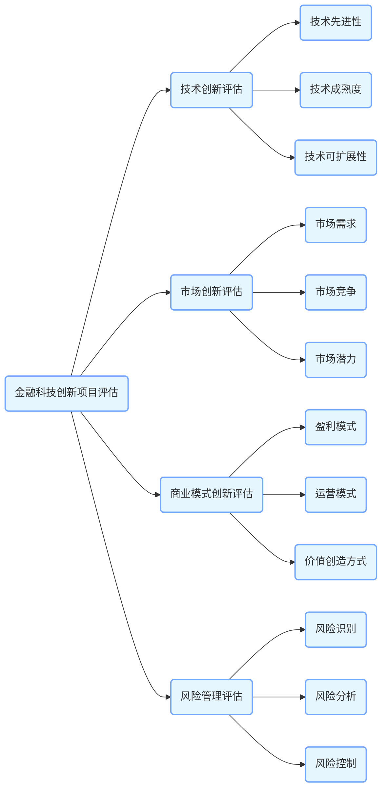

# 金融科技创新项目评估框架

> 关键词：金融科技、创新项目、评估框架、风险评估、价值评估

> 摘要：本文旨在构建一个全面、系统的金融科技创新项目评估框架。随着金融科技的快速发展，创新项目不断涌现，如何准确评估这些项目的可行性、风险和价值成为关键问题。文章首先介绍了金融科技创新项目评估的背景，包括目的、预期读者等。接着阐述了核心概念及联系，详细讲解了核心算法原理与具体操作步骤，并通过数学模型和公式进行深入分析。通过项目实战案例展示了评估框架的实际应用，探讨了其在不同场景下的作用。同时，推荐了相关的学习资源、开发工具和论文著作。最后总结了未来发展趋势与挑战，为金融科技创新项目的评估提供了全面的指导和参考。

## 1. 背景介绍 
### 1.1 目的和范围
金融科技领域正以前所未有的速度发展，新的创新项目层出不穷。这些项目涉及到金融业务的各个方面，如支付结算、借贷融资、投资管理等。然而，并非所有的创新项目都能取得成功，有些项目可能面临技术难题、市场风险、合规问题等。因此，建立一个科学、合理的评估框架对于筛选出有潜力的项目、降低投资风险、促进金融科技的健康发展具有重要意义。

本评估框架的范围涵盖了各类金融科技创新项目，包括基于区块链、人工智能、大数据、云计算等新兴技术的项目。旨在对项目的技术可行性、市场前景、商业模式、风险状况等进行全面评估，为项目的投资者、决策者和监管者提供参考依据。

### 1.2 预期读者
本评估框架的预期读者包括以下几类：
- **投资者**：包括风险投资机构、私募股权投资基金、银行等金融机构，他们希望通过评估框架筛选出有潜力的金融科技创新项目，降低投资风险，获取更高的回报。
- **金融科技企业**：帮助企业评估自身项目的优势和不足，以便进行改进和优化，提高项目的成功率和竞争力。
- **监管机构**：用于对金融科技创新项目进行监管，确保项目符合法律法规和监管要求，维护金融市场的稳定和安全。
- **研究人员**：为学术研究提供参考，推动金融科技领域的理论和实践发展。

### 1.3 文档结构概述
本文将按照以下结构展开：
- **核心概念与联系**：介绍金融科技创新项目评估的核心概念，如技术创新、市场创新、商业模式创新等，并阐述它们之间的联系。
- **核心算法原理 & 具体操作步骤**：详细讲解评估框架中所使用的核心算法，如层次分析法、模糊综合评价法等，并给出具体的操作步骤。
- **数学模型和公式 & 详细讲解 & 举例说明**：通过数学模型和公式对评估过程进行量化分析，并结合实际案例进行说明。
- **项目实战：代码实际案例和详细解释说明**：通过一个实际的金融科技创新项目案例，展示评估框架的具体应用，包括开发环境搭建、源代码实现和代码解读。
- **实际应用场景**：探讨评估框架在不同场景下的应用，如项目筛选、投资决策、监管合规等。
- **工具和资源推荐**：推荐相关的学习资源、开发工具和论文著作，帮助读者深入了解金融科技创新项目评估。
- **总结：未来发展趋势与挑战**：总结金融科技创新项目评估的未来发展趋势，并分析可能面临的挑战。
- **附录：常见问题与解答**：对读者可能遇到的常见问题进行解答。
- **扩展阅读 & 参考资料**：提供相关的扩展阅读材料和参考资料，供读者进一步学习和研究。

### 1.4 术语表
#### 1.4.1 核心术语定义
- **金融科技（Fintech）**：是指利用科技手段推动金融业务创新和发展的领域，融合了金融和信息技术。
- **创新项目**：是指具有创新性的金融科技项目，包括新产品、新服务、新商业模式等。
- **评估框架**：是指一套系统的方法和流程，用于对金融科技创新项目进行全面评估。
- **技术可行性**：是指项目所采用的技术是否可行，是否能够实现项目的目标。
- **市场前景**：是指项目所针对的市场需求和发展趋势，以及项目在市场中的竞争力。
- **商业模式**：是指项目的盈利模式、运营模式和价值创造方式。
- **风险评估**：是指对项目可能面临的风险进行识别、分析和评估。

#### 1.4.2 相关概念解释
- **区块链**：是一种分布式账本技术，具有去中心化、不可篡改、安全可靠等特点，可应用于金融领域的支付结算、证券交易等场景。
- **人工智能**：是指让计算机模拟人类智能的技术，包括机器学习、深度学习、自然语言处理等，可应用于金融领域的风险评估、客户服务等场景。
- **大数据**：是指海量的数据集合，通过对大数据的分析和挖掘，可以发现潜在的商业价值和风险，可应用于金融领域的信用评估、市场预测等场景。
- **云计算**：是指通过互联网提供计算资源和服务的技术，可应用于金融领域的系统架构、数据存储等场景。

#### 1.4.3 缩略词列表
- **AI**：Artificial Intelligence，人工智能
- **BD**：Big Data，大数据
- **BC**：Blockchain，区块链
- **CC**：Cloud Computing，云计算
- **AHP**：Analytic Hierarchy Process，层次分析法
- **FCE**：Fuzzy Comprehensive Evaluation，模糊综合评价法

## 2. 核心概念与联系 
### 核心概念原理
金融科技创新项目评估涉及多个核心概念，主要包括技术创新、市场创新、商业模式创新和风险管理。

#### 技术创新
技术创新是金融科技创新项目的基础，它推动了金融业务的数字化、智能化和自动化。例如，区块链技术的应用可以实现金融交易的去中心化和透明化，降低交易成本和风险；人工智能技术可以实现金融风险的智能评估和预测，提高金融服务的效率和质量。

#### 市场创新
市场创新是指项目能够满足市场的新需求或创造新的市场机会。例如，移动支付的出现满足了人们便捷支付的需求，创造了一个全新的支付市场；互联网金融平台的兴起为小微企业和个人提供了新的融资渠道，拓展了金融服务的市场范围。

#### 商业模式创新
商业模式创新是指项目的盈利模式、运营模式和价值创造方式的创新。例如，共享经济模式下的金融服务平台通过收取交易手续费、提供增值服务等方式实现盈利；金融科技公司通过与传统金融机构合作，实现资源共享和优势互补，创造了新的价值。

#### 风险管理
风险管理是金融科技创新项目评估的重要环节，它涉及到对项目可能面临的各种风险进行识别、分析和评估，并采取相应的措施进行风险控制。例如，信用风险、市场风险、操作风险、合规风险等。

### 架构的文本示意图
```plaintext
金融科技创新项目评估框架
|-- 技术创新评估
|   |-- 技术先进性
|   |-- 技术成熟度
|   |-- 技术可扩展性
|-- 市场创新评估
|   |-- 市场需求
|   |-- 市场竞争
|   |-- 市场潜力
|-- 商业模式创新评估
|   |-- 盈利模式
|   |-- 运营模式
|   |-- 价值创造方式
|-- 风险管理评估
|   |-- 风险识别
|   |-- 风险分析
|   |-- 风险控制
```

### Mermaid 流程图


## 3. 核心算法原理 & 具体操作步骤 
### 层次分析法（AHP）
#### 算法原理
层次分析法是一种将定性和定量分析相结合的多准则决策方法，它通过将复杂的问题分解为多个层次，建立层次结构模型，然后通过两两比较的方式确定各层次元素的相对重要性，最后综合计算得出各方案的权重。

#### Python 源代码实现
```python
import numpy as np

def ahp(matrix):
    n = matrix.shape[0]
    # 计算特征值和特征向量
    eigenvalues, eigenvectors = np.linalg.eig(matrix)
    # 找到最大特征值及其对应的特征向量
    max_eigenvalue_index = np.argmax(eigenvalues)
    max_eigenvalue = eigenvalues[max_eigenvalue_index].real
    eigenvector = eigenvectors[:, max_eigenvalue_index].real
    # 归一化特征向量
    weights = eigenvector / eigenvector.sum()
    # 一致性检验
    RI = [0, 0, 0.58, 0.90, 1.12, 1.24, 1.32, 1.41, 1.45]
    CI = (max_eigenvalue - n) / (n - 1)
    CR = CI / RI[n - 1]
    if CR < 0.1:
        print("一致性检验通过")
    else:
        print("一致性检验未通过，请调整判断矩阵")
    return weights

# 示例判断矩阵
matrix = np.array([[1, 3, 5],
                   [1/3, 1, 3],
                   [1/5, 1/3, 1]])

weights = ahp(matrix)
print("各元素的权重：", weights)
```

#### 具体操作步骤
1. **建立层次结构模型**：将问题分解为目标层、准则层和方案层。
2. **构造判断矩阵**：对同一层次的元素进行两两比较，确定它们的相对重要性，构造判断矩阵。
3. **计算特征值和特征向量**：通过求解判断矩阵的特征值和特征向量，得到各元素的权重。
4. **一致性检验**：计算一致性指标 $CI$ 和随机一致性比率 $CR$，判断判断矩阵的一致性是否满足要求。
5. **综合计算**：根据各层次元素的权重，综合计算得出各方案的权重。

### 模糊综合评价法（FCE）
#### 算法原理
模糊综合评价法是一种基于模糊数学的综合评价方法，它通过建立模糊评价矩阵，将定性评价转化为定量评价，然后通过加权平均的方式得到综合评价结果。

#### Python 源代码实现
```python
import numpy as np

def fce(weights, evaluation_matrix):
    # 计算模糊综合评价结果
    result = np.dot(weights, evaluation_matrix)
    # 归一化结果
    result = result / result.sum()
    return result

# 示例权重向量
weights = np.array([0.3, 0.5, 0.2])
# 示例评价矩阵
evaluation_matrix = np.array([[0.2, 0.3, 0.5],
                              [0.4, 0.4, 0.2],
                              [0.1, 0.6, 0.3]])

result = fce(weights, evaluation_matrix)
print("模糊综合评价结果：", result)
```

#### 具体操作步骤
1. **确定评价因素集和评语集**：评价因素集是指影响评价对象的各种因素，评语集是指对评价对象的各种评价等级。
2. **构造模糊评价矩阵**：通过专家打分或问卷调查的方式，确定每个评价因素对每个评语等级的隶属度，构造模糊评价矩阵。
3. **确定权重向量**：通过层次分析法或其他方法确定每个评价因素的权重。
4. **计算模糊综合评价结果**：将权重向量与模糊评价矩阵相乘，得到模糊综合评价结果。
5. **归一化结果**：将模糊综合评价结果进行归一化处理，得到最终的评价结果。

## 4. 数学模型和公式 & 详细讲解 & 举例说明 
### 层次分析法（AHP）
#### 数学模型和公式
设判断矩阵为 $A=(a_{ij})_{n\times n}$，其中 $a_{ij}$ 表示元素 $i$ 相对于元素 $j$ 的重要性程度，满足 $a_{ij}>0$，$a_{ji}=\frac{1}{a_{ij}}$，$a_{ii}=1$。

- **最大特征值 $\lambda_{max}$**：判断矩阵 $A$ 的最大特征值，通过求解特征方程 $|A - \lambda I| = 0$ 得到。
- **一致性指标 $CI$**：$CI=\frac{\lambda_{max}-n}{n - 1}$，其中 $n$ 为判断矩阵的阶数。
- **随机一致性比率 $CR$**：$CR=\frac{CI}{RI}$，其中 $RI$ 为随机一致性指标，其值与判断矩阵的阶数有关。

#### 详细讲解
一致性检验的目的是判断判断矩阵是否具有一致性，即判断矩阵的元素是否满足传递性。如果 $CR<0.1$，则认为判断矩阵具有满意的一致性；否则，需要对判断矩阵进行调整。

#### 举例说明
假设有三个因素 $A$、$B$、$C$，其判断矩阵为：
$$
A = \begin{bmatrix}
1 & 3 & 5 \\
\frac{1}{3} & 1 & 3 \\
\frac{1}{5} & \frac{1}{3} & 1
\end{bmatrix}
$$
1. **计算最大特征值 $\lambda_{max}$**：
通过求解特征方程 $|A - \lambda I| = 0$，得到 $\lambda_{max}\approx 3.0385$。
2. **计算一致性指标 $CI$**：
$CI=\frac{\lambda_{max}-n}{n - 1}=\frac{3.0385 - 3}{3 - 1}=0.01925$
3. **计算随机一致性比率 $CR$**：
当 $n = 3$ 时，$RI = 0.58$，则 $CR=\frac{CI}{RI}=\frac{0.01925}{0.58}\approx 0.0332<0.1$，一致性检验通过。
4. **计算特征向量并归一化**：
求解判断矩阵 $A$ 的特征向量，得到最大特征值对应的特征向量为 $[0.6488, 0.2631, 0.0881]^T$，归一化后得到权重向量为 $[0.6488 / (0.6488 + 0.2631 + 0.0881), 0.2631 / (0.6488 + 0.2631 + 0.0881), 0.0881 / (0.6488 + 0.2631 + 0.0881)]^T=[0.6488, 0.2631, 0.0881]^T$。

### 模糊综合评价法（FCE）
#### 数学模型和公式
设评价因素集为 $U = \{u_1, u_2, \cdots, u_m\}$，评语集为 $V = \{v_1, v_2, \cdots, v_n\}$，模糊评价矩阵为 $R=(r_{ij})_{m\times n}$，其中 $r_{ij}$ 表示因素 $u_i$ 对评语 $v_j$ 的隶属度，权重向量为 $W = (w_1, w_2, \cdots, w_m)$，满足 $\sum_{i = 1}^{m}w_i = 1$。

- **模糊综合评价结果 $B$**：$B = W\times R=(b_1, b_2, \cdots, b_n)$，其中 $b_j=\sum_{i = 1}^{m}w_ir_{ij}$，$j = 1, 2, \cdots, n$。

#### 详细讲解
模糊综合评价法通过将定性评价转化为定量评价，考虑了多个评价因素的影响，能够更全面、客观地评价对象。

#### 举例说明
假设有三个评价因素 $u_1$、$u_2$、$u_3$，权重向量为 $W = [0.3, 0.5, 0.2]$，评语集为 $V = \{优, 良, 中\}$，模糊评价矩阵为：
$$
R = \begin{bmatrix}
0.2 & 0.3 & 0.5 \\
0.4 & 0.4 & 0.2 \\
0.1 & 0.6 & 0.3
\end{bmatrix}
$$
1. **计算模糊综合评价结果 $B$**：
$B = W\times R=[0.3\times0.2 + 0.5\times0.4 + 0.2\times0.1, 0.3\times0.3 + 0.5\times0.4 + 0.2\times0