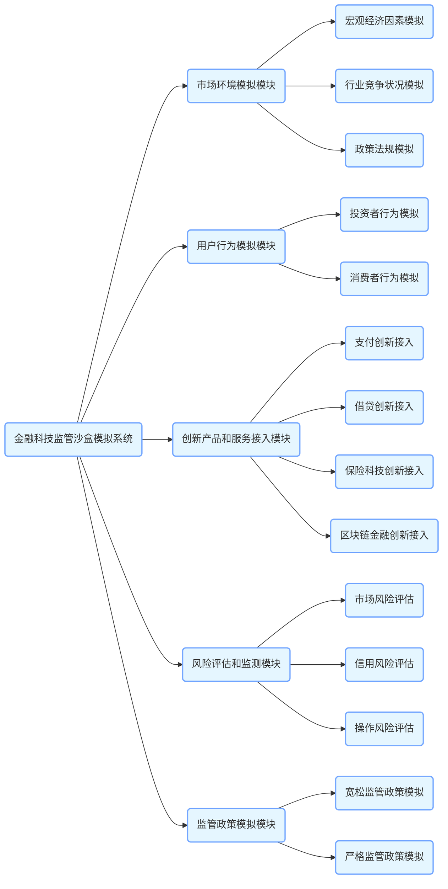

# 金融科技监管沙盒模拟系统

> 关键词：金融科技、监管沙盒、模拟系统、风险控制、合规性

> 摘要：本文围绕金融科技监管沙盒模拟系统展开深入探讨。首先介绍了该系统的背景，包括目的、预期读者、文档结构和相关术语。接着阐述了核心概念与联系，通过文本示意图和 Mermaid 流程图呈现其架构。详细讲解了核心算法原理及具体操作步骤，结合 Python 源代码进行说明。对系统涉及的数学模型和公式进行了分析，并举例说明。通过项目实战展示了系统的代码实现和解读。探讨了该系统的实际应用场景，推荐了相关的学习资源、开发工具框架以及论文著作。最后总结了系统的未来发展趋势与挑战，提供了常见问题解答和扩展阅读参考资料。旨在全面、深入地介绍金融科技监管沙盒模拟系统，为相关从业者和研究者提供有价值的参考。

## 1. 背景介绍 
### 1.1 目的和范围
金融科技的快速发展给金融行业带来了创新和变革，但同时也带来了新的风险和挑战。监管机构需要在鼓励创新和防范风险之间找到平衡。监管沙盒模拟系统的目的在于为金融科技企业和监管机构提供一个安全、可控的环境，让创新型金融产品和服务在真实市场环境的模拟场景中进行测试，以便监管机构更好地了解创新带来的风险和影响，评估其合规性，同时也让金融科技企业能够在不违反现有法规的前提下进行创新尝试。

本系统的范围涵盖了多种金融科技领域，包括但不限于支付、借贷、保险科技、区块链金融等。它可以模拟不同的市场环境、用户行为和监管政策，对各类金融科技创新进行全面的测试和评估。

### 1.2 预期读者
- **金融科技企业**：希望通过在模拟环境中测试创新产品和服务，降低风险，提高成功概率，同时更好地满足监管要求的企业。
- **监管机构**：需要深入了解金融科技创新的风险和影响，制定合理监管政策的监管部门。
- **金融研究机构和学者**：对金融科技监管和创新机制感兴趣，希望通过系统进行研究和教学的机构和个人。
- **投资者**：希望了解金融科技项目的风险和潜力，以便做出更明智投资决策的投资者。

### 1.3 文档结构概述
本文将按照以下结构进行阐述：首先介绍金融科技监管沙盒模拟系统的背景信息，包括目的、预期读者等。接着深入探讨系统的核心概念与联系，通过文本示意图和 Mermaid 流程图展示其架构。然后详细讲解系统的核心算法原理和具体操作步骤，结合 Python 源代码进行说明。对系统涉及的数学模型和公式进行分析，并举例说明。通过项目实战展示系统的代码实现和解读。探讨系统的实际应用场景，推荐相关的学习资源、开发工具框架以及论文著作。最后总结系统的未来发展趋势与挑战，提供常见问题解答和扩展阅读参考资料。

### 1.4 术语表
#### 1.4.1 核心术语定义
- **金融科技（FinTech）**：指利用科技手段推动金融创新，形成对金融市场、机构及金融服务产生重大影响的业务模式、技术应用以及流程和产品。
- **监管沙盒（Regulatory Sandbox）**：是一种由监管机构提供的政策工具，允许金融科技企业在可控的环境中对创新产品、服务、商业模式和交付机制进行真实或虚拟测试，而无需在测试期间完全遵守现有监管规定。
- **模拟系统（Simulation System）**：通过计算机技术对现实世界的金融市场、用户行为、监管政策等进行建模和仿真，以评估金融科技创新的效果和风险。

#### 1.4.2 相关概念解释
- **合规性（Compliance）**：指金融科技企业的产品和服务必须符合法律法规、监管要求以及行业标准。
- **风险评估（Risk Assessment）**：对金融科技创新可能面临的各种风险进行识别、分析和评估，包括市场风险、信用风险、操作风险等。
- **市场环境（Market Environment）**：包括宏观经济因素、行业竞争状况、政策法规等影响金融市场运行的各种因素。

#### 1.4.3 缩略词列表
- **API（Application Programming Interface）**：应用程序编程接口，用于不同系统之间的交互和数据传输。
- **AI（Artificial Intelligence）**：人工智能，用于模拟人类智能的技术和方法。
- **ML（Machine Learning）**：机器学习，人工智能的一个分支，通过数据和算法来训练模型，实现预测和决策。

## 2. 核心概念与联系 

### 核心概念原理
金融科技监管沙盒模拟系统的核心原理是通过建立一个虚拟的金融市场环境，模拟各种真实的市场条件和用户行为，让金融科技企业的创新产品和服务在这个环境中进行测试。监管机构可以在测试过程中实时监测和评估创新的风险和合规性，根据测试结果调整监管政策。

系统主要由以下几个部分组成：
- **市场环境模拟模块**：模拟宏观经济因素、行业竞争状况、政策法规等市场环境因素。
- **用户行为模拟模块**：模拟不同类型用户的行为，如投资者、消费者等。
- **创新产品和服务接入模块**：允许金融科技企业将其创新产品和服务接入系统进行测试。
- **风险评估和监测模块**：对测试过程中的风险进行实时评估和监测。
- **监管政策模拟模块**：模拟不同的监管政策，评估创新产品和服务在不同政策环境下的合规性。

### 架构的文本示意图
```plaintext
金融科技监管沙盒模拟系统
|-- 市场环境模拟模块
|   |-- 宏观经济因素模拟
|   |-- 行业竞争状况模拟
|   |-- 政策法规模拟
|-- 用户行为模拟模块
|   |-- 投资者行为模拟
|   |-- 消费者行为模拟
|-- 创新产品和服务接入模块
|   |-- 支付创新接入
|   |-- 借贷创新接入
|   |-- 保险科技创新接入
|   |-- 区块链金融创新接入
|-- 风险评估和监测模块
|   |-- 市场风险评估
|   |-- 信用风险评估
|   |-- 操作风险评估
|-- 监管政策模拟模块
|   |-- 宽松监管政策模拟
|   |-- 严格监管政策模拟
```

### Mermaid 流程图


## 3. 核心算法原理 & 具体操作步骤 

### 核心算法原理
金融科技监管沙盒模拟系统涉及多种算法，以下介绍几种核心算法：

#### 蒙特卡罗模拟算法
蒙特卡罗模拟算法用于模拟市场环境和用户行为的不确定性。其基本思想是通过随机抽样的方法生成大量的可能场景，然后对每个场景进行分析和评估。例如，在模拟股票价格波动时，可以使用蒙特卡罗模拟算法生成不同的股票价格路径，从而评估投资组合的风险。

#### 机器学习算法
机器学习算法用于风险评估和预测。例如，可以使用决策树算法对用户的信用风险进行评估，使用神经网络算法对市场趋势进行预测。

### 具体操作步骤及 Python 源代码

#### 蒙特卡罗模拟算法示例
以下是一个简单的蒙特卡罗模拟算法示例，用于模拟股票价格的波动：

```python
import numpy as np
import matplotlib.pyplot as plt

# 定义参数
S0 = 100  # 初始股票价格
mu = 0.1  # 股票的预期收益率
sigma = 0.2  # 股票的波动率
T = 1  # 时间期限（年）
N = 252  # 交易天数
M = 1000  # 模拟次数

# 计算时间间隔
dt = T / N

# 生成随机数
np.random.seed(0)
Z = np.random.normal(0, 1, (M, N))

# 初始化股票价格数组
S = np.zeros((M, N + 1))
S[:, 0] = S0

# 进行蒙特卡罗模拟
for i in range(M):
    for j in range(N):
        S[i, j + 1] = S[i, j] * np.exp((mu - 0.5 * sigma ** 2) * dt + sigma * np.sqrt(dt) * Z[i, j])

# 绘制模拟结果
plt.figure(figsize=(10, 6))
for i in range(M):
    plt.plot(S[i, :])
plt.title('Monte Carlo Simulation of Stock Prices')
plt.xlabel('Trading Days')
plt.ylabel('Stock Price')
plt.show()
```

#### 机器学习算法示例
以下是一个使用决策树算法进行信用风险评估的示例：

```python
from sklearn.datasets import load_breast_cancer
from sklearn.model_selection import train_test_split
from sklearn.tree import DecisionTreeClassifier
from sklearn.metrics import accuracy_score

# 加载数据集
data = load_breast_cancer()
X = data.data
y = data.target

# 划分训练集和测试集
X_train, X_test, y_train, y_test = train_test_split(X, y, test_size=0.2, random_state=42)

# 创建决策树分类器
clf = DecisionTreeClassifier()

# 训练模型
clf.fit(X_train, y_train)

# 预测
y_pred = clf.predict(X_test)

# 计算准确率
accuracy = accuracy_score(y_test, y_pred)
print(f"Accuracy: {accuracy}")
```

## 4. 数学模型和公式 & 详细讲解 & 举例说明 

### 蒙特卡罗模拟的数学模型和公式
在蒙特卡罗模拟股票价格波动的例子中，使用的数学模型是几何布朗运动（Geometric Brownian Motion, GBM）。GBM 的随机微分方程为：

$$dS_t = \mu S_t dt + \sigma S_t dW_t$$

其中：
- $S_t$ 是股票在时间 $t$ 的价格。
- $\mu$ 是股票的预期收益率。
- $\sigma$ 是股票的波动率。
- $dW_t$ 是维纳过程的增量，服从正态分布 $N(0, dt)$。

通过对上述随机微分方程进行离散化，可以得到离散时间的股票价格更新公式：

$$S_{t + \Delta t} = S_t \exp\left((\mu - \frac{1}{2}\sigma^2)\Delta t + \sigma \sqrt{\Delta t} \epsilon\right)$$

其中 $\epsilon$ 是标准正态分布的随机变量。

### 举例说明
假设初始股票价格 $S_0 = 100$，预期收益率 $\mu = 0.1$，波动率 $\sigma = 0.2$，时间期限 $T = 1$ 年，交易天数 $N = 252$。使用上述公式进行蒙特卡罗模拟，生成 1000 条股票价格路径。通过模拟结果可以分析股票价格的波动范围、不同价格水平的概率等信息，从而评估投资组合的风险。

### 机器学习算法的数学模型和公式
以决策树算法为例，决策树是一种基于树结构进行决策的模型。决策树的每个内部节点是一个属性上的测试，每个分支是测试输出，每个叶节点是一个类别或值。

决策树的构建过程通常基于信息增益（Information Gain）或基尼不纯度（Gini Impurity）等准则。信息增益的计算公式为：

$$IG(S, A) = H(S) - \sum_{v \in Values(A)} \frac{|S_v|}{|S|} H(S_v)$$

其中：
- $IG(S, A)$ 是属性 $A$ 相对于数据集 $S$ 的信息增益。
- $H(S)$ 是数据集 $S$ 的熵，计算公式为 $H(S) = -\sum_{i = 1}^{n} p_i \log_2 p_i$，其中 $p_i$ 是类别 $i$ 在数据集 $S$ 中的概率。
- $S_v$ 是数据集 $S$ 中属性 $A$ 取值为 $v$ 的子集。

基尼不纯度的计算公式为：

$$Gini(S) = 1 - \sum_{i = 1}^{n} p_i^2$$

决策树算法通过选择信息增益最大或基尼不纯度最小的属性作为分裂属性，逐步构建决策树。

### 举例说明
在信用风险评估的例子中，使用决策树算法对乳腺癌数据集进行分类。通过计算不同属性的信息增益或基尼不纯度，选择最优的分裂属性，构建决策树模型。模型训练完成后，可以对新的样本进行分类预测，判断其是否为恶性肿瘤。

## 5. 项目实战：代码实际案例和详细解释说明 

### 5.1  开发环境搭建
#### 硬件环境
- **服务器**：建议使用具有较高性能的服务器，如 Intel Xeon 系列处理器，至少 16GB 内存，500GB 以上硬盘空间。
- **客户端**：普通 PC 机或笔记本电脑，具备基本的计算和显示能力。

#### 软件环境
- **操作系统**：服务器端建议使用 Linux 系统，如 Ubuntu 18.04 或 CentOS 7；客户端可以使用 Windows、Mac OS 或 Linux 系统。
- **编程语言**：Python 3.7 及以上版本。
- **数据库**：MySQL 或 PostgreSQL 用于存储系统数据。
- **开发框架**：Django 或 Flask 用于开发 Web 应用。

#### 安装依赖库
使用以下命令安装所需的 Python 库：

```bash
pip install numpy pandas matplotlib scikit-learn django
```

### 5.2  源代码详细实现和代码解读
以下是一个简化的金融科技监管沙盒模拟系统的 Web 应用示例，使用 Django 框架：

#### 项目创建
```bash
django-admin startproject fintech_sandbox
cd fintech_sandbox
python manage.py startapp sandbox_app
```

#### 模型定义
在 `sandbox_app/models.py` 中定义模型：

```python
from django.db import models

class InnovationProduct(models.Model):
    name = models.CharField(max_length=200)
    description = models.TextField()
    type_choices = (
        ('payment', 'Payment'),
        ('lending', 'Lending'),
        ('insurance', 'Insurance'),
        ('blockchain', 'Blockchain')
    )
    product_type = models.CharField(max_length=20, choices=type_choices)
    created_at = models.DateTimeField(auto_now_add=True)

    def __str__(self):
        return self.name
```

#### 视图函数
在 `sandbox_app/views.py` 中定义视图函数：

```python
from django.shortcuts import render
from .models import InnovationProduct

def product_list(request):
    products = InnovationProduct.objects.all()
    return render(request, 'sandbox_app/product_list.html', {'products': products})
```

#### 模板文件
在 `sandbox_app/templates/sandbox_app/product_list.html` 中创建模板文件：

```html
<!DOCTYPE html>
<html lang="en">
<head>
    <meta charset="UTF-8">
    <title>Innovation Products</title>
</head>
<body>
    <h1>Innovation Products</h1>
    <ul>
        
            <li>{{ product.name }} - {{ product.product_type }}</li>
        
    </ul>
</body>
</html>
```

#### URL 配置
在 `sandbox_app/urls.py` 中配置 URL：

```python
from django.urls import path
from .views import product_list

urlpatterns = [
    path('products/', product_list, name='product_list'),
]
```

在 `fintech_sandbox/urls.py` 中包含 `sandbox_app` 的 URL 配置：

```python
from django.contrib import admin
from django.urls import path, include

urlpatterns = [
    path('admin/', admin.site.urls),
    path('', include('sandbox_app.urls')),
]
```

### 5.3  代码解读与分析
- **模型定义**：`InnovationProduct` 模型用于存储金融科技企业的创新产品信息，包括产品名称、描述、产品类型和创建时间。
- **视图函数**：`product_list` 视图函数从数据库中获取所有创新产品信息，并将其传递给模板文件进行渲染。
- **模板文件**：`product_list.html` 模板文件用于显示创新产品列表。
- **URL 配置**：通过 URL 配置将不同的 URL 路径映射到相应的视图函数。

